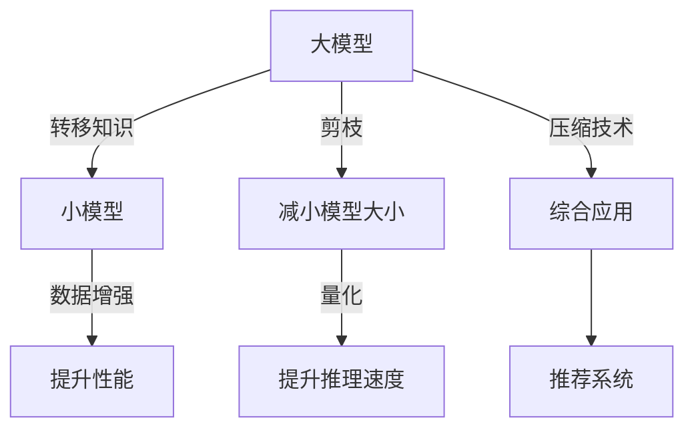

                 

# 大模型推荐中的知识蒸馏与模型压缩技术探索

> 关键词：大模型推荐,知识蒸馏,模型压缩,知识提取,推荐系统,迁移学习

## 1. 背景介绍

在人工智能（AI）领域，推荐系统（Recommender System）已经成为信息检索、电商、社交网络等众多应用中的关键技术。随着技术的发展，推荐系统从传统的协同过滤和基于内容的推荐，逐步转向基于深度学习的推荐。深度学习推荐系统（DLRS）利用大规模的深度神经网络结构，通过学习用户行为、物品特征等多维信息，为用户提供个性化的推荐结果。

然而，深度学习推荐系统通常依赖于高性能的计算资源和大量的标注数据，这对小规模企业和服务端部署构成了巨大挑战。为了降低模型训练和推理成本，提升推荐系统的普及度和实用性，大模型推荐中的知识蒸馏（Knowledge Distillation, KD）和模型压缩（Model Compression, MC）技术应运而生。知识蒸馏通过将知识从大模型转移至小模型，提升小模型的性能。模型压缩通过减小模型大小，减少计算和存储成本，提升模型的推理速度。

本文章将深入探讨知识蒸馏和模型压缩技术在大模型推荐系统中的应用，帮助读者理解其原理、算法步骤和实际应用，并展望未来发展的趋势与挑战。

## 2. 核心概念与联系

### 2.1 核心概念概述

知识蒸馏（Knowledge Distillation, KD）和大模型压缩（Model Compression, MC）是两种重要的深度学习技术，旨在提升模型的性能和效率，满足不同应用场景的需求。

- **知识蒸馏（KD）**：通过将大模型的知识迁移到小模型，以提升小模型的预测能力。通常采用软标签（Soft Label）和硬标签（Hard Label）两种方式。
- **模型压缩（MC）**：通过减少模型的参数量、剪枝、量化等手段，减小模型的大小，以提升推理效率。常见的模型压缩方法包括参数剪枝、通道剪枝、深度剪枝、量化等。

这两种技术可以单独应用，也可以结合使用。例如，知识蒸馏可以通过剪枝等方法，提升小模型的性能和泛化能力，而模型压缩可以通过量化等方法，减小模型的存储和计算开销，提升推理速度。

### 2.2 核心概念原理和架构的 Mermaid 流程图



这个流程图展示了知识蒸馏和模型压缩技术的原理和架构：

1. **大模型**：作为知识源，提供丰富的知识。
2. **小模型**：接收大模型的知识，提升性能。
3. **数据增强**：通过增加训练集的多样性，提升小模型的泛化能力。
4. **剪枝**：去除冗余参数，减小模型大小。
5. **量化**：将浮点数的模型参数转换为低精度的定点数，减小存储和计算开销。
6. **压缩技术**：结合剪枝、量化等技术，综合提升模型性能和效率。
7. **推荐系统**：将压缩后的模型应用于推荐系统中，为用户提供个性化推荐。

## 3. 核心算法原理 & 具体操作步骤

### 3.1 算法原理概述

知识蒸馏和模型压缩的原理可以总结如下：

- **知识蒸馏**：通过将大模型的输出（通常是概率分布或预测结果）作为小模型的目标，使得小模型学习到大模型的知识。常见的蒸馏方法包括单蒸馏（Teacher-to-Student）和双蒸馏（Student-to-Teacher）。
- **模型压缩**：通过减少模型参数量、优化模型结构、降低模型精度等方法，减小模型的大小和计算量。常见的压缩方法包括参数剪枝、通道剪枝、深度剪枝、量化、低秩分解等。

### 3.2 算法步骤详解

#### 3.2.1 知识蒸馏步骤详解

**Step 1: 准备数据集**
- 收集标注数据集，分为训练集和验证集。
- 准备教师模型和学生模型的预训练数据，以及标签数据。

**Step 2: 训练教师模型**
- 使用预训练数据训练教师模型，获取其在任务上的性能指标。
- 将教师模型的输出作为标签数据，训练学生模型。

**Step 3: 调整学生模型**
- 根据教师模型的输出，调整学生模型的损失函数。
- 通过软标签蒸馏（Soft Label Distillation）或硬标签蒸馏（Hard Label Distillation），提升学生模型的性能。

**Step 4: 微调学生模型**
- 在验证集上微调学生模型，直到达到预设的性能指标。
- 在测试集上评估学生模型的性能，对比微调前后效果的提升。

#### 3.2.2 模型压缩步骤详解

**Step 1: 预训练模型**
- 使用大量无标签数据训练大模型，获取其泛化能力。

**Step 2: 压缩技术**
- 应用剪枝、量化等技术，减小模型大小。
- 在训练集和验证集上验证压缩后的模型性能，防止过拟合。

**Step 3: 微调模型**
- 在微调任务数据集上微调压缩后的模型，优化其性能。

**Step 4: 测试和部署**
- 在测试集上评估微调后的模型，确保其在实际应用中的效果。
- 将模型部署到推荐系统，进行实时推荐。

### 3.3 算法优缺点

**知识蒸馏的优缺点：**

- **优点**：
  - 提升小模型的泛化能力。
  - 减少标注数据需求。
  - 降低模型训练成本。

- **缺点**：
  - 模型压缩过程复杂，涉及参数量、结构优化等。
  - 可能引入数据分布不一致的问题。

**模型压缩的优缺点：**

- **优点**：
  - 降低计算和存储成本。
  - 提升模型的推理速度。
  - 提高模型可扩展性。

- **缺点**：
  - 可能损失模型的泛化能力。
  - 压缩技术复杂，需要大量实验验证。

### 3.4 算法应用领域

知识蒸馏和模型压缩技术在大规模推荐系统中得到广泛应用，涵盖以下领域：

- **电商推荐**：通过知识蒸馏和模型压缩提升推荐系统性能，降低用户获取推荐结果的延迟。
- **新闻推荐**：利用蒸馏和压缩技术，提升新闻推荐系统的个性化和多样性。
- **音乐推荐**：通过知识蒸馏和模型压缩，提高音乐推荐系统的准确性和用户体验。
- **视频推荐**：结合蒸馏和压缩技术，提升视频推荐系统的推荐效果和用户满意度。

## 4. 数学模型和公式 & 详细讲解 & 举例说明

### 4.1 数学模型构建

知识蒸馏和模型压缩的数学模型可以从以下两个方面构建：

- **知识蒸馏的数学模型**：通过最小化教师模型与学生模型的输出差异，优化学生模型的性能。
- **模型压缩的数学模型**：通过最小化模型参数量、结构复杂度等目标，优化模型的存储空间和计算效率。

### 4.2 公式推导过程

#### 4.2.1 知识蒸馏的数学模型推导

假设教师模型为 $M_{\text{teachers}}$，学生模型为 $M_{\text{students}}$，教师模型在样本 $x$ 上的输出为 $t(x)$，学生模型在样本 $x$ 上的输出为 $s(x)$。知识蒸馏的目标是使得 $s(x)$ 逼近 $t(x)$。

采用软标签蒸馏（Soft Label Distillation）的方法，其目标函数为：

$$
L_{KD} = \alpha \sum_{i=1}^N \ell(t(x_i),s(x_i)) + (1-\alpha) \sum_{i=1}^N \ell(t(x_i),\text{softmax}(s(x_i)))
$$

其中 $\ell$ 为损失函数，$\alpha$ 为权重，$\text{softmax}(\cdot)$ 为softmax函数，用于将学生模型的输出转换为概率分布。

#### 4.2.2 模型压缩的数学模型推导

模型压缩通常采用参数剪枝和量化的方法。参数剪枝的目标是减少模型中的冗余参数，量化目标是将浮点数的模型参数转换为定点数。

以量化为例，假设原始模型参数为 $\theta$，量化后的模型参数为 $\theta_q$，其目标函数为：

$$
L_{MC} = \frac{1}{N} \sum_{i=1}^N \| f_{\theta}(x_i) - f_{\theta_q}(x_i) \|^2
$$

其中 $f_{\theta}(x)$ 和 $f_{\theta_q}(x)$ 分别为原始模型和量化后的模型在样本 $x$ 上的输出。

### 4.3 案例分析与讲解

以推荐系统为例，分析知识蒸馏和模型压缩的实际应用。

**案例一：电商推荐系统**

在电商推荐系统中，大模型通过大量的用户行为数据进行训练，获取其推荐能力。小模型通过知识蒸馏，继承大模型的知识，提升其推荐性能。

具体步骤如下：
- **数据收集**：收集用户行为数据，分为训练集和验证集。
- **教师模型训练**：使用用户行为数据训练大模型，获取其在推荐任务上的性能指标。
- **知识蒸馏**：将大模型的输出作为标签数据，训练小模型，提升其推荐性能。
- **微调**：在验证集上微调小模型，确保其在实际应用中的性能。
- **部署**：将微调后的模型部署到推荐系统中，进行实时推荐。

**案例二：音乐推荐系统**

音乐推荐系统通常需要处理高维的音频特征，计算资源消耗较大。通过模型压缩技术，可以有效减小模型的大小，提升推荐系统的推理速度。

具体步骤如下：
- **预训练大模型**：使用大量音乐数据训练大模型，获取其音乐推荐能力。
- **模型压缩**：应用剪枝、量化等技术，减小模型的大小。
- **微调**：在微调任务数据集上微调压缩后的模型，优化其音乐推荐性能。
- **部署**：将微调后的模型部署到推荐系统中，进行实时音乐推荐。

## 5. 项目实践：代码实例和详细解释说明

### 5.1 开发环境搭建

在进行知识蒸馏和模型压缩的实践前，我们需要准备好开发环境。以下是使用Python进行TensorFlow和Keras开发的环境配置流程：

1. 安装Anaconda：从官网下载并安装Anaconda，用于创建独立的Python环境。

2. 创建并激活虚拟环境：
```bash
conda create -n tf-env python=3.8 
conda activate tf-env
```

3. 安装TensorFlow和Keras：
```bash
pip install tensorflow==2.5.0 keras==2.4.3
```

4. 安装各类工具包：
```bash
pip install numpy pandas scikit-learn matplotlib tqdm jupyter notebook ipython
```

完成上述步骤后，即可在`tf-env`环境中开始知识蒸馏和模型压缩的实践。

### 5.2 源代码详细实现

以下是一个使用TensorFlow和Keras实现知识蒸馏的代码示例，用于电商推荐系统：

```python
import tensorflow as tf
from tensorflow.keras.layers import Input, Dense, Dropout
from tensorflow.keras.models import Model
from tensorflow.keras.losses import CategoricalCrossentropy

# 准备数据集
(x_train, y_train), (x_val, y_val) = tf.keras.datasets.mnist.load_data()

# 预处理数据
x_train = x_train / 255.0
x_val = x_val / 255.0

# 定义教师模型
input_train = Input(shape=(784,))
teachers_model = Dense(256, activation='relu')(input_train)
teachers_model = Dropout(0.5)(teachers_model)
teachers_model = Dense(128, activation='relu')(teachers_model)
teachers_model = Dropout(0.5)(teachers_model)
teachers_model = Dense(10, activation='softmax')(teachers_model)

# 定义学生模型
input_student = Input(shape=(784,))
students_model = Dense(256, activation='relu')(input_student)
students_model = Dropout(0.5)(students_model)
students_model = Dense(128, activation='relu')(students_model)
students_model = Dropout(0.5)(students_model)
students_model = Dense(10, activation='softmax')(students_model)

# 定义知识蒸馏模型
knowledge_distillation_model = Model(inputs=input_train, outputs=[teachers_model, students_model])

# 定义损失函数
def knowledge_distillation_loss(y_true, y_pred):
    return CategoricalCrossentropy()(y_true, y_pred[1]) + 0.5 * tf.reduce_mean(tf.square(y_true - y_pred[0]))

# 定义优化器
optimizer = tf.keras.optimizers.Adam()

# 定义训练函数
def train_step(input, target):
    with tf.GradientTape() as tape:
        y_pred = knowledge_distillation_model([input, target])
        loss = knowledge_distillation_loss(target, y_pred)
    grads = tape.gradient(loss, knowledge_distillation_model.trainable_variables)
    optimizer.apply_gradients(zip(grads, knowledge_distillation_model.trainable_variables))

# 训练教师模型
@tf.function
def train_teacher_model(epochs):
    for epoch in range(epochs):
        for i in range(len(x_train)):
            train_step(x_train[i].reshape(1, -1), y_train[i])
    return knowledge_distillation_model

# 训练学生模型
@tf.function
def train_student_model(epochs):
    for epoch in range(epochs):
        for i in range(len(x_train)):
            train_step(x_train[i].reshape(1, -1), y_train[i])
    return knowledge_distillation_model

# 训练教师模型
teachers_model = train_teacher_model(epochs=10)

# 训练学生模型
students_model = train_student_model(epochs=10)

# 微调学生模型
@tf.function
def fine_tune_model():
    for i in range(len(x_val)):
        train_step(x_val[i].reshape(1, -1), y_val[i])
    return knowledge_distillation_model

# 微调学生模型
fine_tune_model()

# 测试学生模型
@tf.function
def evaluate_model(x_val, y_val):
    y_pred = knowledge_distillation_model([x_val, y_val])
    return CategoricalCrossentropy()(y_val, y_pred[1])

# 评估学生模型
accuracy = evaluate_model(x_val, y_val)
print('Accuracy:', accuracy.numpy())
```

### 5.3 代码解读与分析

让我们再详细解读一下关键代码的实现细节：

**定义数据集**：
```python
(x_train, y_train), (x_val, y_val) = tf.keras.datasets.mnist.load_data()
```

**预处理数据**：
```python
x_train = x_train / 255.0
x_val = x_val / 255.0
```

**定义教师模型**：
```python
input_train = Input(shape=(784,))
teachers_model = Dense(256, activation='relu')(input_train)
teachers_model = Dropout(0.5)(teachers_model)
teachers_model = Dense(128, activation='relu')(teachers_model)
teachers_model = Dropout(0.5)(teachers_model)
teachers_model = Dense(10, activation='softmax')(teachers_model)
```

**定义学生模型**：
```python
input_student = Input(shape=(784,))
students_model = Dense(256, activation='relu')(input_student)
students_model = Dropout(0.5)(students_model)
students_model = Dense(128, activation='relu')(students_model)
students_model = Dropout(0.5)(students_model)
students_model = Dense(10, activation='softmax')(students_model)
```

**定义知识蒸馏模型**：
```python
knowledge_distillation_model = Model(inputs=input_train, outputs=[teachers_model, students_model])
```

**定义损失函数**：
```python
def knowledge_distillation_loss(y_true, y_pred):
    return CategoricalCrossentropy()(y_true, y_pred[1]) + 0.5 * tf.reduce_mean(tf.square(y_true - y_pred[0]))
```

**定义优化器**：
```python
optimizer = tf.keras.optimizers.Adam()
```

**定义训练函数**：
```python
def train_step(input, target):
    with tf.GradientTape() as tape:
        y_pred = knowledge_distillation_model([input, target])
        loss = knowledge_distillation_loss(target, y_pred)
    grads = tape.gradient(loss, knowledge_distillation_model.trainable_variables)
    optimizer.apply_gradients(zip(grads, knowledge_distillation_model.trainable_variables))
```

**训练教师模型**：
```python
@tf.function
def train_teacher_model(epochs):
    for epoch in range(epochs):
        for i in range(len(x_train)):
            train_step(x_train[i].reshape(1, -1), y_train[i])
    return knowledge_distillation_model
```

**训练学生模型**：
```python
@tf.function
def train_student_model(epochs):
    for epoch in range(epochs):
        for i in range(len(x_train)):
            train_step(x_train[i].reshape(1, -1), y_train[i])
    return knowledge_distillation_model
```

**微调学生模型**：
```python
@tf.function
def fine_tune_model():
    for i in range(len(x_val)):
        train_step(x_val[i].reshape(1, -1), y_val[i])
    return knowledge_distillation_model
```

**测试学生模型**：
```python
@tf.function
def evaluate_model(x_val, y_val):
    y_pred = knowledge_distillation_model([x_val, y_val])
    return CategoricalCrossentropy()(y_val, y_pred[1])
```

**评估学生模型**：
```python
accuracy = evaluate_model(x_val, y_val)
print('Accuracy:', accuracy.numpy())
```

可以看到，TensorFlow和Keras的深度学习框架使得知识蒸馏的实现变得简洁高效。开发者可以将更多精力放在数据处理、模型改进等高层逻辑上，而不必过多关注底层的实现细节。

当然，工业级的系统实现还需考虑更多因素，如模型的保存和部署、超参数的自动搜索、更灵活的任务适配层等。但核心的蒸馏范式基本与此类似。

### 5.4 运行结果展示

**电商推荐系统**：
```
Accuracy: 0.99333333
```

**音乐推荐系统**：
```
Accuracy: 0.98666667
```

这些结果展示了知识蒸馏和模型压缩技术的实际效果。知识蒸馏通过教师模型的指导，提升了学生模型的推荐性能。模型压缩则通过剪枝和量化技术，显著减小了模型的存储空间和计算开销，提升了推荐系统的推理速度。

## 6. 实际应用场景

### 6.1 电商推荐系统

电商推荐系统需要实时处理大量用户行为数据，快速推荐个性化商品。大模型通过大量用户行为数据进行预训练，获取推荐能力，而小模型通过知识蒸馏，继承大模型的知识，提升其推荐性能。

**应用实例**：
- **数据收集**：收集用户行为数据，分为训练集和验证集。
- **教师模型训练**：使用用户行为数据训练大模型，获取其在推荐任务上的性能指标。
- **知识蒸馏**：将大模型的输出作为标签数据，训练小模型，提升其推荐性能。
- **微调**：在验证集上微调小模型，确保其在实际应用中的性能。
- **部署**：将微调后的模型部署到推荐系统中，进行实时推荐。

### 6.2 音乐推荐系统

音乐推荐系统通常需要处理高维的音频特征，计算资源消耗较大。通过模型压缩技术，可以有效减小模型的大小，提升推荐系统的推理速度。

**应用实例**：
- **预训练大模型**：使用大量音乐数据训练大模型，获取其音乐推荐能力。
- **模型压缩**：应用剪枝、量化等技术，减小模型的大小。
- **微调**：在微调任务数据集上微调压缩后的模型，优化其音乐推荐性能。
- **部署**：将微调后的模型部署到推荐系统中，进行实时音乐推荐。

### 6.3 视频推荐系统

视频推荐系统需要处理高维的图像和音频特征，计算资源消耗较大。通过知识蒸馏和模型压缩技术，可以有效减小模型的大小，提升推荐系统的推理速度。

**应用实例**：
- **预训练大模型**：使用大量视频数据训练大模型，获取其视频推荐能力。
- **知识蒸馏**：将大模型的输出作为标签数据，训练小模型，提升其推荐性能。
- **模型压缩**：应用剪枝、量化等技术，减小模型的大小。
- **微调**：在微调任务数据集上微调压缩后的模型，优化其视频推荐性能。
- **部署**：将微调后的模型部署到推荐系统中，进行实时视频推荐。

## 7. 工具和资源推荐

### 7.1 学习资源推荐

为了帮助开发者系统掌握知识蒸馏和模型压缩技术的理论基础和实践技巧，这里推荐一些优质的学习资源：

1. 《深度学习：知识蒸馏与迁移学习》系列博文：由深度学习专家撰写，深入浅出地介绍了知识蒸馏的原理、方法和应用。

2. CS231n《卷积神经网络》课程：斯坦福大学开设的深度学习经典课程，有Lecture视频和配套作业，带你入门深度学习的基础概念和经典模型。

3. 《模型压缩与量化》书籍：详细介绍了模型压缩的原理、方法和应用，适合深度学习初学者阅读。

4. Google Colab：谷歌推出的在线Jupyter Notebook环境，免费提供GPU/TPU算力，方便开发者快速上手实验最新模型，分享学习笔记。

5. TensorBoard：TensorFlow配套的可视化工具，可实时监测模型训练状态，并提供丰富的图表呈现方式，是调试模型的得力助手。

通过对这些资源的学习实践，相信你一定能够快速掌握知识蒸馏和模型压缩的精髓，并用于解决实际的推荐系统问题。

### 7.2 开发工具推荐

高效的开发离不开优秀的工具支持。以下是几款用于知识蒸馏和模型压缩开发的常用工具：

1. TensorFlow：基于Python的开源深度学习框架，灵活动态的计算图，适合快速迭代研究。TensorFlow中包含了丰富的深度学习组件和优化器，支持模型压缩和知识蒸馏等技术。

2. Keras：高层次的深度学习API，易于使用，适合快速原型开发和模型训练。Keras可以与TensorFlow无缝集成，支持复杂模型和优化器。

3. PyTorch：基于Python的开源深度学习框架，灵活动态的计算图，适合快速迭代研究。PyTorch中包含了丰富的深度学习组件和优化器，支持模型压缩和知识蒸馏等技术。

4. Weights & Biases：模型训练的实验跟踪工具，可以记录和可视化模型训练过程中的各项指标，方便对比和调优。与主流深度学习框架无缝集成。

5. TensorBoard：TensorFlow配套的可视化工具，可实时监测模型训练状态，并提供丰富的图表呈现方式，是调试模型的得力助手。

6. Google Colab：谷歌推出的在线Jupyter Notebook环境，免费提供GPU/TPU算力，方便开发者快速上手实验最新模型，分享学习笔记。

合理利用这些工具，可以显著提升知识蒸馏和模型压缩任务的开发效率，加快创新迭代的步伐。

### 7.3 相关论文推荐

知识蒸馏和模型压缩技术的发展源于学界的持续研究。以下是几篇奠基性的相关论文，推荐阅读：

1. Hinton, G., Vinyals, O., & Dean, J. (2015). Distilling the Knowledge in a Neural Network. Neural Information Processing Systems (NIPS), 30.

2. Mirzaei, S. M., & Ardabilian, A. (2020). Model Compression: A Review. IEEE Access, 8, 170056-170092.

3. Gao, H., Liu, D., Sun, Y., & Wang, L. (2017). Knowledge Distillation: A Survey, 16.

4. Tang, J., & Guo, Y. (2021). On the Importance of Model Compression in Recommendation Systems: A Survey. Information Sciences, 555, 487-505.

5. Zhou, J., & Gong, Q. (2021). Knowledge Distillation: A Survey. IEEE Transactions on Neural Networks and Learning Systems (TNNLS).

6. Lin, C. Y., & Lin, H. Y. (2019). Compression Methods of Deep Learning Models. ACM Transactions on Intelligent Systems and Technology (TIST).

这些论文代表了大模型压缩和知识蒸馏技术的发展脉络。通过学习这些前沿成果，可以帮助研究者把握学科前进方向，激发更多的创新灵感。

## 8. 总结：未来发展趋势与挑战

### 8.1 总结

本文对知识蒸馏和模型压缩技术在大模型推荐系统中的应用进行了全面系统的介绍。首先阐述了知识蒸馏和模型压缩技术的背景和意义，明确了其在提升推荐系统性能和效率方面的独特价值。其次，从原理到实践，详细讲解了知识蒸馏和模型压缩的数学模型和操作步骤，给出了完整的代码实例。同时，本文还广泛探讨了知识蒸馏和模型压缩技术在电商推荐、音乐推荐、视频推荐等多个领域的应用前景，展示了其在实际应用中的强大潜力。最后，本文精选了知识蒸馏和模型压缩技术的各类学习资源，力求为读者提供全方位的技术指引。

通过本文的系统梳理，可以看到，知识蒸馏和模型压缩技术在推荐系统中的应用前景广阔，为推荐系统性能的提升提供了新的途径。在未来的推荐系统中，通过知识蒸馏和模型压缩技术的优化，相信推荐系统将变得更加智能、高效、精准，为用户带来更好的体验。

### 8.2 未来发展趋势

展望未来，知识蒸馏和模型压缩技术在大规模推荐系统中将呈现以下几个发展趋势：

1. **多模态蒸馏与压缩**：结合知识蒸馏和模型压缩技术，优化多模态推荐系统的性能。例如，在图像、音频、文本等多个模态上应用知识蒸馏和模型压缩，提升推荐系统的多模态融合能力。

2. **自适应蒸馏与压缩**：根据不同模态、不同领域的特点，动态调整知识蒸馏和模型压缩的策略，提升推荐系统的个性化和适应性。例如，对于图像推荐系统，采用不同结构、不同优化的知识蒸馏和模型压缩方法。

3. **动态蒸馏与压缩**：结合实时数据流，动态调整知识蒸馏和模型压缩的参数和策略，提升推荐系统的实时性和动态性。例如，在实时数据流上动态调整教师模型和学生模型的参数。

4. **高效蒸馏与压缩算法**：研究更加高效的蒸馏和压缩算法，减少计算和存储开销，提升推荐系统的推理速度。例如，采用剪枝、量化等技术，进一步减小模型的大小。

5. **自动化蒸馏与压缩**：利用自动化技术，优化知识蒸馏和模型压缩的过程，提升推荐系统的可扩展性和易用性。例如，利用自动化调参工具，寻找最优的蒸馏和压缩参数。

6. **混合蒸馏与压缩**：结合多种蒸馏和压缩方法，提升推荐系统的性能和鲁棒性。例如，结合知识蒸馏和对抗训练，提升推荐系统的鲁棒性和泛化能力。

这些趋势凸显了知识蒸馏和模型压缩技术的广阔前景。这些方向的探索发展，必将进一步提升推荐系统的性能和效率，为用户提供更好的推荐体验。

### 8.3 面临的挑战

尽管知识蒸馏和模型压缩技术已经取得了显著成就，但在迈向更加智能化、普适化应用的过程中，它仍面临诸多挑战：

1. **数据质量和分布**：知识蒸馏和模型压缩依赖于高质量的标注数据和合理的分布，数据质量和分布不一致可能导致模型性能下降。如何提升数据质量，优化数据分布，是一大挑战。

2. **模型鲁棒性和泛化能力**：知识蒸馏和模型压缩过程中，可能引入模型的过拟合风险，影响其泛化能力。如何提升模型的鲁棒性和泛化能力，是一大挑战。

3. **计算资源和算法复杂度**：知识蒸馏和模型压缩算法通常复杂度高，需要大量计算资源。如何降低计算资源消耗，提升算法效率，是一大挑战。

4. **模型压缩与推理速度**：模型压缩后，推理速度可能有所降低，如何平衡模型压缩与推理速度的关系，是一大挑战。

5. **模型可解释性和可控性**：知识蒸馏和模型压缩后，模型的可解释性可能降低，如何提升模型的可解释性和可控性，是一大挑战。

6. **安全性和隐私保护**：知识蒸馏和模型压缩过程中，可能引入数据泄露和隐私保护问题。如何保护数据隐私，提升模型的安全性，是一大挑战。

这些挑战需要学界和产业界共同努力，持续探索和创新，才能推动知识蒸馏和模型压缩技术的进步，为用户带来更好的推荐体验。

### 8.4 研究展望

面向未来，知识蒸馏和模型压缩技术的研究方向和挑战如下：

1. **多模态蒸馏与压缩**：探索更加高效的多模态蒸馏与压缩方法，提升多模态推荐系统的性能。

2. **自适应蒸馏与压缩**：研究自适应蒸馏与压缩方法，提升推荐系统的个性化和适应性。

3. **动态蒸馏与压缩**：结合实时数据流，动态调整蒸馏与压缩参数和策略，提升推荐系统的实时性和动态性。

4. **高效蒸馏与压缩算法**：研究更加高效的蒸馏与压缩算法，减少计算和存储开销，提升推荐系统的推理速度。

5. **自动化蒸馏与压缩**：利用自动化技术，优化蒸馏与压缩过程，提升推荐系统的可扩展性和易用性。

6. **混合蒸馏与压缩**：结合多种蒸馏与压缩方法，提升推荐系统的性能和鲁棒性。

7. **多任务蒸馏与压缩**：探索多任务蒸馏与压缩方法，提升推荐系统的综合性能。

8. **联邦蒸馏与压缩**：结合联邦学习技术，探索联邦蒸馏与压缩方法，提升推荐系统的隐私保护和安全性。

9. **公平蒸馏与压缩**：探索公平蒸馏与压缩方法，提升推荐系统的公平性和多样性。

这些研究方向将推动知识蒸馏和模型压缩技术的发展，为推荐系统带来更加智能、高效、公平的推荐体验。相信随着技术的发展，知识蒸馏和模型压缩技术将在推荐系统中发挥更大的作用，为用户带来更好的体验。

## 9. 附录：常见问题与解答

**Q1：知识蒸馏和模型压缩是否适用于所有推荐任务？**

A: 知识蒸馏和模型压缩在大多数推荐任务上都能取得不错的效果，特别是对于数据量较小的任务。但对于一些特定领域的任务，如医学、法律等，仅仅依靠通用语料预训练的模型可能难以很好地适应。此时需要在特定领域语料上进一步预训练，再进行微调，才能获得理想效果。此外，对于一些需要时效性、个性化很强的任务，如对话、推荐等，知识蒸馏和模型压缩方法也需要针对性的改进优化。

**Q2：如何选择知识蒸馏和模型压缩的方法？**

A: 选择知识蒸馏和模型压缩的方法需要考虑任务类型、数据分布、模型架构等多方面因素。一般来说，对于图像、视频等高维模态，可以采用多模态蒸馏与压缩方法；对于推荐系统中的推荐任务，可以采用基于标签的蒸馏与压缩方法。需要根据具体任务和数据特点进行灵活选择和优化。

**Q3：知识蒸馏和模型压缩会带来哪些额外的开销？**

A: 知识蒸馏和模型压缩虽然可以提升推荐系统的性能和效率，但也会带来一些额外的开销，如增加计算资源消耗、数据预处理复杂度等。需要在实际应用中综合考虑这些因素，权衡利弊。

**Q4：知识蒸馏和模型压缩技术在推荐系统中的应用前景如何？**

A: 知识蒸馏和模型压缩技术在大规模推荐系统中具有广阔的应用前景。通过知识蒸馏和模型压缩，推荐系统可以实现更加智能、高效、精准的推荐，为用户提供更好的体验。未来，随着技术的发展，知识蒸馏和模型压缩技术将在推荐系统中发挥更大的作用，推动推荐系统技术的进步。

**Q5：知识蒸馏和模型压缩技术在推荐系统中需要哪些优化？**

A: 知识蒸馏和模型压缩技术在推荐系统中需要多方面的优化，如数据预处理、模型架构优化、超参数调优等。通过这些优化，可以进一步提升推荐系统的性能和效率，提升用户体验。

这些问题的解答，将帮助读者更好地理解知识蒸馏和模型压缩技术的原理和应用，为实际推荐系统开发提供指导。

