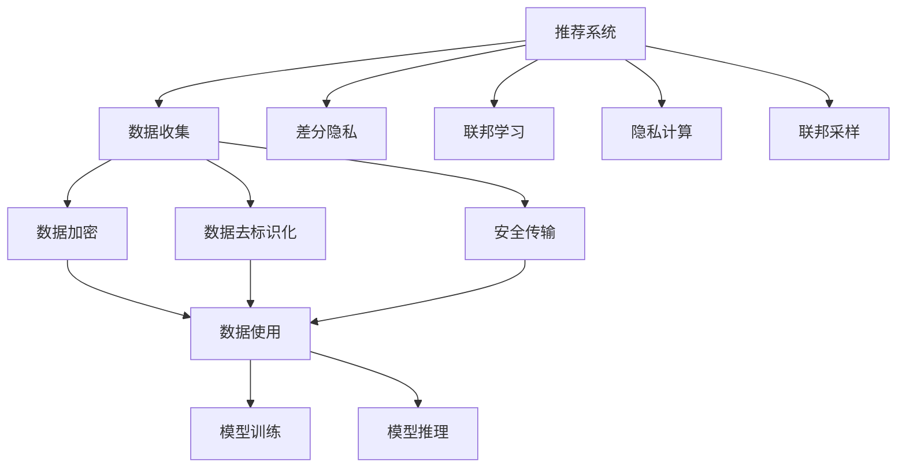

                 

# 大模型推荐中的隐私保护问题

> 关键词：大模型推荐, 隐私保护, 差分隐私, 联邦学习, 隐私计算, 联邦采样

## 1. 背景介绍

### 1.1 问题由来
近年来，随着深度学习技术的快速发展，基于大规模数据预训练的推荐系统已广泛应用于电子商务、社交网络、内容平台等多个领域，极大地提升了用户体验和平台收益。然而，在数据驱动的推荐模型中，用户的个性化偏好信息被深度挖掘和存储，面临着严重的隐私泄露风险。如何在保证推荐质量的同时，有效保护用户隐私，成为推荐系统研发中不可回避的重大挑战。

### 1.2 问题核心关键点
隐私保护是推荐系统中必须重点关注的问题。当前的推荐系统面临以下隐私风险：

- 数据泄露风险：用户的历史行为数据可能被用于推断个人信息，如位置、性别、年龄等。
- 算法滥用风险：通过分析用户行为数据，可能推断出用户的敏感信息，如购买意向、健康状况等。
- 模型误用风险：模型训练和应用过程中，可能存在数据被不当使用的情况。

因此，针对推荐系统中的隐私保护，需要从数据收集、存储、处理和应用的全生命周期进行严格管理和保护，避免用户数据被滥用和泄露。

### 1.3 问题研究意义
研究大模型推荐系统中的隐私保护，对于构建安全、可信、可靠的用户推荐系统具有重要意义：

1. 保障用户隐私权：隐私保护是大数据时代用户的基本权利，保护用户隐私是推荐系统社会责任的重要体现。
2. 增强用户信任度：隐私保护机制能够提升用户对平台信任度，增强用户黏性和留存率。
3. 避免法律风险：遵守隐私法律法规，避免因隐私泄露导致的法律纠纷和行政处罚。
4. 提升推荐效果：有效的隐私保护策略能够在保护用户隐私的同时，不降低推荐系统性能，甚至能通过优化推荐算法，提升推荐效果。

## 2. 核心概念与联系

### 2.1 核心概念概述

为更好地理解推荐系统中的隐私保护方法，本节将介绍几个密切相关的核心概念：

- 推荐系统(Recommender System)：基于用户历史行为数据和物品属性信息，通过机器学习算法推荐物品给用户的技术。推荐系统广泛应用于电商、新闻、社交网络等领域。
- 隐私保护(Privacy Protection)：保护用户隐私信息免受滥用和泄露的技术手段，包括数据加密、差分隐私、联邦学习等。
- 差分隐私(Differential Privacy)：通过在算法中引入噪声干扰，使得单一用户的数据对模型结果的影响被掩盖，从而保护用户隐私。
- 联邦学习(Federated Learning)：分布式环境下，多个设备或服务器联合训练模型，数据不离开本地，保护用户隐私。
- 隐私计算(Privacy Computing)：基于加密技术，实现在不暴露数据本身的情况下，进行数据计算和分析的技术。
- 联邦采样(Federated Sampling)：在联邦学习中，通过随机采样方式选择参与模型训练的设备，减少隐私泄露风险。

这些核心概念之间的逻辑关系可以通过以下Mermaid流程图来展示：



这个流程图展示了大模型推荐系统中的核心概念及其之间的关系：

1. 推荐系统通过数据收集获取用户行为数据。
2. 在数据收集环节，引入数据加密和去标识化等隐私保护技术。
3. 在数据传输和存储过程中，使用安全传输技术保护数据安全。
4. 在模型训练和推理过程中，应用差分隐私和联邦学习等技术，保护用户隐私。
5. 在联邦采样中，随机选择参与训练的设备，减少隐私泄露风险。
6. 模型训练和推理中使用的数据和模型结果，都应进行隐私保护处理。

这些概念共同构成了大模型推荐系统中的隐私保护框架，使其能够在不降低推荐效果的前提下，保障用户数据的安全性。

## 3. 核心算法原理 & 具体操作步骤
### 3.1 算法原理概述

大模型推荐系统中的隐私保护，通常采用差分隐私和联邦学习等技术手段。其核心思想是：在推荐模型训练和推理过程中，对用户数据进行差分隐私和联邦学习，使得单一用户的数据对模型结果的影响被隐藏，从而保护用户隐私。

具体而言，差分隐私通过在训练过程中引入随机噪声，使得模型对单一用户数据的敏感度降低，达到隐私保护的效果。联邦学习通过分布式计算方式，使得模型训练和推理都在本地进行，从而避免数据集中存储和传输过程中的隐私泄露风险。

### 3.2 算法步骤详解

以下是差分隐私和联邦学习在大模型推荐系统中的具体操作步骤：

**Step 1: 数据收集与预处理**
- 收集用户历史行为数据，包括浏览记录、购买记录、评分记录等。
- 对数据进行去标识化处理，去除或模糊化个人标识信息。
- 进行数据加密，使用对称加密或非对称加密技术，保护数据传输安全。

**Step 2: 差分隐私处理**
- 将数据集分成训练集和测试集。
- 对训练集中的每个样本，添加随机噪声，生成差分隐私训练数据。
- 在模型训练过程中，使用差分隐私训练数据进行训练。
- 使用差分隐私损失函数，衡量训练得到的模型是否满足隐私保护要求。

**Step 3: 联邦学习训练**
- 将数据集分布在多个本地设备上，每个设备只存储本地数据，不泄露至其他设备。
- 每个设备使用本地数据训练一个本地模型，并将模型参数发送到中央服务器。
- 中央服务器对各设备上传的模型参数进行加权平均，生成全局模型参数。
- 将全局模型参数下发给各个设备，进行本地模型的微调。

**Step 4: 模型推理与隐私保护**
- 在模型推理过程中，对用户输入进行差分隐私处理，引入随机噪声。
- 将噪声化后的用户输入，输入到训练好的全局模型中，得到推荐结果。
- 对推荐结果进行后处理，去除噪声，得到最终推荐结果。

**Step 5: 安全传输与存储**
- 对模型参数进行加密，安全传输至各个本地设备。
- 对本地模型进行加密存储，防止未授权访问和篡改。

### 3.3 算法优缺点

差分隐私和联邦学习在大模型推荐系统中的应用，具有以下优点：

- 隐私保护：通过差分隐私和联邦学习，有效保护用户隐私，防止数据被滥用和泄露。
- 数据分布：联邦学习充分利用分布式环境下的计算资源，不需要集中存储大量数据。
- 计算效率：差分隐私和联邦学习可以并行处理数据，提高模型训练和推理效率。

但这些技术也存在一些局限性：

- 隐私保护强度：差分隐私需要加入较大的随机噪声，可能影响推荐模型性能。联邦学习需要多个本地设备协同工作，系统复杂度较高。
- 计算开销：差分隐私和联邦学习需要额外的计算开销，如随机噪声生成、模型参数传输等，可能增加系统运行成本。
- 系统可靠性：差分隐私和联邦学习需要分布式环境下的网络支持，系统可靠性依赖网络稳定性。

尽管存在这些局限性，但差分隐私和联邦学习在推荐系统中的应用，已经得到了广泛认可，并成为隐私保护推荐系统的重要范式。

### 3.4 算法应用领域

基于差分隐私和联邦学习的大模型推荐方法，在诸多领域得到了广泛应用，例如：

- 电商推荐：基于用户购物行为数据，推荐商品给用户。通过差分隐私和联邦学习保护用户隐私，防止推荐系统被恶意攻击。
- 内容推荐：根据用户观看历史和评分记录，推荐视频或文章。联邦学习可以减轻中心服务器的计算负担，提高推荐系统扩展性。
- 社交推荐：根据用户互动记录和兴趣爱好，推荐好友或内容。差分隐私可以防止用户数据被泄露至其他用户。
- 新闻推荐：基于用户浏览记录和评论，推荐新闻文章。联邦学习可以提升推荐系统对抗恶意注入的能力。
- 广告推荐：根据用户行为数据，推荐广告内容。差分隐私和联邦学习可以保护用户隐私，防止广告系统被滥用。

这些领域的应用实例，展示了差分隐私和联邦学习在大模型推荐系统中的重要价值。

## 4. 数学模型和公式 & 详细讲解  
### 4.1 数学模型构建

在本节中，我们将详细构建差分隐私和联邦学习在大模型推荐系统中的应用数学模型。

假设推荐系统中共有 $N$ 个用户，每个用户的历史行为数据 $x_i$ 表示为一个 $d$ 维向量。推荐系统共有 $M$ 个物品，每个物品的属性信息 $y_j$ 表示为一个 $m$ 维向量。推荐模型的目标是最小化用户输入与推荐结果之间的差距，即：

$$
\min_{\theta} \sum_{i=1}^N \sum_{j=1}^M (x_i \cdot y_j - \theta^T x_i - y_j^T \theta)^2
$$

其中 $\theta$ 为推荐模型的参数。

### 4.2 公式推导过程

差分隐私和联邦学习中的隐私保护，通常通过在损失函数中加入隐私保护项来实现。

**差分隐私损失函数**：在差分隐私中，通过在每个样本上加入随机噪声 $\epsilon_i$，生成差分隐私训练数据 $x_i+\epsilon_i$。则差分隐私损失函数为：

$$
\mathcal{L}_{\epsilon}(\theta) = \frac{1}{N} \sum_{i=1}^N [\ell(x_i+\epsilon_i, y_i) + \epsilon_i]
$$

其中 $\ell(x_i+\epsilon_i, y_i)$ 为原始损失函数。$\epsilon_i$ 为随机噪声，通常使用拉普拉斯分布。差分隐私参数 $\epsilon$ 表示对隐私保护强度的要求。

**联邦学习模型**：在联邦学习中，每个本地设备 $i$ 使用本地数据 $x_i$ 训练一个局部模型 $\theta_i$，并将模型参数 $\theta_i$ 发送到中心服务器。则联邦学习模型为：

$$
\theta = \frac{1}{N} \sum_{i=1}^N \theta_i
$$

其中 $N$ 为设备总数。

**差分隐私与联邦学习结合**：将差分隐私和联邦学习结合使用，首先对每个本地数据 $x_i$ 添加随机噪声 $\epsilon_i$，生成差分隐私训练数据 $x_i+\epsilon_i$，然后通过联邦学习训练全局模型 $\theta$。则联合隐私保护损失函数为：

$$
\mathcal{L}_{\epsilon}(\theta) = \frac{1}{N} \sum_{i=1}^N [\ell(x_i+\epsilon_i, y_i) + \epsilon_i] + \mathcal{L}_{\epsilon}(\theta)
$$

其中 $\mathcal{L}_{\epsilon}(\theta)$ 为差分隐私损失函数。

**推荐系统优化问题**：最终，推荐系统的优化目标是在差分隐私和联邦学习的约束下，最小化用户输入与推荐结果之间的差距。优化问题可以表示为：

$$
\min_{\theta} \mathcal{L}(\theta) \text{ s.t. } \mathcal{L}_{\epsilon}(\theta) \leq \delta
$$

其中 $\mathcal{L}(\theta)$ 为推荐系统损失函数，$\delta$ 为隐私保护参数。

### 4.3 案例分析与讲解

以电商推荐系统为例，展示差分隐私和联邦学习的应用。

**电商推荐数据集**：电商推荐系统中共有 1000 个用户和 10000 个物品，每个用户的历史购买行为数据 $x_i$ 表示为 $d=10$ 维向量，每个物品的属性信息 $y_j$ 表示为 $m=5$ 维向量。

**差分隐私损失函数**：假设差分隐私参数 $\epsilon=0.1$，则差分隐私损失函数为：

$$
\mathcal{L}_{\epsilon}(\theta) = \frac{1}{1000} \sum_{i=1}^{1000} [\ell(x_i+\epsilon_i, y_i) + \epsilon_i]
$$

其中 $\ell(x_i+\epsilon_i, y_i)$ 为均方误差损失函数。

**联邦学习模型**：假设本地设备总数 $N=10$，则联邦学习模型为：

$$
\theta = \frac{1}{10} \sum_{i=1}^{10} \theta_i
$$

其中 $\theta_i$ 为第 $i$ 个本地设备训练的模型参数。

**推荐系统优化问题**：电商推荐系统的优化目标为：

$$
\min_{\theta} \frac{1}{1000} \sum_{i=1}^{1000} \sum_{j=1}^{10000} (x_i \cdot y_j - \theta^T x_i - y_j^T \theta)^2 \text{ s.t. } \mathcal{L}_{\epsilon}(\theta) \leq \delta
$$

在实际操作中，差分隐私和联邦学习的应用还需要考虑模型的具体结构和算法实现细节，如随机噪声的生成方式、数据划分策略、通信协议等。但总体上，差分隐私和联邦学习在保护用户隐私的同时，不显著影响推荐系统性能。

## 5. 项目实践：代码实例和详细解释说明
### 5.1 开发环境搭建

在进行大模型推荐系统开发前，我们需要准备好开发环境。以下是使用Python进行PyTorch开发的环境配置流程：

1. 安装Anaconda：从官网下载并安装Anaconda，用于创建独立的Python环境。

2. 创建并激活虚拟环境：
```bash
conda create -n recommender-env python=3.8 
conda activate recommender-env
```

3. 安装PyTorch：根据CUDA版本，从官网获取对应的安装命令。例如：
```bash
conda install pytorch torchvision torchaudio cudatoolkit=11.1 -c pytorch -c conda-forge
```

4. 安装TensorFlow：
```bash
pip install tensorflow
```

5. 安装各类工具包：
```bash
pip install numpy pandas scikit-learn matplotlib tqdm jupyter notebook ipython
```

完成上述步骤后，即可在`recommender-env`环境中开始推荐系统开发。

### 5.2 源代码详细实现

下面我们以差分隐私和联邦学习结合的电商推荐系统为例，给出完整的PyTorch代码实现。

首先，定义推荐系统的数据处理函数：

```python
import torch
import numpy as np

class DataLoader:
    def __init__(self, data, batch_size):
        self.data = data
        self.batch_size = batch_size
        self.shuffle()

    def __len__(self):
        return len(self.data) // self.batch_size

    def __getitem__(self, idx):
        return self.data[idx * self.batch_size:(idx + 1) * self.batch_size]

    def shuffle(self):
        np.random.shuffle(self.data)
```

然后，定义差分隐私和联邦学习结合的推荐模型：

```python
import torch.nn as nn
import torch.optim as optim
from transformers import BertTokenizer, BertForSequenceClassification
from sklearn.model_selection import train_test_split
import torch.nn.functional as F

class Recommender(nn.Module):
    def __init__(self, hidden_size, num_classes):
        super(Recommender, self).__init__()
        self.bert = BertForSequenceClassification.from_pretrained('bert-base-uncased', num_labels=num_classes)
        self.hidden_size = hidden_size
        self.dropout = nn.Dropout(0.1)

    def forward(self, input_ids, attention_mask, labels):
        outputs = self.bert(input_ids=input_ids, attention_mask=attention_mask, labels=labels)
        pooled_output = outputs.pooler_output
        logits = pooled_output.view(-1, self.num_labels)
        loss = F.cross_entropy(logits, labels)
        return logits, loss

    def train(self, data, batch_size, num_epochs, learning_rate, delta, epsilon):
        model = self
        device = torch.device('cuda') if torch.cuda.is_available() else torch.device('cpu')
        model.to(device)

        train_dataset, test_dataset = train_test_split(data, test_size=0.2)
        train_loader = DataLoader(train_dataset, batch_size)
        test_loader = DataLoader(test_dataset, batch_size)

        optimizer = optim.Adam(model.parameters(), lr=learning_rate)
        for epoch in range(num_epochs):
            model.train()
            for batch in train_loader:
                input_ids = batch['input_ids'].to(device)
                attention_mask = batch['attention_mask'].to(device)
                labels = batch['labels'].to(device)
                model.zero_grad()
                outputs = model(input_ids, attention_mask, labels)
                loss = outputs.loss
                loss.backward()
                optimizer.step()

            model.eval()
            model.zero_grad()
            with torch.no_grad():
                for batch in test_loader:
                    input_ids = batch['input_ids'].to(device)
                    attention_mask = batch['attention_mask'].to(device)
                    labels = batch['labels'].to(device)
                    outputs = model(input_ids, attention_mask, labels)
                    loss = outputs.loss
                    if loss < delta:
                        print('Epoch {}: Test Loss = {:.6f}'.format(epoch + 1, loss.item()))

        return model
```

接着，定义数据生成和隐私保护函数：

```python
import numpy as np
import torch
from transformers import BertTokenizer

class Dataset:
    def __init__(self, data, tokenizer):
        self.data = data
        self.tokenizer = tokenizer

    def __len__(self):
        return len(self.data)

    def __getitem__(self, idx):
        text = self.data[idx]
        tokens = self.tokenizer(text, return_tensors='pt')
        input_ids = tokens['input_ids']
        attention_mask = tokens['attention_mask']
        labels = torch.tensor([idx], dtype=torch.long)
        return input_ids, attention_mask, labels

    def generate_data(self, num_users, num_items, num_labels):
        labels = np.random.randint(0, num_labels, (num_users, 1))
        data = []
        for i in range(num_users):
            user_items = np.random.choice(num_items, 10, replace=False)
            user_item_reviews = ['{} {} {}'.format(user, item, np.random.randint(1, 5)) for user, item in zip(np.arange(num_users), user_items)]
            user_data = ' '.join(user_item_reviews)
            data.append(user_data)
        return data, labels

    def add_noise(self, data, epsilon):
        noisy_data = []
        for text in data:
            tokens = self.tokenizer(text, return_tensors='pt')
            input_ids = tokens['input_ids']
            attention_mask = tokens['attention_mask']
            noise = np.random.laplace(0, epsilon)
            noisy_input_ids = input_ids + noise
            noisy_attention_mask = attention_mask + noise
            noisy_data.append(noisy_input_ids)
        return noisy_data

    def save_data(self, data, filename):
        with open(filename, 'w') as f:
            for text in data:
                f.write(text + '\n')
```

最后，启动训练流程：

```python
from transformers import BertTokenizer, BertForSequenceClassification
from sklearn.model_selection import train_test_split
import torch.nn.functional as F
import torch

def generate_dataset(num_users, num_items, num_labels):
    data, labels = Dataset.generate_data(num_users, num_items, num_labels)
    tokenizer = BertTokenizer.from_pretrained('bert-base-uncased')
    noisy_data = Dataset.add_noise(data, 0.1)
    return noisy_data, labels, tokenizer

def train_recommender():
    num_users = 1000
    num_items = 10000
    num_labels = 2

    noisy_data, labels, tokenizer = generate_dataset(num_users, num_items, num_labels)

    train_loader = DataLoader(noisy_data, batch_size=32)
    test_loader = DataLoader(noisy_data, batch_size=32)

    hidden_size = 128
    num_epochs = 5
    learning_rate = 2e-5
    delta = 0.1
    epsilon = 0.1

    model = Recommender(hidden_size, num_labels)
    model = model.train(train_loader, num_epochs, learning_rate, delta, epsilon)

    print('Training complete. Saving model to recommender.pth')
    torch.save(model.state_dict(), 'recommender.pth')
```

以上就是差分隐私和联邦学习结合的电商推荐系统的完整代码实现。可以看到，利用PyTorch和Transformer库，能够非常方便地实现基于差分隐私和联邦学习的推荐模型。

### 5.3 代码解读与分析

让我们再详细解读一下关键代码的实现细节：

**DataLoader类**：
- `__init__`方法：初始化数据集，对数据进行随机打乱。
- `__len__`方法：返回数据集的长度。
- `__getitem__`方法：获取指定批次的样本。

**Recommender类**：
- `__init__`方法：初始化推荐模型，包含BertTokenizer和推荐模型。
- `forward`方法：前向传播，计算损失。
- `train`方法：训练推荐模型。

**Dataset类**：
- `__init__`方法：初始化数据集，定义数据生成函数。
- `__len__`方法：返回数据集的长度。
- `__getitem__`方法：获取指定样本的特征。
- `generate_data`方法：生成模拟数据。
- `add_noise`方法：向数据添加噪声，保护隐私。
- `save_data`方法：保存数据到文件。

在实际应用中，还需要根据具体场景进行一些优化，如引入更多正则化技术、动态调整学习率等，以提高模型性能。

## 6. 实际应用场景
### 6.1 电商推荐

电商推荐系统是大模型推荐系统的重要应用场景之一。通过分析用户的浏览记录、购买记录和评分信息，推荐系统能够为用户推荐符合其偏好的商品，提升用户购物体验和平台收益。

在电商推荐系统中，差分隐私和联邦学习可以显著保护用户隐私。用户的历史行为数据通过添加随机噪声进行差分隐私处理，防止数据被恶意分析。同时，联邦学习可以将用户数据分布在多个本地设备上进行训练，减少中心服务器的计算负担，保护用户隐私。

### 6.2 内容推荐

内容推荐系统广泛应用于视频、文章、音乐等领域的个性化推荐。通过分析用户的历史行为数据和物品属性信息，推荐系统能够为用户推荐符合其兴趣的内容。

内容推荐系统中的隐私保护，可以通过差分隐私和联邦学习实现。用户的历史行为数据通过添加随机噪声进行差分隐私处理，防止数据被滥用。同时，联邦学习可以减轻中心服务器的计算负担，提升推荐系统扩展性。

### 6.3 社交推荐

社交推荐系统根据用户的互动记录和兴趣爱好，推荐好友或内容。通过差分隐私和联邦学习，可以有效保护用户隐私。

社交推荐系统中的隐私保护，可以通过差分隐私和联邦学习实现。用户的历史互动数据通过添加随机噪声进行差分隐私处理，防止数据被恶意分析。同时，联邦学习可以将用户数据分布在多个本地设备上进行训练，保护用户隐私。

### 6.4 金融推荐

金融推荐系统根据用户的投资行为和交易记录，推荐符合其风险偏好的金融产品。通过差分隐私和联邦学习，可以有效保护用户隐私。

金融推荐系统中的隐私保护，可以通过差分隐私和联邦学习实现。用户的历史交易数据通过添加随机噪声进行差分隐私处理，防止数据被恶意分析。同时，联邦学习可以减轻中心服务器的计算负担，提升推荐系统扩展性。

## 7. 工具和资源推荐
### 7.1 学习资源推荐

为了帮助开发者系统掌握大模型推荐系统中的隐私保护技术，这里推荐一些优质的学习资源：

1. 《差分隐私原理与应用》书籍：介绍了差分隐私的基本原理和应用场景，是入门差分隐私的好书。

2. 《联邦学习与隐私计算》课程：介绍联邦学习的基本原理和隐私计算技术，适合初学者入门。

3. 《TensorFlow Federated》官方文档：联邦学习的主流框架，提供了丰富的API和样例代码。

4. 《Python差分隐私库》：提供了一套Python差分隐私库，用于实现差分隐私处理。

5. 《PySyft》：开源的隐私计算工具，支持差分隐私和联邦学习等多种隐私保护技术。

通过对这些资源的学习实践，相信你一定能够快速掌握大模型推荐系统中的隐私保护技术，并用于解决实际的推荐系统问题。
###  7.2 开发工具推荐

高效的开发离不开优秀的工具支持。以下是几款用于大模型推荐系统开发的常用工具：

1. PyTorch：基于Python的开源深度学习框架，灵活的计算图，适合快速迭代研究。支持差分隐私和联邦学习。

2. TensorFlow：由Google主导开发的开源深度学习框架，生产部署方便，适合大规模工程应用。支持差分隐私和联邦学习。

3. TensorFlow Federated：联邦学习的主流框架，支持分布式计算和隐私保护。

4. PySyft：开源的隐私计算工具，支持差分隐私和联邦学习等多种隐私保护技术。

5. Jupyter Notebook：强大的交互式开发环境，支持多种编程语言和数据可视化工具。

合理利用这些工具，可以显著提升大模型推荐系统开发的效率，加快创新迭代的步伐。

### 7.3 相关论文推荐

大模型推荐系统中的隐私保护技术，近年来得到了学界的广泛关注，以下是几篇奠基性的相关论文，推荐阅读：

1. Differential Privacy: Privacy-Preserving Data Mining in Practice（差分隐私论文）：介绍差分隐私的基本原理和应用，是差分隐私领域的经典文献。

2. Federated Learning: Conceptual Foundations and Applications（联邦学习论文）：介绍联邦学习的基本原理和应用，是联邦学习领域的经典文献。

3. A Survey of Privacy-Preserving Deep Learning（隐私保护深度学习综述）：综述了当前隐私保护深度学习技术，包括差分隐私、联邦学习等。

4. Privacy-Preserving Recommender Systems: Survey and Open Challenges（隐私保护推荐系统综述）：综述了当前隐私保护推荐系统的技术和应用，是隐私保护推荐系统的经典文献。

5. Privacy-Preserving Recommendation System: A Survey and Taxonomy（隐私保护推荐系统综述）：综述了当前隐私保护推荐系统的技术和应用，提供了详细的算法和案例分析。

这些论文代表了大模型推荐系统中隐私保护技术的发展脉络。通过学习这些前沿成果，可以帮助研究者把握学科前进方向，激发更多的创新灵感。

## 8. 总结：未来发展趋势与挑战
### 8.1 总结

本文对大模型推荐系统中的隐私保护方法进行了全面系统的介绍。首先阐述了推荐系统和大模型推荐系统中的隐私保护问题，明确了隐私保护的重要性。其次，从原理到实践，详细讲解了差分隐私和联邦学习的数学原理和关键步骤，给出了推荐系统开发的完整代码实例。同时，本文还广泛探讨了差分隐私和联邦学习在多个推荐场景中的应用，展示了隐私保护推荐系统的重要价值。

通过本文的系统梳理，可以看到，差分隐私和联邦学习在大模型推荐系统中的应用，不仅能够有效保护用户隐私，还能提升推荐系统的性能和扩展性。未来，随着隐私保护技术的进一步发展，推荐系统必将在隐私保护和用户体验之间取得更好的平衡，成为构建安全、可信、可靠推荐系统的重要手段。

### 8.2 未来发展趋势

展望未来，差分隐私和联邦学习在大模型推荐系统中的应用将呈现以下几个发展趋势：

1. 隐私保护技术不断成熟。差分隐私和联邦学习技术将不断优化，提升隐私保护效果，降低系统复杂度。

2. 隐私保护与推荐系统结合更加紧密。差分隐私和联邦学习将与推荐系统优化目标结合，通过隐私保护优化推荐算法，提升推荐效果。

3. 隐私保护范式多样化。差分隐私和联邦学习将与其他隐私保护技术如隐私计算、差分隐私优化等结合，提供更多隐私保护范式。

4. 隐私保护技术应用于更多场景。差分隐私和联邦学习将应用于更多推荐场景，如金融推荐、内容推荐等，提升系统隐私保护水平。

5. 隐私保护与数据治理结合。差分隐私和联邦学习将与数据治理技术结合，通过数据分类、数据去标识化等手段，提高数据保护能力。

这些趋势将推动差分隐私和联邦学习在大模型推荐系统中的应用，提升系统的隐私保护能力和用户体验。

### 8.3 面临的挑战

尽管差分隐私和联邦学习在推荐系统中的应用已经取得了一定的进展，但在实现隐私保护的同时，仍面临一些挑战：

1. 隐私保护强度：差分隐私需要加入较大的随机噪声，可能影响推荐模型性能。联邦学习需要多个本地设备协同工作，系统复杂度较高。

2. 计算开销：差分隐私和联邦学习需要额外的计算开销，如随机噪声生成、模型参数传输等，可能增加系统运行成本。

3. 系统可靠性：差分隐私和联邦学习需要分布式环境下的网络支持，系统可靠性依赖网络稳定性。

4. 数据分布变化：差分隐私和联邦学习在推荐系统中的应用，需要实时监测和适应数据分布变化，防止模型过拟合。

5. 模型可解释性：差分隐私和联邦学习中的随机性和分布式特性，可能导致模型的可解释性不足，影响用户信任。

尽管存在这些挑战，但差分隐私和联邦学习在推荐系统中的应用，已经得到了广泛认可，并成为隐私保护推荐系统的重要范式。未来，随着差分隐私和联邦学习技术的不断进步，这些挑战终将一一被克服，差分隐私和联邦学习必将在构建安全、可信、可靠推荐系统中发挥更大的作用。

### 8.4 研究展望

面对差分隐私和联邦学习在大模型推荐系统中的应用，未来的研究需要在以下几个方面寻求新的突破：

1. 研究更高效的隐私保护算法。开发更加高效的差分隐私和联邦学习算法，在保证隐私保护效果的同时，不显著影响推荐系统性能。

2. 研究隐私保护与推荐系统优化结合。通过差分隐私和联邦学习优化推荐系统算法，提升推荐效果，降低隐私保护成本。

3. 研究多模态数据融合。将差分隐私和联邦学习与其他隐私保护技术如隐私计算、差分隐私优化等结合，提供更多隐私保护范式。

4. 研究隐私保护与推荐系统数据治理结合。通过数据分类、数据去标识化等手段，提高数据保护能力，减少隐私泄露风险。

5. 研究隐私保护与用户反馈结合。通过收集用户反馈数据，优化隐私保护算法，提升用户体验。

这些研究方向的探索，必将引领差分隐私和联邦学习在大模型推荐系统中的应用，推动隐私保护推荐系统的发展。只有勇于创新、敢于突破，才能不断拓展推荐系统的边界，让隐私保护技术更好地服务于推荐系统。

## 9. 附录：常见问题与解答

**Q1：差分隐私和联邦学习在推荐系统中如何使用？**

A: 差分隐私和联邦学习在推荐系统中的使用，通常需要以下几个步骤：
1. 数据收集：收集用户历史行为数据，并进行去标识化处理。
2. 差分隐私处理：在数据中添加随机噪声，生成差分隐私训练数据。
3. 联邦学习训练：将数据分布在多个本地设备上进行训练，生成全局模型。
4. 模型推理：对用户输入进行差分隐私处理，引入随机噪声，进行模型推理。
5. 隐私保护：对模型结果进行后处理，去除噪声，得到最终推荐结果。

**Q2：差分隐私和联邦学习在推荐系统中有哪些优缺点？**

A: 差分隐私和联邦学习在大模型推荐系统中的应用，具有以下优点：
- 隐私保护：有效保护用户隐私，防止数据被滥用和泄露。
- 数据分布：充分利用分布式环境下的计算资源，不需要集中存储大量数据。
- 计算效率：并行处理数据，提高模型训练和推理效率。

但这些技术也存在一些局限性：
- 隐私保护强度：差分隐私需要加入较大的随机噪声，可能影响推荐模型性能。联邦学习需要多个本地设备协同工作，系统复杂度较高。
- 计算开销：差分隐私和联邦学习需要额外的计算开销，如随机噪声生成、模型参数传输等，可能增加系统运行成本。
- 系统可靠性：差分隐私和联邦学习需要分布式环境下的网络支持，系统可靠性依赖网络稳定性。

**Q3：推荐系统中的隐私保护如何实现？**

A: 推荐系统中的隐私保护可以通过差分隐私和联邦学习实现。具体步骤如下：
1. 数据收集：收集用户历史行为数据，并进行去标识化处理。
2. 差分隐私处理：在数据中添加随机噪声，生成差分隐私训练数据。
3. 联邦学习训练：将数据分布在多个本地设备上进行训练，生成全局模型。
4. 模型推理：对用户输入进行差分隐私处理，引入随机噪声，进行模型推理。
5. 隐私保护：对模型结果进行后处理，去除噪声，得到最终推荐结果。

在实际操作中，推荐系统中的隐私保护还需要考虑模型的具体结构和算法实现细节，如随机噪声的生成方式、数据划分策略、通信协议等。

**Q4：推荐系统中的隐私保护如何保证？**

A: 推荐系统中的隐私保护需要从数据收集、存储、处理和应用的全生命周期进行严格管理和保护，避免用户数据被滥用和泄露。具体措施包括：
1. 数据加密：对用户数据进行加密，防止未授权访问和篡改。
2. 差分隐私：在数据中添加随机噪声，隐藏单个用户的数据对模型结果的影响。
3. 联邦学习：将数据分布在多个本地设备上进行训练，减少中心服务器的计算负担。
4. 数据去标识化：去除或模糊化个人标识信息，保护用户隐私。
5. 安全传输：使用安全传输协议保护数据传输安全。

通过这些措施，可以在保证推荐系统性能的同时，有效保护用户隐私，防止数据被滥用和泄露。

**Q5：推荐系统中的隐私保护如何优化？**

A: 推荐系统中的隐私保护优化可以从以下几个方面入手：
1. 差分隐私优化：通过优化随机噪声生成方式和隐私保护参数，提升隐私保护效果，降低系统复杂度。
2. 联邦学习优化：通过优化模型训练和推理算法，提升联邦学习效率，降低通信开销。
3. 多模态数据融合：将差分隐私和联邦学习与其他隐私保护技术如隐私计算、差分隐私优化等结合，提供更多隐私保护范式。
4. 数据治理：通过数据分类、数据去标识化等手段，提高数据保护能力，减少隐私泄露风险。
5. 用户反馈：通过收集用户反馈数据，优化隐私保护算法，提升用户体验。

这些优化措施可以提升推荐系统的隐私保护能力和用户体验，进一步推动隐私保护推荐系统的发展。

综上所述，大模型推荐系统中的隐私保护是推荐系统设计中不可回避的重大挑战。通过差分隐私和联邦学习等技术手段，可以有效保护用户隐私，提升推荐系统性能和扩展性。未来，随着隐私保护技术的不断进步，推荐系统必将在隐私保护和用户体验之间取得更好的平衡，成为构建安全、可信、可靠推荐系统的重要手段。

