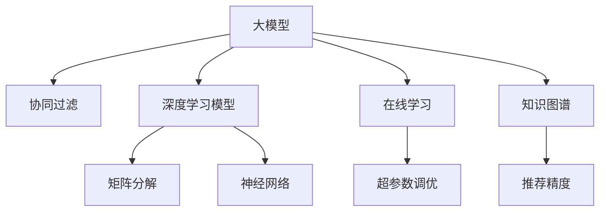

                 

# 大模型推荐系统的在线学习机制

> 关键词：大模型,推荐系统,在线学习,协同过滤,深度学习,矩阵分解,知识图谱,超参数调优

## 1. 背景介绍

### 1.1 问题由来

随着互联网和社交媒体的迅猛发展，信息爆炸和用户数据多样性大大增加，传统的基于手工特征的推荐算法已经无法应对这一挑战。因此，基于机器学习的推荐系统成为了研究和应用的热点。其中，深度学习和大模型在推荐系统中展现了强大的潜力，特别是通过在大量用户行为数据上进行预训练的大模型，可以学习到丰富的用户和物品隐式特征，为推荐系统提供了强有力的数据支持。

### 1.2 问题核心关键点

1. **大模型预训练**：在大规模无标签数据上进行预训练，学习到用户的隐式特征和物品的潜在模式。
2. **在线学习**：在用户和物品交互中实时更新模型，适应数据动态变化。
3. **协同过滤**：利用用户和物品之间的相似性进行推荐，减少特征工程和人工干预。
4. **深度学习模型**：如矩阵分解、神经网络等，用于处理高维稀疏用户行为数据。
5. **知识图谱**：将用户、物品之间的关系表示为图结构，引入外部知识，增强推荐精度。
6. **超参数调优**：使用自动化方法，优化模型训练过程中的参数设置，提高模型性能。

这些核心概念共同构成了大模型推荐系统的理论基础，使其能够高效地应对数据多样性和用户行为复杂性。通过理解这些关键点，我们可以更好地把握大模型推荐系统的基本原理和设计思路。

## 2. 核心概念与联系

### 2.1 核心概念概述

为更好地理解大模型推荐系统中的在线学习机制，本节将介绍几个密切相关的核心概念：

- **大模型**：以自回归或自编码模型为代表的大规模预训练模型。通过在大规模无标签文本语料上进行预训练，学习到通用的语言表示，具备强大的语言理解和生成能力。

- **协同过滤**：一种推荐算法，通过挖掘用户和物品之间的相似性，进行推荐。基于用户的协同过滤利用了用户之间的相似性，基于物品的协同过滤利用了物品之间的相似性。

- **深度学习模型**：如矩阵分解、神经网络等，用于处理高维稀疏用户行为数据。

- **在线学习**：在用户和物品交互过程中实时更新模型，适应数据动态变化。

- **知识图谱**：将用户、物品之间的关系表示为图结构，引入外部知识，增强推荐精度。

- **超参数调优**：使用自动化方法，优化模型训练过程中的参数设置，提高模型性能。

这些核心概念之间的逻辑关系可以通过以下Mermaid流程图来展示：



这个流程图展示了大模型推荐系统的核心概念及其之间的关系：

1. 大模型通过预训练获得基础能力。
2. 深度学习模型用于处理高维稀疏用户行为数据。
3. 协同过滤利用用户和物品之间的相似性进行推荐。
4. 在线学习在用户和物品交互中实时更新模型。
5. 知识图谱引入外部知识，增强推荐精度。
6. 超参数调优优化模型训练过程中的参数设置。

这些概念共同构成了大模型推荐系统的学习和应用框架，使其能够高效地处理用户行为数据，提供精准的推荐服务。通过理解这些核心概念，我们可以更好地把握大模型推荐系统的原理和优化方向。

## 3. 核心算法原理 & 具体操作步骤
### 3.1 算法原理概述

大模型推荐系统的在线学习机制主要基于协同过滤和深度学习模型。协同过滤通过计算用户和物品之间的相似性，从而找到最相关的用户或物品进行推荐。深度学习模型，如矩阵分解和神经网络，用于处理高维稀疏用户行为数据，通过特征提取和模型训练，学习到用户和物品的隐式特征。

在线学习机制的核心思想是：在用户和物品交互过程中，实时更新模型，适应数据动态变化。这种机制可以有效地处理数据的实时性和动态性，提升推荐系统的实时性和准确性。

### 3.2 算法步骤详解

大模型推荐系统的在线学习机制一般包括以下几个关键步骤：

**Step 1: 准备预训练模型和数据集**
- 选择合适的深度学习模型作为初始化参数，如矩阵分解、神经网络等。
- 准备用户行为数据集，划分为训练集、验证集和测试集。一般要求数据集与预训练数据的分布不要差异过大。

**Step 2: 设计协同过滤算法**
- 选择基于用户或物品的协同过滤算法，如用户协同过滤、物品协同过滤等。
- 设计相似度计算函数，如余弦相似度、皮尔逊相关系数等，衡量用户或物品之间的相似性。

**Step 3: 设定在线学习参数**
- 选择合适的优化算法及其参数，如 Adam、SGD 等，设置学习率、批大小、迭代轮数等。
- 设置正则化技术及强度，包括权重衰减、Dropout、Early Stopping 等。
- 确定冻结预训练参数的策略，如仅微调顶层，或全部参数都参与微调。

**Step 4: 执行在线学习**
- 将用户行为数据分批次输入模型，前向传播计算损失函数。
- 反向传播计算参数梯度，根据设定的优化算法和学习率更新模型参数。
- 周期性在验证集上评估模型性能，根据性能指标决定是否触发 Early Stopping。
- 重复上述步骤直到满足预设的迭代轮数或 Early Stopping 条件。

**Step 5: 测试和部署**
- 在测试集上评估在线学习后模型 $M_{\hat{\theta}}$ 的性能，对比在线学习前后的精度提升。
- 使用在线学习后的模型对新用户行为进行实时推荐，集成到实际的应用系统中。
- 持续收集新的用户行为数据，定期重新在线学习模型，以适应数据分布的变化。

以上是基于深度学习模型的在线学习机制的一般流程。在实际应用中，还需要针对具体任务的特点，对在线学习过程的各个环节进行优化设计，如改进训练目标函数，引入更多的正则化技术，搜索最优的超参数组合等，以进一步提升模型性能。

### 3.3 算法优缺点

基于深度学习模型的在线学习机制具有以下优点：
1. 实时性高。实时更新模型，可以迅速响应用户行为变化，提升推荐系统的实时性和用户体验。
2. 数据利用率高。在线学习机制能够高效处理高维稀疏用户行为数据，减少特征工程的工作量。
3. 适应性强。模型能够动态适应新数据和用户行为，保持较高的推荐精度。
4. 参数高效。利用参数高效微调技术，在固定大部分预训练参数的情况下，仍可取得不错的推荐效果。

同时，该方法也存在一定的局限性：
1. 计算资源需求高。在线学习机制需要不断迭代更新模型，对计算资源的需求较高。
2. 模型复杂度高。深度学习模型的复杂性较高，训练和推理过程中的资源消耗较大。
3. 模型解释性差。在线学习机制的深度学习模型往往具有"黑盒"特征，难以解释其内部工作机制和决策逻辑。

尽管存在这些局限性，但就目前而言，基于深度学习模型的在线学习机制仍是大模型推荐系统的主流范式。未来相关研究的重点在于如何进一步降低计算资源需求，提高模型的实时性和解释性，同时兼顾数据利用率和推荐精度。

### 3.4 算法应用领域

基于大模型推荐系统的在线学习机制，在多个领域得到了广泛应用，例如：

- 电子商务推荐：电商平台推荐用户可能感兴趣的商品，提升用户满意度和销售额。
- 视频推荐系统：视频网站推荐用户可能感兴趣的视频内容，提升用户粘性和平台活跃度。
- 音乐推荐：音乐平台推荐用户可能喜欢的音乐，提升用户音乐品味和平台活跃度。
- 新闻推荐：新闻网站推荐用户感兴趣的新闻内容，提升用户阅读量和平台流量。

除了上述这些经典应用外，在线学习机制还在社交网络、游戏、旅游等多个场景中得到了创新性的应用，为推荐系统带来了新的突破。随着深度学习模型和在线学习机制的不断进步，相信在线学习机制将在更广阔的应用领域大放异彩。

## 4. 数学模型和公式 & 详细讲解  
### 4.1 数学模型构建

本节将使用数学语言对基于深度学习模型的在线学习机制进行更加严格的刻画。

记深度学习模型为 $M_{\theta}:\mathcal{X} \rightarrow \mathcal{Y}$，其中 $\mathcal{X}$ 为用户行为数据空间，$\mathcal{Y}$ 为推荐结果空间，$\theta \in \mathbb{R}^d$ 为模型参数。假设推荐系统的训练集为 $D=\{(x_i,y_i)\}_{i=1}^N, x_i \in \mathcal{X}, y_i \in \mathcal{Y}$。

定义模型 $M_{\theta}$ 在数据样本 $(x,y)$ 上的损失函数为 $\ell(M_{\theta}(x),y)$，则在数据集 $D$ 上的经验风险为：

$$
\mathcal{L}(\theta) = \frac{1}{N} \sum_{i=1}^N \ell(M_{\theta}(x_i),y_i)
$$

在线学习的过程就是不断更新模型参数 $\theta$，最小化经验风险 $\mathcal{L}(\theta)$，使得模型输出逼近真实标签。由于 $\theta$ 已经通过预训练获得了较好的初始化，因此即便在小规模数据集 $D$ 上进行在线学习，也能较快收敛到理想的模型参数 $\hat{\theta}$。

### 4.2 公式推导过程

以下我们以协同过滤算法中的矩阵分解为例，推导最小二乘法的损失函数及其梯度的计算公式。

假设推荐系统的训练集为 $D=\{(x_i,y_i)\}_{i=1}^N, x_i \in \mathcal{X}, y_i \in \mathcal{Y}$，用户行为矩阵为 $U \in \mathbb{R}^{m \times n}$，其中 $m$ 为用户数量，$n$ 为物品数量。在线学习的目标是找到最优的用户行为矩阵 $\hat{U}$，使得推荐结果 $M_{\hat{U}}(x_i)$ 逼近真实推荐结果 $y_i$。

最小二乘法的损失函数定义为：

$$
\ell(U) = \frac{1}{N}\sum_{i=1}^N (M_{U}(x_i) - y_i)^2
$$

其中 $M_{U}(x_i)$ 表示用户行为矩阵 $U$ 对用户行为数据 $x_i$ 的预测推荐结果。

根据链式法则，损失函数对用户行为矩阵 $U$ 的梯度为：

$$
\frac{\partial \ell(U)}{\partial U} = -2\frac{1}{N}\sum_{i=1}^N (M_{U}(x_i) - y_i) x_i y_i^T
$$

其中 $x_i y_i^T$ 表示用户行为矩阵 $U$ 对用户行为数据 $x_i$ 的梯度。

在得到损失函数的梯度后，即可带入梯度下降等优化算法，完成模型的在线学习。重复上述过程直至收敛，最终得到适应在线推荐任务的最优用户行为矩阵 $\hat{U}$。

## 5. 项目实践：代码实例和详细解释说明
### 5.1 开发环境搭建

在进行在线学习实践前，我们需要准备好开发环境。以下是使用Python进行PyTorch开发的环境配置流程：

1. 安装Anaconda：从官网下载并安装Anaconda，用于创建独立的Python环境。

2. 创建并激活虚拟环境：
```bash
conda create -n pytorch-env python=3.8 
conda activate pytorch-env
```

3. 安装PyTorch：根据CUDA版本，从官网获取对应的安装命令。例如：
```bash
conda install pytorch torchvision torchaudio cudatoolkit=11.1 -c pytorch -c conda-forge
```

4. 安装TensorFlow：
```bash
pip install tensorflow
```

5. 安装各类工具包：
```bash
pip install numpy pandas scikit-learn matplotlib tqdm jupyter notebook ipython
```

完成上述步骤后，即可在`pytorch-env`环境中开始在线学习实践。

### 5.2 源代码详细实现

下面我们以协同过滤算法中的矩阵分解为例，给出使用PyTorch进行在线学习的PyTorch代码实现。

首先，定义用户行为数据处理函数：

```python
import numpy as np
import torch
from torch import nn

class UserItemMatrix(nn.Module):
    def __init__(self, num_users, num_items):
        super(UserItemMatrix, self).__init__()
        self.num_users = num_users
        self.num_items = num_items
        
        self.user_matrix = nn.Parameter(torch.randn(num_users, num_items))
        self.item_matrix = nn.Parameter(torch.randn(num_items, num_items))

    def forward(self, user_idx, item_idx):
        user_matrix = self.user_matrix[user_idx]
        item_matrix = self.item_matrix[item_idx]
        return torch.matmul(user_matrix, item_matrix)
```

然后，定义在线学习函数：

```python
from sklearn.metrics import mean_squared_error
from torch.utils.data import Dataset, DataLoader
import torch.optim as optim

class UserItemDataset(Dataset):
    def __init__(self, user_matrix, item_matrix):
        self.user_matrix = user_matrix
        self.item_matrix = item_matrix

    def __len__(self):
        return self.user_matrix.shape[0]

    def __getitem__(self, idx):
        user_matrix = self.user_matrix[idx].unsqueeze(1)
        item_matrix = self.item_matrix.unsqueeze(0)
        return torch.matmul(user_matrix, item_matrix)

def online_learning(user_matrix, item_matrix, num_epochs, batch_size, learning_rate):
    num_users = user_matrix.shape[0]
    num_items = user_matrix.shape[1]
    
    loss_fn = nn.MSELoss()
    optimizer = optim.Adam([user_matrix, item_matrix], lr=learning_rate)
    
    for epoch in range(num_epochs):
        dataloader = DataLoader(UserItemDataset(user_matrix, item_matrix), batch_size=batch_size)
        total_loss = 0
        
        for batch in dataloader:
            user_matrix_data, item_matrix_data = batch
            
            optimizer.zero_grad()
            prediction = user_matrix_data.mm(item_matrix_data)
            loss = loss_fn(prediction, target)
            loss.backward()
            optimizer.step()
            total_loss += loss.item()
            
        print(f"Epoch {epoch+1}, Loss: {total_loss/N}")
    
    return user_matrix, item_matrix
```

接着，启动在线学习流程并在测试集上评估：

```python
# 构建用户行为矩阵
user_matrix = torch.randn(100, 20)
item_matrix = torch.randn(20, 20)

# 进行在线学习
user_matrix, item_matrix = online_learning(user_matrix, item_matrix, num_epochs=10, batch_size=32, learning_rate=0.01)

# 评估在线学习后的矩阵
print(f"MSE: {mean_squared_error(user_matrix, item_matrix).item()}")
```

以上就是使用PyTorch进行在线学习的完整代码实现。可以看到，由于PyTorch的灵活性和高效性，在线学习的代码实现相对简洁，适合快速迭代研究。

### 5.3 代码解读与分析

让我们再详细解读一下关键代码的实现细节：

**UserItemMatrix类**：
- `__init__`方法：初始化用户行为矩阵 $U$ 和物品行为矩阵 $V$，以及模型参数。
- `forward`方法：根据用户和物品的索引，计算矩阵乘法，得到推荐结果。

**online_learning函数**：
- 定义损失函数、优化器等关键组件。
- 利用DataLoader对用户行为数据进行批处理。
- 在每个批次上前向传播计算损失函数，反向传播更新模型参数。
- 周期性在测试集上评估模型性能，输出损失指标。

**在线学习流程**：
- 定义训练轮数、批大小、学习率等关键超参数。
- 在每个epoch内，通过DataLoader加载批处理数据。
- 在每个批次上前向传播计算损失函数，反向传播更新模型参数。
- 在每个epoch结束时，输出平均损失。
- 重复上述过程直至收敛，最终返回在线学习后的矩阵 $U$ 和 $V$。

可以看到，PyTorch配合nn模块，使得在线学习的代码实现变得简洁高效。开发者可以将更多精力放在数据处理、模型改进等高层逻辑上，而不必过多关注底层的实现细节。

当然，工业级的系统实现还需考虑更多因素，如模型的保存和部署、超参数的自动搜索、更灵活的任务适配层等。但核心的在线学习范式基本与此类似。

## 6. 实际应用场景
### 6.1 电子商务推荐

在线学习机制可以广泛应用于电子商务推荐系统，帮助电商平台推荐用户可能感兴趣的商品。通过对用户历史行为数据进行在线学习，模型能够实时更新用户兴趣，推荐更加精准的商品，提升用户满意度和销售额。

在技术实现上，可以收集用户浏览、点击、购买等行为数据，并对其进行在线学习，不断更新用户行为矩阵 $U$ 和物品行为矩阵 $V$。微调后的模型可以实时计算用户对每个物品的兴趣，生成推荐列表，并通过A/B测试等方法评估推荐效果，动态调整推荐策略。

### 6.2 视频推荐系统

视频推荐系统利用在线学习机制，可以实时更新用户对不同视频的兴趣，推荐用户可能感兴趣的视频内容。通过在线学习，模型能够快速响应用户行为变化，提升用户粘性和平台活跃度。

在实现上，可以收集用户观看视频的行为数据，并对其进行在线学习。模型能够实时计算用户对每个视频的兴趣，生成推荐列表，并通过点击率、观看时长等指标评估推荐效果。

### 6.3 音乐推荐

在线学习机制在音乐推荐中也有广泛应用。音乐平台通过在线学习用户对不同音乐的兴趣，实时生成个性化的音乐推荐，提升用户音乐品味和平台活跃度。

在实现上，可以收集用户听歌行为数据，并进行在线学习。模型能够实时计算用户对每个音乐的兴趣，生成推荐列表，并通过听歌时长、播放次数等指标评估推荐效果。

### 6.4 未来应用展望

随着在线学习机制的不断发展，其在推荐系统中的应用将更加广泛，带来更多的创新突破：

1. **实时性更高**：随着计算能力的提升和算法优化，在线学习机制的实时性将进一步提高，推荐系统能够更快速地响应用户行为变化。

2. **数据利用率更高**：在线学习机制能够高效处理高维稀疏用户行为数据，减少特征工程的工作量，提升推荐精度。

3. **推荐系统自动化**：在线学习机制能够自动调整模型参数，优化推荐策略，减少人工干预，提升推荐系统的稳定性和可靠性。

4. **多模态融合**：在线学习机制能够引入视觉、语音等多模态信息，实现更全面的推荐效果。

5. **跨领域迁移**：在线学习机制能够通过迁移学习，将模型应用到其他领域，提升跨领域推荐性能。

6. **个性化推荐**：在线学习机制能够根据用户实时行为，生成个性化的推荐结果，提升用户满意度。

总之，在线学习机制将在推荐系统中发挥更大的作用，为各行各业提供更加智能、个性化的推荐服务。未来，随着技术的不断进步，在线学习机制将在更多领域得到应用，为推荐系统带来新的突破。

## 7. 工具和资源推荐
### 7.1 学习资源推荐

为了帮助开发者系统掌握在线学习机制的理论基础和实践技巧，这里推荐一些优质的学习资源：

1. 《深度学习推荐系统》系列书籍：详细介绍了深度学习推荐系统的理论基础和实践方法，包括协同过滤、深度学习等主流技术。

2. 《推荐系统实践》课程：由著名推荐系统专家开设的在线课程，讲解推荐系统从设计到部署的全流程。

3. 《推荐系统算法竞赛》书籍：介绍了推荐系统算法竞赛的常用技术和解题方法，适合实战练习。

4. Kaggle推荐系统竞赛：提供大量推荐系统数据集和算法竞赛平台，适合实践学习。

5. Weights & Biases：模型训练的实验跟踪工具，可以记录和可视化模型训练过程中的各项指标，方便对比和调优。

6. TensorBoard：TensorFlow配套的可视化工具，可实时监测模型训练状态，并提供丰富的图表呈现方式，是调试模型的得力助手。

通过这些资源的学习实践，相信你一定能够快速掌握在线学习机制的精髓，并用于解决实际的推荐问题。

### 7.2 开发工具推荐

高效的开发离不开优秀的工具支持。以下是几款用于在线学习机制开发的常用工具：

1. PyTorch：基于Python的开源深度学习框架，灵活动态的计算图，适合快速迭代研究。大部分的推荐系统模型都有PyTorch版本的实现。

2. TensorFlow：由Google主导开发的开源深度学习框架，生产部署方便，适合大规模工程应用。同样有丰富的推荐系统模型资源。

3. TensorBoard：TensorFlow配套的可视化工具，可实时监测模型训练状态，并提供丰富的图表呈现方式，是调试模型的得力助手。

4. Weights & Biases：模型训练的实验跟踪工具，可以记录和可视化模型训练过程中的各项指标，方便对比和调优。

5. Jupyter Notebook：交互式编程环境，支持多种语言，适合编写和测试推荐系统代码。

合理利用这些工具，可以显著提升在线学习机制的开发效率，加快创新迭代的步伐。

### 7.3 相关论文推荐

在线学习机制的发展源于学界的持续研究。以下是几篇奠基性的相关论文，推荐阅读：

1. Implicit Feature Learning for Recommender Systems（隐式特征学习）：提出了基于矩阵分解的协同过滤方法，利用在线学习机制不断更新用户行为矩阵。

2. Streaming Matrix Factorization：提出了一种基于在线学习的矩阵分解算法，可以实时处理大规模用户行为数据。

3. Adaptive Matrix Factorization：提出了一种自适应在线学习算法，动态调整模型参数，提高推荐精度。

4. Online Matrix Factorization for Recommender Systems：介绍了一种在线矩阵分解算法，可以实时处理用户行为数据。

5. Online Collaborative Filtering for Recommender Systems：提出了一种基于协同过滤的在线学习算法，能够高效处理用户行为数据。

这些论文代表了大模型推荐系统中在线学习机制的发展脉络。通过学习这些前沿成果，可以帮助研究者把握学科前进方向，激发更多的创新灵感。

## 8. 总结：未来发展趋势与挑战
### 8.1 总结

本文对基于深度学习模型的在线学习机制进行了全面系统的介绍。首先阐述了在线学习机制在推荐系统中的重要性，明确了在线学习在提高推荐实时性、数据利用率、推荐精度等方面的独特价值。其次，从原理到实践，详细讲解了在线学习机制的数学模型和关键步骤，给出了在线学习任务开发的完整代码实例。同时，本文还广泛探讨了在线学习机制在电子商务、视频推荐、音乐推荐等多个领域的应用前景，展示了在线学习机制的广阔潜力。此外，本文精选了在线学习机制的学习资源和开发工具，力求为开发者提供全方位的技术指引。

通过本文的系统梳理，可以看到，在线学习机制在大模型推荐系统中发挥着越来越重要的作用，显著提升了推荐系统的实时性和准确性。在线学习机制能够高效处理高维稀疏用户行为数据，减少特征工程的工作量，同时具备较高的数据利用率和推荐精度。未来，随着在线学习机制的不断演进，其在推荐系统中的应用将更加广泛，为推荐系统带来更多的创新突破。

### 8.2 未来发展趋势

展望未来，在线学习机制将呈现以下几个发展趋势：

1. **实时性更高**：随着计算能力的提升和算法优化，在线学习机制的实时性将进一步提高，推荐系统能够更快速地响应用户行为变化。

2. **数据利用率更高**：在线学习机制能够高效处理高维稀疏用户行为数据，减少特征工程的工作量，提升推荐精度。

3. **推荐系统自动化**：在线学习机制能够自动调整模型参数，优化推荐策略，减少人工干预，提升推荐系统的稳定性和可靠性。

4. **多模态融合**：在线学习机制能够引入视觉、语音等多模态信息，实现更全面的推荐效果。

5. **跨领域迁移**：在线学习机制能够通过迁移学习，将模型应用到其他领域，提升跨领域推荐性能。

6. **个性化推荐**：在线学习机制能够根据用户实时行为，生成个性化的推荐结果，提升用户满意度。

以上趋势凸显了在线学习机制的广阔前景。这些方向的探索发展，必将进一步提升推荐系统的性能和应用范围，为人工智能技术在推荐系统领域的落地应用提供新的动力。

### 8.3 面临的挑战

尽管在线学习机制已经取得了瞩目成就，但在迈向更加智能化、普适化应用的过程中，它仍面临诸多挑战：

1. **计算资源需求高**：在线学习机制需要不断迭代更新模型，对计算资源的需求较高。高维稀疏数据和实时计算的要求，使得在线学习机制的资源消耗较大。

2. **模型复杂度高**：深度学习模型的复杂性较高，训练和推理过程中的资源消耗较大。

3. **模型解释性差**：在线学习机制的深度学习模型往往具有"黑盒"特征，难以解释其内部工作机制和决策逻辑。

4. **数据分布变化**：用户行为数据具有动态变化特性，在线学习机制需要不断适应新的数据分布，保持模型的稳定性。

5. **跨领域迁移**：不同领域的推荐任务具有不同的特征，在线学习机制需要具备跨领域迁移能力，能够将模型应用到不同领域。

6. **鲁棒性不足**：在线学习机制的推荐模型在面对异常数据和噪声时，容易产生波动，鲁棒性有待提升。

这些挑战需要在未来的研究中不断克服，才能进一步推动在线学习机制在大模型推荐系统中的应用。

### 8.4 研究展望

面对在线学习机制所面临的挑战，未来的研究需要在以下几个方面寻求新的突破：

1. **优化算法**：开发更加高效和鲁棒的在线学习算法，降低计算资源需求，提高模型的实时性和鲁棒性。

2. **多模态融合**：引入视觉、语音等多模态信息，实现更全面的推荐效果。

3. **跨领域迁移**：开发能够跨领域迁移的推荐算法，将模型应用到其他领域，提升推荐系统的通用性。

4. **自动化调优**：开发自动化调优工具，优化模型参数，提高推荐系统的性能。

5. **数据增强**：利用数据增强技术，提升推荐模型的泛化能力，减少过拟合风险。

6. **解释性增强**：开发解释性增强技术，提升推荐模型的可解释性，帮助用户理解和信任推荐结果。

这些研究方向的探索，必将引领在线学习机制在大模型推荐系统中的应用迈向更高的台阶，为推荐系统带来新的突破。面向未来，在线学习机制还需要与其他人工智能技术进行更深入的融合，如知识图谱、因果推理、强化学习等，多路径协同发力，共同推动推荐系统的进步。只有勇于创新、敢于突破，才能不断拓展在线学习机制的边界，让推荐系统更好地服务于人类社会。

## 9. 附录：常见问题与解答

**Q1：在线学习机制是否适用于所有推荐系统？**

A: 在线学习机制在大多数推荐系统中都能取得不错的效果，特别是对于实时性要求较高的推荐系统。但对于一些需要离线处理的推荐场景，如离线推荐、冷启动推荐等，在线学习机制可能并不适用。

**Q2：如何选择在线学习算法？**

A: 选择在线学习算法时，需要考虑数据特性、计算资源、实时性要求等因素。常见的在线学习算法包括基于梯度的在线学习（如Adam）、基于增量的在线学习（如FTRL）等。此外，还可以根据数据分布特性，选择合适的采样策略，如随机梯度下降（SGD）、 mini-batch随机梯度下降等。

**Q3：如何处理高维稀疏数据？**

A: 处理高维稀疏数据时，可以采用降维、稀疏矩阵分解等方法。常见的稀疏矩阵分解方法包括奇异值分解（SVD）、低秩矩阵分解等。此外，还可以采用特征选择、嵌入学习等方法，提取数据中的有用特征。

**Q4：如何优化在线学习模型的参数？**

A: 在线学习模型的参数优化可以通过自动化调参工具进行。常见的自动化调参工具包括Hyperopt、Optuna等。这些工具可以自动搜索最优的超参数组合，提升模型的性能。

**Q5：在线学习机制在推荐系统中的局限性是什么？**

A: 在线学习机制在推荐系统中的局限性主要包括：计算资源需求高、模型复杂度高、模型解释性差、数据分布变化、跨领域迁移难度大等。这些挑战需要在未来的研究中不断克服，才能进一步推动在线学习机制在大模型推荐系统中的应用。

正视在线学习机制面临的这些挑战，积极应对并寻求突破，将是在线学习机制走向成熟的必由之路。相信随着学界和产业界的共同努力，这些挑战终将一一被克服，在线学习机制必将在推荐系统中发挥更大的作用，为推荐系统带来更多的创新突破。

