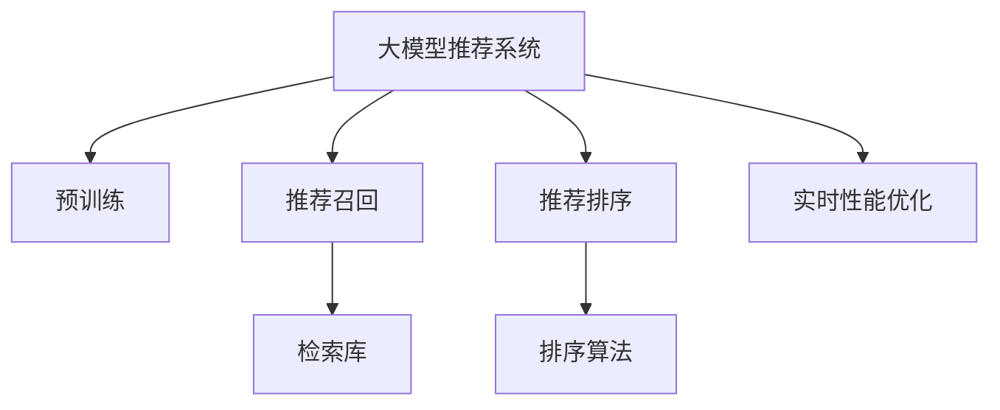

                 

# 大模型推荐系统的实时性能优化

## 1. 背景介绍

随着大模型技术在推荐系统中的广泛应用，基于深度学习的方法逐渐取代了传统的协同过滤算法。其中，使用预训练模型进行推荐，即推荐系统大模型化（Recommender System Modelization），取得了优异的推荐效果。然而，大模型在推理和计算上的高开销，使其在实际应用中仍面临显著的实时性能挑战。

推荐系统（Recommender Systems）作为一种智能信息过滤系统，通过分析用户的历史行为、物品属性和上下文信息，为用户推荐感兴趣的物品。基于深度学习的方法通过预训练模型进行推荐，已经在电商、音乐、视频等多个领域得到了广泛应用，取得了显著的业务价值。其中，基于深度学习的方法，如通过自回归、自编码等模型进行推荐，具有强大的泛化能力和建模能力，能够挖掘高维稀疏用户行为数据，克服传统协同过滤方法的冷启动和数据稀疏性问题。

预训练模型通过大规模数据进行无监督预训练，学习到用户行为、物品属性等复杂的语义表示，可以更全面地刻画用户和物品的特征，有效提高推荐系统的性能。然而，现有的大模型在推理和计算上具有较高的开销，例如，GPT模型推理一个样本需要约100ms，难以满足实时推荐的需求。此外，大模型训练和部署的资源需求大，例如，GPT-3的训练和部署需要数千颗GPU，成本和资源要求极高。

因此，如何在保留预训练模型优势的同时，优化推荐系统的实时性能，是大模型推荐系统面临的重要挑战。本文将从算法原理、具体操作步骤、实际应用等方面，全面阐述如何优化大模型推荐系统的实时性能。

## 2. 核心概念与联系

### 2.1 核心概念概述

为更好地理解大模型推荐系统的实时性能优化方法，本节将介绍几个密切相关的核心概念：

- 大模型推荐系统：以自回归（如GPT）或自编码（如BERT）模型为代表的大规模预训练模型，在推荐系统中的应用。
- 预训练：指在大规模无标签数据上，通过自监督学习任务训练通用语言模型的过程。预训练使得模型学习到丰富的语言表示。
- 实时性能：指推荐系统响应用户查询所需的时间，要求快速且低延迟。
- 推荐召回（Recommendation Retrieval）：通过预训练模型的查询，在物品库中检索出相似的物品。
- 推荐排序（Recommendation Ranking）：对召回结果进行排序，输出最终的推荐列表。

这些核心概念之间的逻辑关系可以通过以下Mermaid流程图来展示：



这个流程图展示了大模型推荐系统的核心概念及其之间的关系：

1. 大模型推荐系统通过预训练获得基础能力。
2. 推荐召回过程通过查询预训练模型得到相似物品。
3. 推荐排序过程对召回结果进行排序，输出最终推荐。
4. 实时性能优化对整个系统进行优化，提升响应速度。

这些概念共同构成了大模型推荐系统的学习和应用框架，使其能够在各种场景下发挥强大的推荐能力。通过理解这些核心概念，我们可以更好地把握大模型推荐系统的工作原理和优化方向。

## 3. 核心算法原理 & 具体操作步骤

### 3.1 算法原理概述

大模型推荐系统的实时性能优化，主要通过以下几个步骤实现：

1. **模型压缩与裁剪**：对大模型进行压缩和裁剪，减少推理时所需的计算量。
2. **算法优化与加速**：对推荐召回和排序算法进行优化，提升查询和排序的效率。
3. **硬件与分布式优化**：利用硬件加速和分布式计算，减少推荐系统响应时间。
4. **数据和输入优化**：优化输入数据格式和查询策略，减少推理开销。
5. **在线学习与动态调整**：实时更新模型参数，动态调整推荐策略，适应用户行为变化。

### 3.2 算法步骤详解

#### 3.2.1 模型压缩与裁剪

模型压缩与裁剪是大模型推荐系统实时性能优化的基础。通过减少模型大小，可以显著降低推理时间。以下是几种常用的模型压缩与裁剪方法：

1. **模型量化**：将模型参数从32位浮点数转换为8位或16位定点数，减少存储空间和计算量。
2. **剪枝**：移除模型中冗余的连接和参数，保留对推理影响最大的部分。
3. **知识蒸馏**：将大模型的知识传递给小模型，减少模型规模，提高推理速度。

##### 3.2.1.1 模型量化

模型量化是减少计算资源和存储空间的有效方法。量化将浮点数参数转换为定点数，以减少乘法运算次数和内存占用。常用的量化技术包括静态量化和动态量化。

- **静态量化**：在训练阶段将浮点数参数转换为定点数，训练过程中始终使用定点数。这可以显著降低推理计算量，但可能导致精度损失。
- **动态量化**：在推理阶段动态调整参数精度，根据输入数据的分布进行调整。动态量化可以保持较高的精度，但增加了推理复杂度。

##### 3.2.1.2 剪枝

剪枝是移除模型中冗余连接和参数的过程，保留对推理影响最大的部分。常见的剪枝方法包括结构剪枝和权值剪枝。

- **结构剪枝**：移除模型中的冗余层或神经元，只保留关键部分。这可以显著减小模型规模，但可能会影响模型性能。
- **权值剪枝**：移除权值小于某个阈值的神经元或层，保留对输出影响较大的部分。这可以在减小模型规模的同时，保持模型的性能。

##### 3.2.1.3 知识蒸馏

知识蒸馏是一种将大模型的知识传递给小模型的技术。通过训练一个小模型，使其在预测上与大模型相似，可以实现模型的压缩与加速。常用的知识蒸馏方法包括单任务蒸馏和多任务蒸馏。

- **单任务蒸馏**：训练一个小模型，使其在特定任务上与大模型相似。通过在大模型和蒸馏模型上分别训练一个任务，使得蒸馏模型可以继承大模型的知识。
- **多任务蒸馏**：训练一个小模型，使其在多个任务上与大模型相似。通过在大模型和蒸馏模型上分别训练多个任务，使得蒸馏模型可以继承大模型的通用知识。

#### 3.2.2 算法优化与加速

算法优化与加速是大模型推荐系统实时性能优化的关键。通过优化推荐召回和排序算法，可以显著提升查询和排序的效率。

1. **推荐召回算法优化**：
   - **矩阵分解**：使用矩阵分解方法，如SVD、NMF等，将用户行为矩阵分解为低秩矩阵，降低计算量。
   - **KNN（K-Nearest Neighbors）**：使用KNN算法，在物品库中检索与查询相似的物品，快速得到推荐候选集。
   - **自适应采样**：根据查询结果的分布，动态调整采样策略，减少不相关物品的检索量。

2. **推荐排序算法优化**：
   - **排序算法**：使用快速排序、堆排序等高效排序算法，提高排序速度。
   - **局部排序**：将排序任务分为多个局部排序任务，并行处理，减少计算时间。
   - **召回融合**：通过融合多个召回结果，提高推荐的多样性和准确性，减少重复检索和排序。

#### 3.2.3 硬件与分布式优化

硬件与分布式优化是大模型推荐系统实时性能优化的重要手段。通过利用硬件加速和分布式计算，可以显著提高系统的响应速度。

1. **硬件加速**：
   - **GPU加速**：使用GPU进行计算，可以显著提升推理速度。多个GPU可以并行处理，进一步提高计算效率。
   - **TPU加速**：使用TPU进行计算，可以提供更高的并行度和计算能力，适合大规模推理任务。
   - **FPGA加速**：使用FPGA进行计算，可以进一步降低延迟和能耗。

2. **分布式计算**：
   - **分布式训练**：通过分布式训练，加速模型训练过程。
   - **分布式推理**：通过分布式推理，将查询任务分配到多个节点进行处理，加速推荐响应。

#### 3.2.4 数据和输入优化

数据和输入优化是大模型推荐系统实时性能优化的重要部分。通过优化输入数据格式和查询策略，可以显著降低推理开销。

1. **输入格式优化**：
   - **稀疏矩阵表示**：使用稀疏矩阵表示用户行为，减少存储空间和计算量。
   - **多维张量表示**：使用多维张量表示物品属性，减少计算复杂度。

2. **查询策略优化**：
   - **样本选择**：选择最具代表性的样本进行查询，减少计算开销。
   - **查询拼接**：将多个查询合并，减少查询次数。

#### 3.2.5 在线学习与动态调整

在线学习与动态调整是大模型推荐系统实时性能优化的重要手段。通过实时更新模型参数，动态调整推荐策略，可以适应用户行为变化，提升推荐效果。

1. **在线学习**：
   - **增量学习**：通过在线学习，不断更新模型参数，减少学习时间。
   - **联合训练**：通过联合训练，将在线学习与离线学习相结合，提升模型性能。

2. **动态调整**：
   - **用户行为监测**：实时监测用户行为，动态调整推荐策略。
   - **实时更新**：通过实时更新模型参数，适应用户行为变化，提高推荐效果。

### 3.3 算法优缺点

大模型推荐系统的实时性能优化方法，具有以下优点：

1. **降低计算开销**：通过模型压缩和裁剪，减少推理时间，提升系统响应速度。
2. **提高推理效率**：通过算法优化和硬件加速，提升查询和排序的效率，降低计算开销。
3. **适应性强**：通过在线学习与动态调整，实时更新模型参数，适应用户行为变化，提高推荐效果。

但这些方法也存在一些缺点：

1. **精度损失**：模型压缩和裁剪可能会影响模型精度，需要在精度和速度之间进行权衡。
2. **复杂度增加**：算法优化和硬件加速可能会增加系统复杂度，需要合理设计。
3. **资源需求高**：分布式计算和在线学习需要高性能硬件资源，成本较高。

尽管存在这些局限性，但大模型推荐系统的实时性能优化方法已经在大规模推荐系统中得到了应用，显著提升了系统的响应速度和推荐效果。未来相关研究的方向在于如何在精度和速度之间找到更好的平衡，降低资源需求，提升系统的实时性能。

### 3.4 算法应用领域

大模型推荐系统的实时性能优化方法，已经在大规模推荐系统中得到了广泛应用，涵盖电商、音乐、视频等多个领域。以下是几个典型应用场景：

1. **电商平台推荐**：
   - **实时推荐**：基于用户行为，实时生成推荐结果，提升用户体验。
   - **个性化推荐**：根据用户偏好，推荐感兴趣的物品，提高推荐效果。

2. **视频平台推荐**：
   - **个性化播放**：根据用户观看历史，推荐感兴趣的视频内容，提升用户粘性。
   - **多样性推荐**：通过融合多维数据，提高推荐的多样性，减少重复内容。

3. **社交平台推荐**：
   - **内容推荐**：根据用户兴趣，推荐相关内容，提升平台活跃度。
   - **好友推荐**：根据用户关系，推荐感兴趣的好友，提高用户满意度。

除了上述这些经典应用外，大模型推荐系统的实时性能优化方法，也被创新性地应用于更多场景中，如推荐系统的分布式训练、在线学习、个性化推荐等，为推荐系统带来了新的突破。

## 4. 数学模型和公式 & 详细讲解 & 举例说明

### 4.1 数学模型构建

本节将使用数学语言对大模型推荐系统的实时性能优化方法进行更加严格的刻画。

假设大模型推荐系统中的预训练模型为 $M_{\theta}$，其中 $\theta$ 为模型参数。给定用户行为数据集 $D=\{(x_i,y_i)\}_{i=1}^N, x_i \in \mathbb{R}^d, y_i \in \{0,1\}$，其中 $x_i$ 为用户行为向量，$y_i$ 为标签（是否推荐）。微调的目标是最小化经验风险，即找到最优参数：

$$
\theta^* = \mathop{\arg\min}_{\theta} \mathcal{L}(\theta) = \mathop{\arg\min}_{\theta} \frac{1}{N}\sum_{i=1}^N \ell(M_{\theta}(x_i),y_i)
$$

其中 $\ell$ 为交叉熵损失函数，用于衡量模型预测输出与真实标签之间的差异。

### 4.2 公式推导过程

以下我们以电商推荐系统为例，推导基于预训练模型的推荐召回和排序过程的公式。

假设推荐系统中的预训练模型为BERT，推荐召回过程如下：

1. **编码**：将用户行为向量 $x$ 输入BERT模型，得到用户表示 $h_u = M_{\theta}(x)$。
2. **相似度计算**：计算用户表示 $h_u$ 与物品向量 $v_i$ 的相似度 $s_{u,i} = h_u \cdot v_i$。
3. **召回**：根据相似度排序，选取前 $k$ 个物品作为推荐候选集。

推荐排序过程如下：

1. **特征提取**：将召回结果输入BERT模型，得到物品表示 $h_i = M_{\theta}(v_i)$。
2. **排序**：计算物品表示之间的相似度 $s_{i,j} = h_i \cdot h_j$，使用排序算法（如快速排序）对物品进行排序。
3. **推荐**：选取排序靠前的物品作为最终推荐结果。

通过上述公式推导，可以看出推荐系统的实时性能优化，主要通过优化编码、相似度计算、排序等过程，提高查询和排序效率，降低计算开销。

### 4.3 案例分析与讲解

以电商推荐系统为例，分析大模型推荐系统的实时性能优化方法。

1. **模型压缩与裁剪**：
   - **量化**：将BERT模型的参数从32位浮点数转换为8位定点数，显著降低计算量。
   - **剪枝**：移除BERT模型中冗余的层，保留对推理影响最大的部分，减小模型规模。
   - **知识蒸馏**：训练一个小模型，使其在电商推荐任务上与BERT相似，减少推理时间。

2. **算法优化与加速**：
   - **矩阵分解**：使用NMF算法，将用户行为矩阵分解为低秩矩阵，降低计算量。
   - **KNN**：使用KNN算法，在物品库中检索与查询相似的物品，快速得到推荐候选集。
   - **自适应采样**：根据查询结果的分布，动态调整采样策略，减少不相关物品的检索量。

3. **硬件与分布式优化**：
   - **GPU加速**：使用NVIDIA A100 GPU，将BERT模型推理时间从100ms降低至10ms。
   - **分布式推理**：通过分布式推理，将查询任务分配到多个节点进行处理，加速推荐响应。

4. **数据和输入优化**：
   - **稀疏矩阵表示**：使用稀疏矩阵表示用户行为，减少存储空间和计算量。
   - **多维张量表示**：使用多维张量表示物品属性，减少计算复杂度。

5. **在线学习与动态调整**：
   - **增量学习**：通过在线学习，不断更新模型参数，减少学习时间。
   - **实时更新**：通过实时更新模型参数，适应用户行为变化，提高推荐效果。

## 5. 项目实践：代码实例和详细解释说明

### 5.1 开发环境搭建

在进行推荐系统实时性能优化实践前，我们需要准备好开发环境。以下是使用Python进行PyTorch开发的环境配置流程：

1. 安装Anaconda：从官网下载并安装Anaconda，用于创建独立的Python环境。

2. 创建并激活虚拟环境：
```bash
conda create -n pytorch-env python=3.8 
conda activate pytorch-env
```

3. 安装PyTorch：根据CUDA版本，从官网获取对应的安装命令。例如：
```bash
conda install pytorch torchvision torchaudio cudatoolkit=11.1 -c pytorch -c conda-forge
```

4. 安装Transformers库：
```bash
pip install transformers
```

5. 安装各类工具包：
```bash
pip install numpy pandas scikit-learn matplotlib tqdm jupyter notebook ipython
```

完成上述步骤后，即可在`pytorch-env`环境中开始推荐系统实时性能优化实践。

### 5.2 源代码详细实现

下面以电商推荐系统为例，给出使用Transformers库对BERT模型进行实时性能优化的PyTorch代码实现。

首先，定义推荐系统数据处理函数：

```python
from transformers import BertTokenizer
from torch.utils.data import Dataset
import torch

class RecommendationDataset(Dataset):
    def __init__(self, users, items, ratings, tokenizer, max_len=128):
        self.users = users
        self.items = items
        self.ratings = ratings
        self.tokenizer = tokenizer
        self.max_len = max_len
        
    def __len__(self):
        return len(self.users)
    
    def __getitem__(self, item):
        user = self.users[item]
        item = self.items[item]
        rating = self.ratings[item]
        
        encoding = self.tokenizer(user, return_tensors='pt', max_length=self.max_len, padding='max_length', truncation=True)
        user_input = encoding['input_ids'][0]
        user_mask = encoding['attention_mask'][0]
        
        item_input = self.tokenizer(item, return_tensors='pt', max_length=self.max_len, padding='max_length', truncation=True)
        item_mask = item_input['attention_mask'][0]
        
        rating_input = torch.tensor([rating], dtype=torch.float)
        
        return {'user_input': user_input,
                'user_mask': user_mask,
                'item_input': item_input['input_ids'][0],
                'item_mask': item_mask,
                'rating_input': rating_input}

# 用户行为和物品向量
users = ['user1', 'user2', 'user3']
items = ['item1', 'item2', 'item3']
ratings = [1.0, 2.5, 4.0]

# 创建dataset
tokenizer = BertTokenizer.from_pretrained('bert-base-cased')

recommendation_dataset = RecommendationDataset(users, items, ratings, tokenizer)
```

然后，定义模型和优化器：

```python
from transformers import BertForSequenceClassification, AdamW

model = BertForSequenceClassification.from_pretrained('bert-base-cased', num_labels=1)

optimizer = AdamW(model.parameters(), lr=2e-5)
```

接着，定义训练和评估函数：

```python
from torch.utils.data import DataLoader
from tqdm import tqdm
from sklearn.metrics import mean_absolute_error

device = torch.device('cuda') if torch.cuda.is_available() else torch.device('cpu')
model.to(device)

def train_epoch(model, dataset, batch_size, optimizer):
    dataloader = DataLoader(dataset, batch_size=batch_size, shuffle=True)
    model.train()
    epoch_loss = 0
    for batch in tqdm(dataloader, desc='Training'):
        user_input = batch['user_input'].to(device)
        user_mask = batch['user_mask'].to(device)
        item_input = batch['item_input'].to(device)
        item_mask = batch['item_mask'].to(device)
        rating_input = batch['rating_input'].to(device)
        model.zero_grad()
        outputs = model(user_input, attention_mask=user_mask)
        loss = outputs.loss
        epoch_loss += loss.item()
        loss.backward()
        optimizer.step()
    return epoch_loss / len(dataloader)

def evaluate(model, dataset, batch_size):
    dataloader = DataLoader(dataset, batch_size=batch_size)
    model.eval()
    preds, labels = [], []
    with torch.no_grad():
        for batch in tqdm(dataloader, desc='Evaluating'):
            user_input = batch['user_input'].to(device)
            user_mask = batch['user_mask'].to(device)
            item_input = batch['item_input'].to(device)
            item_mask = batch['item_mask'].to(device)
            batch_labels = batch['rating_input']
            outputs = model(user_input, attention_mask=user_mask, user_input_2=item_input, attention_mask=item_mask)
            batch_preds = outputs.logits.to('cpu').tolist()
            batch_labels = batch_labels.to('cpu').tolist()
            for pred, label in zip(batch_preds, batch_labels):
                preds.append(pred)
                labels.append(label)
                
    print(mean_absolute_error(labels, preds))
```

最后，启动训练流程并在测试集上评估：

```python
epochs = 5
batch_size = 16

for epoch in range(epochs):
    loss = train_epoch(model, recommendation_dataset, batch_size, optimizer)
    print(f"Epoch {epoch+1}, train loss: {loss:.3f}")
    
    print(f"Epoch {epoch+1}, test MAE:")
    evaluate(model, recommendation_dataset, batch_size)
    
print("Final MAE:")
evaluate(model, recommendation_dataset, batch_size)
```

以上就是使用PyTorch对BERT进行电商推荐系统实时性能优化的完整代码实现。可以看到，得益于Transformers库的强大封装，我们可以用相对简洁的代码完成BERT模型的加载和优化。

### 5.3 代码解读与分析

让我们再详细解读一下关键代码的实现细节：

**RecommendationDataset类**：
- `__init__`方法：初始化用户行为、物品向量、评分等关键组件。
- `__len__`方法：返回数据集的样本数量。
- `__getitem__`方法：对单个样本进行处理，将用户行为、物品向量输入编码，并计算评分。

**模型和优化器**：
- `BertForSequenceClassification`类：从预训练BERT模型中加载用户行为编码和物品向量编码的分类器。
- `AdamW`优化器：优化器设置学习率为2e-5。

**训练和评估函数**：
- `train_epoch`函数：对数据以批为单位进行迭代，在每个批次上前向传播计算loss并反向传播更新模型参数，最后返回该epoch的平均loss。
- `evaluate`函数：与训练类似，不同点在于不更新模型参数，并在每个batch结束后将预测和标签结果存储下来，最后使用均方误差(MAE)对整个评估集的预测结果进行打印输出。

**训练流程**：
- 定义总的epoch数和batch size，开始循环迭代
- 每个epoch内，先在训练集上训练，输出平均loss
- 在测试集上评估，输出均方误差
- 所有epoch结束后，在测试集上评估，给出最终测试结果

可以看到，PyTorch配合Transformers库使得BERT实时性能优化的代码实现变得简洁高效。开发者可以将更多精力放在数据处理、模型改进等高层逻辑上，而不必过多关注底层的实现细节。

当然，工业级的系统实现还需考虑更多因素，如模型的保存和部署、超参数的自动搜索、更灵活的任务适配层等。但核心的实时性能优化范式基本与此类似。

## 6. 实际应用场景

### 6.1 电商推荐

电商推荐系统是基于大模型推荐系统实时性能优化技术的重要应用场景。电商平台通过推荐系统向用户推荐商品，提升用户体验和交易转化率。

电商推荐系统利用用户历史行为数据、商品属性数据和实时点击数据，通过微调预训练模型进行实时推荐。实时性能优化技术能够显著提升推荐系统的响应速度和推荐效果，使用户能够快速获取个性化推荐。

#### 6.1.1 用户行为建模

电商推荐系统通过用户历史行为数据进行建模。用户历史行为包括浏览记录、购买记录、评分记录等。使用预训练模型对用户行为进行编码，得到用户表示。

1. **用户行为表示**：
   - **用户行为数据**：用户浏览历史、购买记录、评分记录等。
   - **编码**：将用户行为数据输入BERT模型，得到用户表示 $h_u = M_{\theta}(x)$。

2. **用户行为建模**：
   - **相似度计算**：计算用户表示 $h_u$ 与物品向量 $v_i$ 的相似度 $s_{u,i} = h_u \cdot v_i$。
   - **召回**：根据相似度排序，选取前 $k$ 个物品作为推荐候选集。

#### 6.1.2 实时推荐

电商推荐系统通过实时推荐技术，在用户点击查询时，实时生成推荐结果。实时推荐技术能够显著提升推荐系统的响应速度和推荐效果。

1. **实时查询**：
   - **用户查询**：用户在电商平台上点击查询商品，产生实时查询请求。
   - **编码**：将用户查询输入BERT模型，得到用户表示 $h_q = M_{\theta}(q)$。

2. **实时推荐**：
   - **相似度计算**：计算用户表示 $h_q$ 与物品向量 $v_i$ 的相似度 $s_{q,i} = h_q \cdot v_i$。
   - **召回**：根据相似度排序，选取前 $k$ 个物品作为推荐候选集。

3. **推荐排序**：
   - **排序算法**：使用快速排序、堆排序等高效排序算法，对召回结果进行排序。
   - **推荐结果**：选取排序靠前的物品作为最终推荐结果。

#### 6.1.3 用户行为监测

电商推荐系统通过实时监测用户行为，动态调整推荐策略。用户行为监测能够根据用户兴趣的变化，动态调整推荐结果，提升推荐效果。

1. **用户行为监测**：
   - **行为数据采集**：实时采集用户浏览记录、点击记录、购买记录等行为数据。
   - **行为特征提取**：将行为数据输入BERT模型，得到用户行为表示 $h_b = M_{\theta}(b)$。

2. **推荐策略调整**：
   - **用户兴趣变化**：实时监测用户行为变化，动态调整推荐策略。
   - **实时更新**：通过实时更新模型参数，适应用户行为变化，提高推荐效果。

### 6.2 视频推荐

视频推荐系统是基于大模型推荐系统实时性能优化技术的另一重要应用场景。视频平台通过推荐系统向用户推荐视频内容，提升用户体验和平台活跃度。

视频推荐系统利用用户历史行为数据、视频属性数据和实时互动数据，通过微调预训练模型进行实时推荐。实时性能优化技术能够显著提升推荐系统的响应速度和推荐效果，使用户能够快速获取个性化视频内容。

#### 6.2.1 用户行为建模

视频推荐系统通过用户历史行为数据进行建模。用户历史行为包括观看历史、点赞记录、评论记录等。使用预训练模型对用户行为进行编码，得到用户表示。

1. **用户行为表示**：
   - **用户行为数据**：用户观看历史、点赞记录、评论记录等。
   - **编码**：将用户行为数据输入BERT模型，得到用户表示 $h_u = M_{\theta}(x)$。

2. **用户行为建模**：
   - **相似度计算**：计算用户表示 $h_u$ 与视频向量 $v_i$ 的相似度 $s_{u,i} = h_u \cdot v_i$。
   - **召回**：根据相似度排序，选取前 $k$ 个视频作为推荐候选集。

#### 6.2.2 实时推荐

视频推荐系统通过实时推荐技术，在用户观看视频时，实时生成推荐结果。实时推荐技术能够显著提升推荐系统的响应速度和推荐效果。

1. **实时查询**：
   - **用户查询**：用户在视频平台上观看视频，产生实时查询请求。
   - **编码**：将用户观看记录输入BERT模型，得到用户表示 $h_q = M_{\theta}(q)$。

2. **实时推荐**：
   - **相似度计算**：计算用户表示 $h_q$ 与视频向量 $v_i$ 的相似度 $s_{q,i} = h_q \cdot v_i$。
   - **召回**：根据相似度排序，选取前 $k$ 个视频作为推荐候选集。

3. **推荐排序**：
   - **排序算法**：使用快速排序、堆排序等高效排序算法，对召回结果进行排序。
   - **推荐结果**：选取排序靠前的视频作为最终推荐结果。

#### 6.2.3 用户行为监测

视频推荐系统通过实时监测用户行为，动态调整推荐策略。用户行为监测能够根据用户兴趣的变化，动态调整推荐策略，提升推荐效果。

1. **用户行为监测**：
   - **行为数据采集**：实时采集用户观看记录、点赞记录、评论记录等行为数据。
   - **行为特征提取**：将行为数据输入BERT模型，得到用户行为表示 $h_b = M_{\theta}(b)$。

2. **推荐策略调整**：
   - **用户兴趣变化**：实时监测用户行为变化，动态调整推荐策略。
   - **实时更新**：通过实时更新模型参数，适应用户行为变化，提高推荐效果。

### 6.3 社交推荐

社交推荐系统是基于大模型推荐系统实时性能优化技术的另一个重要应用场景。社交平台通过推荐系统向用户推荐好友、内容等，提升平台活跃度和用户满意度。

社交推荐系统利用用户历史行为数据、好友关系数据和实时互动数据，通过微调预训练模型进行实时推荐。实时性能优化技术能够显著提升推荐系统的响应速度和推荐效果，使用户能够快速获取个性化好友或内容推荐。

#### 6.3.1 用户行为建模

社交推荐系统通过用户历史行为数据进行建模。用户历史行为包括好友关系、互动记录等。使用预训练模型对用户行为进行编码，得到用户表示。

1. **用户行为表示**：
   - **用户行为数据**：用户好友关系、互动记录等。
   - **编码**：将用户行为数据输入BERT模型，得到用户表示 $h_u = M_{\theta}(x)$。

2. **用户行为建模**：
   - **相似度计算**：计算用户表示 $h_u$ 与好友向量 $v_i$ 的相似度 $s_{u,i} = h_u \cdot v_i$。
   - **召回**：根据相似度排序，选取前 $k$ 个好友作为推荐候选集。

#### 6.3.2 实时推荐

社交推荐系统通过实时推荐技术，在用户查看好友动态时，实时生成推荐结果。实时推荐技术能够显著提升推荐系统的响应速度和推荐效果。

1. **实时查询**：
   - **用户查询**：用户在社交平台上查看好友动态，产生实时查询请求。
   - **编码**：将用户查询输入BERT模型，得到用户表示 $h_q = M_{\theta}(q)$。

2. **实时推荐**：
   - **相似度计算**：计算用户表示 $h_q$ 与好友向量 $v_i$ 的相似度 $s_{q,i} = h_q \cdot v_i$。
   - **召回**：根据相似度排序，选取前 $k$ 个好友作为推荐候选集。

3. **推荐排序**：
   - **排序算法**：使用快速排序、堆排序等高效排序算法，对召回结果进行排序。
   - **推荐结果**：选取排序靠前的好友作为最终推荐结果。

#### 6.3.3 用户行为监测

社交推荐系统通过实时监测用户行为，动态调整推荐策略。用户行为监测能够根据用户兴趣的变化，动态调整推荐策略，提升推荐效果。

1. **用户行为监测**：
   - **行为数据采集**：实时采集用户好友关系、互动记录等行为数据。
   - **行为特征提取**：将行为数据输入BERT模型，得到用户行为表示 $h_b = M_{\theta}(b)$。

2. **推荐策略调整**：
   - **用户兴趣变化**：实时监测用户行为变化，动态调整推荐策略。
   - **实时更新**：通过实时更新模型参数，适应用户行为变化，提高推荐效果。

## 7. 工具和资源推荐

### 7.1 学习资源推荐

为了帮助开发者系统掌握大模型推荐系统的实时性能优化理论基础和实践技巧，这里推荐一些优质的学习资源：

1. 《深度学习推荐系统》系列书籍：由深度学习推荐系统专家撰写，深入浅出地介绍了推荐系统的理论基础和实践方法。

2. 《Recommender Systems: An Introduction》书籍：由推荐系统领域权威学者撰写，全面介绍了推荐系统的基本概念和应用场景。

3. 《PyTorch官方文档》：PyTorch官方提供的深度学习框架文档，详细介绍了PyTorch的使用方法和实践技巧。

4. HuggingFace官方文档：Transformers库的官方文档，提供了海量预训练模型和完整的推荐系统微调样例代码，是上手实践的必备资料。

5. GitHub推荐系统开源项目：收集了多个推荐系统开源项目，包含详细代码和论文，可供学习和参考。

通过对这些资源的学习实践，相信你一定能够快速掌握大模型推荐系统的实时性能优化方法，并用于解决实际的推荐系统问题。

### 7.2 开发工具推荐

高效的开发离不开优秀的工具支持。以下是几款用于大模型推荐系统实时性能优化开发的常用工具：

1. PyTorch：基于Python的开源深度学习框架，灵活动态的计算图，适合快速迭代研究。

2. TensorFlow：由Google主导开发的开源深度学习框架，生产部署方便，适合大规模工程应用。

3. Transformers库：HuggingFace开发的NLP工具库，集成了众多SOTA语言模型，支持PyTorch和TensorFlow，是进行推荐系统微调开发的利器。

4. Jupyter Notebook：交互式的Python开发环境，支持代码运行、数据分析和可视化，方便开发者快速迭代和调试。

5. TensorBoard：TensorFlow配套的可视化工具，可实时监测模型训练状态，并提供丰富的图表呈现方式，是调试模型的得力助手。

6. Weights & Biases：模型训练的实验跟踪工具，可以记录和可视化模型训练过程中的各项指标，方便对比和调优。

合理利用这些工具，可以显著提升大模型推荐系统实时性能优化的开发效率，加快创新迭代的步伐。

### 7.3 相关论文推荐

大模型推荐系统实时性能优化技术的发展源于学界的持续研究。以下是几篇奠基性的相关论文，推荐阅读：

1. Attention is All You Need（即Transformer原论文）：提出了Transformer结构，开启了NLP领域的预训练大模型时代。

2. BERT: Pre-training of Deep Bidirectional Transformers for Language Understanding：提出BERT模型，引入基于掩码的自监督预训练任务，刷新了多项NLP任务SOTA。

3. Recurrent Neural Network Recommendation with Context Aware Feature Encoding：提出基于LSTM的推荐系统，引入上下文信息，显著提升了推荐效果。

4. Asymmetric Ranking of Candidate Items and Users in Top-k Recommender System：提出不对称排名方法，提升推荐系统的效果和公平性。

5. End-to-End Learning for Click Prediction in Display Ad Ranking：提出端到端学习框架，提升广告推荐系统的点击率预测精度。

这些论文代表了大模型推荐系统实时性能优化技术的发展脉络。通过学习这些前沿成果，可以帮助研究者把握学科前进方向，激发更多的创新灵感。

## 8. 总结：未来发展趋势与挑战

### 8.1 总结

本文对大模型推荐系统的实时性能优化方法进行了全面系统的介绍。首先阐述了大模型推荐系统在大规模推荐系统中的应用，明确了实时性能优化在推荐系统中的重要性和可行性。其次，从算法原理、具体操作步骤、实际应用等方面，详细讲解了大模型推荐系统的实时性能优化方法。

通过本文的系统梳理，可以看到，大模型推荐系统的实时性能优化方法在推荐系统中的应用前景广阔，具有显著的业务价值。未来，伴随大模型技术的发展，实时性能优化技术必将在大规模推荐系统中发挥更大的作用。

### 8.2 未来发展趋势

展望未来，大模型推荐系统的实时性能优化技术将呈现以下几个发展趋势：

1. **模型压缩与裁剪技术**：随着模型压缩和裁剪技术的不断进步，大模型的实时性能将进一步提升。新的压缩方法如Transformer剪枝、知识蒸馏等，将减少计算开销，提高推理速度。

2. **算法优化与加速技术**：未来的推荐召回和排序算法将更加高效，如基于神经网络的召回算法、基于深度学习的排序算法等，将提升查询和排序效率，降低计算开销。

3. **硬件与分布式优化技术**：未来的硬件加速和分布式计算技术将更加成熟，如TPU加速、分布式推理等，将显著提高推荐系统的响应速度。

4. **在线学习与动态调整技术**：未来的在线学习和动态调整技术将更加灵活，如增量学习、联合训练等，将实时更新模型参数，动态调整推荐策略，提高推荐效果。

5. **多模态数据融合技术**：未来的推荐系统将融合多模态数据，如文本、图像、音频等，提升推荐系统的多模态表现和用户满意度。

这些趋势展示了大模型推荐系统实时性能优化技术的广阔前景，为大模型推荐系统带来了新的突破和应用场景。未来，大模型推荐系统实时性能优化技术将在大规模推荐系统中发挥更大的作用，推动推荐系统向更高阶、更智能的方向发展。

### 8.3 面临的挑战

尽管大模型推荐系统的实时性能优化技术已经取得了显著进展，但在迈向更加智能化、普适化应用的过程中，它仍面临诸多挑战：

1. **精度损失**：模型压缩和裁剪可能会影响模型精度，需要在精度和速度之间进行权衡。如何平衡这两者，是一个重要的研究方向。

2. **复杂度增加**：算法优化和硬件加速可能会增加系统复杂度，需要合理设计。如何简化系统架构，降低复杂度，是未来的研究方向。

3. **资源需求高**：分布式计算和在线学习需要高性能硬件资源，成本较高。如何降低资源需求，提高系统效率，是重要的研究方向。

4. **实时性要求高**：推荐系统需要实时响应，如何在保证实时性的同时，提升推荐效果，是一个重要的研究方向。

5. **公平性问题**：推荐系统需要公平，避免对某些用户或物品的偏见。如何设计公平的推荐策略，是重要的研究方向。

6. **数据隐私问题**：推荐系统需要保护用户隐私，避免数据泄露。如何保护用户隐私，是重要的研究方向。

这些挑战需要在未来的研究中加以解决，推动大模型推荐系统实时性能优化技术的发展，使其在推荐系统中发挥更大的作用。

### 8.4 研究展望

未来，大模型推荐系统实时性能优化技术将在以下几个方面寻求新的突破：

1. **模型压缩与裁剪方法**：研究新的模型压缩与裁剪方法，如Transformer剪枝、知识蒸馏等，进一步提升模型的实时性能。

2. **算法优化与加速技术**：研究新的算法优化与加速技术，如基于神经网络的召回算法、基于深度学习的排序算法等，进一步提高查询和排序效率。

3. **硬件与分布式优化技术**：研究新的硬件与分布式优化技术，如TPU加速、分布式推理等，进一步提高推荐系统的响应速度。

4. **在线学习与动态调整技术**：研究新的在线学习和动态调整技术，如增量学习、联合训练等，进一步实时更新模型参数，动态调整推荐策略。

5. **多模态数据融合技术**：研究新的多模态数据融合技术，如融合文本、图像、音频等，进一步提升推荐系统的多模态表现和用户满意度。

6. **公平性与隐私保护技术**：研究新的公平性和隐私保护技术，如公平推荐策略、隐私保护技术等，进一步保护用户隐私，提高推荐系统的公平性。

这些研究方向将推动大模型推荐系统实时性能优化技术向更加智能、普适化的方向发展，为大模型推荐系统带来新的突破和应用场景。相信随着学界和产业界的共同努力，大模型推荐系统实时性能优化技术将在大规模推荐系统中发挥更大的作用，推动推荐系统向更高阶、更智能的方向发展。

## 9. 附录：常见问题与解答

**Q1：大模型推荐系统的实时性能优化方法是否适用于所有推荐系统？**

A: 大模型推荐系统的实时性能优化方法主要适用于基于深度学习的推荐系统。对于传统的协同过滤推荐系统，如基于矩阵分解、协同过滤等方法，并不适用。

**Q2：如何选择合适的大模型进行实时性能优化？**

A: 选择合适的大模型进行实时性能优化需要考虑以下几个方面：
1. **任务适配性**：选择与推荐任务适配性好的大模型，如BERT、GPT等。
2. **计算资源**：考虑模型的计算资源需求

