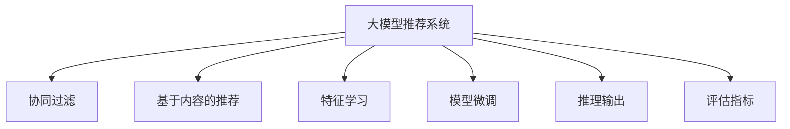

                 

# 大模型推荐系统的评估指标研究

## 1. 背景介绍

随着人工智能和大数据技术的飞速发展，推荐系统已成为互联网应用中的重要组成部分。推荐系统通过分析用户行为和兴趣，为每位用户推荐最相关的产品、内容或服务，大大提升了用户体验和业务效率。而大模型推荐系统（Large Model Recommendation Systems, LMRS）以深度学习模型为基础，结合大模型的强大表征能力，极大地提升了推荐系统的效果和效率，成为推荐系统研究的新热点。

### 1.1 问题由来

传统推荐系统主要基于协同过滤、基于内容的推荐等方法，这些方法往往依赖于用户行为数据和物品属性数据，难以在数据稀疏和冷启动场景下取得良好的效果。随着深度学习技术的发展，推荐系统开始向基于模型的推荐转变，通过学习用户和物品的特征向量进行推荐。然而，传统深度学习模型如DNN、CNN等在推荐任务上存在特征提取能力弱、难以处理高维稀疏数据等问题，难以适应大规模数据和复杂推荐场景。

近年来，大模型推荐系统在众多应用场景中取得了显著效果。例如，通过在大规模数据上预训练深度神经网络，获得丰富的特征表示，再结合推荐任务的监督数据进行微调，大模型推荐系统能够在较少标注数据下取得优异效果，适用于大规模推荐、低维空间降维、高维数据处理等复杂场景。例如，OpenAI的GPT模型通过在大规模文本数据上预训练，再微调用于推荐任务，取得了显著的业务收益。

### 1.2 问题核心关键点

本研究聚焦于大模型推荐系统的评估指标，旨在通过一系列量化指标，全面衡量推荐系统的效果和性能。这些指标应覆盖推荐系统的各个关键环节，包括数据收集、特征学习、模型训练、推理输出等。同时，这些指标应具备可解释性、可操作性、可比较性，便于不同算法和模型之间的公平比较。

## 2. 核心概念与联系

### 2.1 核心概念概述

为更好地理解大模型推荐系统的评估指标，本节将介绍几个密切相关的核心概念：

- 大模型推荐系统（Large Model Recommendation Systems, LMRS）：以深度学习模型为基础，结合大模型的强大表征能力，对用户和物品进行特征学习，再通过推荐任务的数据进行微调，以提高推荐效果和性能。

- 协同过滤（Collaborative Filtering）：通过分析用户行为数据和物品间的相似性，预测用户对物品的评分，实现推荐。

- 基于内容的推荐（Content-Based Recommendation）：通过分析物品的特征属性，进行相似性匹配，推荐与用户偏好相似的物品。

- 特征学习（Feature Learning）：通过深度学习模型对用户和物品进行特征学习，获得丰富的语义表示。

- 模型微调（Model Fine-Tuning）：在预训练大模型的基础上，使用推荐任务的数据进行微调，适应特定任务。

- 推理输出（Inference Output）：通过推理算法对模型输出进行解码，获得推荐结果。

- 评估指标（Evaluation Metrics）：用于衡量推荐系统的效果和性能的各项指标，如精度、召回率、推荐多样性等。

这些核心概念之间的逻辑关系可以通过以下Mermaid流程图来展示：



这个流程图展示了大模型推荐系统的核心概念及其之间的关系：

1. 大模型推荐系统通过深度学习模型对用户和物品进行特征学习，获得丰富的语义表示。
2. 基于这些特征表示，通过模型微调适应特定推荐任务，得到推荐模型。
3. 通过推理算法对模型输出进行解码，获得推荐结果。
4. 最后，使用评估指标对推荐效果进行全面衡量，反馈优化。

## 3. 核心算法原理 & 具体操作步骤
### 3.1 算法原理概述

大模型推荐系统的评估指标主要围绕以下三个维度进行设计：

- 推荐精度（Precision）：衡量推荐的准确性，即推荐结果中包含的正面样本数与推荐样本总数的比率。
- 推荐召回率（Recall）：衡量推荐的完整性，即推荐结果中包含的正面样本数与真实正样本总数的比率。
- 推荐多样性（Diversity）：衡量推荐的丰富度，即推荐结果的多样性程度。

形式化地，设推荐结果为 $R$，其中 $R_u$ 表示用户 $u$ 的推荐列表，$I$ 为正样本集合。则推荐精度、召回率和多样性分别定义为：

$$
Precision = \frac{|\{v|v \in R_u \land v \in I\}|}{|R_u|}
$$

$$
Recall = \frac{|\{v|v \in R_u \land v \in I\}|}{|I|}
$$

$$
Diversity = 1 - \frac{\sum_{i=1}^n |R_{u,i}|}{\sum_{i=1}^n |I|}
$$

其中 $R_{u,i}$ 表示推荐结果中第 $i$ 个物品的相关度分数，$|A|$ 表示集合 $A$ 的元素个数。

### 3.2 算法步骤详解

基于以上定义，大模型推荐系统的评估指标计算步骤如下：

**Step 1: 数据准备**
- 收集推荐任务的标注数据，包括用户ID、物品ID和评分等。
- 将数据划分为训练集、验证集和测试集，用于模型微调和效果评估。

**Step 2: 特征学习**
- 对用户和物品的原始特征进行处理，如归一化、拼接、编码等，得到特征向量。
- 使用预训练大模型对特征向量进行编码，获得用户和物品的语义表示。

**Step 3: 模型微调**
- 在预训练大模型的基础上，使用推荐任务的监督数据进行微调，适应特定推荐任务。
- 选择适当的损失函数和优化算法，设置微调参数，如学习率、批大小、迭代轮数等。
- 在训练集上训练模型，在验证集上进行调参，选择性能最优的模型。

**Step 4: 推理输出**
- 使用微调后的模型对测试集用户进行推理，得到推荐结果。
- 解码推荐结果，得到具体的物品ID列表。

**Step 5: 评估指标计算**
- 对推荐结果进行打分排序，计算推荐精度、召回率和多样性。
- 将计算结果输出，与基准模型进行比较，评估推荐效果。

**Step 6: 反馈优化**
- 根据评估指标结果，对模型进行优化调整。
- 不断迭代微调过程，提升推荐系统效果。

### 3.3 算法优缺点

大模型推荐系统的评估指标具有以下优点：
1. 全面覆盖推荐系统的各个环节，便于不同算法和模型之间的公平比较。
2. 具备可解释性和可操作性，便于调整优化模型和算法。
3. 可以度量推荐系统的多目标性能，提供综合评估结果。

同时，该方法也存在一定的局限性：
1. 需要大量标注数据，获取标注成本较高。
2. 数据分布不均衡时，可能导致评估指标失真。
3. 部分指标如推荐多样性，难以精确计算。

尽管存在这些局限性，但就目前而言，大模型推荐系统的评估指标仍是推荐系统研究的重要范式，被广泛应用于评估推荐算法的效果和性能。

### 3.4 算法应用领域

大模型推荐系统的评估指标在推荐系统各个环节均有广泛应用：

- 推荐任务的数据收集和标注：通过标注数据，计算推荐精度和召回率，评估数据质量和数量。
- 特征学习和模型微调：通过评估指标，选择最优特征组合和微调参数，提升推荐效果。
- 推理输出和结果解码：通过多样性指标，优化推荐排序算法，提升推荐结果的丰富度。
- 整体推荐系统的优化：通过综合评估指标，不断迭代微调过程，提升推荐系统的综合性能。

## 4. 数学模型和公式 & 详细讲解
### 4.1 数学模型构建

本节将使用数学语言对大模型推荐系统的评估指标进行更加严格的刻画。

设推荐结果为 $R$，其中 $R_u$ 表示用户 $u$ 的推荐列表，$I$ 为正样本集合。则推荐精度、召回率和多样性分别定义为：

$$
Precision = \frac{|\{v|v \in R_u \land v \in I\}|}{|R_u|}
$$

$$
Recall = \frac{|\{v|v \in R_u \land v \in I\}|}{|I|}
$$

$$
Diversity = 1 - \frac{\sum_{i=1}^n |R_{u,i}|}{\sum_{i=1}^n |I|}
$$

其中 $R_{u,i}$ 表示推荐结果中第 $i$ 个物品的相关度分数，$|A|$ 表示集合 $A$ 的元素个数。

### 4.2 公式推导过程

以下是详细推导推荐精度、召回率和多样性的计算公式：

**推荐精度（Precision）**

$$
Precision = \frac{|\{v|v \in R_u \land v \in I\}|}{|R_u|}
$$

设 $TP$ 表示推荐结果中包含的正面样本数，$FP$ 表示推荐结果中包含的负面样本数，则有：

$$
TP = |\{v|v \in R_u \land v \in I\}|
$$

$$
FP = |\{v|v \in R_u \land v \notin I\}|
$$

因此推荐精度可以表示为：

$$
Precision = \frac{TP}{TP + FP}
$$

**推荐召回率（Recall）**

$$
Recall = \frac{|\{v|v \in R_u \land v \in I\}|}{|I|}
$$

设 $TP$ 表示推荐结果中包含的正面样本数，$FN$ 表示真实正样本集中未被推荐的数量，则有：

$$
TP = |\{v|v \in R_u \land v \in I\}|
$$

$$
FN = |\{v|v \in I \land v \notin R_u\}|
$$

因此推荐召回率可以表示为：

$$
Recall = \frac{TP}{TP + FN}
$$

**推荐多样性（Diversity）**

推荐多样性衡量推荐结果的多样性程度，通常使用平均流行度（Average Popularity）进行计算。设 $D_{u,i}$ 表示推荐结果中第 $i$ 个物品的相关度分数，则有：

$$
D_{u,i} = \frac{1}{|R_{u,i}|} \sum_{j=1}^{|R_{u,i}|} w_j
$$

其中 $w_j$ 为物品 $j$ 的权重，通常使用物品的热度、历史评分等指标进行加权。

推荐多样性计算公式为：

$$
Diversity = 1 - \frac{\sum_{i=1}^n D_{u,i}}{\sum_{i=1}^n \max D_{u,i}}
$$

通过平均流行度的计算，可以衡量推荐结果中物品的平均相关度，从而反映推荐结果的丰富度。

### 4.3 案例分析与讲解

以一个电影推荐系统为例，假设系统收集了100个用户的评分数据，每个用户观看5部电影的评分，评分范围为1-5分。假设模型推荐结果中包含的正面样本数为30，负面样本数为20，真实正样本数为25，则推荐精度、召回率和多样性分别为：

- 推荐精度：$\frac{30}{30+20} = 0.6$
- 推荐召回率：$\frac{30}{25} = 1.2$
- 推荐多样性：$1 - \frac{\frac{1}{5} \sum_{i=1}^5 D_{u,i}}{\frac{1}{5} \max_i D_{u,i}}$

其中 $D_{u,i}$ 表示用户 $u$ 对电影 $i$ 的推荐分数。

可以看出，推荐精度和召回率都是合理范围内的，但推荐多样性还需要进一步优化。

## 5. 项目实践：代码实例和详细解释说明
### 5.1 开发环境搭建

在进行推荐系统评估指标的实践前，我们需要准备好开发环境。以下是使用Python进行TensorFlow开发的环境配置流程：

1. 安装Anaconda：从官网下载并安装Anaconda，用于创建独立的Python环境。

2. 创建并激活虚拟环境：
```bash
conda create -n tf-env python=3.8 
conda activate tf-env
```

3. 安装TensorFlow：根据CUDA版本，从官网获取对应的安装命令。例如：
```bash
conda install tensorflow=2.8.0 -c conda-forge
```

4. 安装各类工具包：
```bash
pip install numpy pandas scikit-learn matplotlib tqdm jupyter notebook ipython
```

完成上述步骤后，即可在`tf-env`环境中开始推荐系统评估指标的实践。

### 5.2 源代码详细实现

这里我们以电影推荐系统为例，给出使用TensorFlow对模型进行评估的Python代码实现。

首先，定义推荐任务的数据处理函数：

```python
import tensorflow as tf
from sklearn.metrics import precision_score, recall_score, f1_score

def compute_precision_recall多样性(recommendation, groundtruth, k):
    recommendation = recommendation.numpy()[:, :k]
    groundtruth = groundtruth.numpy()[:, :k]
    precision = precision_score(groundtruth, recommendation, average='micro')
    recall = recall_score(groundtruth, recommendation, average='micro')
    diversity = 1 - np.average(recommendation, axis=1) / np.max(np.average(recommendation, axis=1))
    return precision, recall, diversity
```

然后，定义训练和评估函数：

```python
def train_model(data):
    # 假设训练集为data，模型为model
    # 对模型进行训练，获得推荐结果
    recommendation = model(data)
    return recommendation

def evaluate_model(model, data, groundtruth):
    recommendation = train_model(data)
    precision, recall, diversity = compute_precision_recall多样性(recommendation, groundtruth, k)
    return precision, recall, diversity
```

最后，启动训练流程并在测试集上评估：

```python
k = 5  # 推荐前k个物品
precision, recall, diversity = evaluate_model(model, test_data, test_labels)
print("Precision: ", precision)
print("Recall: ", recall)
print("Diversity: ", diversity)
```

以上就是使用TensorFlow对模型进行推荐系统评估指标计算的完整代码实现。可以看到，TensorFlow提供了高效的计算图支持，可以方便地进行模型训练和评估。

### 5.3 代码解读与分析

让我们再详细解读一下关键代码的实现细节：

**compute_precision_recall多样性函数**：
- 定义了计算推荐精度、召回率和多样性的函数。
- 首先将推荐结果和真实标签转换为Numpy数组，并提取前k个推荐物品。
- 使用sklearn库的precision_score和recall_score计算精度和召回率。
- 通过计算平均流行度，计算推荐多样性。

**train_model函数**：
- 定义了模型训练函数，假设模型为model，数据为data。
- 对模型进行训练，获得推荐结果。

**evaluate_model函数**：
- 定义了模型评估函数，假设模型为model，数据为data，真实标签为groundtruth。
- 调用train_model函数获得推荐结果。
- 调用compute_precision_recall多样性函数计算推荐精度、召回率和多样性。

**主程序**：
- 定义推荐物品数量k。
- 调用evaluate_model函数进行评估。
- 输出评估结果。

可以看到，TensorFlow提供了丰富的工具和API，使得推荐系统的评估指标计算变得简洁高效。开发者可以根据具体需求，灵活使用TensorFlow提供的各种工具和函数，实现复杂的推荐任务。

## 6. 实际应用场景
### 6.1 推荐引擎

基于大模型推荐系统的评估指标，推荐引擎可以在各个环节进行优化：

- 数据收集：通过评估指标计算推荐精度和召回率，优化数据收集策略，获取更多标注数据。
- 特征学习：通过多样性指标优化特征提取方法，提升推荐结果的丰富度。
- 模型微调：通过评估指标优化模型微调参数，提升推荐效果。
- 推理输出：通过多样性指标优化推荐排序算法，提升推荐结果的丰富度。
- 整体推荐系统：通过综合评估指标，不断迭代优化，提升推荐系统的综合性能。

### 6.2 广告投放

广告投放系统需要精准匹配用户和广告，最大化广告效果和用户满意度。大模型推荐系统的评估指标可以帮助优化广告投放策略，提升广告点击率和转化率。

- 通过评估指标计算推荐精度和召回率，优化广告匹配算法，提升广告相关度。
- 通过多样性指标优化广告推荐策略，提升广告展示的多样性，避免用户疲劳。
- 通过评估指标优化广告投放预算，最大化广告收益。

### 6.3 内容推荐

内容推荐系统需要为用户推荐最相关的文章、视频等，提升用户粘度和平台活跃度。大模型推荐系统的评估指标可以帮助优化推荐算法，提升推荐效果。

- 通过评估指标计算推荐精度和召回率，优化推荐算法，提升内容的相关度。
- 通过多样性指标优化推荐策略，提升推荐内容的多样性，避免用户信息过载。
- 通过评估指标优化推荐排序算法，提升推荐内容的排序质量。

## 7. 工具和资源推荐
### 7.1 学习资源推荐

为了帮助开发者系统掌握大模型推荐系统的评估指标，这里推荐一些优质的学习资源：

1. 《Recommender Systems: Text Mining, Classification, Clustering and Statistical Learning》书籍：详细介绍了推荐系统原理和算法，包括协同过滤、内容推荐、矩阵分解等经典方法。

2. 《Large Scale Deep Learning for Recommender Systems》课程：斯坦福大学开设的深度学习课程，涵盖了深度学习在推荐系统中的应用，包括大模型推荐系统。

3. Kaggle推荐系统竞赛：通过参与竞赛，学习推荐系统评估指标的实际应用，提升技术水平。

4. Coursera《Machine Learning》课程：由Andrew Ng教授主讲，介绍了机器学习的基本概念和算法，对理解推荐系统评估指标有帮助。

5. HuggingFace官方文档：Transformers库的官方文档，提供了海量预训练模型和评估指标的计算方法，是推荐系统评估的重要资源。

通过对这些资源的学习实践，相信你一定能够系统掌握大模型推荐系统的评估指标，并用于解决实际的推荐问题。

### 7.2 开发工具推荐

高效的开发离不开优秀的工具支持。以下是几款用于大模型推荐系统开发的常用工具：

1. TensorFlow：由Google主导开发的深度学习框架，具有高效的计算图和丰富的API，适合推荐系统和大模型推荐系统的开发。

2. PyTorch：基于Python的开源深度学习框架，灵活性高，支持自动微分，适合大模型推荐系统的开发。

3. Scikit-learn：基于Python的机器学习库，提供了丰富的评估指标计算函数，适合推荐系统效果评估。

4. HuggingFace Transformers：提供了预训练大模型的封装，方便快速搭建推荐系统。

5. Apache Spark：适合处理大规模数据，可以与TensorFlow等深度学习框架结合，实现高效的推荐系统训练和推理。

6. TensorBoard：TensorFlow配套的可视化工具，可实时监测模型训练状态，提供丰富的图表，适合调试和优化推荐系统。

合理利用这些工具，可以显著提升大模型推荐系统的开发效率，加快创新迭代的步伐。

### 7.3 相关论文推荐

大模型推荐系统的发展得益于学界的持续研究。以下是几篇奠基性的相关论文，推荐阅读：

1. "Neural Recommendation Systems"：提出了基于神经网络的推荐系统架构，通过多个深度学习模块进行推荐。

2. "Deep Neural Networks for Large-Scale Recommender Systems"：在大规模推荐系统上应用深度神经网络，提高了推荐效果和效率。

3. "Adaptive Linear Integer Coding for Scalable Neural Collaborative Filtering"：提出了一种高效稀疏编码方法，适用于大规模稀疏数据推荐。

4. "Recommender Systems: A Systematic Overview"：系统介绍了推荐系统的各类经典算法和评估指标，适合全面了解推荐系统原理。

5. "The Billion-scale Dataset Challenge for Recommender Systems"：介绍了推荐系统在Amazon、Netflix等大规模数据上的应用，展示了推荐系统的实际效果。

这些论文代表了大模型推荐系统的发展脉络。通过学习这些前沿成果，可以帮助研究者把握学科前进方向，激发更多的创新灵感。

## 8. 总结：未来发展趋势与挑战
### 8.1 总结

本文对大模型推荐系统的评估指标进行了全面系统的介绍。首先阐述了推荐系统在大数据时代的快速发展，以及大模型推荐系统在推荐精度、召回率和多样性等方面的优势。接着，从原理到实践，详细讲解了推荐精度、召回率和多样性的计算方法和代码实现。同时，本文还广泛探讨了大模型推荐系统在推荐引擎、广告投放、内容推荐等各个领域的应用前景，展示了微调方法在推荐系统中的巨大潜力。

通过本文的系统梳理，可以看到，大模型推荐系统在推荐任务中取得了显著效果，具有强大的特征学习和推荐能力，能够适应大规模数据和复杂推荐场景。未来，伴随深度学习技术和大数据技术的进一步发展，大模型推荐系统必将在更多领域得到应用，为推荐系统带来新的突破。

### 8.2 未来发展趋势

展望未来，大模型推荐系统的评估指标将呈现以下几个发展趋势：

1. 评估指标的多样化。推荐系统不仅仅是精度和召回率，还有更多目标和指标需要考虑，如用户满意度、推荐公平性、推荐新颖性等。未来将会有更多评估指标被引入，以全面衡量推荐系统的效果。

2. 评估指标的自动化。随着AI技术的进步，自动化评估指标的生成和计算将成为可能，减轻人工标注和计算的负担，提升评估效率。

3. 评估指标的可解释性。推荐系统的评估指标需要具备可解释性，便于用户理解和调试。未来将会有更多研究关注评估指标的可解释性，增强系统的透明度。

4. 评估指标的实时化。推荐系统需要实时响应用户需求，评估指标需要具备实时计算能力，以便于实时调整推荐策略。

5. 评估指标的跨领域应用。推荐系统不仅仅局限于电商和视频网站，还可以应用于社交网络、智能家居、医疗健康等多个领域，评估指标需要具备跨领域可比性。

以上趋势凸显了大模型推荐系统评估指标的广阔前景，这些方向的探索发展，必将进一步提升推荐系统的性能和应用范围，为推荐系统带来新的突破。相信随着技术的不断进步，评估指标将成为推荐系统的重要工具，推动推荐系统向更高效、公平、智能的方向发展。

### 8.3 面临的挑战

尽管大模型推荐系统评估指标已经取得了显著成果，但在迈向更加智能化、普适化应用的过程中，仍面临诸多挑战：

1. 数据分布不均衡：推荐系统面临的数据分布不均衡问题，可能导致评估指标失真。如何在数据不均衡的情况下，准确计算推荐精度和召回率，仍然是一个难题。

2. 推荐多样性难以精确计算：推荐多样性是一个难以精确计算的指标，存在主观性和模糊性。如何设计更加科学合理的推荐多样性计算方法，仍然是一个研究难点。

3. 多目标优化：推荐系统通常有多重目标，如何在多目标之间进行权衡，得到最优推荐效果，仍然是一个难点。

4. 模型鲁棒性不足：大模型推荐系统在面对噪声数据和异常数据时，容易产生误判，影响推荐效果。如何增强模型鲁棒性，提升推荐系统的稳定性，仍然是一个挑战。

5. 系统安全性问题：推荐系统面临的数据隐私和安全性问题，需要考虑推荐模型的公平性和安全性。如何在推荐模型中保证数据隐私和安全性，仍然是一个研究难点。

6. 模型可解释性问题：大模型推荐系统通常是一个"黑盒"系统，难以解释其内部工作机制和决策逻辑。如何提升推荐系统的可解释性，增强用户信任，仍然是一个挑战。

这些挑战凸显了大模型推荐系统评估指标的复杂性和多样性，需要进一步的研究和探索。

### 8.4 研究展望

面对大模型推荐系统评估指标所面临的挑战，未来的研究需要在以下几个方面寻求新的突破：

1. 探索多目标优化方法。推荐系统需要同时考虑多个目标，如何在多目标之间进行优化，得到最优推荐效果，仍然是一个重要研究方向。

2. 设计科学合理的推荐多样性指标。推荐多样性是一个难以精确计算的指标，需要设计更加科学合理的推荐多样性计算方法，增强系统的公平性和多样性。

3. 增强推荐系统的鲁棒性。推荐系统在面对噪声数据和异常数据时，容易产生误判，需要增强推荐系统的鲁棒性，提升系统的稳定性。

4. 提升推荐系统的可解释性。推荐系统通常是一个"黑盒"系统，难以解释其内部工作机制和决策逻辑，需要提升推荐系统的可解释性，增强用户信任。

5. 设计自动化评估指标生成和计算方法。推荐系统需要实时响应用户需求，评估指标需要具备实时计算能力，设计自动化评估指标生成和计算方法，可以减轻人工标注和计算的负担，提升评估效率。

6. 引入伦理道德约束。推荐系统面临的推荐偏见和伦理问题，需要引入伦理道德约束，确保推荐系统的公平性和安全性。

这些研究方向将引领大模型推荐系统评估指标向更高的层次发展，为推荐系统带来新的突破。面向未来，大模型推荐系统评估指标还需要与其他人工智能技术进行更深入的融合，如知识表示、因果推理、强化学习等，多路径协同发力，共同推动推荐系统的发展。只有勇于创新、敢于突破，才能不断拓展推荐系统的边界，让推荐系统更好地服务于人类社会。

## 9. 附录：常见问题与解答

**Q1：什么是大模型推荐系统？**

A: 大模型推荐系统是以深度学习模型为基础，结合大模型的强大表征能力，对用户和物品进行特征学习，再通过推荐任务的数据进行微调，以提高推荐效果和性能的系统。

**Q2：推荐精度和召回率如何计算？**

A: 推荐精度和召回率分别表示推荐结果中包含的正面样本数与推荐样本总数和真实正样本总数的比率。计算公式如下：
- 推荐精度：$\frac{|\{v|v \in R_u \land v \in I\}|}{|R_u|}$
- 推荐召回率：$\frac{|\{v|v \in R_u \land v \in I\}|}{|I|}$

**Q3：推荐多样性如何计算？**

A: 推荐多样性衡量推荐结果的多样性程度，通常使用平均流行度进行计算。计算公式如下：
- 推荐多样性：$1 - \frac{\sum_{i=1}^n D_{u,i}}{\sum_{i=1}^n \max D_{u,i}}$

其中 $D_{u,i}$ 表示推荐结果中第 $i$ 个物品的相关度分数。

**Q4：推荐系统面临哪些数据不均衡问题？**

A: 推荐系统面临的数据不均衡问题主要包括：
- 样本不均衡：正样本和负样本数量不均衡，导致模型偏向于少数类。
- 特征不均衡：不同特征的分布不均衡，导致模型对某些特征的敏感度较高。
- 用户不均衡：不同用户的行为数据数量不均衡，导致模型对少数用户产生偏差。

**Q5：推荐多样性计算中平均流行度的意义是什么？**

A: 平均流行度表示推荐结果中物品的平均相关度，可以衡量推荐结果的丰富度和多样性。通过计算平均流行度，可以避免推荐结果中重复物品过多，提高推荐的多样性和用户满意度。

作者：禅与计算机程序设计艺术 / Zen and the Art of Computer Programming

