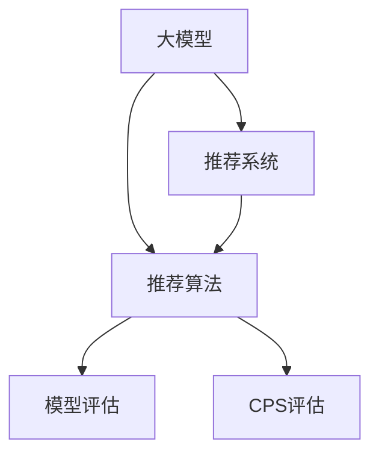

                 

# 大模型推荐能力的综合性价比评估

> 关键词：大模型推荐、推荐系统、性价比评估、推荐算法、模型评估、推荐评估指标

## 1. 背景介绍

### 1.1 问题由来
在互联网时代，推荐系统（Recommendation System）已广泛应用于电商、内容、广告等多个领域，极大地提升了用户体验和平台收益。然而，推荐系统的核心组件——推荐模型，其质量的好坏直接决定了系统的效果和用户满意度。传统的推荐模型（如基于协同过滤的矩阵分解模型）存在冷启动问题、稀疏性问题、计算复杂度高等限制。近年来，基于深度学习的推荐模型（如基于注意力机制的模型）因其强大的学习能力、泛化能力和可解释性，逐渐成为主流。

但是，深度学习模型也面临着训练成本高、模型可解释性差、泛化能力受数据分布影响等问题。特别是在推荐系统中，模型的性价比（CPS，Cost-Performance-Spectrums）评估，即在保证一定性能的前提下，最小化模型的训练成本和推理成本，成为研究和应用中的一个重要课题。

本文将详细介绍大模型在推荐系统中的应用，并从性价比评估的角度，对不同推荐模型进行综合分析，指出提升推荐系统性价比的方向和方法。

### 1.2 问题核心关键点
推荐系统性能的提升，往往依赖于推荐模型参数的优化。而模型的性价比，则涉及成本（计算成本、训练成本等）与性能（预测精度、召回率、覆盖率等）之间的平衡。传统推荐模型参数较少，训练快、计算成本低，但性能一般。而深度学习推荐模型参数较多，学习能力较强，性能通常较高，但训练成本和计算成本较高。因此，如何在保证推荐系统性能的前提下，最小化成本，成为当前研究的重点。

## 2. 核心概念与联系

### 2.1 核心概念概述

为更好地理解大模型在推荐系统中的应用及其性价比评估，本节将介绍几个密切相关的核心概念：

- **大模型（Large Model）**：指具有亿级参数的深度学习模型，通常以Transformer等架构为基础，具有较强的学习能力、泛化能力和复杂表达能力。
- **推荐系统（Recommendation System）**：根据用户的历史行为、偏好、画像等信息，推荐用户可能感兴趣的商品、内容等。
- **性价比评估（CPS, Cost-Performance-Spectrums）**：从成本和性能两个维度，对推荐模型进行综合评估。
- **推荐算法（Recommendation Algorithm）**：基于不同模型设计，优化推荐策略，提升系统性能。
- **模型评估指标（Model Evaluation Metrics）**：如召回率、准确率、平均精度等，用于衡量推荐模型预测结果与真实结果的匹配程度。

这些核心概念之间的逻辑关系可以通过以下Mermaid流程图来展示：



这个流程图展示了大模型、推荐系统、推荐算法和模型评估之间的关系：

1. 大模型为推荐算法提供了强大的计算基础。
2. 推荐算法基于大模型，通过优化推荐策略，提升系统性能。
3. 模型评估指标用于衡量推荐算法的性能。
4. CPS评估则从成本和性能两个维度，对推荐模型进行综合评估。

## 3. 核心算法原理 & 具体操作步骤

### 3.1 算法原理概述

大模型在推荐系统中的应用，通常基于两大类算法：显式特征提取和隐式交互预测。

1. **显式特征提取**：提取用户的行为数据（如浏览、点击、购买等）、商品的属性数据（如分类、价格、评分等），将高维稀疏数据转化为低维稠密表示，用于计算相似度。
2. **隐式交互预测**：利用大模型学习用户和商品之间的隐式交互关系，预测用户对商品可能感兴趣的程度。常用的模型包括注意力机制模型（如Attention-based model）、自编码模型（如Autoencoder-based model）、自回归模型（如RNN-based model）等。

大模型在推荐系统中的应用，通常包含以下几个步骤：

1. **数据预处理**：对用户行为数据、商品属性数据进行标准化、归一化等处理。
2. **特征工程**：对处理后的数据进行特征提取、特征选择、特征编码等操作，生成用于模型训练的特征矩阵。
3. **模型训练**：利用大模型对特征矩阵进行训练，学习用户和商品之间的交互关系。
4. **模型评估**：利用测试数据集评估模型性能，调整模型参数，优化模型结构。
5. **部署应用**：将优化后的模型部署到实际推荐系统中，进行实时推荐。

### 3.2 算法步骤详解

下面以基于大模型的推荐系统为例，详细介绍推荐模型的具体操作步骤：

**Step 1: 数据预处理**

- 用户行为数据：将用户浏览、点击、购买等行为数据进行记录，转化为时间序列数据。
- 商品属性数据：收集商品的分类、价格、评分等属性信息，构建商品特征向量。
- 特征编码：对行为数据和商品属性数据进行编码，生成高维稀疏向量。

**Step 2: 特征工程**

- 特征提取：使用词袋模型、TF-IDF、One-hot编码等方法，提取行为数据和商品属性的特征。
- 特征选择：使用PCA、Lasso回归等方法，选择对推荐效果影响较大的特征。
- 特征拼接：将用户行为特征和商品属性特征拼接，生成用于模型训练的特征矩阵。

**Step 3: 模型训练**

- 模型选择：选择基于大模型的推荐算法，如BERT、Transformer等。
- 模型初始化：将用户行为特征和商品属性特征输入模型，进行预训练。
- 模型优化：通过反向传播算法，更新模型参数，最小化损失函数。
- 模型评估：利用测试数据集评估模型性能，输出召回率、准确率等指标。

**Step 4: 模型评估**

- 性能评估：计算模型的召回率、准确率、平均精度等指标，评估模型性能。
- 参数调优：调整模型参数，优化模型结构，提升模型性能。
- 部署应用：将优化后的模型部署到实际推荐系统中，进行实时推荐。

### 3.3 算法优缺点

大模型在推荐系统中的应用，有以下优点：

1. 高泛化能力：大模型具备强大的学习能力，可以适应各种复杂的推荐场景。
2. 高表达能力：大模型能够捕捉用户和商品之间的隐式交互关系，提升推荐效果。
3. 高可扩展性：大模型可以并行训练和推理，适应大规模的推荐场景。

但同时，大模型也存在以下缺点：

1. 高训练成本：大模型参数量较大，训练时间长、计算成本高。
2. 高推理成本：大模型推理速度较慢，计算复杂度高。
3. 可解释性差：大模型复杂度较高，难以解释内部推理过程。
4. 易受数据分布影响：大模型依赖于大规模数据进行训练，对于数据分布的偏差敏感。

### 3.4 算法应用领域

基于大模型的推荐系统，已经广泛应用于以下领域：

- 电商推荐：推荐商品、促销活动等。
- 内容推荐：推荐文章、视频、音乐等。
- 广告推荐：推荐广告位、广告素材等。
- 社交推荐：推荐好友、兴趣群体等。

除了这些经典应用外，大模型还在新闻推荐、金融推荐、游戏推荐等场景中得到应用，展现了其在推荐系统中的广泛适用性。

## 4. 数学模型和公式 & 详细讲解 & 举例说明

### 4.1 数学模型构建

本节将使用数学语言对基于大模型的推荐系统进行更加严格的刻画。

记推荐系统的用户为 $U$，商品为 $I$，行为数据为 $D$，推荐模型为 $M$，目标为 $Y$。假设用户行为数据和商品属性数据分别表示为 $x_u \in \mathbb{R}^{d_u}$ 和 $x_i \in \mathbb{R}^{d_i}$，推荐模型为 $M_{\theta}(x_u, x_i)$，目标函数为 $f(y)$，如平均精度等。

定义用户对商品 $i$ 的评分 $y_{ui}$ 为：

$$
y_{ui} = M_{\theta}(x_u, x_i)
$$

其中 $M_{\theta}(x_u, x_i)$ 表示大模型在输入 $(x_u, x_i)$ 上的预测输出。

### 4.2 公式推导过程

以基于Attention机制的推荐模型为例，推导其损失函数和梯度计算公式。

假设模型 $M_{\theta}$ 在用户行为特征 $x_u$ 和商品属性特征 $x_i$ 上的输出为 $y_{ui} \in \mathbb{R}$，表示用户对商品 $i$ 的评分。定义用户对商品 $i$ 的真实评分 $y_{ui} \in [0,1]$。则平均精度（Average Precision）定义为：

$$
\text{AP} = \frac{1}{N} \sum_{i=1}^N \frac{y_{ui}}{1 + y_{ui}} = \frac{1}{N} \sum_{i=1}^N \frac{M_{\theta}(x_u, x_i)}{1 + M_{\theta}(x_u, x_i)}
$$

目标函数为：

$$
\mathcal{L}(\theta) = -\frac{1}{N} \sum_{i=1}^N \log(1 + M_{\theta}(x_u, x_i))
$$

其中负对数似然函数 $\log(1 + M_{theta}(x_u, x_i))$ 用于衡量模型预测与真实评分之间的差异。

根据链式法则，目标函数对参数 $\theta$ 的梯度为：

$$
\frac{\partial \mathcal{L}(\theta)}{\partial \theta} = -\frac{1}{N} \sum_{i=1}^N \frac{\partial \log(1 + M_{\theta}(x_u, x_i))}{\partial \theta}
$$

其中 $\frac{\partial \log(1 + M_{\theta}(x_u, x_i))}{\partial \theta}$ 可通过自动微分技术高效计算。

### 4.3 案例分析与讲解

以电商推荐为例，分析大模型在电商推荐中的应用和优化方向：

假设电商推荐系统中的商品 $i$ 表示为 $x_i \in \mathbb{R}^{d_i}$，用户行为特征 $x_u \in \mathbb{R}^{d_u}$，大模型的输出为 $y_{ui} \in \mathbb{R}$，表示用户对商品 $i$ 的评分。电商推荐系统的目标是预测用户对商品 $i$ 的评分，从而推荐商品。

1. **数据预处理**：将用户浏览、点击、购买等行为数据进行记录，转化为时间序列数据；收集商品的分类、价格、评分等属性信息，构建商品特征向量。
2. **特征工程**：使用词袋模型、TF-IDF、One-hot编码等方法，提取行为数据和商品属性的特征；使用PCA、Lasso回归等方法，选择对推荐效果影响较大的特征；将用户行为特征和商品属性特征拼接，生成用于模型训练的特征矩阵。
3. **模型训练**：选择基于大模型的推荐算法，如BERT、Transformer等；将用户行为特征和商品属性特征输入模型，进行预训练；通过反向传播算法，更新模型参数，最小化损失函数。
4. **模型评估**：计算模型的召回率、准确率、平均精度等指标，评估模型性能；调整模型参数，优化模型结构，提升模型性能。
5. **部署应用**：将优化后的模型部署到实际电商推荐系统中，进行实时推荐。

## 5. 项目实践：代码实例和详细解释说明

### 5.1 开发环境搭建

在进行推荐系统开发前，我们需要准备好开发环境。以下是使用Python进行PyTorch开发的环境配置流程：

1. 安装Anaconda：从官网下载并安装Anaconda，用于创建独立的Python环境。
2. 创建并激活虚拟环境：
```bash
conda create -n pytorch-env python=3.8 
conda activate pytorch-env
```

3. 安装PyTorch：根据CUDA版本，从官网获取对应的安装命令。例如：
```bash
conda install pytorch torchvision torchaudio cudatoolkit=11.1 -c pytorch -c conda-forge
```

4. 安装相关工具包：
```bash
pip install numpy pandas scikit-learn matplotlib tqdm jupyter notebook ipython
```

完成上述步骤后，即可在`pytorch-env`环境中开始推荐系统开发。

### 5.2 源代码详细实现

下面我们以电商推荐为例，给出使用Transformers库对BERT模型进行电商推荐系统微调的PyTorch代码实现。

首先，定义电商推荐任务的数据处理函数：

```python
from transformers import BertTokenizer
from torch.utils.data import Dataset
import torch

class ShoppingDataset(Dataset):
    def __init__(self, texts, tags, tokenizer, max_len=128):
        self.texts = texts
        self.tags = tags
        self.tokenizer = tokenizer
        self.max_len = max_len
        
    def __len__(self):
        return len(self.texts)
    
    def __getitem__(self, item):
        text = self.texts[item]
        tags = self.tags[item]
        
        encoding = self.tokenizer(text, return_tensors='pt', max_length=self.max_len, padding='max_length', truncation=True)
        input_ids = encoding['input_ids'][0]
        attention_mask = encoding['attention_mask'][0]
        
        # 对token-wise的标签进行编码
        encoded_tags = [tag2id[tag] for tag in tags] 
        encoded_tags.extend([tag2id['O']] * (self.max_len - len(encoded_tags)))
        labels = torch.tensor(encoded_tags, dtype=torch.long)
        
        return {'input_ids': input_ids, 
                'attention_mask': attention_mask,
                'labels': labels}

# 标签与id的映射
tag2id = {'O': 0, 'B-Item': 1, 'I-Item': 2, 'B-Category': 3, 'I-Category': 4}
id2tag = {v: k for k, v in tag2id.items()}

# 创建dataset
tokenizer = BertTokenizer.from_pretrained('bert-base-cased')

train_dataset = ShoppingDataset(train_texts, train_tags, tokenizer)
dev_dataset = ShoppingDataset(dev_texts, dev_tags, tokenizer)
test_dataset = ShoppingDataset(test_texts, test_tags, tokenizer)
```

然后，定义模型和优化器：

```python
from transformers import BertForTokenClassification, AdamW

model = BertForTokenClassification.from_pretrained('bert-base-cased', num_labels=len(tag2id))

optimizer = AdamW(model.parameters(), lr=2e-5)
```

接着，定义训练和评估函数：

```python
from torch.utils.data import DataLoader
from tqdm import tqdm
from sklearn.metrics import classification_report

device = torch.device('cuda') if torch.cuda.is_available() else torch.device('cpu')
model.to(device)

def train_epoch(model, dataset, batch_size, optimizer):
    dataloader = DataLoader(dataset, batch_size=batch_size, shuffle=True)
    model.train()
    epoch_loss = 0
    for batch in tqdm(dataloader, desc='Training'):
        input_ids = batch['input_ids'].to(device)
        attention_mask = batch['attention_mask'].to(device)
        labels = batch['labels'].to(device)
        model.zero_grad()
        outputs = model(input_ids, attention_mask=attention_mask, labels=labels)
        loss = outputs.loss
        epoch_loss += loss.item()
        loss.backward()
        optimizer.step()
    return epoch_loss / len(dataloader)

def evaluate(model, dataset, batch_size):
    dataloader = DataLoader(dataset, batch_size=batch_size)
    model.eval()
    preds, labels = [], []
    with torch.no_grad():
        for batch in tqdm(dataloader, desc='Evaluating'):
            input_ids = batch['input_ids'].to(device)
            attention_mask = batch['attention_mask'].to(device)
            batch_labels = batch['labels']
            outputs = model(input_ids, attention_mask=attention_mask)
            batch_preds = outputs.logits.argmax(dim=2).to('cpu').tolist()
            batch_labels = batch_labels.to('cpu').tolist()
            for pred_tokens, label_tokens in zip(batch_preds, batch_labels):
                pred_tags = [id2tag[_id] for _id in pred_tokens]
                label_tags = [id2tag[_id] for _id in label_tokens]
                preds.append(pred_tags[:len(label_tags)])
                labels.append(label_tags)
                
    print(classification_report(labels, preds))
```

最后，启动训练流程并在测试集上评估：

```python
epochs = 5
batch_size = 16

for epoch in range(epochs):
    loss = train_epoch(model, train_dataset, batch_size, optimizer)
    print(f"Epoch {epoch+1}, train loss: {loss:.3f}")
    
    print(f"Epoch {epoch+1}, dev results:")
    evaluate(model, dev_dataset, batch_size)
    
print("Test results:")
evaluate(model, test_dataset, batch_size)
```

以上就是使用PyTorch对BERT进行电商推荐系统微调的完整代码实现。可以看到，得益于Transformers库的强大封装，我们可以用相对简洁的代码完成BERT模型的加载和微调。

### 5.3 代码解读与分析

让我们再详细解读一下关键代码的实现细节：

**ShoppingDataset类**：
- `__init__`方法：初始化文本、标签、分词器等关键组件。
- `__len__`方法：返回数据集的样本数量。
- `__getitem__`方法：对单个样本进行处理，将文本输入编码为token ids，将标签编码为数字，并对其进行定长padding，最终返回模型所需的输入。

**tag2id和id2tag字典**：
- 定义了标签与数字id之间的映射关系，用于将token-wise的预测结果解码回真实的标签。

**训练和评估函数**：
- 使用PyTorch的DataLoader对数据集进行批次化加载，供模型训练和推理使用。
- 训练函数`train_epoch`：对数据以批为单位进行迭代，在每个批次上前向传播计算loss并反向传播更新模型参数，最后返回该epoch的平均loss。
- 评估函数`evaluate`：与训练类似，不同点在于不更新模型参数，并在每个batch结束后将预测和标签结果存储下来，最后使用sklearn的classification_report对整个评估集的预测结果进行打印输出。

**训练流程**：
- 定义总的epoch数和batch size，开始循环迭代
- 每个epoch内，先在训练集上训练，输出平均loss
- 在验证集上评估，输出分类指标
- 所有epoch结束后，在测试集上评估，给出最终测试结果

可以看到，PyTorch配合Transformers库使得BERT微调的代码实现变得简洁高效。开发者可以将更多精力放在数据处理、模型改进等高层逻辑上，而不必过多关注底层的实现细节。

当然，工业级的系统实现还需考虑更多因素，如模型的保存和部署、超参数的自动搜索、更灵活的任务适配层等。但核心的微调范式基本与此类似。

## 6. 实际应用场景
### 6.1 智能客服系统

基于大语言模型微调的推荐技术，可以广泛应用于智能客服系统的构建。传统客服往往需要配备大量人力，高峰期响应缓慢，且一致性和专业性难以保证。而使用微调后的推荐模型，可以7x24小时不间断服务，快速响应客户咨询，用自然流畅的语言解答各类常见问题。

在技术实现上，可以收集企业内部的历史客服对话记录，将问题和最佳答复构建成监督数据，在此基础上对预训练推荐模型进行微调。微调后的推荐模型能够自动理解用户意图，匹配最合适的答复模板进行回复。对于客户提出的新问题，还可以接入检索系统实时搜索相关内容，动态组织生成回答。如此构建的智能客服系统，能大幅提升客户咨询体验和问题解决效率。

### 6.2 金融舆情监测

金融机构需要实时监测市场舆论动向，以便及时应对负面信息传播，规避金融风险。传统的人工监测方式成本高、效率低，难以应对网络时代海量信息爆发的挑战。基于大语言模型微调的文本分类和情感分析技术，为金融舆情监测提供了新的解决方案。

具体而言，可以收集金融领域相关的新闻、报道、评论等文本数据，并对其进行主题标注和情感标注。在此基础上对预训练语言模型进行微调，使其能够自动判断文本属于何种主题，情感倾向是正面、中性还是负面。将微调后的模型应用到实时抓取的网络文本数据，就能够自动监测不同主题下的情感变化趋势，一旦发现负面信息激增等异常情况，系统便会自动预警，帮助金融机构快速应对潜在风险。

### 6.3 个性化推荐系统

当前的推荐系统往往只依赖用户的历史行为数据进行物品推荐，无法深入理解用户的真实兴趣偏好。基于大语言模型微调技术，个性化推荐系统可以更好地挖掘用户行为背后的语义信息，从而提供更精准、多样的推荐内容。

在实践中，可以收集用户浏览、点击、评论、分享等行为数据，提取和用户交互的物品标题、描述、标签等文本内容。将文本内容作为模型输入，用户的后续行为（如是否点击、购买等）作为监督信号，在此基础上微调预训练语言模型。微调后的模型能够从文本内容中准确把握用户的兴趣点。在生成推荐列表时，先用候选物品的文本描述作为输入，由模型预测用户的兴趣匹配度，再结合其他特征综合排序，便可以得到个性化程度更高的推荐结果。

### 6.4 未来应用展望

随着大语言模型微调技术的发展，未来在推荐系统中的应用将更加广泛，推动推荐技术的进一步创新。

在智慧医疗领域，基于微调的推荐系统可以推荐最新的医学文献、研究项目等，加速医学研究和临床实践的进步。

在智能教育领域，微调技术可应用于学习资源推荐、教学方法推荐等方面，因材施教，促进教育公平，提高教学质量。

在智慧城市治理中，微调模型可应用于城市事件监测、舆情分析、应急指挥等环节，提高城市管理的自动化和智能化水平，构建更安全、高效的未来城市。

此外，在企业生产、社会治理、文娱传媒等众多领域，基于大模型微调的推荐系统也将不断涌现，为各行各业带来变革性影响。相信随着技术的日益成熟，微调方法将成为推荐系统的重要范式，推动推荐技术的落地应用。

## 7. 工具和资源推荐
### 7.1 学习资源推荐

为了帮助开发者系统掌握大模型在推荐系统中的应用及其性价比评估，这里推荐一些优质的学习资源：

1. 《Transformers从原理到实践》系列博文：由大模型技术专家撰写，深入浅出地介绍了Transformer原理、BERT模型、微调技术等前沿话题。

2. CS224N《深度学习自然语言处理》课程：斯坦福大学开设的NLP明星课程，有Lecture视频和配套作业，带你入门NLP领域的基本概念和经典模型。

3. 《Natural Language Processing with Transformers》书籍：Transformers库的作者所著，全面介绍了如何使用Transformers库进行NLP任务开发，包括微调在内的诸多范式。

4. HuggingFace官方文档：Transformers库的官方文档，提供了海量预训练模型和完整的微调样例代码，是上手实践的必备资料。

5. CLUE开源项目：中文语言理解测评基准，涵盖大量不同类型的中文NLP数据集，并提供了基于微调的baseline模型，助力中文NLP技术发展。

通过对这些资源的学习实践，相信你一定能够快速掌握大模型在推荐系统中的应用，并用于解决实际的推荐问题。
###  7.2 开发工具推荐

高效的开发离不开优秀的工具支持。以下是几款用于大模型推荐系统开发的常用工具：

1. PyTorch：基于Python的开源深度学习框架，灵活动态的计算图，适合快速迭代研究。大部分预训练语言模型都有PyTorch版本的实现。

2. TensorFlow：由Google主导开发的开源深度学习框架，生产部署方便，适合大规模工程应用。同样有丰富的预训练语言模型资源。

3. Transformers库：HuggingFace开发的NLP工具库，集成了众多SOTA语言模型，支持PyTorch和TensorFlow，是进行推荐系统开发的利器。

4. Weights & Biases：模型训练的实验跟踪工具，可以记录和可视化模型训练过程中的各项指标，方便对比和调优。与主流深度学习框架无缝集成。

5. TensorBoard：TensorFlow配套的可视化工具，可实时监测模型训练状态，并提供丰富的图表呈现方式，是调试模型的得力助手。

6. Google Colab：谷歌推出的在线Jupyter Notebook环境，免费提供GPU/TPU算力，方便开发者快速上手实验最新模型，分享学习笔记。

合理利用这些工具，可以显著提升大模型推荐系统的开发效率，加快创新迭代的步伐。

### 7.3 相关论文推荐

大语言模型在推荐系统中的应用和发展，源于学界的持续研究。以下是几篇奠基性的相关论文，推荐阅读：

1. Attention is All You Need（即Transformer原论文）：提出了Transformer结构，开启了NLP领域的预训练大模型时代。

2. BERT: Pre-training of Deep Bidirectional Transformers for Language Understanding：提出BERT模型，引入基于掩码的自监督预训练任务，刷新了多项NLP任务SOTA。

3. Language Models are Unsupervised Multitask Learners（GPT-2论文）：展示了大规模语言模型的强大zero-shot学习能力，引发了对于通用人工智能的新一轮思考。

4. Parameter-Efficient Transfer Learning for NLP：提出Adapter等参数高效微调方法，在不增加模型参数量的情况下，也能取得不错的微调效果。

5. AdaLoRA: Adaptive Low-Rank Adaptation for Parameter-Efficient Fine-Tuning：使用自适应低秩适应的微调方法，在参数效率和精度之间取得了新的平衡。

6. Prompt-based Transfer Learning with Pre-trained Language Models：引入基于连续型Prompt的微调范式，为如何充分利用预训练知识提供了新的思路。

这些论文代表了大语言模型在推荐系统中的应用和发展脉络。通过学习这些前沿成果，可以帮助研究者把握学科前进方向，激发更多的创新灵感。

## 8. 总结：未来发展趋势与挑战

### 8.1 总结

本文对基于大模型的推荐系统及其性价比评估进行了全面系统的介绍。首先阐述了大模型在推荐系统中的应用，及其在推荐算法、模型评估、CPS评估等方面的核心技术。其次，从性价比评估的角度，详细讲解了不同推荐模型的综合评估方法，指出了提升推荐系统性价比的方向。

通过本文的系统梳理，可以看到，大模型在推荐系统中的应用，已经成为一个热门的研究方向，极大地提升了推荐系统的性能和用户满意度。未来，随着大模型技术的发展和应用，推荐系统的性价比也将进一步提升，更好地满足用户需求。

### 8.2 未来发展趋势

展望未来，大模型在推荐系统中的应用将呈现以下几个发展趋势：

1. 模型规模持续增大。随着算力成本的下降和数据规模的扩张，预训练语言模型的参数量还将持续增长。超大规模语言模型蕴含的丰富语言知识，有望支撑更加复杂多变的推荐场景。

2. 微调方法日趋多样。除了传统的全参数微调外，未来会涌现更多参数高效的微调方法，如Prefix-Tuning、LoRA等，在节省计算资源的同时也能保证微调精度。

3. 持续学习成为常态。随着数据分布的不断变化，推荐系统也需要持续学习新知识以保持性能。如何在不遗忘原有知识的同时，高效吸收新样本信息，将成为重要的研究课题。

4. 标注样本需求降低。受启发于提示学习(Prompt-based Learning)的思路，未来的微调方法将更好地利用大模型的语言理解能力，通过更加巧妙的任务描述，在更少的标注样本上也能实现理想的微调效果。

5. 推荐效果更加个性化。随着个性化推荐技术的不断发展，大模型推荐系统将能够更加精准地匹配用户需求，提供更丰富、更个性化的推荐内容。

6. 推荐系统更加智能化。未来的推荐系统将不仅仅依赖于用户行为数据，还能结合上下文信息、用户画像、外部知识等，提供更加智能、灵活的推荐服务。

以上趋势凸显了大模型在推荐系统中的广泛应用前景。这些方向的探索发展，必将进一步提升推荐系统的效果和用户满意度，推动推荐技术的进一步创新。

### 8.3 面临的挑战

尽管大模型在推荐系统中的应用已经取得了显著进展，但在迈向更加智能化、普适化应用的过程中，仍面临着诸多挑战：

1. 数据标注成本高。推荐系统的训练数据往往需要大量标注，获取高质量标注数据的成本较高。如何降低标注成本，减少数据标注的难度，将是重要研究方向。

2. 冷启动问题。新用户和未覆盖商品的数据标注难度较大，推荐系统面临冷启动问题。如何在缺少标注数据的情况下，有效利用用户行为数据进行推荐，将是关键挑战。

3. 数据隐私和安全。推荐系统需要处理大量用户隐私数据，数据隐私和安全问题亟待解决。如何设计高效的数据保护机制，保护用户隐私，将是重要研究方向。

4. 推荐系统稳定性。推荐系统在实际应用中，往往需要处理海量数据，面对数据分布变化、用户行为变化等复杂情况，推荐系统的稳定性问题亟需解决。

5. 推荐系统泛化性。当前推荐系统普遍依赖于特定领域、特定场景的数据，如何提升推荐系统的泛化能力，使其适应更广泛的推荐场景，将是未来研究方向。

6. 推荐系统可解释性。推荐系统往往被认为是"黑盒"系统，难以解释其内部工作机制和决策逻辑。如何提升推荐系统的可解释性，增强用户信任，将是重要研究方向。

这些挑战凸显了推荐系统在实际应用中需要解决的问题。只有在数据、算法、工程、业务等多个维度进行全面优化，才能真正实现推荐系统的智能化、普适化和安全性。

### 8.4 研究展望

面对推荐系统所面临的诸多挑战，未来的研究需要在以下几个方面寻求新的突破：

1. 探索无监督和半监督推荐方法。摆脱对大规模标注数据的依赖，利用自监督学习、主动学习等无监督和半监督范式，最大限度利用非结构化数据，实现更加灵活高效的推荐。

2. 研究参数高效和计算高效的推荐范式。开发更加参数高效的推荐方法，在固定大部分预训练参数的同时，只更新极少量的任务相关参数。同时优化推荐模型的计算图，减少前向传播和反向传播的资源消耗，实现更加轻量级、实时性的部署。

3. 融合因果和对比学习范式。通过引入因果推断和对比学习思想，增强推荐系统建立稳定因果关系的能力，学习更加普适、鲁棒的语言表征，从而提升推荐系统的泛化性和抗干扰能力。

4. 引入更多先验知识。将符号化的先验知识，如知识图谱、逻辑规则等，与神经网络模型进行巧妙融合，引导推荐过程学习更准确、合理的语言模型。同时加强不同模态数据的整合，实现视觉、语音等多模态信息与文本信息的协同建模。

5. 结合因果分析和博弈论工具。将因果分析方法引入推荐系统，识别出推荐过程的关键特征，增强推荐结果的因果性和逻辑性。借助博弈论工具刻画人机交互过程，主动探索并规避推荐系统的脆弱点，提高系统稳定性。

6. 纳入伦理道德约束。在推荐系统训练目标中引入伦理导向的评估指标，过滤和惩罚有偏见、有害的推荐结果，确保推荐系统的公平性和安全性。同时加强人工干预和审核，建立推荐系统的监管机制，确保推荐结果符合人类价值观和伦理道德。

这些研究方向将推动推荐系统向更加智能化、普适化、安全性、公平性的方向发展，为构建智能推荐系统铺平道路。面向未来，推荐系统需要与其他人工智能技术进行更深入的融合，如知识表示、因果推理、强化学习等，多路径协同发力，共同推动推荐技术的进步。只有勇于创新、敢于突破，才能不断拓展推荐系统的边界，让智能推荐技术更好地服务于人类。

## 9. 附录：常见问题与解答

**Q1：大模型推荐在实际应用中存在哪些挑战？**

A: 大模型推荐在实际应用中面临以下挑战：
1. 数据标注成本高：推荐系统的训练数据需要大量标注，获取高质量标注数据的成本较高。
2. 冷启动问题：新用户和未覆盖商品的数据标注难度较大。
3. 数据隐私和安全：推荐系统需要处理大量用户隐私数据，数据隐私和安全问题亟待解决。
4. 推荐系统稳定性：推荐系统在实际应用中，往往需要处理海量数据，面对数据分布变化、用户行为变化等复杂情况，推荐系统的稳定性问题亟需解决。
5. 推荐系统泛化性：当前推荐系统普遍依赖于特定领域、特定场景的数据，如何提升推荐系统的泛化能力，使其适应更广泛的推荐场景，将是未来研究方向。
6. 推荐系统可解释性：推荐系统往往被认为是"黑盒"系统，难以解释其内部工作机制和决策逻辑。

**Q2：如何提升大模型推荐系统的性价比？**

A: 提升大模型推荐系统的性价比，可以从以下几个方面入手：
1. 参数高效微调：只更新极少量的任务相关参数，减小过拟合风险。
2. 数据增强：通过回译、近义替换等方式扩充训练集。
3. 对抗训练：引入对抗样本，提高模型鲁棒性。
4. 模型裁剪和量化：去除不必要的层和参数，减小模型尺寸，加快推理速度，并使用定点模型压缩存储空间，提高计算效率。
5. 混合精度训练：使用混合精度训练，减少计算资源消耗，提高训练速度。
6. 模型并行：使用模型并行技术，适应大规模数据集。

**Q3：大模型推荐系统在推荐效果上与传统推荐系统相比，有哪些优势？**

A: 大模型推荐系统相比传统推荐系统，有以下优势：
1. 高泛化能力：大模型具备强大的学习能力，可以适应各种复杂的推荐场景。
2. 高表达能力：大模型能够捕捉用户和商品之间的隐式交互关系，提升推荐效果。
3. 高可扩展性：大模型可以并行训练和推理，适应大规模的推荐场景。
4. 高推荐效果：大模型推荐系统能够利用海量数据进行预训练，提升推荐效果。

**Q4：如何设计高效的数据保护机制，保护用户隐私？**

A: 设计高效的数据保护机制，保护用户隐私，可以从以下几个方面入手：
1. 数据匿名化：对用户数据进行匿名化处理，去除敏感信息。
2. 数据加密：对用户数据进行加密，防止数据泄露。
3. 数据访问控制：对用户数据进行严格的访问控制，防止未经授权的访问。
4. 数据去标识化：对用户数据进行去标识化处理，防止数据被关联。
5. 数据审计：对数据使用过程进行审计，确保数据使用合规。

**Q5：如何提升推荐系统的泛化能力？**

A: 提升推荐系统的泛化能力，可以从以下几个方面入手：
1. 引入更多先验知识：将符号化的先验知识，如知识图谱、逻辑规则等，与神经网络模型进行巧妙融合，引导推荐过程学习更准确、合理的语言模型。
2. 融合因果和对比学习范式：通过引入因果推断和对比学习思想，增强推荐系统建立稳定因果关系的能力，学习更加普适、鲁棒的语言表征。
3. 结合因果分析和博弈论工具：将因果分析方法引入推荐系统，识别出推荐过程的关键特征，增强推荐结果的因果性和逻辑性。
4. 纳入伦理道德约束：在推荐系统训练目标中引入伦理导向的评估指标，过滤和惩罚有偏见、有害的推荐结果，确保推荐系统的公平性和安全性。

**Q6：如何在缺少标注数据的情况下，有效利用用户行为数据进行推荐？**

A: 在缺少标注数据的情况下，利用用户行为数据进行推荐，可以从以下几个方面入手：
1. 利用用户行为数据构建推荐模型：通过用户行为数据构建推荐模型，利用模型预测用户对商品可能感兴趣的程度。
2. 利用隐式交互数据进行推荐：利用用户的浏览、点击、购买等隐式交互数据进行推荐。
3. 利用深度学习技术进行推荐：利用深度学习技术，提取用户行为数据中的特征，提升推荐效果。
4. 利用多模态数据进行推荐：利用视觉、语音等多模态数据与文本信息进行协同建模，提升推荐效果。
5. 利用知识图谱进行推荐：利用知识图谱，增强推荐系统的泛化能力。

这些方法可以有效地利用用户行为数据进行推荐，提高推荐系统的效果。

---

作者：禅与计算机程序设计艺术 / Zen and the Art of Computer Programming

