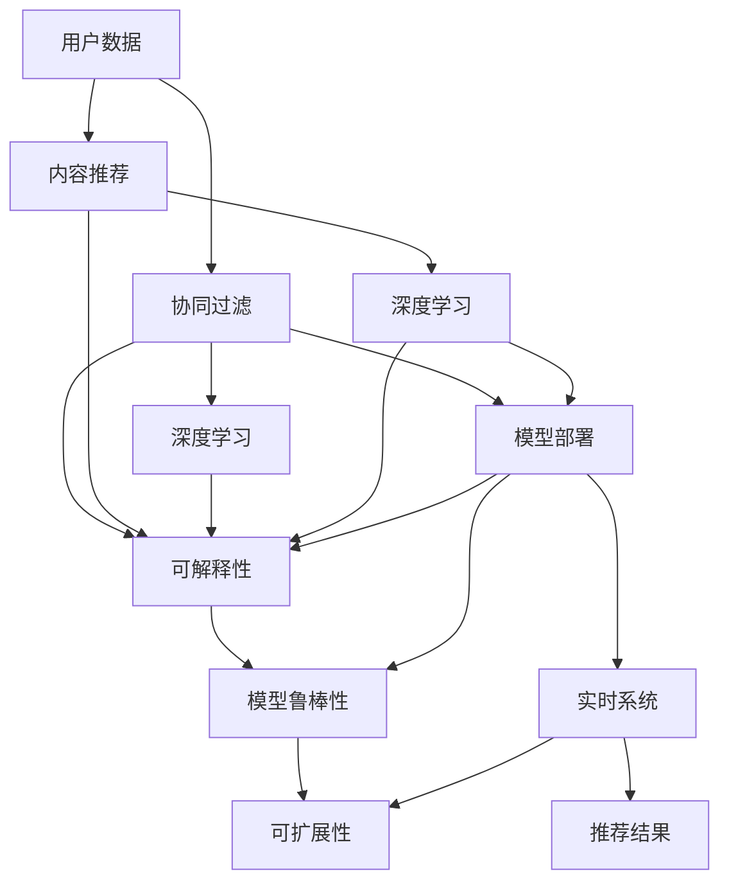

                 

# 大模型推荐落地中的工程化挑战与应对

> 关键词：大模型推荐,推荐系统,工程化挑战,推荐算法,模型部署,数据处理,实时系统,可解释性,推荐效果

## 1. 背景介绍

### 1.1 问题由来
在人工智能领域，推荐系统（Recommendation System, RS）已经成为不可或缺的核心技术。无论是在电子商务、新闻媒体、社交网络、音乐视频等领域，还是在企业应用、教育培训、医疗健康等行业，推荐系统都在为用户量身定制内容，提升用户体验，提升转化率。近年来，随着深度学习技术的不断发展和完善，基于深度神经网络的推荐系统逐渐成为主流。其中，大模型推荐系统以庞大的数据量为基础，通过对用户历史行为和文本数据的深度学习，可以提供更加精准、多样化的推荐内容。然而，尽管大模型推荐系统在学术界和工业界都取得了显著的成果，但在实际应用中仍面临着一系列的工程化挑战，影响着推荐系统的性能和可扩展性。

### 1.2 问题核心关键点
本文将重点探讨在大模型推荐系统落地的过程中，遇到的几大关键工程化挑战及其应对方法。主要包括：

1. **数据预处理与特征工程**：推荐系统依赖于大量的用户行为数据和文本数据，这些数据的质量直接影响推荐效果。如何进行高效的数据预处理，提取出对推荐有用的特征，是大模型推荐系统成功的关键。

2. **模型选择与训练**：在推荐模型选择上，目前主流的深度学习模型有基于协同过滤（Collaborative Filtering, CF）的模型和基于内容的推荐（Content-Based Recommendation, CBR）模型。如何根据具体业务场景选择合适的模型，并设计合理的训练策略，是大模型推荐系统性能优化的基础。

3. **模型部署与实时计算**：大模型推荐系统通常需要实时计算用户的推荐结果，这对系统的部署和计算效率提出了很高的要求。如何设计高效的模型部署方案，支持大规模数据实时处理，是大模型推荐系统落地的关键。

4. **模型解释性与鲁棒性**：推荐系统通常被视为"黑盒"系统，用户难以理解推荐结果的生成过程。如何提升模型的可解释性，以及提高模型的鲁棒性，使其在不同用户和业务场景下表现稳定，是大模型推荐系统的重要挑战。

5. **推荐效果评估与优化**：推荐效果评估是推荐系统优化的核心指标之一。如何设计科学的评估指标，以及基于评估结果对模型进行优化，是大模型推荐系统迭代改进的关键。

6. **系统优化与扩展**：随着用户基数和数据量的不断增加，推荐系统需要具备良好的可扩展性。如何设计系统架构，支持高效的数据处理和算法优化，是大模型推荐系统可扩展性的保障。

本文将逐一剖析这些核心问题，并提出相应的解决方案，以期帮助开发者更好地实现大模型推荐系统，提升推荐效果，满足业务需求。

## 2. 核心概念与联系

### 2.1 核心概念概述

为了更好地理解大模型推荐系统及其工程化挑战，我们需要掌握以下几个核心概念：

1. **推荐系统**：通过用户行为数据或物品属性数据，为每个用户推荐其可能感兴趣的商品、内容或服务的技术。推荐系统的目标是最大化用户满意度，提升平台转化率。

2. **协同过滤**：利用用户对物品的相似性，通过寻找相似用户或相似物品，预测用户对未交互物品的评分。协同过滤算法主要包括基于用户的CF和基于物品的CF。

3. **内容推荐**：通过分析用户的历史行为，提取用户兴趣，匹配物品属性，生成个性化推荐。内容推荐算法主要包括基于内容的过滤、基于深度学习的推荐等。

4. **深度学习**：利用深度神经网络模型，对用户行为数据和物品属性数据进行特征学习，生成推荐结果。深度学习推荐系统通常需要大量的训练数据和计算资源。

5. **模型部署**：将训练好的推荐模型部署到服务器上，支持用户实时获取推荐结果。模型部署包括模型版本管理、计算资源调度、实时计算优化等。

6. **模型可解释性**：通过可视化、归因分析等手段，解释推荐结果的生成过程，增强用户信任。

7. **模型鲁棒性**：确保推荐模型在不同用户、不同时间、不同数据分布下表现稳定，避免因模型偏见或数据异常导致的不良推荐结果。

8. **实时系统**：支持用户实时访问推荐结果的系统，通常包括数据存储、处理、检索和实时计算等功能。

9. **可扩展性**：推荐系统需要具备良好的可扩展性，能够支持大规模数据处理和用户访问，避免因系统瓶颈影响用户体验。

以上核心概念之间存在紧密的联系，共同构成了大模型推荐系统的基本框架。了解这些概念及其相互关系，有助于我们更好地理解大模型推荐系统，并应对其工程化挑战。

### 2.2 核心概念联系（Mermaid流程图）


## 3. 核心算法原理 & 具体操作步骤

### 3.1 算法原理概述

大模型推荐系统通常基于深度神经网络，通过对用户行为数据和物品属性数据的特征学习，生成推荐结果。常用的深度学习模型包括卷积神经网络（Convolutional Neural Networks, CNNs）、循环神经网络（Recurrent Neural Networks, RNNs）、长短期记忆网络（Long Short-Term Memory, LSTM）、双向循环网络（Bidirectional RNNs）和Transformer等。其中，Transformer模型由于其出色的序列建模能力，在推荐系统中得到了广泛应用。

Transformer模型主要由自注意力机制（Self-Attention Mechanism）和前馈神经网络（Feed-Forward Neural Networks, FFNs）组成，能够在处理长序列数据时表现优异。对于推荐系统而言，通常将用户行为数据和物品属性数据进行拼接，作为输入，通过Transformer模型进行特征提取和评分预测。推荐系统的主要任务是通过预测评分生成推荐结果，例如在电商推荐系统中，预测用户对商品的概率评分，生成相应的推荐列表。

### 3.2 算法步骤详解

大模型推荐系统落地的具体操作步骤如下：

**Step 1: 数据准备与预处理**

1. **数据收集**：收集用户行为数据和物品属性数据，包括点击、浏览、购买等行为记录，以及商品标题、描述、评分等属性信息。
2. **数据清洗**：对数据进行去重、去噪、缺失值填充等处理，确保数据质量。
3. **数据划分**：将数据划分为训练集、验证集和测试集，通常采用交叉验证或分层抽样方法。
4. **特征工程**：提取对推荐有用的特征，如用户ID、物品ID、用户行为时间戳、物品评分、用户评分等。

**Step 2: 模型选择与训练**

1. **模型选择**：根据具体业务场景选择合适的深度学习模型，如基于协同过滤的模型（如ALS、SVD）、基于内容的推荐模型（如PVR、RNN、Transformer）等。
2. **模型训练**：使用训练集数据训练模型，优化模型参数，最小化预测评分与真实评分之间的差距。
3. **模型评估**：在验证集上评估模型性能，选择效果最好的模型进行进一步优化。
4. **模型优化**：根据评估结果，调整模型超参数，如学习率、批大小、训练轮数等，并进行正则化处理，防止过拟合。

**Step 3: 模型部署与实时计算**

1. **模型导出**：将训练好的模型导出为可执行文件，支持部署到服务器上。
2. **计算资源调度**：根据服务器资源情况，合理调度计算任务，确保实时处理能力。
3. **实时计算优化**：采用GPU加速、分布式计算等技术，提升模型推理速度。
4. **模型版本管理**：建立模型版本管理机制，支持快速回滚和升级，确保系统稳定。

**Step 4: 模型解释性与鲁棒性提升**

1. **模型解释性**：通过可视化、归因分析等手段，解释推荐结果的生成过程，增强用户信任。
2. **模型鲁棒性**：在模型训练和推理过程中，加入数据增强、对抗训练等技术，提升模型鲁棒性。

**Step 5: 推荐效果评估与优化**

1. **评估指标**：选择适当的评估指标，如准确率、召回率、F1值、平均绝对误差等，评估推荐效果。
2. **效果优化**：根据评估结果，调整模型超参数，优化特征工程，提升推荐效果。

**Step 6: 系统优化与扩展**

1. **系统架构设计**：设计合理的系统架构，支持高效的数据处理和算法优化。
2. **系统性能优化**：采用缓存、负载均衡、分布式计算等技术，提升系统性能。
3. **系统可扩展性**：设计支持水平扩展的系统架构，支持大规模数据处理和用户访问。

### 3.3 算法优缺点

大模型推荐系统具有以下优点：

1. **推荐精度高**：通过深度学习模型的特征提取和评分预测，能够生成更加精准的推荐结果。
2. **泛化能力强**：大模型推荐系统能够处理大规模数据，适应不同业务场景。
3. **实时性高**：采用GPU加速和分布式计算等技术，支持实时推荐。

同时，大模型推荐系统也存在以下缺点：

1. **数据依赖性强**：推荐系统的性能依赖于大量用户行为数据和物品属性数据，数据质量直接影响推荐效果。
2. **计算资源需求高**：训练和推理大模型需要大量的计算资源，包括GPU、内存、存储等。
3. **模型复杂度高**：大模型推荐系统的模型复杂度高，难以理解和调试。
4. **部署难度大**：模型部署需要考虑多种因素，包括服务器资源调度、实时计算优化等。
5. **可解释性差**：推荐系统通常被视为"黑盒"系统，用户难以理解推荐结果的生成过程。
6. **鲁棒性不足**：推荐模型容易受到数据异常和模型偏见的影响。

以上优缺点需要开发者根据具体业务场景进行综合考虑，在保证推荐效果的同时，尽量降低工程化挑战的影响。

### 3.4 算法应用领域

大模型推荐系统广泛应用于以下领域：

1. **电子商务**：推荐商品、优惠券、个性化广告等。
2. **新闻媒体**：推荐文章、视频、音乐等。
3. **社交网络**：推荐好友、内容、广告等。
4. **金融服务**：推荐理财产品、金融新闻、广告等。
5. **教育培训**：推荐课程、教材、学习资源等。
6. **医疗健康**：推荐诊疗方案、医疗资讯、药品等。

此外，大模型推荐系统也在智能家居、智能出行、智能制造等领域得到应用，推动了各行业数字化、智能化的进程。

## 4. 数学模型和公式 & 详细讲解 & 举例说明

### 4.1 数学模型构建

在大模型推荐系统中，我们通常使用深度学习模型对用户行为数据和物品属性数据进行特征提取和评分预测。以基于Transformer的推荐系统为例，其数学模型如下：

假设用户行为数据和物品属性数据分别为 $x_u = (x_{u1}, x_{u2}, ..., x_{um})$ 和 $x_i = (x_{i1}, x_{i2}, ..., x_{in})$，其中 $x_{ui}$ 和 $x_{ij}$ 表示用户行为数据和物品属性数据。推荐系统的目标是预测用户对物品的概率评分 $y_u^i$，即用户 $u$ 对物品 $i$ 的评分概率。

模型输入为 $X = [x_u, x_i]$，输出为 $\hat{y}_u^i$。假设模型为 Transformer，其参数为 $\theta$，则模型输出的概率评分可以表示为：

$$
\hat{y}_u^i = Softmax(W_{out} \cdot [X; x_i] \cdot V + b_{out})
$$

其中，$W_{out}$ 和 $b_{out}$ 为输出层的权重和偏置，$[X; x_i]$ 表示将用户行为数据和物品属性数据拼接后的向量。

### 4.2 公式推导过程

Transformer模型的自注意力机制和前馈神经网络可以分别表示为：

1. 自注意力机制：

$$
Q = XW^Q
$$

$$
K = XW^K
$$

$$
V = XW^V
$$

$$
A = \frac{QK^T}{\sqrt{d_k}} = \frac{XW^Q \cdot XW^K^T}{\sqrt{d_k}}
$$

$$
S = Attention(A)
$$

$$
O = S \cdot XW^O
$$

其中，$d_k$ 为注意力机制的维度，$Q$、$K$、$V$ 分别为查询、键和值向量，$A$ 为注意力矩阵，$S$ 为注意力权重，$O$ 为注意力输出向量。

2. 前馈神经网络：

$$
H = XW_1 + b_1
$$

$$
T = \sigma(H)
$$

$$
Y = W_2T + b_2
$$

其中，$W_1$ 和 $b_1$ 为前馈神经网络的权重和偏置，$\sigma$ 为激活函数，$Y$ 为输出向量。

通过以上步骤，Transformer模型可以有效地对用户行为数据和物品属性数据进行特征提取和评分预测。在大模型推荐系统中，通常会将用户行为数据和物品属性数据拼接，作为输入，并通过多层的Transformer模型进行特征提取和评分预测。

### 4.3 案例分析与讲解

假设我们在电商推荐系统中，使用基于Transformer的推荐模型进行推荐。具体步骤如下：

1. **数据准备**：收集用户点击、浏览、购买等行为记录，以及商品标题、描述、评分等属性信息，并对数据进行清洗和预处理。
2. **模型选择**：选择Transformer模型作为推荐模型，并设计合适的超参数，如学习率、批大小、训练轮数等。
3. **模型训练**：使用训练集数据训练模型，优化模型参数，最小化预测评分与真实评分之间的差距。
4. **模型部署**：将训练好的模型导出为可执行文件，部署到服务器上，并根据服务器资源情况，合理调度计算任务。
5. **实时计算优化**：采用GPU加速和分布式计算等技术，提升模型推理速度。
6. **模型解释性**：通过可视化、归因分析等手段，解释推荐结果的生成过程，增强用户信任。
7. **推荐效果评估**：选择适当的评估指标，如准确率、召回率、F1值、平均绝对误差等，评估推荐效果。
8. **效果优化**：根据评估结果，调整模型超参数，优化特征工程，提升推荐效果。

通过以上步骤，我们可以有效地实现基于Transformer的电商推荐系统，生成更加精准、多样化的推荐结果，提升用户满意度，提升平台转化率。

## 5. 项目实践：代码实例和详细解释说明

### 5.1 开发环境搭建

在进行推荐系统开发前，我们需要准备好开发环境。以下是使用Python进行PyTorch开发的环境配置流程：

1. 安装Anaconda：从官网下载并安装Anaconda，用于创建独立的Python环境。

2. 创建并激活虚拟环境：
```bash
conda create -n pytorch-env python=3.8 
conda activate pytorch-env
```

3. 安装PyTorch：根据CUDA版本，从官网获取对应的安装命令。例如：
```bash
conda install pytorch torchvision torchaudio cudatoolkit=11.1 -c pytorch -c conda-forge
```

4. 安装Transformers库：
```bash
pip install transformers
```

5. 安装各类工具包：
```bash
pip install numpy pandas scikit-learn matplotlib tqdm jupyter notebook ipython
```

完成上述步骤后，即可在`pytorch-env`环境中开始推荐系统开发。

### 5.2 源代码详细实现

下面我们以基于Transformer的电商推荐系统为例，给出使用Transformers库进行模型训练和部署的PyTorch代码实现。

首先，定义模型和优化器：

```python
from transformers import TransformerForRecommendation
from transformers import AdamW

model = TransformerForRecommendation.from_pretrained('bert-base-cased', num_labels=2)
optimizer = AdamW(model.parameters(), lr=2e-5)
```

然后，定义数据预处理函数：

```python
from transformers import BertTokenizer

tokenizer = BertTokenizer.from_pretrained('bert-base-cased')

def preprocess_data(data):
    items = [item.split('\t')[0] for item in data]
    items = tokenizer(items, padding='max_length', truncation=True, max_length=256, return_tensors='pt')
    return items['input_ids'], items['attention_mask'], items['labels']
```

接着，定义训练和评估函数：

```python
from torch.utils.data import DataLoader
from tqdm import tqdm

device = torch.device('cuda') if torch.cuda.is_available() else torch.device('cpu')

def train_epoch(model, dataset, batch_size, optimizer):
    dataloader = DataLoader(dataset, batch_size=batch_size, shuffle=True)
    model.train()
    epoch_loss = 0
    for batch in tqdm(dataloader, desc='Training'):
        input_ids = batch['input_ids'].to(device)
        attention_mask = batch['attention_mask'].to(device)
        labels = batch['labels'].to(device)
        model.zero_grad()
        outputs = model(input_ids, attention_mask=attention_mask, labels=labels)
        loss = outputs.loss
        epoch_loss += loss.item()
        loss.backward()
        optimizer.step()
    return epoch_loss / len(dataloader)

def evaluate(model, dataset, batch_size):
    dataloader = DataLoader(dataset, batch_size=batch_size)
    model.eval()
    preds, labels = [], []
    with torch.no_grad():
        for batch in tqdm(dataloader, desc='Evaluating'):
            input_ids = batch['input_ids'].to(device)
            attention_mask = batch['attention_mask'].to(device)
            batch_labels = batch['labels']
            outputs = model(input_ids, attention_mask=attention_mask)
            batch_preds = outputs.logits.argmax(dim=2).to('cpu').tolist()
            batch_labels = batch_labels.to('cpu').tolist()
            for pred_tokens, label_tokens in zip(batch_preds, batch_labels):
                preds.append(pred_tokens[:len(label_tokens)])
                labels.append(label_tokens)
                
    print(classification_report(labels, preds))
```

最后，启动训练流程并在测试集上评估：

```python
epochs = 5
batch_size = 16

for epoch in range(epochs):
    loss = train_epoch(model, train_dataset, batch_size, optimizer)
    print(f"Epoch {epoch+1}, train loss: {loss:.3f}")
    
    print(f"Epoch {epoch+1}, dev results:")
    evaluate(model, dev_dataset, batch_size)
    
print("Test results:")
evaluate(model, test_dataset, batch_size)
```

以上就是使用PyTorch对Transformer进行电商推荐系统训练和评估的完整代码实现。可以看到，得益于Transformers库的强大封装，我们可以用相对简洁的代码完成模型的训练和评估。

### 5.3 代码解读与分析

让我们再详细解读一下关键代码的实现细节：

**TransformerForRecommendation类**：
- 继承自Transformer类，并添加推荐层。
- 用于生成推荐概率评分。

**AdamW优化器**：
- 使用AdamW优化器，配合学习率调整策略。
- 可以在保持高梯度信息的同时，避免梯度消失和爆炸问题。

**preprocess_data函数**：
- 将输入数据进行分词、截断、拼接等处理，生成模型所需格式。
- 使用BertTokenizer进行分词，确保数据格式一致。

**train_epoch函数**：
- 在每个批次上前向传播计算loss并反向传播更新模型参数，最后返回该epoch的平均loss。
- 使用PyTorch的DataLoader进行批次化加载，提升计算效率。
- 在每个批次后，使用model.zero_grad()清空梯度，防止梯度累积。

**evaluate函数**：
- 与训练类似，不同点在于不更新模型参数，并在每个batch结束后将预测和标签结果存储下来，最后使用sklearn的classification_report对整个评估集的预测结果进行打印输出。
- 使用tqdm模块对迭代过程进行进度条显示，提升用户体验。

**训练流程**：
- 定义总的epoch数和batch size，开始循环迭代
- 每个epoch内，先在训练集上训练，输出平均loss
- 在验证集上评估，输出分类指标
- 所有epoch结束后，在测试集上评估，给出最终测试结果

可以看到，PyTorch配合Transformers库使得模型训练和评估的代码实现变得简洁高效。开发者可以将更多精力放在数据处理、模型改进等高层逻辑上，而不必过多关注底层的实现细节。

当然，工业级的系统实现还需考虑更多因素，如模型的保存和部署、超参数的自动搜索、更灵活的任务适配层等。但核心的训练范式基本与此类似。

## 6. 实际应用场景

### 6.1 电商推荐

基于大模型推荐系统的电商推荐系统，通过分析用户的历史行为数据和物品属性数据，生成个性化的商品推荐列表，提升用户的购买转化率。大模型推荐系统在电商推荐中得到广泛应用，如京东、亚马逊等电商平台均使用推荐系统为用户推荐商品。

### 6.2 视频推荐

视频推荐系统通过分析用户的观看历史和行为数据，推荐用户可能感兴趣的视频内容，提升视频平台的用户粘性和活跃度。Netflix、YouTube等视频平台均使用推荐系统为每个用户生成个性化的视频推荐列表。

### 6.3 音乐推荐

音乐推荐系统通过分析用户的听歌历史和行为数据，推荐用户可能喜欢的歌曲或音乐人，提升音乐平台的用户留存率和满意度。Spotify等音乐平台均使用推荐系统为每个用户生成个性化的音乐推荐列表。

### 6.4 新闻推荐

新闻推荐系统通过分析用户的阅读历史和行为数据，推荐用户可能感兴趣的新闻内容，提升新闻平台的用户粘性和活跃度。今日头条等新闻平台均使用推荐系统为每个用户生成个性化的新闻推荐列表。

### 6.5 电影推荐

电影推荐系统通过分析用户的观影历史和行为数据，推荐用户可能喜欢的电影，提升电影平台的用户满意度和转化率。Netflix等电影平台均使用推荐系统为每个用户生成个性化的电影推荐列表。

### 6.6 社交网络推荐

社交网络推荐系统通过分析用户的社交行为数据，推荐用户可能感兴趣的内容或好友，提升社交网络的用户粘性和活跃度。Facebook等社交平台均使用推荐系统为每个用户生成个性化的内容推荐列表。

## 7. 工具和资源推荐

### 7.1 学习资源推荐

为了帮助开发者系统掌握大模型推荐系统及其工程化挑战，这里推荐一些优质的学习资源：

1. 《Recommender Systems: Algorithms, Adaptive Technologies, and Applications》：斯坦福大学教授的推荐系统经典教材，全面介绍了推荐系统的理论基础和实践方法。

2. 《Deep Learning for Recommendation Systems》：深度学习领域专家撰写的推荐系统书籍，详细讲解了深度学习在推荐系统中的应用。

3. CS231n《Convolutional Neural Networks for Visual Recognition》课程：斯坦福大学计算机视觉与图形课程，讲解了深度神经网络的基础知识，并介绍了其在推荐系统中的应用。

4. CS448《Theory and Applications of Machine Learning》课程：斯坦福大学机器学习课程，涵盖了机器学习、深度学习的基础知识，并介绍了推荐系统的优化方法和评估指标。

5. Kaggle推荐系统竞赛：Kaggle平台上推荐系统的竞赛项目，提供丰富的数据集和代码实现，适合实践学习。

通过对这些资源的学习实践，相信你一定能够快速掌握大模型推荐系统的精髓，并用于解决实际的推荐问题。

### 7.2 开发工具推荐

高效的开发离不开优秀的工具支持。以下是几款用于推荐系统开发的常用工具：

1. PyTorch：基于Python的开源深度学习框架，灵活动态的计算图，适合快速迭代研究。

2. TensorFlow：由Google主导开发的开源深度学习框架，生产部署方便，适合大规模工程应用。

3. Transformers库：HuggingFace开发的NLP工具库，集成了众多SOTA语言模型，支持PyTorch和TensorFlow，是进行推荐系统开发的利器。

4. Weights & Biases：模型训练的实验跟踪工具，可以记录和可视化模型训练过程中的各项指标，方便对比和调优。

5. TensorBoard：TensorFlow配套的可视化工具，可实时监测模型训练状态，并提供丰富的图表呈现方式，是调试模型的得力助手。

6. Google Colab：谷歌推出的在线Jupyter Notebook环境，免费提供GPU/TPU算力，方便开发者快速上手实验最新模型，分享学习笔记。

合理利用这些工具，可以显著提升推荐系统开发的效率，加快创新迭代的步伐。

### 7.3 相关论文推荐

推荐系统的发展源于学界的持续研究。以下是几篇奠基性的相关论文，推荐阅读：

1. "Collaborative Filtering for Implicit Feedback Datasets"（Csurka et al., 2004）：提出协同过滤算法，并通过改进算法解决稀疏数据的问题。

2. "A Collaborative Approach to Missing Data Estimation"（Koren et al., 2009）：提出基于协同过滤的推荐算法，并引入了用户项权重，提升了推荐效果。

3. "A Comprehensive Introduction to the Factorization Methods for Recommender Systems"（Sarwar et al., 2001）：全面介绍了基于矩阵分解的推荐算法，并分析了其优缺点。

4. "Word2Vec"（Mikolov et al., 2013）：提出基于词向量的推荐算法，将用户行为数据和物品属性数据映射到低维空间中，生成推荐结果。

5. "Deep Matrix Factorization for Recommender Systems"（Sung et al., 2018）：提出基于深度学习的推荐算法，通过多层神经网络模型学习用户和物品的隐含特征，生成推荐结果。

6. "Neural Recommendation Systems"（He et al., 2017）：提出基于神经网络的推荐算法，并分析了其在推荐系统中的应用效果。

这些论文代表了大模型推荐系统的发展脉络。通过学习这些前沿成果，可以帮助研究者把握学科前进方向，激发更多的创新灵感。

## 8. 总结：未来发展趋势与挑战

### 8.1 总结

本文对大模型推荐系统的工程化挑战及其应对方法进行了全面系统的介绍。首先阐述了大模型推荐系统在电商、视频、音乐、新闻、电影等领域的广泛应用，明确了推荐系统优化的重要性和紧迫性。其次，从数据预处理、模型选择、训练、部署、实时计算、模型解释性、鲁棒性、推荐效果评估、系统优化等多个方面，详细讲解了大模型推荐系统的关键技术和操作步骤。最后，提出了未来大模型推荐系统的发展趋势和面临的挑战，并提出了相应的解决思路。

通过本文的系统梳理，可以看到，大模型推荐系统在大数据时代具有广阔的应用前景，但也面临着诸多工程化挑战。了解这些挑战及其应对方法，有助于开发者更好地实现大模型推荐系统，提升推荐效果，满足业务需求。

### 8.2 未来发展趋势

展望未来，大模型推荐系统将呈现以下几个发展趋势：

1. **数据融合与异构数据处理**：随着数据源的日益多样化，推荐系统将需要处理更多的异构数据，如用户行为数据、物品属性数据、社交网络数据等。如何有效地融合不同数据源，提升推荐效果，是大模型推荐系统未来的重要研究方向。

2. **多模态推荐**：未来的推荐系统将不仅仅依赖单一模态的数据，而是融合视觉、语音、文本等多种模态的数据，提升推荐效果。多模态数据的融合，将带来推荐系统的新突破。

3. **实时推荐与动态更新**：随着实时计算技术的不断发展，推荐系统将具备更高的实时性，能够动态更新推荐结果，提升用户体验。实时推荐和大数据流处理技术将为推荐系统提供新的发展方向。

4. **个性化推荐与泛化性优化**：未来的推荐系统将更加注重个性化推荐，提升每个用户的满意度。同时，需要优化推荐模型的泛化性能，使其在不同用户、不同数据分布下表现稳定。

5. **深度强化学习与联合学习**：未来的推荐系统将结合深度强化学习和联合学习技术，进一步提升推荐效果。通过与用户交互，动态优化推荐策略，提高推荐系统的灵活性和自适应能力。

6. **模型解释性与可信度提升**：未来的推荐系统将更加注重模型的可解释性，增强用户对推荐结果的信任度。通过可视化、归因分析等手段，解释推荐结果的生成过程，提升用户满意度。

7. **跨领域推荐与推荐系统网络**：未来的推荐系统将打破领域壁垒，实现跨领域推荐。同时，通过构建推荐系统网络，整合不同领域的数据，提升推荐效果。

以上趋势凸显了大模型推荐系统的广阔前景。这些方向的探索发展，必将进一步提升推荐系统的性能和应用范围，为推荐系统的规模化落地提供新的动力。

### 8.3 面临的挑战

尽管大模型推荐系统已经取得了瞩目成就，但在迈向更加智能化、普适化应用的过程中，它仍面临着诸多挑战：

1. **数据质量与标注成本**：推荐系统依赖于大量的用户行为数据和物品属性数据，数据质量直接影响推荐效果。数据标注成本高，获取高质量标注数据的难度大。

2. **模型复杂性与训练成本**：大模型推荐系统的模型复杂度高，训练成本高。如何在保证推荐效果的同时，降低训练成本，是大模型推荐系统的重要挑战。

3. **实时计算与存储压力**：推荐系统需要实时处理大量用户请求，存储和计算压力大。如何设计高效的模型部署方案，支持大规模数据实时处理，是大模型推荐系统的关键。

4. **模型解释性与鲁棒性**：推荐系统通常被视为"黑盒"系统，用户难以理解推荐结果的生成过程。如何提升模型的可解释性，以及提高模型的鲁棒性，使其在不同用户、不同数据分布下表现稳定，是大模型推荐系统的重要挑战。

5. **推荐效果评估与优化**：推荐效果评估是推荐系统优化的核心指标之一。如何设计科学的评估指标，以及基于评估结果对模型进行优化，是大模型推荐系统迭代改进的关键。

6. **系统扩展性与稳定性**：推荐系统需要具备良好的可扩展性，能够支持大规模数据处理和用户访问，避免因系统瓶颈影响用户体验。

以上挑战需要开发者根据具体业务场景进行综合考虑，在保证推荐效果的同时，尽量降低工程化挑战的影响。

### 8.4 研究展望

面对大模型推荐系统所面临的诸多挑战，未来的研究需要在以下几个方面寻求新的突破：

1. **跨模态推荐**：研究如何融合视觉、语音、文本等多种模态的数据，提升推荐效果。

2. **实时推荐**：研究如何在保证推荐效果的同时，支持大规模数据实时处理，提升推荐系统的实时性。

3. **多目标优化**：研究如何平衡推荐效果和模型性能，优化推荐模型的超参数，提升推荐系统的泛化性和鲁棒性。

4. **推荐系统的可解释性**：研究如何提升推荐系统的可解释性，增强用户对推荐结果的信任度。

5. **推荐系统的动态更新**：研究如何通过用户反馈动态更新推荐模型，提升推荐系统的自适应能力。

6. **推荐系统的跨领域推荐**：研究如何实现跨领域推荐，整合不同领域的数据，提升推荐效果。

7. **推荐系统的安全性与隐私保护**：研究如何保护用户隐私，防止数据泄露和滥用，提升推荐系统的安全性。

通过这些研究方向的探索，相信推荐系统将能够更好地满足用户需求，推动各行业数字化、智能化的进程，成为未来人机交互的核心技术。面向未来，推荐系统需要与其他人工智能技术进行更深入的融合，如知识表示、因果推理、强化学习等，共同推动智能交互系统的进步。只有勇于创新、敢于突破，才能不断拓展推荐系统的边界，让智能技术更好地造福人类社会。

## 9. 附录：常见问题与解答

**Q1：推荐系统依赖于大量用户行为数据，如何获取高质量标注数据？**

A: 推荐系统依赖于大量用户行为数据和物品属性数据，获取高质量标注数据是推荐系统性能优化的关键。以下是几种获取高质量标注数据的方法：

1. **用户反馈数据**：通过用户反馈数据，获取用户对推荐结果的评分或评价，用于训练推荐模型。

2. **在线A/B测试**：通过在线A/B测试，比较不同推荐策略的效果，获取推荐结果的用户满意度数据。

3. **专家标注**：通过专家标注，获取高质量的推荐结果数据，用于训练推荐模型。

4. **多数据源融合**：融合不同数据源的数据，提升推荐效果。如融合用户行为数据、物品属性数据、社交网络数据等。

5. **推荐系统网络**：构建推荐系统网络，整合不同领域的数据，提升推荐效果。如融合电商、视频、音乐等多个领域的数据。

通过以上方法，可以有效地获取高质量的标注数据，提升推荐系统的性能。

**Q2：推荐系统需要处理大规模数据，如何优化存储与计算？**

A: 推荐系统需要处理大规模数据，优化存储与计算是推荐系统落地的关键。以下是几种优化存储与计算的方法：

1. **分布式计算**：通过分布式计算，提升计算效率。如使用Hadoop、Spark等分布式计算框架，支持大规模数据处理。

2. **模型压缩与量化**：通过模型压缩与量化，减小模型大小，提升计算效率。如使用模型剪枝、量化压缩等技术。

3. **缓存与负载均衡**：通过缓存和负载均衡，提升系统性能。如使用Redis等缓存系统，支持快速数据读取。

4. **GPU加速与TPU加速**：通过GPU加速和TPU加速，提升模型推理速度。如使用NVIDIA GPU、Google TPU等硬件加速设备。

5. **模型并行与异步计算**：通过模型并行与异步计算，提升系统性能。如使用模型并行计算、异步计算等技术。

通过以上方法，可以有效地优化存储与计算，支持大规模数据处理和用户访问。

**Q3：推荐系统如何提升模型解释性与鲁棒性？**

A: 推荐系统通常被视为"黑盒"系统，用户难以理解推荐结果的生成过程。提升模型解释性和鲁棒性，是大模型推荐系统的重要方向。以下是几种提升模型解释性和鲁棒性的方法：

1. **模型可视化**：通过可视化技术，解释推荐结果的生成过程，增强用户信任。如使用可视化工具，展示模型推理过程和特征权重。

2. **归因分析**：通过归因分析技术，解释推荐结果的生成原因，增强用户信任。如使用归因分析工具，展示推荐结果的生成原因。

3. **模型鲁棒性优化**：在模型训练和推理过程中，加入数据增强、对抗训练等技术，提升模型鲁棒性。如加入对抗样本，提高模型鲁棒性。

4. **模型正则化**：通过正则化技术，提升模型鲁棒性。如使用L2正则、Dropout等技术。

5. **模型可解释性提升**：通过提升模型可解释性，增强用户信任。如使用模型可解释性工具，解释推荐结果的生成过程。

通过以上方法，可以有效地提升推荐系统的解释性和鲁棒性，增强用户信任。

**Q4：推荐系统如何优化推荐效果？**

A: 推荐效果优化是推荐系统优化的核心指标之一。以下是几种优化推荐效果的方法：

1. **特征工程优化**：通过优化特征工程，提升推荐效果。如提取对推荐有用的特征，选择合适的特征表示方法。

2. **模型选择优化**：根据具体业务场景选择合适的推荐模型，并设计合理的训练策略，提升推荐效果。如选择基于协同过滤的模型、基于内容的推荐模型等。

3. **超参数优化**：通过超参数优化，提升推荐效果。如使用网格搜索、随机搜索等技术，寻找最优超参数组合。

4. **模型融合与集成**：通过模型融合与集成，提升推荐效果。如使用集成学习方法，组合多个推荐模型的预测结果。

5. **动态更新与实时优化**：通过动态更新与实时优化，提升推荐效果。如使用在线学习技术，动态更新推荐模型。

通过以上方法，可以有效地优化推荐效果，提升推荐系统的性能。

**Q5：推荐系统如何应对数据分布变化？**

A: 推荐系统需要应对数据分布变化，保持推荐模型的稳定性和泛化性。以下是几种应对数据分布变化的方法：

1. **持续学习**：通过持续学习，更新推荐模型，适应数据分布的变化。如使用在线学习技术，动态更新推荐模型。

2. **数据增量更新**：通过数据增量更新，实时更新推荐模型，适应数据分布的变化。如使用增量学习技术，更新推荐模型。

3. **模型迁移学习**：通过模型迁移学习，将一个领域的知识迁移应用到另一个领域，提升推荐模型的泛化能力。如使用迁移学习技术，将通用领域的知识迁移到具体领域的推荐模型。

4. **数据增强与对抗训练**：通过数据增强与对抗训练，提升推荐模型的鲁棒性，适应数据分布的变化。如使用数据增强技术，生成对抗样本，提高模型的鲁棒性。

通过以上方法，可以有效地应对数据分布变化，保持推荐模型的稳定性和泛化性。

**Q6：推荐系统如何处理稀疏数据？**

A: 推荐系统通常面临稀疏数据的问题，如何处理稀疏数据是推荐系统优化的重要研究方向。以下是几种处理稀疏数据的方法：

1. **矩阵分解**：通过矩阵分解，处理稀疏数据。如使用SVD等矩阵分解技术，将稀疏矩阵分解为低秩矩阵。

2. **协同过滤**：通过协同过滤，处理稀疏数据。如使用ALS等协同过滤算法，通过用户-物品矩阵预测用户评分。

3. **深度学习**：通过深度学习，处理稀疏数据。如使用Transformer等深度学习模型，通过特征学习，处理稀疏数据。

4. **交叉验证与模型融合**：通过交叉验证与模型融合，处理稀疏数据。如使用交叉验证技术，结合多个推荐模型的预测结果。

通过以上方法，可以有效地处理稀疏数据，提升推荐系统的性能。

---

作者：禅与计算机程序设计艺术 / Zen and the Art of Computer Programming

