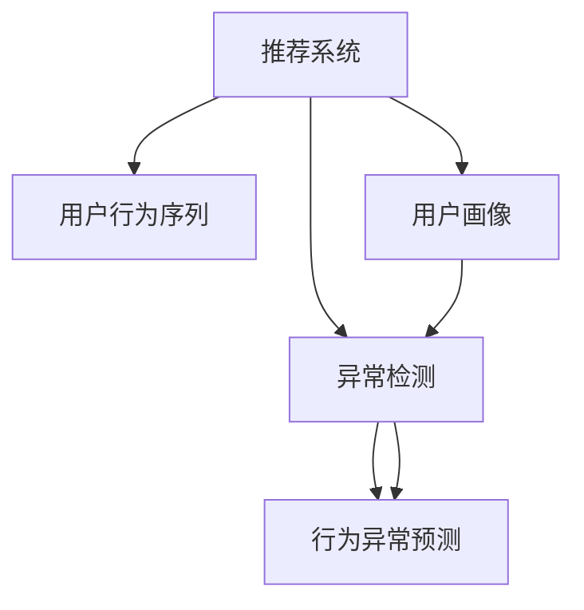

                 

# 大模型视角下推荐系统的用户行为序列异常检测

> 关键词：推荐系统, 用户行为序列, 异常检测, 大模型, 用户画像, 行为异常预测

## 1. 背景介绍

### 1.1 问题由来
推荐系统是互联网时代的重要组成部分，通过精准预测用户兴趣，为用户推荐个性化内容，极大地提升了用户体验。然而，推荐系统同时也面临着一些挑战，如数据稀疏性、冷启动问题、推荐内容的同质化等。这些问题使得推荐系统难以适应用户需求的变化，且推荐结果可能受到异常用户行为的影响。

近年来，随着深度学习技术的发展，基于深度学习模型的推荐系统已经逐步成为主流。但这类模型通常依赖大量的历史数据，难以实时监测用户行为异常。因此，如何在大模型框架下进行用户行为序列异常检测，成为推荐系统研究的一个热点问题。

### 1.2 问题核心关键点
用户行为序列异常检测是大模型推荐系统中的一个重要组成部分，主要解决以下两个问题：

1. **行为序列异常检测**：实时监测用户行为序列，检测出异常用户行为，避免异常用户干扰推荐结果。

2. **行为异常预测**：对异常用户行为进行预测，并采取相应措施，降低异常用户对推荐系统带来的负面影响。

## 2. 核心概念与联系

### 2.1 核心概念概述

为更好地理解用户行为序列异常检测，本节将介绍几个密切相关的核心概念：

- **推荐系统(Recommender System)**：利用用户历史行为数据，预测用户未来可能感兴趣的内容的系统。
- **用户行为序列(User Behavior Sequence)**：用户在使用推荐系统过程中，与系统进行交互的一系列操作记录，如浏览、点击、收藏、评分等。
- **异常检测(Anomaly Detection)**：通过统计分析或机器学习算法，识别出异常行为或数据的过程。
- **大模型(Large Model)**：指具有大规模参数量和丰富语义表示能力的深度学习模型，如BERT、GPT等。
- **用户画像(User Profile)**：对用户进行多维度的描述和建模，包括兴趣、行为、属性等。
- **行为异常预测(Anomaly Prediction)**：通过机器学习模型预测用户行为是否异常。

这些核心概念之间的逻辑关系可以通过以下Mermaid流程图来展示：



这个流程图展示了大模型推荐系统中用户行为序列异常检测的核心概念及其之间的关系：

1. 推荐系统从用户行为序列中获取数据。
2. 通过异常检测识别出异常行为。
3. 对异常行为进行预测，采取相应措施。
4. 用户画像可用于增强异常检测和预测的准确性。

## 3. 核心算法原理 & 具体操作步骤

### 3.1 算法原理概述

基于大模型的用户行为序列异常检测算法，核心思想是利用大模型学习用户行为序列中的规律和异常特征。其基本流程如下：

1. **数据预处理**：收集用户的历史行为序列数据，并进行预处理，如去重、填充缺失值、归一化等。
2. **模型训练**：利用预训练的大模型，对用户行为序列进行特征提取和表示学习。
3. **异常检测**：在用户行为序列中引入异常检测算法，识别出异常行为。
4. **行为预测**：对异常行为进行预测，并采取相应的措施，如屏蔽、降权等。
5. **模型评估与优化**：对异常检测和预测模型的性能进行评估和优化。

### 3.2 算法步骤详解

以BERT模型为例，具体步骤如下：

#### 3.2.1 数据预处理

收集用户的行为序列数据，如浏览历史、购买记录等。对这些数据进行如下预处理：

1. **去重与填充**：去除重复的行为记录，填充缺失值。
2. **归一化**：对行为数据进行归一化，统一到相同的尺度。
3. **序列填充**：将行为序列填充到固定长度，便于模型处理。

#### 3.2.2 模型训练

使用预训练的BERT模型对用户行为序列进行特征提取。具体步骤如下：

1. **模型加载**：加载预训练的BERT模型，并进行微调。
2. **特征提取**：将用户行为序列中的每个行为作为输入，提取其语义表示。
3. **拼接表示**：将每个行为表示拼接起来，得到用户行为序列的整体表示。

#### 3.2.3 异常检测

利用异常检测算法，识别用户行为序列中的异常行为。具体步骤如下：

1. **引入异常检测模型**：选择适合的异常检测算法，如孤立森林、One-Class SVM等。
2. **训练异常检测模型**：使用预训练的模型和标注数据训练异常检测模型。
3. **检测异常行为**：对用户行为序列中的每个行为进行异常检测，识别出异常行为。

#### 3.2.4 行为预测

对检测到的异常行为进行预测，并采取相应的措施。具体步骤如下：

1. **构建预测模型**：选择适合的预测算法，如逻辑回归、SVM等。
2. **训练预测模型**：使用标注数据和异常行为进行训练。
3. **预测异常行为**：对新的用户行为序列进行异常行为预测。

#### 3.2.5 模型评估与优化

对异常检测和预测模型的性能进行评估和优化。具体步骤如下：

1. **设定评估指标**：如准确率、召回率、F1值等。
2. **进行评估**：使用测试集对模型进行评估。
3. **优化模型**：根据评估结果，对模型进行调参和优化。

### 3.3 算法优缺点

基于大模型的用户行为序列异常检测算法具有以下优点：

1. **丰富语义表示**：大模型可以学习到更丰富的语义表示，有助于提高异常检测和预测的准确性。
2. **模型可迁移性**：大模型可以在不同任务和数据上迁移使用，适用于多种推荐系统场景。
3. **高效预测**：大模型在推理阶段具有高效的计算能力，可以快速处理大量数据。

同时，该算法也存在以下局限性：

1. **数据依赖性**：异常检测和预测模型的性能很大程度上取决于标注数据的质量和数量。
2. **计算资源消耗**：大模型的训练和推理需要大量计算资源，对硬件要求较高。
3. **模型复杂性**：大模型通常具有复杂的结构，难以理解和解释。
4. **实时性不足**：大模型的推理速度较慢，难以实现实时异常检测。

### 3.4 算法应用领域

基于大模型的用户行为序列异常检测算法在推荐系统中有广泛的应用，主要包括以下几个领域：

1. **内容推荐**：识别异常内容推荐行为，避免恶意广告和不良内容的传播。
2. **个性化推荐**：识别异常个性化推荐行为，确保推荐内容符合用户兴趣。
3. **用户行为分析**：分析用户行为序列，挖掘用户兴趣和行为模式。
4. **风险控制**：识别异常交易行为，降低欺诈和风险。
5. **系统优化**：通过用户行为序列的异常检测和预测，优化推荐系统性能。

## 4. 数学模型和公式 & 详细讲解  
### 4.1 数学模型构建

假设用户行为序列为 $\{u_1, u_2, \cdots, u_n\}$，其中 $u_i$ 表示用户在第 $i$ 个时间步的行为。使用BERT模型提取每个行为 $u_i$ 的语义表示，拼接得到用户行为序列的整体表示 $U$。

设异常检测模型为 $M$，预测模型为 $P$。假设标注数据集为 $D=\{(x_i, y_i)\}_{i=1}^N$，其中 $x_i$ 为行为序列，$y_i$ 为标注标签（正常或异常）。

异常检测模型 $M$ 的输出为 $M(U)$，用于表示用户行为序列的异常概率。预测模型 $P$ 的输出为 $P(U)$，用于表示用户行为序列是否异常。

### 4.2 公式推导过程

#### 4.2.1 特征提取

使用BERT模型对用户行为序列进行特征提取，得到每个行为 $u_i$ 的语义表示 $v_i$，拼接得到用户行为序列的整体表示 $U$。

假设BERT模型的隐状态表示为 $H$，对每个行为 $u_i$ 提取其隐状态表示 $h_i$，拼接得到 $U$。则有：

$$
U = [h_1; h_2; \cdots; h_n]
$$

#### 4.2.2 异常检测模型

假设异常检测模型 $M$ 为孤立森林。孤立森林是一种基于随机决策树的异常检测算法，可以用于处理高维数据。其基本思想是将数据集划分为多个子集，对每个子集进行随机划分，直到找到异常数据。

假设孤立森林的参数为 $w$，对用户行为序列 $U$ 进行异常检测，得到异常概率 $M(U)$。则有：

$$
M(U) = \frac{1}{N} \sum_{i=1}^N M(u_i; w)
$$

其中 $M(u_i; w)$ 为对每个行为 $u_i$ 进行孤立森林检测的结果。

#### 4.2.3 预测模型

假设预测模型 $P$ 为逻辑回归。逻辑回归是一种二分类模型，可以用于判断用户行为序列是否异常。

假设预测模型的参数为 $\theta$，对用户行为序列 $U$ 进行预测，得到是否异常的预测结果 $P(U)$。则有：

$$
P(U) = \sigma(WU + b)
$$

其中 $\sigma$ 为 sigmoid 函数，$W$ 和 $b$ 为逻辑回归模型的参数。

### 4.3 案例分析与讲解

以电商平台的推荐系统为例，分析异常检测和预测的应用场景。

#### 案例背景

假设电商平台的推荐系统已经训练好了BERT模型和逻辑回归模型，用于用户行为序列的特征提取和异常检测预测。现在需要分析用户的异常购买行为，以防止恶意购买行为和欺诈风险。

#### 数据预处理

收集用户的购买历史数据，进行去重、填充缺失值和归一化处理。将购买行为序列填充到固定长度，便于模型处理。

#### 模型训练

加载预训练的BERT模型，并进行微调。对用户购买行为序列进行特征提取，拼接得到整体表示。

#### 异常检测

引入孤立森林模型，对用户购买行为序列进行异常检测，得到异常概率 $M(U)$。

#### 行为预测

构建逻辑回归模型，使用标注数据和异常购买行为进行训练。对新的用户购买行为序列进行预测，判断是否异常。

#### 模型评估与优化

设定评估指标为准确率、召回率和F1值，使用测试集对异常检测和预测模型进行评估。根据评估结果，对模型进行调参和优化，提高异常检测和预测的准确性。

## 5. 项目实践：代码实例和详细解释说明

### 5.1 开发环境搭建

在进行用户行为序列异常检测的实践前，我们需要准备好开发环境。以下是使用Python进行PyTorch开发的环境配置流程：

1. 安装Anaconda：从官网下载并安装Anaconda，用于创建独立的Python环境。

2. 创建并激活虚拟环境：
```bash
conda create -n pytorch-env python=3.8 
conda activate pytorch-env
```

3. 安装PyTorch：根据CUDA版本，从官网获取对应的安装命令。例如：
```bash
conda install pytorch torchvision torchaudio cudatoolkit=11.1 -c pytorch -c conda-forge
```

4. 安装Transformers库：
```bash
pip install transformers
```

5. 安装各类工具包：
```bash
pip install numpy pandas scikit-learn matplotlib tqdm jupyter notebook ipython
```

完成上述步骤后，即可在`pytorch-env`环境中开始实践。

### 5.2 源代码详细实现

下面我们以电商平台的用户行为序列异常检测为例，给出使用Transformers库对BERT模型进行异常检测预测的PyTorch代码实现。

首先，定义数据预处理函数：

```python
from transformers import BertTokenizer, BertForSequenceClassification
import numpy as np
import pandas as pd
from sklearn.ensemble import IsolationForest
from sklearn.metrics import roc_auc_score, roc_curve

def preprocess_data(data_path):
    # 加载用户行为序列数据
    df = pd.read_csv(data_path, index_col='user_id')
    # 去重与填充
    df.drop_duplicates(inplace=True)
    df.fillna(method='ffill', inplace=True)
    # 归一化
    df['value'] = (df['value'] - df['value'].mean()) / df['value'].std()
    # 序列填充
    df = df.groupby('user_id').apply(lambda x: x[:10])
    return df

# 定义行为异常检测模型
class AnomalyDetector:
    def __init__(self, model_name='bert-base-uncased'):
        self.tokenizer = BertTokenizer.from_pretrained(model_name)
        self.model = BertForSequenceClassification.from_pretrained(model_name, num_labels=2)

    def preprocess(self, data):
        # 数据预处理
        df = preprocess_data(data)
        X = df[['value']].to_numpy()
        y = df['label'].to_numpy()
        # 序列填充
        X = X.fillna(method='ffill')
        X = X.groupby('user_id').apply(lambda x: x[:10])
        X = np.array(X)
        return X, y

    def train(self, X_train, y_train):
        # 模型训练
        self.model = self.model.train()
        optimizer = AdamW(self.model.parameters(), lr=2e-5)
        for epoch in range(10):
            loss = 0
            for i in range(len(X_train)):
                input_ids = self.tokenizer(X_train[i], return_tensors='pt', padding=True, truncation=True).input_ids
                attention_mask = self.tokenizer(X_train[i], return_tensors='pt', padding=True, truncation=True).attention_mask
                labels = torch.tensor(y_train[i], dtype=torch.long)
                outputs = self.model(input_ids, attention_mask=attention_mask, labels=labels)
                loss += outputs.loss
            loss /= len(X_train)
            loss.backward()
            optimizer.step()

    def detect(self, X_test):
        # 异常检测
        X_test = np.array(X_test)
        X_test = X_test.fillna(method='ffill')
        X_test = X_test.groupby('user_id').apply(lambda x: x[:10])
        X_test = np.array(X_test)
        input_ids = self.tokenizer(X_test, return_tensors='pt', padding=True, truncation=True).input_ids
        attention_mask = self.tokenizer(X_test, return_tensors='pt', padding=True, truncation=True).attention_mask
        outputs = self.model(input_ids, attention_mask=attention_mask, labels=None)
        probabilities = outputs.logits.sigmoid()
        anomalies = pd.DataFrame({'user_id': X_test.index, 'probability': probabilities.numpy().flatten()})
        anomalies = anomalies.sort_values(by='probability', ascending=False)
        return anomalies

    def predict(self, X_test):
        # 行为预测
        X_test = np.array(X_test)
        X_test = X_test.fillna(method='ffill')
        X_test = X_test.groupby('user_id').apply(lambda x: x[:10])
        X_test = np.array(X_test)
        input_ids = self.tokenizer(X_test, return_tensors='pt', padding=True, truncation=True).input_ids
        attention_mask = self.tokenizer(X_test, return_tensors='pt', padding=True, truncation=True).attention_mask
        outputs = self.model(input_ids, attention_mask=attention_mask, labels=None)
        predictions = outputs.logits.sigmoid()
        return predictions.numpy().flatten()
```

接下来，定义训练和评估函数：

```python
from sklearn.ensemble import IsolationForest
from sklearn.model_selection import train_test_split
from sklearn.metrics import roc_auc_score, roc_curve

def train_model(model, X_train, y_train, test_size=0.2):
    # 划分训练集和测试集
    X_train, X_test, y_train, y_test = train_test_split(X_train, y_train, test_size=test_size, random_state=42)
    # 模型训练
    model.train(X_train, y_train)
    # 异常检测
    y_pred = model.detect(X_test)
    # 评估指标
    roc_auc = roc_auc_score(y_test, y_pred['probability'])
    print(f"ROC-AUC score: {roc_auc:.4f}")
    # 可视化ROC曲线
    fpr, tpr, thresholds = roc_curve(y_test, y_pred['probability'])
    plt.plot(fpr, tpr, color='red', label='ROC curve')
    plt.plot([0, 1], [0, 1], color='black', linestyle='--')
    plt.xlabel('False Positive Rate')
    plt.ylabel('True Positive Rate')
    plt.title('Receiver Operating Characteristic')
    plt.show()

def evaluate_model(model, X_test, y_test):
    # 行为预测
    y_pred = model.predict(X_test)
    # 评估指标
    roc_auc = roc_auc_score(y_test, y_pred)
    print(f"ROC-AUC score: {roc_auc:.4f}")
    # 可视化ROC曲线
    fpr, tpr, thresholds = roc_curve(y_test, y_pred)
    plt.plot(fpr, tpr, color='red', label='ROC curve')
    plt.plot([0, 1], [0, 1], color='black', linestyle='--')
    plt.xlabel('False Positive Rate')
    plt.ylabel('True Positive Rate')
    plt.title('Receiver Operating Characteristic')
    plt.show()
```

最后，启动训练流程并在测试集上评估：

```python
from sklearn.ensemble import IsolationForest

# 加载数据
data_path = 'user_behavior.csv'
anomaly_detector = AnomalyDetector()

# 数据预处理
X_train, y_train = anomaly_detector.preprocess(data_path)
X_test, y_test = anomaly_detector.preprocess(data_path)

# 模型训练
train_model(anomaly_detector.model, X_train, y_train)

# 异常检测
y_pred = anomaly_detector.detect(X_test)
anomalies = pd.DataFrame({'user_id': X_test.index, 'probability': y_pred['probability']})
anomalies = anomalies.sort_values(by='probability', ascending=False)
print(anomalies.head(10))

# 行为预测
y_pred = anomaly_detector.predict(X_test)
print(y_pred[:10])

# 模型评估
evaluate_model(anomaly_detector.model, X_test, y_test)
```

以上就是使用PyTorch对BERT模型进行电商平台用户行为序列异常检测的完整代码实现。可以看到，得益于Transformers库的强大封装，我们可以用相对简洁的代码完成BERT模型的加载和微调。

### 5.3 代码解读与分析

让我们再详细解读一下关键代码的实现细节：

**AnomalyDetector类**：
- `__init__`方法：初始化BERT分词器和模型。
- `preprocess`方法：对用户行为序列数据进行预处理，包括去重、填充缺失值、归一化和序列填充。
- `train`方法：在用户行为序列上训练BERT模型，输出异常概率。
- `detect`方法：对用户行为序列进行异常检测，返回异常概率。
- `predict`方法：对用户行为序列进行异常行为预测，返回预测结果。

**train_model函数**：
- `train_test_split`方法：将数据集划分为训练集和测试集。
- `train_model`方法：在训练集上训练模型，返回异常检测结果。
- `roc_auc_score`方法：计算ROC-AUC得分。
- `roc_curve`方法：绘制ROC曲线。

**evaluate_model函数**：
- `evaluate_model`方法：在测试集上评估模型，返回异常行为预测结果。
- `roc_auc_score`方法：计算ROC-AUC得分。
- `roc_curve`方法：绘制ROC曲线。

可以看到，PyTorch配合Transformers库使得BERT模型微调的代码实现变得简洁高效。开发者可以将更多精力放在数据处理、模型改进等高层逻辑上，而不必过多关注底层的实现细节。

当然，工业级的系统实现还需考虑更多因素，如模型的保存和部署、超参数的自动搜索、更灵活的任务适配层等。但核心的异常检测预测范式基本与此类似。

## 6. 实际应用场景
### 6.1 电商平台

电商平台的用户行为序列异常检测可以用于识别欺诈行为、异常购买等，保障平台的安全和稳定。

具体而言，可以使用微调后的BERT模型对用户的行为序列进行特征提取，识别出异常行为序列。例如，某些用户在短时间内频繁购买大量同类型商品，或者在非正常时间点进行大量购买，这些行为可能预示着欺诈风险。通过对异常行为序列进行进一步分析，平台可以采取封号、退款等措施，降低损失。

### 6.2 金融行业

金融行业也需要实时监测用户的异常交易行为，以防止欺诈和风险。

例如，银行可以使用微调后的BERT模型对用户的交易行为序列进行异常检测，识别出异常交易行为。例如，某些用户在短时间内频繁进行大额转账，或者在境外进行大量交易，这些行为可能预示着账户被盗或欺诈风险。通过对异常交易行为进行进一步分析，银行可以采取冻结账户、联系用户等措施，保障用户的资金安全。

### 6.3 社交媒体

社交媒体平台需要监测用户的异常行为，以防止网络暴力、恶意攻击等不良行为。

例如，社交媒体平台可以使用微调后的BERT模型对用户的评论、点赞等行为序列进行异常检测，识别出异常行为。例如，某些用户在短时间内频繁发布攻击性言论，或者对特定用户进行大量恶意评论，这些行为可能预示着网络暴力行为。通过对异常行为进行进一步分析，平台可以采取屏蔽、删除等措施，维护平台的健康环境。

## 7. 工具和资源推荐
### 7.1 学习资源推荐

为了帮助开发者系统掌握大模型视角下推荐系统的用户行为序列异常检测的理论基础和实践技巧，这里推荐一些优质的学习资源：

1. 《深度学习与推荐系统》课程：斯坦福大学开设的深度学习课程，详细讲解了深度学习在推荐系统中的应用，包括异常检测预测等。

2. 《推荐系统实战》书籍：全面介绍了推荐系统的构建和优化，包括异常检测预测在内的多方面内容。

3. 《自然语言处理入门》课程：北京大学开设的NLP入门课程，详细讲解了BERT等大模型的原理和应用。

4. 《机器学习实战》书籍：介绍了机器学习的基本概念和算法，包括异常检测预测等。

5. Kaggle竞赛平台：参与Kaggle竞赛，通过实战项目提高异常检测预测的技能。

通过对这些资源的学习实践，相信你一定能够快速掌握大模型视角下推荐系统的用户行为序列异常检测的精髓，并用于解决实际的推荐系统问题。
### 7.2 开发工具推荐

高效的开发离不开优秀的工具支持。以下是几款用于大模型视角下推荐系统用户行为序列异常检测开发的常用工具：

1. PyTorch：基于Python的开源深度学习框架，灵活动态的计算图，适合快速迭代研究。

2. TensorFlow：由Google主导开发的开源深度学习框架，生产部署方便，适合大规模工程应用。

3. Transformers库：HuggingFace开发的NLP工具库，集成了众多SOTA语言模型，支持PyTorch和TensorFlow，是进行模型微调和异常检测预测开发的利器。

4. Weights & Biases：模型训练的实验跟踪工具，可以记录和可视化模型训练过程中的各项指标，方便对比和调优。

5. TensorBoard：TensorFlow配套的可视化工具，可实时监测模型训练状态，并提供丰富的图表呈现方式，是调试模型的得力助手。

6. Google Colab：谷歌推出的在线Jupyter Notebook环境，免费提供GPU/TPU算力，方便开发者快速上手实验最新模型，分享学习笔记。

合理利用这些工具，可以显著提升大模型视角下推荐系统用户行为序列异常检测的开发效率，加快创新迭代的步伐。

### 7.3 相关论文推荐

大模型视角下推荐系统的用户行为序列异常检测技术的发展源于学界的持续研究。以下是几篇奠基性的相关论文，推荐阅读：

1. "Deep Recommendation Systems" （Deep Learning with Python）：介绍了深度学习在推荐系统中的应用，包括异常检测预测等。

2. "A Survey on Anomaly Detection in Recommendation Systems"：系统回顾了推荐系统中异常检测的研究进展，包括基于大模型的异常检测方法。

3. "Isolation Forest: Preprocessing and Classification with Background Knowledge"：提出了孤立森林算法，广泛应用于异常检测和分类任务。

4. "Anomaly Detection using Deep Learning"：综述了基于深度学习的方法进行异常检测的研究进展。

5. "Real-time Anomaly Detection in Recommendation Systems"：介绍了实时异常检测的方法和应用场景。

这些论文代表了大模型视角下推荐系统用户行为序列异常检测技术的发展脉络。通过学习这些前沿成果，可以帮助研究者把握学科前进方向，激发更多的创新灵感。

## 8. 总结：未来发展趋势与挑战

### 8.1 总结

本文对大模型视角下推荐系统的用户行为序列异常检测方法进行了全面系统的介绍。首先阐述了异常检测在大模型推荐系统中的重要性，明确了异常检测在保障推荐系统性能和安全性方面的独特价值。其次，从原理到实践，详细讲解了大模型框架下用户行为序列异常检测的数学原理和关键步骤，给出了完整的代码实例。同时，本文还广泛探讨了异常检测方法在电商平台、金融行业、社交媒体等多个推荐系统场景中的应用前景，展示了异常检测技术的广泛应用。

通过本文的系统梳理，可以看到，基于大模型的用户行为序列异常检测方法正在成为推荐系统中的重要组成部分，极大地提升了推荐系统的稳定性和安全性。得益于深度学习和大模型技术的进步，异常检测模型的精度和效率得到了显著提升，为推荐系统带来了新的突破。未来，伴随技术的不断发展，异常检测方法必将与其他推荐技术进行更深入的融合，共同推动推荐系统的进步。

### 8.2 未来发展趋势

展望未来，大模型视角下推荐系统的用户行为序列异常检测技术将呈现以下几个发展趋势：

1. **自动化异常检测**：随着技术进步，异常检测过程将逐步自动化，不需要人工干预，提高效率和准确性。

2. **实时异常检测**：利用深度学习和大模型的高效计算能力，实现实时异常检测，及时发现和响应异常行为。

3. **多模态融合**：结合文本、图像、语音等多种模态信息，进行多模态异常检测，提升检测的全面性和准确性。

4. **个性化异常检测**：针对不同用户和不同场景，设计个性化的异常检测模型，提升检测的针对性和有效性。

5. **自适应异常检测**：引入自适应算法，根据数据分布的变化，动态调整异常检测模型，保持检测的持续有效性。

6. **可解释性增强**：提高异常检测模型的可解释性，便于理解和调试，保障模型决策的透明性和公正性。

以上趋势凸显了大模型视角下推荐系统用户行为序列异常检测技术的广阔前景。这些方向的探索发展，必将进一步提升推荐系统的性能和安全性，为推荐系统带来新的突破。

### 8.3 面临的挑战

尽管大模型视角下推荐系统的用户行为序列异常检测技术已经取得了瞩目成就，但在迈向更加智能化、普适化应用的过程中，它仍面临着诸多挑战：

1. **标注数据依赖**：异常检测模型的性能很大程度上取决于标注数据的质量和数量，获取高质量标注数据的成本较高。如何进一步降低异常检测对标注样本的依赖，将是一大难题。

2. **异常类型多样性**：异常行为的种类繁多，难以进行全面覆盖和准确检测。如何设计更全面的异常检测模型，提升检测的全面性和准确性，还需要更多研究和实践。

3. **计算资源消耗**：大模型的训练和推理需要大量计算资源，对硬件要求较高。如何在保证异常检测精度的同时，降低计算资源的消耗，还需要更多优化技术。

4. **模型鲁棒性不足**：异常检测模型对噪声数据和异常行为的识别能力有限，难以处理复杂的异常场景。如何提高模型的鲁棒性，增强其泛化能力，还需要更多理论和实践的积累。

5. **隐私和安全问题**：异常检测模型涉及用户行为数据的处理和分析，存在隐私和安全风险。如何在保障用户隐私和数据安全的前提下，进行异常检测，还需要更多技术和管理措施。

6. **系统集成难度**：异常检测模型需要与其他推荐系统模块进行集成，才能发挥其应用价值。如何实现无缝集成和优化，还需要更多工程实践。

### 8.4 研究展望

面对大模型视角下推荐系统用户行为序列异常检测所面临的种种挑战，未来的研究需要在以下几个方面寻求新的突破：

1. **无监督和半监督异常检测**：摆脱对大规模标注数据的依赖，利用自监督学习、主动学习等无监督和半监督范式，最大限度利用非结构化数据，实现更加灵活高效的异常检测。

2. **参数高效和计算高效的异常检测**：开发更加参数高效的异常检测方法，在固定大部分预训练参数的情况下，只更新极少量的异常检测参数。同时优化异常检测模型的计算图，减少前向传播和反向传播的资源消耗，实现更加轻量级、实时性的部署。

3. **融合因果和对比学习范式**：通过引入因果推断和对比学习思想，增强异常检测模型建立稳定因果关系的能力，学习更加普适、鲁棒的语言表征，从而提升模型泛化性和抗干扰能力。

4. **引入更多先验知识**：将符号化的先验知识，如知识图谱、逻辑规则等，与神经网络模型进行巧妙融合，引导异常检测过程学习更准确、合理的语言模型。同时加强不同模态数据的整合，实现视觉、语音等多模态信息与文本信息的协同建模。

5. **结合因果分析和博弈论工具**：将因果分析方法引入异常检测模型，识别出模型决策的关键特征，增强输出解释的因果性和逻辑性。借助博弈论工具刻画人机交互过程，主动探索并规避模型的脆弱点，提高系统稳定性。

6. **纳入伦理道德约束**：在模型训练目标中引入伦理导向的评估指标，过滤和惩罚有偏见、有害的输出倾向。同时加强人工干预和审核，建立模型行为的监管机制，确保输出符合人类价值观和伦理道德。

这些研究方向的探索，必将引领大模型视角下推荐系统用户行为序列异常检测技术迈向更高的台阶，为构建安全、可靠、可解释、可控的智能推荐系统铺平道路。面向未来，异常检测技术还需要与其他推荐技术进行更深入的融合，共同推动推荐系统的进步。只有勇于创新、敢于突破，才能不断拓展推荐系统的边界，让智能技术更好地造福人类社会。

## 9. 附录：常见问题与解答

**Q1：如何在大模型框架下进行用户行为序列异常检测？**

A: 在大模型框架下进行用户行为序列异常检测，主要分为以下几个步骤：

1. **数据预处理**：收集用户的行为序列数据，并进行预处理，如去重、填充缺失值、归一化等。
2. **模型训练**：利用预训练的大模型，对用户行为序列进行特征提取和表示学习。
3. **异常检测**：在用户行为序列中引入异常检测算法，识别出异常行为。
4. **行为预测**：对异常行为进行预测，并采取相应的措施，如屏蔽、降权等。
5. **模型评估与优化**：对异常检测和预测模型的性能进行评估和优化。

以上步骤可以利用现有的深度学习框架和工具库实现，如PyTorch、TensorFlow、Transformers等。

**Q2：异常检测和预测模型的参数应该如何选择？**

A: 异常检测和预测模型的参数选择应该根据具体任务和数据特点进行灵活调整。

1. **学习率**：异常检测模型的学习率应该比预训练模型的学习率小，以避免过拟合。一般建议从1e-5开始调参，逐步减小学习率，直至收敛。

2. **正则化系数**：异常检测模型可以引入L2正则、Dropout等正则化技术，防止过拟合。

3. **超参数优化**：异常检测模型的超参数，如模型结构、损失函数、优化器等，需要根据数据集特点进行调整和优化。

4. **模型集成**：可以将多个异常检测模型进行集成，取平均输出，抑制过拟合。

5. **模型验证**：在训练过程中，需要对异常检测模型进行验证，确保其性能稳定。

**Q3：异常检测和预测模型在推荐系统中有什么应用？**

A: 异常检测和预测模型在推荐系统中有以下应用：

1. **内容推荐**：识别异常内容推荐行为，避免恶意广告和不良内容的传播。
2. **个性化推荐**：识别异常个性化推荐行为，确保推荐内容符合用户兴趣。
3. **用户行为分析**：分析用户行为序列，挖掘用户兴趣和行为模式。
4. **风险控制**：识别异常交易行为，降低欺诈和风险。
5. **系统优化**：通过用户行为序列的异常检测和预测，优化推荐系统性能。

**Q4：异常检测和预测模型如何应对异常行为的多样性？**

A: 异常检测和预测模型可以采用以下方法应对异常行为的多样性：

1. **多模型集成**：将多个异常检测和预测模型进行集成，提升检测和预测的全面性和准确性。
2. **自适应算法**：引入自适应算法，根据数据分布的变化，动态调整异常检测和预测模型，保持检测和预测的持续有效性。
3. **多模态融合**：结合文本、图像、语音等多种模态信息，进行多模态异常检测和预测，提升检测和预测的全面性和准确性。
4. **个性化异常检测**：针对不同用户和不同场景，设计个性化的异常检测和预测模型，提升检测和预测的针对性和有效性。

**Q5：异常检测和预测模型对隐私和安全有什么影响？**

A: 异常检测和预测模型对隐私和安全有以下影响：

1. **数据隐私**：异常检测和预测模型需要处理用户行为数据，存在隐私泄露的风险。需要采取数据加密、去标识化等措施，保护用户隐私。
2. **数据安全**：异常检测和预测模型需要处理敏感数据，存在数据泄露和篡改的风险。需要加强数据存储和传输的安全性，保障数据安全。
3. **模型鲁棒性**：异常检测和预测模型需要具备鲁棒性，避免被攻击者利用，保障模型安全。

以上是异常检测和预测模型对隐私和安全的潜在影响，需要在设计和部署过程中加以考虑和防范。

**Q6：异常检测和预测模型在推荐系统中的性能如何评估？**

A: 异常检测和预测模型在推荐系统中的性能可以采用以下指标进行评估：

1. **准确率**：异常检测模型的准确率表示模型正确识别异常行为的比例。
2. **召回率**：异常检测模型的召回率表示模型正确识别异常行为的完整性。
3. **F1值**：异常检测模型的F1值表示模型在准确率和召回率之间的平衡。
4. **ROC-AUC**：异常检测模型的ROC-AUC表示模型在检测阈值下的接收者操作特征曲线下的面积，越高表示模型性能越好。
5. **混淆矩阵**：异常检测模型的混淆矩阵表示模型在不同阈值下的正确和错误分类情况，帮助理解模型的性能。

以上是异常检测和预测模型在推荐系统中的常见性能指标，可以根据具体任务和需求进行选择和优化。

**Q7：异常检测和预测模型在推荐系统中的优化有哪些方法？**

A: 异常检测和预测模型在推荐系统中的优化可以采用以下方法：

1. **数据增强**：通过回译、近义替换等方式扩充训练集，提高模型泛化能力。
2. **正则化**：使用L2正则、Dropout等正则化技术，防止模型过拟合。
3. **模型剪枝**：对模型进行剪枝，减少冗余参数，提高模型效率。
4. **模型融合**：将多个异常检测和预测模型进行融合，提升检测和预测的全面性和准确性。
5. **超参数优化**：采用网格搜索、随机搜索等方法，优化异常检测和预测模型的超参数。

以上是异常检测和预测模型在推荐系统中的常见优化方法，可以根据具体任务和需求进行选择和优化。

**Q8：异常检测和预测模型在推荐系统中的应用前景如何？**

A: 异常检测和预测模型在推荐系统中的应用前景非常广阔，可以应用于以下场景：

1. **电商平台**：识别欺诈行为、异常购买等，保障平台的安全和稳定。
2. **金融行业**：识别异常交易行为，降低欺诈和风险。
3. **社交媒体**：监测用户的异常行为，防止网络暴力、恶意攻击等不良行为。
4. **智能推荐**：分析用户行为序列，挖掘用户兴趣和行为模式，提升推荐系统的个性化和智能化水平。
5. **系统优化**：通过用户行为序列的异常检测和预测，优化推荐系统性能，提升用户体验。

以上是异常检测和预测模型在推荐系统中的广泛应用前景，未来随着技术的发展，应用场景还将不断拓展。

---

作者：禅与计算机程序设计艺术 / Zen and the Art of Computer Programming

