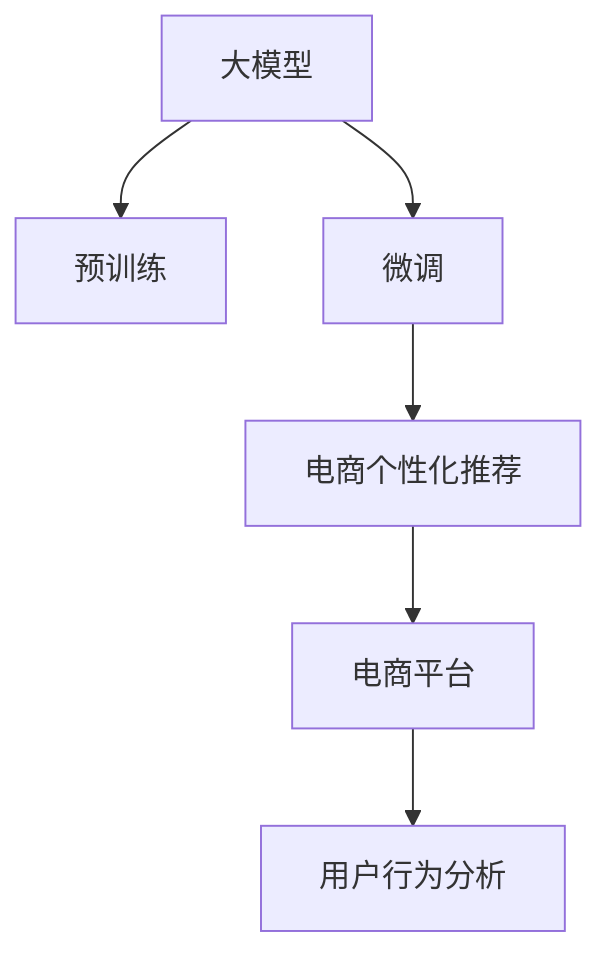

                 

# 大模型驱动的电商个性化首页设计

> 关键词：大模型, 个性化首页, 推荐系统, 电商平台, 用户行为分析

## 1. 背景介绍

随着电商市场的快速发展，个性化推荐成为各大电商平台的竞争焦点。通过向用户推荐符合其兴趣和需求的商品，电商平台不仅能够提升用户体验，还能大幅提升销售转化率。传统的推荐系统往往依赖于用户的点击、购买等行为数据进行特征提取和模型训练，难以捕捉用户的潜在兴趣和动态变化。近年来，大模型在电商领域的兴起，为个性化推荐系统注入了新动力。

本文将深入探讨大模型在电商个性化首页设计中的应用，从理论到实践，详细介绍大模型驱动的电商推荐系统如何帮助电商平台实现精准推荐，提升用户满意度。

## 2. 核心概念与联系

### 2.1 核心概念概述

为更好地理解大模型在电商个性化推荐中的应用，本节将介绍几个密切相关的核心概念：

- **大模型**：指在预训练和微调过程中，模型参数量达到数亿甚至数十亿，具备强大的语言理解和生成能力的深度学习模型，如GPT、BERT、DALL-E等。
- **个性化推荐**：指根据用户的历史行为和当前需求，为其推荐符合兴趣的商品，提升用户购物体验，增加销售额。
- **电商平台**：指通过互联网提供商品销售和服务的企业，如京东、淘宝、亚马逊等。
- **用户行为分析**：指通过用户行为数据，挖掘用户兴趣偏好、购买习惯等，为推荐系统提供输入。
- **大模型微调**：指在通用预训练模型基础上，通过下游任务的标注数据进行有监督学习，优化模型在特定任务上的性能。

这些概念之间的逻辑关系可以通过以下Mermaid流程图来展示：



这个流程图展示了大模型在电商个性化推荐中的应用：

1. 大模型通过预训练获得基础的表示能力。
2. 微调使模型学习特定任务的特征，如电商商品推荐。
3. 电商推荐系统利用微调后的模型，进行个性化商品推荐。
4. 用户行为分析模块为推荐系统提供输入，实时反馈用户反馈，进一步优化推荐策略。

## 3. 核心算法原理 & 具体操作步骤
### 3.1 算法原理概述

大模型驱动的电商个性化推荐，本质上是通过在大规模语料上进行预训练，学习通用的语言表征，再通过电商商品数据进行微调，学习特定任务特征。该过程可以表示为：

- **预训练阶段**：利用大规模无标签文本数据，通过自监督学习任务（如掩码语言模型、next sentence prediction等）训练模型，使其具备良好的语言理解能力。
- **微调阶段**：将电商商品数据作为下游任务，使用标注数据进行有监督微调，优化模型在商品推荐任务上的表现。

形式化地，假设大模型为 $M_{\theta}$，其中 $\theta$ 为预训练得到的模型参数。电商平台商品数据为 $D=\{(x_i,y_i)\}_{i=1}^N, x_i \in \text{的商品特征}, y_i \in \{商品A, 商品B, ...\}$。微调的目标是最小化损失函数 $\mathcal{L}$：

$$
\mathcal{L}(\theta) = \frac{1}{N}\sum_{i=1}^N \ell(M_{\theta}(x_i),y_i)
$$

其中 $\ell$ 为推荐任务损失函数，如交叉熵损失、均方误差损失等。

### 3.2 算法步骤详解

基于大模型的电商个性化推荐，通常包括以下几个关键步骤：

**Step 1: 准备预训练模型和数据集**

- 选择合适的预训练语言模型 $M_{\theta}$ 作为初始化参数，如GPT、BERT等。
- 准备电商商品数据集 $D$，划分为训练集、验证集和测试集。数据集应包含商品ID、描述、类别、价格等特征，以及用户历史行为数据。

**Step 2: 添加任务适配层**

- 根据电商推荐任务，在预训练模型的基础上设计合适的输出层和损失函数。
- 对于推荐任务，通常使用softmax函数将商品表示映射到概率分布，以交叉熵损失函数进行优化。

**Step 3: 设置微调超参数**

- 选择合适的优化算法及其参数，如AdamW、SGD等，设置学习率、批大小、迭代轮数等。
- 设置正则化技术及强度，包括权重衰减、Dropout、Early Stopping等。
- 确定冻结预训练参数的策略，如仅微调顶层，或全部参数都参与微调。

**Step 4: 执行梯度训练**

- 将电商商品数据分批次输入模型，前向传播计算损失函数。
- 反向传播计算参数梯度，根据设定的优化算法和学习率更新模型参数。
- 周期性在验证集上评估模型性能，根据性能指标决定是否触发Early Stopping。
- 重复上述步骤直到满足预设的迭代轮数或Early Stopping条件。

**Step 5: 测试和部署**

- 在测试集上评估微调后模型 $M_{\hat{\theta}}$ 的性能，对比微调前后的精度提升。
- 使用微调后的模型对新商品进行推荐，集成到电商平台首页中。
- 持续收集新的用户行为数据，定期重新微调模型，以适应用户需求的变化。

以上是基于大模型驱动的电商个性化推荐的一般流程。在实际应用中，还需要针对具体电商平台的业务特点，对微调过程的各个环节进行优化设计，如改进训练目标函数，引入更多的正则化技术，搜索最优的超参数组合等，以进一步提升模型性能。

### 3.3 算法优缺点

大模型驱动的电商个性化推荐方法具有以下优点：

1. 精准推荐：大模型通过学习丰富的语言知识和用户行为数据，能够准确捕捉用户兴趣，提升推荐精准度。
2. 实时性高：大模型的推理速度较快，可以实时响应用户行为，提供动态推荐的体验。
3. 通用性强：大模型在电商推荐中的应用，可以推广到其他领域，如音乐、电影推荐等。
4. 泛化能力强：通过预训练和微调，大模型具有较强的泛化能力，能在不同的电商平台上取得良好的表现。

同时，该方法也存在一定的局限性：

1. 计算资源需求高：大模型参数量庞大，训练和推理需要消耗大量的计算资源。
2. 数据隐私问题：电商平台需要处理大量用户数据，涉及隐私保护和数据安全问题。
3. 模型可解释性差：大模型往往是一个黑盒系统，难以解释推荐过程和决策逻辑。
4. 过度拟合风险：微调过程中，若数据量不足，容易导致模型过度拟合，泛化性能下降。

尽管存在这些局限性，但就目前而言，大模型驱动的电商推荐系统仍然是电商个性化推荐的重要手段。未来相关研究的重点在于如何降低计算资源消耗，提升模型可解释性，同时兼顾隐私保护和数据安全等因素。

### 3.4 算法应用领域

大模型在电商个性化推荐中的应用，已经在众多电商平台得到了广泛的应用。例如：

1. **京东**：京东利用大模型驱动的推荐系统，实现了个性化商品推荐，提升用户购物体验，增加销售额。
2. **亚马逊**：亚马逊通过预训练大模型，学习用户行为特征，进行个性化推荐，优化商品展示策略。
3. **淘宝**：淘宝采用大模型推荐技术，为用户提供定制化的购物建议，增加用户粘性和满意度。
4. **拼多多**：拼多多使用大模型推荐系统，动态调整商品推荐顺序，提升用户转化率和平台收益。

这些案例展示了大模型在电商推荐领域的巨大潜力，通过微调过程不断优化模型，实现了用户需求的精准匹配和商品展示效果的提升。

## 4. 数学模型和公式 & 详细讲解
### 4.1 数学模型构建

本节将使用数学语言对大模型驱动的电商个性化推荐过程进行更加严格的刻画。

记大模型为 $M_{\theta}$，其中 $\theta$ 为模型参数。假设电商平台商品数据为 $D=\{(x_i,y_i)\}_{i=1}^N, x_i \in \text{的商品特征}, y_i \in \{商品A, 商品B, ...\}$。微调的目标是最小化损失函数 $\mathcal{L}$：

$$
\mathcal{L}(\theta) = \frac{1}{N}\sum_{i=1}^N \ell(M_{\theta}(x_i),y_i)
$$

其中 $\ell$ 为推荐任务损失函数，如交叉熵损失、均方误差损失等。

### 4.2 公式推导过程

以下我们以电商商品推荐任务为例，推导交叉熵损失函数及其梯度的计算公式。

假设模型 $M_{\theta}$ 在输入 $x$ 上的输出为 $\hat{y}=M_{\theta}(x) \in [0,1]$，表示商品 $x$ 属于 $y$ 的概率。真实标签 $y_i \in \{商品A, 商品B, ...\}$。则交叉熵损失函数定义为：

$$
\ell(M_{\theta}(x),y) = -[y_i\log M_{\theta}(x_i)+(1-y_i)\log(1-M_{\theta}(x_i))]
$$

将其代入经验风险公式，得：

$$
\mathcal{L}(\theta) = -\frac{1}{N}\sum_{i=1}^N [y_i\log M_{\theta}(x_i)+(1-y_i)\log(1-M_{\theta}(x_i))]
$$

根据链式法则，损失函数对参数 $\theta_k$ 的梯度为：

$$
\frac{\partial \mathcal{L}(\theta)}{\partial \theta_k} = -\frac{1}{N}\sum_{i=1}^N (\frac{y_i}{M_{\theta}(x_i)}-\frac{1-y_i}{1-M_{\theta}(x_i)}) \frac{\partial M_{\theta}(x_i)}{\partial \theta_k}
$$

其中 $\frac{\partial M_{\theta}(x_i)}{\partial \theta_k}$ 可进一步递归展开，利用自动微分技术完成计算。

在得到损失函数的梯度后，即可带入参数更新公式，完成模型的迭代优化。重复上述过程直至收敛，最终得到适应电商推荐任务的最优模型参数 $\theta^*$。

## 5. 项目实践：代码实例和详细解释说明
### 5.1 开发环境搭建

在进行电商个性化推荐实践前，我们需要准备好开发环境。以下是使用Python进行PyTorch开发的环境配置流程：

1. 安装Anaconda：从官网下载并安装Anaconda，用于创建独立的Python环境。

2. 创建并激活虚拟环境：
```bash
conda create -n pytorch-env python=3.8 
conda activate pytorch-env
```

3. 安装PyTorch：根据CUDA版本，从官网获取对应的安装命令。例如：
```bash
conda install pytorch torchvision torchaudio cudatoolkit=11.1 -c pytorch -c conda-forge
```

4. 安装Transformers库：
```bash
pip install transformers
```

5. 安装各类工具包：
```bash
pip install numpy pandas scikit-learn matplotlib tqdm jupyter notebook ipython
```

完成上述步骤后，即可在`pytorch-env`环境中开始电商推荐系统的开发。

### 5.2 源代码详细实现

这里我们以电商商品推荐任务为例，给出使用Transformers库对预训练模型进行微调的PyTorch代码实现。

首先，定义电商推荐任务的数据处理函数：

```python
from transformers import BertTokenizer
from torch.utils.data import Dataset
import torch

class RecommendationDataset(Dataset):
    def __init__(self, items, user_behav, tokenizer, max_len=128):
        self.items = items
        self.user_behav = user_behav
        self.tokenizer = tokenizer
        self.max_len = max_len
        
    def __len__(self):
        return len(self.items)
    
    def __getitem__(self, item):
        item = self.items[item]
        behav = self.user_behav[item]
        
        encoding = self.tokenizer(item, return_tensors='pt', max_length=self.max_len, padding='max_length', truncation=True)
        input_ids = encoding['input_ids'][0]
        attention_mask = encoding['attention_mask'][0]
        
        # 对行为序列进行编码
        encoded_behav = [behav] * self.max_len
        labels = torch.tensor(encoded_behav, dtype=torch.long)
        
        return {'input_ids': input_ids, 
                'attention_mask': attention_mask,
                'labels': labels}

# 定义行为序列与id的映射
behav2id = {'浏览': 0, '点击': 1, '购买': 2}
id2behav = {v: k for k, v in behav2id.items()}

# 创建dataset
tokenizer = BertTokenizer.from_pretrained('bert-base-cased')

train_dataset = RecommendationDataset(train_items, train_behav, tokenizer)
dev_dataset = RecommendationDataset(dev_items, dev_behav, tokenizer)
test_dataset = RecommendationDataset(test_items, test_behav, tokenizer)
```

然后，定义模型和优化器：

```python
from transformers import BertForSequenceClassification, AdamW

model = BertForSequenceClassification.from_pretrained('bert-base-cased', num_labels=len(behav2id))

optimizer = AdamW(model.parameters(), lr=2e-5)
```

接着，定义训练和评估函数：

```python
from torch.utils.data import DataLoader
from tqdm import tqdm
from sklearn.metrics import accuracy_score

device = torch.device('cuda') if torch.cuda.is_available() else torch.device('cpu')
model.to(device)

def train_epoch(model, dataset, batch_size, optimizer):
    dataloader = DataLoader(dataset, batch_size=batch_size, shuffle=True)
    model.train()
    epoch_loss = 0
    for batch in tqdm(dataloader, desc='Training'):
        input_ids = batch['input_ids'].to(device)
        attention_mask = batch['attention_mask'].to(device)
        labels = batch['labels'].to(device)
        model.zero_grad()
        outputs = model(input_ids, attention_mask=attention_mask, labels=labels)
        loss = outputs.loss
        epoch_loss += loss.item()
        loss.backward()
        optimizer.step()
    return epoch_loss / len(dataloader)

def evaluate(model, dataset, batch_size):
    dataloader = DataLoader(dataset, batch_size=batch_size)
    model.eval()
    preds, labels = [], []
    with torch.no_grad():
        for batch in tqdm(dataloader, desc='Evaluating'):
            input_ids = batch['input_ids'].to(device)
            attention_mask = batch['attention_mask'].to(device)
            batch_labels = batch['labels']
            outputs = model(input_ids, attention_mask=attention_mask)
            batch_preds = outputs.logits.argmax(dim=2).to('cpu').tolist()
            batch_labels = batch_labels.to('cpu').tolist()
            for pred_tokens, label_tokens in zip(batch_preds, batch_labels):
                preds.append(pred_tokens)
                labels.append(label_tokens)
                
    print(f'Accuracy: {accuracy_score(labels, preds)}')
```

最后，启动训练流程并在测试集上评估：

```python
epochs = 5
batch_size = 16

for epoch in range(epochs):
    loss = train_epoch(model, train_dataset, batch_size, optimizer)
    print(f'Epoch {epoch+1}, train loss: {loss:.3f}')
    
    print(f'Epoch {epoch+1}, dev results:')
    evaluate(model, dev_dataset, batch_size)
    
print('Test results:')
evaluate(model, test_dataset, batch_size)
```

以上就是使用PyTorch对预训练模型进行电商商品推荐任务微调的完整代码实现。可以看到，得益于Transformers库的强大封装，我们可以用相对简洁的代码完成BERT模型的加载和微调。

### 5.3 代码解读与分析

让我们再详细解读一下关键代码的实现细节：

**RecommendationDataset类**：
- `__init__`方法：初始化商品数据、用户行为序列等关键组件。
- `__len__`方法：返回数据集的样本数量。
- `__getitem__`方法：对单个样本进行处理，将商品输入编码为token ids，将行为序列编码为数字，并对其进行定长padding，最终返回模型所需的输入。

**behav2id和id2behav字典**：
- 定义了行为与数字id之间的映射关系，用于将token-wise的预测结果解码回真实行为。

**训练和评估函数**：
- 使用PyTorch的DataLoader对数据集进行批次化加载，供模型训练和推理使用。
- 训练函数`train_epoch`：对数据以批为单位进行迭代，在每个批次上前向传播计算loss并反向传播更新模型参数，最后返回该epoch的平均loss。
- 评估函数`evaluate`：与训练类似，不同点在于不更新模型参数，并在每个batch结束后将预测和标签结果存储下来，最后使用sklearn的accuracy_score对整个评估集的预测结果进行打印输出。

**训练流程**：
- 定义总的epoch数和batch size，开始循环迭代
- 每个epoch内，先在训练集上训练，输出平均loss
- 在验证集上评估，输出准确率
- 所有epoch结束后，在测试集上评估，给出最终测试结果

可以看到，PyTorch配合Transformers库使得电商推荐系统的微调代码实现变得简洁高效。开发者可以将更多精力放在数据处理、模型改进等高层逻辑上，而不必过多关注底层的实现细节。

当然，工业级的系统实现还需考虑更多因素，如模型的保存和部署、超参数的自动搜索、更灵活的任务适配层等。但核心的微调范式基本与此类似。

## 6. 实际应用场景
### 6.1 智能推荐系统

基于大模型驱动的电商个性化推荐系统，已经成为电商平台的标配。其通过学习和理解用户行为，动态调整商品推荐顺序，显著提升了用户体验和转化率。

在技术实现上，推荐系统主要由以下几个部分构成：

1. **用户画像生成**：利用大模型对用户历史行为进行编码，生成用户兴趣画像。
2. **商品编码**：将商品描述和属性进行编码，生成商品特征表示。
3. **相似度计算**：通过余弦相似度、点积相似度等方法，计算用户和商品之间的相似度。
4. **推荐排序**：将相似度作为排序依据，推荐与用户最匹配的商品。

电商推荐系统通过微调过程不断优化模型，使得推荐结果更加符合用户需求。同时，通过用户行为反馈，系统能够实时调整推荐策略，提升推荐效果。

### 6.2 实时个性化推荐

电商平台不仅需要离线推荐，还需要实时推荐以应对用户的动态需求。利用大模型的高实时性，电商平台可以在用户浏览页面时，实时动态调整推荐内容，提升用户体验。

实时推荐系统的关键在于数据实时处理和模型推理效率。通过微调过程优化模型推理速度，结合数据流处理技术，如Kafka、Flink等，电商平台能够实现快速响应。

### 6.3 多渠道推荐协同

现代电商平台往往拥有多渠道（如APP、PC、社交媒体等），如何协同各渠道的推荐策略是一个挑战。通过在大模型上微调，不同渠道的推荐系统可以共享同一模型，实现一致的推荐逻辑和用户画像。

多渠道推荐协同的关键在于跨平台的数据同步和模型融合。利用大模型的泛化能力，推荐系统能够在不同渠道间进行无缝切换，提供统一的推荐体验。

### 6.4 未来应用展望

随着大模型和微调技术的不断演进，电商推荐系统的应用将更加广泛，为电商平台带来更多的商业价值。

1. **跨领域推荐**：利用大模型的泛化能力，推荐系统可以在不同领域（如电商、音乐、视频等）进行推荐。通过微调过程学习领域特征，提升推荐效果。
2. **生成式推荐**：结合生成式大模型，如GPT、DALL-E等，电商平台可以实现动态生成商品推荐内容，提升推荐多样性。
3. **用户生成内容推荐**：利用大模型对用户生成内容（如评论、笔记）进行建模，推荐与用户兴趣相符的UGC内容。
4. **社会化推荐**：结合社交网络数据，利用大模型学习用户社交关系，推荐与用户社交圈中的朋友喜欢的商品。

大模型驱动的电商推荐系统将成为电商行业的重要技术创新点，为电商平台带来更广阔的市场机会和更深入的用户洞察。未来，大模型将与更多新兴技术结合，如知识图谱、增强学习等，实现更全面的智能推荐，推动电商行业的持续发展。

## 7. 工具和资源推荐
### 7.1 学习资源推荐

为了帮助开发者系统掌握大模型在电商推荐系统中的应用，这里推荐一些优质的学习资源：

1. 《Transformer from Principle to Practice》系列博文：由大模型技术专家撰写，深入浅出地介绍了Transformer原理、电商推荐系统、微调技术等前沿话题。

2. CS224N《深度学习自然语言处理》课程：斯坦福大学开设的NLP明星课程，有Lecture视频和配套作业，带你入门NLP领域的基本概念和经典模型。

3. 《Natural Language Processing with Transformers》书籍：Transformers库的作者所著，全面介绍了如何使用Transformers库进行NLP任务开发，包括电商推荐在内的诸多范式。

4. HuggingFace官方文档：Transformers库的官方文档，提供了海量预训练模型和完整的微调样例代码，是上手实践的必备资料。

5. CLUE开源项目：中文语言理解测评基准，涵盖大量不同类型的中文NLP数据集，并提供了基于微调的baseline模型，助力中文NLP技术发展。

通过对这些资源的学习实践，相信你一定能够快速掌握大模型在电商推荐系统中的应用，并用于解决实际的NLP问题。

### 7.2 开发工具推荐

高效的开发离不开优秀的工具支持。以下是几款用于电商推荐系统开发的常用工具：

1. PyTorch：基于Python的开源深度学习框架，灵活动态的计算图，适合快速迭代研究。大部分预训练语言模型都有PyTorch版本的实现。

2. TensorFlow：由Google主导开发的开源深度学习框架，生产部署方便，适合大规模工程应用。同样有丰富的预训练语言模型资源。

3. Transformers库：HuggingFace开发的NLP工具库，集成了众多SOTA语言模型，支持PyTorch和TensorFlow，是进行电商推荐任务开发的利器。

4. Weights & Biases：模型训练的实验跟踪工具，可以记录和可视化模型训练过程中的各项指标，方便对比和调优。与主流深度学习框架无缝集成。

5. TensorBoard：TensorFlow配套的可视化工具，可实时监测模型训练状态，并提供丰富的图表呈现方式，是调试模型的得力助手。

6. Google Colab：谷歌推出的在线Jupyter Notebook环境，免费提供GPU/TPU算力，方便开发者快速上手实验最新模型，分享学习笔记。

合理利用这些工具，可以显著提升电商推荐系统的开发效率，加快创新迭代的步伐。

### 7.3 相关论文推荐

大模型在电商推荐系统中的应用，源于学界的持续研究。以下是几篇奠基性的相关论文，推荐阅读：

1. Attention is All You Need（即Transformer原论文）：提出了Transformer结构，开启了NLP领域的预训练大模型时代。

2. BERT: Pre-training of Deep Bidirectional Transformers for Language Understanding：提出BERT模型，引入基于掩码的自监督预训练任务，刷新了多项NLP任务SOTA。

3. Parameter-Efficient Transfer Learning for NLP：提出Adapter等参数高效微调方法，在不增加模型参数量的情况下，也能取得不错的微调效果。

4. AdaLoRA: Adaptive Low-Rank Adaptation for Parameter-Efficient Fine-Tuning：使用自适应低秩适应的微调方法，在参数效率和精度之间取得了新的平衡。

5. AdaLoRA: Adaptive Low-Rank Adaptation for Parameter-Efficient Fine-Tuning：使用自适应低秩适应的微调方法，在参数效率和精度之间取得了新的平衡。

这些论文代表了大模型在电商推荐系统中的应用的发展脉络。通过学习这些前沿成果，可以帮助研究者把握学科前进方向，激发更多的创新灵感。

## 8. 总结：未来发展趋势与挑战
### 8.1 研究成果总结

本文对大模型在电商个性化推荐中的应用进行了全面系统的介绍。首先阐述了电商个性化推荐系统的背景和重要性，明确了大模型在提升推荐精准度、实时性和可扩展性方面的独特价值。其次，从理论到实践，详细讲解了大模型驱动的电商推荐系统的算法原理和操作步骤，给出了电商推荐任务开发的完整代码实例。同时，本文还广泛探讨了电商推荐系统在多个电商平台的实际应用，展示了其巨大的应用潜力和商业价值。

通过本文的系统梳理，可以看到，大模型在电商推荐系统中的应用已经成为电商平台的标配，帮助电商平台实现精准推荐，提升了用户购物体验和平台销售额。未来，随着大模型和微调技术的不断演进，大模型驱动的电商推荐系统必将在电商行业发挥更大的作用。

### 8.2 未来发展趋势

展望未来，大模型驱动的电商推荐系统将呈现以下几个发展趋势：

1. **多模态推荐**：结合视觉、音频等多模态数据，利用大模型的多模态表示能力，实现更全面的推荐。
2. **动态生成推荐**：利用生成式大模型，动态生成推荐内容，提升推荐多样性。
3. **社交推荐**：结合社交网络数据，利用大模型学习用户社交关系，推荐与用户社交圈中的朋友喜欢的商品。
4. **跨领域推荐**：利用大模型的泛化能力，推荐系统可以在不同领域进行推荐，提升推荐效果。
5. **实时推荐**：通过微调过程优化模型推理速度，结合数据流处理技术，实现实时推荐。
6. **个性化推荐**：利用大模型学习用户个性化需求，实现更精准的推荐。

以上趋势凸显了大模型在电商推荐系统中的广泛应用前景。这些方向的探索发展，必将进一步提升电商推荐系统的性能和用户体验，推动电商行业的发展进步。

### 8.3 面临的挑战

尽管大模型驱动的电商推荐系统已经取得了显著效果，但在迈向更加智能化、普适化应用的过程中，它仍面临以下挑战：

1. **计算资源消耗**：大模型参数量庞大，训练和推理需要消耗大量的计算资源。
2. **数据隐私问题**：电商平台需要处理大量用户数据，涉及隐私保护和数据安全问题。
3. **模型可解释性差**：大模型往往是一个黑盒系统，难以解释推荐过程和决策逻辑。
4. **过度拟合风险**：微调过程中，若数据量不足，容易导致模型过度拟合，泛化性能下降。
5. **实时性挑战**：电商推荐系统需要在短时间内处理大规模数据，实现实时推荐。

尽管存在这些挑战，但通过合理设计算法和优化资源使用，这些挑战都是可以克服的。未来相关研究的重点在于如何进一步降低计算资源消耗，提升模型可解释性，同时兼顾隐私保护和数据安全等因素。

### 8.4 研究展望

面对电商推荐系统所面临的挑战，未来的研究需要在以下几个方面寻求新的突破：

1. **参数高效微调方法**：开发更加参数高效的微调方法，在固定大部分预训练参数的同时，只更新极少量的任务相关参数，减小计算资源消耗。
2. **跨模态推荐系统**：结合视觉、音频等多模态数据，利用大模型的多模态表示能力，实现更全面的推荐。
3. **实时推荐系统**：通过微调过程优化模型推理速度，结合数据流处理技术，实现实时推荐。
4. **社交推荐系统**：结合社交网络数据，利用大模型学习用户社交关系，推荐与用户社交圈中的朋友喜欢的商品。
5. **生成式推荐系统**：利用生成式大模型，动态生成推荐内容，提升推荐多样性。
6. **多渠道推荐协同**：利用大模型的泛化能力，推荐系统能够在不同渠道间进行无缝切换，提供统一的推荐体验。

这些研究方向将推动电商推荐系统向更高效、智能、个性化方向发展，为电商平台带来更多的商业价值。

## 9. 附录：常见问题与解答

**Q1：大模型推荐系统是否适用于所有电商平台？**

A: 大模型推荐系统在大多数电商平台上都能取得不错的效果，特别是对于数据量较大的平台。但对于一些特定领域的平台，如小型电商平台或用户量较小的平台，可能效果不佳。此时需要在特定领域语料上进一步预训练，再进行微调，才能获得理想效果。

**Q2：电商推荐系统如何平衡用户个性化和推荐多样性？**

A: 电商推荐系统需要在用户个性化和推荐多样性之间找到平衡。通过微调过程优化模型，使得推荐结果既能够满足用户个性化需求，又能够包含足够的推荐多样性。可以利用多任务学习，将用户个性化需求和推荐多样性作为联合学习目标，进行联合优化。

**Q3：电商推荐系统如何处理数据隐私问题？**

A: 电商推荐系统需要处理大量用户数据，涉及隐私保护和数据安全问题。可以通过数据匿名化、差分隐私等技术手段，保护用户隐私。同时，采用多方安全计算等技术，在数据不出本地的情况下，进行模型训练和推理。

**Q4：如何评价电商推荐系统的性能？**

A: 电商推荐系统的性能可以从以下几个指标进行评估：

1. **点击率（CTR）**：衡量用户对推荐商品的点击概率，是电商推荐系统的重要指标。
2. **转化率（CVR）**：衡量用户对推荐商品进行购买的行为，是电商推荐系统的主要评价指标。
3. **召回率（Recall）**：衡量推荐系统中与用户兴趣相符的商品数量，是评估推荐多样性的指标。
4. **覆盖率（Coverage）**：衡量推荐系统中商品种类的多样性，是评估推荐全面性的指标。

通过这些指标的综合评估，可以全面了解电商推荐系统的性能表现。

**Q5：电商推荐系统如何处理模型过拟合问题？**

A: 电商推荐系统在微调过程中，可能会面临过拟合问题。可以通过以下方法缓解：

1. **数据增强**：通过数据生成技术，扩充训练集，增加数据多样性，防止过拟合。
2. **正则化**：引入L2正则、Dropout等正则化技术，防止模型过拟合。
3. **早停策略**：在验证集上监控模型性能，一旦性能不再提升，即停止训练，防止过拟合。
4. **多任务学习**：将用户个性化需求和推荐多样性作为联合学习目标，进行联合优化，防止过拟合。

通过这些方法，可以在电商推荐系统中有效地缓解过拟合问题，提升模型泛化能力。

---

作者：禅与计算机程序设计艺术 / Zen and the Art of Computer Programming

