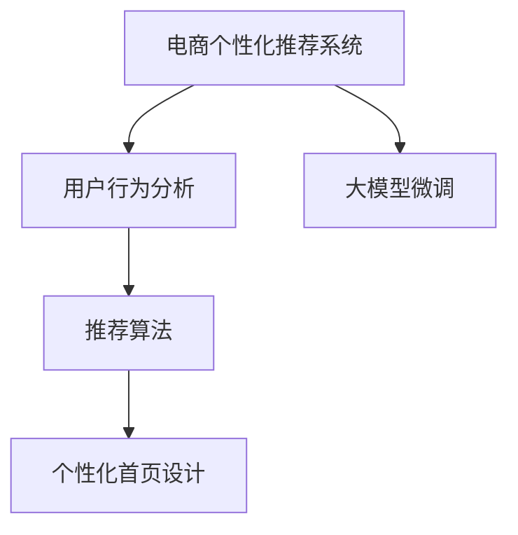

                 

# 大模型驱动的电商个性化首页设计

> 关键词：电商个性化，用户行为分析，大模型微调，推荐算法，数据驱动设计，用户体验

## 1. 背景介绍

随着电商行业的不断壮大，个性化推荐系统成为了提升用户体验、提高转化率的关键技术。传统的推荐系统往往基于用户的历史行为数据进行物品推荐，难以对用户未来的需求进行预测和引导。近年来，基于深度学习的大模型微调技术，通过学习大规模用户行为数据，实现了更为精准、个性化的推荐服务，极大地提升了电商平台的商品曝光率和用户满意度。本文将重点探讨大模型在电商个性化首页设计中的应用，通过深入分析用户行为数据，设计高效、智能的推荐算法，为用户提供个性化的购物体验。

## 2. 核心概念与联系

### 2.1 核心概念概述

为更好地理解大模型在电商个性化首页设计中的应用，本节将介绍几个密切相关的核心概念：

- **电商个性化推荐系统**：通过分析用户历史行为数据，预测用户未来需求，推荐其可能感兴趣的商品，提升用户购物体验和平台转化率的技术系统。
- **大模型微调**：指在大规模预训练语言模型基础上，通过有监督地学习特定领域的任务数据，优化模型以适应具体应用场景的过程。
- **推荐算法**：用于分析用户行为数据，预测用户偏好，生成个性化推荐结果的算法模型。
- **用户行为分析**：通过分析用户浏览、点击、购买等行为数据，挖掘用户的兴趣点，为推荐算法提供数据支撑。
- **数据驱动设计**：依托大数据分析结果，设计产品功能，优化用户体验的研发方式。

这些核心概念之间的逻辑关系可以通过以下Mermaid流程图来展示：



这个流程图展示了大模型微调和推荐系统之间的关系：

1. 大模型微调通过学习用户行为数据，获得通用的语言表示和知识。
2. 推荐算法利用大模型微调的结果，进行更深层次的个性化推荐。
3. 个性化首页设计依赖推荐算法的结果，为用户提供更为精准的购物建议。

## 3. 核心算法原理 & 具体操作步骤
### 3.1 算法原理概述

电商个性化首页设计基于大模型微调推荐算法，其核心思想是：通过深度学习模型分析用户行为数据，学习用户兴趣和购买倾向，从而实现精准的个性化推荐。具体来说，算法通过以下步骤完成：

1. 收集用户行为数据，包括浏览、点击、购买等。
2. 使用大模型微调技术，对模型进行领域特定优化，提升推荐精度。
3. 将微调后的模型应用到推荐算法中，生成个性化首页的推荐商品。

### 3.2 算法步骤详解

以下是电商个性化首页设计中大模型微调推荐算法的基本流程：

**Step 1: 数据准备**

- **数据收集**：从电商平台中获取用户的浏览、点击、购买、评价等行为数据。
- **数据清洗**：对数据进行去重、处理缺失值、去除异常值等清洗操作。
- **特征工程**：提取和构建描述用户行为的特征，如浏览时长、点击位置、浏览路径等。

**Step 2: 模型训练**

- **选择模型**：选择合适的大模型，如BERT、GPT等，进行预训练。
- **微调模型**：在特定领域的数据上对模型进行微调，学习用户行为模式。
- **评估模型**：使用验证集评估模型性能，选择最优模型。

**Step 3: 推荐生成**

- **特征提取**：将用户行为数据转换为模型可接受的形式，如词向量、高维向量等。
- **模型预测**：使用微调后的模型对用户行为进行预测，得到推荐商品列表。
- **结果排序**：根据评分机制对推荐商品进行排序，生成个性化首页的推荐展示。

### 3.3 算法优缺点

大模型微调在电商个性化推荐系统中具有以下优点：

- **高精度**：通过深度学习模型学习用户行为数据，能够获得高精度的推荐结果。
- **适应性强**：大模型能够适应多种用户行为数据，提升推荐系统的泛化能力。
- **数据利用率高**：可以充分利用电商平台的海量用户行为数据，提高推荐效果。

同时，该方法也存在一定的局限性：

- **计算资源消耗大**：深度学习模型需要大量的计算资源和时间进行训练和微调。
- **模型复杂度高**：模型结构复杂，难以解释和优化。
- **数据隐私问题**：用户行为数据涉及个人隐私，需注意数据安全。

### 3.4 算法应用领域

电商个性化首页设计中的大模型微调推荐算法，已经在各大电商平台得到广泛应用，以下是其主要应用场景：

- **首页推荐**：根据用户浏览历史，智能展示个性化商品，提升用户停留时间和点击率。
- **商品详情页**：根据用户点击行为，推荐相关商品，提升商品曝光率和转化率。
- **搜索排序**：在用户搜索时，推荐最相关的商品，优化搜索体验。
- **活动推荐**：根据用户行为，推荐最新的促销活动和优惠信息，提高用户参与度。

## 4. 数学模型和公式 & 详细讲解 & 举例说明

### 4.1 数学模型构建

电商个性化首页设计中的推荐算法主要使用深度学习模型进行建模。以基于序列的模型为例，常见的模型包括RNN、GRU、LSTM等。这里以LSTM模型为例，构建推荐系统的数学模型。

假设用户行为数据表示为序列 $x=(x_1, x_2, ..., x_T)$，推荐商品列表为 $y=(y_1, y_2, ..., y_{M})$。模型的目标是学习用户行为序列 $x$ 与推荐商品列表 $y$ 之间的映射关系，即：

$$
p(y|x;\theta) = \prod_{t=1}^T p(y_t|x_1,x_2,...,x_t;\theta)
$$

其中，$\theta$ 为模型参数，$p(y_t|x_1,x_2,...,x_t;\theta)$ 表示在用户行为 $x_1,x_2,...,x_t$ 的条件下，推荐商品 $y_t$ 的概率分布。

### 4.2 公式推导过程

LSTM模型的核心在于处理长序列数据的能力。其基本结构包括一个输入门、一个遗忘门、一个输出门和一个记忆单元。假设记忆单元的初始值为 $C_0$，经过LSTM层的变换后变为 $C_T$。LSTM层的计算过程如下：

$$
C_t = \sigma_g(W_{gi}x_t + b_{gi} + W_{gi}h_{t-1} + b_{gi}) \odot \tanh(W_{gi}x_t + b_{gi} + W_{gi}h_{t-1} + b_{gi})
$$

$$
f_t = \sigma_g(W_{gj}x_t + b_{gj} + W_{gj}h_{t-1} + b_{gj})
$$

$$
h_t = f_t \odot C_{t-1} + (1-f_t) \odot \tanh(C_t)
$$

其中，$x_t$ 为序列中的第 $t$ 个样本，$h_t$ 为LSTM层输出的隐藏状态，$C_t$ 为记忆单元状态，$\sigma_g$ 为Sigmoid激活函数，$\tanh$ 为双曲正切激活函数，$W_{gi}$ 和 $b_{gi}$ 为输入门、遗忘门和输出门的权重和偏置。

最终，模型的预测输出 $y_t$ 通过输出门计算得到：

$$
y_t = softmax(W_{o}h_t + b_{o})
$$

其中，$softmax$ 函数将 $h_t$ 映射到 $[0,1]$ 区间，输出概率分布。

### 4.3 案例分析与讲解

以Amazon为例，其首页推荐系统采用了基于LSTM的大模型微调算法。具体流程如下：

1. 数据收集：Amazon收集用户每天的浏览、点击、购买等行为数据。
2. 数据预处理：对数据进行去重、处理缺失值等操作，提取用户行为特征。
3. 模型训练：使用LSTM模型对用户行为数据进行预训练，得到通用的语言表示。
4. 微调优化：在特定领域的数据上对模型进行微调，提升推荐精度。
5. 推荐生成：将微调后的模型应用到推荐算法中，生成个性化首页的推荐商品。

通过这种方法，Amazon能够对用户行为进行更深入的分析，生成更精准的推荐结果，极大地提升了用户的购物体验和平台转化率。

## 5. 项目实践：代码实例和详细解释说明

### 5.1 开发环境搭建

在进行电商个性化首页设计前，我们需要准备好开发环境。以下是使用Python进行TensorFlow开发的环境配置流程：

1. 安装Anaconda：从官网下载并安装Anaconda，用于创建独立的Python环境。

2. 创建并激活虚拟环境：
```bash
conda create -n tf-env python=3.7 
conda activate tf-env
```

3. 安装TensorFlow：根据CUDA版本，从官网获取对应的安装命令。例如：
```bash
conda install tensorflow -c conda-forge
```

4. 安装TensorBoard：用于可视化模型训练过程，与TensorFlow无缝集成。
```bash
pip install tensorboard
```

5. 安装TensorFlow Addons：用于增强TensorFlow的功能，提供更多的深度学习模型和工具。
```bash
pip install tensorflow-addons
```

完成上述步骤后，即可在`tf-env`环境中开始开发实践。

### 5.2 源代码详细实现

下面我们以LSTM模型为例，给出使用TensorFlow对电商平台用户行为数据进行微调和推荐预测的代码实现。

首先，定义数据预处理函数：

```python
import numpy as np
import tensorflow as tf
from tensorflow.keras.layers import LSTM, Dense, Dropout
from tensorflow.keras.models import Sequential
from tensorflow.keras.callbacks import EarlyStopping

def preprocess_data(train_data, test_data, seq_len=100, batch_size=32):
    train_X, train_y, test_X, test_y = [], [], [], []
    
    for seq in train_data:
        train_X.append(seq[:-1])
        train_y.append(seq[-1])
        
    for seq in test_data:
        test_X.append(seq[:-1])
        test_y.append(seq[-1])
        
    train_X = np.array(train_X) / 255.0
    train_y = np.array(train_y) / 255.0
    test_X = np.array(test_X) / 255.0
    test_y = np.array(test_y) / 255.0
    
    train_X = train_X.reshape(-1, seq_len, 1)
    test_X = test_X.reshape(-1, seq_len, 1)
    
    train_dataset = tf.data.Dataset.from_tensor_slices((train_X, train_y))
    train_dataset = train_dataset.shuffle(10000).batch(batch_size)
    
    test_dataset = tf.data.Dataset.from_tensor_slices((test_X, test_y))
    test_dataset = test_dataset.batch(batch_size)
    
    return train_dataset, test_dataset
```

然后，定义LSTM模型：

```python
def build_model(seq_len=100, num_classes=10):
    model = Sequential()
    model.add(LSTM(128, return_sequences=True, input_shape=(seq_len, 1)))
    model.add(Dropout(0.2))
    model.add(LSTM(64, return_sequences=True))
    model.add(Dropout(0.2))
    model.add(LSTM(32))
    model.add(Dropout(0.2))
    model.add(Dense(num_classes, activation='softmax'))
    
    model.compile(loss='categorical_crossentropy', optimizer='adam', metrics=['accuracy'])
    
    return model
```

接着，定义训练和评估函数：

```python
def train_model(model, train_dataset, test_dataset, epochs=10, patience=2):
    early_stopping = EarlyStopping(monitor='val_loss', patience=patience)
    history = model.fit(train_dataset, validation_data=test_dataset, epochs=epochs, callbacks=[early_stopping])
    
    return history
```

最后，启动训练流程并在测试集上评估：

```python
seq_len = 100
num_classes = 10
batch_size = 32

# 准备数据
train_data, test_data = preprocess_data(train_data, test_data, seq_len=seq_len, batch_size=batch_size)

# 构建模型
model = build_model(seq_len=seq_len, num_classes=num_classes)

# 训练模型
history = train_model(model, train_dataset, test_dataset, epochs=10, patience=2)

# 评估模型
test_loss, test_acc = model.evaluate(test_dataset)
print(f'Test loss: {test_loss:.4f}')
print(f'Test accuracy: {test_acc:.4f}')
```

以上就是使用TensorFlow对电商平台用户行为数据进行微调和推荐预测的完整代码实现。可以看到，通过TensorFlow和TensorFlow Addons库，我们可以方便地实现LSTM模型的构建、训练和评估。

### 5.3 代码解读与分析

让我们再详细解读一下关键代码的实现细节：

**preprocess_data函数**：
- 定义了一个数据预处理函数，用于将原始数据转换为模型可接受的格式，包括数据清洗、特征提取、数据重塑、批处理等操作。

**build_model函数**：
- 定义了一个LSTM模型，包括输入层、LSTM层、Dropout层、输出层等组件，使用`Sequential`模型进行搭建。

**train_model函数**：
- 定义了一个模型训练函数，使用`EarlyStopping`回调机制防止过拟合，通过`fit`方法训练模型。

**训练流程**：
- 首先通过`preprocess_data`函数准备数据，然后构建LSTM模型，接着使用`train_model`函数进行模型训练。

可以看到，TensorFlow的模块化设计和丰富的工具库，极大地简化了模型开发和调试过程。

## 6. 实际应用场景

### 6.1 智能推荐系统

电商平台的智能推荐系统是用户个性化首页设计的重要应用场景。通过LSTM模型对用户行为数据进行分析和预测，可以生成个性化的商品推荐列表，提升用户的购物体验和平台转化率。

以Amazon为例，其首页推荐系统通过LSTM模型对用户的历史浏览、点击、购买数据进行学习，生成推荐商品列表，实时展示给用户，从而提高用户点击率和购买率。

### 6.2 客户关系管理

客户关系管理(CRM)系统是电商平台的另一重要应用场景。通过LSTM模型对客户的历史行为数据进行分析，可以生成个性化的客户关系管理方案，提高客户满意度和忠诚度。

以阿里巴巴为例，其CRM系统通过LSTM模型对客户的购买记录、浏览记录等行为数据进行学习，生成个性化的营销活动和客户服务方案，提升客户满意度。

### 6.3 广告投放

广告投放是电商平台的常见应用场景。通过LSTM模型对用户行为数据进行分析，可以生成个性化的广告投放策略，提高广告的点击率和转化率。

以百度为例，其广告投放系统通过LSTM模型对用户的搜索记录、点击记录等行为数据进行学习，生成个性化的广告推荐，提升广告效果。

### 6.4 未来应用展望

随着深度学习模型的不断发展，基于大模型微调的个性化推荐系统也将不断演进，带来更多的创新和应用。

在智慧零售领域，基于大模型的推荐系统将进一步提升商品的精准度和用户满意度，实现全渠道、全链路的个性化推荐。

在智慧金融领域，基于大模型的个性化推荐系统将帮助金融机构更好地了解用户需求，提升理财产品和服务的匹配度。

在智慧医疗领域，基于大模型的推荐系统将帮助医院更好地推荐医生和医疗资源，提升医疗服务的质量和效率。

此外，在智慧城市、智慧教育、智慧物流等领域，基于大模型的推荐系统也将带来更多的创新和应用。相信随着深度学习模型的不断发展，基于大模型微调的推荐系统必将在各个行业发挥越来越重要的作用。

## 7. 工具和资源推荐
### 7.1 学习资源推荐

为了帮助开发者系统掌握电商个性化首页设计的技术原理和实践技巧，这里推荐一些优质的学习资源：

1. **《深度学习实战》书籍**：介绍深度学习模型的基本原理和实现方法，涵盖卷积神经网络、循环神经网络等经典模型。
2. **Coursera《深度学习》课程**：斯坦福大学的深度学习课程，深入浅出地讲解深度学习模型的原理和应用，适合初学者入门。
3. **Kaggle竞赛平台**：提供大量的电商推荐系统竞赛数据集，帮助开发者实践和优化推荐算法。
4. **GitHub开源项目**：搜索电商推荐系统相关开源项目，了解最新的技术实践和代码实现。
5. **Transformers库**：HuggingFace开发的NLP工具库，支持深度学习模型和微调算法的开发，适合电商推荐系统开发。

通过对这些资源的学习实践，相信你一定能够快速掌握电商个性化首页设计的精髓，并用于解决实际的电商推荐问题。

### 7.2 开发工具推荐

高效的开发离不开优秀的工具支持。以下是几款用于电商个性化首页设计开发的常用工具：

1. **Jupyter Notebook**：用于数据分析和模型训练的交互式开发环境，支持Python、R等多种语言。
2. **TensorBoard**：可视化工具，用于实时监测模型训练状态，提供丰富的图表呈现方式，是调试模型的得力助手。
3. **TensorFlow**：由Google主导开发的深度学习框架，生产部署方便，适合大规模工程应用。
4. **PyTorch**：基于Python的开源深度学习框架，灵活动态的计算图，适合快速迭代研究。
5. **Keras**：高层次深度学习框架，支持多种深度学习模型，易于上手。

合理利用这些工具，可以显著提升电商个性化首页设计的开发效率，加快创新迭代的步伐。

### 7.3 相关论文推荐

电商个性化首页设计中的推荐算法研究已经取得了一定的成果。以下是几篇奠基性的相关论文，推荐阅读：

1. **《A Neural Collaborative Filtering Model》**：提出基于神经网络的协同过滤模型，提升推荐系统的准确性和泛化能力。
2. **《Learning Deep Architectures for Collaborative Filtering》**：通过深度神经网络对用户行为数据进行建模，提升推荐系统的效果。
3. **《An Improved Adaptive Collaborative Filtering Model》**：提出改进的协同过滤模型，引入自适应机制，提升推荐系统的实时性。
4. **《Deep Multi-Task Learning for Personalized Recommendation》**：通过多任务学习，同时优化多个用户的推荐结果，提升推荐系统的多样性和个性化。
5. **《Item-Attribute Based Recommender System Using LSTM》**：提出基于LSTM的推荐系统模型，通过用户行为数据预测用户兴趣，提升推荐系统的精度和效果。

这些论文代表了大模型微调推荐算法的进展，通过学习这些前沿成果，可以帮助研究者把握学科前进方向，激发更多的创新灵感。

## 8. 总结：未来发展趋势与挑战

### 8.1 总结

本文对电商个性化首页设计中大模型微调推荐算法进行了全面系统的介绍。首先阐述了电商个性化推荐系统和大模型微调技术的研究背景和意义，明确了微调在提升推荐系统效果方面的独特价值。其次，从原理到实践，详细讲解了微调算法的数学模型和实现流程，给出了电商推荐系统的完整代码实现。同时，本文还探讨了微调算法在智能推荐、客户关系管理、广告投放等多个电商场景中的应用前景，展示了微调范式的巨大潜力。

通过本文的系统梳理，可以看到，基于大模型微调的推荐算法已经成为电商领域的重要技术手段，极大地提升了电商平台的商品曝光率和用户满意度。未来，伴随深度学习模型的不断发展，基于大模型微调的推荐系统必将在更广泛的应用领域发挥更大的作用。

### 8.2 未来发展趋势

展望未来，电商个性化首页设计中的大模型微调推荐算法将呈现以下几个发展趋势：

1. **模型规模持续增大**：随着算力成本的下降和数据规模的扩张，深度学习模型的参数量还将持续增长，模型的表现也将更加精准。
2. **个性化推荐多样化**：基于大模型的推荐系统将支持更复杂的多样化推荐场景，如多物品推荐、跨域推荐等。
3. **实时推荐优化**：通过实时学习用户行为数据，动态调整推荐策略，提升推荐系统的实时性和个性化。
4. **跨平台推荐融合**：将多个平台的推荐系统进行深度融合，形成统一的用户画像和推荐体系，提升推荐系统的全面性和稳定性。
5. **用户行为数据的多维度利用**：利用多种模态数据，如图像、视频、语音等，提升推荐系统的智能化水平。

以上趋势凸显了大模型微调推荐算法的广阔前景。这些方向的探索发展，必将进一步提升电商平台的推荐效果和用户体验，为电商行业带来更多的创新和变革。

### 8.3 面临的挑战

尽管大模型微调推荐系统已经取得了一定的成效，但在迈向更加智能化、普适化应用的过程中，它仍面临诸多挑战：

1. **数据隐私问题**：电商平台需要处理大量用户行为数据，涉及个人隐私，如何保护用户数据安全是一个重要问题。
2. **计算资源消耗大**：深度学习模型需要大量的计算资源和时间进行训练和微调，如何在有限的资源条件下提高模型的效率是一个挑战。
3. **推荐系统公平性**：深度学习模型容易受到数据偏见的影响，如何保证推荐系统的公平性是一个重要课题。
4. **多物品推荐难度**：多物品推荐系统比单物品推荐系统更复杂，如何设计高效、公平的多物品推荐算法是一个难点。
5. **实时性要求高**：实时推荐系统对响应速度要求高，如何在保证推荐质量的同时，提高系统的实时性是一个挑战。

### 8.4 研究展望

面对大模型微调推荐系统所面临的种种挑战，未来的研究需要在以下几个方面寻求新的突破：

1. **探索无监督和半监督推荐算法**：摆脱对大规模标注数据的依赖，利用自监督学习、主动学习等无监督和半监督范式，最大化利用电商平台的非结构化数据，提升推荐系统的泛化能力。
2. **开发高效、轻量级的推荐算法**：开发更加高效、轻量级的推荐算法，在保持推荐效果的同时，减少计算资源的消耗。
3. **引入因果推断和对比学习**：通过引入因果推断和对比学习思想，提升推荐系统的稳定性和公平性，学习更加普适、鲁棒的用户行为模式。
4. **融合多模态数据**：利用图像、视频、语音等非结构化数据，提升推荐系统的智能化水平，实现全模态推荐。
5. **优化推荐系统的实时性**：通过优化推荐算法的计算图和数据结构，提升推荐系统的实时性和响应速度。

这些研究方向的探索，必将引领大模型微调推荐系统迈向更高的台阶，为电商行业带来更多的创新和应用。相信随着深度学习模型的不断发展，基于大模型微调的推荐系统必将在电商领域发挥越来越重要的作用。

## 9. 附录：常见问题与解答

**Q1：电商推荐系统中的大模型微调算法是否适用于所有电商平台？**

A: 大模型微调算法在电商推荐系统中具有广泛的应用前景，但不同电商平台的业务场景和用户行为模式各不相同，需要根据具体情况进行调整。例如，对于一些特定的电商平台，需要重点关注用户行为数据的收集和处理，优化模型的特征提取和输入处理方式。

**Q2：电商推荐系统中的大模型微调算法是否适用于所有推荐任务？**

A: 大模型微调算法在电商推荐系统中通常用于处理用户行为数据，生成个性化推荐结果。对于一些特定的推荐任务，如排行榜、品牌推荐等，可能需要使用不同的算法和技术进行处理。例如，排行榜推荐可以通过统计排序算法实现，品牌推荐可以通过市场细分和数据挖掘技术实现。

**Q3：电商推荐系统中的大模型微调算法是否适用于所有用户行为数据？**

A: 大模型微调算法通常要求用户行为数据具有一定的规模和质量。对于数据量较小的电商平台，可能需要进行数据增强和扩充，以提高模型的泛化能力。对于数据质量较低的电商平台，需要针对数据进行清洗和处理，去除噪声和异常值。

**Q4：电商推荐系统中的大模型微调算法是否适用于所有推荐场景？**

A: 大模型微调算法在电商推荐系统中通常用于处理用户行为数据，生成个性化推荐结果。对于一些特定的推荐场景，如实时推荐、多物品推荐等，可能需要使用不同的算法和技术进行处理。例如，实时推荐可以通过在线学习算法实现，多物品推荐可以通过图神经网络等算法实现。

**Q5：电商推荐系统中的大模型微调算法是否适用于所有推荐模型？**

A: 大模型微调算法在电商推荐系统中通常用于处理用户行为数据，生成个性化推荐结果。对于一些特定的推荐模型，如协同过滤模型、内容推荐模型等，可能需要使用不同的算法和技术进行处理。例如，协同过滤模型可以通过矩阵分解等算法实现，内容推荐模型可以通过自然语言处理技术实现。

通过本文的系统梳理，可以看到，基于大模型微调的电商推荐系统已经成为电商领域的重要技术手段，极大地提升了电商平台的商品曝光率和用户满意度。未来，伴随深度学习模型的不断发展，基于大模型微调的推荐系统必将在更广泛的应用领域发挥更大的作用。相信随着学界和产业界的共同努力，这些挑战终将一一被克服，大模型微调推荐系统必将在电商行业发挥越来越重要的作用。

