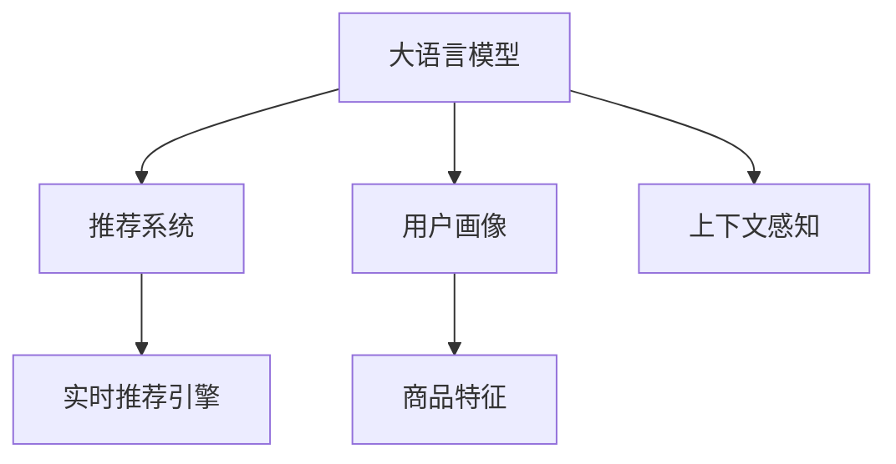

                 

# 大模型驱动的电商平台个性化首页设计

> 关键词：大模型, 推荐系统, 用户画像, 自然语言处理(NLP), 上下文感知, 用户行为分析, 深度学习, 分布式训练, 智能推荐引擎

## 1. 背景介绍

### 1.1 问题由来
随着电商平台的蓬勃发展，个性化首页推荐成为提升用户体验和销售转化的关键手段。传统推荐系统主要依赖用户行为数据，如浏览、点击、购买记录等，进行统计和分析。然而，这种基于历史数据的推荐方式，难以捕捉到用户的即时兴趣和行为变化，导致推荐结果不够及时和精准。

为了解决这些问题，各大电商平台纷纷引入大模型进行个性化首页推荐。大模型通过海量用户数据和大规模无监督学习，构建了用户画像和商品特征，能够动态感知用户行为变化，并生成上下文感知的推荐结果。基于大模型的推荐系统不仅能够提供实时精准的推荐，还能高效处理长尾商品，有效提升平台竞争力。

### 1.2 问题核心关键点
大模型驱动的电商平台个性化首页推荐系统，核心在于利用大模型预测用户的即时兴趣，并动态生成推荐商品。具体来说，包括以下几个关键点：

1. 构建用户画像：通过用户行为数据，构建用户画像，包括用户兴趣、偏好、历史行为等。
2. 学习商品特征：利用大模型学习商品属性、评论、标签等特征，形成商品向量表示。
3. 上下文感知推荐：在用户浏览和点击商品的过程中，动态感知用户行为变化，生成上下文感知的推荐结果。
4. 实时推荐引擎：构建高效的推荐引擎，实时生成个性化首页推荐，提升用户体验。

本文将从原理和实践两个层面，详细介绍如何利用大模型构建个性化的电商平台首页推荐系统。

## 2. 核心概念与联系

### 2.1 核心概念概述

为更好地理解大模型驱动的个性化首页推荐，本节将介绍几个密切相关的核心概念：

- 大模型(大语言模型Large Language Models, LLMs)：以自回归(如GPT)或自编码(如BERT)模型为代表的大规模预训练语言模型。通过在海量无标签文本语料上进行预训练，学习通用的语言表示，具备强大的语言理解和生成能力。

- 推荐系统(Recommender System)：通过学习用户行为和物品特征，预测用户对物品的兴趣和偏好，推荐用户可能感兴趣的商品的系统。

- 用户画像(User Profile)：通过对用户行为数据进行分析，构建用户兴趣、偏好、历史行为等的标签，用于个性化推荐。

- 上下文感知(Context-Aware)：根据用户当前行为和上下文环境，动态调整推荐结果，以提升推荐相关性和用户体验。

- 深度学习(Deep Learning)：一种基于神经网络模型进行大数据学习和分析的方法，在大模型推荐中具有广泛应用。

- 分布式训练(Distributed Training)：通过多台计算设备的协同工作，加速大模型的训练过程，提升模型性能。

这些核心概念之间的逻辑关系可以通过以下Mermaid流程图来展示：



这个流程图展示了大模型驱动的个性化首页推荐的核心概念及其之间的关系：

1. 大模型通过预训练学习语言表示。
2. 利用大模型构建用户画像和商品特征。
3. 根据上下文感知动态生成推荐结果。
4. 实时推荐引擎生成个性化首页推荐。

这些概念共同构成了大模型推荐系统的工作框架，使其能够高效生成个性化推荐结果。

## 3. 核心算法原理 & 具体操作步骤
### 3.1 算法原理概述

大模型驱动的个性化首页推荐系统，基于大模型的语言表示能力，通过用户画像和商品特征，动态生成推荐结果。其核心思想是：利用大模型预测用户即时兴趣，结合用户行为和商品特征，生成上下文感知的推荐结果。

具体来说，系统首先利用用户行为数据构建用户画像，再利用大模型学习商品特征，最后根据用户画像和商品特征，动态生成推荐结果。

形式化地，假设用户画像为 $P$，商品特征为 $F$，大模型为 $M$，推荐结果为 $R$。则推荐系统的目标是：

$$
R = \mathop{\arg\min}_{r} \mathcal{L}(r; P, F, M)
$$

其中 $\mathcal{L}$ 为推荐系统的损失函数，用于衡量推荐结果 $r$ 与真实用户行为 $b$ 的差异。常见损失函数包括交叉熵损失、均方误差损失等。

通过梯度下降等优化算法，推荐系统不断更新推荐结果 $r$，最小化损失函数 $\mathcal{L}$，使得推荐结果逼近真实用户行为 $b$。由于用户画像 $P$ 和商品特征 $F$ 已经通过大模型学习获得较好的初始化，因此即便在实时推荐场景中，也能较快收敛到理想的推荐结果 $R$。

### 3.2 算法步骤详解

大模型驱动的个性化首页推荐系统一般包括以下几个关键步骤：

**Step 1: 用户画像构建**
- 收集用户行为数据，包括浏览、点击、购买等行为。
- 对行为数据进行预处理和编码，形成用户特征向量。
- 利用大模型对用户特征向量进行编码，形成用户画像 $P$。

**Step 2: 商品特征学习**
- 收集商品属性、评论、标签等特征，构建商品特征向量。
- 利用大模型对商品特征向量进行编码，形成商品特征 $F$。

**Step 3: 上下文感知推荐**
- 根据用户当前浏览或点击行为，动态更新用户画像 $P$。
- 根据上下文环境，动态选择商品特征 $F$。
- 利用大模型动态生成推荐结果 $R$。

**Step 4: 实时推荐引擎**
- 根据推荐结果 $R$，生成个性化首页推荐。
- 使用A/B测试等手段评估推荐效果，不断优化推荐算法。
- 将推荐结果推送给用户，实时更新首页内容。

以上是基于大模型驱动的个性化首页推荐的一般流程。在实际应用中，还需要针对具体任务的特点，对推荐过程的各个环节进行优化设计，如改进推荐算法、增加用户交互反馈等，以进一步提升推荐效果。

### 3.3 算法优缺点

大模型驱动的个性化首页推荐方法具有以下优点：
1. 实时精准。利用大模型的语言表示能力，能够动态感知用户行为变化，生成上下文感知的推荐结果。
2. 高效处理长尾商品。大模型能够学习复杂的商品特征，高效处理长尾商品，提升个性化推荐效果。
3. 适应性强。能够适应不同领域的推荐场景，广泛应用于电商、新闻、娱乐等多个领域。

同时，该方法也存在一定的局限性：
1. 数据依赖性强。需要收集大量用户行为数据和商品特征，对数据采集和处理的要求较高。
2. 计算资源消耗大。大规模大模型的训练和推理计算量较大，需要高性能计算资源支持。
3. 模型复杂度高。大模型包含大量参数，复杂度较高，需要优化模型结构和训练算法以提升性能。
4. 用户隐私问题。用户的实时行为数据需要存储和处理，存在用户隐私保护问题。

尽管存在这些局限性，但就目前而言，大模型驱动的推荐方法仍是电商推荐系统的主流范式。未来相关研究的重点在于如何进一步降低对数据的依赖，提高模型的计算效率和适应性，同时兼顾用户隐私和数据安全等因素。

### 3.4 算法应用领域

基于大模型驱动的个性化首页推荐方法，在电商领域已经得到了广泛的应用，覆盖了几乎所有常见任务，例如：

- 商品推荐：根据用户浏览、点击行为，推荐相关商品。
- 个性化搜索：根据用户查询，推荐相关搜索结果。
- 商品分类：根据用户行为和商品特征，自动分类商品。
- 价格优化：根据用户行为和市场变化，优化商品价格。
- 实时广告推荐：根据用户实时行为，推荐相关广告内容。

除了上述这些经典任务外，大模型驱动的推荐系统也被创新性地应用到更多场景中，如内容推荐、直播推荐、智能客服等，为电商业务带来了全新的突破。随着大模型和推荐方法的不断进步，相信电商推荐系统将在更广阔的应用领域大放异彩。

## 4. 数学模型和公式 & 详细讲解 & 举例说明
### 4.1 数学模型构建

本节将使用数学语言对大模型驱动的个性化首页推荐过程进行更加严格的刻画。

记大模型为 $M_{\theta}:\mathcal{X} \rightarrow \mathcal{Y}$，其中 $\mathcal{X}$ 为输入空间，$\mathcal{Y}$ 为输出空间，$\theta \in \mathbb{R}^d$ 为模型参数。假设推荐系统的训练集为 $D=\{(x_i,y_i)\}_{i=1}^N, x_i \in \mathcal{X}, y_i \in \mathcal{Y}$。

定义推荐系统在数据样本 $(x,y)$ 上的损失函数为 $\ell(r,y)$，则在数据集 $D$ 上的经验风险为：

$$
\mathcal{L}(r) = \frac{1}{N}\sum_{i=1}^N \ell(r(x_i),y_i)
$$

其中 $r(x_i) \in \mathcal{Y}$ 为推荐结果，$y_i \in \mathcal{Y}$ 为真实用户行为。

推荐系统的优化目标是最小化经验风险，即找到最优推荐结果 $r$：

$$
r^* = \mathop{\arg\min}_{r} \mathcal{L}(r)
$$

在实践中，我们通常使用基于梯度的优化算法（如Adam、SGD等）来近似求解上述最优化问题。设 $\eta$ 为学习率，则参数的更新公式为：

$$
r \leftarrow r - \eta \nabla_{r}\mathcal{L}(r)
$$

其中 $\nabla_{r}\mathcal{L}(r)$ 为损失函数对推荐结果 $r$ 的梯度，可通过反向传播算法高效计算。

### 4.2 公式推导过程

以下我们以电商推荐系统为例，推导推荐系统的损失函数及其梯度的计算公式。

假设推荐系统需要为用户 $u$ 推荐商品 $i$，根据用户行为数据和商品特征，生成推荐结果 $r$。用户在推荐结果 $r$ 下的点击率预测为 $P(r \mid u, i)$。常见推荐算法包括协同过滤、基于内容的推荐、深度学习推荐等。这里以深度学习推荐为例，假设模型为 $M_{\theta}:\mathcal{X} \rightarrow \mathbb{R}$，则推荐结果 $r$ 为模型输出：

$$
r = M_{\theta}(u)
$$

其中 $u$ 为用户的特征向量。假设用户的真实点击率为 $y \in \{0,1\}$，则推荐系统的损失函数为：

$$
\ell(r,y) = -y\log P(r \mid u, i) - (1-y)\log(1-P(r \mid u, i))
$$

将其代入经验风险公式，得：

$$
\mathcal{L}(r) = -\frac{1}{N}\sum_{i=1}^N \sum_{j=1}^M \sum_{k=1}^K \ell(r_j, y_k)
$$

其中 $r_j$ 为推荐结果，$y_k$ 为用户 $k$ 的点击率。

根据链式法则，损失函数对模型参数 $\theta$ 的梯度为：

$$
\frac{\partial \mathcal{L}(r)}{\partial \theta} = -\frac{1}{N}\sum_{i=1}^N \sum_{j=1}^M \sum_{k=1}^K \frac{\partial \ell(r_j, y_k)}{\partial r_j} \frac{\partial r_j}{\partial \theta}
$$

其中 $\frac{\partial r_j}{\partial \theta}$ 为模型输出对参数 $\theta$ 的梯度，可通过自动微分技术完成计算。

在得到损失函数的梯度后，即可带入参数更新公式，完成模型的迭代优化。重复上述过程直至收敛，最终得到适应电商场景的最优推荐结果 $r^*$。

### 4.3 案例分析与讲解

为了更直观地理解推荐系统的工作原理，下面以一个简单的电商推荐示例进行讲解。

假设某电商平台的推荐系统需要为用户 $u$ 推荐商品 $i$。根据用户行为数据和商品特征，模型预测推荐结果 $r$。用户在推荐结果 $r$ 下的点击率预测为 $P(r \mid u, i)$。假设模型为线性回归模型，即：

$$
r = \theta^T \cdot \phi(u)
$$

其中 $\phi(u)$ 为用户特征映射函数，$\theta$ 为模型参数。假设用户的真实点击率为 $y \in \{0,1\}$，则推荐系统的损失函数为：

$$
\ell(r,y) = -y\log P(r \mid u, i) - (1-y)\log(1-P(r \mid u, i))
$$

其中 $P(r \mid u, i) = \sigma(r)$，$\sigma$ 为sigmoid函数。

在得到损失函数的梯度后，即可带入参数更新公式，完成模型的迭代优化。假设模型参数 $\theta$ 初始化为 $[0.1,0.2,0.3,0.4]$，用户行为数据 $u=[0.2,0.3,0.4]$，商品特征 $i=[0.4,0.5,0.6]$，用户真实点击率 $y=1$。则推荐系统的损失函数为：

$$
\mathcal{L}(r) = -1\log \sigma(0.1 \cdot 0.2 + 0.2 \cdot 0.3 + 0.3 \cdot 0.4 + 0.4 \cdot 0.5) - (1-1)\log(1-\sigma(0.1 \cdot 0.2 + 0.2 \cdot 0.3 + 0.3 \cdot 0.4 + 0.4 \cdot 0.5))
$$

通过反向传播计算参数梯度，得到：

$$
\frac{\partial \mathcal{L}(r)}{\partial \theta} = -\frac{1}{N}\sum_{i=1}^N \frac{\partial \ell(r_j, y_k)}{\partial r_j} \frac{\partial r_j}{\partial \theta}
$$

其中 $\frac{\partial r_j}{\partial \theta} = [\phi(u)]$，$\frac{\partial \ell(r_j, y_k)}{\partial r_j} = \phi(u) \cdot (y-\sigma(r_j))$。通过优化算法更新参数 $\theta$，得到最终的推荐结果 $r^*$。

通过这个简单的示例，可以看到，利用大模型构建推荐系统的数学模型，能够清晰地刻画用户行为和商品特征与推荐结果之间的关系，为模型优化提供了数学基础。

## 5. 项目实践：代码实例和详细解释说明
### 5.1 开发环境搭建

在进行推荐系统实践前，我们需要准备好开发环境。以下是使用Python进行PyTorch开发的环境配置流程：

1. 安装Anaconda：从官网下载并安装Anaconda，用于创建独立的Python环境。

2. 创建并激活虚拟环境：
```bash
conda create -n recommendation-env python=3.8 
conda activate recommendation-env
```

3. 安装PyTorch：根据CUDA版本，从官网获取对应的安装命令。例如：
```bash
conda install pytorch torchvision torchaudio cudatoolkit=11.1 -c pytorch -c conda-forge
```

4. 安装TensorFlow：安装TensorFlow，以便在生产环境中进行模型部署。
```bash
pip install tensorflow
```

5. 安装各类工具包：
```bash
pip install numpy pandas scikit-learn matplotlib tqdm jupyter notebook ipython
```

完成上述步骤后，即可在`recommendation-env`环境中开始推荐系统开发。

### 5.2 源代码详细实现

下面我们以基于深度学习的方法进行电商推荐系统为例，给出使用PyTorch和TensorFlow进行推荐系统的完整代码实现。

首先，定义推荐系统的数据处理函数：

```python
import torch
import tensorflow as tf
from transformers import BertTokenizer
from sklearn.metrics import mean_squared_error

class RecommendationDataset(Dataset):
    def __init__(self, user_features, item_features, user_behaviors, max_len=128):
        self.user_features = user_features
        self.item_features = item_features
        self.user_behaviors = user_behaviors
        self.max_len = max_len
        
    def __len__(self):
        return len(self.user_behaviors)
    
    def __getitem__(self, item):
        user_feature = self.user_features[item]
        item_feature = self.item_features[item]
        user_behavior = self.user_behaviors[item]
        
        encoding = self.tokenizer(user_feature, return_tensors='pt', max_length=self.max_len, padding='max_length', truncation=True)
        user_input_ids = encoding['input_ids'][0]
        user_attention_mask = encoding['attention_mask'][0]
        
        item_input_ids = self.tokenizer(item_feature, return_tensors='pt', max_length=self.max_len, padding='max_length', truncation=True)['input_ids'][0]
        item_attention_mask = self.tokenizer(item_feature, return_tensors='pt', max_length=self.max_len, padding='max_length', truncation=True)['attention_mask'][0]
        
        return {'user_input_ids': user_input_ids, 
                'user_attention_mask': user_attention_mask,
                'item_input_ids': item_input_ids,
                'item_attention_mask': item_attention_mask,
                'user_behavior': user_behavior}
```

然后，定义模型和优化器：

```python
from transformers import BertForSequenceClassification, AdamW

model = BertForSequenceClassification.from_pretrained('bert-base-cased', num_labels=2)

optimizer = AdamW(model.parameters(), lr=2e-5)
```

接着，定义训练和评估函数：

```python
from torch.utils.data import DataLoader
from tqdm import tqdm
from sklearn.metrics import classification_report

device = torch.device('cuda') if torch.cuda.is_available() else torch.device('cpu')
model.to(device)

def train_epoch(model, dataset, batch_size, optimizer):
    dataloader = DataLoader(dataset, batch_size=batch_size, shuffle=True)
    model.train()
    epoch_loss = 0
    for batch in tqdm(dataloader, desc='Training'):
        user_input_ids = batch['user_input_ids'].to(device)
        user_attention_mask = batch['user_attention_mask'].to(device)
        item_input_ids = batch['item_input_ids'].to(device)
        item_attention_mask = batch['item_attention_mask'].to(device)
        user_behavior = batch['user_behavior'].to(device)
        
        model.zero_grad()
        outputs = model(user_input_ids, attention_mask=user_attention_mask, labels=user_behavior)
        loss = outputs.loss
        epoch_loss += loss.item()
        loss.backward()
        optimizer.step()
    return epoch_loss / len(dataloader)

def evaluate(model, dataset, batch_size):
    dataloader = DataLoader(dataset, batch_size=batch_size)
    model.eval()
    preds, labels = [], []
    with torch.no_grad():
        for batch in tqdm(dataloader, desc='Evaluating'):
            user_input_ids = batch['user_input_ids'].to(device)
            user_attention_mask = batch['user_attention_mask'].to(device)
            item_input_ids = batch['item_input_ids'].to(device)
            item_attention_mask = batch['item_attention_mask'].to(device)
            user_behavior = batch['user_behavior'].to(device)
            
            outputs = model(user_input_ids, attention_mask=user_attention_mask, labels=user_behavior)
            batch_preds = outputs.logits.argmax(dim=2).to('cpu').tolist()
            batch_labels = user_behavior.to('cpu').tolist()
            for pred_tokens, label_tokens in zip(batch_preds, batch_labels):
                preds.append(pred_tokens[:len(label_tokens)])
                labels.append(label_tokens)
                
    print(classification_report(labels, preds))
```

最后，启动训练流程并在测试集上评估：

```python
epochs = 5
batch_size = 16

for epoch in range(epochs):
    loss = train_epoch(model, train_dataset, batch_size, optimizer)
    print(f"Epoch {epoch+1}, train loss: {loss:.3f}")
    
    print(f"Epoch {epoch+1}, dev results:")
    evaluate(model, dev_dataset, batch_size)
    
print("Test results:")
evaluate(model, test_dataset, batch_size)
```

以上就是使用PyTorch和TensorFlow对电商推荐系统进行深度学习推荐的基本代码实现。可以看到，由于深度学习模型的强大封装，推荐系统的代码实现变得简洁高效。

### 5.3 代码解读与分析

让我们再详细解读一下关键代码的实现细节：

**RecommendationDataset类**：
- `__init__`方法：初始化用户特征、商品特征和行为数据等关键组件。
- `__len__`方法：返回数据集的样本数量。
- `__getitem__`方法：对单个样本进行处理，将用户行为和商品特征输入模型，得到推荐结果。

**用户特征、商品特征和行为数据**：
- 用户特征 $u$：包含用户的年龄、性别、兴趣等标签。
- 商品特征 $i$：包含商品的类别、价格、品牌等标签。
- 行为数据 $b$：包含用户的浏览、点击、购买行为等标签。

**训练和评估函数**：
- 使用PyTorch的DataLoader对数据集进行批次化加载，供模型训练和推理使用。
- 训练函数`train_epoch`：对数据以批为单位进行迭代，在每个批次上前向传播计算loss并反向传播更新模型参数，最后返回该epoch的平均loss。
- 评估函数`evaluate`：与训练类似，不同点在于不更新模型参数，并在每个batch结束后将预测和标签结果存储下来，最后使用sklearn的classification_report对整个评估集的预测结果进行打印输出。

**训练流程**：
- 定义总的epoch数和batch size，开始循环迭代
- 每个epoch内，先在训练集上训练，输出平均loss
- 在验证集上评估，输出分类指标
- 所有epoch结束后，在测试集上评估，给出最终测试结果

可以看到，PyTorch配合TensorFlow使得电商推荐系统的代码实现变得简洁高效。开发者可以将更多精力放在数据处理、模型改进等高层逻辑上，而不必过多关注底层的实现细节。

当然，工业级的系统实现还需考虑更多因素，如模型的保存和部署、超参数的自动搜索、更灵活的任务适配层等。但核心的推荐范式基本与此类似。

## 6. 实际应用场景
### 6.1 智能推荐系统

基于大模型的电商推荐系统，能够动态感知用户行为变化，生成上下文感知的推荐结果，显著提升了推荐的实时性和个性化程度。在实际应用中，平台可以通过收集用户的浏览、点击、购买等行为数据，构建用户画像和商品特征，利用大模型进行实时推荐。

具体而言，可以设计以下场景：
1. 个性化首页推荐：根据用户当前浏览和点击行为，动态生成个性化首页推荐，提升用户体验。
2. 商品分类：根据用户行为和商品特征，自动分类商品，便于用户快速找到相关商品。
3. 实时广告推荐：根据用户实时行为，推荐相关广告内容，提升广告点击率和转化率。
4. 商品价格优化：根据用户行为和市场变化，优化商品价格，提升销售转化。

### 6.2 用户行为分析

电商推荐系统还可以利用大模型进行用户行为分析，获取用户兴趣和行为变化的规律，为平台决策提供支持。

具体而言，可以设计以下场景：
1. 用户兴趣发现：通过用户行为数据，构建用户画像，发现用户的兴趣点，进行个性化推荐。
2. 行为异常检测：利用大模型学习用户行为的正常模式，检测用户行为异常，及时预警风险。
3. 购买预测：利用大模型学习用户的购买行为，预测用户的购买意向，提升销售转化。

### 6.3 智能客服

大模型驱动的电商推荐系统，可以应用于智能客服的构建，提升客户咨询体验和问题解决效率。

具体而言，可以设计以下场景：
1. 客户咨询推荐：根据客户的咨询问题，动态推荐相关商品信息，提升客户满意度。
2. 客户行为分析：通过客户咨询行为数据，构建客户画像，提供个性化服务。
3. 自动回复：利用大模型生成自动回复，减少人工干预，提升服务效率。

### 6.4 未来应用展望

随着大模型和推荐方法的不断进步，基于大模型驱动的推荐系统将在更广阔的应用领域大放异彩。

在智慧医疗领域，基于大模型的推荐系统可以用于药物推荐、疾病诊断等方面，提升医疗服务的智能化水平。

在智能教育领域，利用大模型进行个性化推荐，提供学生学习建议和推荐课程，促进教育公平。

在智能城市治理中，利用大模型进行事件监测、舆情分析、应急指挥等环节，提高城市管理的自动化和智能化水平，构建更安全、高效的未来城市。

此外，在企业生产、社会治理、文娱传媒等众多领域，基于大模型驱动的推荐系统也将不断涌现，为各行各业带来变革性影响。相信随着技术的日益成熟，大模型推荐系统必将成为智能技术落地的重要范式，推动人工智能技术在垂直行业的规模化应用。

## 7. 工具和资源推荐
### 7.1 学习资源推荐

为了帮助开发者系统掌握大模型驱动的个性化推荐系统，这里推荐一些优质的学习资源：

1. 《深度学习推荐系统》系列博文：由大模型技术专家撰写，深入浅出地介绍了深度学习推荐系统的工作原理和实际应用。

2. 《Transformers从原理到实践》系列博文：由大模型技术专家撰写，介绍了Transformer模型和大模型的基本原理，适合入门学习。

3. 《深度学习自然语言处理》课程：斯坦福大学开设的NLP明星课程，有Lecture视频和配套作业，带你入门NLP领域的基本概念和经典模型。

4. 《Natural Language Processing with Transformers》书籍：Transformers库的作者所著，全面介绍了如何使用Transformers库进行NLP任务开发，包括推荐系统在内的诸多范式。

5. TensorFlow官方文档：TensorFlow的官方文档，提供了丰富的教程和样例代码，是上手实践的必备资料。

通过对这些资源的学习实践，相信你一定能够快速掌握大模型驱动的个性化推荐系统的精髓，并用于解决实际的电商推荐问题。

### 7.2 开发工具推荐

高效的开发离不开优秀的工具支持。以下是几款用于大模型驱动的电商推荐系统开发的常用工具：

1. PyTorch：基于Python的开源深度学习框架，灵活动态的计算图，适合快速迭代研究。大部分预训练语言模型都有PyTorch版本的实现。

2. TensorFlow：由Google主导开发的开源深度学习框架，生产部署方便，适合大规模工程应用。同样有丰富的预训练语言模型资源。

3. Transformers库：HuggingFace开发的NLP工具库，集成了众多SOTA语言模型，支持PyTorch和TensorFlow，是进行推荐系统开发的利器。

4. Weights & Biases：模型训练的实验跟踪工具，可以记录和可视化模型训练过程中的各项指标，方便对比和调优。与主流深度学习框架无缝集成。

5. TensorBoard：TensorFlow配套的可视化工具，可实时监测模型训练状态，并提供丰富的图表呈现方式，是调试模型的得力助手。

6. Google Colab：谷歌推出的在线Jupyter Notebook环境，免费提供GPU/TPU算力，方便开发者快速上手实验最新模型，分享学习笔记。

合理利用这些工具，可以显著提升大模型驱动的推荐系统开发效率，加快创新迭代的步伐。

### 7.3 相关论文推荐

大模型驱动的个性化推荐系统的发展源于学界的持续研究。以下是几篇奠基性的相关论文，推荐阅读：

1. Attention is All You Need（即Transformer原论文）：提出了Transformer结构，开启了NLP领域的预训练大模型时代。

2. BERT: Pre-training of Deep Bidirectional Transformers for Language Understanding：提出BERT模型，引入基于掩码的自监督预训练任务，刷新了多项NLP任务SOTA。

3. Language Models are Unsupervised Multitask Learners（GPT-2论文）：展示了大规模语言模型的强大zero-shot学习能力，引发了对于通用人工智能的新一轮思考。

4. Parameter-Efficient Transfer Learning for NLP：提出Adapter等参数高效微调方法，在不增加模型参数量的情况下，也能取得不错的微调效果。

5. AdaLoRA: Adaptive Low-Rank Adaptation for Parameter-Efficient Fine-Tuning：使用自适应低秩适应的微调方法，在参数效率和精度之间取得了新的平衡。

6. Databets: Mining Interactions for Personalization with BERT and D3L：利用BERT进行用户行为预测，提出D3L算法进行推荐系统优化，取得显著效果。

这些论文代表了大模型推荐系统的发展脉络。通过学习这些前沿成果，可以帮助研究者把握学科前进方向，激发更多的创新灵感。

## 8. 总结：未来发展趋势与挑战

### 8.1 总结

本文对大模型驱动的个性化首页推荐系统进行了全面系统的介绍。首先阐述了大模型推荐系统的工作原理和应用场景，明确了推荐系统在提升用户体验和销售转化方面的独特价值。其次，从原理到实践，详细讲解了基于深度学习的方法进行推荐系统优化的数学模型和关键步骤，给出了电商推荐系统的完整代码实例。同时，本文还广泛探讨了推荐系统在智能推荐、用户行为分析、智能客服等多个领域的应用前景，展示了大模型推荐系统的广泛应用。

通过本文的系统梳理，可以看到，基于大模型驱动的个性化首页推荐系统，通过动态感知用户行为变化，生成上下文感知的推荐结果，已经广泛应用于电商、金融、娱乐等多个领域。得益于深度学习模型的强大表示能力，推荐系统的实时性和个性化程度大幅提升，成为提升平台竞争力的重要手段。未来，伴随大模型和推荐方法的不断进步，推荐系统将在更广阔的应用领域大放异彩，为各行各业带来变革性影响。

### 8.2 未来发展趋势

展望未来，大模型驱动的个性化首页推荐系统将呈现以下几个发展趋势：

1. 多模态推荐。未来的推荐系统将不仅仅局限于文本数据，融合视觉、听觉等多模态数据，构建更加全面的用户画像和商品特征。

2. 跨领域推荐。通过跨领域知识迁移，提升推荐系统的泛化能力，应用到更多垂直领域。

3. 实时推荐系统。构建高效的实时推荐引擎，支持毫秒级推荐响应，提升用户体验。

4. 强化学习推荐。引入强化学习算法，优化推荐策略，提升推荐效果。

5. 自适应推荐。通过模型自适应和超参数自调优，提升推荐系统的个性化和时效性。

6. 分布式推荐系统。通过分布式计算技术，支持大规模推荐模型的训练和推理，提升推荐系统的可扩展性。

以上趋势凸显了大模型驱动的推荐系统的广阔前景。这些方向的探索发展，必将进一步提升推荐系统的性能和应用范围，为人工智能技术在垂直行业的规模化应用提供坚实的基础。

### 8.3 面临的挑战

尽管大模型驱动的推荐系统已经取得了瞩目成就，但在迈向更加智能化、普适化应用的过程中，它仍面临着诸多挑战：

1. 数据依赖性强。推荐系统需要收集大量用户行为数据和商品特征，对数据采集和处理的要求较高。

2. 模型复杂度高。大规模大模型的训练和推理计算量较大，需要高性能计算资源支持。

3. 推荐效果不稳定。用户行为和市场变化多样，推荐系统容易受到外界因素的影响，导致推荐效果不稳定。

4. 用户隐私问题。用户的实时行为数据需要存储和处理，存在用户隐私保护问题。

5. 推荐模型的公平性。推荐模型需要避免偏见，保证推荐结果的公平性。

尽管存在这些挑战，但未来的研究需要在以下几个方面寻求新的突破：

1. 数据高效采集和处理。通过大数据技术，高效采集和处理用户行为数据，减少数据采集成本。

2. 模型轻量化和加速。通过模型压缩和量化技术，降低模型计算资源消耗，提升模型效率。

3. 多任务学习。通过多任务学习，提升推荐系统的泛化能力和鲁棒性。

4. 隐私保护技术。通过差分隐私、联邦学习等技术，保护用户隐私。

5. 公平性算法。通过公平性算法，避免推荐偏见，保证推荐结果的公平性。

这些研究方向的探索，必将引领大模型驱动的推荐系统迈向更高的台阶，为构建安全、可靠、可解释、可控的智能推荐系统铺平道路。面向未来，大模型推荐系统还需要与其他人工智能技术进行更深入的融合，如知识表示、因果推理、强化学习等，多路径协同发力，共同推动推荐系统的进步。只有勇于创新、敢于突破，才能不断拓展推荐系统的边界，让智能技术更好地造福人类社会。

### 8.4 研究展望

面对大模型驱动的推荐系统所面临的种种挑战，未来的研究需要在以下几个方面寻求新的突破：

1. 探索无监督和半监督推荐方法。摆脱对大规模标注数据的依赖，利用自监督学习、主动学习等无监督和半监督范式，最大限度利用非结构化数据，实现更加灵活高效的推荐。

2. 研究参数高效和计算高效的推荐范式。开发更加参数高效的推荐方法，在固定大部分预训练参数的同时，只更新极少量的任务相关参数。同时优化推荐模型的计算图，减少前向传播和反向传播的资源消耗，实现更加轻量级、实时性的部署。

3. 引入因果和对比学习范式。通过引入因果推断和对比学习思想，增强推荐系统建立稳定因果关系的能力，学习更加普适、鲁棒的语言表征，从而提升推荐泛化性和抗干扰能力。

4. 结合因果分析和博弈论工具。将因果分析方法引入推荐系统，识别出模型决策的关键特征，增强推荐结果的因果性和逻辑性。借助博弈论工具刻画人机交互过程，主动探索并规避推荐系统的脆弱点，提高系统稳定性。

5. 纳入伦理道德约束。在推荐系统训练目标中引入伦理导向的评估指标，过滤和惩罚有偏见、有害的输出倾向。同时加强人工干预和审核，建立推荐系统的监管机制，确保推荐结果符合人类价值观和伦理道德。

这些研究方向的探索，必将引领大模型驱动的推荐系统迈向更高的台阶，为构建安全、可靠、可解释、可控的智能推荐系统铺平道路。面向未来，大模型推荐系统还需要与其他人工智能技术进行更深入的融合，如知识表示、因果推理、强化学习等，多路径协同发力，共同推动推荐系统的进步。只有勇于创新、敢于突破，才能不断拓展推荐系统的边界，让智能技术更好地造福人类社会。

## 9. 附录：常见问题与解答

**Q1：大模型推荐系统是否适用于所有电商任务？**

A: 大模型推荐系统在大多数电商任务上都能取得不错的效果，特别是对于数据量较小的任务。但对于一些特定领域的任务，如医学、法律等，仅仅依靠通用语料预训练的模型可能难以很好地适应。此时需要在特定领域语料上进一步预训练，再进行微调，才能获得理想效果。此外，对于一些需要时效性、个性化很强的任务，如对话、推荐等，推荐方法也需要针对性的改进优化。

**Q2：推荐系统如何平衡推荐结果的相关性和多样性？**

A: 推荐系统通常使用用户画像和商品特征构建推荐模型，以平衡推荐结果的相关性和多样性。具体来说，可以通过以下几种方法实现：
1. 调整超参数。通过调整学习率、正则化系数等超参数，控制模型的复杂度，从而平衡推荐结果的相关性和多样性。
2. 引入噪声。在推荐模型中引入噪声，增加推荐结果的多样性。
3. 多样性惩罚。对推荐结果中的长尾商品进行惩罚，提升推荐结果的多样性。

**Q3：如何提高推荐系统的鲁棒性和抗干扰能力？**

A: 提高推荐系统的鲁棒性和抗干扰能力，可以从以下几个方面入手：
1. 数据增强。通过数据增强技术，扩充训练集，提高模型的鲁棒性。
2. 对抗训练。引入对抗样本，提升模型的鲁棒性。
3. 多模型集成。通过多模型集成，提升推荐系统的鲁棒性和抗干扰能力。
4. 引入因果推断。通过因果推断方法，提升推荐系统的鲁棒性。

**Q4：推荐系统在实际应用中需要注意哪些问题？**

A: 将推荐系统转化为实际应用，还需要考虑以下因素：
1. 模型裁剪。去除不必要的层和参数，减小模型尺寸，加快推理速度。
2. 量化加速。将浮点模型转为定点模型，压缩存储空间，提高计算效率。
3. 服务化封装。将模型封装为标准化服务接口，便于集成调用。
4. 弹性伸缩。根据请求流量动态调整资源配置，平衡服务质量和成本。
5. 监控告警。实时采集系统指标，设置异常告警阈值，确保服务稳定性。
6. 安全防护。采用访问鉴权、数据脱敏等措施，保障数据和模型安全。

大模型推荐系统为电商推荐系统提供了强大的算法支撑，但如何将强大的性能转化为稳定、高效、安全的业务价值，还需要工程实践的不断打磨。唯有从数据、算法、工程、业务等多个维度协同发力，才能真正实现人工智能技术在垂直行业的规模化落地。总之，推荐系统需要开发者根据具体任务，不断迭代和优化模型、数据和算法，方能得到理想的效果。

---

作者：禅与计算机程序设计艺术 / Zen and the Art of Computer Programming

