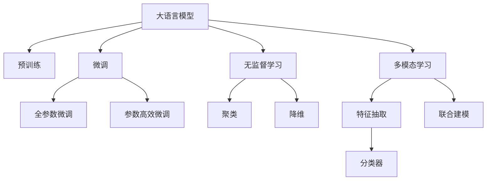

                 

# 大模型驱动的电商平台智能客户分类

> 关键词：大语言模型,电商平台,智能客户分类,迁移学习,无监督学习,多模态学习,深度学习,自然语言处理(NLP),推荐系统,市场细分

## 1. 背景介绍

### 1.1 问题由来
电商平台在面临激烈的市场竞争时，如何细分客户群体，精准定位客户需求，提高客户满意度和转化率，成为了电商平台亟需解决的问题。传统的客户分类方法依赖于问卷调查、购买记录等客户行为数据，数据收集成本高，且无法覆盖所有用户行为。而基于大模型驱动的智能客户分类方法，通过深度学习技术，充分利用了用户在电商平台上的各类行为数据，无需复杂的数据收集和特征工程，显著降低了客户分类的成本和复杂度，成为电商行业应用大模型的一个重要场景。

### 1.2 问题核心关键点
在电商平台，客户分类问题可以表述为从用户行为数据中挖掘出用户属性，将用户划分为不同细分市场。基于大模型的客户分类方法，通过构建和训练模型，自动识别用户属性，将用户自动分配到不同细分市场中。相较于传统方法，基于大模型的客户分类方法具有以下核心关键点：

1. **数据依赖性低**：仅需要用户行为数据，无需额外标注，可适应大规模、高频的客户数据收集和分析需求。
2. **模型通用性高**：模型可以适配多种电商平台的客户分类需求，并可以在新平台上快速迁移应用。
3. **泛化能力强**：模型能从海量用户行为中提取特征，自动适应不同市场环境和用户群体。
4. **实时响应**：模型训练和推理速度快，可以实时处理大量用户行为数据，及时调整客户分类策略。

### 1.3 问题研究意义
基于大模型的客户分类方法，在电商平台的应用研究，对于电商企业运营管理的智能化、个性化、高效化具有重要意义：

1. **提高客户满意度**：通过精准识别客户需求，实现个性化推荐和定制化服务，提升客户满意度和忠诚度。
2. **优化营销策略**：基于细分市场进行精准营销，提高广告投放和推广活动的效果和ROI。
3. **增强市场竞争力**：通过精准细分市场，提升企业对市场的响应速度和运营效率，增强市场竞争力。
4. **降低运营成本**：自动化的客户分类方法减少了人工干预和复杂的数据处理工作，降低了运营成本。
5. **推动智能化转型**：将大模型技术融入电商运营，推动电商企业智能化转型，助力数字化发展。

## 2. 核心概念与联系

### 2.1 核心概念概述

为更好地理解基于大模型的电商平台客户分类方法，本节将介绍几个密切相关的核心概念：

- **大语言模型(Large Language Model, LLM)**：以自回归(如GPT)或自编码(如BERT)模型为代表的大规模预训练语言模型。通过在海量无标签文本数据上进行预训练，学习通用的语言表示，具备强大的语言理解和生成能力。

- **迁移学习(Transfer Learning)**：指将一个领域学习到的知识，迁移应用到另一个不同但相关的领域的学习范式。大模型的预训练-微调过程即是一种典型的迁移学习方式。

- **无监督学习(Unsupervised Learning)**：指从无标签数据中学习规律和模式，使模型获得对数据的自我感知。在大模型客户分类中，通常使用无监督学习从用户行为数据中挖掘出潜在用户属性。

- **多模态学习(Multimodal Learning)**：指模型同时处理多种类型的数据(如文本、图像、音频等)，以更全面地理解用户需求。在电商平台上，客户分类可以结合用户评论、浏览行为、购买记录等多模态数据进行。

- **深度学习(Deep Learning)**：一种通过多层神经网络对数据进行抽象表示和模型训练的机器学习方法。大语言模型和深度学习技术紧密结合，在大模型客户分类中扮演核心角色。

- **自然语言处理(Natural Language Processing, NLP)**：指计算机处理自然语言的技术，涵盖了语言建模、文本分类、机器翻译等多个领域。大语言模型在NLP中广泛应用于文本处理和理解，是客户分类中重要的基础模型。

这些核心概念之间的逻辑关系可以通过以下Mermaid流程图来展示：



这个流程图展示了大模型的核心概念及其之间的关系：

1. 大语言模型通过预训练获得基础能力。
2. 微调是对预训练模型进行任务特定的优化，可以分为全参数微调和参数高效微调（PEFT）。
3. 无监督学习从用户行为数据中挖掘出用户属性。
4. 多模态学习将用户评论、浏览行为、购买记录等多模态数据融合到模型中。
5. 聚类和降维用于特征空间的转换和分析。
6. 分类器用于最终的用户属性分类。

## 3. 核心算法原理 & 具体操作步骤
### 3.1 算法原理概述

基于大模型的电商平台智能客户分类，本质上是一种基于监督学习的迁移学习方法。其核心思想是：利用大模型在预训练数据上学习到的通用特征，通过在客户行为数据上进行有监督的微调，使得模型能够自动识别用户属性，并将用户分配到不同的细分市场。

形式化地，假设大语言模型为 $M_{\theta}$，其中 $\theta$ 为预训练得到的模型参数。给定客户行为数据集 $D=\{(x_i, y_i)\}_{i=1}^N$，每个样本 $x_i$ 表示客户行为特征，$y_i$ 表示客户属性标签。微调的目标是找到新的模型参数 $\hat{\theta}$，使得：

$$
\hat{\theta}=\mathop{\arg\min}_{\theta} \mathcal{L}(M_{\theta},D)
$$

其中 $\mathcal{L}$ 为针对客户分类任务设计的损失函数，用于衡量模型预测输出与真实标签之间的差异。常见的损失函数包括交叉熵损失、均方误差损失等。

通过梯度下降等优化算法，微调过程不断更新模型参数 $\theta$，最小化损失函数 $\mathcal{L}$，使得模型输出逼近真实标签。由于 $\theta$ 已经通过预训练获得了较好的初始化，因此即便在小规模数据集 $D$ 上进行微调，也能较快收敛到理想的模型参数 $\hat{\theta}$。

### 3.2 算法步骤详解

基于大模型的电商平台智能客户分类方法，通常包括以下几个关键步骤：

**Step 1: 准备预训练模型和数据集**
- 选择合适的预训练语言模型 $M_{\theta}$ 作为初始化参数，如 BERT、GPT 等。
- 收集客户行为数据集 $D$，包括用户浏览、点击、购买、评价等行为数据。

**Step 2: 添加任务适配层**
- 根据客户分类任务类型，在预训练模型顶层设计合适的输出层和损失函数。
- 对于分类任务，通常在顶层添加线性分类器和交叉熵损失函数。
- 对于聚类任务，通常使用聚类损失函数，如K-means聚类损失。

**Step 3: 设置微调超参数**
- 选择合适的优化算法及其参数，如 AdamW、SGD 等，设置学习率、批大小、迭代轮数等。
- 设置正则化技术及强度，包括权重衰减、Dropout、Early Stopping等。
- 确定冻结预训练参数的策略，如仅微调顶层，或全部参数都参与微调。

**Step 4: 执行梯度训练**
- 将客户行为数据集 $D$ 分批次输入模型，前向传播计算损失函数。
- 反向传播计算参数梯度，根据设定的优化算法和学习率更新模型参数。
- 周期性在验证集上评估模型性能，根据性能指标决定是否触发 Early Stopping。
- 重复上述步骤直到满足预设的迭代轮数或 Early Stopping 条件。

**Step 5: 测试和部署**
- 在测试集上评估微调后模型 $M_{\hat{\theta}}$ 的性能，对比微调前后的精度提升。
- 使用微调后的模型对新客户行为数据进行推理预测，集成到实际的应用系统中。
- 持续收集新的客户行为数据，定期重新微调模型，以适应数据分布的变化。

以上是基于大模型的客户分类的一般流程。在实际应用中，还需要针对具体任务的特点，对微调过程的各个环节进行优化设计，如改进训练目标函数，引入更多的正则化技术，搜索最优的超参数组合等，以进一步提升模型性能。

### 3.3 算法优缺点

基于大模型的电商平台智能客户分类方法具有以下优点：
1. **数据依赖性低**：仅需要客户行为数据，无需额外标注，可适应大规模、高频的客户数据收集和分析需求。
2. **模型通用性高**：模型可以适配多种电商平台的客户分类需求，并可以在新平台上快速迁移应用。
3. **泛化能力强**：模型能从海量客户行为中提取特征，自动适应不同市场环境和用户群体。
4. **实时响应**：模型训练和推理速度快，可以实时处理大量客户行为数据，及时调整客户分类策略。

同时，该方法也存在一定的局限性：
1. **标注成本高**：虽然标注成本较低，但在某些特定任务中，如新用户分类，仍需标注部分样本，增加了标注成本。
2. **模型复杂度高**：大语言模型通常参数量庞大，增加了模型训练和推理的复杂度。
3. **数据隐私问题**：客户行为数据涉及用户隐私，需严格遵守数据隐私法规，确保数据安全。
4. **模型解释性不足**：大模型通常是一个"黑盒"系统，难以解释其内部工作机制和决策逻辑。

尽管存在这些局限性，但就目前而言，基于大模型的客户分类方法仍然是大数据时代电商平台客户细分的重要手段。未来相关研究的重点在于如何进一步降低客户分类的成本和复杂度，提高模型的可解释性和应用效果。

### 3.4 算法应用领域

基于大模型的客户分类方法，已经在电商平台得到了广泛的应用，覆盖了客户细分、推荐系统、个性化营销等多个领域，如：

- 客户行为分类：将客户行为数据分为不同的用户属性类别，如购买频率、浏览时长、点击转化率等。
- 用户画像构建：基于客户行为数据，构建用户画像，提供更加个性化和精准的营销服务。
- 新用户分析：对新用户进行分类，识别潜在高价值用户，提供专属推荐和促销策略。
- 个性化推荐：通过客户分类，实现更加精准和多样化的推荐内容，提升用户满意度。
- 风险控制：识别高风险用户，进行风险预警和控制，保障交易安全。

除了上述这些经典应用外，大语言模型客户分类技术还在新用户标签、行为预测、客户流失分析等多个领域展现出了广泛的应用潜力。

## 4. 数学模型和公式 & 详细讲解  
### 4.1 数学模型构建

本节将使用数学语言对基于大模型的电商平台客户分类过程进行更加严格的刻画。

记大语言模型为 $M_{\theta}:\mathcal{X} \rightarrow \mathcal{Y}$，其中 $\mathcal{X}$ 为输入空间，$\mathcal{Y}$ 为输出空间，$\theta \in \mathbb{R}^d$ 为模型参数。假设客户行为数据集为 $D=\{(x_i, y_i)\}_{i=1}^N, x_i \in \mathcal{X}, y_i \in \mathcal{Y}$。

定义模型 $M_{\theta}$ 在数据样本 $(x,y)$ 上的损失函数为 $\ell(M_{\theta}(x),y)$，则在数据集 $D$ 上的经验风险为：

$$
\mathcal{L}(\theta) = \frac{1}{N} \sum_{i=1}^N \ell(M_{\theta}(x_i),y_i)
$$

微调的优化目标是最小化经验风险，即找到最优参数：

$$
\theta^* = \mathop{\arg\min}_{\theta} \mathcal{L}(\theta)
$$

在实践中，我们通常使用基于梯度的优化算法（如SGD、Adam等）来近似求解上述最优化问题。设 $\eta$ 为学习率，$\lambda$ 为正则化系数，则参数的更新公式为：

$$
\theta \leftarrow \theta - \eta \nabla_{\theta}\mathcal{L}(\theta) - \eta\lambda\theta
$$

其中 $\nabla_{\theta}\mathcal{L}(\theta)$ 为损失函数对参数 $\theta$ 的梯度，可通过反向传播算法高效计算。

### 4.2 公式推导过程

以下我们以二分类任务为例，推导交叉熵损失函数及其梯度的计算公式。

假设模型 $M_{\theta}$ 在输入 $x$ 上的输出为 $\hat{y}=M_{\theta}(x) \in [0,1]$，表示样本属于正类的概率。真实标签 $y \in \{0,1\}$。则二分类交叉熵损失函数定义为：

$$
\ell(M_{\theta}(x),y) = -[y\log \hat{y} + (1-y)\log (1-\hat{y})]
$$

将其代入经验风险公式，得：

$$
\mathcal{L}(\theta) = -\frac{1}{N}\sum_{i=1}^N [y_i\log M_{\theta}(x_i)+(1-y_i)\log(1-M_{\theta}(x_i))]
$$

根据链式法则，损失函数对参数 $\theta_k$ 的梯度为：

$$
\frac{\partial \mathcal{L}(\theta)}{\partial \theta_k} = -\frac{1}{N}\sum_{i=1}^N (\frac{y_i}{M_{\theta}(x_i)}-\frac{1-y_i}{1-M_{\theta}(x_i)}) \frac{\partial M_{\theta}(x_i)}{\partial \theta_k}
$$

其中 $\frac{\partial M_{\theta}(x_i)}{\partial \theta_k}$ 可进一步递归展开，利用自动微分技术完成计算。

在得到损失函数的梯度后，即可带入参数更新公式，完成模型的迭代优化。重复上述过程直至收敛，最终得到适应客户分类任务的最优模型参数 $\theta^*$。

## 5. 项目实践：代码实例和详细解释说明
### 5.1 开发环境搭建

在进行客户分类实践前，我们需要准备好开发环境。以下是使用Python进行PyTorch开发的环境配置流程：

1. 安装Anaconda：从官网下载并安装Anaconda，用于创建独立的Python环境。

2. 创建并激活虚拟环境：
```bash
conda create -n pytorch-env python=3.8 
conda activate pytorch-env
```

3. 安装PyTorch：根据CUDA版本，从官网获取对应的安装命令。例如：
```bash
conda install pytorch torchvision torchaudio cudatoolkit=11.1 -c pytorch -c conda-forge
```

4. 安装Transformers库：
```bash
pip install transformers
```

5. 安装各类工具包：
```bash
pip install numpy pandas scikit-learn matplotlib tqdm jupyter notebook ipython
```

完成上述步骤后，即可在`pytorch-env`环境中开始客户分类实践。

### 5.2 源代码详细实现

这里我们以电商平台客户分类为例，给出使用Transformers库对BERT模型进行客户分类的PyTorch代码实现。

首先，定义客户分类的数据处理函数：

```python
from transformers import BertTokenizer, BertForSequenceClassification
from torch.utils.data import Dataset
import torch

class CustomerDataset(Dataset):
    def __init__(self, texts, labels, tokenizer, max_len=128):
        self.texts = texts
        self.labels = labels
        self.tokenizer = tokenizer
        self.max_len = max_len
        
    def __len__(self):
        return len(self.texts)
    
    def __getitem__(self, item):
        text = self.texts[item]
        label = self.labels[item]
        
        encoding = self.tokenizer(text, return_tensors='pt', max_length=self.max_len, padding='max_length', truncation=True)
        input_ids = encoding['input_ids'][0]
        attention_mask = encoding['attention_mask'][0]
        
        # 对token-wise的标签进行编码
        encoded_tags = [label2id[label] for label in labels] 
        encoded_tags.extend([label2id['O']] * (self.max_len - len(encoded_tags)))
        labels = torch.tensor(encoded_tags, dtype=torch.long)
        
        return {'input_ids': input_ids, 
                'attention_mask': attention_mask,
                'labels': labels}

# 标签与id的映射
label2id = {'O': 0, 'Buyer': 1, 'Seller': 2, 'ProductCreator': 3}
id2label = {v: k for k, v in label2id.items()}

# 创建dataset
tokenizer = BertTokenizer.from_pretrained('bert-base-cased')

train_dataset = CustomerDataset(train_texts, train_labels, tokenizer)
dev_dataset = CustomerDataset(dev_texts, dev_labels, tokenizer)
test_dataset = CustomerDataset(test_texts, test_labels, tokenizer)
```

然后，定义模型和优化器：

```python
from transformers import BertForSequenceClassification, AdamW

model = BertForSequenceClassification.from_pretrained('bert-base-cased', num_labels=len(label2id))

optimizer = AdamW(model.parameters(), lr=2e-5)
```

接着，定义训练和评估函数：

```python
from torch.utils.data import DataLoader
from tqdm import tqdm
from sklearn.metrics import classification_report

device = torch.device('cuda') if torch.cuda.is_available() else torch.device('cpu')
model.to(device)

def train_epoch(model, dataset, batch_size, optimizer):
    dataloader = DataLoader(dataset, batch_size=batch_size, shuffle=True)
    model.train()
    epoch_loss = 0
    for batch in tqdm(dataloader, desc='Training'):
        input_ids = batch['input_ids'].to(device)
        attention_mask = batch['attention_mask'].to(device)
        labels = batch['labels'].to(device)
        model.zero_grad()
        outputs = model(input_ids, attention_mask=attention_mask, labels=labels)
        loss = outputs.loss
        epoch_loss += loss.item()
        loss.backward()
        optimizer.step()
    return epoch_loss / len(dataloader)

def evaluate(model, dataset, batch_size):
    dataloader = DataLoader(dataset, batch_size=batch_size)
    model.eval()
    preds, labels = [], []
    with torch.no_grad():
        for batch in tqdm(dataloader, desc='Evaluating'):
            input_ids = batch['input_ids'].to(device)
            attention_mask = batch['attention_mask'].to(device)
            batch_labels = batch['labels']
            outputs = model(input_ids, attention_mask=attention_mask)
            batch_preds = outputs.logits.argmax(dim=2).to('cpu').tolist()
            batch_labels = batch_labels.to('cpu').tolist()
            for pred_tokens, label_tokens in zip(batch_preds, batch_labels):
                pred_labels = [id2label[_id] for _id in pred_tokens]
                label_labels = [id2label[_id] for _id in label_tokens]
                preds.append(pred_labels[:len(label_labels)])
                labels.append(label_labels)
                
    print(classification_report(labels, preds))
```

最后，启动训练流程并在测试集上评估：

```python
epochs = 5
batch_size = 16

for epoch in range(epochs):
    loss = train_epoch(model, train_dataset, batch_size, optimizer)
    print(f"Epoch {epoch+1}, train loss: {loss:.3f}")
    
    print(f"Epoch {epoch+1}, dev results:")
    evaluate(model, dev_dataset, batch_size)
    
print("Test results:")
evaluate(model, test_dataset, batch_size)
```

以上就是使用PyTorch对BERT进行客户分类任务开发的完整代码实现。可以看到，得益于Transformers库的强大封装，我们可以用相对简洁的代码完成BERT模型的加载和微调。

### 5.3 代码解读与分析

让我们再详细解读一下关键代码的实现细节：

**CustomerDataset类**：
- `__init__`方法：初始化文本、标签、分词器等关键组件。
- `__len__`方法：返回数据集的样本数量。
- `__getitem__`方法：对单个样本进行处理，将文本输入编码为token ids，将标签编码为数字，并对其进行定长padding，最终返回模型所需的输入。

**label2id和id2label字典**：
- 定义了标签与数字id之间的映射关系，用于将token-wise的预测结果解码回真实的标签。

**训练和评估函数**：
- 使用PyTorch的DataLoader对数据集进行批次化加载，供模型训练和推理使用。
- 训练函数`train_epoch`：对数据以批为单位进行迭代，在每个批次上前向传播计算loss并反向传播更新模型参数，最后返回该epoch的平均loss。
- 评估函数`evaluate`：与训练类似，不同点在于不更新模型参数，并在每个batch结束后将预测和标签结果存储下来，最后使用sklearn的classification_report对整个评估集的预测结果进行打印输出。

**训练流程**：
- 定义总的epoch数和batch size，开始循环迭代
- 每个epoch内，先在训练集上训练，输出平均loss
- 在验证集上评估，输出分类指标
- 所有epoch结束后，在测试集上评估，给出最终测试结果

可以看到，PyTorch配合Transformers库使得BERT微调的代码实现变得简洁高效。开发者可以将更多精力放在数据处理、模型改进等高层逻辑上，而不必过多关注底层的实现细节。

当然，工业级的系统实现还需考虑更多因素，如模型的保存和部署、超参数的自动搜索、更灵活的任务适配层等。但核心的微调范式基本与此类似。

## 6. 实际应用场景
### 6.1 智能客服系统

基于大模型驱动的电商平台智能客户分类方法，可以广泛应用于智能客服系统的构建。传统客服往往需要配备大量人力，高峰期响应缓慢，且一致性和专业性难以保证。而使用客户分类模型，可以7x24小时不间断服务，快速响应客户咨询，用自然流畅的语言解答各类常见问题。

在技术实现上，可以收集企业内部的历史客服对话记录，将问题和最佳答复构建成监督数据，在此基础上对预训练客户分类模型进行微调。微调后的客户分类模型能够自动理解客户意图，匹配最合适的答复。对于客户提出的新问题，还可以接入检索系统实时搜索相关内容，动态组织生成回答。如此构建的智能客服系统，能大幅提升客户咨询体验和问题解决效率。

### 6.2 个性化推荐系统

当前的推荐系统往往只依赖用户的历史行为数据进行物品推荐，无法深入理解用户的真实兴趣偏好。基于大模型驱动的客户分类方法，个性化推荐系统可以更好地挖掘用户行为背后的语义信息，从而提供更精准、多样的推荐内容。

在实践中，可以收集用户浏览、点击、评论、分享等行为数据，提取和用户交互的物品标题、描述、标签等文本内容。将文本内容作为模型输入，用户的后续行为（如是否点击、购买等）作为监督信号，在此基础上微调预训练语言模型。微调后的模型能够从文本内容中准确把握用户的兴趣点。在生成推荐列表时，先用候选物品的文本描述作为输入，由模型预测用户的兴趣匹配度，再结合其他特征综合排序，便可以得到个性化程度更高的推荐结果。

### 6.3 客户细分与精准营销

基于大模型的电商平台智能客户分类方法，可以实时监控客户行为数据，自动分类客户，识别出不同细分市场，并进行精准营销。例如，对于新客户，可以使用无监督学习的方法，将新客户分为潜在高价值客户和一般客户，针对高价值客户进行重点推广和个性化服务，提升客户转化率和客户满意度。

在客户分类的基础上，可以构建更加精准的营销策略，如针对不同客户群体定制个性化的广告内容，使用推送邮件、短信等方式，将精准的营销信息推送给目标客户，提升营销效果。

### 6.4 未来应用展望

随着大模型和微调方法的不断发展，基于微调范式将在更多领域得到应用，为传统行业带来变革性影响。

在智慧医疗领域，基于微调的客户分类方法，可以应用于病患分类、治疗方案推荐、健康监测等方面，提高医疗服务的智能化水平，辅助医生诊疗，加速新药开发进程。

在智能教育领域，微调技术可应用于学生分类、教学资源推荐、学习行为分析等方面，因材施教，促进教育公平，提高教学质量。

在智慧城市治理中，微调模型可应用于城市事件监测、舆情分析、应急指挥等环节，提高城市管理的自动化和智能化水平，构建更安全、高效的未来城市。

此外，在企业生产、社会治理、文娱传媒等众多领域，基于大模型微调的人工智能应用也将不断涌现，为经济社会发展注入新的动力。相信随着技术的日益成熟，微调方法将成为人工智能落地应用的重要范式，推动人工智能技术在垂直行业的规模化落地。

## 7. 工具和资源推荐
### 7.1 学习资源推荐

为了帮助开发者系统掌握大模型驱动的客户分类方法的理论基础和实践技巧，这里推荐一些优质的学习资源：

1. 《Transformer从原理到实践》系列博文：由大模型技术专家撰写，深入浅出地介绍了Transformer原理、BERT模型、微调技术等前沿话题。

2. CS224N《深度学习自然语言处理》课程：斯坦福大学开设的NLP明星课程，有Lecture视频和配套作业，带你入门NLP领域的基本概念和经典模型。

3. 《Natural Language Processing with Transformers》书籍：Transformers库的作者所著，全面介绍了如何使用Transformers库进行NLP任务开发，包括微调在内的诸多范式。

4. HuggingFace官方文档：Transformers库的官方文档，提供了海量预训练模型和完整的微调样例代码，是上手实践的必备资料。

5. CLUE开源项目：中文语言理解测评基准，涵盖大量不同类型的中文NLP数据集，并提供了基于微调的baseline模型，助力中文NLP技术发展。

通过对这些资源的学习实践，相信你一定能够快速掌握大模型驱动的客户分类方法，并用于解决实际的NLP问题。
###  7.2 开发工具推荐

高效的开发离不开优秀的工具支持。以下是几款用于大模型驱动的客户分类开发的常用工具：

1. PyTorch：基于Python的开源深度学习框架，灵活动态的计算图，适合快速迭代研究。大部分预训练语言模型都有PyTorch版本的实现。

2. TensorFlow：由Google主导开发的开源深度学习框架，生产部署方便，适合大规模工程应用。同样有丰富的预训练语言模型资源。

3. Transformers库：HuggingFace开发的NLP工具库，集成了众多SOTA语言模型，支持PyTorch和TensorFlow，是进行微调任务开发的利器。

4. Weights & Biases：模型训练的实验跟踪工具，可以记录和可视化模型训练过程中的各项指标，方便对比和调优。与主流深度学习框架无缝集成。

5. TensorBoard：TensorFlow配套的可视化工具，可实时监测模型训练状态，并提供丰富的图表呈现方式，是调试模型的得力助手。

6. Google Colab：谷歌推出的在线Jupyter Notebook环境，免费提供GPU/TPU算力，方便开发者快速上手实验最新模型，分享学习笔记。

合理利用这些工具，可以显著提升大模型驱动的客户分类任务的开发效率，加快创新迭代的步伐。

### 7.3 相关论文推荐

大语言模型和微调技术的发展源于学界的持续研究。以下是几篇奠基性的相关论文，推荐阅读：

1. Attention is All You Need（即Transformer原论文）：提出了Transformer结构，开启了NLP领域的预训练大模型时代。

2. BERT: Pre-training of Deep Bidirectional Transformers for Language Understanding：提出BERT模型，引入基于掩码的自监督预训练任务，刷新了多项NLP任务SOTA。

3. Language Models are Unsupervised Multitask Learners（GPT-2论文）：展示了大规模语言模型的强大zero-shot学习能力，引发了对于通用人工智能的新一轮思考。

4. Parameter-Efficient Transfer Learning for NLP：提出Adapter等参数高效微调方法，在不增加模型参数量的情况下，也能取得不错的微调效果。

5. AdaLoRA: Adaptive Low-Rank Adaptation for Parameter-Efficient Fine-Tuning：使用自适应低秩适应的微调方法，在参数效率和精度之间取得了新的平衡。

这些论文代表了大模型驱动的客户分类方法的发展脉络。通过学习这些前沿成果，可以帮助研究者把握学科前进方向，激发更多的创新灵感。

## 8. 总结：未来发展趋势与挑战

### 8.1 总结

本文对基于大模型的电商平台智能客户分类方法进行了全面系统的介绍。首先阐述了大语言模型和微调技术的研究背景和意义，明确了微调在拓展预训练模型应用、提升下游任务性能方面的独特价值。其次，从原理到实践，详细讲解了基于大模型的客户分类数学原理和关键步骤，给出了客户分类任务开发的完整代码实例。同时，本文还广泛探讨了基于大模型的客户分类方法在智能客服、个性化推荐、客户细分等电商领域的应用前景，展示了微调范式的巨大潜力。

通过本文的系统梳理，可以看到，基于大模型的客户分类方法正在成为电商平台客户细分的重要手段，极大地拓展了预训练语言模型的应用边界，催生了更多的落地场景。受益于大规模语料的预训练，微调模型以更低的时间和标注成本，在小样本条件下也能取得不俗的效果，有力推动了电商平台智能化转型。未来，伴随预训练语言模型和微调方法的持续演进，相信客户分类技术将在更广阔的应用领域大放异彩，深刻影响人类的生产生活方式。

### 8.2 未来发展趋势

展望未来，大模型驱动的客户分类方法将呈现以下几个发展趋势：

1. **模型规模持续增大**：随着算力成本的下降和数据规模的扩张，预训练语言模型的参数量还将持续增长。超大规模语言模型蕴含的丰富语言知识，有望支撑更加复杂多变的客户分类任务。

2. **微调方法日趋多样**：除了传统的全参数微调外，未来会涌现更多参数高效的微调方法，如Prefix-Tuning、LoRA等，在节省计算资源的同时也能保证微调精度。

3. **持续学习成为常态**：随着数据分布的不断变化，微调模型也需要持续学习新知识以保持性能。如何在不遗忘原有知识的同时，高效吸收新样本信息，将成为重要的研究课题。

4. **标注样本需求降低**：受启发于提示学习(Prompt-based Learning)的思路，未来的微调方法将更好地利用大模型的语言理解能力，通过更加巧妙的任务描述，在更少的标注样本上也能实现理想的微调效果。

5. **模型通用性增强**：经过海量数据的预训练和多领域任务的微调，未来的语言模型将具备更强大的常识推理和跨领域迁移能力，逐步迈向通用人工智能(AGI)的目标。

以上趋势凸显了大模型驱动的客户分类方法的广阔前景。这些方向的探索发展，必将进一步提升客户分类的性能和应用范围，为电商企业运营管理的智能化、个性化、高效化提供强有力的支持。

### 8.3 面临的挑战

尽管基于大模型的客户分类方法已经取得了瞩目成就，但在迈向更加智能化、普适化应用的过程中，它仍面临着诸多挑战：

1. **数据隐私问题**：客户行为数据涉及用户隐私，需严格遵守数据隐私法规，确保数据安全。

2. **模型复杂度高**：大语言模型通常参数量庞大，增加了模型训练和推理的复杂度。

3. **标注成本高**：虽然标注成本较低，但在某些特定任务中，如新客户分类，仍需标注部分样本，增加了标注成本。

4. **模型鲁棒性不足**：当前微调模型面对域外数据时，泛化性能往往大打折扣。对于测试样本的微小扰动，微调模型的预测也容易发生波动。

5. **模型解释性不足**：大模型通常是一个"黑盒"系统，难以解释其内部工作机制和决策逻辑。

尽管存在这些局限性，但就目前而言，基于大模型的客户分类方法仍然是电商平台客户细分的重要手段。未来相关研究的重点在于如何进一步降低客户分类的成本和复杂度，提高模型的可解释性和应用效果。

### 8.4 研究展望

面对大模型驱动的客户分类所面临的挑战，未来的研究需要在以下几个方面寻求新的突破：

1. **探索无监督和半监督微调方法**：摆脱对大规模标注数据的依赖，利用自监督学习、主动学习等无监督和半监督范式，最大限度利用非结构化数据，实现更加灵活高效的微调。

2. **研究参数高效和计算高效的微调范式**：开发更加参数高效的微调方法，在固定大部分预训练参数的同时，只更新极少量的任务相关参数。同时优化微调模型的计算图，减少前向传播和反向传播的资源消耗，实现更加轻量级、实时性的部署。

3. **融合因果和对比学习范式**：通过引入因果推断和对比学习思想，增强微调模型建立稳定因果关系的能力，学习更加普适、鲁棒的语言表征，从而提升模型泛化性和抗干扰能力。

4. **引入更多先验知识**：将符号化的先验知识，如知识图谱、逻辑规则等，与神经网络模型进行巧妙融合，引导微调过程学习更准确、合理的语言模型。同时加强不同模态数据的整合，实现视觉、语音等多模态信息与文本信息的协同建模。

5. **结合因果分析和博弈论工具**：将因果分析方法引入微调模型，识别出模型决策的关键特征，增强输出解释的因果性和逻辑性。借助博弈论工具刻画人机交互过程，主动探索并规避模型的脆弱点，提高系统稳定性。

6. **纳入伦理道德约束**：在模型训练目标中引入伦理导向的评估指标，过滤和惩罚有偏见、有害的输出倾向。同时加强人工干预和审核，建立模型行为的监管机制，确保输出符合人类价值观和伦理道德。

这些研究方向的探索，必将引领大语言模型驱动的客户分类技术迈向更高的台阶，为构建安全、可靠、可解释、可控的智能系统铺平道路。面向未来，大语言模型驱动的客户分类技术还需要与其他人工智能技术进行更深入的融合，如知识表示、因果推理、强化学习等，多路径协同发力，共同推动自然语言理解和智能交互系统的进步。只有勇于创新、敢于突破，才能不断拓展语言模型的边界，让智能技术更好地造福人类社会。

## 9. 附录：常见问题与解答

**Q1：大语言模型驱动的客户分类方法是否适用于所有电商场景？**

A: 大语言模型驱动的客户分类方法适用于大多数电商场景，尤其是用户行为数据较易获取的场景。对于数据难以收集的冷门小众市场，可能效果有限。

**Q2：如何提高大模型驱动的客户分类模型的泛化能力？**

A: 提高泛化能力的方法包括：
1. 增加数据量和数据多样性，覆盖更多用户行为模式。
2. 使用对抗训练和正则化技术，增强模型的鲁棒性。
3. 引入多种预训练任务和多模态数据，丰富模型的知识库。
4. 使用复杂的分层结构，增强模型表达能力。

**Q3：如何平衡模型复杂度和性能？**

A: 平衡模型复杂度和性能的方法包括：
1. 使用参数高效微调方法，只更新关键参数，保持模型轻量化。
2. 采用模块化设计，分割模型，减少冗余计算。
3. 使用分布式训练和推理，提高计算效率。
4. 定期优化模型结构，去除冗余参数和层。

**Q4：如何降低客户分类的成本？**

A: 降低客户分类成本的方法包括：
1. 利用无监督学习方法，如自编码器，从用户行为数据中挖掘出潜在属性。
2. 使用迁移学习，利用预训练模型进行特征提取，减少训练时间。
3. 采用小样本学习，在少量标注数据上也能取得不错的效果。
4. 优化数据预处理流程，提高数据质量和效率。

**Q5：如何保证模型输出结果的可解释性？**

A: 保证模型输出结果可解释性的方法包括：
1. 使用可解释性模型，如LIME、SHAP等，生成特征重要性解释。
2. 在训练过程中加入可解释性约束，如Robustness Attention。
3. 使用可视化工具，展示模型推理过程和中间结果。
4. 构建规则和规则库，结合人工干预，增强模型决策的透明性。

这些方法可以帮助开发者在客户分类中构建更加可解释、可信任的智能模型。在客户分类的实际应用中，需要根据具体需求，选择合适的方法来保证模型的可解释性。

---

作者：禅与计算机程序设计艺术 / Zen and the Art of Computer Programming

