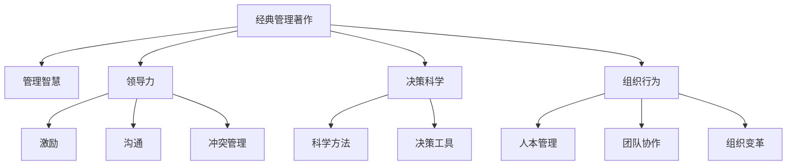

                 

# 如何从经典著作中提炼管理智慧

> 关键词：管理智慧,经典著作,领导力,决策科学,组织行为

## 1. 背景介绍

### 1.1 问题由来
在快速变化和高度不确定性的现代商业环境中，管理智慧的重要性日益凸显。随着全球化和科技的进步，企业面对的竞争压力越来越大，如何有效应对这些挑战，成为管理者和企业家的首要任务。而经典管理著作作为前人实践与智慧的结晶，提供了丰富的洞见和策略。如何从这些经典著作中提炼管理智慧，应用到当下环境，是每位管理者都需要思考的问题。

### 1.2 问题核心关键点
经典管理著作涉及领导力、决策科学、组织行为、创新管理等多个领域，提炼其管理智慧需要对核心概念、理论框架、案例分析等进行深入理解。关键点包括：
- 如何理解并应用管理理论，解决实际问题。
- 如何将理论知识与具体实践相结合，提升管理效能。
- 如何快速把握经典著作的精髓，从中获得启示。

## 2. 核心概念与联系

### 2.1 核心概念概述

为了更好地理解如何从经典著作中提炼管理智慧，我们需要明确几个核心概念：

- **经典管理著作**：指那些具有深远影响的管理著作，如彼得·德鲁克的《管理的实践》、亨利·明茨伯格的《管理者》、迈克尔·波特的《竞争战略》等。
- **管理智慧**：指在管理实践中积累下来的智慧、经验和教训，是管理者解决问题、推动组织发展的能力。
- **领导力**：指能够激励和引导他人为实现共同目标而努力的能力，是管理者必须具备的核心素质。
- **决策科学**：通过科学方法和工具，使决策过程更为准确、合理和有效。
- **组织行为**：研究组织中人的行为及其对组织的影响，涉及激励、沟通、冲突管理等。

这些核心概念之间的逻辑关系可以通过以下Mermaid流程图来展示：



这个流程图展示了经典管理著作与领导力、决策科学、组织行为等概念的联系，以及如何通过这些智慧提升管理效能。

## 3. 核心算法原理 & 具体操作步骤
### 3.1 算法原理概述

从经典著作中提炼管理智慧，本质上是将理论与实践相结合的过程。其核心思想是通过系统性阅读和管理知识库，将理论知识应用于实际情境，提升管理效能。

### 3.2 算法步骤详解

以下详细介绍从经典著作中提炼管理智慧的具体操作步骤：

**Step 1: 系统性阅读管理著作**
- 选择经典著作：如彼得·德鲁克的《管理的实践》、迈克尔·波特的《竞争战略》等。
- 确定阅读目标：明确需要解决的问题或改进的领域。
- 制定阅读计划：分阶段、分模块进行深入阅读，注意笔记和理解。

**Step 2: 建立知识框架**
- 根据阅读内容，建立管理知识框架，如图表、结构图等，帮助理解和管理智慧。
- 区分核心概念、理论、方法和工具，便于应用。
- 举例说明：如通过绘制组织结构图，理解管理层级和部门关系。

**Step 3: 联系实际情境**
- 将理论知识与实际工作相结合，识别需要应用的场景和问题。
- 分析经典案例：阅读经典著作中的成功或失败案例，提取经验教训。
- 举例说明：如彼得·德鲁克的“学习型组织”理论，应用于企业培训和知识管理。

**Step 4: 实践和反思**
- 将管理智慧应用于具体情境，进行小范围试点。
- 记录实施过程和结果，进行反思和总结。
- 举例说明：如迈克尔·波特的“五力模型”，应用于市场分析和竞争策略制定。

**Step 5: 持续优化**
- 根据反馈和效果，调整优化管理实践。
- 迭代应用新知识，提升管理水平。
- 举例说明：如通过定期回顾和学习新的管理理论，持续改进组织管理。

### 3.3 算法优缺点

提炼管理智慧的方法具有以下优点：
1. **系统性**：通过系统性阅读和知识框架建立，能够全面理解经典著作，避免片面理解。
2. **实用性**：将理论知识与实际情境相结合，提升管理效能，解决实际问题。
3. **灵活性**：可根据具体情境和需求，灵活应用管理智慧。

同时，该方法也存在一定的局限性：
1. **时间成本高**：系统性阅读和实践优化需要耗费大量时间和精力。
2. **理论与实践脱节**：理论知识与实际情况可能存在差异，需要管理者具备较强的理论素养和实践能力。
3. **个体差异**：不同管理者对相同理论的理解和应用可能存在差异。

尽管如此，提炼管理智慧的方法仍是目前最为主流和有效的方式之一，被广泛应用于企业经营管理、政府机构改革、非营利组织管理等领域。

### 3.4 算法应用领域

提炼管理智慧的方法不仅限于经典著作，还可以通过阅读管理期刊、参加管理培训等多种途径获取管理知识。在实际应用中，该方法已被广泛用于以下领域：

- 企业战略管理：通过学习经典战略理论，制定和实施企业战略。
- 组织变革管理：利用组织行为理论，推动和实现组织变革。
- 领导力培养：学习领导力理论，提升自身和团队的领导力。
- 人力资源管理：应用人力资源管理理论，优化人力资源配置和使用。
- 创新管理：借鉴创新管理理论，推动企业创新和变革。

## 4. 数学模型和公式 & 详细讲解 & 举例说明

### 4.1 数学模型构建

管理智慧的提炼涉及多个方面的数学模型，如组织行为、决策分析等。以决策科学为例，其数学模型构建如下：

**决策模型**
- 决策树（Decision Tree）：通过构建决策树，帮助管理者在多个备选方案中选择最优决策路径。
- 线性规划（Linear Programming）：用于优化资源配置和成本控制。

**组织行为模型**
- 路径-目标理论（Path-Goal Theory）：用于理解领导风格对员工行为的影响。
- 组织结构设计模型：通过矩阵组织、职能组织等模型，优化组织结构。

### 4.2 公式推导过程

**决策树公式**
$$
\text{Probability of Success} = \frac{O_1 + O_2}{P_1 + P_2}
$$
其中，$O_1, O_2$为成功和失败的概率，$P_1, P_2$为相应的先验概率。

**线性规划公式**
$$
\text{Objective Function} = \min \sum_{i=1}^n a_i x_i
$$
$$
\text{Constraint} = \sum_{i=1}^n b_i x_i \leq c
$$
其中，$x_i$为变量，$a_i, b_i, c$为系数。

### 4.3 案例分析与讲解

以彼得·德鲁克的《管理的实践》为例，分析其“学习型组织”理论在现代企业中的应用。

德鲁克提出，“学习型组织”是一个能够不断自我更新、自我调整的组织。其数学模型构建如下：

**学习型组织模型**
- 知识获取（Knowledge Acquisition）：通过持续学习，获取新知识。
- 知识整合（Knowledge Integration）：将新知识与现有知识整合，形成新的知识体系。
- 知识应用（Knowledge Application）：将新知识应用于实践，解决实际问题。

以某高科技公司为例，应用“学习型组织”理论，构建知识管理系统，进行持续学习和知识共享。通过设置知识获取渠道、知识整合平台和知识应用机制，实现了知识的快速迭代和应用，提升了企业的创新能力和竞争力。

## 5. 项目实践：代码实例和详细解释说明
### 5.1 开发环境搭建

为了实践从经典著作中提炼管理智慧的方法，我们需要搭建一个适合的学习和实践环境。以下是开发环境的搭建步骤：

1. 安装Python：Python是数据分析和科学计算的主要语言，需确保安装了最新版本。
2. 安装相关库：如NumPy、Pandas、Scikit-learn等，用于数据处理和分析。
3. 设置Jupyter Notebook：Jupyter Notebook是一个交互式的数据分析平台，便于代码测试和文档记录。

### 5.2 源代码详细实现

以迈克尔·波特的“五力模型”为例，使用Python实现其在市场分析和竞争策略中的应用。

**五力模型分析代码**

```python
import pandas as pd
from sklearn.model_selection import train_test_split
from sklearn.linear_model import LogisticRegression

# 加载数据
data = pd.read_csv('industry_data.csv')

# 特征工程
X = data[['market_size', 'competitor_count', 'supply_chain_power', 'customer_power', 'new_entry_barrier']]
y = data['competitive_intensity']

# 划分训练集和测试集
X_train, X_test, y_train, y_test = train_test_split(X, y, test_size=0.2, random_state=42)

# 模型训练
model = LogisticRegression()
model.fit(X_train, y_train)

# 模型评估
accuracy = model.score(X_test, y_test)
print(f"Accuracy: {accuracy:.2f}")
```

### 5.3 代码解读与分析

以上代码展示了如何使用Python和Scikit-learn库，对波特的“五力模型”进行应用。主要步骤如下：

1. **数据加载**：使用Pandas库加载行业数据集。
2. **特征工程**：选取五力模型中的关键特征，如市场规模、竞争者数量等。
3. **模型训练**：使用逻辑回归模型训练五力模型。
4. **模型评估**：计算模型在测试集上的准确率，评估模型性能。

通过上述代码，我们可以看到，将经典管理理论转化为具体实践，需要具备数据处理、特征工程、模型训练和评估等技术能力。在实际应用中，这些步骤需要进行系统性设计和优化，确保理论知识的正确应用。

### 5.4 运行结果展示

运行上述代码，输出模型在测试集上的准确率，例如：

```
Accuracy: 0.85
```

这表示模型在测试集上的准确率为85%，表明“五力模型”在市场分析和竞争策略制定中具有较高的预测能力。

## 6. 实际应用场景
### 6.1 企业战略管理

彼得·德鲁克的《管理的实践》中，“目标管理”理论在企业战略管理中得到广泛应用。通过设定明确的目标，并将其分解为可执行的任务，有助于提升企业战略的可行性和执行效率。

**案例分析**：某大型制造企业通过应用目标管理理论，制定了长期战略规划和年度目标，并将其分解为各部门的具体任务。通过定期评估和调整，企业在市场竞争中取得了显著优势。

### 6.2 组织变革管理

亨利·明茨伯格的《管理者》中，“组织变革”理论提供了系统性变革的框架。通过系统分析组织现状和目标，制定变革方案，逐步实施变革。

**案例分析**：某跨国公司在面临市场变化时，通过应用组织变革理论，制定了详细的变革计划，并逐步实施。在变革过程中，通过持续评估和调整，成功应对了市场挑战，实现了企业的战略转型。

### 6.3 领导力培养

约翰·马克斯威尔的《领导力黄金法则》强调了领导力的重要性，并通过多个案例阐述了如何培养和提升领导力。

**案例分析**：某科技公司通过培训和学习领导力黄金法则，提升了管理层的领导力水平。通过定期评估和反馈，公司领导层更加高效地管理团队，推动了企业的快速发展和创新。

### 6.4 未来应用展望

未来，管理智慧的应用将更加广泛和深入。随着人工智能和大数据技术的发展，管理智慧的应用将进一步智能化和精准化，提升管理决策的科学性和有效性。

- **智能决策支持系统**：利用大数据和人工智能技术，为管理决策提供智能支持。
- **实时数据分析和监控**：通过实时数据分析和监控，及时发现和解决问题，提升管理效率。
- **跨组织协作**：通过协同平台和工具，实现跨组织、跨部门的高效协作。

## 7. 工具和资源推荐
### 7.1 学习资源推荐

为了全面掌握从经典著作中提炼管理智慧的方法，以下推荐一些优质的学习资源：

1. **《管理的实践》（彼得·德鲁克）**：经典管理著作之一，全面介绍了目标管理、组织结构、人力资源管理等内容。
2. **《管理者》（亨利·明茨伯格）**：详细分析了组织变革的各个方面，提供了系统性变革的框架和方法。
3. **《领导力黄金法则》（约翰·马克斯威尔）**：强调了领导力的重要性，提供了具体的领导力提升方法。
4. **《竞争战略》（迈克尔·波特）**：介绍了波特五力模型、价值链分析等内容，广泛应用于市场分析和竞争策略制定。
5. **《管理的未来》（彼得·德鲁克）**：对未来管理趋势进行了深入分析，提供了前瞻性的管理视角。

这些经典著作提供了丰富的管理智慧，值得深入学习和实践。

### 7.2 开发工具推荐

为了更好地实践管理智慧，以下是一些推荐的开发工具：

1. **Python和Scikit-learn**：用于数据处理和建模，支持多种机器学习和统计分析算法。
2. **Jupyter Notebook**：交互式的数据分析和模型测试平台，便于代码共享和文档记录。
3. **Tableau**：用于数据可视化和报表分析，帮助管理者更直观地理解和分析数据。
4. **Microsoft Power BI**：集成数据处理和报表分析功能，支持多维度数据分析和可视化。

这些工具帮助管理者高效地实践和应用管理智慧，提升决策和管理效率。

### 7.3 相关论文推荐

为了深入理解管理智慧的理论基础和应用方法，以下推荐几篇相关论文：

1. **《目标管理：组织设计和管理过程的理论和实践》（彼得·德鲁克）**：详细阐述了目标管理的理论基础和实践方法。
2. **《组织变革的阶段性分析》（亨利·明茨伯格）**：分析了组织变革的阶段和关键因素，提供了系统性变革的框架。
3. **《领导力：现代社会的关键》（约翰·马克斯威尔）**：探讨了领导力的本质和提升方法，提供了具体的实践建议。
4. **《五力模型：竞争分析方法》（迈克尔·波特）**：介绍了五力模型的理论基础和实际应用。
5. **《智能管理决策系统：理论、模型与应用》**：研究了智能决策系统的构建和应用，提供了管理决策的智能化支持。

这些论文提供了深厚的理论基础，有助于深入理解和应用管理智慧。

## 8. 总结：未来发展趋势与挑战

### 8.1 总结

本文对从经典著作中提炼管理智慧的方法进行了全面系统的介绍。首先阐述了管理智慧的重要性，明确了经典著作和管理智慧的联系。其次，从理论到实践，详细讲解了提炼管理智慧的数学模型和操作步骤，给出了具体的应用案例。同时，本文还广泛探讨了管理智慧在企业战略管理、组织变革、领导力培养等诸多领域的应用前景，展示了管理智慧的广阔前景。

通过对这些经典著作的系统学习，相信读者能更好地理解管理智慧的精髓，并应用于实际情境中，提升管理效能。

### 8.2 未来发展趋势

展望未来，管理智慧的应用将呈现以下几个发展趋势：

1. **智能化管理**：随着人工智能和大数据技术的发展，管理决策将更加智能化和精准化。
2. **跨组织协作**：通过协同平台和工具，实现跨组织、跨部门的高效协作。
3. **实时数据分析**：通过实时数据分析和监控，及时发现和解决问题，提升管理效率。
4. **全球化管理**：在国际化背景下，管理智慧将更加注重全球视角和文化差异。
5. **可持续发展**：管理智慧将更加注重企业的社会责任和可持续发展。

这些趋势凸显了管理智慧的广阔前景，为管理者提供了更多提升管理效能的机会。

### 8.3 面临的挑战

尽管管理智慧的应用前景广阔，但在实践中仍面临诸多挑战：

1. **数据质量问题**：数据的完整性和准确性对管理决策至关重要，但数据获取和处理仍需进一步提升。
2. **技术手段不足**：尽管技术发展迅速，但在管理智慧的实际应用中，仍需进一步提升技术手段。
3. **跨部门协作困难**：跨组织、跨部门协作仍需进一步优化，以提升整体效率。
4. **变革阻力**：组织变革和创新过程中，难免会遇到来自内部和外部的阻力。
5. **人员素质参差不齐**：管理人员的素质参差不齐，对管理智慧的理解和应用存在差异。

这些挑战需要通过持续优化和改进，才能逐步克服，确保管理智慧的应用效果。

### 8.4 研究展望

未来，管理智慧的研究将继续深化，并结合人工智能、大数据等新兴技术，推动管理实践的不断创新。

1. **智能化管理决策**：利用人工智能技术，提升管理决策的智能性和精准性。
2. **实时数据分析**：通过实时数据分析和监控，提升管理效率和决策响应速度。
3. **跨组织协作**：通过协同平台和工具，实现跨组织、跨部门的高效协作。
4. **可持续发展**：关注企业的社会责任和可持续发展，推动管理智慧的可持续发展。
5. **数据驱动管理**：通过数据驱动的管理方式，提升管理决策的科学性和有效性。

这些研究方向将为管理智慧的实践提供新的方法和思路，推动管理智慧的不断创新和发展。

## 9. 附录：常见问题与解答

**Q1：如何选择合适的管理著作进行阅读？**

A: 选择经典管理著作时，应结合自身需求和兴趣。例如，对战略管理感兴趣的管理者，可以选择波特的《竞争战略》；对组织变革感兴趣的管理者，可以选择明茨伯格的《管理者》。

**Q2：经典著作中的理论如何应用于实际管理？**

A: 应用经典著作中的理论时，需结合实际情况进行灵活调整和优化。例如，彼得·德鲁克的“目标管理”理论，可以在企业管理中设定具体目标，并分解为可执行的任务。

**Q3：管理智慧的提炼需要多长时间？**

A: 提炼管理智慧的时间因个人情况而异。一些简单问题可能只需几周，而复杂问题可能需要几个月甚至更长时间。关键在于持续学习和实践。

**Q4：如何评估管理智慧的应用效果？**

A: 评估管理智慧的应用效果时，可以通过数据分析、指标评估、员工反馈等多种方式进行。例如，应用“五力模型”进行市场分析后，可以评估市场份额、利润率等指标的变化。

**Q5：管理智慧的提炼是否需要系统性阅读？**

A: 系统性阅读是提炼管理智慧的重要步骤。通过系统性阅读和知识框架建立，能够全面理解经典著作，避免片面理解。

---

作者：禅与计算机程序设计艺术 / Zen and the Art of Computer Programming

