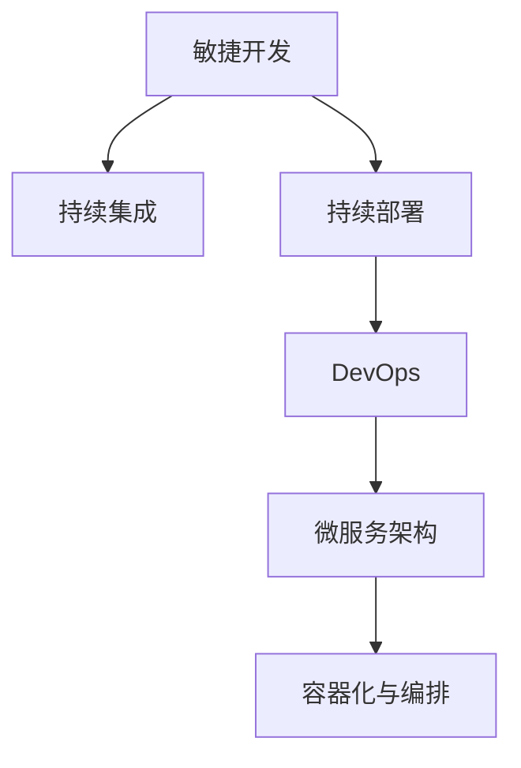

                 

# 如何利用技术能力进行产品设计

## 1. 背景介绍

### 1.1 问题由来

在当今科技飞速发展的时代，技术能力已经成为企业竞争的核心要素之一。无论是初创公司还是传统大厂，产品的设计、开发和部署都离不开强大的技术支撑。如何有效利用技术能力，构建出符合市场需求、具备强大竞争力的产品，是每个技术团队面临的重要课题。

### 1.2 问题核心关键点

利用技术能力进行产品设计的关键在于：

- **用户需求分析**：明确用户需求，把握市场痛点，设计出用户真正需要的产品功能。
- **技术选型与架构设计**：根据产品需求，选择合适的技术栈和架构设计，确保系统的可扩展性、可维护性和性能。
- **前后端协同**：建立有效的沟通机制，确保前后端开发无缝对接，提升开发效率和代码质量。
- **敏捷开发与持续集成**：采用敏捷开发方法，通过持续集成和持续部署，快速迭代和优化产品功能。
- **性能优化与安全保障**：在系统设计和开发过程中，始终将性能优化和安全防护作为重要考量，确保产品的稳定性和安全性。

## 2. 核心概念与联系

### 2.1 核心概念概述

为了更好地理解利用技术能力进行产品设计的方法，本节将介绍几个关键概念：

- **敏捷开发(Agile Development)**：一种迭代、增量、用户中心的设计方法，通过快速迭代实现产品功能和用户体验的持续改进。
- **持续集成(Continuous Integration, CI)**：一种软件开发实践，通过自动构建、测试和部署，加速产品开发和发布。
- **持续部署(Continuous Deployment)**：一种自动化部署实践，通过自动化流程减少人工干预，提升部署效率和稳定性。
- **DevOps**：一种跨职能的开发、运维和质量保障的文化和实践，旨在实现快速交付高质量的软件。
- **微服务架构(Microservices Architecture)**：一种架构设计范式，将应用程序拆分为多个独立的、松耦合的服务，提高系统的可扩展性和可维护性。
- **容器化与编排(Docker & Kubernetes)**：通过容器技术，实现应用的软件和配置的封装、打包和分发；通过Kubernetes编排技术，实现应用的自动部署、扩展和管理。

这些概念之间的逻辑关系可以通过以下Mermaid流程图来展示：



这个流程图展示了几大关键概念及其之间的关系：

1. 敏捷开发通过快速迭代，不断优化产品功能。
2. 持续集成通过自动构建和测试，加快产品交付速度。
3. 持续部署通过自动化部署，确保产品稳定发布。
4. DevOps通过跨职能合作，提升产品开发和运维效率。
5. 微服务架构通过拆分服务，提高系统的可扩展性和可维护性。
6. 容器化与编排通过封装和编排，实现应用的自动部署和管理。

这些概念共同构成了利用技术能力进行产品设计的整体框架，使得团队能够高效、灵活地开发和部署产品。

## 3. 核心算法原理 & 具体操作步骤

### 3.1 算法原理概述

利用技术能力进行产品设计的过程，本质上是一个通过敏捷开发、持续集成和持续部署等实践，不断迭代、优化产品功能的过程。其核心思想是：以用户为中心，快速构建、测试和部署产品，通过不断的反馈和优化，实现产品功能的不断完善。

形式化地，假设产品开发过程涉及多个迭代周期 $n$，每个周期包含若干轮开发和测试。令 $F_i$ 表示第 $i$ 轮开发后的产品功能，$T_i$ 表示第 $i$ 轮测试后的缺陷数。则产品设计的过程可以表示为：

$$
F_{i+1} = F_i + \Delta F_i
$$

其中 $\Delta F_i$ 表示第 $i$ 轮迭代新增的功能。

### 3.2 算法步骤详解

基于敏捷开发和持续集成方法的产品设计过程，通常包括以下关键步骤：

**Step 1: 用户需求分析**
- 与用户沟通，收集需求文档，明确产品功能和用户体验目标。
- 使用敏捷开发方法，将需求拆分为多个迭代任务，形成产品故事地图。

**Step 2: 技术选型与架构设计**
- 根据产品需求，选择合适的技术栈和架构设计，考虑系统的可扩展性、可维护性和性能。
- 设计合理的数据模型和接口规范，确保系统各组件之间的通信流畅。

**Step 3: 敏捷开发与持续集成**
- 采用Scrum、Kanban等敏捷开发方法，建立迭代周期，进行持续开发和测试。
- 使用持续集成工具，如Jenkins、GitLab CI等，自动化构建和测试流程，确保产品质量。
- 建立代码审查和测试覆盖率管理机制，提升代码质量和开发效率。

**Step 4: 持续部署与DevOps实践**
- 采用持续部署工具，如Jenkins Pipeline、GitLab CI等，自动化部署流程，确保快速交付。
- 使用DevOps文化，建立跨职能团队，实现开发、运维和质量保障的协同工作。
- 通过容器化技术，如Docker，实现应用的快速部署和迁移。
- 利用Kubernetes编排技术，实现应用的自动扩展和资源管理。

**Step 5: 产品迭代与优化**
- 持续收集用户反馈，根据反馈进行产品迭代和优化。
- 采用A/B测试等方法，评估新功能的用户接受度和效果，进行数据驱动的决策。
- 建立监控告警系统，实时监测系统运行状态，确保产品稳定性和安全性。

### 3.3 算法优缺点

利用技术能力进行产品设计的方法，具有以下优点：

- **快速迭代**：通过敏捷开发和持续集成，能够快速响应市场变化和用户需求，缩短产品开发周期。
- **高效协作**：采用DevOps文化，实现开发、运维和质量保障的协同工作，提升团队协作效率。
- **自动部署**：通过持续部署工具和容器化技术，实现应用的自动部署和管理，提升部署效率和稳定性。
- **数据驱动**：利用用户反馈和A/B测试等方法，进行数据驱动的决策，优化产品功能和用户体验。

同时，该方法也存在一定的局限性：

- **依赖技术能力**：对于团队的技术能力要求较高，需要有强大的技术储备和协同能力。
- **复杂度高**：涉及多个技术环节和工具链，系统设计和开发复杂度较高。
- **学习曲线陡**：新技术的引入和实践需要一定的时间和学习成本，短期内可能影响生产力。

尽管存在这些局限性，但就目前而言，利用技术能力进行产品设计仍然是最为主流的方法。未来相关研究的重点在于如何进一步简化流程、降低技术门槛、提升开发效率。

### 3.4 算法应用领域

利用技术能力进行产品设计的方法，已经在各行各业得到了广泛的应用，例如：

- **电商平台**：通过敏捷开发和持续集成，快速迭代产品功能，提升用户体验和订单转化率。
- **金融服务**：采用DevOps文化，实现自动化部署和监控，保障系统稳定和安全。
- **医疗健康**：通过容器化与编排技术，实现医疗应用的快速部署和扩展，提升服务效率和可靠性。
- **教育培训**：利用敏捷开发方法，快速响应用户需求，推出多样化的教育产品和课程。
- **政府公共服务**：通过持续集成和持续部署，提升政府服务的响应速度和用户体验。

除了上述这些经典应用外，利用技术能力进行产品设计的方法也被创新性地应用到更多场景中，如智能家居、智慧城市、工业互联网等，为各行各业带来新的创新和突破。

## 4. 数学模型和公式 & 详细讲解

### 4.1 数学模型构建

本节将使用数学语言对敏捷开发和持续集成等关键方法进行更加严格的刻画。

假设产品开发过程涉及 $n$ 个迭代周期，每个周期包含 $m$ 个开发轮次。令 $D_i$ 表示第 $i$ 个迭代周期的开发轮次，$T_i$ 表示第 $i$ 个迭代周期的测试轮次，$F_i$ 表示第 $i$ 个迭代周期的产品功能。则产品设计的过程可以表示为：

$$
F_{i+1} = F_i + \Delta F_i
$$

其中 $\Delta F_i = \sum_{j=1}^{T_i} \Delta F_{ij}$，表示第 $i$ 个迭代周期中测试轮次 $j$ 新增的功能。

### 4.2 公式推导过程

以下我们以敏捷开发为例，推导每个迭代周期内新增功能的计算公式。

假设敏捷开发采用Scrum方法，每个迭代周期包含若干轮开发和测试。令 $D_i$ 表示第 $i$ 个迭代周期的开发轮次，$T_i$ 表示第 $i$ 个迭代周期的测试轮次，$F_{ij}$ 表示第 $i$ 个迭代周期中第 $j$ 轮测试新增的功能。则有：

$$
\Delta F_i = \sum_{j=1}^{T_i} \Delta F_{ij} = \sum_{j=1}^{T_i} \frac{S_j}{D_j}
$$

其中 $S_j$ 表示第 $j$ 轮测试的任务量，$D_j$ 表示第 $j$ 轮测试的开发效率。

将上述公式代入产品设计的总体公式中，得：

$$
F_{i+1} = F_i + \sum_{j=1}^{T_i} \frac{S_j}{D_j}
$$

这个公式展示了敏捷开发中，每个迭代周期新增功能的计算方法。通过合理评估任务量和开发效率，可以更精确地控制产品的迭代进度和功能增量。

### 4.3 案例分析与讲解

以某电商平台的敏捷开发为例，分析其产品设计的过程：

1. **用户需求分析**：通过市场调研，收集用户需求，明确产品类型和功能。
2. **技术选型与架构设计**：选择合适的技术栈和架构设计，设计合理的数据模型和接口规范。
3. **敏捷开发与持续集成**：采用Scrum方法，建立多个迭代周期，进行持续开发和测试。
4. **持续部署与DevOps实践**：使用持续部署工具，自动化部署流程，确保快速交付。
5. **产品迭代与优化**：持续收集用户反馈，进行产品迭代和优化。

在实际应用中，还可以通过一些具体的技术手段，进一步提升产品设计的效率和质量。例如，利用持续集成工具，实时监测代码变更和测试结果，及时发现和解决潜在问题。采用容器化技术，实现应用的快速部署和迁移。利用Kubernetes编排技术，实现应用的自动扩展和资源管理。

## 5. 项目实践：代码实例和详细解释说明

### 5.1 开发环境搭建

在进行敏捷开发和持续集成实践前，我们需要准备好开发环境。以下是使用Jenkins实现持续集成和持续部署的配置流程：

1. 安装Jenkins：从官网下载并安装Jenkins，作为持续集成和持续部署的平台。
2. 安装Git插件：在Jenkins中安装Git插件，支持版本控制和代码管理。
3. 安装Maven插件：在Jenkins中安装Maven插件，支持自动构建和测试。
4. 配置CI/CD pipeline：通过Jenkins UI，创建CI/CD pipeline，定义构建、测试、部署等各个环节的执行流程。
5. 设置代码审查和测试覆盖率管理：在Jenkins中集成代码审查工具，如GitHub Actions，确保代码质量和测试覆盖率。

完成上述步骤后，即可在Jenkins平台上开始敏捷开发和持续集成的实践。

### 5.2 源代码详细实现

下面我们以一个电商平台的敏捷开发和持续集成实践为例，给出Jenkins CI/CD pipeline的代码实现。

```groovy
pipeline {
    agent any
    stages {
        stage('Build') {
            steps {
                sh 'mvn clean install'
            }
        }
        stage('Test') {
            steps {
                sh 'mvn test'
            }
        }
        stage('Deploy') {
            steps {
                sh 'mvn spring-boot:run'
            }
        }
    }
}
```

在上述代码中，通过Jenkins pipeline脚本，定义了构建、测试和部署三个阶段。具体实现步骤如下：

- **构建阶段**：执行 `mvn clean install` 命令，构建并打包项目，生成可执行的Jar包。
- **测试阶段**：执行 `mvn test` 命令，进行单元测试和集成测试，确保代码质量。
- **部署阶段**：执行 `mvn spring-boot:run` 命令，启动应用，进行容器化部署。

### 5.3 代码解读与分析

让我们再详细解读一下关键代码的实现细节：

**pipeline代码结构**：
- `pipeline` 关键字表示这是一个Jenkins pipeline脚本。
- `agent any` 表示使用任何可用的代理节点进行执行。
- `stages` 关键字表示定义多个阶段，每个阶段执行不同的任务。

**构建阶段**：
- `sh 'mvn clean install'`：执行 `mvn` 命令，执行 `clean install` 操作，清理项目并重新构建。

**测试阶段**：
- `sh 'mvn test'`：执行 `mvn` 命令，执行 `test` 操作，进行单元测试和集成测试，生成测试报告。

**部署阶段**：
- `sh 'mvn spring-boot:run'`：执行 `mvn` 命令，执行 `spring-boot:run` 操作，启动应用并运行在容器中。

通过上述Jenkins pipeline脚本，可以实现自动化构建、测试和部署流程，大大提升产品开发的效率和质量。在实际应用中，还可以根据需要添加更多的阶段和任务，如代码审查、性能测试、部署日志记录等，进一步优化CI/CD流程。

## 6. 实际应用场景

### 6.1 电商平台的敏捷开发和持续集成

以某电商平台的敏捷开发和持续集成实践为例，分析其如何利用技术能力进行产品设计：

1. **用户需求分析**：通过市场调研和用户反馈，明确电商平台的业务需求和功能目标。
2. **技术选型与架构设计**：选择合适的技术栈，如Spring Boot、MyBatis等，设计合理的数据模型和接口规范。
3. **敏捷开发与持续集成**：采用Scrum方法，建立多个迭代周期，进行持续开发和测试。
4. **持续部署与DevOps实践**：使用Jenkins CI/CD pipeline，自动化构建和部署流程，确保快速交付。
5. **产品迭代与优化**：持续收集用户反馈，进行产品迭代和优化。

在实际应用中，还可以通过一些具体的技术手段，进一步提升产品设计的效率和质量。例如，利用持续集成工具，实时监测代码变更和测试结果，及时发现和解决潜在问题。采用容器化技术，实现应用的快速部署和迁移。利用Kubernetes编排技术，实现应用的自动扩展和资源管理。

### 6.2 金融服务的DevOps实践

以某金融服务的DevOps实践为例，分析其如何利用技术能力进行产品设计：

1. **用户需求分析**：通过市场调研和用户反馈，明确金融服务的业务需求和功能目标。
2. **技术选型与架构设计**：选择合适的技术栈，如Spring Cloud、MyBatis等，设计合理的数据模型和接口规范。
3. **敏捷开发与持续集成**：采用DevOps文化，建立跨职能团队，进行持续开发和测试。
4. **持续部署与DevOps实践**：使用Jenkins CI/CD pipeline，自动化构建和部署流程，确保快速交付。
5. **产品迭代与优化**：持续收集用户反馈，进行产品迭代和优化。

在实际应用中，还可以利用容器化技术和Kubernetes编排技术，实现应用的快速部署和扩展。通过DevOps文化和跨职能团队，提升系统开发和运维的效率和质量。

### 6.3 医疗应用的容器化与编排

以某医疗应用的容器化与编排实践为例，分析其如何利用技术能力进行产品设计：

1. **用户需求分析**：通过市场调研和用户反馈，明确医疗应用的功能需求和用户体验目标。
2. **技术选型与架构设计**：选择合适的技术栈，如Spring Boot、MyBatis等，设计合理的数据模型和接口规范。
3. **敏捷开发与持续集成**：采用DevOps文化，建立跨职能团队，进行持续开发和测试。
4. **持续部署与DevOps实践**：使用Docker容器化和Kubernetes编排技术，实现应用的快速部署和扩展。
5. **产品迭代与优化**：持续收集用户反馈，进行产品迭代和优化。

在实际应用中，通过容器化技术，实现应用的快速部署和迁移。利用Kubernetes编排技术，实现应用的自动扩展和资源管理。通过DevOps文化和跨职能团队，提升系统开发和运维的效率和质量。

## 7. 工具和资源推荐

### 7.1 学习资源推荐

为了帮助开发者系统掌握敏捷开发、持续集成和持续部署等关键技术，这里推荐一些优质的学习资源：

1. 《持续集成与持续部署实践》系列博文：由DevOps社区知名专家撰写，深入浅出地介绍了CI/CD的核心概念和实践方法。
2. 《敏捷开发之道》课程：由Udemy等在线平台开设的敏捷开发课程，涵盖Scrum、Kanban等敏捷开发方法，提供实战案例和工具。
3. 《DevOps实践指南》书籍：DevOps社区经典著作，全面介绍了DevOps文化和实践方法，适合开发者深入学习。
4. Docker官方文档：Docker官方提供的详细文档，涵盖容器化技术和Docker编排工具的使用方法。
5. Kubernetes官方文档：Kubernetes官方提供的详细文档，涵盖Kubernetes集群和编排技术的使用方法。

通过对这些资源的学习实践，相信你一定能够快速掌握敏捷开发、持续集成和持续部署等关键技术，并用于解决实际的产品开发问题。

### 7.2 开发工具推荐

高效的开发离不开优秀的工具支持。以下是几款用于敏捷开发和持续集成开发的常用工具：

1. Jenkins：开源的持续集成和持续部署平台，支持各种构建、测试和部署工具的集成。
2. GitLab CI/CD：GitLab提供的持续集成和持续部署服务，支持CI/CD pipeline的创建和执行。
3. Maven：开源的构建管理工具，支持自动构建和测试，广泛应用在Java项目中。
4. Docker：开源的容器化工具，实现应用的快速部署和迁移。
5. Kubernetes：开源的容器编排工具，实现应用的自动扩展和资源管理。
6. Git：版本控制工具，支持代码的协同管理和版本追踪。

合理利用这些工具，可以显著提升敏捷开发和持续集成的开发效率，加快创新迭代的步伐。

### 7.3 相关论文推荐

敏捷开发、持续集成和持续部署等技术的发展源于学界的持续研究。以下是几篇奠基性的相关论文，推荐阅读：

1. "Introduction to Agile Development"（敏捷开发介绍）：Kent Beck撰写的经典书籍，深入浅出地介绍了敏捷开发的核心思想和方法。
2. "Continuous Integration: Functionalities, Practices and Results"（持续集成：功能、实践和结果）：Martin Fowler撰写的论文，全面介绍了持续集成的理论和实践。
3. "Jenkins: Unlocking Continuous Delivery with Jenkins"（Jenkins：解锁持续交付）：Jenkins官方文档，介绍如何使用Jenkins进行持续集成和持续部署。
4. "Docker: The Future of Computing"（Docker：计算的未来）：Docker官方博客文章，介绍Docker容器化的优势和应用场景。
5. "Kubernetes: Cluster Management with Docker"（Kubernetes：使用Docker进行集群管理）：Kubernetes官方博客文章，介绍如何使用Kubernetes进行容器编排。

这些论文代表了大规模分布式系统开发和运维技术的发展脉络。通过学习这些前沿成果，可以帮助研究者把握学科前进方向，激发更多的创新灵感。

## 8. 总结：未来发展趋势与挑战

### 8.1 总结

本文对利用技术能力进行产品设计的方法进行了全面系统的介绍。首先阐述了敏捷开发、持续集成和持续部署等关键技术的研究背景和意义，明确了这些技术在提升产品开发效率和质量方面的独特价值。其次，从原理到实践，详细讲解了敏捷开发、持续集成和持续部署的数学模型和关键步骤，给出了敏捷开发和持续集成的完整代码实现。同时，本文还广泛探讨了这些技术在电商平台、金融服务、医疗应用等多个行业领域的应用前景，展示了敏捷开发和持续集成的广泛应用。

通过本文的系统梳理，可以看到，敏捷开发和持续集成技术已经成为产品开发和运维的重要范式，极大地提升了产品开发的效率和质量。未来，伴随这些技术的不断演进，结合DevOps文化，持续集成和持续部署必将在更广泛的场景下发挥其优势，推动企业实现数字化转型和业务升级。

### 8.2 未来发展趋势

展望未来，敏捷开发和持续集成技术将呈现以下几个发展趋势：

1. **自动化水平提升**：随着自动化测试、持续集成工具的不断成熟，自动化程度将进一步提高，减少人工干预，提升开发效率。
2. **持续集成工具多样化**：将出现更多类型的持续集成工具，如Jenkins、GitLab CI、GitHub Actions等，提升跨平台集成能力。
3. **DevOps文化普及**：随着DevOps文化的不断普及，跨职能团队将更加广泛地应用，提升系统开发和运维的协同效率。
4. **微服务架构演进**：微服务架构将继续演进，变得更加成熟和完善，提升系统的可扩展性和可维护性。
5. **容器化和云原生技术应用**：容器化技术和云原生技术将进一步普及，提升应用的快速部署和扩展能力。
6. **持续学习与改进**：通过持续集成和持续部署，产品开发和运维过程将不断优化和改进，提升系统质量和用户体验。

以上趋势凸显了敏捷开发和持续集成技术的广阔前景。这些方向的探索发展，必将进一步提升产品开发的效率和质量，推动企业实现数字化转型和业务升级。

### 8.3 面临的挑战

尽管敏捷开发和持续集成技术已经取得了瞩目成就，但在迈向更加智能化、普适化应用的过程中，它仍面临着诸多挑战：

1. **技术复杂度高**：敏捷开发和持续集成涉及多个技术环节和工具链，系统设计和开发复杂度较高。
2. **学习曲线陡**：新技术的引入和实践需要一定的时间和学习成本，短期内可能影响生产力。
3. **质量保障困难**：持续集成和持续部署过程中，如何确保代码质量和系统稳定性，是一个重要的挑战。
4. **自动化工具局限**：现有自动化工具在某些特定场景下可能无法满足需求，需要定制开发。
5. **团队协作难度大**：跨职能团队协作需要建立良好的沟通机制和协同工作流程。
6. **持续集成效果不稳定**：持续集成过程中，如何有效管理和优化测试结果，提升集成效果，是一个重要的课题。

尽管存在这些挑战，但随着学界和产业界的共同努力，敏捷开发和持续集成必将在未来的发展中不断优化和改进，实现更高的效率和质量。

### 8.4 未来突破

面对敏捷开发和持续集成面临的种种挑战，未来的研究需要在以下几个方面寻求新的突破：

1. **自动化测试提升**：进一步提升自动化测试的覆盖率和质量，减少人工测试的负担，提升测试效率。
2. **持续集成工具改进**：开发更加易用、功能丰富的持续集成工具，提升跨平台集成能力。
3. **DevOps文化深化**：进一步深化DevOps文化，提升团队协作效率和系统开发效率。
4. **微服务架构优化**：优化微服务架构，提升系统的可扩展性和可维护性。
5. **容器化和云原生技术创新**：进一步创新容器化和云原生技术，提升应用的快速部署和扩展能力。
6. **持续学习与改进**：通过持续集成和持续部署，产品开发和运维过程将不断优化和改进，提升系统质量和用户体验。

这些研究方向的探索，必将引领敏捷开发和持续集成技术迈向更高的台阶，为构建安全、可靠、高效的产品系统铺平道路。面向未来，敏捷开发和持续集成技术还需要与其他新技术进行更深入的融合，如知识表示、因果推理、强化学习等，多路径协同发力，共同推动软件开发和运维的进步。

## 9. 附录：常见问题与解答

**Q1：如何选择合适的敏捷开发方法？**

A: 选择合适的敏捷开发方法，需要考虑团队规模、项目复杂度、客户需求等因素。一般来说，Scrum适合中小型团队，而Kanban适合项目较为分散的团队。可以根据具体情况选择合适的敏捷开发方法。

**Q2：持续集成和持续部署如何进行？**

A: 持续集成和持续部署的关键在于自动化。通过编写CI/CD pipeline脚本，自动化构建、测试和部署流程，减少人工干预，提升效率。可以使用Jenkins、GitLab CI等工具来实现。

**Q3：敏捷开发中的任务拆分和估算有哪些技巧？**

A: 敏捷开发中的任务拆分和估算需要考虑任务复杂度、团队能力、用户需求等因素。可以使用故事点、时间估算、敏捷游戏等方法，合理拆分任务，确保任务可控。

**Q4：如何评估敏捷开发和持续集成的效果？**

A: 敏捷开发和持续集成的效果评估可以从多个方面进行，如代码质量、测试覆盖率、交付速度、用户满意度等。可以使用自动化测试工具、代码覆盖率工具、用户反馈工具等进行评估。

**Q5：如何应对敏捷开发中的变化？**

A: 敏捷开发中的变化是常态，需要建立良好的反馈机制和迭代周期。通过快速迭代，不断优化产品功能，及时响应市场变化和用户需求。

通过本文的系统梳理，可以看到，敏捷开发和持续集成技术已经成为产品开发和运维的重要范式，极大地提升了产品开发的效率和质量。未来，伴随这些技术的不断演进，结合DevOps文化，持续集成和持续部署必将在更广泛的场景下发挥其优势，推动企业实现数字化转型和业务升级。总之，敏捷开发和持续集成需要开发者从技术、团队、流程等多个维度全面考虑，方能实现高效、稳定、灵活的产品开发和运维。

