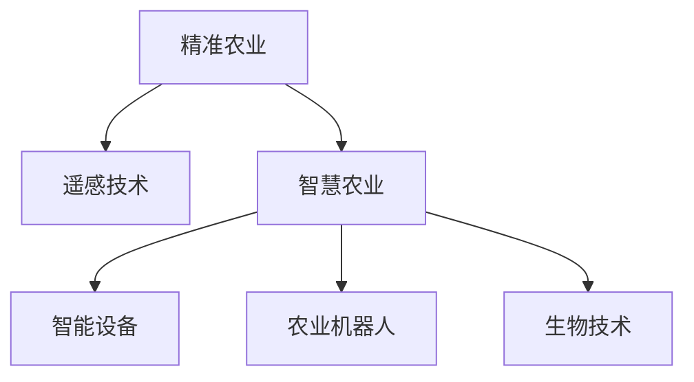

                 

# 如何利用技术能力进行农业科技创新

> 关键词：农业科技创新, 人工智能, 机器学习, 数据科学, 精准农业, 智慧农业, 遥感技术, 自动化设备

## 1. 背景介绍

### 1.1 问题由来

农业作为国民经济的基础，其生产效率和产量直接关系到国家粮食安全和农民生计。随着人口的增长和环境压力的增加，传统的农业生产方式已经不能满足现代社会的需求。因此，利用现代技术手段进行农业科技创新，提升农业生产效率，成为了当前农业发展的迫切需求。

在过去的几十年里，农业科技取得了显著的进步。从杂交种子、化学肥料和农药的应用，到机械化、自动化设备的引入，农业生产效率得到了显著提升。然而，随着科技的发展，新的技术手段和数据驱动的农业模式逐渐兴起，为农业科技创新带来了新的机遇和挑战。

### 1.2 问题核心关键点

当前，农业科技创新主要集中在以下几个关键点：

- **数据驱动的农业决策**：通过收集和分析大量的农业数据，辅助决策者进行科学的农业管理，提升生产效率。
- **智能农业设备**：利用传感器、机器视觉和物联网技术，实现农业生产的智能化和自动化。
- **精准农业技术**：利用卫星遥感和GIS技术，进行土壤、气象、作物生长状况的精准监测，优化农业生产。
- **生物技术和基因编辑**：通过生物技术手段，培育高产、抗病的作物品种，提高作物产量和质量。
- **农业机器人和自动化设备**：利用机器人技术和自动化设备，替代人力进行农业生产，提高生产效率和质量。

这些关键点共同构成了现代农业科技创新的主要方向，为提高农业生产效率、保障粮食安全和实现农业可持续发展提供了新的解决方案。

## 2. 核心概念与联系

### 2.1 核心概念概述

为更好地理解利用技术能力进行农业科技创新的方法，本节将介绍几个密切相关的核心概念：

- **精准农业(Precision Agriculture)**：利用高精度的传感器和遥感技术，对农田进行精准监测和管理，以实现资源的最优利用和农业生产的智能化。
- **智慧农业(Smart Agriculture)**：通过物联网、大数据和人工智能等技术手段，实现农业生产的全流程自动化和智能化，提高农业生产效率和质量。
- **遥感技术(Remote Sensing Technology)**：通过卫星或无人机搭载的传感器，获取地面或空中影像数据，进行土壤、作物和气象条件等信息的监测和分析。
- **农业机器人(Agricultural Robotics)**：利用自动化和机器人技术，进行农业生产的各个环节，如播种、施肥、收割等，以替代人力，提高生产效率和质量。
- **智能设备(Smart Equipment)**：包括自动灌溉系统、无人机、智能温室等，利用传感器和物联网技术，实现农业生产的自动化和智能化。
- **生物技术(Biotechnology)**：利用基因编辑、生物工程等技术手段，改良作物品种，提高产量和抗病性。

这些核心概念之间的逻辑关系可以通过以下Mermaid流程图来展示：



这个流程图展示了精准农业、智慧农业、遥感技术、智能设备、农业机器人和生物技术之间的关系：

1. 精准农业通过遥感技术获取高精度的农田信息，辅助决策者进行科学的农业管理。
2. 智慧农业利用物联网、大数据和人工智能等技术手段，实现农业生产的全流程自动化和智能化。
3. 智能设备通过传感器和物联网技术，实现农业生产的自动化和智能化。
4. 农业机器人利用自动化和机器人技术，进行农业生产的各个环节，以替代人力，提高生产效率和质量。
5. 生物技术通过基因编辑、生物工程等技术手段，改良作物品种，提高产量和抗病性。

这些概念共同构成了现代农业科技创新的技术框架，为提高农业生产效率、保障粮食安全和实现农业可持续发展提供了新的解决方案。

## 3. 核心算法原理 & 具体操作步骤
### 3.1 算法原理概述

利用技术能力进行农业科技创新，主要涉及以下几个关键步骤：

1. **数据采集与处理**：收集农田土壤、气象、作物生长状况等数据，通过数据清洗、预处理和特征提取，为后续的分析和决策提供数据支持。
2. **数据分析与建模**：利用机器学习和数据挖掘技术，进行数据分析和建模，预测作物生长状况、产量和病虫害等，为农业决策提供科学依据。
3. **智能决策与优化**：通过智能算法和决策支持系统，辅助决策者进行农业生产管理和资源优化，提升生产效率和质量。
4. **技术实施与集成**：将智能设备、自动化设备和生物技术手段集成到农业生产过程中，实现农业生产的自动化和智能化。

这些步骤构成了利用技术能力进行农业科技创新的主要流程，通过数据驱动和智能决策，实现农业生产的现代化和智能化。

### 3.2 算法步骤详解

下面以一个具体的农业科技创新项目为例，详细介绍利用技术能力进行农业科技创新的算法步骤：

#### 项目背景

某农场种植了多种作物，但近年来由于气候变化和病虫害的影响，产量不稳定，生产成本较高。农场决定利用现代技术手段进行农业科技创新，提升农业生产效率和产量。

#### 数据采集与处理

1. **数据采集**：安装各种传感器和监控设备，包括土壤湿度传感器、气象站、无人机等，收集土壤、气象和作物生长状况等数据。
2. **数据清洗**：对采集到的数据进行清洗和预处理，去除噪声和异常值，确保数据的质量和可靠性。
3. **特征提取**：从清洗后的数据中提取关键特征，如土壤湿度、气温、降雨量、作物生长阶段等，为后续分析和建模提供输入。

#### 数据分析与建模

1. **数据可视化**：利用可视化工具，展示和分析采集到的数据，发现潜在问题和趋势。
2. **统计分析**：进行统计分析，计算作物生长速率、产量预测等指标，为后续的决策提供依据。
3. **机器学习建模**：利用机器学习算法，如随机森林、支持向量机等，建立作物生长状况预测模型，预测未来产量和病虫害情况。
4. **数据挖掘与知识发现**：通过数据挖掘技术，发现作物生长和产量之间的关联规则，优化农业管理策略。

#### 智能决策与优化

1. **决策支持系统**：建立决策支持系统，将机器学习模型和统计分析结果整合，辅助决策者进行科学决策。
2. **资源优化**：通过优化算法，如遗传算法、模拟退火等，优化农业资源配置，减少生产成本，提高产量。
3. **智能设备控制**：利用物联网技术，实现智能设备（如灌溉系统、无人机）的远程控制和自动化管理，提高生产效率。

#### 技术实施与集成

1. **设备集成**：将智能设备和自动化设备集成到农业生产过程中，如自动灌溉系统、无人机等，实现农业生产的自动化和智能化。
2. **技术培训**：对农场工作人员进行技术培训，使其熟练掌握智能设备和系统的使用方法，确保技术手段的有效应用。
3. **效果评估**：对农业科技创新的效果进行评估，收集反馈意见，不断优化和改进技术方案。

### 3.3 算法优缺点

利用技术能力进行农业科技创新的优点主要包括：

- **提升生产效率**：通过数据驱动和智能决策，优化农业生产过程，提高生产效率和产量。
- **降低生产成本**：利用智能化设备和技术手段，减少人力和资源消耗，降低生产成本。
- **保障粮食安全**：通过精准农业和智能决策，提升农业生产的稳定性和抗风险能力，保障粮食安全。
- **促进可持续发展**：利用生物技术和智能设备，减少农药和化肥的使用，促进农业的可持续发展。

同时，该方法也存在一定的局限性：

- **技术成本高**：智能化设备和系统的引入需要较高的初始投资和技术支持，中小规模农场难以负担。
- **数据质量要求高**：数据分析和建模需要高质量的数据，数据采集和处理过程中存在噪声和误差，可能导致模型预测不准确。
- **技术实施复杂**：智能化设备和技术手段的集成和应用需要专业人员的技术支持和培训，技术实施难度较大。
- **模型泛化能力有限**：机器学习模型和统计分析结果的泛化能力受限于数据和模型的质量和复杂度，难以应对极端情况和突发事件。

尽管存在这些局限性，但利用技术能力进行农业科技创新的方法已经得到了广泛应用，并在农业生产中取得了显著的效果。未来随着技术的不断进步和成本的下降，这一方法将更加广泛地应用于农业生产，推动农业科技创新的持续发展。

### 3.4 算法应用领域

利用技术能力进行农业科技创新的方法，已经在多个领域得到了应用，以下是几个典型的应用场景：

#### 精准农业

精准农业通过遥感技术和数据分析，实现对农田的精准监测和管理，优化资源配置，提高生产效率和产量。例如，通过无人机和传感器采集农田数据，结合机器学习模型进行分析和预测，实现精准施肥、灌溉和病虫害防治。

#### 智慧农业

智慧农业利用物联网、大数据和人工智能技术，实现农业生产的全流程自动化和智能化。例如，通过智能设备和传感器监测农田数据，利用机器学习模型进行分析和预测，自动化控制灌溉系统、施肥系统和播种系统，提高生产效率和质量。

#### 智能设备

智能设备通过传感器和物联网技术，实现农业生产的自动化和智能化。例如，自动灌溉系统可以根据土壤湿度和气象条件，自动控制灌溉量和时间，提高水资源利用效率。智能温室可以通过传感器监测作物生长状况，自动调节光照和温度，优化生长条件。

#### 农业机器人

农业机器人利用自动化和机器人技术，进行农业生产的各个环节，以替代人力，提高生产效率和质量。例如，农业机器人可以自动进行播种、施肥、收割等操作，减少人力成本，提高生产效率。

#### 生物技术

生物技术通过基因编辑、生物工程等技术手段，改良作物品种，提高产量和抗病性。例如，利用基因编辑技术，培育出高产、抗病的作物品种，提高农业生产效率和产量。

通过以上几个应用场景，可以看出利用技术能力进行农业科技创新的方法已经广泛应用于现代农业生产中，为提高农业生产效率、保障粮食安全和实现农业可持续发展提供了新的解决方案。

## 4. 数学模型和公式 & 详细讲解  
### 4.1 数学模型构建

本节将使用数学语言对利用技术能力进行农业科技创新的过程进行更加严格的刻画。

设农业生产数据为 $D = \{(x_i, y_i)\}_{i=1}^N$，其中 $x$ 为输入特征向量，$y$ 为输出变量，如作物生长速率、产量等。农业科技创新的目标是最小化预测误差，即找到最优模型 $f$：

$$
f = \mathop{\arg\min}_{f} \sum_{i=1}^N (y_i - f(x_i))^2
$$

在实践中，我们通常使用机器学习算法进行模型训练和预测。常用的机器学习算法包括线性回归、决策树、支持向量机等。

### 4.2 公式推导过程

以线性回归为例，推导模型训练和预测的公式：

1. **模型假设**：假设线性回归模型为 $f(x) = \beta_0 + \beta_1 x_1 + \beta_2 x_2 + \cdots + \beta_k x_k$，其中 $\beta$ 为模型参数，$k$ 为输入特征的数量。
2. **损失函数**：定义损失函数为 $L(\beta) = \frac{1}{2N} \sum_{i=1}^N (y_i - f(x_i))^2$，表示模型预测值与真实值之间的误差平方和。
3. **梯度下降**：使用梯度下降算法更新模型参数 $\beta$，更新公式为 $\beta_j = \beta_j - \frac{\eta}{N} \sum_{i=1}^N (y_i - f(x_i)) \frac{\partial f(x_i)}{\partial x_j}$，其中 $\eta$ 为学习率。
4. **模型预测**：利用训练好的模型进行预测，公式为 $\hat{y}_i = f(x_i)$。

通过以上公式，可以完成线性回归模型的训练和预测，从而实现农业科技创新的目标。

### 4.3 案例分析与讲解

假设某农场种植小麦，采集了历史产量数据和气象数据，包括温度、降雨量、湿度等。利用机器学习算法进行数据分析和建模，得到线性回归模型：

$$
\hat{y} = \beta_0 + \beta_1 x_1 + \beta_2 x_2 + \beta_3 x_3
$$

其中 $y$ 为小麦产量，$x_1$、$x_2$、$x_3$ 分别为温度、降雨量、湿度。通过对模型进行训练和验证，得到最优的模型参数 $\beta$。

然后，利用训练好的模型进行预测，得到未来某个时期的小麦产量预测值 $\hat{y}$，为农场进行科学决策提供依据。例如，当预测产量较低时，农场可以采取相应的措施，如调整播种时间、增加施肥量等，以提高产量和质量。

## 5. 项目实践：代码实例和详细解释说明
### 5.1 开发环境搭建

在进行农业科技创新项目实践前，我们需要准备好开发环境。以下是使用Python进行机器学习和数据处理的环境配置流程：

1. 安装Anaconda：从官网下载并安装Anaconda，用于创建独立的Python环境。

2. 创建并激活虚拟环境：
```bash
conda create -n py-env python=3.8 
conda activate py-env
```

3. 安装必要的Python包：
```bash
pip install numpy pandas scikit-learn matplotlib seaborn
```

4. 安装相关的机器学习库：
```bash
pip install scikit-learn scikit-learn-optimization
```

完成上述步骤后，即可在`py-env`环境中开始农业科技创新项目实践。

### 5.2 源代码详细实现

这里以线性回归模型为例，介绍如何使用Python进行数据处理和模型训练。

```python
import numpy as np
from sklearn.linear_model import LinearRegression
from sklearn.model_selection import train_test_split
import pandas as pd

# 数据读取
data = pd.read_csv('crop_data.csv')

# 数据清洗
data.dropna(inplace=True)

# 数据拆分
X = data[['temperature', 'rainfall', 'humidity']].values
y = data['yield'].values
X_train, X_test, y_train, y_test = train_test_split(X, y, test_size=0.2, random_state=42)

# 模型训练
model = LinearRegression()
model.fit(X_train, y_train)

# 模型预测
y_pred = model.predict(X_test)

# 输出结果
print('模型训练完成')
print('训练集得分：', model.score(X_train, y_train))
print('测试集得分：', model.score(X_test, y_test))
print('预测结果：', y_pred)
```

这段代码首先读取数据，然后进行数据清洗和拆分，接着使用线性回归模型进行训练和预测，并输出训练集和测试集得分以及预测结果。

### 5.3 代码解读与分析

让我们再详细解读一下关键代码的实现细节：

- `data = pd.read_csv('crop_data.csv')`：读取数据文件，存储为Pandas DataFrame对象。
- `data.dropna(inplace=True)`：删除数据中的缺失值，确保数据的质量和完整性。
- `X = data[['temperature', 'rainfall', 'humidity']].values`：提取数据中的特征向量，存储为NumPy数组。
- `y = data['yield'].values`：提取数据中的输出变量，存储为NumPy数组。
- `X_train, X_test, y_train, y_test = train_test_split(X, y, test_size=0.2, random_state=42)`：将数据拆分为训练集和测试集，测试集占比20%，随机种子为42。
- `model = LinearRegression()`：实例化线性回归模型。
- `model.fit(X_train, y_train)`：使用训练集数据拟合模型参数。
- `y_pred = model.predict(X_test)`：使用测试集数据进行预测，得到预测结果。
- `print('模型训练完成')`：输出模型训练完成的信息。
- `print('训练集得分：', model.score(X_train, y_train))`：输出训练集得分，表示模型对训练集的拟合程度。
- `print('测试集得分：', model.score(X_test, y_test))`：输出测试集得分，表示模型对测试集的泛化能力。
- `print('预测结果：', y_pred)`：输出预测结果，表示模型对测试集的预测值。

通过以上代码，可以看到，利用Python进行农业科技创新项目的开发相对简单高效。开发者可以将更多精力放在数据处理、模型选择和优化上，而不必过多关注底层的实现细节。

当然，实际应用中还需要对代码进行优化和扩展，如添加数据预处理、模型调参、结果可视化等，以确保项目的可行性和实用性。

## 6. 实际应用场景
### 6.1 精准农业

精准农业通过遥感技术和数据分析，实现对农田的精准监测和管理，优化资源配置，提高生产效率和产量。例如，利用无人机和传感器采集农田数据，结合机器学习模型进行分析和预测，实现精准施肥、灌溉和病虫害防治。

假设某农场种植小麦，采集了历史产量数据和气象数据，包括温度、降雨量、湿度等。利用机器学习算法进行数据分析和建模，得到线性回归模型：

$$
\hat{y} = \beta_0 + \beta_1 x_1 + \beta_2 x_2 + \beta_3 x_3
$$

其中 $y$ 为小麦产量，$x_1$、$x_2$、$x_3$ 分别为温度、降雨量、湿度。通过对模型进行训练和验证，得到最优的模型参数 $\beta$。

然后，利用训练好的模型进行预测，得到未来某个时期的小麦产量预测值 $\hat{y}$，为农场进行科学决策提供依据。例如，当预测产量较低时，农场可以采取相应的措施，如调整播种时间、增加施肥量等，以提高产量和质量。

### 6.2 智慧农业

智慧农业利用物联网、大数据和人工智能技术，实现农业生产的全流程自动化和智能化。例如，通过智能设备和传感器监测农田数据，利用机器学习模型进行分析和预测，自动化控制灌溉系统、施肥系统和播种系统，提高生产效率和质量。

假设某农场利用智能设备监测农田数据，包括土壤湿度、温度、降雨量等。通过机器学习算法进行数据分析和建模，得到决策支持系统，辅助决策者进行科学决策。例如，当土壤湿度低于预设值时，智能设备自动启动灌溉系统，提高水资源利用效率。

### 6.3 智能设备

智能设备通过传感器和物联网技术，实现农业生产的自动化和智能化。例如，自动灌溉系统可以根据土壤湿度和气象条件，自动控制灌溉量和时间，提高水资源利用效率。智能温室可以通过传感器监测作物生长状况，自动调节光照和温度，优化生长条件。

假设某农场安装了智能灌溉系统，利用传感器监测土壤湿度。当土壤湿度低于预设值时，系统自动启动灌溉设备，进行自动化灌溉，提高水资源利用效率。

### 6.4 未来应用展望

随着农业科技创新的不断推进，未来的智慧农业将更加智能化和自动化，为农业生产带来新的变革。

1. **无人驾驶拖拉机**：利用自动驾驶技术，实现耕作、施肥、收割等农业生产环节的自动化，减少人力成本，提高生产效率。
2. **农业物联网**：利用物联网技术，实现农业生产全流程的监控和管理，优化资源配置，提高生产效率和质量。
3. **基因编辑技术**：利用基因编辑技术，改良作物品种，提高产量和抗病性，推动农业生物技术的发展。
4. **智能温室**：利用传感器和智能设备，实现智能温室的自动化管理和优化，提高作物产量和质量。
5. **智慧农场**：通过大数据和人工智能技术，实现农业生产的全流程智能化，优化资源配置，提高生产效率和质量。

未来，随着技术的发展和应用，农业生产将更加高效、智能化和可持续，为保障粮食安全和实现农业可持续发展提供新的解决方案。

## 7. 工具和资源推荐
### 7.1 学习资源推荐

为了帮助开发者系统掌握农业科技创新的理论基础和实践技巧，这里推荐一些优质的学习资源：

1. **《Python数据科学手册》**：一本全面介绍Python数据科学和机器学习的书籍，涵盖数据处理、数据分析、机器学习等内容，适合初学者入门。
2. **《机器学习实战》**：一本实战性很强的机器学习书籍，通过具体案例讲解机器学习算法的应用，适合进阶学习。
3. **Coursera农业科技创新课程**：由斯坦福大学和哈佛大学联合开设的在线课程，涵盖农业科技创新的多个方面，适合系统学习。
4. **GitHub农业科技创新项目**：大量开源的农业科技创新项目，包括机器学习模型、数据分析工具、智能设备等，适合学习实践。
5. **Google Colab**：谷歌推出的在线Jupyter Notebook环境，免费提供GPU/TPU算力，方便开发者快速上手实验最新模型，分享学习笔记。

通过对这些资源的学习实践，相信你一定能够快速掌握农业科技创新的精髓，并用于解决实际的农业问题。

### 7.2 开发工具推荐

高效的开发离不开优秀的工具支持。以下是几款用于农业科技创新开发的常用工具：

1. **Jupyter Notebook**：一个开源的交互式计算环境，支持Python、R等多种语言，适合进行数据分析和模型训练。
2. **TensorFlow**：由Google主导开发的开源深度学习框架，生产部署方便，适合大规模工程应用。
3. **PyTorch**：Facebook开发的开源深度学习框架，灵活高效，适合快速迭代研究。
4. **Scikit-learn**：一个简单易用的机器学习库，包含多种算法和工具，适合进行数据分析和建模。
5. **Keras**：一个高级的深度学习库，基于TensorFlow和Theano，适合快速构建和训练深度学习模型。

合理利用这些工具，可以显著提升农业科技创新项目的开发效率，加快创新迭代的步伐。

### 7.3 相关论文推荐

农业科技创新技术的发展源于学界的持续研究。以下是几篇奠基性的相关论文，推荐阅读：

1. **A Survey of Modern Agricultural Technology and Its Application in China**：详细介绍了现代农业技术的多种应用，包括物联网、精准农业、智慧农业等。
2. **Machine Learning in Agriculture**：综述了机器学习在农业中的多种应用，包括作物生长预测、产量预测、病虫害监测等。
3. **Artificial Intelligence in Agriculture**：探讨了人工智能在农业中的多种应用，包括智能设备、机器人技术、生物技术等。
4. **A Comparative Study of Machine Learning Algorithms for Agricultural Data Analysis**：比较了多种机器学习算法在农业数据分析中的应用效果。
5. **The Role of Precision Agriculture in Global Food Security**：探讨了精准农业在全球粮食安全中的重要作用。

这些论文代表了大农业科技创新技术的发展脉络。通过学习这些前沿成果，可以帮助研究者把握学科前进方向，激发更多的创新灵感。

## 8. 总结：未来发展趋势与挑战
### 8.1 总结

本文对利用技术能力进行农业科技创新的方法进行了全面系统的介绍。首先阐述了农业科技创新的背景和意义，明确了数据驱动和智能决策在提升农业生产效率和产量中的重要作用。其次，从原理到实践，详细讲解了农业科技创新的数学模型和算法步骤，给出了农业科技创新项目的完整代码实例。同时，本文还广泛探讨了农业科技创新的实际应用场景，展示了其广阔的应用前景。

通过本文的系统梳理，可以看到，利用技术能力进行农业科技创新的方法已经广泛应用于现代农业生产中，为提高农业生产效率、保障粮食安全和实现农业可持续发展提供了新的解决方案。

### 8.2 未来发展趋势

展望未来，农业科技创新将呈现以下几个发展趋势：

1. **智能化和自动化**：随着技术的发展，农业生产将更加智能化和自动化，实现农业生产的全流程自动化和智能化。
2. **数据驱动决策**：通过大数据和人工智能技术，实现数据驱动的农业决策，提高决策的科学性和准确性。
3. **生物技术应用**：利用基因编辑、生物工程等技术手段，改良作物品种，提高产量和抗病性，推动农业生物技术的发展。
4. **多模态数据融合**：将传感器、无人机、卫星等多模态数据进行融合，提升农业生产管理的精度和效率。
5. **智慧农场建设**：利用物联网、大数据和人工智能技术，实现智慧农场的建设，提升农业生产的智能化水平。
6. **可持续发展**：利用智能设备和技术手段，减少农药和化肥的使用，推动农业的可持续发展。

以上趋势凸显了农业科技创新技术的广阔前景。这些方向的探索发展，必将进一步提升农业生产效率，保障粮食安全，推动农业的可持续发展。

### 8.3 面临的挑战

尽管农业科技创新技术已经取得了显著进展，但在迈向更加智能化、普适化应用的过程中，它仍面临着诸多挑战：

1. **技术成本高**：智能化设备和系统的引入需要较高的初始投资和技术支持，中小规模农场难以负担。
2. **数据质量要求高**：数据分析和建模需要高质量的数据，数据采集和处理过程中存在噪声和误差，可能导致模型预测不准确。
3. **技术实施复杂**：智能化设备和技术手段的集成和应用需要专业人员的技术支持和培训，技术实施难度较大。
4. **模型泛化能力有限**：机器学习模型和统计分析结果的泛化能力受限于数据和模型的质量和复杂度，难以应对极端情况和突发事件。
5. **伦理和安全问题**：利用技术手段进行农业生产，可能带来数据隐私、算法伦理和安全等问题，需要严格规范和管理。

正视农业科技创新面临的这些挑战，积极应对并寻求突破，将是大规模农业科技创新的关键。相信随着技术的发展和应用，农业科技创新必将取得更大的突破，推动农业生产向更高水平发展。

### 8.4 研究展望

面对农业科技创新所面临的种种挑战，未来的研究需要在以下几个方面寻求新的突破：

1. **低成本智能化解决方案**：开发低成本、易部署的智能化设备和技术手段，降低农场的技术门槛，推动农业科技创新的普及。
2. **高效数据采集和处理**：开发高效的数据采集和处理技术，确保数据的质量和完整性，为数据分析和建模提供可靠的基础。
3. **多模态数据融合与智能决策**：探索多模态数据融合与智能决策的方法，提升农业生产管理的精度和效率。
4. **模型解释性和可解释性**：开发可解释性和可解释性强的机器学习模型，增强算法的透明度和可靠性，确保决策的科学性和可解释性。
5. **智慧农场建设与可持续发展**：研究智慧农场建设的方法和路径，推动农业的智能化和可持续发展，保障粮食安全和环境友好。

这些研究方向的探索，必将引领农业科技创新技术的持续发展，为农业生产带来新的变革，推动农业的可持续发展。面向未来，大农业科技创新技术还需要与其他人工智能技术进行更深入的融合，如知识表示、因果推理、强化学习等，多路径协同发力，共同推动农业科技创新技术的进步。只有勇于创新、敢于突破，才能不断拓展农业科技创新的边界，让智能技术更好地造福农业生产。

## 9. 附录：常见问题与解答

**Q1：农业科技创新需要哪些关键技术？**

A: 农业科技创新需要多种关键技术，包括：
1. **遥感技术**：利用卫星和无人机获取农田数据，进行土壤、作物、气象等信息的监测和分析。
2. **机器学习**：利用机器学习算法进行数据分析和建模，辅助农业决策。
3. **物联网技术**：利用传感器和智能设备实现农田数据的实时采集和监控。
4. **智能设备**：利用自动化和机器人技术进行农业生产的各个环节，替代人力，提高生产效率。
5. **生物技术**：利用基因编辑、生物工程等技术手段改良作物品种，提高产量和抗病性。

这些技术共同构成了农业科技创新的技术框架，为提高农业生产效率、保障粮食安全和实现农业可持续发展提供了新的解决方案。

**Q2：农业科技创新对农业生产有哪些好处？**

A: 农业科技创新对农业生产的好处包括：
1. **提高生产效率**：利用智能化设备和技术手段，实现农业生产的自动化和智能化，减少人力和资源消耗，提高生产效率和产量。
2. **降低生产成本**：智能化设备和技术手段的应用，减少了人力和资源的使用，降低了生产成本。
3. **保障粮食安全**：通过精准农业和智能决策，提升农业生产的稳定性和抗风险能力，保障粮食安全。
4. **促进可持续发展**：利用智能设备和技术手段，减少农药和化肥的使用，推动农业的可持续发展。

通过农业科技创新，农业生产将更加高效、智能化和可持续，为保障粮食安全和实现农业可持续发展提供新的解决方案。

**Q3：农业科技创新面临的主要挑战有哪些？**

A: 农业科技创新面临的主要挑战包括：
1. **技术成本高**：智能化设备和系统的引入需要较高的初始投资和技术支持，中小规模农场难以负担。
2. **数据质量要求高**：数据分析和建模需要高质量的数据，数据采集和处理过程中存在噪声和误差，可能导致模型预测不准确。
3. **技术实施复杂**：智能化设备和技术手段的集成和应用需要专业人员的技术支持和培训，技术实施难度较大。
4. **模型泛化能力有限**：机器学习模型和统计分析结果的泛化能力受限于数据和模型的质量和复杂度，难以应对极端情况和突发事件。
5. **伦理和安全问题**：利用技术手段进行农业生产，可能带来数据隐私、算法伦理和安全等问题，需要严格规范和管理。

这些挑战需要积极应对并寻求突破，才能推动农业科技创新技术的持续发展。

**Q4：农业科技创新对农业管理有哪些影响？**

A: 农业科技创新对农业管理的影响包括：
1. **数据驱动决策**：通过大数据和人工智能技术，实现数据驱动的农业决策，提高决策的科学性和准确性。
2. **资源优化配置**：利用智能设备和传感器，优化农业资源配置，减少浪费，提高资源利用效率。
3. **精准农业管理**：利用遥感技术和数据分析，实现对农田的精准监测和管理，优化资源配置，提高生产效率和产量。
4. **农业自动化管理**：利用智能化设备和机器人技术，实现农业生产的自动化和智能化，提高生产效率和质量。

这些技术手段的应用，将显著提升农业管理的科学性和效率，推动农业生产向更高水平发展。

**Q5：未来农业科技创新有哪些发展方向？**

A: 未来农业科技创新将有以下几个发展方向：
1. **智能化和自动化**：实现农业生产的全流程自动化和智能化。
2. **数据驱动决策**：利用大数据和人工智能技术，实现数据驱动的农业决策。
3. **生物技术应用**：利用基因编辑、生物工程等技术手段改良作物品种，提高产量和抗病性。
4. **多模态数据融合**：将传感器、无人机、卫星等多模态数据进行融合，提升农业生产管理的精度和效率。
5. **智慧农场建设**：利用物联网、大数据和人工智能技术，实现智慧农场的建设。
6. **可持续发展**：利用智能设备和技术手段，减少农药和化肥的使用，推动农业的可持续发展。

这些方向的发展将推动农业科技创新的持续进步，为农业生产带来新的变革。

---

作者：禅与计算机程序设计艺术 / Zen and the Art of Computer Programming

