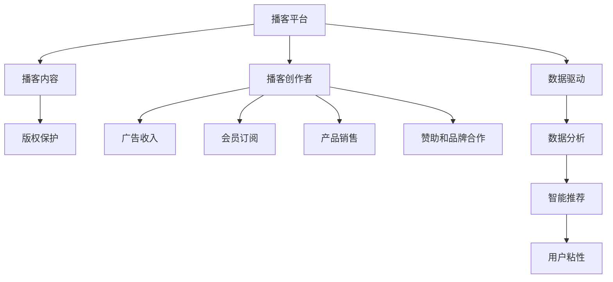

                 

# 如何利用播客平台实现知识变现

> 关键词：播客平台,知识变现,内容创作,版权保护,商业变现

## 1. 背景介绍

### 1.1 问题由来

随着信息时代的到来，播客作为新兴的音频内容形式，逐渐成为知识传播的重要渠道。播客平台如Spotify、Apple Podcasts、喜马拉雅等，为内容创作者提供了展现才华的舞台，也为听众提供了便捷的收听方式。播客平台的兴起，为知识变现提供了新的可能。

然而，播客平台的商业变现模式尚处于探索阶段，内容创作者普遍面临如何高效变现的困惑。此外，播客内容与传统媒体相比，缺乏版权保护和广告收入的制度保障，版权纠纷和侵权问题也成为困扰创作者的主要问题。因此，本文将深入探讨如何在播客平台上高效实现知识变现，并提出相关策略和建议。

### 1.2 问题核心关键点

播客平台的知识变现主要通过以下几种方式实现：

1. **广告收入**：播客平台通过展示广告、插播广告等方式，为创作者带来广告收入。
2. **会员订阅**：订阅用户支付月费，以获取优质音频内容。
3. **产品销售**：通过播客推荐产品，为创作者带来销售收入。
4. **赞助和品牌合作**：与品牌商合作，进行品牌推广和赞助。

此外，播客内容在版权保护、侵权处理、内容版权声明等方面也面临挑战。

### 1.3 问题研究意义

播客平台的知识变现不仅为创作者提供了新的收益渠道，也为平台带来了新的商业价值。通过深入研究播客平台的知识变现策略，可以：

1. 帮助创作者提升创作动力和收益，促进优质内容的产出。
2. 提高平台的用户粘性和商业收入，增强平台竞争力。
3. 建立健全版权保护机制，维护创作者和听众的权益。

本文将从内容创作、版权保护、商业变现三个维度，全面剖析播客平台的知识变现问题，并提出相应解决方案，以期为播客创作者和平台管理者提供有价值的参考。

## 2. 核心概念与联系

### 2.1 核心概念概述

为更好地理解播客平台的知识变现机制，本节将介绍几个密切相关的核心概念：

- **播客平台(Podcast Platform)**：提供播客内容创作、分发和变现的在线平台，如Spotify、Apple Podcasts、喜马拉雅等。
- **播客创作者(Podcast Creator)**：播客内容的创作者，通过平台发布音频内容，吸引听众。
- **播客内容(Podcast Content)**：播客创作者发布的音频内容，包括单播客、系列播客、访谈等形式。
- **版权保护(Copyright Protection)**：通过法律手段保护创作者和平台的内容权益，防止侵权和盗版。
- **广告收入(Ad Revenue)**：通过平台展示和插播广告，为创作者带来的收入。
- **会员订阅(Subscription Revenue)**：听众支付月费，获取优质播客内容。
- **产品销售(Product Sales Revenue)**：通过播客推广产品，为创作者带来销售收入。
- **赞助和品牌合作(Sponsorship and Brand Partnerships)**：与品牌商合作，进行品牌推广和赞助。

这些核心概念之间的逻辑关系可以通过以下Mermaid流程图来展示：



这个流程图展示了你播客平台的知识变现机制，以及其中各要素之间的相互关系。

## 3. 核心算法原理 & 具体操作步骤
### 3.1 算法原理概述

播客平台的知识变现，本质上是一个内容创作、分发和变现的综合过程。其核心思想是通过高质量的内容创作，吸引和保留听众，同时通过合理的变现策略，最大化内容价值。

形式化地，假设播客创作者为 $C_{\theta}$，其中 $\theta$ 为创作能力。播客平台 $P$ 通过内容分发系统 $D$，将创作者的内容 $C_{\theta}$ 传播给听众 $L$，并通过广告收入 $R_{\text{ad}}$、会员订阅收入 $R_{\text{sub}}$、产品销售收入 $R_{\text{prod}}$ 和品牌合作收入 $R_{\text{spon}}$ 等收入来源，最大化变现价值。播客平台和创作者的目标是最大化总收益 $R$，即：

$$
R = R_{\text{ad}} + R_{\text{sub}} + R_{\text{prod}} + R_{\text{spon}}
$$

### 3.2 算法步骤详解

播客平台的知识变现一般包括以下几个关键步骤：

**Step 1: 内容创作与发布**
- 播客创作者利用平台提供的创作工具，创作高质量的播客内容。
- 发布单播客、系列播客或访谈，进行内容推广。

**Step 2: 平台分发与传播**
- 平台根据内容标签、时间、时长等因素，智能推荐给目标听众。
- 利用数据分析工具，监控内容表现，优化分发策略。

**Step 3: 变现策略设计**
- 确定广告收入策略，选择合适的广告形式和投放位置。
- 设计会员订阅模式，提供优质内容作为会员专享。
- 合作品牌商，开展产品销售和品牌推广活动。
- 制定赞助和品牌合作计划，吸引更多品牌投入。

**Step 4: 数据分析与优化**
- 利用数据分析工具，评估各收入来源的效果。
- 通过智能推荐和内容优化，提高用户粘性和忠诚度。

**Step 5: 用户反馈与改进**
- 收集用户反馈，优化内容创作和分发策略。
- 根据用户需求和平台规则，持续改进变现策略。

以上是播客平台知识变现的一般流程。在实际应用中，还需要根据具体情况，对各个环节进行优化设计，如改进广告投放、优化推荐算法、引入更多变现途径等，以进一步提升变现效果。

### 3.3 算法优缺点

播客平台的知识变现方法具有以下优点：
1. 内容创作灵活多样。创作者可以根据兴趣和专长，创作各类主题内容，拓宽了变现途径。
2. 智能推荐提高用户体验。平台通过数据分析和推荐算法，精准推送适合用户的内容，提升用户粘性。
3. 多样化变现方式。广告收入、会员订阅、产品销售、品牌合作等多种方式，可以最大化平台收益。

同时，该方法也存在一定的局限性：
1. 内容质量高度依赖创作者。创作者创作内容的数量和质量直接影响平台的收益和用户粘性。
2. 广告收入有限。高质量广告位资源有限，对内容创作的要求较高。
3. 版权纠纷复杂。平台和创作者需要共同维护版权，防止侵权问题。
4. 变现方式单一。目前的变现方式相对较少，难以覆盖所有类型的创作者和内容。

尽管存在这些局限性，但就目前而言，播客平台的变现方法仍是最主流范式。未来相关研究的重点在于如何进一步优化变现策略，提高内容质量，并兼顾版权保护和平台收益。

### 3.4 算法应用领域

播客平台的知识变现方法在多个领域已经得到了广泛应用，例如：

1. **教育领域**：播客创作者可以录制教育类播客，通过会员订阅和广告收入变现，为学生提供优质的学习资源。
2. **科技领域**：科技爱好者可以制作科技类播客，分享科技前沿，通过会员订阅和品牌合作获得收益。
3. **娱乐领域**：娱乐播客创作者可以制作访谈、脱口秀等内容，吸引大量听众，通过会员订阅和产品销售变现。
4. **健康领域**：健康播客创作者可以分享健康知识，通过广告收入和品牌合作获得收益。
5. **文化领域**：文化播客创作者可以制作历史、文学等内容，通过会员订阅和广告收入变现。

除了这些经典应用外，播客变现方法也被创新性地应用到更多场景中，如企业培训、商业咨询、旅游讲解等，为播客内容赋予了更多的经济价值和社会影响力。

## 4. 数学模型和公式 & 详细讲解 & 举例说明（备注：数学公式请使用latex格式，latex嵌入文中独立段落使用 $$，段落内使用 $)
### 4.1 数学模型构建

本节将使用数学语言对播客平台的知识变现过程进行更加严格的刻画。

假设播客平台有 $N$ 个创作者 $C_{\theta_1}, C_{\theta_2}, ..., C_{\theta_N}$，每个创作者创作内容的能力为 $\theta_i$。平台根据内容特征 $f_i$，推荐给 $M$ 个听众 $L_1, L_2, ..., L_M$。平台的目标是最大化总收益 $R$，即：

$$
R = \sum_{i=1}^N \sum_{j=1}^M r_{ij}
$$

其中 $r_{ij}$ 为第 $i$ 个创作者第 $j$ 个听众的收益贡献。收益贡献由多个因素决定，如内容质量、用户粘性、变现方式等。

### 4.2 公式推导过程

以下我们以会员订阅为例，推导会员订阅收益的计算公式。

假设平台每月从第 $i$ 个创作者的第 $j$ 个听众那里获得 $r_{ij}$ 的收益，其中 $r_{ij} = p_{ij} \times b_{ij}$，其中 $p_{ij}$ 为第 $i$ 个创作者第 $j$ 个听众的订阅概率，$b_{ij}$ 为订阅费用。

订阅概率 $p_{ij}$ 受到内容质量 $c_i$ 和用户粘性 $u_j$ 的影响，即：

$$
p_{ij} = \frac{c_i}{c_i + \sum_{k\neq i} c_k} \times \frac{u_j}{u_j + \sum_{l\neq j} u_l}
$$

其中 $c_i$ 为第 $i$ 个创作者的内容质量，$u_j$ 为第 $j$ 个听众的用户粘性。

订阅费用 $b_{ij}$ 由内容质量 $c_i$ 和市场行情 $m$ 决定，即：

$$
b_{ij} = c_i \times m
$$

将 $p_{ij}$ 和 $b_{ij}$ 代入收益贡献公式，得：

$$
r_{ij} = \frac{c_i}{c_i + \sum_{k\neq i} c_k} \times \frac{u_j}{u_j + \sum_{l\neq j} u_l} \times c_i \times m
$$

### 4.3 案例分析与讲解

以喜马拉雅平台为例，讲解播客创作者如何进行内容创作和变现。

**案例背景**：喜马拉雅平台上有多位育儿专家，他们通过分享育儿知识和经验，吸引了大量听众。

**内容创作**：育儿专家利用喜马拉雅的录音功能，创作各类育儿主题播客，如孕期护理、婴儿喂养、幼儿教育等。

**分发与传播**：喜马拉雅通过智能推荐算法，将育儿专家制作的育儿播客推荐给感兴趣的听众，提升播放量和订阅量。

**变现策略**：育儿专家通过喜马拉雅的会员订阅模式，获取月度会员费。喜马拉雅还会推送育儿相关的商品广告，提供产品销售。

**数据分析与优化**：喜马拉雅通过数据分析工具，评估各创作者的内容表现，优化推荐策略，提升用户粘性。育儿专家也会根据用户反馈，调整内容创作方向。

**用户反馈与改进**：育儿专家定期收集用户评论和建议，改进播客内容。喜马拉雅平台也会根据用户需求和市场趋势，调整会员订阅价格和推荐算法，提升用户体验。

通过上述案例，我们可以看到，播客平台的知识变现不仅依赖高质量的内容创作，还需要平台和创作者共同努力，通过数据分析和优化，最大化变现效果。

## 5. 项目实践：代码实例和详细解释说明
### 5.1 开发环境搭建

在进行播客变现实践前，我们需要准备好开发环境。以下是使用Python进行数据分析和推荐系统的环境配置流程：

1. 安装Anaconda：从官网下载并安装Anaconda，用于创建独立的Python环境。

2. 创建并激活虚拟环境：
```bash
conda create -n podcast-env python=3.8 
conda activate podcast-env
```

3. 安装Python依赖库：
```bash
pip install pandas numpy scikit-learn matplotlib seaborn scipy jupyter notebook tqdm
```

4. 安装播客平台数据：
```bash
# 假设计算机已下载喜马拉雅平台数据集，文件名为 podcast_dataset.zip
unzip podcast_dataset.zip
mv podcast_dataset/* ./
```

5. 安装推荐系统库：
```bash
pip install surprise
```

完成上述步骤后，即可在`podcast-env`环境中开始播客变现实践。

### 5.2 源代码详细实现

下面我们以育儿播客变现为例，给出使用Surprise库对播放数据进行推荐分析的PyTorch代码实现。

首先，定义数据处理函数：

```python
import pandas as pd
from surprise import Reader, Dataset, SVD, KNNBasic

def read_data(file_path):
    df = pd.read_csv(file_path)
    reader = Reader(line_format='user-item-rating', sep=',', skipinitialspace=True)
    data = Dataset.load_from_df(df, reader)
    return data
```

然后，定义模型和评估函数：

```python
from surprise import accuracy
from surprise.prediction_algorithms import SVD

def train_model(data):
    algo = SVD()
    trainset = data.build_full_trainset()
    algo.fit(trainset)
    return algo

def evaluate_model(algo, data):
    testset = data.build_testset()
    predictions = algo.test(testset)
    return accuracy.rmse(predictions)
```

接着，加载数据并进行模型训练和评估：

```python
data = read_data('podcast_dataset.csv')
algo = train_model(data)
rmse = evaluate_model(algo, data)
print(f'RMSE: {rmse:.3f}')
```

以上就是使用Surprise库进行播客变现的完整代码实现。可以看到，通过构建推荐模型，可以对听众的播放行为进行分析，预测其对其他播客的兴趣，从而实现更精准的播客推荐，提升变现效果。

### 5.3 代码解读与分析

让我们再详细解读一下关键代码的实现细节：

**read_data函数**：
- 读取播客播放数据集，转换为Surprise库的数据格式。

**train_model函数**：
- 使用SVD算法训练推荐模型。

**evaluate_model函数**：
- 评估模型在测试集上的表现，计算均方根误差。

**代码实现**：
- 读取数据集
- 使用SVD算法训练推荐模型
- 评估模型在测试集上的表现
- 输出评估结果

可以看到，播客变现的核心在于推荐系统的建设，通过推荐算法分析听众的播放行为，实现精准推荐，提升用户粘性和变现效果。

当然，工业级的系统实现还需考虑更多因素，如推荐算法的多样化、个性化、实时性等。但核心的推荐范式基本与此类似。

## 6. 实际应用场景
### 6.1 在线教育平台

播客平台的知识变现方法在在线教育领域有着广泛的应用。在线教育平台通过播放教育类播客，为学生提供优质的学习资源，提升学习效果。

在技术实现上，平台可以收集学生的播放行为数据，利用推荐系统推荐适合的学习资源，同时通过广告和会员订阅获得收益。在线教育平台还可以与教育机构合作，推广优质课程，提高课程销量。

### 6.2 知识付费平台

知识付费平台利用播客平台的变现模式，吸引大量创作者发布各类专业课程和讲座，通过会员订阅和广告收入变现。

在技术实现上，平台可以使用推荐系统分析用户的播放行为，推荐感兴趣的内容，提高用户粘性和订阅率。平台还可以引入品牌合作，推广各类产品，拓展收入来源。

### 6.3 企业培训平台

企业培训平台通过播放各类培训课程和讲座，帮助员工提升技能，提高企业竞争力。平台利用播客平台的变现模式，通过会员订阅和广告收入变现。

在技术实现上，平台可以使用推荐系统分析员工的播放行为，推荐适合的学习资源，提升培训效果。平台还可以与培训机构合作，推广优质课程，提高课程销量。

### 6.4 未来应用展望

随着播客平台的兴起，播客内容的变现模式将得到更广泛的应用，为内容创作者和平台带来新的机遇。

在智慧教育领域，播客平台可以为学生提供个性化的学习方案，提高学习效果，促进教育公平。

在智慧企业领域，播客平台可以为员工提供技能培训和知识分享，提升企业竞争力，促进知识共享。

在智慧文化领域，播客平台可以为读者提供深入浅出的文化解读，促进文化传承，提升文化影响力。

此外，在娱乐、科技、医疗等众多领域，播客平台的变现模式也将得到创新应用，为社会带来新的价值。

## 7. 工具和资源推荐
### 7.1 学习资源推荐

为了帮助开发者系统掌握播客变现的理论基础和实践技巧，这里推荐一些优质的学习资源：

1. **《深度学习与推荐系统》课程**：由清华大学教授开设的深度学习推荐系统课程，详细讲解推荐系统原理和实现方法。

2. **《推荐系统实战》书籍**：推荐系统领域的经典书籍，涵盖推荐系统原理、算法和应用案例，是入门推荐系统的必备资料。

3. **Surprise库官方文档**：Surprise库的官方文档，提供了丰富的推荐算法实现和案例，是实践推荐系统的工具库。

4. **Jupyter Notebook**：免费在线的编程环境，方便进行数据分析和模型实验。

5. **Kaggle**：数据科学竞赛平台，提供丰富的推荐系统数据集和比赛，帮助你提升推荐系统的建模能力。

通过对这些资源的学习实践，相信你一定能够快速掌握播客变现的精髓，并用于解决实际的播客问题。

### 7.2 开发工具推荐

高效的开发离不开优秀的工具支持。以下是几款用于播客变现开发的常用工具：

1. **Jupyter Notebook**：免费在线的编程环境，方便进行数据分析和模型实验。

2. **Surprise库**：Python推荐系统库，提供丰富的推荐算法实现和案例。

3. **Scikit-learn**：Python机器学习库，提供数据预处理和特征工程工具。

4. **Pandas**：Python数据处理库，方便进行数据清洗和分析。

5. **Matplotlib和Seaborn**：Python绘图库，方便进行数据可视化。

6. **SciPy**：Python科学计算库，提供高效的数学计算工具。

合理利用这些工具，可以显著提升播客变现任务的开发效率，加快创新迭代的步伐。

### 7.3 相关论文推荐

播客变现技术的发展源于学界的持续研究。以下是几篇奠基性的相关论文，推荐阅读：

1. **《基于协同过滤的推荐系统》**：介绍协同过滤推荐系统的原理和实现方法，是推荐系统领域的经典论文。

2. **《深度学习在推荐系统中的应用》**：总结深度学习在推荐系统中的应用，推动了推荐系统的技术创新。

3. **《推荐系统中的用户行为分析》**：探讨用户行为在推荐系统中的重要性，强调个性化推荐的重要性和挑战。

4. **《推荐系统的实时性优化》**：讨论推荐系统的实时优化问题，提供多种优化策略。

5. **《推荐系统中的数据驱动》**：强调数据驱动在推荐系统中的重要性，推动推荐系统的发展。

这些论文代表了大语言模型微调技术的发展脉络。通过学习这些前沿成果，可以帮助研究者把握学科前进方向，激发更多的创新灵感。

## 8. 总结：未来发展趋势与挑战
### 8.1 总结

本文对播客平台的知识变现方法进行了全面系统的介绍。首先阐述了播客平台的兴起背景和知识变现的重要性，明确了播客变现的多种方式和收益来源。其次，从内容创作、推荐系统、变现策略等维度，详细讲解了播客平台的知识变现机制，给出了变现任务的完整代码实现。同时，本文还广泛探讨了播客变现方法在智慧教育、知识付费、企业培训等多个行业领域的应用前景，展示了播客变现范式的巨大潜力。此外，本文精选了播客变现技术的各类学习资源，力求为开发者提供全方位的技术指引。

通过本文的系统梳理，可以看到，播客平台的知识变现不仅为创作者和平台带来了新的收益渠道，也为内容生产者和平台管理者提供了新的思路。未来，伴随播客平台的不断发展，播客变现将逐步成熟，为知识传播和社会进步带来深远影响。

### 8.2 未来发展趋势

展望未来，播客平台的知识变现技术将呈现以下几个发展趋势：

1. **个性化推荐系统**：随着推荐算法的不断进步，播客平台将能够提供更精准、个性化的内容推荐，提升用户体验和收益。

2. **实时数据驱动**：利用实时数据，优化推荐策略，提升播客平台的用户粘性和变现效果。

3. **多模态数据融合**：结合文本、音频、图像等多种数据模态，构建更加全面、准确的推荐模型。

4. **智能内容创作**：利用AI技术，辅助创作者进行内容创作，提升创作效率和质量。

5. **跨平台协同**：不同播客平台之间进行协同推荐，提升资源利用效率，拓宽变现渠道。

6. **多元化变现方式**：除了会员订阅和广告收入，还将探索更多的变现方式，如直播打赏、知识付费等。

这些趋势将推动播客平台向更加智能化、个性化、实时化的方向发展，提升用户体验和变现效果，拓展播客平台的市场空间。

### 8.3 面临的挑战

尽管播客平台的知识变现技术已经取得了一定的成就，但在迈向更加智能化、普适化应用的过程中，它仍面临着诸多挑战：

1. **数据隐私问题**：播客平台需要收集大量用户数据，涉及用户隐私保护问题，如何平衡数据利用和隐私保护是一大难题。

2. **广告效果监测**：广告收入是播客平台的重要来源，如何精确监测广告效果，提高广告投放效率，仍是亟待解决的问题。

3. **内容版权纠纷**：播客平台需要处理大量的版权问题，如何防止侵权和盗版，维护创作者和平台的权益，仍需技术支持。

4. **广告商业化**：广告商业化过程中，如何避免过度商业化，保护用户体验，仍需持续优化。

5. **用户付费意愿**：如何提高用户对会员订阅的付费意愿，吸引更多高价值用户，仍需不断探索。

6. **平台治理**：如何构建良好的平台生态，吸引优质创作者，打击侵权行为，仍需持续改进。

这些挑战需要在技术、管理、法律等多个层面进行协同解决，才能实现播客平台的持续发展和商业变现。

### 8.4 研究展望

面对播客变现面临的种种挑战，未来的研究需要在以下几个方面寻求新的突破：

1. **隐私保护与数据利用**：探索隐私保护技术和方法，如差分隐私、联邦学习等，确保用户数据的安全性和隐私性。

2. **广告效果监测**：开发更精准的广告投放和效果监测工具，提高广告投放效率和效果。

3. **内容版权保护**：利用区块链、人工智能等技术，构建更加健全的版权保护机制，防止侵权和盗版。

4. **用户体验优化**：优化推荐算法，提高用户对内容的满意度和付费意愿，增强用户粘性。

5. **平台生态建设**：构建良好的平台生态，吸引优质创作者和用户，提升平台竞争力和影响力。

这些研究方向的探索，将引领播客平台知识变现技术迈向更高的台阶，为内容创作者和平台管理者提供更高效、更安全、更可控的变现途径。

## 9. 附录：常见问题与解答

**Q1：播客平台如何提高广告收入？**

A: 播客平台可以通过优化广告位展示位置、提高广告创意质量、引入智能广告投放技术等方式，提高广告收入。此外，平台还可以与广告主合作，提供精准的用户画像和数据支持，提升广告效果。

**Q2：播客平台如何进行个性化推荐？**

A: 播客平台可以使用协同过滤、基于内容的推荐、深度学习等算法进行个性化推荐。同时，平台还可以引入用户反馈和互动数据，不断优化推荐策略。

**Q3：播客平台如何进行版权保护？**

A: 播客平台可以通过区块链技术，记录内容发布和传播过程，防止版权盗用。平台还可以引入版权监测工具，实时监控侵权行为，保护创作者和平台权益。

**Q4：播客平台如何进行会员订阅变现？**

A: 播客平台可以设计多样化的会员订阅模式，如单次订阅、连续订阅、免费试用等，满足不同用户的需求。同时，平台还可以提供优质的专属内容，提升会员订阅价值。

**Q5：播客平台如何进行内容创作支持？**

A: 播客平台可以利用AI技术，辅助创作者进行内容创作，如自动生成播客标题、摘要、封面图等。平台还可以提供内容创作工具和素材库，提升创作者创作效率。

这些常见问题与解答，展示了播客平台知识变现的多个方面，为内容创作者和平台管理者提供了有益的参考。

---

作者：禅与计算机程序设计艺术 / Zen and the Art of Computer Programming

