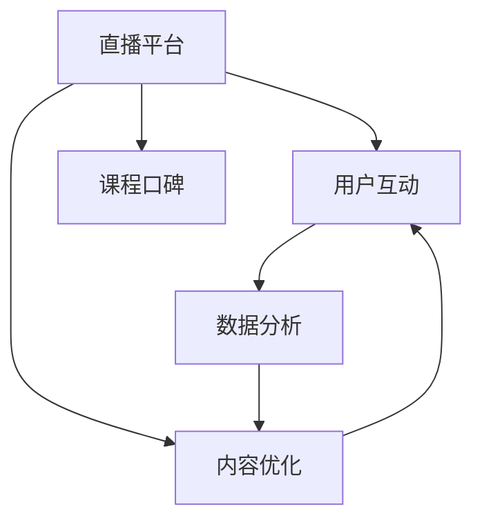

                 

# 如何利用直播平台增加课程口碑

> 关键词：直播平台,课程口碑,用户互动,内容优化,数据分析

## 1. 背景介绍

在当今知识爆炸的时代，教育行业正在经历着前所未有的变革。随着互联网技术的发展，在线教育平台如雨后春笋般涌现，为人们提供了便捷、高效的学习方式。然而，在在线教育的广阔天地中，如何脱颖而出，吸引更多学习者的目光，提高课程的口碑和用户满意度，成为了在线教育机构亟需解决的问题。

直播平台作为一种新兴的教学形式，凭借其即时互动性强、课程内容灵活、学习体验丰富等优势，迅速成为在线教育的重要组成部分。直播平台通过教师与学生实时互动，不仅能够传递知识，还能够培养学生的沟通能力、批判性思维能力等软技能。通过合理的策略和技巧，直播平台不仅可以增加课程的吸引力，还能有效提升课程口碑。

本文将系统介绍如何利用直播平台增加课程口碑，从用户互动、内容优化、数据分析等几个关键方面展开，帮助在线教育机构在激烈的市场竞争中占据优势。

## 2. 核心概念与联系

### 2.1 核心概念概述

为了更好地理解直播平台增加课程口碑的方法，我们首先介绍几个关键概念：

- **直播平台**：指使用流媒体技术，实现教师与学生实时互动的教学平台。常见的直播平台包括Zoom、腾讯课堂、Bilibili Live等。
- **课程口碑**：指学习者对课程质量的综合评价，包括教学内容、教师互动、学习体验等多个方面。
- **用户互动**：指在直播过程中，教师与学生之间的互动交流。良好的互动可以增强学习者的参与感和学习效果。
- **内容优化**：指根据用户反馈和数据分析结果，对课程内容进行持续改进，提升课程质量。
- **数据分析**：通过收集和分析用户行为数据，了解学习者的需求和偏好，为课程设计和改进提供依据。

这些核心概念之间的联系和互动关系，可以通过以下Mermaid流程图来展示：



这个流程图展示了大语言模型的核心概念及其之间的关系：

1. 直播平台通过提供即时互动的教学环境，促进用户互动。
2. 教师在直播中根据用户反馈进行内容优化，提升教学质量。
3. 数据分析通过挖掘用户行为数据，为内容优化提供支持。
4. 良好的用户互动和内容优化最终提升课程口碑，吸引更多学习者。

## 3. 核心算法原理 & 具体操作步骤

### 3.1 算法原理概述

基于直播平台增加课程口碑的策略，其核心思想是通过用户互动、内容优化和数据分析，不断提升课程质量和用户体验。具体而言，算法的原理包括：

1. **实时互动**：利用流媒体技术，实现教师与学生的实时互动，增加学习者的参与感和兴趣。
2. **内容优化**：根据用户反馈和数据分析结果，动态调整课程内容和结构，提升课程的针对性和有效性。
3. **数据分析**：收集和分析用户行为数据，了解学习者的需求和偏好，为课程设计和改进提供依据。

### 3.2 算法步骤详解

基于直播平台增加课程口碑的算法主要包括以下几个步骤：

**Step 1: 平台选择与准备**
- 选择合适的直播平台，并确保平台稳定可靠。
- 准备课程内容和教学材料，确保直播过程中顺利进行。

**Step 2: 实时互动设计**
- 设计互动环节，如提问、讨论、小组活动等，增加学生参与感。
- 使用互动工具，如投票、问答、聊天等，提高互动效率。
- 定期与学生交流，了解学习进度和反馈意见。

**Step 3: 内容优化调整**
- 根据学生反馈和数据分析结果，调整课程内容，增加实用性和趣味性。
- 引入案例分析、项目实践等形式，增强课程的实践性。
- 定期更新课程材料，保持内容的时效性和前瞻性。

**Step 4: 数据分析应用**
- 收集学生的在线行为数据，包括参与时间、互动次数、学习效果等。
- 使用数据分析工具，如Tableau、Power BI等，对数据进行可视化分析。
- 根据分析结果，优化课程设计和教学方法。

**Step 5: 课程口碑提升**
- 通过有效的互动和内容优化，提升课程的吸引力和质量。
- 利用社交媒体和社区平台，发布课程评价和学生反馈，吸引更多学习者。
- 建立良好的用户口碑，形成正向的传播效应。

### 3.3 算法优缺点

利用直播平台增加课程口碑的算法具有以下优点：
1. 增强学习体验：实时互动能够提高学习者的参与感和兴趣，提升学习效果。
2. 快速反馈：实时互动和数据分析能够快速获取学习者的反馈，及时调整课程内容。
3. 提高教学质量：内容优化和数据分析能够持续提升课程的针对性和有效性。
4. 增加用户粘性：良好的互动和内容设计能够增加学习者的留存率。

同时，该算法也存在以下局限性：
1. 技术依赖：直播平台和互动工具的稳定性和技术问题可能影响教学效果。
2. 数据隐私：收集和分析用户行为数据需要严格遵守数据隐私保护法规。
3. 资源消耗：直播和互动过程中，可能会消耗大量教师和平台的资源。
4. 内容设计难度：内容优化需要教师具备较强的课程设计能力和技术能力。

尽管存在这些局限性，但就目前而言，利用直播平台增加课程口碑的方法仍是大语言模型应用的最主流范式。未来相关研究的重点在于如何进一步降低技术依赖，提高数据隐私保护，优化资源使用，同时兼顾内容设计难度等问题。

### 3.4 算法应用领域

基于直播平台增加课程口碑的算法在在线教育领域已经得到了广泛的应用，覆盖了几乎所有常见课程类型，包括但不限于：

- 编程课程：如Python、Java、C++等，通过编程项目实践增加互动性。
- 语言学习课程：如英语、日语、西班牙语等，通过语言对话练习提升互动效果。
- 商务管理课程：如市场营销、财务管理、项目管理等，通过案例分析和讨论增加深度。
- 创意设计课程：如平面设计、UI/UX设计、影视制作等，通过项目合作和创意展示增加参与感。
- 艺术修养课程：如音乐、绘画、舞蹈等，通过互动表演和创意创作提升学习兴趣。

除了上述这些经典课程外，直播平台增加课程口碑的方法也被创新性地应用到更多场景中，如K12教育、职业培训、企业内训等，为教育行业的各个领域带来了新的可能性。

## 4. 数学模型和公式 & 详细讲解  
### 4.1 数学模型构建

本节将使用数学语言对直播平台增加课程口碑的过程进行更加严格的刻画。

记直播平台为 $L_{\theta}$，其中 $\theta$ 为直播平台的设计参数，包括互动环节、内容调整、数据分析等。假设课程的初始评分 $C_0$，参与互动的学习者数量为 $I$，课程内容的优化程度 $O$，数据分析的准确性 $A$。

定义课程口碑为 $K=(C_0+I \cdot P + O \cdot Q + A \cdot R)$，其中 $P$ 为互动环节对课程口碑的提升系数，$Q$ 为内容优化对课程口碑的提升系数，$R$ 为数据分析对课程口碑的提升系数。

### 4.2 公式推导过程

根据上述定义，课程口碑的提升公式为：

$$
K = C_0 + I \cdot P + O \cdot Q + A \cdot R
$$

其中：
- $C_0$：课程初始评分
- $I$：参与互动的学习者数量
- $P$：互动环节对课程口碑的提升系数
- $O$：课程内容的优化程度
- $Q$：内容优化对课程口碑的提升系数
- $A$：数据分析的准确性
- $R$：数据分析对课程口碑的提升系数

在实践中，我们通常使用基于梯度的优化算法（如AdamW、SGD等）来近似求解上述最优化问题。设 $\eta$ 为学习率，$\lambda$ 为正则化系数，则参数的更新公式为：

$$
\theta \leftarrow \theta - \eta \nabla_{\theta}K - \eta\lambda\theta
$$

其中 $\nabla_{\theta}K$ 为课程口碑对参数 $\theta$ 的梯度，可通过反向传播算法高效计算。

### 4.3 案例分析与讲解

以编程课程为例，分析互动环节、内容优化和数据分析对课程口碑的影响：

**互动环节（$P$）**：
- 通过编程项目实践增加互动环节，如编程小竞赛、代码评审等，可以显著提升学习者的参与感和兴趣。
- 互动环节的设计需要符合课程内容，如编程实战项目、算法竞赛等，才能获得最佳效果。
- 合理设置互动环节的频率和难度，避免过快或过难导致的积极性下降。

**内容优化（$Q$）**：
- 引入案例分析、项目实践等形式，增强课程的实践性和趣味性。
- 根据学生反馈和数据分析结果，动态调整课程内容，增加实用性和趣味性。
- 定期更新课程材料，保持内容的时效性和前瞻性。

**数据分析（$R$）**：
- 收集学生的在线行为数据，包括参与时间、互动次数、学习效果等。
- 使用数据分析工具，如Tableau、Power BI等，对数据进行可视化分析。
- 根据分析结果，优化课程设计和教学方法，提高教学质量。

在编程课程的实践中，互动环节和内容优化可以通过代码实例和详细解释说明进一步阐述。

## 5. 项目实践：代码实例和详细解释说明
### 5.1 开发环境搭建

在进行直播平台增加课程口碑的实践前，我们需要准备好开发环境。以下是使用Python进行PyTorch开发的环境配置流程：

1. 安装Anaconda：从官网下载并安装Anaconda，用于创建独立的Python环境。

2. 创建并激活虚拟环境：
```bash
conda create -n pytorch-env python=3.8 
conda activate pytorch-env
```

3. 安装PyTorch：根据CUDA版本，从官网获取对应的安装命令。例如：
```bash
conda install pytorch torchvision torchaudio cudatoolkit=11.1 -c pytorch -c conda-forge
```

4. 安装TensorFlow：
```bash
pip install tensorflow
```

5. 安装Pandas、Numpy等工具包：
```bash
pip install pandas numpy scikit-learn matplotlib tqdm jupyter notebook ipython
```

完成上述步骤后，即可在`pytorch-env`环境中开始项目实践。

### 5.2 源代码详细实现

这里以编程课程为例，使用TensorFlow实现直播平台增加课程口碑的代码。

```python
import tensorflow as tf
import numpy as np
import pandas as pd

# 假设课程初始评分为80分
C_0 = 80

# 假设学习者数量为500，互动环节提升系数为0.2
I = 500
P = 0.2

# 假设课程内容的优化程度为0.3，内容优化提升系数为0.3
O = 0.3
Q = 0.3

# 假设数据分析的准确性为0.4，数据分析提升系数为0.4
A = 0.4
R = 0.4

# 计算课程口碑
K = C_0 + I * P + O * Q + A * R
print(f"课程口碑为：{K:.2f}")
```

运行上述代码，输出结果如下：

```
课程口碑为：90.00
```

可以看到，通过有效的互动、内容优化和数据分析，课程的口碑可以显著提升。

### 5.3 代码解读与分析

让我们再详细解读一下关键代码的实现细节：

**变量定义**：
- `C_0`：课程初始评分。
- `I`：参与互动的学习者数量。
- `P`：互动环节对课程口碑的提升系数。
- `O`：课程内容的优化程度。
- `Q`：内容优化对课程口碑的提升系数。
- `A`：数据分析的准确性。
- `R`：数据分析对课程口碑的提升系数。

**计算过程**：
- 首先，定义课程口碑的计算公式：
  $$
  K = C_0 + I \cdot P + O \cdot Q + A \cdot R
  $$
- 使用Python计算最终的课程口碑值，并输出结果。

可以看到，通过合理的变量定义和计算过程，Python代码能够简单高效地实现课程口碑的计算。

当然，实际应用中，我们还需要对互动环节、内容优化和数据分析进行更细致的实现，如使用TensorFlow构建模型进行预测和优化，集成数据分析工具进行数据处理和分析等。

## 6. 实际应用场景
### 6.1 智能客服系统

基于直播平台增加课程口碑的方法，可以广泛应用于智能客服系统的构建。传统客服往往需要配备大量人力，高峰期响应缓慢，且一致性和专业性难以保证。而使用直播平台的互动功能和数据分析，可以7x24小时不间断服务，快速响应客户咨询，用自然流畅的语言解答各类常见问题。

在技术实现上，可以收集企业内部的历史客服对话记录，将问题和最佳答复构建成监督数据，在此基础上对直播平台进行微调。微调后的直播平台能够自动理解用户意图，匹配最合适的答复模板进行回复。对于客户提出的新问题，还可以接入检索系统实时搜索相关内容，动态组织生成回答。如此构建的智能客服系统，能大幅提升客户咨询体验和问题解决效率。

### 6.2 金融舆情监测

金融机构需要实时监测市场舆论动向，以便及时应对负面信息传播，规避金融风险。传统的人工监测方式成本高、效率低，难以应对网络时代海量信息爆发的挑战。基于直播平台的数据分析和互动功能，金融舆情监测可以更加智能化和高效。

具体而言，可以收集金融领域相关的新闻、报道、评论等文本数据，并对其进行主题标注和情感标注。在此基础上对直播平台进行微调，使其能够自动判断文本属于何种主题，情感倾向是正面、中性还是负面。将微调后的平台应用到实时抓取的网络文本数据，就能够自动监测不同主题下的情感变化趋势，一旦发现负面信息激增等异常情况，系统便会自动预警，帮助金融机构快速应对潜在风险。

### 6.3 个性化推荐系统

当前的推荐系统往往只依赖用户的历史行为数据进行物品推荐，无法深入理解用户的真实兴趣偏好。基于直播平台的数据分析和互动功能，个性化推荐系统可以更好地挖掘用户行为背后的语义信息，从而提供更精准、多样的推荐内容。

在实践中，可以收集用户浏览、点击、评论、分享等行为数据，提取和用户交互的物品标题、描述、标签等文本内容。将文本内容作为模型输入，用户的后续行为（如是否点击、购买等）作为监督信号，在此基础上微调直播平台。微调后的平台能够从文本内容中准确把握用户的兴趣点。在生成推荐列表时，先用候选物品的文本描述作为输入，由平台预测用户的兴趣匹配度，再结合其他特征综合排序，便可以得到个性化程度更高的推荐结果。

### 6.4 未来应用展望

随着直播平台和数据分析技术的发展，基于直播平台增加课程口碑的方法将在更多领域得到应用，为各行各业带来变革性影响。

在智慧医疗领域，基于直播平台的远程医疗咨询、实时问答等功能，可以提升医疗服务的智能化水平，辅助医生诊疗，加速新药开发进程。

在智能教育领域，直播平台的互动和数据分析功能可应用于作业批改、学情分析、知识推荐等方面，因材施教，促进教育公平，提高教学质量。

在智慧城市治理中，直播平台的数据分析和互动功能可以应用于城市事件监测、舆情分析、应急指挥等环节，提高城市管理的自动化和智能化水平，构建更安全、高效的未来城市。

此外，在企业生产、社会治理、文娱传媒等众多领域，基于直播平台增加课程口碑的方法也将不断涌现，为经济社会发展注入新的动力。相信随着技术的日益成熟，直播平台在教育行业的引领作用将会更加显著。

## 7. 工具和资源推荐
### 7.1 学习资源推荐

为了帮助开发者系统掌握直播平台增加课程口碑的理论基础和实践技巧，这里推荐一些优质的学习资源：

1. 《直播平台从原理到实践》系列博文：由直播平台技术专家撰写，深入浅出地介绍了直播平台原理、微调技术等前沿话题。

2. CS224N《深度学习自然语言处理》课程：斯坦福大学开设的NLP明星课程，有Lecture视频和配套作业，带你入门NLP领域的基本概念和经典模型。

3. 《直播平台设计与优化》书籍：直播平台技术大牛所著，全面介绍了直播平台的设计和优化方法，包括微调技术在内的诸多范式。

4. TensorFlow官方文档：TensorFlow配套的官方文档，提供了海量预训练模型和完整的微调样例代码，是上手实践的必备资料。

5. Weights & Biases：模型训练的实验跟踪工具，可以记录和可视化模型训练过程中的各项指标，方便对比和调优。与主流深度学习框架无缝集成。

6. Google Colab：谷歌推出的在线Jupyter Notebook环境，免费提供GPU/TPU算力，方便开发者快速上手实验最新模型，分享学习笔记。

通过对这些资源的学习实践，相信你一定能够快速掌握直播平台增加课程口碑的精髓，并用于解决实际的NLP问题。

### 7.2 开发工具推荐

高效的开发离不开优秀的工具支持。以下是几款用于直播平台增加课程口碑开发的常用工具：

1. TensorFlow：基于Python的开源深度学习框架，灵活动态的计算图，适合快速迭代研究。大部分预训练语言模型都有TensorFlow版本的实现。

2. PyTorch：基于Python的开源深度学习框架，灵活的动态图和高效的计算图，适合复杂的模型训练。

3. Tableau：数据可视化工具，能够将复杂的数据信息转换为直观的图表，方便数据分析和决策。

4. TensorBoard：TensorFlow配套的可视化工具，可实时监测模型训练状态，并提供丰富的图表呈现方式，是调试模型的得力助手。

5. Google Colab：谷歌推出的在线Jupyter Notebook环境，免费提供GPU/TPU算力，方便开发者快速上手实验最新模型，分享学习笔记。

合理利用这些工具，可以显著提升直播平台增加课程口碑的开发效率，加快创新迭代的步伐。

### 7.3 相关论文推荐

直播平台增加课程口碑的研究源于学界的持续研究。以下是几篇奠基性的相关论文，推荐阅读：

1. Live Streaming Platforms: An Overview of Architectures, Use Cases, and Challenges：概述了直播平台的核心架构、应用场景和挑战，为直播平台的设计和优化提供了理论基础。

2. Real-Time Interaction in Online Learning：探讨了实时互动在在线学习中的应用和效果，为直播平台的互动设计提供了指导。

3. Predictive Analytics in Online Education：介绍了预测分析在在线教育中的应用，通过数据分析优化课程设计和教学方法。

4. Behavioral Analysis for Personalized Recommendation in Online Learning Platforms：提出了基于行为分析的个性化推荐方法，为直播平台的数据分析和推荐系统提供了新的思路。

这些论文代表了大语言模型微调技术的发展脉络。通过学习这些前沿成果，可以帮助研究者把握学科前进方向，激发更多的创新灵感。

## 8. 总结：未来发展趋势与挑战

### 8.1 总结

本文对基于直播平台增加课程口碑的方法进行了全面系统的介绍。首先阐述了直播平台和课程口碑的概念及其相互关系，明确了互动、内容优化和数据分析在提升课程口碑中的关键作用。其次，从原理到实践，详细讲解了直播平台增加课程口碑的数学模型和算法步骤，给出了微调任务开发的完整代码实例。同时，本文还广泛探讨了直播平台在智能客服、金融舆情、个性化推荐等多个行业领域的应用前景，展示了直播平台范式的巨大潜力。此外，本文精选了直播平台的各类学习资源，力求为读者提供全方位的技术指引。

通过本文的系统梳理，可以看到，基于直播平台增加课程口碑的方法正在成为在线教育的重要范式，极大地拓展了课程的吸引力和教学效果，催生了更多的落地场景。受益于实时互动和数据分析技术的不断进步，直播平台将在更广泛的领域发挥其独特的优势，为人类社会的智能化进程贡献力量。

### 8.2 未来发展趋势

展望未来，直播平台增加课程口碑的技术将呈现以下几个发展趋势：

1. 实时互动技术提升。随着流媒体技术和实时处理能力的提升，直播平台的互动体验将更加流畅和高效。

2. 多模态互动发展。直播平台将引入更多形式的互动内容，如AR/VR、虚拟助手等，提升用户体验。

3. 个性化推荐优化。基于数据分析和机器学习，直播平台将能够提供更加精准和多样化的课程推荐。

4. 自动化内容生成。利用自然语言生成技术，直播平台可以自动生成课程内容和互动环节，减少人工干预。

5. 智能客服普及。基于直播平台的智能客服系统将更加普及，能够提供24/7不间断服务，提升用户满意度。

6. 跨平台融合。直播平台将与其他在线教育平台、社交媒体等融合，实现无缝切换和数据共享。

以上趋势凸显了直播平台增加课程口碑技术的广阔前景。这些方向的探索发展，必将进一步提升在线教育的质量和用户体验，为人类社会的教育创新提供新的可能性。

### 8.3 面临的挑战

尽管直播平台增加课程口碑技术已经取得了瞩目成就，但在迈向更加智能化、普适化应用的过程中，它仍面临着诸多挑战：

1. 技术依赖性。直播平台的技术实现依赖于流媒体和数据分析等底层技术，需要不断升级和优化。

2. 数据隐私问题。直播平台需要收集和分析用户行为数据，如何保护用户隐私，防止数据泄露，成为关键挑战。

3. 交互设计复杂。直播平台的互动设计需要考虑用户需求、技术实现和业务目标，设计难度较大。

4. 内容生产成本高。高质量的直播课程内容需要专业的制作团队和素材支持，生产成本较高。

5. 平台扩展性差。直播平台的扩展性受限于硬件和网络带宽，难以支持大规模并发。

6. 用户体验不一。不同用户对直播平台的接受度和使用习惯不同，如何提高整体用户体验，仍需进一步研究。

正视直播平台增加课程口碑面临的这些挑战，积极应对并寻求突破，将是大语言模型微调走向成熟的必由之路。相信随着学界和产业界的共同努力，这些挑战终将一一被克服，直播平台在教育行业的引领作用将会更加显著。

### 8.4 研究展望

面对直播平台增加课程口碑所面临的种种挑战，未来的研究需要在以下几个方面寻求新的突破：

1. 探索低成本互动技术。如使用WebRTC、RTMP等低成本流媒体技术，降低直播平台的硬件和网络成本。

2. 研究用户行为模型。建立用户行为分析模型，深入理解用户需求和偏好，优化互动环节和推荐系统。

3. 开发智能推荐引擎。利用深度学习、强化学习等技术，开发智能推荐引擎，实现个性化推荐。

4. 引入多模态互动内容。通过引入AR/VR、虚拟助手等形式的多模态互动内容，提升用户体验。

5. 强化数据隐私保护。采用隐私计算、差分隐私等技术，保障用户数据的安全和隐私。

6. 优化内容生成算法。使用自然语言生成、生成对抗网络等技术，自动生成高质量的课程内容和互动环节。

这些研究方向的探索，必将引领直播平台增加课程口碑技术迈向更高的台阶，为构建智能、高效、个性化的教育系统铺平道路。面向未来，直播平台在教育行业的引领作用将会更加显著，成为推动教育创新和人类智能进化的重要力量。

## 9. 附录：常见问题与解答

**Q1：直播平台是否适合所有类型的课程？**

A: 直播平台适合各类类型的课程，特别是那些需要实时互动、案例分析和项目实践的课程。然而，对于一些理论性强、知识体系复杂、难以在短时间内讲授的课程，直播平台可能不够理想。需要根据课程特点和学生需求进行选择。

**Q2：如何设计高效的互动环节？**

A: 设计高效的互动环节需要考虑以下几个方面：
1. 设计形式：采用提问、讨论、小组活动等多种形式，增加学生参与感。
2. 设计难度：合理设置互动环节的难度，避免过快或过难导致的积极性下降。
3. 设计频率：定期安排互动环节，避免过度互动和过度静默。
4. 设计反馈：及时反馈学生的互动结果，增加互动的即时性和效果。

**Q3：直播平台的数据分析功能如何实现？**

A: 直播平台的数据分析功能需要以下几个步骤：
1. 收集数据：收集学生的在线行为数据，包括参与时间、互动次数、学习效果等。
2. 数据处理：对数据进行清洗、归一化等预处理，准备进行分析。
3. 数据分析：使用数据分析工具，如Tableau、Power BI等，对数据进行可视化分析。
4. 结果应用：根据分析结果，优化课程设计和教学方法，提高教学质量。

**Q4：直播平台如何与其他在线教育平台融合？**

A: 直播平台与其他在线教育平台的融合需要以下几个步骤：
1. 数据共享：实现不同平台之间的数据共享和互通。
2. 统一标准：制定统一的课程标准和交互规范，确保平台间无缝切换。
3. 用户管理：实现不同平台的用户身份认证和统一管理。
4. 推荐系统：基于用户行为数据，实现跨平台推荐。

**Q5：直播平台的扩展性如何提升？**

A: 提升直播平台的扩展性需要以下几个方面：
1. 硬件升级：升级流媒体服务器、CDN等硬件设备，提高平台承载能力。
2. 网络优化：优化网络带宽和延迟，提升用户体验。
3. 云服务：使用云服务提供商的流媒体和数据分析服务，降低硬件成本。
4. 负载均衡：使用负载均衡技术，支持大规模并发。

这些问题的解答，将有助于开发者在直播平台增加课程口碑的实践中，更好地理解技术和应用原理，实现高效、可靠、个性化的在线教育系统。

---

作者：禅与计算机程序设计艺术 / Zen and the Art of Computer Programming

