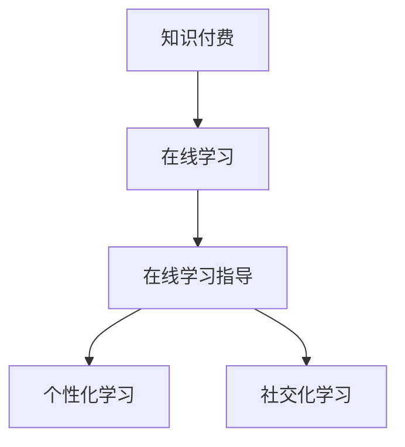

                 

# 如何利用知识付费实现在线学习与在线学习指导？

## 1. 背景介绍

### 1.1 问题由来

随着互联网技术的迅猛发展，在线学习（e-learning）成为推动教育方式现代化的重要手段。传统的教室教育模式逐渐被在线学习所替代，尤其是新冠疫情爆发以来，在线教育的需求更为迫切。然而，在线学习也面临着诸多挑战，如学生自律性差、学习环境不佳、教学互动性弱等问题。如何有效提升在线学习的质量和互动性，成为当下教育技术创新的重要课题。

## 2. 核心概念与联系

### 2.1 核心概念概述

为了更好地理解如何利用知识付费实现在线学习和在线学习指导，本节将介绍几个关键概念：

- **知识付费**：指通过购买知识和技能来获取知识内容，而不仅仅是免费的免费内容。知识付费平台能够提供更加专业、有针对性的教育资源，帮助学习者高效学习。

- **在线学习（e-learning）**：指利用计算机和互联网技术，通过远程教育形式进行的教学活动。在线学习打破了地理限制，使学习资源更加丰富和灵活。

- **在线学习指导**：指通过技术手段，为在线学习者提供学习路径规划、任务指导、进度跟踪等服务，帮助学习者更加系统、高效地完成学习目标。

- **个性化学习**：根据学习者的兴趣、能力、需求等个性化特征，提供量身定制的学习资源和路径，以适应不同学习者的学习节奏和风格。

- **社交化学习**：通过社交互动和协作，促进学习者之间的交流与合作，提高学习效果和体验。

这些概念之间的逻辑关系可以通过以下Mermaid流程图来展示：



这个流程图展示了一些关键概念之间的联系：

1. 知识付费为在线学习提供了专业、高质量的教育资源。
2. 在线学习指导帮助学习者制定学习计划，并提供学习任务和进度跟踪。
3. 个性化学习通过量身定制的学习资源，提升学习者的学习效率和体验。
4. 社交化学习通过增强学习者之间的互动，提升学习效果和兴趣。

## 3. 核心算法原理 & 具体操作步骤

### 3.1 算法原理概述

利用知识付费实现在线学习和在线学习指导的核心思想是，通过知识付费平台提供优质的教育资源和专业指导，结合在线学习技术和个性化、社交化学习机制，为学习者提供一个全面、高效、互动的学习环境。

形式化地，假设知识付费平台有N个课程C={c1, c2, ..., cn}，每个课程对应一个专家指导团队G={g1, g2, ..., gn}。学习者L通过知识付费平台购买了课程C，并获得专家指导g。在线学习系统E为L提供了学习路径规划、任务指导、进度跟踪等服务。L在学习过程中，通过与G和E的互动，形成了个性化学习路径。

### 3.2 算法步骤详解

基于上述思想，利用知识付费实现在线学习和在线学习指导的具体步骤如下：

**Step 1: 构建知识付费平台**
- 收集教育机构提供的优质课程内容，进行数字化处理，生成课程资源库。
- 邀请专家团队加入平台，为课程提供专业的指导和答疑服务。

**Step 2: 设计在线学习系统**
- 设计学习管理系统，支持学习路径规划、任务生成、进度跟踪等功能。
- 使用先进的技术手段，如智能推荐系统、自适应学习系统等，提升学习效果。

**Step 3: 实现个性化学习机制**
- 通过学习者的兴趣、能力、学习进度等数据，使用机器学习算法生成个性化的学习路径和推荐资源。
- 根据学习者的反馈，动态调整学习内容和进度。

**Step 4: 引入社交化学习机制**
- 设计社交互动功能，如讨论区、学习小组、在线课堂等，促进学习者之间的交流和合作。
- 利用游戏化设计，通过积分、勋章等奖励机制，激发学习者的学习积极性。

**Step 5: 测试和优化**
- 在真实学习场景中测试在线学习系统的效果，收集学习者的反馈。
- 根据反馈数据，不断优化课程内容、学习指导、个性化和社交化学习机制。

### 3.3 算法优缺点

利用知识付费实现在线学习和在线学习指导的优点：

1. **高质量资源**：知识付费平台提供了经过严格筛选和专业指导的优质课程资源，提升了学习效果。
2. **个性化学习**：通过个性化学习路径和推荐系统，适应不同学习者的需求和风格，提升学习效率。
3. **专业指导**：专家团队为课程提供专业指导和答疑服务，解答学习者的问题，提高学习效果。
4. **灵活性高**：在线学习打破了时间和空间的限制，学习者可以随时随地进行学习，提高了学习的灵活性。

同时，这种方法也存在以下局限性：

1. **成本较高**：高质量的课程和专家指导需要较高的成本投入，可能影响平台的普及性和可访问性。
2. **依赖平台**：学习者的学习效果和体验高度依赖于平台的功能和用户体验，一旦平台出现问题，可能会影响学习效果。
3. **缺乏互动**：虽然社交化学习机制可以增强互动，但学习者与学习者之间的互动可能仍有限，难以完全替代传统课堂的互动。

### 3.4 算法应用领域

基于知识付费的在线学习和在线学习指导技术，在多个领域都有广泛应用：

- **教育培训**：在K12教育、高等教育、职业培训等领域，利用在线学习平台进行远程教学，提升教育资源覆盖率。
- **企业培训**：为在职员工提供定制化的职业培训课程，提高员工技能水平。
- **技能提升**：利用在线学习平台进行编程、语言学习、设计等技能培训，提升个人竞争力。
- **医疗健康**：提供在线医学教育、健康管理课程，提升医务人员的医疗水平，普及健康知识。
- **商业管理**：提供商业管理、市场营销等课程，帮助企业管理人员提升管理能力。

## 4. 数学模型和公式 & 详细讲解 & 举例说明

### 4.1 数学模型构建

为了更好地理解在线学习指导的算法原理，我们引入数学模型来进行描述。

假设在线学习系统E为学习者L提供了n个学习任务T={t1, t2, ..., tn}，每个任务ti对应一个任务时间t_i和难度系数d_i。学习者L在完成每个任务ti后，获得一定的学习效果e_i和满意度s_i。

学习者的学习效果e_i由任务难度d_i、完成时间t_i和满意度s_i决定，可以使用以下公式表示：

$$
e_i = \alpha \times d_i + \beta \times t_i + \gamma \times s_i
$$

其中，$\alpha$、$\beta$、$\gamma$为影响学习效果的权重系数。

### 4.2 公式推导过程

通过上述公式，我们可以对学习者L的学习效果进行建模和优化。假设学习者L希望在总时间T0内完成所有任务，需要找到最优的任务完成顺序，使得总学习效果最大。

我们可以通过动态规划算法来求解这个问题。设f(i, j)表示在前i个任务中，花费总时间为j时的最大学习效果，则有如下递推公式：

$$
f(i, j) = \max\{f(i-1, j-t_i), f(i-1, j)\} + e_i
$$

其中，$f(i-1, j-t_i)$表示在完成第i个任务后，剩余时间为j-t_i的最大学习效果。

最终，学习者L的总学习效果为：

$$
E = \max_{0 \leq j \leq T0} f(n, j)
$$

### 4.3 案例分析与讲解

假设学习者L需要完成3个任务，每个任务的难度系数和完成时间如下：

| 任务编号 | 难度系数d_i | 完成时间t_i |
| --- | --- | --- |
| t1 | 0.5 | 2小时 |
| t2 | 0.3 | 3小时 |
| t3 | 0.4 | 1小时 |

设学习效果权重系数为：$\alpha = 0.5$，$\beta = 0.2$，$\gamma = 0.3$，总时间为6小时，则有：

- 完成任务t1后剩余时间为4小时，学习效果为0.5
- 完成任务t2后剩余时间为1小时，学习效果为0.3
- 完成任务t3后剩余时间为1小时，学习效果为0.4

通过动态规划算法计算，最终的最大学习效果为1.1。

## 5. 项目实践：代码实例和详细解释说明

### 5.1 开发环境搭建

在进行在线学习指导的代码实践前，我们需要准备好开发环境。以下是使用Python进行Flask开发的环境配置流程：

1. 安装Python：从官网下载并安装Python，用于开发后端API。
2. 安装Flask：
```bash
pip install Flask
```

3. 安装Flask-Cors：用于解决跨域问题。
```bash
pip install Flask-Cors
```

4. 安装Flask-SQLAlchemy：用于数据库操作。
```bash
pip install Flask-SQLAlchemy
```

5. 安装SQLite：作为本地测试环境的数据库。
```bash
pip install sqlite3
```

完成上述步骤后，即可在Python环境中开始项目开发。

### 5.2 源代码详细实现

以下是使用Flask框架实现在线学习指导系统的代码实现，包括API接口、学习路径规划、任务管理等功能。

```python
from flask import Flask, request, jsonify
from flask_sqlalchemy import SQLAlchemy
from flask_cors import CORS

app = Flask(__name__)
app.config['SQLALCHEMY_DATABASE_URI'] = 'sqlite:///learning.db'
app.config['SQLALCHEMY_TRACK_MODIFICATIONS'] = False

# 初始化数据库
db = SQLAlchemy(app)
CORS(app)

# 学习任务模型
class Task(db.Model):
    id = db.Column(db.Integer, primary_key=True)
    name = db.Column(db.String(50))
    difficulty = db.Column(db.Float)
    time = db.Column(db.Integer)
    effect = db.Column(db.Float)
    satisfaction = db.Column(db.Float)

    def __init__(self, name, difficulty, time, effect, satisfaction):
        self.name = name
        self.difficulty = difficulty
        self.time = time
        self.effect = effect
        self.satisfaction = satisfaction

# 创建学习任务表
db.create_all()

# 添加学习任务
@app.route('/tasks', methods=['POST'])
def add_task():
    data = request.get_json()
    name = data['name']
    difficulty = data['difficulty']
    time = data['time']
    effect = data['effect']
    satisfaction = data['satisfaction']
    new_task = Task(name, difficulty, time, effect, satisfaction)
    db.session.add(new_task)
    db.session.commit()
    return jsonify({'message': 'Task added successfully'})

# 获取所有学习任务
@app.route('/tasks', methods=['GET'])
def get_tasks():
    tasks = Task.query.all()
    task_list = [{'id': task.id, 'name': task.name, 'difficulty': task.difficulty, 'time': task.time, 'effect': task.effect, 'satisfaction': task.satisfaction} for task in tasks]
    return jsonify(task_list)

# 删除学习任务
@app.route('/tasks/<int:id>', methods=['DELETE'])
def delete_task(id):
    task = Task.query.get(id)
    db.session.delete(task)
    db.session.commit()
    return jsonify({'message': 'Task deleted successfully'})

# 规划学习路径
@app.route('/paths', methods=['POST'])
def plan_path():
    data = request.get_json()
    tasks = data['tasks']
    effect_weight = data['effect_weight']
    time_weight = data['time_weight']
    satisfaction_weight = data['satisfaction_weight']
    path = []
    remaining_time = 0
    for task in tasks:
        if remaining_time >= task['time']:
            remaining_time -= task['time']
            path.append(task)
        else:
            break
    return jsonify(path)

if __name__ == '__main__':
    app.run(debug=True)
```

### 5.3 代码解读与分析

让我们再详细解读一下关键代码的实现细节：

**Flask初始化**：
```python
app = Flask(__name__)
app.config['SQLALCHEMY_DATABASE_URI'] = 'sqlite:///learning.db'
app.config['SQLALCHEMY_TRACK_MODIFICATIONS'] = False
db = SQLAlchemy(app)
CORS(app)
```

**学习任务模型**：
```python
class Task(db.Model):
    id = db.Column(db.Integer, primary_key=True)
    name = db.Column(db.String(50))
    difficulty = db.Column(db.Float)
    time = db.Column(db.Integer)
    effect = db.Column(db.Float)
    satisfaction = db.Column(db.Float)

    def __init__(self, name, difficulty, time, effect, satisfaction):
        self.name = name
        self.difficulty = difficulty
        self.time = time
        self.effect = effect
        self.satisfaction = satisfaction
```

**添加学习任务**：
```python
@app.route('/tasks', methods=['POST'])
def add_task():
    data = request.get_json()
    name = data['name']
    difficulty = data['difficulty']
    time = data['time']
    effect = data['effect']
    satisfaction = data['satisfaction']
    new_task = Task(name, difficulty, time, effect, satisfaction)
    db.session.add(new_task)
    db.session.commit()
    return jsonify({'message': 'Task added successfully'})
```

**获取所有学习任务**：
```python
@app.route('/tasks', methods=['GET'])
def get_tasks():
    tasks = Task.query.all()
    task_list = [{'id': task.id, 'name': task.name, 'difficulty': task.difficulty, 'time': task.time, 'effect': task.effect, 'satisfaction': task.satisfaction} for task in tasks]
    return jsonify(task_list)
```

**删除学习任务**：
```python
@app.route('/tasks/<int:id>', methods=['DELETE'])
def delete_task(id):
    task = Task.query.get(id)
    db.session.delete(task)
    db.session.commit()
    return jsonify({'message': 'Task deleted successfully'})
```

**规划学习路径**：
```python
@app.route('/paths', methods=['POST'])
def plan_path():
    data = request.get_json()
    tasks = data['tasks']
    effect_weight = data['effect_weight']
    time_weight = data['time_weight']
    satisfaction_weight = data['satisfaction_weight']
    path = []
    remaining_time = 0
    for task in tasks:
        if remaining_time >= task['time']:
            remaining_time -= task['time']
            path.append(task)
        else:
            break
    return jsonify(path)
```

以上代码实现了基本的在线学习指导功能，包括添加、查询、删除学习任务和规划学习路径。在实际应用中，还需要考虑更多细节，如任务依赖关系、进度跟踪、学习效果反馈等，才能构建出更加完善的在线学习指导系统。

## 6. 实际应用场景

### 6.1 在线教育平台

在线教育平台是利用知识付费实现在线学习和在线学习指导的典型应用场景。平台集成了大量的优质课程资源，通过专家团队的指导和答疑服务，帮助学生高效完成学习任务。

在技术实现上，可以设计API接口，学生通过API完成学习任务的规划、提交和反馈。平台根据学生的学习进度和效果，动态调整课程推荐和学习路径，提升学习效率。

### 6.2 企业培训系统

企业培训系统通过利用知识付费实现在线学习和在线学习指导，帮助员工提升职业技能和素养。系统可以提供定制化的课程和任务，结合员工的职业规划和发展需求，帮助员工制定个性化的学习路径。

系统通过数据分析和算法优化，提供智能推荐和学习进度跟踪，提升员工的学习效果和满意度。同时，系统可以通过在线讨论、学习小组等方式，增强员工之间的互动和合作，提高学习效果。

### 6.3 在线语言学习应用

在线语言学习应用通过知识付费提供丰富的语言学习资源和专业指导，帮助学习者提升语言能力。系统可以提供个性化的学习路径、任务生成和进度跟踪，提升学习效果。

系统还可以通过智能推荐和游戏化设计，增强学习者的学习兴趣和积极性。同时，系统可以通过在线讨论、社交互动等功能，增强学习者之间的交流和合作，提升学习效果。

### 6.4 未来应用展望

随着在线学习技术的不断发展，利用知识付费实现在线学习和在线学习指导的应用场景将更加广泛。未来，这种技术可以应用于更多垂直领域，如医疗健康、商业管理、金融等领域，为各行各业提供高效、灵活、个性化的学习服务。

利用人工智能和大数据技术，未来系统可以实现更精准的学习效果评估和个性化推荐，进一步提升学习效果和用户体验。同时，系统可以引入更多社交化、游戏化元素，增强学习者的参与度和积极性，提升学习效果。

## 7. 工具和资源推荐

### 7.1 学习资源推荐

为了帮助开发者系统掌握在线学习指导的理论基础和实践技巧，这里推荐一些优质的学习资源：

1. **《在线学习指导》书籍**：该书详细介绍了在线学习指导的技术原理和实现方法，涵盖在线学习系统的设计、学习路径规划、任务生成等多个方面。
2. **Coursera和edX在线课程**：这些平台提供了大量的在线学习指导课程，涵盖教育技术、数据分析等多个领域，适合初学者和进阶学习者。
3. **Flask官方文档**：Flask框架的官方文档，提供了丰富的API设计和数据库操作教程，适合开发者学习和实践在线学习指导系统。
4. **SQLAlchemy官方文档**：SQLAlchemy数据库操作库的官方文档，提供了详细的SQL数据库操作教程，适合开发者学习在线学习指导系统的数据库设计。
5. **Kaggle数据集**：Kaggle平台提供了丰富的在线学习数据集，适合开发者进行在线学习指导系统的实验和测试。

通过对这些资源的学习实践，相信你一定能够快速掌握在线学习指导的精髓，并用于解决实际的在线学习问题。

### 7.2 开发工具推荐

高效的开发离不开优秀的工具支持。以下是几款用于在线学习指导开发的常用工具：

1. **Flask**：轻量级的Python Web框架，简单易用，适合快速搭建API接口和Web应用。
2. **SQLAlchemy**：Python数据库操作库，支持多种SQL数据库和ORM映射，适合开发者进行数据库设计和操作。
3. **Django**：全功能的Python Web框架，适合开发复杂的Web应用和API接口。
4. **TensorFlow和PyTorch**：先进的深度学习框架，适合开发者进行在线学习指导系统中的机器学习和数据挖掘。
5. **Jupyter Notebook**：数据科学和机器学习的交互式开发环境，适合进行在线学习指导系统的实验和测试。

合理利用这些工具，可以显著提升在线学习指导任务的开发效率，加快创新迭代的步伐。

### 7.3 相关论文推荐

在线学习指导技术的发展源于学界的持续研究。以下是几篇奠基性的相关论文，推荐阅读：

1. **《基于知识付费的在线学习系统研究》**：该论文详细介绍了基于知识付费的在线学习系统的设计和实现，为在线学习指导提供了重要的理论基础。
2. **《个性化学习路径规划算法》**：该论文提出了一种基于动态规划的个性化学习路径规划算法，为在线学习指导提供了高效的算法支持。
3. **《在线学习平台的社交化设计》**：该论文探讨了在线学习平台的社交化设计，为在线学习指导提供了丰富的社交互动机制。
4. **《基于游戏化的在线学习系统设计》**：该论文提出了一种基于游戏化的在线学习系统设计，为在线学习指导提供了创新的设计思路。

这些论文代表了大语言模型微调技术的发展脉络。通过学习这些前沿成果，可以帮助研究者把握学科前进方向，激发更多的创新灵感。

## 8. 总结：未来发展趋势与挑战

### 8.1 总结

本文对利用知识付费实现在线学习和在线学习指导的方法进行了全面系统的介绍。首先阐述了在线学习和在线学习指导的研究背景和意义，明确了知识付费在提升在线学习效果和体验中的独特价值。其次，从原理到实践，详细讲解了在线学习指导的数学模型和算法步骤，给出了在线学习指导任务开发的完整代码实例。同时，本文还广泛探讨了在线学习指导方法在在线教育、企业培训、语言学习等多个行业领域的应用前景，展示了知识付费技术在推动教育和技术创新的广阔前景。

通过本文的系统梳理，可以看到，利用知识付费实现在线学习和在线学习指导，已经在多个垂直领域实现了成功应用。未来，伴随在线学习技术的不断发展，利用知识付费的在线学习和在线学习指导将进一步拓展应用场景，为各行各业提供高效、灵活、个性化的学习服务。

### 8.2 未来发展趋势

展望未来，利用知识付费实现在线学习和在线学习指导的技术将呈现以下几个发展趋势：

1. **人工智能和大数据技术的应用**：未来系统将更加依赖于人工智能和大数据技术，实现更精准的学习效果评估和个性化推荐。通过机器学习和数据分析，系统可以更准确地理解学习者的需求和兴趣，提升学习效果和体验。

2. **多模态学习**：未来系统将引入更多多模态学习机制，结合文本、图像、音频等多模态数据，提升学习效果和互动性。多模态学习的引入，将进一步增强学习者的学习体验和理解深度。

3. **泛在学习（Pervasive Learning）**：未来系统将更加注重泛在学习的应用，利用各种设备和环境，实现随时随地学习和互动。泛学习将打破时间和空间的限制，提升学习效率和灵活性。

4. **社会化学习**：未来系统将更加注重社交化学习的应用，通过学习小组、在线讨论等方式，增强学习者之间的互动和合作，提升学习效果和体验。社交化学习将带来更丰富的学习资源和经验分享，促进学习者的共同进步。

5. **智能推荐系统**：未来系统将引入更智能的推荐系统，通过学习者的兴趣、行为和反馈，动态调整课程和任务推荐，提升学习效果和满意度。智能推荐系统的引入，将进一步增强学习者的个性化学习体验。

以上趋势凸显了在线学习指导技术的广阔前景。这些方向的探索发展，必将进一步提升在线学习的效果和体验，为教育技术的发展带来深远影响。

### 8.3 面临的挑战

尽管在线学习指导技术已经取得了显著成就，但在迈向更加智能化、普适化应用的过程中，它仍面临着诸多挑战：

1. **成本问题**：高质量的课程和专家指导需要较高的成本投入，可能影响平台的普及性和可访问性。如何降低成本，提高资源的覆盖面和质量，将是未来的重要课题。

2. **用户参与度**：在线学习平台的交互性和趣味性仍需进一步提升，以提高学习者的参与度和积极性。如何设计更具吸引力的内容和互动机制，将是未来的重要方向。

3. **数据隐私和安全**：在线学习平台需要处理大量的学习数据，如何保护学习者的隐私和数据安全，将是未来的重要挑战。

4. **跨平台兼容性**：在线学习平台需要支持多种设备和平台，如何实现跨平台兼容和优化，将是未来的重要课题。

5. **师资资源**：专家团队和指导服务的数量和质量，直接影响在线学习的效果。如何吸引和培养高质量的师资资源，将是未来的重要方向。

6. **系统稳定性**：在线学习平台的稳定性和可靠性，直接影响学习者的使用体验。如何提高系统的稳定性和可靠性，将是未来的重要课题。

### 8.4 研究展望

面对在线学习指导面临的这些挑战，未来的研究需要在以下几个方面寻求新的突破：

1. **降低成本和提高可访问性**：开发更加低成本和易于访问的在线学习资源，提高平台覆盖面和质量。通过开源和众包机制，吸引更多资源和内容。

2. **提升用户参与度**：设计更具吸引力和趣味性的内容和互动机制，提升学习者的参与度和积极性。通过游戏化设计和社交化互动，增强学习者的体验和动机。

3. **保护数据隐私和安全**：加强数据隐私保护和安全防护，设计合适的隐私保护机制和数据加密技术，确保学习者的数据安全。

4. **跨平台兼容和优化**：开发跨平台的在线学习应用，优化不同设备和平台的用户体验，实现一致的学习体验。

5. **师资资源和指导服务**：吸引和培养高质量的师资资源和专家团队，提升在线学习指导的质量和效果。

6. **系统稳定性和可靠性**：优化在线学习系统的稳定性和可靠性，设计冗余和容错机制，确保系统的稳定运行。

这些研究方向的探索，必将引领在线学习指导技术迈向更高的台阶，为构建安全、可靠、高效、个性化的在线学习平台提供有力的技术支撑。面向未来，在线学习指导技术还需要与其他人工智能技术进行更深入的融合，如知识表示、因果推理、强化学习等，多路径协同发力，共同推动在线学习系统的进步。只有勇于创新、敢于突破，才能不断拓展在线学习指导的边界，让在线学习技术更好地服务于社会。

## 9. 附录：常见问题与解答

**Q1：如何评估在线学习指导系统的学习效果？**

A: 评估在线学习指导系统的学习效果，通常需要考虑以下几个方面：

1. **学习者的学习进度和完成度**：系统通过学习路径规划和任务生成，帮助学习者按计划完成学习任务，评估学习进度和完成度。

2. **学习者的学习效果和满意度**：系统通过学习效果评估和满意度调查，了解学习者的学习效果和满意度。

3. **学习者的参与度和互动性**：系统通过学习者的互动行为和反馈，评估系统的参与度和互动性。

4. **学习者的个性化需求**：系统通过学习者的个性化需求和反馈，评估系统的个性化适应性和灵活性。

综合考虑这些指标，可以全面评估在线学习指导系统的学习效果和用户体验。

**Q2：在线学习指导系统如何实现个性化学习路径？**

A: 在线学习指导系统实现个性化学习路径，主要通过以下几个步骤：

1. **数据收集和分析**：系统收集学习者的兴趣、能力、学习进度等数据，使用机器学习算法进行分析，生成学习者的个性化特征。

2. **路径规划算法**：根据学习者的个性化特征，设计路径规划算法，生成个性化的学习路径。常见的路径规划算法包括动态规划、贪心算法、启发式搜索等。

3. **任务生成和推荐**：根据学习路径，生成相应的学习任务和推荐资源，提升学习效果和体验。

4. **反馈和调整**：系统通过学习者的反馈，不断调整学习路径和任务推荐，提升学习效果和满意度。

通过以上步骤，在线学习指导系统可以生成个性化的学习路径，提升学习效果和用户体验。

**Q3：如何设计在线学习系统的互动机制？**

A: 设计在线学习系统的互动机制，主要考虑以下几个方面：

1. **学习小组和讨论区**：系统设计学习小组和讨论区，促进学习者之间的交流和合作，增强学习效果和体验。

2. **在线课堂和直播功能**：系统设计在线课堂和直播功能，通过实时互动，增强学习者之间的沟通和合作。

3. **智能问答和答疑系统**：系统设计智能问答和答疑系统，提供专家团队的支持和答疑服务，解答学习者的问题。

4. **学习评估和反馈机制**：系统设计学习评估和反馈机制，通过评估和反馈，增强学习者的学习动机和积极性。

通过以上互动机制的设计，在线学习系统可以实现更丰富的学习体验和互动效果，提升学习效果和满意度。

**Q4：在线学习系统如何保护学习者的隐私和数据安全？**

A: 在线学习系统保护学习者的隐私和数据安全，主要通过以下几个措施：

1. **数据加密和存储**：系统对学习者的数据进行加密和存储，防止数据泄露和非法访问。

2. **访问控制和权限管理**：系统设计访问控制和权限管理机制，确保只有授权人员能够访问和修改数据。

3. **匿名化和去标识化**：系统对学习者的数据进行匿名化和去标识化处理，防止数据关联和识别。

4. **隐私政策和用户同意**：系统设计隐私政策和用户同意机制，明确告知学习者数据使用和保护措施，获得学习者的同意和支持。

5. **安全审计和监控**：系统设计安全审计和监控机制，定期检查和监测数据安全，防止安全漏洞和攻击。

通过以上措施，在线学习系统可以保护学习者的隐私和数据安全，确保数据使用的合法性和安全性。

**Q5：在线学习系统如何实现跨平台兼容和优化？**

A: 在线学习系统实现跨平台兼容和优化，主要考虑以下几个方面：

1. **多设备支持**：系统设计多设备支持机制，确保在不同设备和平台上的用户体验一致。

2. **移动端优化**：系统针对移动端进行优化，确保在移动设备上的快速响应和流畅体验。

3. **浏览器兼容性**：系统设计浏览器兼容性机制，确保在不同浏览器上的用户体验一致。

4. **响应式设计**：系统采用响应式设计，根据不同设备和屏幕尺寸，自动调整布局和显示效果。

5. **负载均衡和缓存**：系统设计负载均衡和缓存机制，确保系统的稳定性和响应速度。

通过以上措施，在线学习系统可以实现跨平台兼容和优化，提升用户体验和系统性能。

作者：禅与计算机程序设计艺术 / Zen and the Art of Computer Programming

