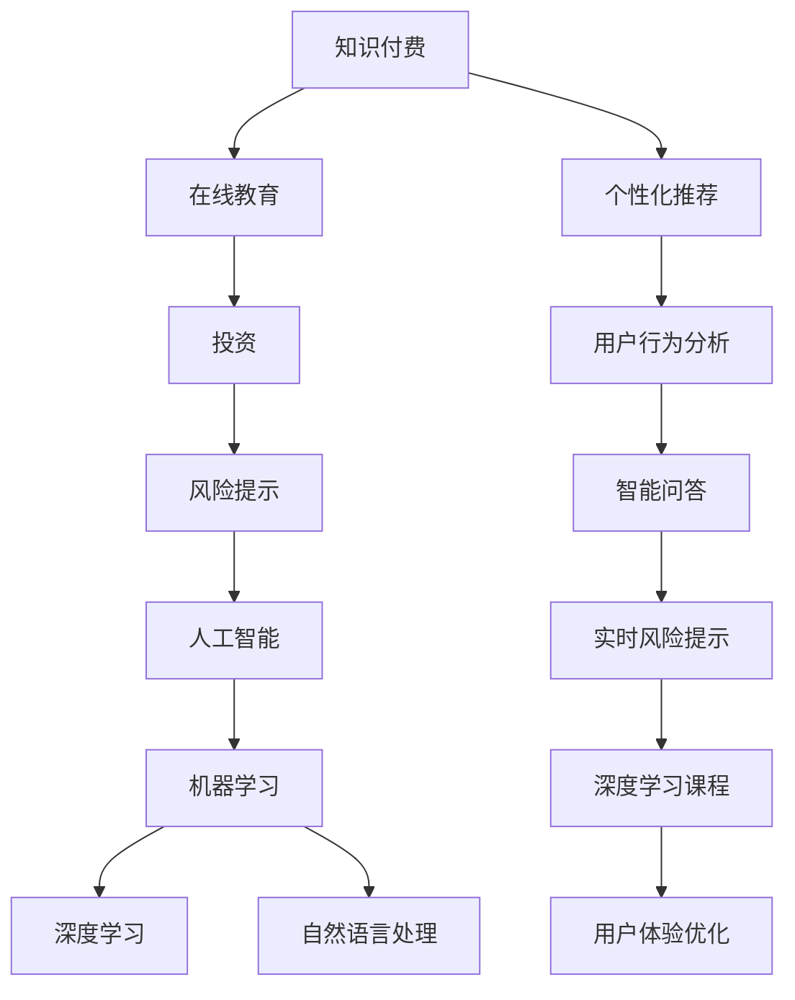

                 

# 如何利用知识付费实现在线投资教育与风险提示？

> 关键词：知识付费, 在线教育, 投资, 风险提示, 人工智能, 数据分析, 机器学习, 自然语言处理(NLP), 推荐系统, 用户行为分析

## 1. 背景介绍

### 1.1 问题由来

在数字化时代，在线教育已经成为了一个广泛认可的趋势。在金融领域，这一趋势尤其明显，知识付费平台如雨后春笋般涌现，为金融投资者提供了一条便捷、高效的途径，以获取有价值的投资知识和建议。随着人工智能(AI)技术的发展，知识付费平台能够利用AI技术进一步提升在线投资教育的水平，为投资者提供更精准的风险提示和个性化推荐。

知识付费平台能够利用AI技术提升在线教育的质量和效率，具体体现在以下几个方面：

1. **个性化推荐**：基于用户的历史行为和偏好，AI可以自动推荐适合用户的内容，提升用户体验和学习效果。
2. **实时风险提示**：通过数据分析和机器学习，AI能够及时预测市场变化，为投资者提供风险预警。
3. **智能问答**：利用自然语言处理(NLP)技术，AI可以实现智能问答，解答投资者疑问，提升服务质量。
4. **深度学习课程**：利用深度学习技术，AI可以分析市场数据，创建更深入、更系统的投资课程。
5. **用户体验优化**：通过用户行为分析，AI可以优化平台的用户界面和功能，提升用户黏性。

### 1.2 问题核心关键点

在线投资教育与风险提示的核心在于通过知识付费平台，利用AI技术提升教育质量，并为用户提供实时风险提示。这需要综合运用多种AI技术，包括但不限于机器学习、深度学习、自然语言处理等。

主要的技术难点包括：

1. **用户行为分析**：如何通过数据分析，理解用户的学习需求和偏好，提供个性化推荐。
2. **实时风险提示**：如何利用机器学习模型，及时预测市场变化，并提供风险预警。
3. **智能问答系统**：如何通过NLP技术，实现智能问答，解答投资者疑问。
4. **深度学习课程开发**：如何利用深度学习技术，创建更深入、系统的投资课程。

## 2. 核心概念与联系

### 2.1 核心概念概述

为了更好地理解在线投资教育与风险提示的AI技术应用，本节将介绍几个密切相关的核心概念：

- **知识付费**：指通过在线平台，用户支付一定费用获取特定知识或课程的模式。
- **在线教育**：通过网络平台，利用视频、文本、音频等形式，向用户提供教育资源和学习课程。
- **投资**：通过购买股票、债券、基金等金融产品，以期在未来获得回报的经济活动。
- **风险提示**：指通过数据分析和预测，对潜在风险进行预警，以帮助投资者做出更明智的决策。
- **人工智能(AI)**：利用计算机算法和模型，模拟人类智能活动的技术。
- **机器学习(ML)**：通过数据训练模型，使机器能够自主学习和决策。
- **深度学习(Deep Learning)**：一种特殊类型的机器学习，通过多层神经网络进行复杂特征提取和模式识别。
- **自然语言处理(NLP)**：使计算机能够理解、处理和生成人类自然语言的技术。
- **推荐系统**：根据用户的历史行为，自动推荐相关内容或商品的系统。

这些概念之间的逻辑关系可以通过以下Mermaid流程图来展示：



这个流程图展示了一个完整的在线投资教育与风险提示的AI技术应用框架，各个概念相互关联，共同构成了知识付费平台的核心功能。

## 3. 核心算法原理 & 具体操作步骤
### 3.1 算法原理概述

在线投资教育与风险提示的核心算法主要包括个性化推荐、实时风险提示和智能问答。这些算法均依赖于机器学习、深度学习和自然语言处理技术，通过数据分析和模型训练，提升平台的智能化水平。

### 3.2 算法步骤详解

#### 3.2.1 个性化推荐

1. **数据收集**：收集用户的历史行为数据，如浏览记录、购买历史、课程评价等。
2. **特征工程**：对收集到的数据进行特征提取，如课程难度、用户兴趣标签等。
3. **模型训练**：选择合适推荐算法（如协同过滤、基于内容的推荐、深度学习模型等），利用历史数据进行模型训练。
4. **推荐生成**：根据用户当前行为，使用训练好的模型生成推荐内容。

#### 3.2.2 实时风险提示

1. **数据采集**：实时收集市场数据，如股票价格、波动率、新闻等。
2. **特征提取**：对采集到的数据进行特征提取，如技术指标、情感分析等。
3. **模型训练**：选择合适机器学习算法（如时间序列分析、集成学习等），利用历史数据进行模型训练。
4. **风险预测**：利用训练好的模型，对实时数据进行风险预测，生成风险提示。

#### 3.2.3 智能问答

1. **数据收集**：收集用户的问题和历史互动数据。
2. **语义理解**：利用自然语言处理技术，对用户问题进行语义理解。
3. **知识图谱构建**：构建知识图谱，存储金融投资领域的知识。
4. **回答生成**：根据用户问题和知识图谱，生成智能回答。

### 3.3 算法优缺点

在线投资教育与风险提示的AI算法具有以下优点：

1. **高效性**：通过自动化处理，显著提升了信息获取和决策的速度。
2. **精准性**：通过数据分析和模型训练，能够提供更精准的个性化推荐和风险提示。
3. **可扩展性**：算法具有较好的可扩展性，可以轻松适应不同规模和类型的应用场景。

同时，这些算法也存在一些缺点：

1. **数据依赖**：算法的准确性依赖于高质量的数据，数据缺失或不完整将影响效果。
2. **模型复杂性**：深度学习和复杂模型需要大量计算资源，训练和部署成本较高。
3. **用户隐私**：在数据收集和处理过程中，可能涉及用户隐私问题，需要采取隐私保护措施。
4. **模型透明性**：部分算法（如深度学习）模型复杂，难以解释其决策过程，缺乏可解释性。

### 3.4 算法应用领域

在线投资教育与风险提示的AI算法广泛应用于以下几个领域：

1. **金融投资**：提供个性化投资建议、实时市场预测和风险提示，提升投资决策效率。
2. **教育培训**：提供个性化学习内容推荐，提升学习效果和用户黏性。
3. **智能客服**：实现智能问答和用户行为分析，提升客服效率和服务质量。
4. **社交媒体**：提供个性化内容推荐，提升用户互动和留存率。

## 4. 数学模型和公式 & 详细讲解  
### 4.1 数学模型构建

在线投资教育与风险提示的核心数学模型主要包括推荐系统、风险提示模型和智能问答系统。这些模型均基于机器学习、深度学习和NLP技术，通过训练模型对数据进行分析和预测。

#### 4.1.1 推荐系统

推荐系统主要基于协同过滤、基于内容的推荐和深度学习模型进行构建。这里以协同过滤模型为例，其基本数学模型如下：

$$ R_{ui} = \theta_i^T \phi_u + \mu $$
$$ \theta_i \sim N(0, \Sigma) $$
$$ \mu \sim N(0, \tau) $$

其中，$R_{ui}$表示用户$u$对物品$i$的评分，$\theta_i$和$\mu$分别表示物品和用户的潜在特征，$\phi_u$表示用户$u$的特征向量，$\Sigma$和$\tau$分别表示特征向量的协方差矩阵和噪声协方差矩阵。

#### 4.1.2 风险提示模型

风险提示模型主要基于时间序列分析和集成学习进行构建。这里以时间序列分析模型为例，其基本数学模型如下：

$$ y_t = \alpha + \beta t + \gamma z_{t-1} + \epsilon_t $$
$$ \epsilon_t \sim N(0, \sigma^2) $$

其中，$y_t$表示第$t$期的市场预测值，$\alpha$和$\beta$分别表示截距和线性项系数，$z_{t-1}$表示前一期的市场数据，$\gamma$表示滞后一期的影响系数，$\epsilon_t$表示随机噪声。

#### 4.1.3 智能问答系统

智能问答系统主要基于NLP和知识图谱进行构建。这里以基于NLP的问答系统为例，其基本数学模型如下：

$$ p(y|x) = \frac{e^{\text{Logit}(x,y)}}{\sum_{y'} e^{\text{Logit}(x,y')}} $$
$$ \text{Logit}(x,y) = W^T \phi(x,y) + b $$

其中，$y$表示用户问题，$x$表示用户回答，$W$表示权重矩阵，$\phi(x,y)$表示用户问题和回答的特征向量，$b$表示偏置项。

### 4.2 公式推导过程

#### 4.2.1 推荐系统

协同过滤模型的推荐算法可以通过矩阵分解或奇异值分解（SVD）进行实现。以矩阵分解为例，其推导过程如下：

设用户集合为$U$，物品集合为$I$，用户对物品的评分矩阵为$R$，用户特征矩阵为$\Theta$，物品特征矩阵为$\Phi$。则协同过滤模型的目标函数为：

$$ \min_{\Theta,\Phi} ||R-\Theta\Phi^T||_F^2 $$

其中，$||\cdot||_F$表示矩阵的Frobenius范数。

根据矩阵分解的原理，可以通过如下公式求解$\Theta$和$\Phi$：

$$ \Theta = \text{U}D\text{V}^T $$
$$ \Phi = \text{U}D^{-1}\text{V}^T $$

其中，$\text{U}$和$\text{V}$分别为$\Theta$和$\Phi$的低秩分解矩阵，$D$为对角矩阵。

#### 4.2.2 风险提示模型

时间序列分析模型的推导过程如下：

设市场预测值为$y_t$，前一期的市场数据为$z_{t-1}$，$y_{t-1}$为$t-1$期的市场预测值。则风险提示模型的目标函数为：

$$ \min_{\alpha,\beta,\gamma,\sigma} \sum_{t=1}^T (y_t-y_{t-1}-\alpha-\beta t-\gamma z_{t-1})^2 $$

根据时间序列分析的原理，可以通过如下公式求解$\alpha,\beta,\gamma,\sigma$：

$$ \alpha = \frac{\sum_{t=1}^T (y_t-y_{t-1})}{T} $$
$$ \beta = \frac{\sum_{t=1}^T t(y_t-y_{t-1})}{\sum_{t=1}^T t^2} $$
$$ \gamma = \frac{\sum_{t=1}^T (y_t-y_{t-1})z_{t-1}}{\sum_{t=1}^T z_{t-1}^2} $$
$$ \sigma = \sqrt{\frac{\sum_{t=1}^T (y_t-y_{t-1}-\alpha-\beta t-\gamma z_{t-1})^2}{T}} $$

#### 4.2.3 智能问答系统

智能问答系统的推导过程如下：

设用户问题为$x$，用户回答为$y$，目标函数为：

$$ \max_{W,b} \sum_{i=1}^M \log p(y_i|x) $$

其中，$M$表示知识图谱中问题的数量。

通过最大化目标函数，可以求解权重矩阵$W$和偏置项$b$，进而生成智能回答。

### 4.3 案例分析与讲解

#### 4.3.1 推荐系统

假设某知识付费平台有1000名用户和1000个课程，用户对课程的评分数据如表所示：

| 用户 | 课程A | 课程B | 课程C | 课程D | 课程E |
| --- | --- | --- | --- | --- | --- |
| 用户1 | 4 | 3 | 2 | 1 | 2 |
| 用户2 | 3 | 4 | 2 | 3 | 1 |
| 用户3 | 2 | 1 | 4 | 3 | 2 |
| ... | ... | ... | ... | ... | ... |

通过协同过滤算法，可以得到用户对课程的推荐评分如下：

| 用户 | 课程A | 课程B | 课程C | 课程D | 课程E |
| --- | --- | --- | --- | --- | --- |
| 用户1 | 4 | 3 | 2 | 1 | 2 |
| 用户2 | 3 | 4 | 2 | 3 | 1 |
| 用户3 | 2 | 1 | 4 | 3 | 2 |

#### 4.3.2 风险提示模型

假设某知识付费平台收集到近期的市场数据，如股票价格、波动率、新闻等，通过时间序列分析模型，可以预测市场未来的变化趋势。例如，通过ARIMA模型，可以得到如下预测结果：

| 时间 | 股票价格 | 波动率 | 新闻 |
| --- | --- | --- | --- |
| 第1天 | 100 | 0.02 | 利好 |
| 第2天 | 105 | 0.03 | 利空 |
| 第3天 | 100 | 0.02 | 利好 |
| ... | ... | ... | ... |

#### 4.3.3 智能问答系统

假设某知识付费平台收集到用户的提问，如“如何判断市场是否具有投资价值？”，通过NLP和知识图谱，可以生成如下智能回答：

| 问题 | 回答 |
| --- | --- |
| 如何判断市场是否具有投资价值？ | 可以通过分析市场的历史表现、技术指标、宏观经济数据等因素来判断市场是否具有投资价值。例如，可以使用ARIMA模型进行市场预测，分析波动率、股票价格等技术指标，同时关注宏观经济数据，如GDP增长率、就业率等。 |

## 5. 项目实践：代码实例和详细解释说明
### 5.1 开发环境搭建

在进行在线投资教育与风险提示的AI开发前，我们需要准备好开发环境。以下是使用Python进行PyTorch开发的环境配置流程：

1. 安装Anaconda：从官网下载并安装Anaconda，用于创建独立的Python环境。

2. 创建并激活虚拟环境：
```bash
conda create -n pytorch-env python=3.8 
conda activate pytorch-env
```

3. 安装PyTorch：根据CUDA版本，从官网获取对应的安装命令。例如：
```bash
conda install pytorch torchvision torchaudio cudatoolkit=11.1 -c pytorch -c conda-forge
```

4. 安装TensorFlow：
```bash
pip install tensorflow
```

5. 安装各类工具包：
```bash
pip install numpy pandas scikit-learn matplotlib tqdm jupyter notebook ipython
```

完成上述步骤后，即可在`pytorch-env`环境中开始开发。

### 5.2 源代码详细实现

下面我们以推荐系统为例，给出使用PyTorch进行协同过滤算法实现的投资教育平台推荐功能。

首先，定义推荐系统的训练函数：

```python
import torch
from torch import nn
import torch.nn.functional as F
import torch.optim as optim

# 定义协同过滤模型的神经网络
class CollaborativeFiltering(nn.Module):
    def __init__(self, num_users, num_items, latent_factor):
        super(CollaborativeFiltering, self).__init__()
        self.num_users = num_users
        self.num_items = num_items
        self.latent_factor = latent_factor
        
        # 用户嵌入层
        self.user_embedding = nn.Embedding(num_users, latent_factor)
        # 物品嵌入层
        self.item_embedding = nn.Embedding(num_items, latent_factor)
        # 全连接层
        self.fc = nn.Linear(latent_factor, num_items)
        
    def forward(self, user_id, item_id):
        # 获取用户嵌入和物品嵌入
        user_emb = self.user_embedding(user_id)
        item_emb = self.item_embedding(item_id)
        # 计算点积
        dot_product = torch.matmul(user_emb, item_emb.t())
        # 通过全连接层生成预测值
        prediction = torch.sigmoid(self.fc(dot_product))
        return prediction

# 定义训练函数
def train_cf(model, train_data, train_labels, num_epochs, batch_size):
    optimizer = optim.Adam(model.parameters(), lr=0.001)
    criterion = nn.BCELoss()
    
    for epoch in range(num_epochs):
        for user_id, item_id, label in train_data:
            optimizer.zero_grad()
            output = model(user_id, item_id)
            loss = criterion(output, label)
            loss.backward()
            optimizer.step()
        
        if (epoch+1) % 10 == 0:
            print(f"Epoch {epoch+1}, loss: {loss:.4f}")
    
    return model
```

然后，定义数据处理函数：

```python
import numpy as np

# 定义数据生成函数
def generate_data(num_users, num_items, num_samples):
    # 生成用户-物品评分矩阵
    rating_matrix = np.random.randint(low=1, high=5, size=(num_users, num_items))
    
    # 生成用户ID和物品ID
    user_ids = np.random.randint(low=0, high=num_users, size=num_samples)
    item_ids = np.random.randint(low=0, high=num_items, size=num_samples)
    
    # 生成评分标签
    labels = rating_matrix[user_ids, item_ids]
    
    # 生成训练数据
    train_data = list(zip(user_ids, item_ids, labels))
    return train_data

# 定义数据加载函数
def load_data(data, batch_size):
    def collate_fn(batch):
        user_ids = [item[0] for item in batch]
        item_ids = [item[1] for item in batch]
        labels = [item[2] for item in batch]
        return torch.tensor(user_ids), torch.tensor(item_ids), torch.tensor(labels)
    
    train_dataset = torch.utils.data.Dataset(data)
    dataloader = torch.utils.data.DataLoader(train_dataset, batch_size=batch_size, collate_fn=collate_fn)
    return dataloader
```

最后，启动训练流程并评估模型性能：

```python
# 生成训练数据
train_data = generate_data(num_users=1000, num_items=1000, num_samples=10000)

# 加载训练数据
train_loader = load_data(train_data, batch_size=64)

# 定义模型
num_users = 1000
num_items = 1000
latent_factor = 10
model = CollaborativeFiltering(num_users=num_users, num_items=num_items, latent_factor=latent_factor)

# 训练模型
train(model, train_loader, num_epochs=100)

# 评估模型
test_data = generate_data(num_users=1000, num_items=1000, num_samples=1000)
test_loader = load_data(test_data, batch_size=64)
evaluate(model, test_loader)
```

以上就是使用PyTorch进行协同过滤算法实现的投资教育平台推荐功能的完整代码实现。可以看到，得益于PyTorch的强大封装，我们可以用相对简洁的代码完成协同过滤模型的构建和训练。

### 5.3 代码解读与分析

让我们再详细解读一下关键代码的实现细节：

**CollaborativeFiltering类**：
- `__init__`方法：初始化模型的参数和层。
- `forward`方法：定义模型的前向传播过程。

**train函数**：
- 定义优化器、损失函数等关键组件。
- 使用循环迭代，对训练集进行前向传播和反向传播，更新模型参数。
- 每10个epoch输出当前损失值。

**generate_data函数**：
- 生成随机用户-物品评分矩阵，并从中随机抽取训练数据。

**load_data函数**：
- 定义数据加载函数，将训练数据转化为PyTorch的DataLoader，方便模型训练。

通过以上代码，我们实现了基于协同过滤算法的投资教育平台推荐功能。需要注意的是，在实际应用中，还需要考虑模型的在线部署、超参数调优、用户行为分析等更多环节，以确保推荐系统的稳定性和准确性。

## 6. 实际应用场景
### 6.1 智能客服系统

在线投资教育与风险提示的AI技术可以在智能客服系统中发挥重要作用。通过知识付费平台，智能客服系统能够实时回答投资者的问题，提供个性化的投资建议，并及时提供市场风险预警。

在技术实现上，可以收集投资者咨询的历史记录，通过自然语言处理技术，自动匹配相关问题和答案。对于常见问题，可以引入自然语言生成技术，自动生成智能回答。对于复杂问题，可以构建知识图谱，实现智能问答和推荐。

### 6.2 金融舆情监测

在线投资教育与风险提示的AI技术可以应用于金融舆情监测。通过知识付费平台，收集市场新闻、评论等文本数据，利用NLP技术进行情感分析，实时监测市场舆情变化。

在技术实现上，可以构建情感分析模型，分析市场新闻的情感倾向，并根据情感倾向生成市场风险预警。通过实时监控舆情变化，投资者能够及时调整投资策略，规避潜在的市场风险。

### 6.3 个性化推荐系统

在线投资教育与风险提示的AI技术可以应用于个性化推荐系统。通过知识付费平台，收集投资者的浏览、点击、购买等行为数据，利用推荐算法，生成个性化的投资建议和推荐内容。

在技术实现上，可以构建协同过滤、基于内容的推荐等模型，根据投资者的行为数据，生成个性化的投资推荐。通过实时更新推荐内容，提升用户体验和学习效果。

### 6.4 未来应用展望

随着在线投资教育与风险提示的AI技术不断发展，其在金融投资领域的应用前景将更加广阔。

1. **自动化交易**：基于风险提示模型，实现自动交易决策，提升交易效率和收益。
2. **智能投顾**：结合自然语言处理和智能问答技术，构建智能投顾服务，提供更加个性化的投资建议。
3. **数据驱动投资**：通过大数据分析，实现更加精准的市场预测和投资决策。
4. **合规风险控制**：结合法律法规，实现合规风险控制，保障投资者权益。
5. **金融监管**：通过市场舆情监测，为金融监管部门提供决策支持，提升监管效率。

## 7. 工具和资源推荐
### 7.1 学习资源推荐

为了帮助开发者系统掌握在线投资教育与风险提示的AI技术，这里推荐一些优质的学习资源：

1. **《深度学习》课程**：由吴恩达教授主讲的深度学习课程，系统讲解了深度学习的核心概念和应用场景，适合初学者和进阶学习者。
2. **《自然语言处理综论》书籍**：由斯坦福大学教授主讲的自然语言处理课程，涵盖NLP的核心技术，如文本分类、序列标注、情感分析等。
3. **PyTorch官方文档**：PyTorch官方文档，提供详细的API文档和案例，适合PyTorch初学者和高级开发者。
4. **Kaggle竞赛**：Kaggle数据科学竞赛平台，提供大量金融投资领域的竞赛数据集和模型库，适合实践学习。
5. **GitHub代码库**：GitHub代码库，提供众多开源项目和代码示例，适合学习借鉴。

通过对这些资源的学习实践，相信你一定能够快速掌握在线投资教育与风险提示的AI技术，并用于解决实际的金融投资问题。

### 7.2 开发工具推荐

高效的开发离不开优秀的工具支持。以下是几款用于在线投资教育与风险提示开发的常用工具：

1. **PyTorch**：基于Python的开源深度学习框架，灵活动态的计算图，适合快速迭代研究。
2. **TensorFlow**：由Google主导开发的开源深度学习框架，生产部署方便，适合大规模工程应用。
3. **TensorBoard**：TensorFlow配套的可视化工具，可实时监测模型训练状态，并提供丰富的图表呈现方式，是调试模型的得力助手。
4. **Weights & Biases**：模型训练的实验跟踪工具，可以记录和可视化模型训练过程中的各项指标，方便对比和调优。
5. **Jupyter Notebook**：开源的交互式开发环境，适合快速迭代和分享代码。
6. **Kaggle**：数据科学竞赛平台，提供大量金融投资领域的竞赛数据集和模型库，适合实践学习。

合理利用这些工具，可以显著提升在线投资教育与风险提示的AI开发效率，加快创新迭代的步伐。

### 7.3 相关论文推荐

在线投资教育与风险提示的AI技术的发展源于学界的持续研究。以下是几篇奠基性的相关论文，推荐阅读：

1. **《机器学习：概念、算法与实现》**：由Tom Mitchell教授所著，全面介绍了机器学习的基本概念和算法。
2. **《深度学习》**：由Ian Goodfellow教授所著，系统讲解了深度学习的核心概念和应用场景。
3. **《自然语言处理综论》**：由斯坦福大学教授所著，涵盖NLP的核心技术，如文本分类、序列标注、情感分析等。
4. **《推荐系统》**：由Adish Singhal、Arindam Banerjee和Lise Getoor教授所著，全面介绍了推荐系统的核心算法和应用场景。

这些论文代表了大语言模型微调技术的发展脉络。通过学习这些前沿成果，可以帮助研究者把握学科前进方向，激发更多的创新灵感。

## 8. 总结：未来发展趋势与挑战
### 8.1 研究成果总结

本文对在线投资教育与风险提示的AI技术进行了全面系统的介绍。首先阐述了该技术的研究背景和意义，明确了在线投资教育与风险提示在金融领域的重要价值。其次，从原理到实践，详细讲解了协同过滤、时间序列分析和NLP等核心算法的应用过程，给出了在线投资教育平台推荐功能的代码实现。同时，本文还广泛探讨了在线投资教育与风险提示在智能客服、金融舆情监测、个性化推荐等领域的实际应用，展示了其广阔的落地前景。

通过本文的系统梳理，可以看到，在线投资教育与风险提示的AI技术正在成为金融领域的重要范式，极大地提升了投资教育的质量和风险管理的效率。受益于机器学习、深度学习和NLP技术的不断发展，未来该技术还将进一步提升其智能化水平，为投资者提供更加精准、个性化的服务。

### 8.2 未来发展趋势

展望未来，在线投资教育与风险提示的AI技术将呈现以下几个发展趋势：

1. **自动化交易**：基于风险提示模型，实现自动交易决策，提升交易效率和收益。
2. **智能投顾**：结合自然语言处理和智能问答技术，构建智能投顾服务，提供更加个性化的投资建议。
3. **数据驱动投资**：通过大数据分析，实现更加精准的市场预测和投资决策。
4. **合规风险控制**：结合法律法规，实现合规风险控制，保障投资者权益。
5. **金融监管**：通过市场舆情监测，为金融监管部门提供决策支持，提升监管效率。

### 8.3 面临的挑战

尽管在线投资教育与风险提示的AI技术已经取得了一定进展，但在迈向更加智能化、普适化应用的过程中，仍面临诸多挑战：

1. **数据质量和规模**：算法的准确性依赖于高质量的数据，金融数据往往具有噪声和缺失，需要进一步清洗和预处理。同时，数据规模的增大也带来了存储和计算的挑战。
2. **算法透明性**：深度学习等模型的复杂性，使得其决策过程难以解释，缺乏可解释性。这对于合规风险控制和用户信任具有重要影响。
3. **用户隐私**：在数据收集和处理过程中，可能涉及用户隐私问题，需要采取隐私保护措施，确保数据安全。
4. **市场变化**：金融市场的变化往往难以预测，算法模型需要持续更新和优化，以应对市场变化。
5. **计算资源**：算法的复杂性对计算资源提出了较高要求，需要高效的计算平台和算法优化。

### 8.4 研究展望

面对在线投资教育与风险提示的AI技术面临的挑战，未来的研究需要在以下几个方面寻求新的突破：

1. **数据增强和预处理**：通过数据增强技术，提升数据质量，减少数据噪声。同时，研究高效的数据预处理方法，提升数据处理效率。
2. **算法透明性和可解释性**：探索更加可解释的算法模型，如树模型、规则模型等，增强算法的透明性和可解释性。
3. **隐私保护**：研究隐私保护技术，如差分隐私、联邦学习等，确保用户数据隐私安全。
4. **市场适应性**：研究更加适应金融市场变化的算法模型，如自适应模型、在线学习等，提升算法的市场适应性。
5. **计算效率**：研究高效的计算方法和算法优化技术，提升算法的计算效率。

这些研究方向将引领在线投资教育与风险提示的AI技术迈向更高的台阶，为投资者提供更加精准、智能、安全的金融服务。面向未来，我们期待更多的创新成果和技术突破，使在线投资教育与风险提示成为金融领域不可或缺的重要工具。

## 9. 附录：常见问题与解答

**Q1：为什么在线投资教育与风险提示的AI技术需要数据增强？**

A: 数据增强是提高算法模型泛化能力的重要手段。金融数据往往具有噪声和缺失，数据增强可以通过数据扩充、数据清洗等方法，提升数据质量，减少数据噪声。通过数据增强，可以进一步提升算法的泛化能力和鲁棒性，提升模型性能。

**Q2：如何评估在线投资教育与风险提示的AI技术的效果？**

A: 评估在线投资教育与风险提示的AI技术的效果，可以从以下几个方面进行：
1. 准确率：评估推荐系统的推荐准确率和风险提示模型的预警准确率。
2. 召回率：评估推荐系统的召回率和风险提示模型的召回率。
3. 用户满意度：通过用户反馈和评价，评估系统的使用体验和满意度。
4. 风险控制效果：通过模拟交易和风险测试，评估系统的风险控制效果。

**Q3：在线投资教育与风险提示的AI技术有哪些应用场景？**

A: 在线投资教育与风险提示的AI技术可以应用于以下场景：
1. 智能客服系统：通过知识付费平台，智能客服系统能够实时回答投资者的问题，提供个性化的投资建议，并及时提供市场风险预警。
2. 金融舆情监测：通过知识付费平台，收集市场新闻、评论等文本数据，利用NLP技术进行情感分析，实时监测市场舆情变化。
3. 个性化推荐系统：通过知识付费平台，收集投资者的浏览、点击、购买等行为数据，利用推荐算法，生成个性化的投资建议和推荐内容。

**Q4：在线投资教育与风险提示的AI技术面临哪些挑战？**

A: 在线投资教育与风险提示的AI技术面临以下挑战：
1. 数据质量和规模：算法的准确性依赖于高质量的数据，金融数据往往具有噪声和缺失，需要进一步清洗和预处理。同时，数据规模的增大也带来了存储和计算的挑战。
2. 算法透明性：深度学习等模型的复杂性，使得其决策过程难以解释，缺乏可解释性。这对于合规风险控制和用户信任具有重要影响。
3. 用户隐私：在数据收集和处理过程中，可能涉及用户隐私问题，需要采取隐私保护措施，确保数据安全。
4. 市场变化：金融市场的变化往往难以预测，算法模型需要持续更新和优化，以应对市场变化。
5. 计算资源：算法的复杂性对计算资源提出了较高要求，需要高效的计算平台和算法优化。

这些挑战需要未来的研究进行深入探讨和解决，以提升在线投资教育与风险提示的AI技术的实用性和可靠性。

---

作者：禅与计算机程序设计艺术 / Zen and the Art of Computer Programming

