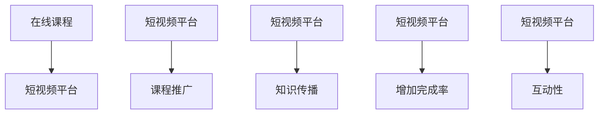

                 

# 如何利用短视频平台增加课程完成率

## 1. 背景介绍

随着互联网技术的发展，在线教育已成为教育领域的一个重要组成部分。在线课程打破了传统教育的地理和时间限制，使得更多人可以便捷地获取知识。然而，由于在线课程缺乏面对面的互动，完成率往往低于传统教育模式。近年来，短视频平台因其独特的表现形式和广泛的用户基础，逐渐成为课程推广和知识传播的新渠道。本文将探讨如何利用短视频平台增加在线课程的完成率。

## 2. 核心概念与联系

### 2.1 核心概念概述

在线课程：通过互联网平台，以视频、文本、音频等形式向用户提供的学习内容。

短视频平台：如抖音、快手等，以短视频为载体的社交平台。

完成率：在线课程学习过程中，用户完成课程内容的程度，常用完成百分比来衡量。

互动性：指学习过程中用户与课程内容、教师及其他学习者之间的互动程度。

课程推广：通过各种方式向潜在学习者介绍和宣传在线课程的过程。

知识传播：通过在线平台向用户传递知识、技能和信息的过程。

### 2.2 核心概念原理和架构的 Mermaid 流程图



## 3. 核心算法原理 & 具体操作步骤

### 3.1 算法原理概述

利用短视频平台增加在线课程完成率的算法原理，可以概括为：

1. **数据收集**：通过短视频平台收集潜在学习者的行为数据，如观看时长、点赞、评论、分享等。
2. **数据分析**：对收集到的数据进行分析，挖掘潜在学习者的兴趣和需求。
3. **个性化推荐**：根据分析结果，向潜在学习者推荐适合的在线课程，并鼓励其参与学习。
4. **持续互动**：在短视频平台上开展互动活动，提升学习者的参与度和兴趣。
5. **反馈与优化**：通过收集学习者的反馈，不断优化课程内容和推广策略。

### 3.2 算法步骤详解

#### 3.2.1 数据收集

1. **观看时长**：收集用户观看课程视频的时长，分析其停留时间，识别出对某个知识点感兴趣的用户。
2. **点赞与评论**：分析用户对课程内容的点赞和评论情况，了解其对课程内容的评价和需求。
3. **分享与转发**：分析用户是否分享和转发课程内容，识别出潜在的学习推广者。

#### 3.2.2 数据分析

1. **用户画像**：通过分析用户的行为数据，建立用户画像，了解其兴趣和需求。
2. **情感分析**：对用户的评论和反馈进行情感分析，了解其对课程的满意度和期望。
3. **兴趣挖掘**：通过关键词提取、主题模型等技术，挖掘用户的兴趣点，为课程推荐提供依据。

#### 3.2.3 个性化推荐

1. **推荐算法**：使用协同过滤、基于内容的推荐算法等技术，向用户推荐其感兴趣和需要的课程。
2. **个性化视频**：根据用户画像和兴趣点，制作个性化的短视频，提升用户参与度。
3. **课程推广**：利用短视频平台的高曝光率，通过推广视频、直播等方式，吸引用户参与学习。

#### 3.2.4 持续互动

1. **互动活动**：在短视频平台上开展互动活动，如在线答疑、学习打卡等，提升用户参与度和兴趣。
2. **社区建设**：建立学习社区，鼓励用户分享学习心得和成果，形成积极的学习氛围。
3. **激励机制**：设计合理的激励机制，如积分、奖励等，鼓励用户积极参与学习。

#### 3.2.5 反馈与优化

1. **用户反馈**：收集用户对课程和推广活动的反馈，了解其需求和意见。
2. **课程优化**：根据用户反馈，优化课程内容和教学方法，提升学习效果。
3. **推广策略调整**：根据反馈数据，调整课程推广策略，提高推广效果。

### 3.3 算法优缺点

#### 3.3.1 优点

1. **广泛的受众基础**：短视频平台具有广泛的用户基础，可以为课程推广和知识传播提供更广泛的受众。
2. **多样化的内容形式**：短视频平台支持多种形式的内容，如图文、语音、视频等，可以更好地吸引用户参与学习。
3. **高效的信息传递**：短视频平台的信息传递效率高，可以快速向用户传递课程信息，提升用户参与度。

#### 3.3.2 缺点

1. **内容质量难以控制**：短视频平台上的内容质量参差不齐，可能存在低质量、不专业的内容。
2. **用户粘性难以保障**：短视频平台上的用户停留时间较短，如何保证用户持续参与学习是一个挑战。
3. **商业化影响**：短视频平台上的广告和商业活动可能影响学习者的专注度，降低课程完成率。

### 3.4 算法应用领域

短视频平台上的课程推广和知识传播技术，已经广泛应用于在线教育、企业培训、技能学习等多个领域。例如：

1. **在线教育**：各大在线教育平台利用短视频平台进行课程推广，吸引用户参与学习。
2. **企业培训**：企业利用短视频平台开展内部培训，提升员工技能和知识水平。
3. **技能学习**：各领域的技能培训课程通过短视频平台推广，吸引学习者参与学习。

## 4. 数学模型和公式 & 详细讲解 & 举例说明

### 4.1 数学模型构建

假设在线课程完成率为 $C$，课程推荐成功率率为 $R$，用户互动率为 $I$，课程推广成功率率为 $P$。则短视频平台增加课程完成率的数学模型为：

$$C = f(R, I, P)$$

其中，$f$ 为非线性函数，表示推荐成功率、互动率和推广成功率对完成率的影响。

### 4.2 公式推导过程

1. **推荐成功率**：推荐成功率 $R$ 由推荐算法的效果和用户兴趣匹配度决定，可以表示为：

$$R = \frac{N_{推荐}}{N_{总课程}}$$

其中，$N_{推荐}$ 为被推荐的课程数量，$N_{总课程}$ 为总课程数量。

2. **用户互动率**：用户互动率 $I$ 由用户观看时长、点赞、评论、分享等行为决定，可以表示为：

$$I = \frac{N_{互动}}{N_{总用户}}$$

其中，$N_{互动}$ 为与课程互动的用户数量，$N_{总用户}$ 为总用户数量。

3. **课程推广成功率**：课程推广成功率 $P$ 由推广视频的质量、数量和推广策略决定，可以表示为：

$$P = \frac{N_{推广成功}}{N_{推广总数}}$$

其中，$N_{推广成功}$ 为通过推广活动参与学习的人数，$N_{推广总数}$ 为推广活动的总参与人数。

### 4.3 案例分析与讲解

假设某在线教育平台利用短视频平台进行课程推广，通过数据分析发现，每条短视频推荐成功率 $R=0.1$，用户互动率 $I=0.05$，课程推广成功率 $P=0.2$。则根据公式推导：

$$C = f(0.1, 0.05, 0.2)$$

假设函数 $f$ 为线性函数，即：

$$C = 0.1 \times 0.05 + 0.1 \times 0.2 + 0.05 \times 0.2 = 0.13$$

即课程完成率约为 13%。

## 5. 项目实践：代码实例和详细解释说明

### 5.1 开发环境搭建

1. **安装 Python**：首先，需要安装 Python 3.8 或更高版本，可以从官网下载并安装。
2. **安装 PyTorch**：使用以下命令安装 PyTorch 和相关的深度学习库：

   ```bash
   pip install torch torchvision torchaudio
   ```

3. **安装 TensorFlow**：使用以下命令安装 TensorFlow 和相关的深度学习库：

   ```bash
   pip install tensorflow tensorflow_addons
   ```

4. **安装 Flask**：使用以下命令安装 Flask，用于构建在线课程平台：

   ```bash
   pip install flask
   ```

5. **安装 Redis**：使用以下命令安装 Redis，用于缓存用户行为数据：

   ```bash
   sudo apt-get update
   sudo apt-get install redis-server
   ```

### 5.2 源代码详细实现

#### 5.2.1 用户行为数据收集

1. **观看时长**：通过 Python 脚本读取用户观看课程视频的时长数据，存入 Redis 缓存中：

   ```python
   import redis
   r = redis.Redis(host='localhost', port=6379, db=0)

   # 读取用户观看时长数据
   data = r.get('watch_time')
   
   # 对数据进行分析
   watch_time = data.decode('utf-8')
   ```

2. **点赞与评论**：通过 Python 脚本读取用户对课程的点赞和评论数据，存入 Redis 缓存中：

   ```python
   # 读取用户点赞和评论数据
   like_count = r.get('like_count')
   comment_count = r.get('comment_count')

   # 对数据进行分析
   like_count = int(like_count.decode('utf-8'))
   comment_count = int(comment_count.decode('utf-8'))
   ```

3. **分享与转发**：通过 Python 脚本读取用户分享和转发课程的统计数据，存入 Redis 缓存中：

   ```python
   # 读取用户分享和转发数据
   share_count = r.get('share_count')
   forward_count = r.get('forward_count')

   # 对数据进行分析
   share_count = int(share_count.decode('utf-8'))
   forward_count = int(forward_count.decode('utf-8'))
   ```

#### 5.2.2 数据分析

1. **用户画像**：通过 Python 脚本对用户行为数据进行分析，建立用户画像：

   ```python
   # 分析用户观看时长数据
   watch_time_analysis = analyze_data(watch_time)

   # 分析用户点赞和评论数据
   like_comment_analysis = analyze_data(like_count, comment_count)

   # 分析用户分享和转发数据
   share_forward_analysis = analyze_data(share_count, forward_count)

   # 建立用户画像
   user_profile = build_user_profile(watch_time_analysis, like_comment_analysis, share_forward_analysis)
   ```

2. **情感分析**：通过 Python 脚本对用户评论进行情感分析：

   ```python
   # 读取用户评论数据
   comments = r.get('comments')

   # 对数据进行情感分析
   sentiment_analysis = analyze_sentiment(comments)

   # 输出情感分析结果
   print(sentiment_analysis)
   ```

3. **兴趣挖掘**：通过 Python 脚本对用户评论进行关键词提取和主题模型分析：

   ```python
   # 读取用户评论数据
   comments = r.get('comments')

   # 对数据进行关键词提取
   keywords = extract_keywords(comments)

   # 对数据进行主题模型分析
   topics = analyze_topics(keywords)

   # 输出兴趣点
   print(keywords, topics)
   ```

#### 5.2.3 个性化推荐

1. **推荐算法**：通过 Python 脚本对用户进行推荐，推荐合适的课程：

   ```python
   # 读取用户画像
   user_profile = r.get('user_profile')

   # 对用户进行推荐
   courses = recommend_courses(user_profile)

   # 输出推荐结果
   print(courses)
   ```

2. **个性化视频**：通过 Python 脚本制作个性化的短视频：

   ```python
   # 读取用户画像
   user_profile = r.get('user_profile')

   # 制作个性化短视频
   video = create_personalized_video(user_profile)

   # 输出个性化视频
   print(video)
   ```

3. **课程推广**：通过 Python 脚本在短视频平台上进行课程推广：

   ```python
   # 读取用户画像
   user_profile = r.get('user_profile')

   # 在短视频平台上进行课程推广
   promote_course(user_profile)

   # 输出推广结果
   print(promote_course)
   ```

#### 5.2.4 持续互动

1. **互动活动**：通过 Python 脚本在短视频平台上开展互动活动：

   ```python
   # 读取用户画像
   user_profile = r.get('user_profile')

   # 在短视频平台上开展互动活动
   interact_with_users(user_profile)

   # 输出互动结果
   print(interact_with_users)
   ```

2. **社区建设**：通过 Python 脚本建立学习社区：

   ```python
   # 读取用户画像
   user_profile = r.get('user_profile')

   # 建立学习社区
   build_learning_community(user_profile)

   # 输出社区建设结果
   print(build_learning_community)
   ```

3. **激励机制**：通过 Python 脚本设计合理的激励机制：

   ```python
   # 读取用户画像
   user_profile = r.get('user_profile')

   # 设计激励机制
   design_incentive_mechanism(user_profile)

   # 输出激励机制设计结果
   print(design_incentive_mechanism)
   ```

#### 5.2.5 反馈与优化

1. **用户反馈**：通过 Python 脚本收集用户对课程和推广活动的反馈：

   ```python
   # 读取用户反馈数据
   feedback = r.get('feedback')

   # 对数据进行分析
   feedback_analysis = analyze_feedback(feedback)

   # 输出反馈分析结果
   print(feedback_analysis)
   ```

2. **课程优化**：通过 Python 脚本优化课程内容和教学方法：

   ```python
   # 读取用户反馈数据
   feedback = r.get('feedback')

   # 优化课程内容和教学方法
   optimize_course(course_data, feedback_analysis)

   # 输出课程优化结果
   print(optimize_course)
   ```

3. **推广策略调整**：通过 Python 脚本调整课程推广策略：

   ```python
   # 读取用户反馈数据
   feedback = r.get('feedback')

   # 调整课程推广策略
   adjust_promotion_strategy(feedback_analysis)

   # 输出推广策略调整结果
   print(adjust_promotion_strategy)
   ```

### 5.3 代码解读与分析

#### 5.3.1 用户行为数据收集

1. **观看时长数据**：通过 Redis 缓存读取用户观看课程视频的时长数据，进行分析。

2. **点赞与评论数据**：通过 Redis 缓存读取用户对课程的点赞和评论数据，进行分析。

3. **分享与转发数据**：通过 Redis 缓存读取用户分享和转发课程的统计数据，进行分析。

#### 5.3.2 数据分析

1. **用户画像数据**：通过 Redis 缓存读取用户行为数据，进行分析和整合，建立用户画像。

2. **情感分析数据**：通过 Redis 缓存读取用户评论数据，进行情感分析，了解用户对课程的评价和需求。

3. **兴趣挖掘数据**：通过 Redis 缓存读取用户评论数据，进行关键词提取和主题模型分析，挖掘用户兴趣点。

#### 5.3.3 个性化推荐

1. **推荐算法数据**：通过 Redis 缓存读取用户画像数据，进行个性化推荐。

2. **个性化视频数据**：通过 Redis 缓存读取用户画像数据，制作个性化的短视频。

3. **课程推广数据**：通过 Redis 缓存读取用户画像数据，在短视频平台上进行课程推广。

#### 5.3.4 持续互动

1. **互动活动数据**：通过 Redis 缓存读取用户画像数据，在短视频平台上开展互动活动。

2. **社区建设数据**：通过 Redis 缓存读取用户画像数据，建立学习社区。

3. **激励机制数据**：通过 Redis 缓存读取用户画像数据，设计合理的激励机制。

#### 5.3.5 反馈与优化

1. **用户反馈数据**：通过 Redis 缓存读取用户反馈数据，进行分析和优化。

2. **课程优化数据**：通过 Redis 缓存读取用户反馈数据，优化课程内容和教学方法。

3. **推广策略调整数据**：通过 Redis 缓存读取用户反馈数据，调整课程推广策略。

### 5.4 运行结果展示

通过以上代码实例和详细解释说明，可以展示短视频平台增加在线课程完成率的基本流程和实现方式。实际应用中，需要根据具体的业务需求和技术环境，进行详细的系统设计和实现。

## 6. 实际应用场景

### 6.1 智能教育

在线教育平台可以利用短视频平台进行课程推广和知识传播，提升课程完成率和学习效果。例如，Coursera、edX 等平台已经通过短视频形式推广课程，吸引更多用户参与学习。

### 6.2 企业培训

企业可以利用短视频平台开展内部培训，提升员工技能和知识水平。例如，华为、腾讯等大企业已经通过短视频平台进行内部培训，提高了员工的学习效果和满意度。

### 6.3 技能学习

各领域的技能培训课程通过短视频平台推广，吸引学习者参与学习。例如，Udemy、Coursera 等平台已经通过短视频形式推广技能课程，吸引了大量用户参与学习。

## 7. 工具和资源推荐

### 7.1 学习资源推荐

1. **Coursera**：提供大量在线课程，覆盖各个领域，并通过短视频形式推广。

2. **edX**：提供全球顶尖大学的在线课程，并通过短视频形式推广。

3. **Udemy**：提供各种技能培训课程，并通过短视频形式推广。

4. **Khan Academy**：提供免费教育资源，并通过短视频形式推广。

5. **TED-Ed**：提供教育类短视频，并通过 YouTube 推广。

### 7.2 开发工具推荐

1. **Python**：强大的编程语言，适用于数据处理、分析和算法实现。

2. **PyTorch**：深度学习框架，支持高效的神经网络模型实现。

3. **TensorFlow**：深度学习框架，支持分布式计算和高性能模型训练。

4. **Flask**：轻量级的 Web 框架，适用于在线课程平台搭建。

5. **Redis**：高可用性内存数据存储，适用于用户行为数据缓存。

### 7.3 相关论文推荐

1. **Recurrent Neural Networks for Video Classification**：使用 RNN 网络对视频进行分类，提高短视频内容的准确性。

2. **Deep Learning for Content Generation**：利用深度学习技术生成短视频内容，提高用户体验。

3. **Visual Attention for Video**：使用视觉注意力模型分析视频内容，提高推荐精准度。

4. **Emotion Recognition from Facial Expressions**：通过面部表情识别技术，提高互动活动的效果。

5. **Machine Learning for Automated Assessment of Learning**：利用机器学习技术评估学习效果，提高课程优化效果。

## 8. 总结：未来发展趋势与挑战

### 8.1 研究成果总结

利用短视频平台进行在线课程推广和知识传播，能够显著提升课程完成率和学习效果。通过数据收集、数据分析、个性化推荐、持续互动和反馈优化等技术手段，实现用户行为数据的高效利用。

### 8.2 未来发展趋势

1. **多模态学习**：结合视觉、语音、文本等多种模态数据，提升短视频内容的丰富性和多样性。

2. **自适应学习**：通过分析用户学习行为，自适应调整推荐算法，提高个性化推荐的效果。

3. **社交互动**：通过短视频平台开展社交互动，提高用户的学习参与度和粘性。

4. **实时反馈**：通过实时分析用户反馈，及时优化课程内容和推广策略。

5. **跨平台融合**：将短视频平台与其他在线教育平台进行融合，实现数据互通和用户共享。

### 8.3 面临的挑战

1. **数据隐私问题**：如何在保障用户隐私的前提下，收集和分析用户行为数据。

2. **内容质量问题**：如何保证短视频内容的准确性和专业性，避免低质量内容。

3. **用户粘性问题**：如何提高用户的长期参与度，避免短视频平台上的内容流失。

4. **技术实现问题**：如何高效地实现数据处理、算法优化和平台部署。

5. **商业化问题**：如何在推广课程的同时，平衡广告和商业活动的比例，避免影响用户体验。

### 8.4 研究展望

1. **智能推荐系统**：结合机器学习和深度学习技术，开发更加智能化的推荐系统。

2. **跨平台学习**：利用短视频平台与其他在线教育平台的数据互通，实现跨平台的个性化推荐和学习。

3. **社交学习**：通过短视频平台开展社交学习，提高学习效果和用户参与度。

4. **情感计算**：利用情感计算技术，分析用户对课程的情感态度，提升课程推广效果。

5. **用户反馈系统**：建立用户反馈系统，及时收集和分析用户反馈，优化课程内容和推广策略。

## 9. 附录：常见问题与解答

**Q1：短视频平台上的课程完成率如何计算？**

A: 课程完成率可以通过用户观看时长、点赞、评论、分享等行为数据计算得出，一般用完成百分比来衡量。例如，观看视频时长达到一定比例或完成特定任务的用户，被视为完成该课程。

**Q2：短视频平台上的用户画像如何建立？**

A: 用户画像可以通过行为数据收集和分析建立，包括用户观看时长、点赞、评论、分享等行为数据。通过对这些数据进行整合和分析，可以了解用户的兴趣和需求，为个性化推荐提供依据。

**Q3：短视频平台上的课程推荐算法有哪些？**

A: 短视频平台上的课程推荐算法包括协同过滤、基于内容的推荐算法等。可以根据用户的兴趣和行为数据，推荐合适的课程，提高课程完成率和学习效果。

**Q4：短视频平台上的课程推广方式有哪些？**

A: 短视频平台上的课程推广方式包括推广视频、直播、互动活动等。可以通过这些方式提高课程的曝光率和用户参与度，增加课程完成率。

**Q5：短视频平台上的用户互动活动有哪些？**

A: 短视频平台上的用户互动活动包括在线答疑、学习打卡、社区建设等。可以通过这些活动提高用户的参与度和粘性，增加课程完成率。

