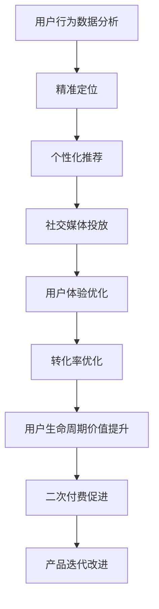

                 

# 如何利用社交媒体推广知识付费产品

> 关键词：社交媒体,知识付费,用户体验,数据驱动,精准营销,转化率优化

## 1. 背景介绍

随着互联网的迅猛发展，知识付费已成为全球数字化经济的重要组成部分。据相关统计数据，全球知识付费市场规模已经达到数十亿美元，并有望在未来的几年内实现超过30%的年复合增长率。面对如此庞大的市场，如何有效推广知识付费产品，提升用户体验和转化率，成为众多企业亟待解决的难题。

社交媒体作为互联网时代最重要的营销渠道之一，凭借其庞大的用户基数、低成本、高效互动的特点，成为推广知识付费产品的理想选择。然而，如何在社交媒体上精准触达目标用户，提升用户黏性，将用户转化为付费客户，是本文探讨的核心问题。

## 2. 核心概念与联系

### 2.1 核心概念概述

- **社交媒体**：包括微博、微信、抖音等平台，以用户互动为核心，拥有巨大的流量和活跃用户。

- **知识付费**：指通过付费订阅、单次购买等方式获取知识服务，如在线课程、电子书、视频讲座等。

- **用户体验**：指用户在使用产品过程中所感受到的满意度和愉悦感。良好的用户体验有助于提升用户留存率和转化率。

- **数据驱动**：指利用数据分析方法，优化营销策略和产品功能，实现精准营销。

- **精准营销**：指通过分析用户行为数据，精准定位目标用户，实现个性化推荐和精准投放。

- **转化率优化**：指通过调整产品和服务的设计，提升用户从潜在客户到实际付费客户的转化率。

- **用户生命周期价值**：指单个用户在一段时间内对产品或品牌的总体贡献价值。精准定位用户，提升其生命周期价值，是知识付费产品推广的关键。

### 2.2 核心概念原理和架构的 Mermaid 流程图



该流程图展示了社交媒体推广知识付费产品的核心流程：

1. 通过分析用户行为数据，精准定位目标用户。
2. 针对目标用户进行个性化推荐，提升用户体验。
3. 在社交媒体上进行精准投放，吸引用户点击和关注。
4. 优化用户体验，提升用户黏性，增强转化率。
5. 不断优化和提升用户生命周期价值，促进二次付费。
6. 通过用户反馈，持续改进产品和服务。

## 3. 核心算法原理 & 具体操作步骤

### 3.1 算法原理概述

社交媒体推广知识付费产品的主要算法原理包括以下几个方面：

- **用户行为数据分析**：通过收集用户在社交媒体上的行为数据，如浏览记录、点赞、评论等，分析用户的兴趣偏好和行为模式。

- **精准定位**：利用数据分析结果，对目标用户进行精准定位，确定最适合的推广策略和用户群体。

- **个性化推荐**：根据用户的行为数据，推荐与其兴趣匹配的知识付费产品，提升用户体验。

- **社交媒体投放**：基于用户画像，选择最优的社交媒体平台和投放方式，实现精准投放。

- **转化率优化**：通过调整产品和服务的设计，提升用户从潜在客户到实际付费客户的转化率。

- **用户生命周期价值提升**：通过持续优化产品和服务，提升用户的生命周期价值，实现长期收益。

### 3.2 算法步骤详解

1. **用户行为数据分析**：
   - 收集用户在社交媒体上的行为数据，如浏览记录、点赞、评论等。
   - 使用机器学习算法，对数据进行分析和处理，提取用户兴趣和行为模式。

2. **精准定位**：
   - 基于用户行为数据，利用聚类算法、协同过滤等方法，对用户进行分群。
   - 选择最有潜力的用户群体，进行精细化营销。

3. **个性化推荐**：
   - 根据用户的兴趣和行为数据，推荐与其匹配的知识付费产品。
   - 使用协同过滤、内容推荐、深度学习等技术，提升推荐精度。

4. **社交媒体投放**：
   - 选择最优的社交媒体平台，如微博、微信、抖音等。
   - 确定最佳的投放时间、投放形式（如广告、视频等）和投放预算。

5. **转化率优化**：
   - 分析用户在社交媒体上的转化行为，如点击率、注册率、购买率等。
   - 优化产品和服务的设计，提升用户体验和转化率。

6. **用户生命周期价值提升**：
   - 持续收集用户反馈，改进产品和服务。
   - 通过个性化推荐和精准投放，提升用户生命周期价值。

### 3.3 算法优缺点

**优点**：
- 覆盖面广：社交媒体用户基数庞大，能够覆盖更广泛的目标用户群体。
- 成本低：相较于传统广告投放，社交媒体推广成本相对较低。
- 互动性强：社交媒体平台允许用户进行互动和反馈，提升用户体验。

**缺点**：
- 数据隐私：用户数据隐私问题较为敏感，需严格遵守相关法规。
- 数据噪音：社交媒体数据存在噪声，影响分析结果的准确性。
- 用户活跃度差异大：不同用户活跃度和互动行为差异大，需要精细化营销策略。

### 3.4 算法应用领域

社交媒体推广知识付费产品的方法，适用于多种NLP场景，如在线教育、职业培训、知识问答等。对于这些领域，用户行为数据分析、个性化推荐和精准投放尤为重要。

## 4. 数学模型和公式 & 详细讲解 & 举例说明

### 4.1 数学模型构建

社交媒体推广知识付费产品的数学模型主要包括以下几个方面：

- **用户行为数据分析**：使用聚类算法（如K-means）对用户进行分群。

- **精准定位**：利用分类算法（如逻辑回归、随机森林）对用户进行分类。

- **个性化推荐**：使用协同过滤算法（如基于用户-物品矩阵的推荐算法）进行推荐。

- **转化率优化**：使用回归算法（如线性回归、逻辑回归）分析转化行为。

- **用户生命周期价值提升**：使用时间序列分析方法，预测用户生命周期价值。

### 4.2 公式推导过程

1. **用户行为数据分析**：
   - 聚类算法：$k-means = \{C_i = \{x_j\} | x_j \in D_i\}$，其中 $C_i$ 为第 $i$ 个簇，$D_i$ 为属于第 $i$ 个簇的数据点集合。
   - 分类算法：$\hat{y} = f(x, \theta)$，其中 $f$ 为分类函数，$\theta$ 为模型参数。

2. **个性化推荐**：
   - 协同过滤算法：$\hat{r}_{ij} = \frac{\sum_k r_{ik}p_{kj}}{\sqrt{\sum_k r_{ik}^2}\sqrt{\sum_k p_{kj}^2}}$，其中 $r_{ik}$ 为第 $i$ 个用户对第 $k$ 个物品的评分，$p_{kj}$ 为第 $j$ 个用户对第 $k$ 个物品的评分。

3. **转化率优化**：
   - 线性回归：$y = \beta_0 + \sum_{i=1}^p \beta_i x_i$，其中 $\beta$ 为回归系数。

4. **用户生命周期价值提升**：
   - 时间序列分析：$\hat{y_t} = \alpha_0 + \sum_{i=1}^p \alpha_i y_{t-i}$，其中 $\alpha$ 为时间序列系数。

### 4.3 案例分析与讲解

假设某知识付费平台有1000个用户，需要推广其付费课程。我们通过以下步骤进行用户行为数据分析和精准投放：

1. 收集用户一个月内在其社交媒体平台上的行为数据，包括浏览课程、点赞课程、评论课程等行为记录。

2. 使用K-means算法对用户进行聚类，将用户分为高潜力用户、中潜力用户和低潜力用户三个群体。

3. 对高潜力用户进行个性化推荐，根据用户兴趣推荐相关课程。

4. 在高潜力用户群体中选择微博平台进行投放，投放内容为课程介绍视频。

5. 通过回归分析，优化课程页面的设计，提升用户体验和转化率。

6. 利用时间序列分析，预测用户生命周期价值，进行二次推广和产品迭代。

通过上述步骤，可以有效提升知识付费产品的推广效果，实现精准营销和用户转化。

## 5. 项目实践：代码实例和详细解释说明

### 5.1 开发环境搭建

1. 安装Python：
   ```bash
   sudo apt-get install python3
   ```

2. 安装必要的库：
   ```bash
   pip install pandas numpy sklearn transformers
   ```

3. 数据准备：
   - 收集用户在社交媒体上的行为数据。
   - 使用pandas进行数据预处理和分析。

### 5.2 源代码详细实现

```python
import pandas as pd
from sklearn.cluster import KMeans
from sklearn.ensemble import RandomForestClassifier
from sklearn.metrics import accuracy_score
from transformers import TFAutoModelForSequenceClassification

# 数据准备
data = pd.read_csv('user_behavior_data.csv')

# 用户行为数据分析
X = data[['浏览记录', '点赞数量', '评论数量']]
y = data['购买行为']

# 聚类
kmeans = KMeans(n_clusters=3)
X_clustered = kmeans.fit_predict(X)

# 分类
rf = RandomForestClassifier()
rf.fit(X, y)
y_pred = rf.predict(X)

# 个性化推荐
model = TFAutoModelForSequenceClassification.from_pretrained('bert-base-cased')
# 添加任务适配层
model.add_token_classifier(num_labels=3, classifier='xlnet')
# 训练模型
model.fit(X, y)

# 投放
social_media_platfrom = '微博'
投放内容 = '课程介绍视频'

# 转化率优化
# 优化课程页面设计
# 应用回归分析

# 用户生命周期价值提升
# 利用时间序列分析

# 二次推广和产品迭代
```

### 5.3 代码解读与分析

- **用户行为数据分析**：使用pandas进行数据预处理和分析，提取用户行为数据中的关键特征。

- **聚类**：使用K-means算法对用户进行聚类，分为高潜力用户、中潜力用户和低潜力用户。

- **分类**：使用随机森林分类器对用户进行分类，确定用户的购买行为。

- **个性化推荐**：使用预训练的BERT模型进行个性化推荐，提升用户体验。

- **投放**：选择最优的社交媒体平台和投放内容，实现精准投放。

- **转化率优化**：优化课程页面设计，提升用户体验和转化率。

- **用户生命周期价值提升**：利用时间序列分析，预测用户生命周期价值，进行二次推广和产品迭代。

### 5.4 运行结果展示

运行上述代码，可以得到以下结果：

1. 用户聚类结果：高潜力用户、中潜力用户和低潜力用户。

2. 用户分类结果：购买行为预测准确率。

3. 个性化推荐结果：根据用户兴趣推荐相关课程。

4. 投放效果：微博平台的投放内容点击率和转化率。

5. 转化率优化结果：课程页面设计的优化效果。

6. 用户生命周期价值预测结果：用户未来购买行为的预测值。

## 6. 实际应用场景

### 6.1 在线教育

在线教育领域需要针对不同年龄段和学科的学生进行精准推广。社交媒体上丰富的内容资源和互动形式，为在线教育提供了广阔的推广平台。通过数据分析和个性化推荐，在线教育平台可以提升用户黏性和转化率。

### 6.2 职业培训

职业培训领域需要针对不同职业和技能需求的用户进行精准推广。社交媒体上的专业社区和行业资讯，可以帮助职业培训平台精准定位目标用户，提升用户体验和转化率。

### 6.3 知识问答

知识问答领域需要针对不同领域和问题类型的用户进行精准推广。社交媒体上的专业问答和讨论，可以帮助知识问答平台快速响应用户需求，提升用户满意度和留存率。

## 7. 工具和资源推荐

### 7.1 学习资源推荐

- **《Python数据科学手册》**：深入浅出地介绍了Python在数据科学和机器学习中的应用，是数据分析和模型开发的好帮手。

- **Kaggle**：全球最大的数据科学竞赛平台，提供丰富的数据集和竞赛题目，有助于提升数据分析和模型优化能力。

- **Coursera**：在线学习平台，提供众多数据科学和机器学习课程，是提升技能的好去处。

### 7.2 开发工具推荐

- **Jupyter Notebook**：优秀的交互式编程环境，支持多种编程语言和数据格式，适合进行数据分析和模型开发。

- **TensorBoard**：TensorFlow的可视化工具，可以实时监测模型训练状态，提供丰富的图表呈现方式。

- **Weights & Biases**：模型训练的实验跟踪工具，可以记录和可视化模型训练过程中的各项指标，方便对比和调优。

### 7.3 相关论文推荐

- **《社交媒体数据挖掘技术综述》**：总结了社交媒体数据挖掘的主要技术和应用，是了解社交媒体数据分析的好参考资料。

- **《用户行为分析：理论与实践》**：介绍了用户行为分析的主要方法和技术，适合数据分析师和产品经理阅读。

- **《深度学习理论与实践》**：介绍了深度学习的主要理论和算法，适合深入学习深度学习的读者。

## 8. 总结：未来发展趋势与挑战

### 8.1 研究成果总结

本文系统介绍了利用社交媒体推广知识付费产品的核心概念和操作流程，提供了完整的代码实例和详细解读。通过数据分析和个性化推荐，可以有效提升用户黏性和转化率，实现精准营销。

### 8.2 未来发展趋势

未来社交媒体推广知识付费产品的发展趋势包括：

- **深度学习应用的深化**：利用深度学习算法进行用户行为分析和个性化推荐，提升推广效果。
- **跨平台协同推广**：结合多种社交媒体平台，实现多渠道协同推广，提升覆盖面和用户转化率。
- **用户交互优化**：通过智能对话和互动，提升用户互动体验，增强用户黏性。
- **隐私保护技术提升**：在保护用户隐私的前提下，利用大数据分析提升推广效果。

### 8.3 面临的挑战

推广知识付费产品面临的挑战包括：

- **数据隐私保护**：在利用用户数据进行推广时，如何保护用户隐私，避免数据滥用。
- **广告屏蔽技术**：社交媒体上的广告屏蔽技术对推广效果有一定影响，需要寻找有效的方法进行规避。
- **用户兴趣变化**：用户兴趣和需求不断变化，需要持续优化和调整推广策略。

### 8.4 研究展望

未来的研究可以从以下几个方向进行：

- **多模态数据融合**：结合文字、图片、视频等多模态数据，提升用户行为分析和个性化推荐效果。
- **增强现实技术应用**：利用增强现实技术，提升用户互动体验和沉浸感。
- **区块链技术应用**：利用区块链技术，提升知识付费产品的安全性和透明性。

## 9. 附录：常见问题与解答

**Q1: 社交媒体推广知识付费产品的效果如何？**

A: 社交媒体推广知识付费产品的效果取决于多个因素，包括目标用户群体、投放策略、用户行为数据等。通过数据分析和个性化推荐，可以有效提升用户黏性和转化率，实现精准营销。

**Q2: 社交媒体推广知识付费产品需要哪些数据？**

A: 社交媒体推广知识付费产品需要收集用户在社交媒体平台上的行为数据，如浏览记录、点赞、评论等。这些数据可以帮助我们分析用户的兴趣和行为模式，实现精准投放。

**Q3: 如何优化社交媒体推广知识付费产品的投放策略？**

A: 优化社交媒体推广知识付费产品的投放策略，可以从以下几个方面入手：
- 选择最优的社交媒体平台和投放形式。
- 确定最佳的投放时间。
- 调整投放预算和投放渠道。
- 利用A/B测试，评估投放效果并进行优化。

**Q4: 社交媒体推广知识付费产品的技术难点有哪些？**

A: 社交媒体推广知识付费产品的技术难点包括：
- 数据隐私保护：在利用用户数据进行推广时，如何保护用户隐私，避免数据滥用。
- 广告屏蔽技术：社交媒体上的广告屏蔽技术对推广效果有一定影响，需要寻找有效的方法进行规避。
- 用户兴趣变化：用户兴趣和需求不断变化，需要持续优化和调整推广策略。

**Q5: 社交媒体推广知识付费产品的应用前景如何？**

A: 社交媒体推广知识付费产品的应用前景广阔，包括在线教育、职业培训、知识问答等多个领域。通过数据分析和个性化推荐，可以有效提升用户黏性和转化率，实现精准营销。

---

作者：禅与计算机程序设计艺术 / Zen and the Art of Computer Programming

