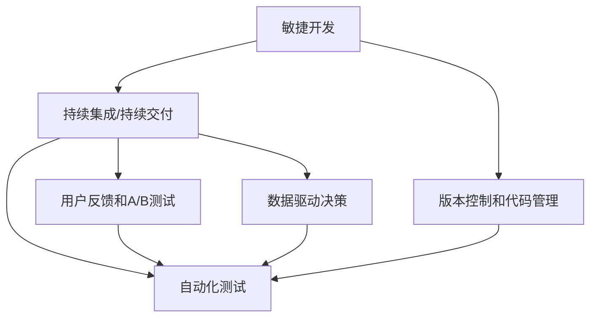

                 

## 1. 背景介绍

### 1.1 问题由来

自动化创业领域，尤其是通过AI和机器学习驱动的自动化工具和系统的开发，正迅速崛起。从自动驾驶汽车到智能客服系统，再到生产线自动化，自动化技术的广泛应用极大地提高了效率、降低了成本，并改变了各行各业的运作模式。但与此同时，自动化创业也面临诸多挑战，包括技术复杂性、市场需求不明确、技术迭代周期长等。如何在自动化创业中实现快速迭代，快速验证和优化产品，是所有创业者和工程师都需面对的问题。

### 1.2 问题核心关键点

快速迭代是实现自动化创业成功的关键。其核心在于通过快速的版本更新和用户反馈，不断优化产品功能，缩短从研发到市场的时间，从而提高竞争力和市场占有率。快速迭代依赖于以下几个关键点：

1. **敏捷开发**：采用敏捷开发方法论，注重小步快跑、快速反馈，以小版本为单位迭代产品。
2. **持续集成/持续交付(CI/CD)**：构建持续集成和持续交付流水线，自动化测试和部署，保障产品稳定性。
3. **版本控制和代码管理**：采用版本控制系统，如Git，实现代码版本控制，便于追踪变更历史和协作开发。
4. **用户反馈和A/B测试**：利用用户反馈和A/B测试，验证新功能的效果，快速发现并修复问题。
5. **自动化测试**：采用自动化测试工具，提高测试效率和覆盖率，确保每次迭代的产品质量。
6. **数据驱动决策**：通过数据分析和模型评估，辅助决策，优化迭代方向。

本文将深入探讨如何在自动化创业中实现快速迭代，从原理到实践，从算法到工具，全面剖析实现快速迭代的核心方法和最佳实践。

## 2. 核心概念与联系

### 2.1 核心概念概述

为更好地理解快速迭代的技术框架和方法论，本节将介绍几个关键概念：

- **敏捷开发**：一种基于迭代和反馈的开发方法论，注重快速交付和持续改进。
- **持续集成/持续交付(CI/CD)**：一种自动化开发和部署实践，通过流水线自动化测试和部署，保障产品快速上线和稳定运行。
- **版本控制和代码管理**：用于记录代码变更历史、追踪和协作开发的技术。
- **用户反馈和A/B测试**：收集用户反馈、验证新功能效果的方法。
- **自动化测试**：使用工具和框架自动化测试代码，提高测试效率和质量。
- **数据驱动决策**：基于数据分析和模型评估，指导迭代方向和优化决策。

这些概念之间的关系可以通过以下Mermaid流程图来展示：



该流程图展示了敏捷开发、CI/CD、版本控制、自动化测试、用户反馈和数据驱动决策之间的关系：

1. 敏捷开发通过迭代和反馈，不断迭代产品。
2. CI/CD通过流水线自动化测试和部署，保障快速上线和稳定性。
3. 版本控制和代码管理记录变更历史，支持协作开发。
4. 自动化测试提升测试效率和质量。
5. 用户反馈和A/B测试收集和验证新功能。
6. 数据驱动决策指导迭代优化。

这些核心概念共同构成了自动化创业中快速迭代的技术框架，为实现快速迭代提供了必要的工具和方法。

## 3. 核心算法原理 & 具体操作步骤

### 3.1 算法原理概述

快速迭代的原理是敏捷开发和持续集成/持续交付的结合。敏捷开发通过迭代和反馈不断优化产品，持续集成/持续交付通过流水线自动化测试和部署，保障快速上线和稳定性。以下是快速迭代的算法原理：

1. **迭代周期**：设定迭代周期（如2-4周），每个周期内开发一个或多个小功能。
2. **用户故事**：根据用户反馈和需求，定义用户故事，确保每个迭代都有明确目标。
3. **代码合并**：采用Git等版本控制系统，记录代码变更历史，实现代码合并和分支管理。
4. **自动化测试**：使用自动化测试工具，如Selenium、JUnit等，提高测试效率和覆盖率。
5. **持续集成/持续部署(CI/CD)**：构建CI/CD流水线，自动化构建、测试和部署，快速上线新功能。
6. **用户反馈**：通过用户反馈、A/B测试等手段，收集和验证新功能效果。
7. **数据分析**：利用数据驱动决策，优化迭代方向和产品功能。

### 3.2 算法步骤详解

#### 3.2.1 设定迭代周期和用户故事

1. **迭代周期设定**：根据项目规模和团队能力，设定迭代周期（如2-4周），确保每个迭代都有明确目标和时间节点。
2. **用户故事定义**：根据用户反馈和市场需求，定义用户故事，确保每个迭代都有明确的目标和需求。

#### 3.2.2 版本控制和代码管理

1. **版本控制系统选择**：选择Git作为版本控制系统，记录代码变更历史和分支管理。
2. **分支管理策略**：采用Git的分支管理策略，如feature branch、master branch等，确保代码的干净和可追溯性。
3. **代码审查和合并**：实施代码审查机制，确保代码质量，并在合并前进行测试和验证。

#### 3.2.3 自动化测试和CI/CD

1. **自动化测试框架选择**：选择Selenium、JUnit等自动化测试框架，编写测试用例，提升测试效率和覆盖率。
2. **CI/CD流水线构建**：构建CI/CD流水线，实现代码构建、测试和部署的自动化，确保每次迭代的质量和稳定性。
3. **流水线自动化**：将测试、构建和部署自动化集成到CI/CD流水线中，提高效率和一致性。

#### 3.2.4 用户反馈和A/B测试

1. **用户反馈机制建立**：建立用户反馈机制，收集用户的使用体验和建议，以便快速改进产品。
2. **A/B测试实施**：选择A/B测试工具，如Optimizely、Google Optimize等，对比新功能的效果，验证其效果和用户满意度。
3. **反馈整合和优化**：根据用户反馈和A/B测试结果，整合优化，不断迭代产品。

#### 3.2.5 数据分析和决策

1. **数据分析工具选择**：选择数据分析工具，如Tableau、Power BI等，收集和分析用户数据。
2. **模型评估和优化**：利用模型评估指标，如精确度、召回率、F1分数等，评估产品性能，优化迭代方向。
3. **数据驱动决策**：通过数据分析和模型评估，指导迭代优化，提升产品性能和用户体验。

### 3.3 算法优缺点

快速迭代具有以下优点：

1. **快速反馈**：通过快速迭代和反馈，及时发现和解决产品问题，提高产品稳定性和质量。
2. **灵活适应**：敏捷开发和持续集成/持续交付，使得团队能够快速适应市场变化和用户需求。
3. **成本效益**：通过自动化测试和部署，减少人工成本，提高开发效率。
4. **数据驱动**：通过数据分析和模型评估，指导迭代优化，提高决策的科学性和准确性。

但快速迭代也存在以下缺点：

1. **风险高**：快速迭代可能导致代码质量和稳定性下降，需通过严格的代码审查和自动化测试来控制风险。
2. **沟通成本高**：频繁迭代和反馈增加了团队之间的沟通成本，需有效的沟通机制来确保协作效率。
3. **需求管理困难**：快速迭代可能导致需求管理困难，需明确优先级和目标，确保每个迭代有明确方向。

### 3.4 算法应用领域

快速迭代方法在软件开发、产品设计、自动化系统开发等各个领域都有广泛应用，主要应用于：

1. **软件开发**：敏捷开发和CI/CD的结合，快速迭代和反馈，提升软件质量。
2. **产品设计**：通过用户反馈和A/B测试，快速验证和优化产品功能。
3. **自动化系统**：构建自动化测试和部署流水线，快速上线和迭代新功能。
4. **大数据分析**：通过数据分析和模型评估，指导数据驱动决策，优化迭代方向。

## 4. 数学模型和公式 & 详细讲解 & 举例说明

### 4.1 数学模型构建

本节将使用数学语言对快速迭代的方法论进行严格刻画。

设自动化创业项目为 $P$，定义其迭代周期为 $T$，用户故事为 $S$，版本控制为 $VC$，自动化测试为 $AT$，持续集成/持续交付为 $CI/CD$，用户反馈和A/B测试为 $UF$，数据分析和决策为 $DA$。

### 4.2 公式推导过程

根据快速迭代的算法原理，建立快速迭代模型：

1. **迭代周期**：
   $$
   T = \sum_{i=1}^n t_i
   $$
   其中 $t_i$ 为第 $i$ 个迭代周期的时间，$n$ 为总迭代次数。

2. **用户故事**：
   $$
   S = \sum_{i=1}^n s_i
   $$
   其中 $s_i$ 为第 $i$ 个迭代周期内完成的用户故事数量。

3. **版本控制**：
   $$
   VC = \sum_{i=1}^n v_i
   $$
   其中 $v_i$ 为第 $i$ 个迭代周期内版本控制的变更次数。

4. **自动化测试**：
   $$
   AT = \sum_{i=1}^n a_i
   $$
   其中 $a_i$ 为第 $i$ 个迭代周期内自动化测试的覆盖率。

5. **持续集成/持续交付**：
   $$
   CI/CD = \sum_{i=1}^n c_i
   $$
   其中 $c_i$ 为第 $i$ 个迭代周期内CI/CD流水线的执行次数。

6. **用户反馈和A/B测试**：
   $$
   UF = \sum_{i=1}^n u_i
   $$
   其中 $u_i$ 为第 $i$ 个迭代周期内用户反馈和A/B测试的次数。

7. **数据分析和决策**：
   $$
   DA = \sum_{i=1}^n d_i
   $$
   其中 $d_i$ 为第 $i$ 个迭代周期内数据分析和决策的次数。

通过以上模型，可以量化快速迭代过程中的各个环节，评估和优化快速迭代的效果。

### 4.3 案例分析与讲解

**案例分析**：一家自动驾驶初创公司通过快速迭代实现快速上线和迭代。

1. **迭代周期设定**：设定迭代周期为2周，每个迭代开发1-2个新功能。
2. **用户故事定义**：根据市场需求，定义用户故事，如“实现自动停车功能”、“优化驾驶路径规划”等。
3. **版本控制和代码管理**：使用Git进行版本控制，采用feature branch管理策略。
4. **自动化测试和CI/CD**：使用Selenium进行自动化测试，构建CI/CD流水线，实现代码构建、测试和部署的自动化。
5. **用户反馈和A/B测试**：通过用户反馈机制，收集驾驶员的使用体验，使用Optimizely进行A/B测试，验证新功能的性能。
6. **数据分析和决策**：使用Tableau收集和分析用户数据，利用模型评估指标，指导迭代优化。

**详细讲解**：
- **版本控制**：每个迭代周期内的代码变更历史都清晰记录在Git中，便于追踪和协作开发。
- **自动化测试**：通过Selenium等自动化测试工具，确保每次迭代的代码质量和稳定性。
- **CI/CD流水线**：将测试、构建和部署自动化集成到CI/CD流水线中，提高效率和一致性。
- **用户反馈和A/B测试**：通过用户反馈和A/B测试，收集和验证新功能的效果，快速改进产品。
- **数据分析和决策**：利用Tableau等数据分析工具，收集和分析用户数据，指导迭代优化。

## 5. 项目实践：代码实例和详细解释说明

### 5.1 开发环境搭建

#### 5.1.1 环境配置

1. **安装Java JDK**：
   ```bash
   sudo apt-get update
   sudo apt-get install default-jdk
   ```
2. **安装Maven**：
   ```bash
   wget http://maven.apache.org/tools/binaries/apache-maven-3.8.1-bin.tar.gz
   tar -xvf apache-maven-3.8.1-bin.tar.gz
   sudo mv apache-maven-3.8.1 /usr/local/maven
   ```
3. **配置环境变量**：
   ```bash
   export MAVEN_HOME=/usr/local/maven
   export PATH=$MAVEN_HOME/bin:$PATH
   ```

#### 5.1.2 项目初始化

1. **创建Maven项目**：
   ```bash
   mvn archetype:generate -DgroupId=com.example -DartifactId=my-automation-project -Dversion=1.0.0 -DarchetypeArtifactId=maven-archetype-quickstart
   cd my-automation-project
   ```

2. **添加依赖**：
   ```xml
   <dependencies>
       <dependency>
           <groupId>org.seleniumhq.selenium</groupId>
           <artifactId>selenium-java</artifactId>
           <version>3.141.59</version>
           <scope>test</scope>
       </dependency>
   </dependencies>
   ```

### 5.2 源代码详细实现

#### 5.2.1 编写自动化测试

**代码实现**：

```java
import org.openqa.selenium.WebDriver;
import org.openqa.selenium.chrome.ChromeDriver;
import org.openqa.selenium.WebElement;
import org.openqa.selenium.By;
import org.testng.Assert;
import org.testng.annotations.Test;

public class AutomationTest {
    
    @Test
    public void testAutomation() {
        // 启动Chrome浏览器
        WebDriver driver = new ChromeDriver();
        
        // 访问网页
        driver.get("https://www.example.com");
        
        // 验证页面元素
        WebElement element = driver.findElement(By.id("someElement"));
        Assert.assertTrue(element.isDisplayed());
        
        // 关闭浏览器
        driver.quit();
    }
}
```

**详细解释**：
- **WebDriver**：Selenium提供的Web页面自动化测试工具，可以模拟用户操作。
- **ChromeDriver**：Selenium的Chrome浏览器驱动程序。
- **测试方法**：通过测试方法@Test进行声明，并编写具体的测试步骤。
- **页面验证**：通过查找页面元素并验证其可见性，确保网页加载正常。
- **关闭浏览器**：测试结束后，关闭浏览器资源。

#### 5.2.2 构建CI/CD流水线

**代码实现**：

1. **pom.xml配置**：

```xml
<project>
    ...
    <build>
        <plugins>
            <plugin>
                <groupId>org.apache.maven.plugins</groupId>
                <artifactId>maven-surefire-plugin</artifactId>
                <version>2.22.2</version>
            </plugin>
            <plugin>
                <groupId>org.apache.maven.plugins</groupId>
                <artifactId>maven-surefire-report-plugin</artifactId>
                <version>2.22.2</version>
                <configuration>
                    <reports>
                        <report>
                            <groupId>org.sonatype.plugins</groupId>
                            <artifactId>report-html-maven-plugin</artifactId>
                            <version>3.0.2</version>
                        </report>
                    </reports>
                </configuration>
            </plugin>
        </plugins>
    </build>
</project>
```

2. **travis.yml配置**：

```yaml
language: java
env:
  - JAVA_HOME=/usr/lib/jvm/java-8-openjdk-amd64
sudo: required

script:
  - apt-get update -y
  - apt-get install -y libtool

matrix:
  include:
    - os: linux
      java: 8
      language: java

after_success:
  - npm install -g saucelabs-cli
  - saucelabs login -u $SAUCE_USERNAME -p $SAUCE_ACCESS_KEY
  - saucelabs test results: 1 --build $TRAVIS_BUILD_NUMBER --artifacts .
```

**详细解释**：
- **pom.xml配置**：
  - 配置Maven插件，使用Selenium进行自动化测试，并使用Sauce Labs进行云测试。
- **travis.yml配置**：
  - 配置CI/CD流水线，包括测试环境、测试命令和云测试配置。
  - 使用Sauce Labs进行云测试，确保每次迭代的质量和稳定性。

### 5.3 代码解读与分析

**代码解读**：
- **pom.xml**：配置Maven插件，使用Selenium进行自动化测试，并使用Sauce Labs进行云测试。
- **travis.yml**：配置CI/CD流水线，包括测试环境、测试命令和云测试配置。
- **自动化测试**：通过Selenium和WebDriver，编写自动化测试脚本，确保每次迭代的质量和稳定性。

**分析**：
- **测试环境**：确保每次迭代在一致的测试环境中运行，提高测试的可重复性和一致性。
- **测试用例**：编写具体的测试用例，验证新功能的效果，确保每次迭代的质量。
- **云测试**：利用Sauce Labs进行云测试，快速上线和验证新功能，提高迭代效率。

### 5.4 运行结果展示

**运行结果**：
- **测试通过**：自动化测试成功通过，确保每次迭代的质量和稳定性。
- **云测试结果**：通过Sauce Labs进行云测试，确保新功能在各种环境下的兼容性。

## 6. 实际应用场景

### 6.1 智能客服系统

基于快速迭代方法，智能客服系统可以快速上线和迭代新功能。通过持续收集用户反馈和A/B测试结果，不断优化智能客服系统，提升客户咨询体验和问题解决效率。

### 6.2 金融舆情监测

在金融舆情监测系统中，通过快速迭代方法，可以快速上线和验证新功能。通过数据分析和模型评估，指导迭代优化，提升舆情监测的准确性和时效性。

### 6.3 个性化推荐系统

个性化推荐系统通过快速迭代方法，可以快速上线和优化推荐算法。通过用户反馈和A/B测试，验证新算法的性能，不断优化推荐结果，提升用户体验。

### 6.4 未来应用展望

随着快速迭代方法的不断演进，自动化创业将迎来更多应用场景。在智慧医疗、智能制造、智慧城市等领域，快速迭代方法将带来更多创新应用，提升社会生产力和生活质量。

## 7. 工具和资源推荐

### 7.1 学习资源推荐

为了帮助开发者掌握快速迭代技术，以下是一些优质的学习资源：

1. **《敏捷开发实践指南》**：全面介绍敏捷开发方法论，包括Scrum、Kanban等。
2. **《持续集成与持续部署》**：深入讲解持续集成和持续交付的原理和实践，指导项目开发和部署。
3. **《Git权威指南》**：详细讲解Git的版本控制和协作开发。
4. **《Selenium自动化测试实战》**：提供Selenium的实战经验，指导Web自动化测试。
5. **《Sauce Labs云测试指南》**：介绍Sauce Labs的云测试服务，提高测试效率和覆盖率。

### 7.2 开发工具推荐

快速迭代需要依赖多款工具来辅助开发和部署。以下是几款推荐的开发工具：

1. **Git**：版本控制系统，支持代码变更历史记录和协作开发。
2. **Selenium**：Web页面自动化测试工具，支持多种浏览器和环境。
3. **Jenkins**：持续集成工具，支持自动化构建和部署。
4. **Travis CI**：云持续集成平台，支持基于GitHub的持续集成和部署。
5. **Sauce Labs**：云测试服务，支持多种测试环境和浏览器。

### 7.3 相关论文推荐

快速迭代技术的发展离不开学界的持续研究。以下是几篇奠基性的相关论文，推荐阅读：

1. **《敏捷开发：原则、实践与模式》**：介绍敏捷开发方法论的原则和实践。
2. **《持续集成与持续部署：软件工程最佳实践》**：全面讲解持续集成和持续交付的原理和实践。
3. **《版本控制系统：版本控制实践与工具》**：介绍版本控制系统的基本概念和工具。
4. **《Selenium：自动化测试工具》**：提供Selenium的实战经验，指导Web自动化测试。
5. **《云测试服务：Sauce Labs实践与案例》**：介绍Sauce Labs的云测试服务，提高测试效率和覆盖率。

## 8. 总结：未来发展趋势与挑战

### 8.1 研究成果总结

本文对快速迭代在自动化创业中的应用进行了全面系统的介绍。从原理到实践，从算法到工具，深入讲解了快速迭代的实现方法和最佳实践。快速迭代通过敏捷开发和持续集成/持续交付的结合，快速上线和迭代新功能，提高开发效率和产品质量。

### 8.2 未来发展趋势

快速迭代技术将呈现以下几个发展趋势：

1. **自动化程度提升**：通过更多自动化工具和流程，提高迭代效率和质量。
2. **多环境测试优化**：优化多环境测试策略，确保新功能在不同环境下的兼容性。
3. **数据驱动决策**：利用数据驱动决策，优化迭代方向和产品功能。
4. **持续学习和改进**：通过持续学习和改进，提升团队能力和产品竞争力。

### 8.3 面临的挑战

尽管快速迭代技术在自动化创业中表现出色，但仍面临以下挑战：

1. **技术复杂性**：快速迭代涉及多个工具和流程，需有效管理和协调。
2. **需求管理**：快速迭代可能导致需求管理困难，需明确优先级和目标。
3. **质量控制**：快速迭代可能导致代码质量和稳定性下降，需通过严格的代码审查和自动化测试来控制风险。
4. **沟通成本**：频繁迭代和反馈增加了团队之间的沟通成本，需有效的沟通机制来确保协作效率。

### 8.4 研究展望

未来的研究需要在以下几个方面寻求新的突破：

1. **自动化工具优化**：优化自动化测试和部署工具，提高效率和覆盖率。
2. **持续学习和改进**：引入持续学习和改进机制，提升团队能力和产品竞争力。
3. **数据驱动决策**：利用数据分析和模型评估，指导迭代优化，提高决策的科学性和准确性。
4. **跨部门协作**：加强跨部门协作，提高快速迭代的效果和效率。

总之，快速迭代技术在自动化创业中具有重要意义，需要不断探索和优化，才能更好地应对市场变化和用户需求，实现创新和突破。

## 9. 附录：常见问题与解答

**Q1：快速迭代对团队和技术有什么要求？**

A: 快速迭代对团队和技术有以下要求：
1. **团队协作**：团队需要具备敏捷开发和协作能力，能快速响应需求变化。
2. **技术栈**：需要掌握版本控制、自动化测试、持续集成等技术栈，提高开发效率和产品质量。
3. **工具选择**：需要选择适合的技术工具，如Git、Selenium、Jenkins等。
4. **持续改进**：需要持续改进和优化，不断提升团队能力和产品竞争力。

**Q2：快速迭代和敏捷开发有什么区别？**

A: 快速迭代是敏捷开发的一种实践，强调小步快跑、快速反馈。敏捷开发强调通过迭代和反馈不断优化产品，快速响应市场变化和用户需求。快速迭代强调快速上线和迭代新功能，而敏捷开发更注重整个开发流程的敏捷性和灵活性。

**Q3：如何有效管理快速迭代的需求？**

A: 有效管理快速迭代的需求需明确优先级和目标，采用敏捷开发方法论，通过用户故事、迭代计划和回顾会议等工具，确保每个迭代有明确方向和目标。同时，利用数据分析和模型评估，指导迭代优化，提高需求管理的科学性和准确性。

**Q4：如何快速上线新功能？**

A: 通过快速迭代和持续集成/持续交付，可以快速上线新功能。具体步骤如下：
1. **需求分析**：定义用户故事，明确需求目标。
2. **代码编写和测试**：编写新功能的代码，并进行自动化测试。
3. **CI/CD流水线**：构建CI/CD流水线，自动化构建、测试和部署，快速上线新功能。
4. **用户反馈和A/B测试**：通过用户反馈和A/B测试，收集和验证新功能的效果。

**Q5：如何快速验证新功能的性能？**

A: 快速验证新功能的性能需采用自动化测试和数据分析，具体步骤如下：
1. **自动化测试**：编写自动化测试用例，通过Selenium等工具，确保每次迭代的质量和稳定性。
2. **数据分析和决策**：利用Tableau等数据分析工具，收集和分析用户数据，指导迭代优化。
3. **持续集成和持续部署**：通过持续集成和持续部署，快速上线和验证新功能，提高迭代效率。

总之，快速迭代技术在自动化创业中具有重要意义，需要不断探索和优化，才能更好地应对市场变化和用户需求，实现创新和突破。

---

作者：禅与计算机程序设计艺术 / Zen and the Art of Computer Programming

