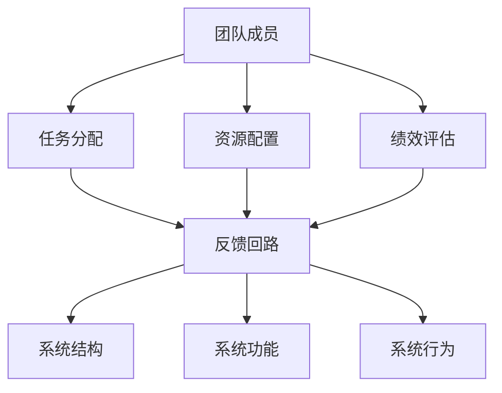

                 

# 如何将系统思考应用于团队管理

## 1. 背景介绍

系统思考(Systemic Thinking)是一种用于理解和解决复杂问题的思维范式，强调从整体视角审视问题，并关注系统中各组成部分之间的相互作用与依赖关系。在团队管理中，系统思考方法被广泛应用，帮助团队成员从系统的角度理解组织运作机制，识别问题症结，制定科学决策。本博客文章将深入探讨如何将系统思考应用于团队管理，构建高效、协同的团队，以实现共同目标。

## 2. 核心概念与联系

### 2.1 核心概念概述

系统思考是一个多维度的概念，涉及系统的定义、结构、功能、行为等多个方面。在团队管理中，以下概念尤为关键：

- **反馈回路(Feedback Loop)**：系统内各组成部分之间的信息交换与互动。如团队成员之间的沟通、协作、评估等，通过持续的反馈回路，团队能够不断优化其运作方式。

- **系统结构(System Structure)**：系统各组成部分之间的关系和层次。在团队管理中，系统结构决定了团队协作的框架和模式。

- **系统功能(System Function)**：系统所具有的输入、输出、转换等功能。团队功能包括目标设定、任务分配、资源配置、绩效评估等。

- **系统行为(System Behavior)**：系统在外部环境影响下的动态表现。团队行为体现为工作节奏、团队士气、沟通效率等。

### 2.2 核心概念原理和架构的 Mermaid 流程图



该流程图展示了团队管理的核心概念及其相互关系。团队成员通过任务分配、资源配置、绩效评估等活动，在反馈回路中进行信息交流和动态调整，系统结构和功能得以保持和优化，进而影响系统行为。

## 3. 核心算法原理 & 具体操作步骤

### 3.1 算法原理概述

系统思考应用于团队管理，其核心在于理解团队的动态过程和内部相互作用，通过识别和分析系统中的反馈回路，调整系统结构，优化系统功能，从而改善系统行为，提升团队整体表现。具体来说，包括以下几个步骤：

1. **识别反馈回路**：识别团队内部及外部的信息流动，包括任务沟通、绩效反馈、团队讨论等，理解团队动态变化。

2. **分析系统结构**：分析团队成员的角色、职责、关系，识别可能的瓶颈和改进空间。

3. **优化系统功能**：调整任务分配、资源配置、绩效评估等机制，确保团队功能有效运行。

4. **改善系统行为**：通过调整反馈回路和系统结构，改进团队沟通、协作、激励等行为，提升团队整体效率和满意度。

### 3.2 算法步骤详解

#### 3.2.1 识别反馈回路

1. **记录信息流动**：收集和记录团队内各成员之间的信息交换和反馈情况，如日常沟通、会议纪要、任务分配等。

2. **绘制反馈回路图**：将信息流动映射为图形，标识出关键节点和反馈回路，如任务分配、进度更新、绩效评估等。

3. **分析信息流**：评估信息流的效率和准确性，识别可能的滞后和误导，找出问题的根源。

#### 3.2.2 分析系统结构

1. **角色和职责分析**：确定每个成员的角色和职责，明确其在团队中的定位和贡献。

2. **关系网络分析**：利用网络分析方法，分析团队成员之间的连接强度和互动模式，识别潜在的沟通障碍和协作机会。

3. **瓶颈识别**：通过分析系统结构，识别可能的瓶颈和薄弱环节，如信息孤岛、决策迟缓等。

#### 3.2.3 优化系统功能

1. **任务分配优化**：采用更科学的任务分配方法，如基于技能和兴趣的匹配，或采用更加自动化的任务分配工具。

2. **资源配置优化**：合理分配人力资源、物理资源和技术资源，确保资源的高效利用。

3. **绩效评估优化**：采用更加客观和及时的绩效评估工具，如关键绩效指标(KPIs)和360度评估。

#### 3.2.4 改善系统行为

1. **改进沟通机制**：采用更高效的沟通工具和方法，如即时通讯、协作平台、定期会议等，提高信息流通的速度和准确性。

2. **增强协作和协同**：引入团队协作工具和协同机制，如代码共享、项目管理系统，促进成员间的合作与互动。

3. **激励机制改进**：设计合理的激励机制，如目标设定、奖励制度，激发成员的积极性和创造力。

### 3.3 算法优缺点

**优点：**

1. **全局视角**：系统思考帮助团队从整体视角理解问题，避免局部优化导致的整体风险。

2. **动态调整**：通过持续的反馈回路和系统分析，团队能够灵活应对环境变化，保持敏捷性。

3. **协同效应**：系统思考促进团队成员之间的协作和信任，增强团队整体效能。

**缺点：**

1. **复杂度高**：系统思考涉及多维度、多层次的分析和调整，需要较高的综合能力。

2. **实施难度大**：需要团队的深度合作和持续投入，对现有流程的改造和优化可能会遇到阻力。

3. **依赖数据**：系统思考的实施效果高度依赖于数据的准确性和全面性，需要系统化的数据收集和分析。

### 3.4 算法应用领域

系统思考方法广泛应用于各种组织和团队管理中，包括但不限于以下领域：

- **软件开发团队**：通过优化任务分配和沟通机制，提升开发效率和代码质量。
- **项目管理团队**：通过改善资源配置和绩效评估，提升项目管理效果。
- **产品研发团队**：通过协同创新和及时反馈，加速产品迭代和市场响应。
- **客户服务团队**：通过持续改进服务流程和客户反馈，提升客户满意度和忠诚度。

## 4. 数学模型和公式 & 详细讲解 & 举例说明

### 4.1 数学模型构建

在系统思考中，我们可以使用一些简单的数学模型来量化团队的运作情况。以下是一个简化的团队绩效模型：

$$
\text{Team Performance} = \sum_{i=1}^n \text{Member i Performance} \times \text{Collaboration i}
$$

其中，$n$ 表示团队成员数，$\text{Member i Performance}$ 表示第 $i$ 个成员的个体绩效，$\text{Collaboration i}$ 表示第 $i$ 个成员与其他成员的协作度。

### 4.2 公式推导过程

1. **成员绩效建模**：
   $$
   \text{Member i Performance} = f(\text{Skill i}, \text{Experience i}, \text{Effort i})
   $$

   其中，$\text{Skill i}$、$\text{Experience i}$、$\text{Effort i}$ 分别表示第 $i$ 个成员的技能水平、经验积累和努力程度。

2. **协作度建模**：
   $$
   \text{Collaboration i} = g(\text{Communication i}, \text{Trust i}, \text{Support i})
   $$

   其中，$\text{Communication i}$、$\text{Trust i}$、$\text{Support i}$ 分别表示第 $i$ 个成员与其他成员的沟通频率、信任程度和支持力度。

3. **团队绩效计算**：
   $$
   \text{Team Performance} = \sum_{i=1}^n \text{Member i Performance} \times \text{Collaboration i}
   $$

   通过将个体绩效和协作度相乘，我们可以计算出团队的总体绩效。

### 4.3 案例分析与讲解

假设有一个软件开发团队，成员 $i$ 的绩效函数 $f$ 为：
$$
f(\text{Skill i}, \text{Experience i}, \text{Effort i}) = \text{Skill i}^0.5 \times \text{Experience i}^{0.2} \times \text{Effort i}^{0.3}
$$

协作度 $g$ 函数 $g$ 为：
$$
g(\text{Communication i}, \text{Trust i}, \text{Support i}) = \text{Communication i}^0.4 \times \text{Trust i}^{0.2} \times \text{Support i}^{0.4}
$$

如果团队有5名成员，每个成员的绩效和协作度如表所示：

| 成员 | Skill | Experience | Effort | Communication | Trust | Support |
| --- | --- | --- | --- | --- | --- | --- |
| A | 9 | 8 | 7 | 6 | 5 | 5 |
| B | 8 | 7 | 6 | 6 | 6 | 7 |
| C | 7 | 7 | 6 | 5 | 5 | 6 |
| D | 7 | 7 | 6 | 7 | 7 | 8 |
| E | 8 | 9 | 8 | 7 | 7 | 7 |

计算团队的总绩效：

$$
\begin{aligned}
&\text{Team Performance} \\
&= 9^{0.5} \times 8^{0.2} \times 7^{0.3} \times 6^{0.4} \times 5^{0.2} \times 5^{0.4} \\
&\quad \times 8^{0.5} \times 7^{0.2} \times 6^{0.3} \times 5^{0.4} \times 5^{0.2} \times 6^{0.4} \\
&\quad \times 7^{0.5} \times 7^{0.2} \times 6^{0.3} \times 7^{0.4} \times 7^{0.2} \times 7^{0.4} \\
&\quad \times 8^{0.5} \times 9^{0.2} \times 8^{0.3} \times 7^{0.4} \times 7^{0.2} \times 7^{0.4}
\end{aligned}
$$

$$
\approx 286.53
$$

可以看出，团队的总体绩效很大程度上取决于成员的协作度，特别是在沟通和信任方面。

## 5. 项目实践：代码实例和详细解释说明

### 5.1 开发环境搭建

为了构建一个基于系统思考的团队管理平台，需要以下开发环境：

1. **编程语言**：Python。
2. **数据管理**：使用SQL数据库（如MySQL）或NoSQL数据库（如MongoDB）。
3. **数据可视化**：使用Matplotlib、Seaborn、D3.js等库。
4. **Web框架**：使用Flask、Django等框架。

### 5.2 源代码详细实现

以下是一个简单的Python代码示例，用于分析团队成员的协作度：

```python
import pandas as pd

# 定义成员绩效和协作度函数
def member_performance(skill, experience, effort):
    return skill**0.5 * experience**0.2 * effort**0.3

def collaboration(communication, trust, support):
    return communication**0.4 * trust**0.2 * support**0.4

# 假设数据集
data = {
    'Skill': [9, 8, 7, 7, 8],
    'Experience': [8, 7, 7, 7, 9],
    'Effort': [7, 6, 6, 6, 8],
    'Communication': [6, 6, 5, 7, 7],
    'Trust': [5, 6, 5, 7, 7],
    'Support': [5, 7, 6, 8, 7]
}

# 创建DataFrame
df = pd.DataFrame(data)

# 计算成员绩效和协作度
df['Performance'] = df.apply(lambda row: member_performance(row['Skill'], row['Experience'], row['Effort']), axis=1)
df['Collaboration'] = df.apply(lambda row: collaboration(row['Communication'], row['Trust'], row['Support']), axis=1)

# 计算团队总绩效
team_performance = df['Performance'].prod() * df['Collaboration'].prod()

# 输出结果
print(f"Team Performance: {team_performance}")
```

### 5.3 代码解读与分析

这段代码首先定义了成员绩效和协作度的计算函数，然后基于示例数据创建了一个DataFrame，计算每个成员的绩效和协作度，并最终得到团队的总绩效。

## 6. 实际应用场景

### 6.1 软件开发团队

在软件开发团队中，系统思考可以通过优化任务分配和沟通机制，提升开发效率和代码质量。例如，使用系统思考识别出代码审查机制的反馈回路，可以通过改进代码审查流程和工具，提高代码质量，减少重复工作，加速项目进度。

### 6.2 项目管理团队

项目管理团队可以采用系统思考来优化资源配置和绩效评估。通过分析项目的各阶段需求和资源需求，合理分配人力资源和物理资源，确保项目按期完成，同时采用360度评估工具，及时反馈项目进展和团队表现，调整策略，提升项目管理效果。

### 6.3 产品研发团队

产品研发团队可以通过系统思考来促进协同创新和及时反馈。使用系统思考方法，识别团队内部和外部的反馈回路，如市场反馈、用户反馈、研发进展等，建立闭环反馈机制，确保产品迭代快速响应市场需求。

### 6.4 客户服务团队

客户服务团队可以通过系统思考来改善服务流程和客户反馈。通过分析客户投诉、服务响应时间、服务质量等数据，识别系统中的瓶颈和改进点，优化服务流程，提高客户满意度和忠诚度。

## 7. 工具和资源推荐

### 7.1 学习资源推荐

- **书籍推荐**：《系统思考：发现复杂系统中的智慧》、《The Systems Thinking Approach to Changing Complexity》
- **在线课程**：Coursera上的《系统动力学和系统思考》课程、edX上的《系统思考与组织变革》课程
- **研讨会和会议**：国际系统动力学会议(ISDC)、系统思考中国年会等

### 7.2 开发工具推荐

- **数据管理工具**：MySQL、MongoDB、Elasticsearch
- **数据分析工具**：Python、R、Matplotlib、Seaborn、Tableau
- **项目管理工具**：JIRA、Trello、Asana
- **沟通协作工具**：Slack、Microsoft Teams、Confluence
- **代码管理工具**：Git、GitHub、Bitbucket

### 7.3 相关论文推荐

- **经典论文**：系统思考的起源论文《The Cybernetics of Organizations》、系统动力学领域的奠基性论文《A Framework for Responding to Complexity》

## 8. 总结：未来发展趋势与挑战

### 8.1 研究成果总结

系统思考方法在团队管理中的应用已经取得了显著成效，帮助团队从全局视角理解问题，识别并优化系统中的关键环节，提升团队整体效能。未来，系统思考将进一步与其他先进管理理论和方法结合，如精益管理、敏捷开发、设计思维等，形成更加综合的管理框架。

### 8.2 未来发展趋势

1. **智能管理系统的崛起**：随着AI和大数据技术的发展，系统思考将更多地与智能系统结合，利用数据驱动的决策支持，提升团队管理的自动化和智能化水平。

2. **跨领域应用拓展**：系统思考将突破传统行业的应用界限，应用于更多领域，如医疗、教育、制造等，为不同行业的团队管理提供科学方法。

3. **自我学习与改进**：系统思考将发展为一种自我学习与改进的机制，通过持续的反馈和调整，不断优化团队运作，提高组织适应性和竞争力。

4. **社会化系统思考**：系统思考将与其他社会化技术结合，如区块链、物联网等，构建更加复杂的社会化管理系统。

### 8.3 面临的挑战

1. **数据质量与数据安全**：系统思考高度依赖数据的准确性和安全性，如何有效获取、管理和保护数据，是未来的一大挑战。

2. **技术整合与标准化**：系统思考需要与其他技术手段整合，如云计算、AI、物联网等，如何实现技术标准的统一和系统兼容，是实现技术融合的关键。

3. **组织文化与变革管理**：系统思考的实施需要组织文化的支持，如何推动组织变革，打破旧有习惯和壁垒，是实施系统思考的重要条件。

4. **人才储备与培养**：系统思考需要高素质的管理人才，如何培养和储备系统思考的专业人才，是未来人才发展的关键。

### 8.4 研究展望

未来的研究可以从以下几个方面展开：

1. **数据驱动的系统思考**：利用大数据和AI技术，实现系统思考的智能化和自动化，提升数据驱动决策的准确性。

2. **多层次的系统思考**：将系统思考应用于多层次的管理系统，从微观到宏观，建立全面的管理系统。

3. **跨学科的系统思考**：系统思考将与其他学科理论结合，如心理学、社会学、经济学等，形成更加综合的系统管理理论。

4. **人工智能与系统思考的融合**：探索AI技术在系统思考中的应用，如基于AI的预测模型、基于AI的反馈机制等，提升系统思考的精准度和效率。

总之，系统思考在团队管理中的应用将不断深入和扩展，为组织的可持续发展提供科学、系统的管理方法。面对未来的挑战，我们需要持续探索和创新，不断优化系统思考的实践方法，推动组织管理的高效和智能化发展。

---

作者：禅与计算机程序设计艺术 / Zen and the Art of Computer Programming

