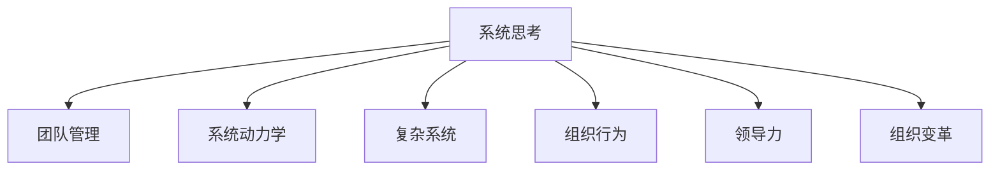

                 

# 如何将系统思考应用于团队管理

> 关键词：系统思考, 团队管理, 系统动力学, 复杂系统, 组织行为, 领导力, 组织变革

## 1. 背景介绍

### 1.1 问题由来
随着企业规模的不断扩大和复杂性的增加，团队管理已成为企业管理中的一个关键难题。传统的线性思维模式，往往无法充分理解团队动态的复杂性，导致管理效率低下、冲突频发。系统思考（Systems Thinking）作为一门系统科学的学科，强调从整体视角分析问题，注重各要素之间的相互作用和动态演变，从而揭示问题的深层根源。

### 1.2 问题核心关键点
系统思考在团队管理中的应用，旨在通过整体视角识别和解决问题，增强团队协作，提升组织效率和响应能力。其主要包括以下几个关键点：

1. **整体视角**：理解团队作为一个整体，而不是孤立的个体。
2. **反馈回路**：识别并管理团队中的各种反馈回路，如沟通、奖励等，以增强团队协作。
3. **动态演变**：理解团队动态变化的过程，及时调整管理策略以适应变化。
4. **领导力与变革**：通过系统思考培养领导者的全局观，推动组织变革。

系统思考在团队管理中的应用，有助于构建更具弹性和响应性的组织结构，促进团队高效合作，提升企业竞争力。

### 1.3 问题研究意义
系统思考应用于团队管理的研究意义在于：

1. **提升管理效率**：通过整体视角理解团队动态，可以更有效地识别和解决问题，提升团队管理效率。
2. **增强团队协作**：系统思考注重团队成员之间的相互作用和沟通，有助于增强团队协作和凝聚力。
3. **促进组织变革**：系统思考为组织变革提供了新的视角和方法，有助于企业适应快速变化的环境。
4. **培养领导力**：系统思考强调全局观和战略思维，有助于培养具有系统思维的领导者。
5. **推动创新发展**：系统思考鼓励从整体视角寻找创新解决方案，推动企业创新发展。

系统思考在团队管理中的应用，为解决企业管理中的复杂问题提供了新的思路和方法，具有重要的理论价值和实践意义。

## 2. 核心概念与联系

### 2.1 核心概念概述

为更好地理解系统思考在团队管理中的应用，本节将介绍几个关键概念：

- **系统思考(Systems Thinking)**：一种系统科学的思维模式，强调从整体视角分析问题，识别和理解系统中的反馈回路，洞察系统的动态演变过程。
- **团队管理(Team Management)**：通过有效的组织、协调和激励，使团队成员协同工作，实现共同目标的过程。
- **系统动力学(System Dynamics)**：一种用于模拟和管理复杂系统动态行为的科学方法，帮助理解系统中的相互作用和演变过程。
- **复杂系统(Complex System)**：由大量相互作用的子系统组成，具有高度非线性、自组织特征的系统。
- **组织行为(Organizational Behavior)**：研究组织中个体、群体和组织间相互作用及其行为规律，旨在提高组织效率和绩效。
- **领导力(Leadership)**：通过影响和激励他人，实现组织目标的过程，强调全局观、战略思维和有效沟通。
- **组织变革(Organizational Change)**：通过改变组织结构、流程、文化和价值观，以适应外部环境变化，提升组织适应性和创新能力。

这些概念之间的逻辑关系可以通过以下Mermaid流程图来展示：



这个流程图展示了几大核心概念及其之间的关系：

1. 系统思考作为整体视角，贯穿于团队管理、系统动力学、复杂系统、组织行为、领导力、组织变革等各个方面。
2. 系统动力学和复杂系统为系统思考提供了理论和方法支撑，帮助理解系统中的动态行为。
3. 组织行为和领导力为系统思考提供了应用场景，指导团队管理实践。
4. 组织变革为系统思考提供了应用目标，推动组织结构优化和创新发展。

这些概念共同构成了系统思考在团队管理中的框架，使其能够从整体视角理解团队动态，提升管理效率和效果。

## 3. 核心算法原理 & 具体操作步骤
### 3.1 算法原理概述

系统思考在团队管理中的应用，主要基于系统动力学模型和反馈回路分析。其核心思想是：通过整体视角识别团队中的动态变化，分析各要素之间的相互作用，从而找到问题的深层根源，并采取相应的管理措施。

具体而言，系统思考团队管理包括以下步骤：

1. **识别系统**：确定团队管理的核心系统，包括团队成员、任务分配、沟通渠道、奖励机制等。
2. **绘制因果图**：通过绘制因果图，识别系统中的关键反馈回路和动态变量。
3. **分析模型**：利用系统动力学模型，分析系统中的动态行为和演变过程。
4. **制定策略**：基于系统动力学模型和因果图，制定针对性的管理策略。
5. **实施评估**：通过持续评估和反馈，调整管理策略，确保团队持续改进。

### 3.2 算法步骤详解

以下是系统思考在团队管理中的具体操作步骤：

**Step 1: 识别系统**
- 确定团队管理的核心系统，包括团队成员、任务分配、沟通渠道、奖励机制等。
- 理解团队目标和关键绩效指标(KPIs)，明确管理目标。

**Step 2: 绘制因果图**
- 绘制系统的因果图，识别关键反馈回路和动态变量。例如，识别激励、沟通、反馈、任务分配之间的相互作用。
- 使用因果回路图工具，如因果循环图、史蒂文·圣吉的因果图法等，可视化系统中的因果关系。

**Step 3: 分析模型**
- 利用系统动力学模型，分析系统中的动态行为和演变过程。例如，使用离散事件模型、微分方程模型等进行仿真模拟。
- 识别系统中的稳定性、不确定性和动态变化因素，理解系统中的关键变量和参数。

**Step 4: 制定策略**
- 基于系统动力学模型和因果图，制定针对性的管理策略。例如，优化任务分配，增强沟通机制，调整奖励机制等。
- 设计实施计划，明确目标、关键措施和责任分工。

**Step 5: 实施评估**
- 持续评估管理策略的效果，收集反馈信息，进行动态调整。
- 使用KPIs和系统动力学模型进行效果评估，及时调整策略以适应变化。

### 3.3 算法优缺点

系统思考在团队管理中的优点包括：

1. **整体视角**：能够从全局视角理解团队动态，识别问题根源，制定整体策略。
2. **动态分析**：理解系统中的动态变化，及时调整策略以适应变化。
3. **反馈机制**：通过反馈回路分析，增强团队协作和沟通。
4. **持续改进**：持续评估和调整策略，实现团队持续改进。

同时，系统思考也存在一定的局限性：

1. **复杂度高**：系统思考模型较为复杂，需要专业的知识和工具支持。
2. **数据需求大**：需要大量的数据和信息来构建系统模型和因果图。
3. **实施难度大**：需要团队领导者和成员的高度配合和协作。
4. **理论学习要求高**：需要具备系统思考和系统动力学的基础知识。

尽管存在这些局限性，系统思考在团队管理中的应用仍然具有重要的价值，特别是在复杂和动态环境下的管理实践中。

### 3.4 算法应用领域

系统思考在团队管理中的应用，涵盖了从组织架构设计、团队成员管理到组织变革等多个方面。以下是几个典型的应用领域：

1. **组织架构设计**：利用系统思考识别关键系统要素，优化组织结构和流程，提升组织效率。
2. **团队成员管理**：通过系统思考分析团队动态，优化沟通机制和任务分配，增强团队协作。
3. **激励与奖励机制**：识别激励机制中的关键反馈回路，优化激励方式，提高团队成员积极性。
4. **冲突管理**：通过系统思考分析冲突的根源和演变过程，制定有效的冲突解决策略。
5. **组织变革**：利用系统思考推动组织结构、流程和文化变革，提升组织适应性和创新能力。

这些应用领域展示了系统思考在团队管理中的广泛适用性和巨大潜力。

## 4. 数学模型和公式 & 详细讲解 & 举例说明

### 4.1 数学模型构建

系统思考在团队管理中的应用，可以通过系统动力学模型进行形式化描述。以下是一个简单的系统动力学模型示例：

- 团队成员数量：$M$，初始值为$M_0$
- 任务完成率：$T$，初始值为$T_0$
- 任务分配：$A$，初始值为$A_0$
- 沟通频率：$C$，初始值为$C_0$
- 激励强度：$I$，初始值为$I_0$

系统动力学模型可以表示为：

$$
\begin{aligned}
&\frac{dM}{dt} = -A \\
&\frac{dT}{dt} = T - A - T \cdot C \\
&\frac{dA}{dt} = I - A \\
&\frac{dC}{dt} = -C + \frac{T}{M} \\
&\frac{dI}{dt} = T - I
\end{aligned}
$$

其中，$dM/dt$表示团队成员数量随时间的变化率，$dT/dt$表示任务完成率随时间的变化率，$dA/dt$表示任务分配随时间的变化率，$dC/dt$表示沟通频率随时间的变化率，$dI/dt$表示激励强度随时间的变化率。

### 4.2 公式推导过程

以上系统动力学模型的推导过程如下：

1. **团队成员数量变化**：由于任务分配会消耗团队成员，因此$M$随时间减少，变化率为$-A$。
2. **任务完成率变化**：任务完成率受到任务分配和沟通频率的影响，因此$dT/dt = T - A - T \cdot C$。
3. **任务分配变化**：任务分配取决于激励强度，因此$dA/dt = I - A$。
4. **沟通频率变化**：沟通频率与任务完成率有关，因此$dC/dt = -C + \frac{T}{M}$。
5. **激励强度变化**：激励强度与任务完成率有关，因此$dI/dt = T - I$。

以上模型通过微分方程组描述了团队系统中的关键变量和反馈回路，揭示了系统中的动态行为和演变过程。

### 4.3 案例分析与讲解

以一个典型的团队管理案例为例，说明系统思考的应用过程：

假设某公司开发团队的任务完成率、沟通频率和激励强度随时间的变化过程如下：

| 时间 | $T$（任务完成率） | $C$（沟通频率） | $I$（激励强度） |
| --- | --- | --- | --- |
| 0 | 0.8 | 0.2 | 0.5 |
| 1 | 0.7 | 0.3 | 0.6 |
| 2 | 0.6 | 0.4 | 0.7 |
| 3 | 0.5 | 0.5 | 0.8 |
| 4 | 0.4 | 0.6 | 0.9 |
| 5 | 0.3 | 0.7 | 0.8 |

使用以上系统动力学模型进行仿真模拟，可以分析团队系统中的动态变化过程，识别关键反馈回路和动态变量，进而制定相应的管理策略。

通过仿真模拟，可以发现，激励强度和沟通频率对任务完成率有显著影响，而任务完成率又直接影响激励强度和沟通频率。因此，可以通过调整激励机制和沟通机制，提升团队整体效率和绩效。

## 5. 项目实践：代码实例和详细解释说明

### 5.1 开发环境搭建

在进行系统思考应用于团队管理的实践前，我们需要准备好开发环境。以下是使用Python进行系统动力学模型仿真模拟的环境配置流程：

1. 安装Anaconda：从官网下载并安装Anaconda，用于创建独立的Python环境。

2. 创建并激活虚拟环境：
```bash
conda create -n systems_env python=3.8 
conda activate systems_env
```

3. 安装必要的库：
```bash
conda install scipy pandas sympy
```

4. 安装系统动力学模型库：
```bash
pip install sysml
```

完成上述步骤后，即可在`systems_env`环境中开始系统思考的仿真模拟实践。

### 5.2 源代码详细实现

下面是使用Python和sysml库进行系统动力学模型仿真模拟的代码实现。

首先，定义系统动力学模型：

```python
import sysml

# 定义系统变量
M = sysml.Symbol('M', 'real')
T = sysml.Symbol('T', 'real')
A = sysml.Symbol('A', 'real')
C = sysml.Symbol('C', 'real')
I = sysml.Symbol('I', 'real')

# 定义系统模型
model = sysml.Model()

# 任务完成率变化
model方程式 = sysml.DifferentialEquation(T - A - T * C, T)

# 任务分配变化
model方程式 = sysml.DifferentialEquation(I - A, A)

# 沟通频率变化
model方程式 = sysml.DifferentialEquation(-C + T / M, C)

# 激励强度变化
model方程式 = sysml.DifferentialEquation(T - I, I)

# 初始条件
model方程式 = sysml.DifferentialEquation(M - M0, M)

# 运行仿真模拟
result = model.run()

# 输出结果
print(result)
```

然后，定义系统的初始条件和仿真参数：

```python
# 系统初始条件
M0 = 10
T0 = 0.8
A0 = 0.5
C0 = 0.2
I0 = 0.5

# 仿真参数
time_start = 0
time_end = 5
step_size = 0.1

# 仿真模拟
result = model.run(time_start, time_end, step_size)
```

最后，可视化仿真结果：

```python
import matplotlib.pyplot as plt

# 绘制结果图
plt.plot(result['T'], label='Task Completion Rate')
plt.plot(result['C'], label='Communication Frequency')
plt.plot(result['I'], label='Incentive Intensity')
plt.legend()
plt.show()
```

### 5.3 代码解读与分析

让我们再详细解读一下关键代码的实现细节：

**系统动力学模型定义**：
- 使用`sysml.Symbol`定义系统中的变量。
- 通过`sysml.Model`创建一个系统动力学模型。
- 使用`sysml.DifferentialEquation`定义系统的微分方程组，表示系统中的动态变化过程。
- 使用`sysml.DifferentialEquation`定义系统的初始条件。

**仿真模拟执行**：
- 使用`model.run()`方法进行仿真模拟，并传入时间范围和步长。
- 通过`print(result)`输出仿真结果。

**结果可视化**：
- 使用`matplotlib`库绘制仿真结果图，展示任务完成率、沟通频率和激励强度的变化过程。

通过上述代码，我们可以对团队系统进行仿真模拟，理解系统中的动态变化过程，进而制定针对性的管理策略。

## 6. 实际应用场景

### 6.1 智能客服系统

在智能客服系统中，系统思考可以应用于客户服务流程的优化和团队协作的提升。智能客服系统通常由多个子系统组成，包括客户管理、知识库管理、对话管理等。通过系统思考，可以理解各子系统之间的相互作用，优化流程，提升客户满意度。

具体而言，可以通过系统思考识别客户服务流程中的关键动态变量和反馈回路，例如客户等待时间、问题解决时间、知识库更新频率等，进而制定针对性的管理策略，如优化知识库结构、提高问题解决效率、增强团队协作等。

### 6.2 金融风险管理

金融风险管理中，系统思考可以应用于风险识别、风险评估和风险控制等环节。金融市场风险变化复杂，通过系统思考可以理解市场中的动态变化，识别关键风险因素，优化风险管理策略。

具体而言，可以通过系统思考识别市场中的关键动态变量和反馈回路，例如市场趋势、交易量、利率等，进而制定针对性的管理策略，如调整投资组合、优化风险控制机制、增强市场监测等。

### 6.3 供应链管理

供应链管理中，系统思考可以应用于供应链中的信息流、物流、资金流等环节。通过系统思考可以理解供应链中的动态变化，优化供应链管理策略，提高供应链效率。

具体而言，可以通过系统思考识别供应链中的关键动态变量和反馈回路，例如订单处理时间、物流配送时间、库存水平等，进而制定针对性的管理策略，如优化物流网络、增强供应链协调、提高库存管理等。

### 6.4 未来应用展望

随着系统思考在团队管理中的不断应用，未来在更多领域将展现其巨大潜力。以下是几个未来的应用方向：

1. **多部门协同管理**：通过系统思考理解不同部门之间的相互作用和动态变化，优化协同机制，提升组织效率。
2. **组织文化建设**：通过系统思考理解组织文化中的关键动态变量和反馈回路，制定文化建设策略，提升组织凝聚力和创新能力。
3. **员工心理健康的管理**：通过系统思考理解员工心理健康中的动态变化，制定心理健康管理策略，提升员工幸福感。
4. **社会企业治理**：通过系统思考理解社会企业中的关键动态变量和反馈回路，优化治理结构，提升社会企业的影响力和可持续性。
5. **国际项目管理**：通过系统思考理解国际项目管理中的动态变化，优化项目管理策略，提升项目成功率。

系统思考在团队管理中的应用，将为企业管理带来新的视角和方法，推动企业不断创新和发展。

## 7. 工具和资源推荐

### 7.1 学习资源推荐

为了帮助开发者系统掌握系统思考的理论基础和实践技巧，这里推荐一些优质的学习资源：

1. 《系统思考与组织变革》系列博文：由系统思考专家撰写，深入浅出地介绍了系统思考的基本原理、方法论和应用场景。
2. 《系统动力学基础与实践》课程：麻省理工学院系统动力学课程，系统讲解系统动力学的基本概念和方法。
3. 《系统思考与管理》书籍：系统思考领域的经典著作，全面介绍了系统思考在管理中的应用。
4. 系统思考社区（www.systemthinking.org）：提供系统思考的学习资源和交流平台，帮助学习者系统掌握系统思考的理论和方法。

通过对这些资源的学习实践，相信你一定能够快速掌握系统思考的理论基础和实践技巧，并将其应用于实际的管理场景中。

### 7.2 开发工具推荐

高效的开发离不开优秀的工具支持。以下是几款用于系统思考团队管理开发的常用工具：

1. Vensim：一款广泛使用的系统动力学建模工具，支持可视化的系统动力学建模和仿真模拟。
2. AnyLogic：一款流程仿真和系统动力学建模工具，支持复杂的系统仿真和优化分析。
3. STELLA：一款易用的系统动力学建模工具，支持基于图形的界面建模和仿真模拟。
4. Python的sysml库：一个用于系统动力学建模和仿真模拟的Python库，支持Python语言的系统动力学建模。
5. SystemModeler：一款基于MATLAB的系统动力学建模工具，支持系统动力学模型和优化分析。

合理利用这些工具，可以显著提升系统思考在团队管理中的开发效率，加快创新迭代的步伐。

### 7.3 相关论文推荐

系统思考在团队管理中的应用源于学界的持续研究。以下是几篇奠基性的相关论文，推荐阅读：

1. "Systems Thinking for Organizational Change Management"：由系统思考专家克里斯托弗·韦伯（Christopher M. Webb）所著，介绍了系统思考在组织变革管理中的应用。
2. "System Dynamics: A Handbook for Modeling Complex Phenomena"：由约翰·索恩（John C. Sterman）所著，系统讲解了系统动力学的基础理论和方法。
3. "Systems Thinking for a Sustainable World"：由比尔·韦伯（Bill Webber）和丽莎·韦伯（Lisa Webber）所著，介绍了系统思考在可持续发展中的应用。
4. "Systems Thinking and Organizational Change"：由玛丽亚·冈萨雷斯（Maria Gonzalez）和史蒂文·圣吉（C. Otto Scharfstein）所著，系统讲解了系统思考在组织变革中的应用。
5. "Systems Thinking and Health Care"：由保罗·R·希勒（Paul R. Hiller）所著，介绍了系统思考在健康护理中的应用。

这些论文代表了大系统思考的发展脉络。通过学习这些前沿成果，可以帮助研究者把握学科前进方向，激发更多的创新灵感。

## 8. 总结：未来发展趋势与挑战

### 8.1 总结

本文对系统思考在团队管理中的应用进行了全面系统的介绍。首先阐述了系统思考的理论基础和实践意义，明确了系统思考在团队管理中的关键价值。其次，从原理到实践，详细讲解了系统思考在团队管理中的应用步骤和方法，给出了系统思考团队管理的完整代码实例。同时，本文还广泛探讨了系统思考在智能客服、金融风险管理、供应链管理等多个行业领域的应用前景，展示了系统思考的巨大潜力。此外，本文精选了系统思考的学习资源，力求为读者提供全方位的技术指引。

通过本文的系统梳理，可以看到，系统思考在团队管理中的应用，为解决企业管理中的复杂问题提供了新的思路和方法，具有重要的理论价值和实践意义。未来，系统思考将成为团队管理中的重要工具，推动企业不断创新和发展。

### 8.2 未来发展趋势

展望未来，系统思考在团队管理中的应用将呈现以下几个发展趋势：

1. **跨领域应用**：系统思考将在更多领域得到应用，如金融风险管理、供应链优化、社会企业治理等，为不同领域的组织提供新的管理方法。
2. **技术融合**：系统思考将与其他技术，如人工智能、大数据、区块链等，进行更深入的融合，推动技术创新和管理优化。
3. **组织协同**：系统思考将促进组织内部的协同管理，增强不同部门之间的协作和信息共享。
4. **文化建设**：系统思考将帮助企业建设组织文化，提升员工凝聚力和创新能力。
5. **持续学习**：系统思考将帮助企业持续学习，保持组织竞争力。
6. **社会影响**：系统思考将在社会和企业治理中发挥更大作用，推动社会和企业的可持续发展。

以上趋势凸显了系统思考在团队管理中的广阔前景。这些方向的探索发展，必将进一步提升系统思考的实践价值，推动企业管理创新和发展。

### 8.3 面临的挑战

尽管系统思考在团队管理中的应用已经取得了显著成果，但在迈向更加智能化、普适化应用的过程中，仍面临诸多挑战：

1. **复杂性高**：系统思考模型较为复杂，需要专业的知识和工具支持。
2. **数据需求大**：需要大量的数据和信息来构建系统模型和因果图。
3. **实施难度大**：需要团队领导者和成员的高度配合和协作。
4. **理论学习要求高**：需要具备系统思考和系统动力学的基础知识。
5. **技术融合难度大**：系统思考与其他技术的融合需要跨学科的深入研究和协同合作。
6. **模型验证困难**：系统思考模型的验证需要长期的实践和数据支持，难以短期内验证效果。

尽管存在这些挑战，系统思考在团队管理中的应用仍具有重要的价值，特别是在复杂和动态环境下的管理实践中。未来，系统思考的发展需要更加系统化和规范化，以更好地服务于企业管理创新和发展。

### 8.4 研究展望

面对系统思考面临的种种挑战，未来的研究需要在以下几个方面寻求新的突破：

1. **简化模型**：开发更加简洁、易用的系统思考模型，降低入门门槛。
2. **工具优化**：开发更加高效的系统思考工具，提高模型的可操作性和可视化能力。
3. **数据驱动**：开发数据驱动的系统思考方法，提升模型的实用性和预测能力。
4. **跨学科融合**：推动系统思考与其他学科的融合，如人工智能、大数据、经济学等，形成更全面的系统思考理论和方法。
5. **持续优化**：通过持续优化，提高系统思考模型在实际应用中的效果和适应性。
6. **文化建设**：推动系统思考在组织文化建设中的应用，提升组织凝聚力和创新能力。

这些研究方向的探索，必将引领系统思考在团队管理中的应用走向新的高度，为企业管理创新和发展提供新的动力。

## 9. 附录：常见问题与解答

**Q1：系统思考和系统动力学有什么区别？**

A: 系统思考是一种整体视角和动态演变视角的思考方式，强调从整体和动态的视角理解问题。系统动力学是系统思考的一种具体方法，通过建立系统动力学模型，分析和模拟系统的动态行为。

**Q2：系统思考在实际应用中如何降低复杂性？**

A: 系统思考可以通过简化模型、选择合适的可视化工具和流程仿真工具，降低模型复杂性。例如，使用因果图简化系统的因果关系，使用模拟软件进行流程仿真，逐步验证和优化模型。

**Q3：如何选择合适的系统思考模型？**

A: 选择合适的系统思考模型需要考虑问题的复杂性和实际情况。一般而言，可以从简单模型开始，逐步扩展到复杂模型。同时，可以使用不同的模型进行比较验证，选择最适合的模型。

**Q4：系统思考在实际应用中需要注意哪些问题？**

A: 系统思考在实际应用中需要注意数据的质量和可用性，模型的简化和验证，团队的协作和沟通等。需要建立跨学科的团队，进行系统思考的持续学习和优化。

**Q5：如何系统思考应用于企业变革管理？**

A: 系统思考应用于企业变革管理，需要从整体视角理解企业的动态演变过程，识别关键动态变量和反馈回路，制定针对性的变革策略。同时，需要建立变革管理团队，进行系统的变革实践和评估。

通过本文的系统梳理，可以看到，系统思考在团队管理中的应用，为解决企业管理中的复杂问题提供了新的思路和方法，具有重要的理论价值和实践意义。未来，系统思考将成为团队管理中的重要工具，推动企业不断创新和发展。

