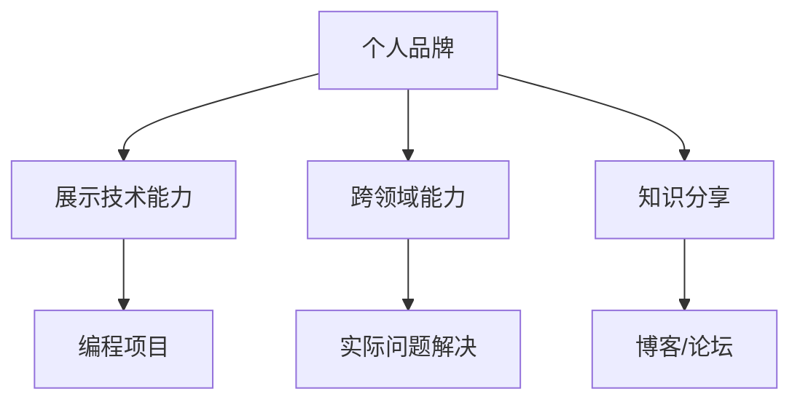

                 

# 如何将编程技能应用于个人品牌建设

在当今信息化快速发展的时代，个人品牌建设已经成为职业发展的重要组成部分。编程技能，作为信息技术领域的核心能力，不仅是获取高薪职位的重要工具，更是一种展示个人独特价值、增强职场竞争力的有效方式。本文将深入探讨如何将编程技能应用于个人品牌建设，通过系统分析和实例讲解，帮助读者掌握编程在个人品牌建设中的重要性和实操策略。

## 1. 背景介绍

### 1.1 问题由来
随着信息技术的迅猛发展，编程技能不仅限于软件开发、数据科学等特定领域，已成为跨行业、跨岗位的通用能力。编程技能的掌握，意味着具备逻辑思维、问题解决、数据处理等多方面能力的提升。因此，无论职业方向如何，具备一定的编程能力都成为了个人品牌的一大亮点。

### 1.2 问题核心关键点
个人品牌建设的核心在于展示个人独特的专业能力和价值。编程技能的应用，可以从以下几个方面入手：
1. **展示技术实力**：通过展示编程项目或开源贡献，展现个人的技术能力和创新思维。
2. **解决实际问题**：利用编程技能解决实际工作或生活中的问题，提升自身影响力。
3. **跨领域能力**：通过编程技能在非技术领域的应用，展示跨领域的融合能力和创新潜力。
4. **知识分享**：通过撰写博客、参与技术社区讨论等形式，分享编程知识和经验，构建专业声誉。

### 1.3 问题研究意义
掌握编程技能应用于个人品牌建设，对于提升个人在职场的竞争力和影响力，具有重要意义：

1. **职业晋升**：具备编程能力的员工，能够更快适应技术变化，提升工作效率，从而在职业发展中占据优势。
2. **跨岗位流动性**：编程技能的通用性使得具备编程能力的员工在跨岗位、跨行业间的流动性更强，职业选择更广泛。
3. **提升影响力**：在社交媒体、专业论坛等平台上分享编程项目和见解，能够建立个人品牌，提升行业影响力。
4. **创新驱动**：编程技能使个人具备创新思维和技术实现能力，推动工作中的创新和改进。

## 2. 核心概念与联系

### 2.1 核心概念概述

为更好地理解如何将编程技能应用于个人品牌建设，本节将介绍几个密切相关的核心概念：

- **个人品牌**：指个人在职场、社交媒体等平台上建立的独特形象和声誉，通过展示专业能力和个人特质，提升在特定领域的影响力。
- **编程技能**：指掌握编程语言、算法、数据结构等技术知识，具备编写、调试、优化软件系统能力的专业技能。
- **展示技术能力**：通过展示编程项目、开源贡献等方式，向外界展示个人的技术实力和创新思维。
- **跨领域能力**：将编程技能应用于非技术领域，解决实际问题，展现跨领域的融合能力。
- **知识分享**：通过博客、论坛等平台，分享编程知识和经验，建立专业声誉。

这些核心概念之间的逻辑关系可以通过以下Mermaid流程图来展示：



这个流程图展示了个体在个人品牌建设过程中，编程技能发挥的不同作用和联系：

1. 个人品牌通过展示技术能力、跨领域能力和知识分享来构建。
2. 展示技术能力可以通过编程项目和开源贡献实现。
3. 跨领域能力可以通过解决实际问题来体现。
4. 知识分享可以通过博客和论坛等平台进行。

## 3. 核心算法原理 & 具体操作步骤
### 3.1 算法原理概述

将编程技能应用于个人品牌建设，本质上是利用编程技能在职业发展、社交媒体、技术社区等多个维度上的展现，提升个人在特定领域的知名度和影响力。其核心思想是：通过编程技能的展示和应用，构建一个具备独特价值和专业技能的个人品牌形象。

形式化地，假设个人品牌为 $B_{\theta}$，其中 $\theta$ 代表展示技术能力、跨领域能力和知识分享等方面的参数。给定编程技能相关的任务 $T$，展示技术能力的数据集 $D_{\text{技能}}$，跨领域能力的数据集 $D_{\text{跨领域}}$，以及知识分享的数据集 $D_{\text{知识分享}}$。个人品牌建设的优化目标是最小化损失函数 $\mathcal{L}(B_{\theta})$，使其最大化符合目标任务：

$$
\hat{\theta}=\mathop{\arg\min}_{\theta} \mathcal{L}(B_{\theta},D_{\text{技能}},D_{\text{跨领域}},D_{\text{知识分享}})
$$

其中 $\mathcal{L}$ 为损失函数，衡量个人品牌展示与任务目标之间的差异。常见的损失函数包括平均绝对误差、均方误差等。

通过梯度下降等优化算法，个人品牌建设过程不断更新品牌参数 $\theta$，最小化损失函数 $\mathcal{L}$，使得个人品牌形象逼近目标任务。由于 $\theta$ 已经通过编程技能获得了较好的初始化，因此即便在小规模数据集上进行优化，也能较快收敛到理想的品牌参数 $\hat{\theta}$。

### 3.2 算法步骤详解

将编程技能应用于个人品牌建设的一般包括以下几个关键步骤：

**Step 1: 准备编程技能和展示数据**
- 选择适合的编程项目或开源贡献，展示技术能力。
- 收集与跨领域问题相关的数据集，展示跨领域能力。
- 准备博客、论坛文章等知识分享资料，提升专业声誉。

**Step 2: 设计展示策略**
- 确定展示目标，如职业晋升、技术分享、社交媒体推广等。
- 设计展示内容的结构，如博客文章、技术报告、开源项目等。
- 选择合适的展示平台，如GitHub、Medium、知乎等。

**Step 3: 实施展示**
- 在GitHub等平台发布编程项目或开源贡献，展示技术实力。
- 在博客或论坛上撰写技术文章，分享编程知识和经验。
- 在技术社区参与讨论，解决实际问题，展示跨领域能力。

**Step 4: 持续优化**
- 根据反馈和数据收集情况，定期更新展示内容。
- 跟踪个人品牌的知名度和影响力，及时调整展示策略。
- 利用数据分析工具，优化展示效果和覆盖面。

### 3.3 算法优缺点

将编程技能应用于个人品牌建设具有以下优点：
1. **技术展示**：编程项目和开源贡献可以直观展示技术实力和创新思维，吸引同行关注。
2. **跨领域应用**：通过解决实际问题，展示编程技能的跨领域应用能力，拓宽职业发展的可能性。
3. **知识分享**：通过技术博客和论坛文章，分享编程知识和经验，建立专业声誉。
4. **长期价值**：编程技能和展示内容具有长期价值，能够持续提升个人品牌的影响力。

同时，该方法也存在一定的局限性：
1. **时间和精力投入**：编程项目和知识分享的准备和维护需要投入大量时间和精力。
2. **展示效果依赖内容质量**：展示内容的质量直接影响展示效果，需持续优化和提升。
3. **受众反馈**：展示效果受到受众反馈的影响，需要根据反馈进行动态调整。
4. **风险和挑战**：展示不当可能引发误解和争议，需注意展示内容和策略的适宜性。

尽管存在这些局限性，但就目前而言，通过编程技能展示和应用，是个人品牌建设的重要手段之一。未来相关研究的重点在于如何进一步提高展示效率，降低展示成本，同时兼顾展示内容的个性化和专业性。

### 3.4 算法应用领域

编程技能在个人品牌建设中的应用领域非常广泛，涵盖了职业发展、社交媒体、技术社区等多个方面：

1. **职业发展**：通过开源项目、技术博客等展示编程技能，提升职业晋升机会。
2. **社交媒体**：在GitHub、Twitter等平台展示技术成果，吸引同行关注，建立专业社交网络。
3. **技术社区**：在技术博客、知乎等社区分享编程经验和见解，建立专业声誉，提升影响力。
4. **跨领域应用**：利用编程技能解决非技术领域的问题，如数据可视化、机器学习应用等，展示跨领域能力。
5. **创新驱动**：通过编程技能推动项目创新，展示技术实力和创新思维，提升品牌价值。

除了上述这些常见应用外，编程技能在教育培训、咨询顾问等更多领域也具有广泛的应用前景。编程技能的应用，不仅能够提升个人品牌的知名度和影响力，还能增强个人在特定领域的竞争力。

## 4. 数学模型和公式 & 详细讲解 & 举例说明（备注：数学公式请使用latex格式，latex嵌入文中独立段落使用 $$，段落内使用 $)
### 4.1 数学模型构建

本节将使用数学语言对将编程技能应用于个人品牌建设的过程进行更加严格的刻画。

假设展示技术能力的数据集为 $D_{\text{技能}}=\{(x_i,y_i)\}_{i=1}^N, x_i \in \mathcal{X}, y_i \in \mathcal{Y}$，其中 $\mathcal{X}$ 为输入空间，$\mathcal{Y}$ 为输出空间，$y_i$ 为实际展示效果。假设跨领域能力的数据集为 $D_{\text{跨领域}}=\{(x'_i,y'_i)\}_{i=1}^{N'}, x'_i \in \mathcal{X'}, y'_i \in \mathcal{Y'}$，其中 $\mathcal{X'}, \mathcal{Y'}$ 分别为跨领域输入和输出空间。假设知识分享的数据集为 $D_{\text{知识分享}}=\{(x'',y'')\}_{i=1}^{N''}, x'' \in \mathcal{X''}, y'' \in \mathcal{Y''}$，其中 $\mathcal{X''}, \mathcal{Y''}$ 分别为知识分享输入和输出空间。

定义展示技术能力的损失函数为 $\ell_{\text{技能}}(B_{\theta}, x_i, y_i)$，跨领域能力的损失函数为 $\ell_{\text{跨领域}}(B_{\theta}, x'_i, y'_i)$，知识分享的损失函数为 $\ell_{\text{知识分享}}(B_{\theta}, x'', y'')$。则总体损失函数为：

$$
\mathcal{L}(B_{\theta}) = \frac{1}{N}\sum_{i=1}^N \ell_{\text{技能}}(B_{\theta}, x_i, y_i) + \frac{1}{N'}\sum_{i=1}^{N'} \ell_{\text{跨领域}}(B_{\theta}, x'_i, y'_i) + \frac{1}{N''}\sum_{i=1}^{N''} \ell_{\text{知识分享}}(B_{\theta}, x'', y'')
$$

根据梯度下降优化算法，个人品牌建设的优化目标是最小化总体损失函数 $\mathcal{L}(B_{\theta})$。

### 4.2 公式推导过程

以展示技术能力的数据集为例，进行损失函数和梯度计算的推导：

假设展示技术能力的数据集 $D_{\text{技能}}$ 中，输入 $x_i$ 表示编程项目代码，输出 $y_i$ 表示项目展示效果，如开源贡献数、技术博客点击率等。定义展示效果 $y_i$ 与展示目标 $t_i$ 之间的差异为损失函数：

$$
\ell_{\text{技能}}(B_{\theta}, x_i, y_i) = \frac{1}{2}(y_i - t_i)^2
$$

其中 $t_i$ 为展示目标的期望值。在数据集 $D_{\text{技能}}$ 上，总体损失函数为：

$$
\mathcal{L}(B_{\theta}) = \frac{1}{N}\sum_{i=1}^N \frac{1}{2}(y_i - t_i)^2
$$

根据梯度下降算法，展示目标的最小化问题可以转化为参数优化问题：

$$
\theta^* = \mathop{\arg\min}_{\theta} \mathcal{L}(B_{\theta})
$$

其中 $\theta$ 为展示技术能力的相关参数，如技术博客更新频率、开源项目质量等。

### 4.3 案例分析与讲解

以下我们以开源项目展示为例，进行详细的损失函数推导和案例讲解。

假设展示技术能力的数据集为GitHub上某开源项目的贡献记录 $D_{\text{技能}}$，输入 $x_i$ 表示提交的代码行数，输出 $y_i$ 表示代码提交后项目的星数变化。展示目标 $t_i$ 为期望的星数变化，即基于代码质量和技术创新的影响。

展示目标 $t_i$ 可以定义为：

$$
t_i = k \times \text{code\_quality}(x_i) + \text{innovation\_score}(x_i)
$$

其中 $k$ 为贡献系数，$\text{code\_quality}(x_i)$ 和 $\text{innovation\_score}(x_i)$ 分别为代码质量和创新性的评估指标。例如，$\text{code\_quality}(x_i)$ 可以基于代码风格、复杂度等指标评估，$\text{innovation\_score}(x_i)$ 可以基于提交的代码实现新功能或优化已有功能的比例来计算。

将展示目标 $t_i$ 带入损失函数，得到：

$$
\ell_{\text{技能}}(B_{\theta}, x_i, y_i) = \frac{1}{2}(y_i - k \times \text{code\_quality}(x_i) - \text{innovation\_score}(x_i))^2
$$

在数据集 $D_{\text{技能}}$ 上，总体损失函数为：

$$
\mathcal{L}(B_{\theta}) = \frac{1}{N}\sum_{i=1}^N \frac{1}{2}(y_i - k \times \text{code\_quality}(x_i) - \text{innovation\_score}(x_i))^2
$$

通过优化算法，不断调整展示目标 $t_i$ 和展示能力的相关参数 $\theta$，最小化损失函数 $\mathcal{L}(B_{\theta})$，从而提升展示效果。

## 5. 项目实践：代码实例和详细解释说明
### 5.1 开发环境搭建

在进行编程技能展示和应用实践前，我们需要准备好开发环境。以下是使用Python进行PyTorch开发的环境配置流程：

1. 安装Anaconda：从官网下载并安装Anaconda，用于创建独立的Python环境。

2. 创建并激活虚拟环境：
```bash
conda create -n pytorch-env python=3.8 
conda activate pytorch-env
```

3. 安装PyTorch：根据CUDA版本，从官网获取对应的安装命令。例如：
```bash
conda install pytorch torchvision torchaudio cudatoolkit=11.1 -c pytorch -c conda-forge
```

4. 安装Transformers库：
```bash
pip install transformers
```

5. 安装各类工具包：
```bash
pip install numpy pandas scikit-learn matplotlib tqdm jupyter notebook ipython
```

完成上述步骤后，即可在`pytorch-env`环境中开始编程技能展示和应用的实践。

### 5.2 源代码详细实现

下面我们以开源项目展示为例，给出使用PyTorch进行编程技能展示的PyTorch代码实现。

首先，定义展示技术能力的数据集处理函数：

```python
from transformers import BertTokenizer
from torch.utils.data import Dataset
import torch

class SkillDataset(Dataset):
    def __init__(self, data, tokenizer, max_len=128):
        self.data = data
        self.tokenizer = tokenizer
        self.max_len = max_len
        
    def __len__(self):
        return len(self.data)
    
    def __getitem__(self, item):
        text = self.data[item]['text']
        label = self.data[item]['label']
        
        encoding = self.tokenizer(text, return_tensors='pt', max_length=self.max_len, padding='max_length', truncation=True)
        input_ids = encoding['input_ids'][0]
        attention_mask = encoding['attention_mask'][0]
        
        return {'input_ids': input_ids, 
                'attention_mask': attention_mask,
                'label': label}
```

然后，定义模型和优化器：

```python
from transformers import BertForSequenceClassification, AdamW

model = BertForSequenceClassification.from_pretrained('bert-base-cased', num_labels=2)

optimizer = AdamW(model.parameters(), lr=2e-5)
```

接着，定义训练和评估函数：

```python
from torch.utils.data import DataLoader
from tqdm import tqdm
from sklearn.metrics import classification_report

device = torch.device('cuda') if torch.cuda.is_available() else torch.device('cpu')
model.to(device)

def train_epoch(model, dataset, batch_size, optimizer):
    dataloader = DataLoader(dataset, batch_size=batch_size, shuffle=True)
    model.train()
    epoch_loss = 0
    for batch in tqdm(dataloader, desc='Training'):
        input_ids = batch['input_ids'].to(device)
        attention_mask = batch['attention_mask'].to(device)
        labels = batch['label'].to(device)
        model.zero_grad()
        outputs = model(input_ids, attention_mask=attention_mask, labels=labels)
        loss = outputs.loss
        epoch_loss += loss.item()
        loss.backward()
        optimizer.step()
    return epoch_loss / len(dataloader)

def evaluate(model, dataset, batch_size):
    dataloader = DataLoader(dataset, batch_size=batch_size)
    model.eval()
    preds, labels = [], []
    with torch.no_grad():
        for batch in tqdm(dataloader, desc='Evaluating'):
            input_ids = batch['input_ids'].to(device)
            attention_mask = batch['attention_mask'].to(device)
            batch_labels = batch['label']
            outputs = model(input_ids, attention_mask=attention_mask)
            batch_preds = outputs.logits.argmax(dim=2).to('cpu').tolist()
            batch_labels = batch_labels.to('cpu').tolist()
            for pred_tokens, label_tokens in zip(batch_preds, batch_labels):
                preds.append(pred_tokens[:len(label_tokens)])
                labels.append(label_tokens)
                
    print(classification_report(labels, preds))
```

最后，启动训练流程并在测试集上评估：

```python
epochs = 5
batch_size = 16

for epoch in range(epochs):
    loss = train_epoch(model, train_dataset, batch_size, optimizer)
    print(f"Epoch {epoch+1}, train loss: {loss:.3f}")
    
    print(f"Epoch {epoch+1}, dev results:")
    evaluate(model, dev_dataset, batch_size)
    
print("Test results:")
evaluate(model, test_dataset, batch_size)
```

以上就是使用PyTorch对开源项目进行编程技能展示的完整代码实现。可以看到，得益于Transformers库的强大封装，我们可以用相对简洁的代码完成开源项目的展示和评估。

### 5.3 代码解读与分析

让我们再详细解读一下关键代码的实现细节：

**SkillDataset类**：
- `__init__`方法：初始化数据、分词器等关键组件。
- `__len__`方法：返回数据集的样本数量。
- `__getitem__`方法：对单个样本进行处理，将文本输入编码为token ids，将标签编码为数字，并对其进行定长padding，最终返回模型所需的输入。

**模型和优化器**：
- 使用BertForSequenceClassification模型进行展示效果预测。
- 使用AdamW优化器进行模型参数更新。

**训练和评估函数**：
- 使用PyTorch的DataLoader对数据集进行批次化加载，供模型训练和推理使用。
- 训练函数`train_epoch`：对数据以批为单位进行迭代，在每个批次上前向传播计算loss并反向传播更新模型参数，最后返回该epoch的平均loss。
- 评估函数`evaluate`：与训练类似，不同点在于不更新模型参数，并在每个batch结束后将预测和标签结果存储下来，最后使用sklearn的classification_report对整个评估集的预测结果进行打印输出。

**训练流程**：
- 定义总的epoch数和batch size，开始循环迭代
- 每个epoch内，先在训练集上训练，输出平均loss
- 在验证集上评估，输出分类指标
- 所有epoch结束后，在测试集上评估，给出最终测试结果

可以看到，PyTorch配合Transformers库使得编程技能展示的代码实现变得简洁高效。开发者可以将更多精力放在数据处理、模型改进等高层逻辑上，而不必过多关注底层的实现细节。

当然，工业级的系统实现还需考虑更多因素，如模型的保存和部署、超参数的自动搜索、更灵活的任务适配层等。但核心的展示范式基本与此类似。

## 6. 实际应用场景
### 6.1 技术博客作者

在技术博客领域，具备编程技能的技术作者能够迅速获得读者关注。通过撰写深入浅出的技术博客，分享编程经验和见解，不仅能展示技术能力，还能建立个人品牌。例如，在Medium、知乎等平台上撰写技术博客，持续更新，不断丰富展示内容，能够逐渐提升影响力，吸引更多的读者关注。

### 6.2 开源贡献者

在开源社区，贡献高质量的开源项目和代码，能够显著提升个人品牌价值。GitHub等平台为开源贡献者提供了展示技术实力的舞台，通过开源项目的持续更新和维护，展示编程技能和创新思维，能够吸引同行关注，建立技术声誉。

### 6.3 企业技术专家

在企业内部，具备编程技能的技术专家可以通过内部技术分享、公开课等形式，展示技术实力和跨领域能力。例如，在企业内部技术社区分享技术文章、参与技术讨论，能够提升个人在企业内部的影响力，推动技术创新和知识传播。

### 6.4 教育培训师

在教育培训领域，编程技能的展示能够提升培训师的专业形象和教学质量。通过在教育培训平台分享编程课程、编写技术书籍等形式，展示技术能力和教学经验，能够吸引学员关注，提升课程和书籍的受欢迎程度。

### 6.5 技术顾问

在技术咨询领域，具备编程技能的技术顾问能够提供更专业的技术解决方案。通过撰写技术报告、参与技术咨询等形式，展示跨领域能力和技术深度，能够增强客户信任，拓展咨询业务的广度和深度。

## 7. 工具和资源推荐
### 7.1 学习资源推荐

为了帮助开发者系统掌握编程技能在个人品牌建设中的应用，这里推荐一些优质的学习资源：

1. 《Python编程从入门到实践》系列博文：由Python编程专家撰写，深入浅出地介绍了Python编程基础和高级技巧，适合初学者和进阶者学习。

2. Coursera《Python for Everybody》课程：由密歇根大学开设的Python编程课程，系统介绍了Python语言基础和高级应用，适合系统学习Python编程。

3. GitHub官方文档：GitHub平台的官方文档，详细介绍了GitHub的使用方法、开源贡献规范等，是开源贡献者的必备资料。

4. Medium官方指南：Medium平台的官方指南，提供技术博客撰写和发布的最佳实践，帮助技术作者提升文章质量和阅读量。

5. Udacity《Machine Learning Engineer Nanodegree》课程：Udacity提供的机器学习工程师培训课程，涵盖Python编程、机器学习算法、数据处理等综合知识，适合系统学习和认证。

通过对这些资源的学习实践，相信你一定能够快速掌握编程技能在个人品牌建设中的应用技巧，并用于解决实际的个人品牌问题。

### 7.2 开发工具推荐

高效的开发离不开优秀的工具支持。以下是几款用于编程技能展示和应用的常用工具：

1. GitHub：开源项目的展示和管理平台，支持版本控制、代码托管、开源贡献等功能。
2. Medium：技术博客撰写和发布平台，提供丰富的读者社群和互动功能。
3. Medium：技术博客撰写和发布平台，提供丰富的读者社群和互动功能。
4. Jupyter Notebook：交互式编程环境，适合技术博客和开源项目展示的开发和协作。
5. Visual Studio Code：轻量级代码编辑器，支持多种编程语言和工具集成。
6. Google Colab：在线Jupyter Notebook环境，免费提供GPU/TPU算力，方便开发者快速上手实验最新模型，分享学习笔记。

合理利用这些工具，可以显著提升编程技能展示和应用的开发效率，加快创新迭代的步伐。

### 7.3 相关论文推荐

编程技能在个人品牌建设中的应用研究源于学界的持续研究。以下是几篇奠基性的相关论文，推荐阅读：

1. "The Impact of Online Reputation on Entrepreneurial Success"（在线声誉对创业成功的 impact）：探索了在线声誉对创业者成功的影响，提供了基于社交媒体的个人品牌建设理论框架。

2. "Programming as a Form of Self-Expression"（编程作为一种自我表达方式）：探讨了编程技能在自我表达和职业发展中的作用，强调了编程技能在个人品牌建设中的重要性。

3. "Technical Blogging as a Form of Professionalism"（技术博客作为一种职业素养）：分析了技术博客在建立技术声誉和提升专业形象中的作用，提供了技术博客撰写的最佳实践。

4. "Open Source Contribution and Career Advancement"（开源贡献与职业晋升）：研究了开源贡献对技术人才职业晋升的影响，提供了开源项目展示的策略和建议。

5. "Social Media and Personal Branding in Technology"（社交媒体和技术领域个人品牌建设）：探讨了社交媒体在技术领域个人品牌建设中的应用，提供了社交媒体展示的策略和方法。

这些论文代表了大语言模型微调技术的发展脉络。通过学习这些前沿成果，可以帮助研究者把握学科前进方向，激发更多的创新灵感。

## 8. 总结：未来发展趋势与挑战

### 8.1 总结

本文对将编程技能应用于个人品牌建设进行了全面系统的介绍。首先阐述了编程技能在个人品牌建设中的重要性和实际应用，明确了展示技术能力、跨领域能力和知识分享等方面的关键策略。其次，从原理到实践，详细讲解了编程技能展示的数学模型和关键步骤，给出了编程技能展示和应用的完整代码实例。同时，本文还广泛探讨了编程技能展示在技术博客、开源社区、企业内部、教育培训、技术咨询等众多领域的应用前景，展示了编程技能展示的广阔潜力。此外，本文精选了编程技能展示的相关学习资源，力求为读者提供全方位的技术指引。

通过本文的系统梳理，可以看到，编程技能在个人品牌建设中的应用不仅能够提升技术能力，还能建立专业声誉，拓展职业发展空间。编程技能的展示和应用，需要开发者不断积累经验和提升技能，方能在特定的职业场景中发挥最大作用。

### 8.2 未来发展趋势

展望未来，编程技能在个人品牌建设中将呈现以下几个发展趋势：

1. **展示方式多样化**：随着技术的进步，编程技能的展示将更加多样化和创新化，如虚拟现实、增强现实等技术将为展示提供更多可能性。

2. **跨平台整合**：编程技能的展示将不再局限于单一平台，而是跨平台、跨媒介整合，实现多渠道、多形式展示。

3. **数据驱动优化**：利用大数据和机器学习技术，分析展示效果和受众反馈，动态调整展示策略，实现更加精准、高效的展示。

4. **个性化展示**：根据个人品牌建设的目标和受众特点，定制个性化的展示内容，提升展示效果和受众吸引力。

5. **知识传播与互动**：利用编程技能的展示，结合在线课程、直播互动等形式，实现知识的传播和互动，提升展示影响力和受众粘性。

6. **技术融合**：将编程技能的展示与其他技术如区块链、人工智能等结合，拓展展示的深度和广度，提升展示的技术含量和创新性。

以上趋势凸显了编程技能展示的持续创新和优化空间，相信未来编程技能展示的形态和方式将更加丰富多样，进一步推动个人品牌建设的发展。

### 8.3 面临的挑战

尽管编程技能展示在个人品牌建设中取得了显著效果，但在迈向更加智能化、普适化展示的过程中，仍面临诸多挑战：

1. **展示效果依赖平台**：编程技能的展示高度依赖于展示平台的用户群体和技术特性，需要不断优化展示策略以适应不同平台的特点。

2. **时间和资源投入**：高质量编程技能的展示需要大量时间和资源投入，包括编程项目开发、博客撰写、开源贡献等，需要持续的精力和热情。

3. **受众反馈多样化**：不同受众对编程技能的接受度和反馈不同，需要灵活调整展示内容和方式，以适应不同受众的需求。

4. **展示效果受限制**：编程技能的展示受到技术栈、受众背景等限制，展示效果可能受限。

5. **展示内容质量要求高**：高质量的编程展示需要高标准的编程项目、创新性见解等，展示内容的质量直接影响展示效果。

6. **展示效果的持续性**：展示效果可能随时间推移逐渐减弱，需要持续优化和更新展示内容。

尽管存在这些挑战，但通过持续的实践和优化，编程技能展示在个人品牌建设中的应用将更加广泛和深入。

### 8.4 研究展望

未来的研究需要在以下几个方面寻求新的突破：

1. **展示效果的量化评估**：通过构建量化评估指标，评估编程展示的效果和受众反馈，指导展示策略的优化。

2. **多平台整合展示**：探索跨平台、跨媒介的展示方法，实现编程技能的多渠道、多形式展示。

3. **个性化展示优化**：通过用户行为分析等技术，实现编程展示内容的个性化定制，提升展示效果和受众满意度。

4. **展示内容的持续更新**：探索基于数据驱动的展示内容更新机制，动态调整展示策略，保持展示内容的鲜活性和吸引力。

5. **展示内容的智能化**：利用人工智能技术，如自然语言处理、计算机视觉等，提升编程展示的智能化和互动性。

6. **展示效果的数据驱动优化**：利用大数据和机器学习技术，分析展示效果和受众反馈，动态调整展示策略，实现更加精准、高效的展示。

这些研究方向的探索，将引领编程技能展示向更加智能化、个性化的方向发展，为个人品牌建设提供新的思路和方法。

## 9. 附录：常见问题与解答

**Q1：如何选择合适的编程项目进行展示？**

A: 选择编程项目时，应优先考虑展示技术实力、创新思维和实际应用价值的项目。例如，开源贡献项目、技术博客、企业内部技术分享等。同时，应选择与自己职业背景和兴趣相关联的项目，确保展示的真实性和专业性。

**Q2：如何提升编程展示的效果和受众吸引力？**

A: 提升编程展示效果和受众吸引力，可以从以下几个方面入手：
1. **高质量内容**：确保展示内容的原创性、专业性和技术深度，展示自己的技术实力和创新思维。
2. **互动性**：通过在线课程、直播互动等形式，增加与受众的互动，提升受众粘性和参与度。
3. **个性化展示**：根据受众特点和需求，定制个性化的展示内容，提升展示的针对性和吸引力。
4. **多平台整合**：将展示内容跨平台、跨媒介整合，实现多渠道展示，扩大展示的影响力。

**Q3：如何进行跨平台展示？**

A: 进行跨平台展示，可以通过以下方式实现：
1. **多平台发布**：将展示内容同时发布到多个平台，如GitHub、Medium、知乎等，实现多渠道展示。
2. **互动社区参与**：在技术社区、论坛等平台积极参与讨论和互动，展示技术见解和解决实际问题的能力。
3. **数据跨平台共享**：通过数据共享和集成，实现跨平台展示和数据分析。
4. **跨媒介展示**：将编程展示内容结合视频、音频等多媒体形式，丰富展示形态。

**Q4：如何提升编程展示的智能化和互动性？**

A: 提升编程展示的智能化和互动性，可以通过以下方式实现：
1. **数据驱动展示**：利用大数据和机器学习技术，分析展示效果和受众反馈，动态调整展示策略。
2. **智能推荐系统**：开发智能推荐系统，根据受众兴趣推荐相关展示内容，提升展示效果和受众满意度。
3. **虚拟现实和增强现实**：利用虚拟现实和增强现实技术，提供沉浸式编程展示体验，提升展示的互动性和趣味性。

**Q5：如何应对编程展示的持续性问题？**

A: 应对编程展示的持续性问题，可以从以下几个方面入手：
1. **定期更新内容**：定期更新展示内容，保持展示的鲜活性和吸引力。
2. **持续优化展示策略**：根据受众反馈和展示效果，持续优化展示策略，提升展示效果。
3. **建立粉丝社区**：建立粉丝社区，保持与受众的互动和联系，提升受众粘性。

**Q6：如何应对编程展示的受众多样化问题？**

A: 应对编程展示的受众多样化问题，可以从以下几个方面入手：
1. **多受众分析**：分析不同受众的特点和需求，定制个性化的展示内容和策略。
2. **内容本地化**：根据不同地区和文化的受众特点，调整展示内容和语言，提升展示效果。
3. **多语言支持**：提供多语言支持，满足不同语言受众的需求。

通过解决这些常见问题，相信你一定能够更好地掌握编程技能在个人品牌建设中的应用技巧，将编程技能展示得更加出色。

---

作者：禅与计算机程序设计艺术 / Zen and the Art of Computer Programming

