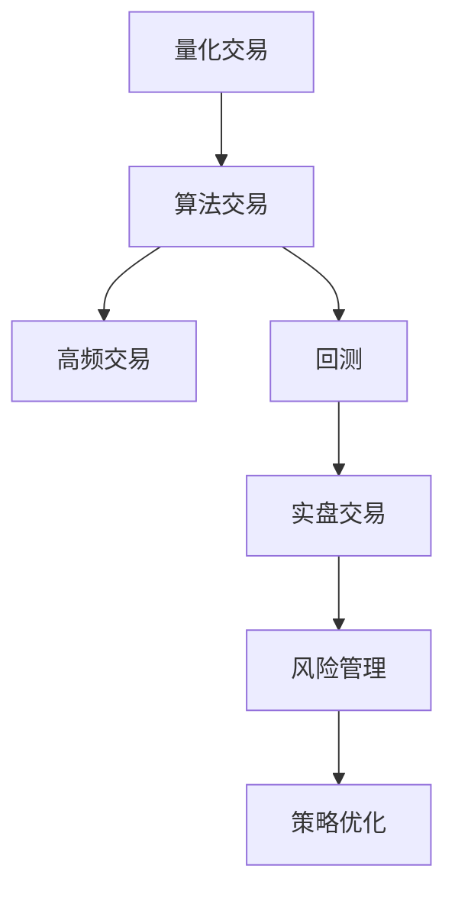

                 

## 1. 背景介绍

### 1.1 问题由来
量化交易，或称算法交易，是一种利用计算机算法，从历史和实时市场数据中识别交易机会，并进行自动化交易的过程。这种交易方式的优势在于其速度、精度和一致性，可以有效规避人为情绪对交易决策的影响。编程技能，尤其是数据分析、算法优化和系统架构等方面的能力，对于量化交易至关重要。

### 1.2 问题核心关键点
量化交易中的编程技能应用主要包括以下几个方面：
1. **数据处理与清洗**：量化交易依赖大量历史和实时数据，如何高效、准确地获取和处理数据是关键。
2. **算法设计与优化**：构建和优化量化交易策略，需要扎实的数学、统计和算法基础。
3. **系统架构与性能**：量化交易系统需要高效稳定，如何设计分布式系统、优化性能和保证可靠性是重要任务。
4. **风险管理与回测**：评估交易策略的风险，通过回测验证策略的稳定性和盈利能力。
5. **实时交易与监控**：实时市场数据的高效处理和异常监控，确保交易系统的安全与稳定。

### 1.3 问题研究意义
掌握编程技能在量化交易中的应用，不仅能够提升交易策略的精度和速度，还能增强系统的稳定性和可扩展性。量化交易的普及和扩展，将进一步推动金融市场的技术革新，加速金融产品的创新和优化。

## 2. 核心概念与联系

### 2.1 核心概念概述

为更好地理解如何将编程技能应用于量化交易，本节将介绍几个密切相关的核心概念：

- **量化交易**：利用计算机算法和数学模型，自动化进行股票、期货等金融资产的交易。
- **算法交易**：根据预设规则和数学模型，自动化执行交易指令。
- **高频交易**：以毫秒计的超短周期内执行交易，对系统性能和算法效率有极高要求。
- **回测**：通过历史数据模拟交易过程，验证交易策略的有效性。
- **实盘交易**：将策略应用于真实市场，进行交易操作。
- **风险管理**：识别和控制交易策略中的风险因素，确保资金安全。

这些核心概念之间的逻辑关系可以通过以下Mermaid流程图来展示：



这个流程图展示量化交易的核心概念及其之间的关系：

1. 量化交易通过算法交易自动执行交易指令。
2. 高频交易要求算法交易具有极高的执行速度和精度。
3. 回测用于验证交易策略的有效性。
4. 实盘交易是将策略应用于真实市场的操作过程。
5. 风险管理是保障交易策略稳定运行的关键。

## 3. 核心算法原理 & 具体操作步骤
### 3.1 算法原理概述

量化交易的核心算法原理主要围绕以下几个方面展开：

- **技术分析**：利用历史价格、成交量等数据，构建技术指标，识别交易机会。
- **量化策略设计**：根据市场数据和交易目标，设计可执行的交易策略。
- **优化与回测**：通过历史数据，验证交易策略的有效性，并进行参数优化。
- **实时监控**：实时监控交易信号和市场动态，及时调整策略。

### 3.2 算法步骤详解

量化交易的具体步骤包括：

1. **数据获取与预处理**：收集历史和实时市场数据，进行数据清洗、特征提取等预处理。
2. **模型训练与策略设计**：选择或设计适合的数学模型，构建交易策略。
3. **策略优化与回测**：通过回测数据验证策略的稳定性和盈利能力，进行参数调优。
4. **实盘测试与风险管理**：在真实市场进行策略测试，实时监控并管理风险。
5. **系统部署与维护**：将策略部署到交易系统中，并进行系统优化和日常维护。

### 3.3 算法优缺点

量化交易的优势在于其客观性和一致性，能避免人为情绪干扰。但同时也面临数据质量、算法复杂度、市场波动等挑战：

**优点**：
1. **高效与精确**：算法交易速度远超人类，能够实时捕捉市场机会。
2. **一致性与客观性**：避免人为情绪干扰，交易策略一致。
3. **可复制性**：算法策略可多次复制、验证和优化。

**缺点**：
1. **依赖数据质量**：市场数据存在噪声和误差，对模型影响较大。
2. **算法复杂度高**：需要复杂的数学模型和大量计算资源。
3. **市场波动敏感**：高频交易对市场波动非常敏感，策略可能失效。
4. **技术门槛高**：需要较强的编程、数学和金融知识。

### 3.4 算法应用领域

量化交易的应用领域广泛，涵盖股票、期货、外汇等多种金融市场。其中，高频交易、算法套利、资产配置等是主要的应用方向：

- **高频交易**：利用微秒级别的时间窗口进行交易，对系统性能和算法效率有极高要求。
- **算法套利**：通过多市场、多策略的套利操作，获取无风险收益。
- **资产配置**：利用数学模型和算法，优化资产配置，实现组合优化。
- **风险管理**：构建风险评估模型，实时监控交易风险，保障资金安全。

## 4. 数学模型和公式 & 详细讲解 & 举例说明

### 4.1 数学模型构建

量化交易中的数学模型通常基于统计学和机器学习的理论。以技术分析中的移动平均线和相对强弱指数为例：

- **移动平均线**：通过计算价格的算术平均，识别趋势和转折点。
- **相对强弱指数(RSI)**：通过价格变化幅度的统计，评估市场的超买超卖状态。

### 4.2 公式推导过程

以移动平均线为例，假设价格数据为$P_t$，移动平均窗口为$n$，则算术移动平均线公式为：

$$
MA_t = \frac{1}{n} \sum_{i=0}^{n-1} P_{t-i}
$$

这个公式计算了过去$n$个交易日的平均价格，用于识别趋势和转折点。

### 4.3 案例分析与讲解

**案例分析：股票买入策略设计**

假设我们设计一个基于移动平均线的股票买入策略，规则如下：

1. 当股价$P_t$低于200日移动平均线$MA_{200}$时，买入。
2. 当股价$P_t$高于50日移动平均线$MA_{50}$时，卖出。

该策略基于均值回归理论，认为股价围绕其移动平均线波动，当股价偏离平均线时，有回归至平均线的趋势。

## 5. 项目实践：代码实例和详细解释说明
### 5.1 开发环境搭建

在进行量化交易系统开发前，需要准备好开发环境。以下是Python开发环境配置步骤：

1. **安装Python**：下载并安装Python 3.x版本。
2. **安装虚拟环境**：使用pip安装virtualenv，创建虚拟环境。
3. **安装必要的库**：安装Pandas、NumPy、Matplotlib、Scikit-learn等常用库。

### 5.2 源代码详细实现

以下是基于Pandas库实现的简单股票买入策略示例代码：

```python
import pandas as pd
import numpy as np

def moving_average(df, window):
    return df.rolling(window).mean()

def buy_signal(df, window1, window2):
    ma1 = moving_average(df['close'], window1)
    ma2 = moving_average(df['close'], window2)
    buy_condition = df['close'] < ma1
    sell_condition = df['close'] > ma2
    return pd.Series([1 if b else 0 for b in buy_condition] + [0] * len(sell_condition))

# 加载股票数据
df = pd.read_csv('stock_data.csv', index_col='date', parse_dates=True)

# 计算移动平均线
ma1 = moving_average(df['close'], 200)
ma2 = moving_average(df['close'], 50)

# 生成买入卖出信号
buy_signal_series = buy_signal(df, 200, 50)
```

### 5.3 代码解读与分析

代码中主要包含以下几个步骤：

1. **数据加载**：使用Pandas库加载股票数据，设置日期为索引。
2. **移动平均线计算**：利用rolling函数计算200日和50日的移动平均线。
3. **信号生成**：根据移动平均线计算买入和卖出信号。
4. **策略应用**：将信号应用于实际交易，实现策略回测。

## 6. 实际应用场景

### 6.1 高频交易

高频交易是量化交易中的一个重要应用场景。通过高频算法，利用微秒级别的超短交易时间窗口，获取无风险收益。例如，某金融公司利用高频交易算法，在多个交易所同时执行买卖操作，通过套利策略获取微小价差收益。

### 6.2 算法套利

算法套利是通过多市场、多策略的套利操作，获取无风险收益。例如，某量化交易系统在多个金融市场同时监控股票价格和利率，当存在价格差异时，通过高频算法迅速执行买卖操作，获取差价收益。

### 6.3 资产配置

资产配置是量化交易中的重要应用，通过构建数学模型和算法，优化资产组合配置，实现组合优化。例如，某公司利用量化模型分析市场走势和资产风险，优化其股票、债券、基金等多种资产配置，获取最大化收益。

### 6.4 未来应用展望

随着人工智能和大数据分析技术的不断发展，量化交易的自动化和智能化水平将进一步提升。未来，量化交易将更加依赖算法和数学模型，实时动态调整策略，应对市场波动。此外，量化交易也将与区块链、大数据等技术深度融合，提升交易效率和安全性。

## 7. 工具和资源推荐
### 7.1 学习资源推荐

为了帮助开发者系统掌握量化交易的编程技能，这里推荐一些优质的学习资源：

1. **《Python for Quantitative Finance》**：介绍如何使用Python进行量化金融分析，涵盖数据分析、算法设计等方面。
2. **Coursera的“Algorithmic Trading”课程**：斯坦福大学开设的课程，系统讲解算法交易的核心概念和应用。
3. **Kaggle量化交易竞赛**：参与Kaggle的量化交易竞赛，实战练习，提高技能。
4. **《High-Frequency Trading with Python》**：介绍高频交易的编程实践，通过实际案例讲解算法设计。
5. **《Machine Learning for Algorithmic Trading》**：结合机器学习技术，构建更高效的算法交易策略。

### 7.2 开发工具推荐

高效的开发离不开优秀的工具支持。以下是几款用于量化交易开发的常用工具：

1. **Jupyter Notebook**：交互式编程环境，适合快速原型设计和实验。
2. **Backtrader**：开源量化交易平台，支持多种数据源和策略测试。
3. **QuantConnect**：企业级量化交易平台，提供云服务和社区支持。
4. **RapidQuant**：国内领先的量化交易平台，提供丰富的API和数据接口。
5. **QuantConnect.Community**：量化交易社区，提供丰富的资源和交流平台。

### 7.3 相关论文推荐

量化交易领域的研究源远流长，以下是几篇奠基性的相关论文，推荐阅读：

1. **“Quantitative Trading: How to Build Your Own Algorithmic Trading Business”**：通过案例分析，介绍量化交易的构建和应用。
2. **“High-Frequency Trading: A Practical Guide to Algorithmic Strategies and Trading Systems”**：详细介绍高频交易的算法和策略。
3. **“Algorithmic Trading: Winning Strategies and Their Rationale”**：系统讲解算法交易的策略设计和优化。
4. **“Machine Learning in Algorithmic Trading”**：探讨机器学习在量化交易中的应用。

这些论文代表了大量化交易的发展脉络，通过学习这些前沿成果，可以帮助研究者把握学科前进方向，激发更多的创新灵感。

## 8. 总结：未来发展趋势与挑战
### 8.1 研究成果总结

量化交易的编程应用已经取得了显著的成果，涵盖数据处理、算法设计、系统架构等多个方面。大语言模型、深度学习等先进技术的引入，进一步提升了量化交易的自动化和智能化水平。

### 8.2 未来发展趋势

展望未来，量化交易的编程应用将呈现以下几个发展趋势：

1. **自动化和智能化**：利用先进算法和模型，实现交易策略的自动化优化和智能化调整。
2. **多资产配置**：通过优化资产配置，构建更加稳定和多样化的投资组合。
3. **高频交易的普及**：随着计算能力的提升，高频交易将进一步普及，提升市场效率和交易速度。
4. **大数据和人工智能**：利用大数据和人工智能技术，提升数据处理和算法设计的效率。

### 8.3 面临的挑战

尽管量化交易的编程应用取得了显著成果，但在其发展过程中仍面临诸多挑战：

1. **数据质量问题**：市场数据存在噪声和误差，对模型的影响较大。
2. **算法复杂度高**：量化交易算法设计复杂，需要深厚的数学和金融知识。
3. **系统风险管理**：交易系统的风险管理仍需进一步优化，避免系统性风险。
4. **监管合规**：交易策略需符合监管要求，避免违规操作。

### 8.4 研究展望

未来的研究需要在以下几个方面寻求新的突破：

1. **数据增强技术**：通过数据增强技术，提高数据的丰富度和准确性。
2. **模型优化与解释**：引入模型解释技术，提升模型的可解释性和透明度。
3. **跨市场套利**：构建跨市场套利模型，利用不同市场的价差获利。
4. **区块链融合**：将区块链技术引入量化交易，提升交易的安全性和透明度。

这些研究方向的探索，将引领量化交易技术迈向更高的台阶，为金融市场带来新的技术革新。

## 9. 附录：常见问题与解答

**Q1：量化交易与传统交易相比，有哪些优势和劣势？**

A: **优势**：
1. **高效性**：算法交易速度快于人类交易，能实时捕捉市场机会。
2. **一致性**：避免人为情绪干扰，交易策略一致。
3. **可复现性**：策略可多次复制、验证和优化。

**劣势**：
1. **依赖数据质量**：市场数据存在噪声和误差，对模型影响较大。
2. **算法复杂度高**：需要复杂的数学模型和大量计算资源。
3. **市场波动敏感**：高频交易对市场波动非常敏感，策略可能失效。

**Q2：如何评估量化交易策略的有效性？**

A: 量化交易策略的有效性评估主要通过以下方法：

1. **历史回测**：利用历史数据模拟交易过程，验证策略的稳定性和盈利能力。
2. **模拟交易**：在仿真环境下测试策略，评估其风险和收益。
3. **实际交易**：在真实市场测试策略，实时监控并管理风险。
4. **参数调优**：通过调整策略参数，寻找最优策略。

**Q3：量化交易中如何处理市场异常情况？**

A: 市场异常情况的处理通常包括：

1. **异常检测**：通过统计分析和机器学习模型，识别异常市场数据。
2. **异常处理**：根据异常类型，采取相应的处理措施，如暂停交易、调整参数等。
3. **策略回测**：在异常情况后，重新进行策略回测，验证策略的鲁棒性。

**Q4：量化交易系统如何设计高效的风险管理策略？**

A: 风险管理策略的设计通常包括：

1. **风险评估**：构建风险评估模型，实时监控交易风险。
2. **止损设置**：设定止损价格，及时退出亏损交易。
3. **仓位管理**：根据风险承受能力，合理分配仓位，控制风险。
4. **多策略组合**：构建多策略组合，分散风险。

**Q5：量化交易系统如何实现高可用性和稳定性？**

A: 高可用性和稳定性的实现通常通过以下方法：

1. **系统架构设计**：采用分布式架构，提高系统可用性和容错性。
2. **数据冗余备份**：建立数据冗余备份机制，保障数据安全。
3. **自动化监控**：实时监控系统状态，及时发现并解决异常。
4. **容灾恢复**：建立容灾恢复机制，保障系统在灾难发生后能够快速恢复。

作者：禅与计算机程序设计艺术 / Zen and the Art of Computer Programming

