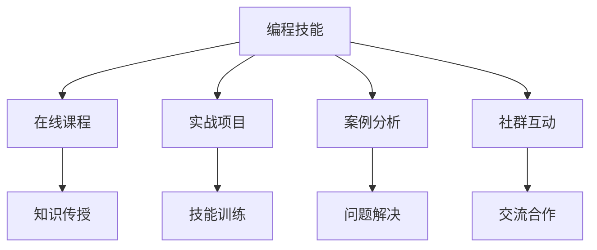

                 

# 如何将编程技能转化为在线编程训练营

## 1. 背景介绍

在数字化转型浪潮的推动下，在线编程训练营（Code Camp）成为了培养程序员技能、提升职业竞争力的重要途径。这些训练营通常由技术专家和行业领袖主导，通过线上课程、实战项目、案例分析等多种形式，让学员在短时间内掌握编程技术，并具备解决实际问题的能力。

然而，传统的线下编程训练营往往受地理位置、时间和成本的限制，难以大规模推广。随着互联网技术的迅猛发展，越来越多的编程训练营开始转向线上，利用云平台、视频会议、远程协作等手段，实现全时全地进行教学和互动。

## 2. 核心概念与联系

### 2.1 核心概念概述

为了更好地理解在线编程训练营的构建原理，本节将介绍几个关键概念及其相互联系：

- **编程技能（Programming Skills）**：包括编程语言基础、数据结构与算法、软件工程基础、框架和工具使用等。
- **在线课程（Online Courses）**：通过互联网平台进行教学，支持视频、文字、代码互动的课程形式。
- **实战项目（Hands-on Projects）**：通过实际编程任务训练学员编程能力，涵盖前端、后端、移动端、数据分析等多个领域。
- **案例分析（Case Study）**：结合真实项目，分析问题、设计解决方案，培养学员的思维逻辑和决策能力。
- **社群互动（Community Interactions）**：利用在线平台建立社群，通过论坛、即时通讯、代码评审等形式进行师生互动和知识共享。

以上这些概念之间的逻辑关系可以通过以下Mermaid流程图来展示：



这个流程图展示了一体化的在线编程训练营设计思路：

1. **编程技能**作为训练营的核心目标，通过**在线课程**、**实战项目**、**案例分析**和**社群互动**等多种方式进行传授和训练。
2. **在线课程**负责基础知识的传授，**实战项目**训练编程能力，**案例分析**提升问题解决能力，**社群互动**促进知识交流与合作。
3. **知识传授**、**技能训练**、**问题解决**、**交流合作**共同构成了训练营的完整教学过程。

## 3. 核心算法原理 & 具体操作步骤
### 3.1 算法原理概述

在线编程训练营的核心在于将编程技能有效地转化为可操作的知识体系，并结合实战项目和社群互动，进行系统的技能训练。其算法原理主要包括以下几个方面：

- **知识体系构建（Knowledge System Construction）**：根据实际需求和学员背景，设计符合教学目标的知识体系，涵盖编程基础、核心技术、架构设计、项目管理等方面。
- **课程设计（Course Design）**：将知识体系细化为具体的课程模块，设计合理的课时安排、学习目标、考核方式等。
- **项目驱动教学（Project-based Learning）**：通过设计一系列有层次的实战项目，引导学员逐步掌握编程技能，并在实践中应用所学知识。
- **社群互动（Community Interaction）**：利用在线平台建立学习社群，促进学员之间的交流和协作，形成学习共同体。

### 3.2 算法步骤详解

以下是一个典型的在线编程训练营设计流程：

**Step 1: 需求调研与课程设计**

- **需求调研**：通过问卷调查、访谈等方式，了解学员的背景、兴趣、需求等信息，设计符合目标群体的课程体系。
- **课程设计**：将课程内容分解为多个模块，每个模块包含若干课时，设置明确的学习目标和考核标准。

**Step 2: 知识体系构建**

- **内容规划**：根据课程设计，规划每个课程模块的具体内容，包括理论知识、实战项目、案例分析等。
- **资源准备**：准备课程所需的教学资料，如视频、文档、代码示例等。
- **平台搭建**：选择合适的在线平台，搭建课程环境，进行系统调试和优化。

**Step 3: 项目驱动教学**

- **项目设计**：根据课程内容，设计有层次的实战项目，覆盖编程语言、框架、工具等多个维度。
- **项目管理**：引入敏捷开发理念，使用迭代、持续交付等方法，指导学员进行项目管理。
- **实战演练**：通过在线协作工具，指导学员完成实战项目，并及时进行代码评审和反馈。

**Step 4: 社群互动**

- **建立社群**：通过在线平台建立学习社群，如论坛、即时通讯工具等。
- **交流合作**：鼓励学员在社群内分享学习经验、代码、项目进展等，形成学习共同体。
- **互动活动**：定期组织在线研讨会、编程挑战、技术交流会等，激发学员的参与热情。

### 3.3 算法优缺点

在线编程训练营具有以下优点：

- **灵活性强**：不受地理和时间的限制，学员可以根据自己的时间安排进行学习。
- **成本低廉**：相较于传统的线下训练营，在线编程训练营的运营成本更低，更容易大规模推广。
- **互动性强**：通过在线平台，学员可以随时与教师和同学进行互动，提升学习效率和体验。
- **可扩展性好**：可以根据市场和技术的变化，灵活调整课程内容和教学方法。

然而，这种模式也存在一些缺点：

- **缺乏线下互动**：在线学习模式难以完全替代线下教学的互动和交流，尤其是在高阶技能训练中。
- **自我管理能力要求高**：学员需要具备一定的自我管理能力，才能在缺少外部监督的情况下有效完成学习任务。
- **技术依赖性高**：在线平台的技术架构和工具选择对课程的顺利进行至关重要，任何技术故障都可能影响学习效果。

### 3.4 算法应用领域

在线编程训练营不仅在技术教育领域有着广泛的应用，还涉及到了多个领域：

- **初学者的编程入门**：通过系统的课程设计和实战项目，帮助零基础学员快速掌握编程基础和核心技能。
- **技术进阶**：针对已有一定基础的学员，提供更深入的实战项目和案例分析，提升其技术水平和工程能力。
- **职业转型**：为从事非技术岗位的员工提供编程技能培训，帮助其顺利转行至技术岗位。
- **企业内训**：企业可以利用在线编程训练营，对员工进行集中培训，提升团队整体技术水平。
- **高校教育**：大学可以结合在线编程训练营，为学生提供更多的实践机会，提升其解决实际问题的能力。

## 4. 数学模型和公式 & 详细讲解 & 举例说明

### 4.1 数学模型构建

本节将使用数学语言对在线编程训练营的实施流程进行严格刻画。

假设训练营总共有 $N$ 个课程模块，每个模块需要 $T$ 个课时，共计 $C$ 个课时。设学员完成每个课程模块的概率为 $p$，则学员完成整个训练营的概率为：

$$
P_{total} = (1-p)^C
$$

为了最大化 $P_{total}$，需要优化课程内容的设计和教学方法的实施。在课程设计中，可以引入以下关键数学模型：

- **课程模块优化模型**：通过数学模型计算最优的课程模块设计，使得学员在最小课时数内完成训练营学习。
- **项目层次模型**：通过设计有层次的实战项目，逐步提升学员的技能水平，满足不同阶段的学习需求。

### 4.2 公式推导过程

以下我们以一个简单的例子来说明如何通过数学模型优化课程设计：

假设一个训练营有三个课程模块，每个模块需要4个课时，共计12个课时。设学员完成每个课程模块的概率为 $p=0.8$。为了最大化训练营完成概率，需要优化课程模块的顺序和时间分配。

首先，我们可以计算出训练营完成的概率为：

$$
P_{total} = (1-0.8)^3 = 0.125
$$

为了优化训练营设计，可以引入多阶段贝叶斯网络模型，计算不同课程模块的先后顺序和课时分配对训练营完成概率的影响。通过不断调整模型参数，可以找到最优的课程设计方案。

### 4.3 案例分析与讲解

考虑一个实际的训练营案例，该训练营共有三个课程模块，每个模块包含四个实战项目。项目难度依次递增，分别涵盖编程基础、核心技术、架构设计。

- **第一阶段**：通过前两个项目，帮助学员掌握编程基础和基本技术。
- **第二阶段**：通过第三个项目，提升学员的技术应用能力。
- **第三阶段**：通过最后一个项目，培养学员的架构设计和项目管理能力。

根据项目的复杂度和难度，计算每个项目完成概率，并得到最终完成训练营的概率。通过不断调整项目的难度和顺序，可以发现最优的课程设计方案，使得学员在最小课时内完成训练营学习，同时提升学习效率和效果。

## 5. 项目实践：代码实例和详细解释说明
### 5.1 开发环境搭建

在进行在线编程训练营开发前，我们需要准备好开发环境。以下是使用Python进行Flask开发的环境配置流程：

1. 安装Anaconda：从官网下载并安装Anaconda，用于创建独立的Python环境。

2. 创建并激活虚拟环境：
```bash
conda create -n pytorch-env python=3.8 
conda activate pytorch-env
```

3. 安装PyTorch：根据CUDA版本，从官网获取对应的安装命令。例如：
```bash
conda install pytorch torchvision torchaudio cudatoolkit=11.1 -c pytorch -c conda-forge
```

4. 安装Flask：
```bash
pip install flask
```

5. 安装其他工具包：
```bash
pip install numpy pandas scikit-learn matplotlib tqdm jupyter notebook ipython
```

完成上述步骤后，即可在`pytorch-env`环境中开始在线编程训练营的开发。

### 5.2 源代码详细实现

以下是使用Flask框架实现一个简单的在线编程训练营网站的代码实现。

首先，定义训练营课程和模块的模型：

```python
from flask import Flask, render_template, request

app = Flask(__name__)

# 定义课程和模块
courses = {
    'course1': {
        'name': '编程基础',
        'modules': [
            {'name': 'Python基础', 'topics': ['变量', '函数', '列表', '字典']},
            {'name': '数据结构', 'topics': ['数组', '链表', '栈', '队列']},
            {'name': '文件操作', 'topics': ['读写文件', '目录操作']},
            {'name': '异常处理', 'topics': ['异常处理', '上下文管理器']}
        ]
    },
    'course2': {
        'name': '核心技术',
        'modules': [
            {'name': '面向对象', 'topics': ['类与对象', '继承', '多态']},
            {'name': '函数式编程', 'topics': ['函数式编程', '高阶函数']},
            {'name': '设计模式', 'topics': ['单例模式', '工厂模式', '装饰器模式']},
            {'name': '单元测试', 'topics': ['单元测试', '断言', '测试框架']}
        ]
    },
    'course3': {
        'name': '架构设计',
        'modules': [
            {'name': 'MVC架构', 'topics': ['MVC模式', '控制器', '视图', '模型']},
            {'name': 'RESTful API', 'topics': ['API设计', 'HTTP请求', '路由管理']},
            {'name': '数据库设计', 'topics': ['数据库设计', 'SQL查询', '索引优化']},
            {'name': '微服务架构', 'topics': ['微服务', '服务治理', '容器化部署']}
        ]
    }
}

# 渲染课程页面
@app.route('/')
def home():
    return render_template('index.html', courses=courses)

# 渲染课程模块页面
@app.route('/courses/<course>/modules')
def courses(course):
    modules = courses[course]['modules']
    return render_template('modules.html', course=course, modules=modules)

# 渲染课程模块详情页面
@app.route('/courses/<course>/modules/<module>')
def course(module, course):
    return render_template('module.html', course=course, module=module)

if __name__ == '__main__':
    app.run(debug=True)
```

然后，定义训练营的评价和反馈机制：

```python
from flask import render_template, request

@app.route('/courses/<course>/modules/<module>/feedback')
def feedback(course, module):
    # 获取学员的评价和反馈
    score = request.form['score']
    comment = request.form['comment']
    # 将评价和反馈保存到数据库
    # 这里为了简化，直接存储在本地文件
    with open('feedbacks.txt', 'a') as f:
        f.write(f"{course}_{module}_{score}_{comment}\n")
    # 渲染反馈成功页面
    return render_template('feedback_success.html')
```

最后，启动训练营网站的开发流程：

```bash
python app.py
```

在浏览器中访问 `http://localhost:5000`，即可看到训练营的网站页面。

### 5.3 代码解读与分析

让我们再详细解读一下关键代码的实现细节：

**课程和模块定义**：
- 使用Python字典结构定义课程和模块，每个课程包含多个模块，每个模块包含多个知识点。
- 知识点的组织结构清晰，便于学员按需学习。

**Flask路由**：
- 定义首页路由，渲染课程列表页面。
- 定义课程模块路由，渲染课程模块列表页面。
- 定义课程模块详情路由，渲染课程模块详情页面。
- 定义反馈路由，处理学员的评价和反馈。

**评价和反馈机制**：
- 通过表单提交学员的评价和反馈，保存到本地文件或数据库中。
- 在课程模块详情页面中，提供反馈提交按钮，方便学员随时进行评价和反馈。

**网站开发**：
- 使用Flask框架，实现前后端分离的开发模式。
- 使用模板引擎渲染页面，提高开发效率和代码可维护性。
- 在开发过程中，注意前后端的数据交互和接口设计，确保网站功能的稳定性和可扩展性。

## 6. 实际应用场景
### 6.1 在线教育平台

在线编程训练营作为一种新型的教育形式，可以广泛应用于各类在线教育平台。这些平台包括但不限于：

- **通用编程教育**：如Codecademy、Coursera、Udemy等，提供系统化的编程课程和实战项目，帮助学员掌握编程技能。
- **企业内训**：如LinkedIn Learning、Pluralsight等，提供定制化的企业内训课程，提升员工的技术能力和工作效能。
- **高校教育**：如edX、Khan Academy等，提供灵活的学习课程，帮助学生完成自学和项目实践。

### 6.2 技术社区

技术社区可以利用在线编程训练营，建立技术交流和学习平台。例如：

- **开源社区**：如GitHub、Stack Overflow等，提供开源项目的实践机会，鼓励社区成员参与项目开发和问题解决。
- **技术论坛**：如Stack Overflow、CSDN等，通过在线编程训练营，提升社区成员的技术水平和问题解决能力。
- **开发者大会**：如TechCrunch Disrupt、Google I/O等，利用在线编程训练营，为开发者提供实践机会和交流平台。

### 6.3 企业内部培训

企业可以利用在线编程训练营，为员工提供系统化的技术培训，提升团队整体技术水平。例如：

- **技术新员工培训**：通过在线编程训练营，帮助新员工快速掌握公司技术和工具，适应工作环境。
- **技术骨干培训**：通过在线编程训练营，提升技术骨干的编程技能和项目管理能力，推动技术创新和项目成功。
- **技术转型培训**：通过在线编程训练营，帮助非技术岗位的员工顺利转行至技术岗位，实现职业转型。

## 7. 工具和资源推荐
### 7.1 学习资源推荐

为了帮助开发者系统掌握在线编程训练营的设计和开发技术，这里推荐一些优质的学习资源：

1. **《Flask Web Development》书籍**：Flask官方文档，详细介绍Flask框架的使用方法和最佳实践。
2. **《Django for Beginners》课程**：Django官方文档，面向初学者的Django教程，涵盖Django框架的基础知识和应用场景。
3. **《Python Web Development with Flask》课程**：Udemy网站上的Flask教程，适合有一定编程基础的学员。
4. **《在线编程训练营设计指南》书籍**：总结了在线编程训练营的设计方法和实施经验，适合教育工作者和技术管理者阅读。
5. **《Coursera：学习如何学习》课程**：利用在线编程训练营，提升学员的学习能力和自我管理能力，帮助学员更好地完成学习任务。

通过对这些资源的学习实践，相信你一定能够快速掌握在线编程训练营的设计和开发技术，并用于解决实际的编程教育问题。

### 7.2 开发工具推荐

高效的开发离不开优秀的工具支持。以下是几款用于在线编程训练营开发的常用工具：

1. **Flask**：轻量级的Web框架，易于学习和使用，适合快速开发原型。
2. **Django**：功能丰富的Web框架，提供强大的ORM、模板引擎和中间件，适合大型应用开发。
3. **SQLAlchemy**：流行的ORM框架，支持多种数据库，方便进行数据操作。
4. **Gunicorn**：一个高性能的WSGI服务器，支持Python Web应用，支持异步处理和多进程管理。
5. **Redis**：流行的内存数据库，支持高并发、高可用性，适合Web应用的数据缓存和会话管理。
6. **Jupyter Notebook**：一个交互式的开发环境，支持Python、R、Matlab等多种语言，方便进行代码调试和数据分析。

合理利用这些工具，可以显著提升在线编程训练营的开发效率，加快创新迭代的步伐。

### 7.3 相关论文推荐

在线编程训练营的发展得益于学界的持续研究。以下是几篇奠基性的相关论文，推荐阅读：

1. **《Coursera: An Overview of Research on Online Education》**：总结了Coursera平台的研究成果和应用经验，提供了在线教育平台的设计思路和实施方法。
2. **《Learner Analytics and its Impact on Online Learning Environments》**：分析了在线学习平台的数据分析和用户行为研究，提出了提升在线学习效果的方法。
3. **《Designing Effective Online Courses》**：提供了在线课程设计和开发的系统方法，涵盖了课程内容、教学方法、学习评估等多个方面。
4. **《Interactive Coding Platforms: Current State and Future Trends》**：总结了当前流行的编程训练营平台，分析了其设计思路和技术架构，展望了未来的发展趋势。
5. **《Scalable and Flexible Learning Platforms》**：介绍了基于云平台的在线学习平台，探讨了其扩展性和灵活性。

这些论文代表了大规模在线编程训练营的发展脉络。通过学习这些前沿成果，可以帮助研究者把握学科前进方向，激发更多的创新灵感。

## 8. 总结：未来发展趋势与挑战
### 8.1 总结

本文对在线编程训练营的设计和开发方法进行了全面系统的介绍。首先阐述了在线编程训练营在编程教育中的重要意义，明确了其技术实施的核心目标和设计思路。其次，从原理到实践，详细讲解了在线编程训练营的数学模型、课程设计、项目驱动教学和社群互动等多个关键环节，给出了实施步骤和案例分析。最后，本文还探讨了在线编程训练营在教育平台、技术社区和企业内部的应用前景，总结了其未来发展趋势和面临的挑战。

通过本文的系统梳理，可以看到，在线编程训练营作为一种新型的教育形式，正逐步成为培养程序员技能、提升职业竞争力的重要手段。其技术实施和应用效果已经得到了广泛验证，在未来必将发挥更大的作用。

### 8.2 未来发展趋势

展望未来，在线编程训练营将呈现以下几个发展趋势：

1. **自适应学习（Adaptive Learning）**：通过数据分析和机器学习，个性化推荐学习内容和路径，适应不同学员的学习风格和需求。
2. **混合学习（Blended Learning）**：结合线上和线下的学习模式，提供灵活多样的学习方式，提升学习效果。
3. **人工智能辅助（AI-Assisted）**：利用人工智能技术，自动生成教学内容、评估学习效果，提升教学质量和效率。
4. **跨平台集成（Cross-Platform Integration）**：将在线编程训练营与其他学习平台、应用生态集成，实现资源共享和数据互通。
5. **社区化学习（Community Learning）**：通过在线平台建立学习社群，促进学员之间的交流和合作，形成学习共同体。
6. **多模态学习（Multi-modal Learning）**：结合文本、视频、音频等多种媒体形式，提供更加生动、互动的学习体验。

这些趋势将进一步拓展在线编程训练营的应用范围和教学效果，为编程教育的未来发展注入新的动力。

### 8.3 面临的挑战

尽管在线编程训练营的发展前景广阔，但在实现其目标和应用过程中，仍面临一些挑战：

1. **技术实现难度高**：在线编程训练营涉及大量的前后端开发、数据处理、系统集成等技术工作，需要丰富的技术储备和团队协作。
2. **学习效果难以量化**：在线学习的效果和学员的学习动机、自主性等因素密切相关，难以通过单一指标进行评估和优化。
3. **平台用户体验差**：在线编程训练营的复杂度和功能多样性，容易导致用户界面设计和用户体验差，影响学员的学习效果和满意度。
4. **数据隐私和安全**：在线平台涉及大量的用户数据和敏感信息，数据隐私和安全问题需要得到充分重视和保护。
5. **课程内容更新慢**：在线编程训练营需要不断更新课程内容和教学方法，保持课程的时效性和前瞻性，这对课程开发和维护提出了更高的要求。

### 8.4 研究展望

面对在线编程训练营所面临的挑战，未来的研究需要在以下几个方面寻求新的突破：

1. **自适应学习算法**：开发更加智能的学习推荐算法，根据学员的学习行为和反馈，自动调整学习内容和路径。
2. **多模态学习技术**：结合多媒体内容和互动形式，提升学习体验和效果，推动学习方法的创新。
3. **大数据分析**：利用大数据技术，进行学习效果分析和教学效果评估，发现问题和改进方向。
4. **个性化设计**：设计个性化的学习路径和课程，满足不同学员的需求和兴趣。
5. **社区互动机制**：建立有效的社区互动机制，促进学员之间的交流和合作，形成学习共同体。
6. **安全保障体系**：建立完善的在线平台安全保障体系，确保数据隐私和安全。

这些研究方向将推动在线编程训练营技术向更加智能化、个性化、安全化方向发展，为编程教育的未来发展提供坚实的技术保障。

## 9. 附录：常见问题与解答
**Q1: 在线编程训练营的设计和开发需要注意哪些关键点？**

A: 在线编程训练营的设计和开发需要注意以下几点：

1. **课程内容设计**：根据目标群体的需求和背景，设计系统化的课程体系，涵盖编程基础、核心技术、架构设计等多个方面。
2. **学习路径规划**：根据课程内容，设计有层次的实战项目，逐步提升学员的技能水平。
3. **互动和反馈机制**：通过在线平台，提供实时的互动和反馈机制，帮助学员及时解决问题，提升学习效果。
4. **平台用户体验**：优化界面设计和功能实现，提升用户的学习体验和满意度。
5. **技术实现和集成**：结合多种技术和工具，实现前后端分离、数据处理、系统集成等功能。
6. **数据隐私和安全**：确保用户数据的安全性和隐私性，建立完善的数据保护机制。

**Q2: 如何评估在线编程训练营的效果？**

A: 在线编程训练营的效果可以通过以下指标进行评估：

1. **学习成果**：通过课程完成率、考试成绩、项目提交质量等指标，评估学员的学习成果和掌握程度。
2. **学员满意度**：通过问卷调查、访谈等方式，评估学员对课程内容、教学方法和平台体验的满意度。
3. **就业情况**：跟踪学员的就业情况，评估在线编程训练营对学员职业发展的影响。
4. **教学质量**：通过教学反馈、课程评价等数据，评估教师的教学质量和课程效果。
5. **技术创新**：评估课程内容的先进性和技术创新性，衡量在线编程训练营在技术教育和人才培养方面的贡献。

**Q3: 在线编程训练营在实际应用中面临的主要问题是什么？**

A: 在线编程训练营在实际应用中面临的主要问题包括：

1. **技术实现难度高**：在线编程训练营涉及大量的前后端开发、数据处理、系统集成等技术工作，需要丰富的技术储备和团队协作。
2. **学习效果难以量化**：在线学习的效果和学员的学习动机、自主性等因素密切相关，难以通过单一指标进行评估和优化。
3. **平台用户体验差**：在线编程训练营的复杂度和功能多样性，容易导致用户界面设计和用户体验差，影响学员的学习效果和满意度。
4. **数据隐私和安全**：在线平台涉及大量的用户数据和敏感信息，数据隐私和安全问题需要得到充分重视和保护。
5. **课程内容更新慢**：在线编程训练营需要不断更新课程内容和教学方法，保持课程的时效性和前瞻性，这对课程开发和维护提出了更高的要求。

通过这些常见问题的解答，相信你能够更好地理解和应对在线编程训练营设计和开发中的挑战，为编程教育的发展贡献力量。

---

作者：禅与计算机程序设计艺术 / Zen and the Art of Computer Programming

