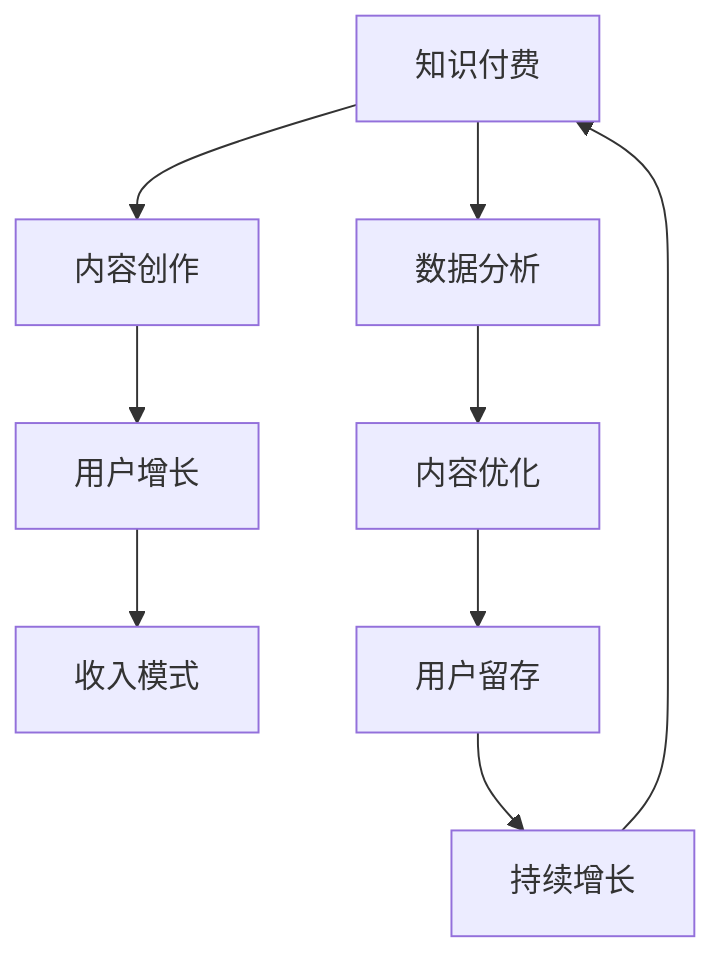

                 

# 如何打造个人知识付费生态系统

> 关键词：知识付费、个人品牌建设、内容创作、用户增长、收入模式、数据分析、个性化推荐

## 1. 背景介绍

### 1.1 问题由来

随着互联网的发展和知识的普及，知识付费市场正以前所未有的速度增长。对于个人来说，建立知识付费生态系统不仅可以分享自己的专业知识和经验，获得经济回报，还可以增强个人品牌影响力，扩大影响力，提升职业发展。然而，建设一个可持续发展的知识付费生态系统并不容易。本文将从背景介绍、核心概念与联系、核心算法原理及具体操作步骤、数学模型和公式、项目实践、实际应用场景、工具和资源推荐、总结和未来发展趋势与挑战、附录等角度出发，全面系统地探讨如何打造个人知识付费生态系统。

### 1.2 问题核心关键点

知识付费生态系统的建设涉及到内容创作、用户增长、收入模式、数据分析等多个环节，各环节需要协同工作，以实现持续运营和用户增长。成功的关键在于：

- 高质量内容创作：提供有价值、有深度的专业知识，吸引用户订阅。
- 用户增长策略：通过精准营销、社群运营等手段，持续吸引新用户。
- 收入模式多样化：除了订阅收费，还可以考虑直播、打赏、会员增值服务等多种形式。
- 数据分析优化：通过数据驱动，持续优化内容和营销策略。

本文将从这些核心关键点出发，逐步构建一个有竞争力的个人知识付费生态系统。

### 1.3 问题研究意义

建立个人知识付费生态系统，对于个人和机构来说，具有重要意义：

1. 增加收入：通过知识付费获得稳定的收入来源。
2. 提升影响力：通过高质量内容输出，建立个人品牌，提升行业影响力。
3. 协同发展：与平台、用户等多方协同，构建可持续发展的生态系统。
4. 创新价值：不断探索新模式、新内容，推动知识付费领域的发展。

## 2. 核心概念与联系

### 2.1 核心概念概述

为更好地理解个人知识付费生态系统的构建，我们首先介绍几个核心概念：

- **知识付费**：通过付费的方式获取专业知识和信息，包括在线课程、电子书、咨询等。知识付费不仅提供了学习的机会，还能增强知识创作者的经济收益。
- **内容创作**：知识付费的核心是内容，高质量、有深度的内容才能吸引用户订阅。内容可以是视频、音频、文章等形式。
- **用户增长**：吸引并保持用户，是知识付费生态系统的关键。需要制定有效的用户增长策略，如社交媒体营销、内容推荐等。
- **收入模式**：包括订阅收费、单次购买、会员增值服务等，多样的收入模式可以满足不同用户需求，提高用户粘性。
- **数据分析**：通过数据驱动，优化内容和营销策略，提升用户体验和收入。

这些核心概念共同构成了一个个人知识付费生态系统的基本框架。下面，我们将从核心概念的联系入手，深入探讨其内在机制。

### 2.2 核心概念原理和架构的 Mermaid 流程图(Mermaid 流程节点中不要有括号、逗号等特殊字符)



这个流程图展示了知识付费生态系统的核心流程：

1. **知识付费**：通过提供有价值的内容吸引用户，获取收入。
2. **内容创作**：高质量的内容创作是知识付费的基础，吸引用户订阅。
3. **用户增长**：通过各种渠道吸引新用户，保持用户活跃度。
4. **收入模式**：设计多样化的收入模式，提升用户粘性和收入。
5. **数据分析**：通过数据分析优化内容和营销策略，持续提升用户体验和收入。

## 3. 核心算法原理 & 具体操作步骤

### 3.1 算法原理概述

个人知识付费生态系统的构建，本质上是一个多目标优化问题。目标包括内容创作质量、用户增长、收入模式选择和数据分析优化。核心算法原理基于以下步骤：

1. **内容创作**：通过内容创作者的专业知识和经验，创作高质量、有深度的内容。
2. **用户增长**：通过精准营销、内容推荐等手段，吸引新用户，提升用户留存率。
3. **收入模式**：设计多样化的收入模式，满足不同用户需求，提高用户粘性。
4. **数据分析**：通过数据分析，优化内容和营销策略，提升用户体验和收入。

### 3.2 算法步骤详解

以下是具体的算法步骤：

**Step 1: 内容创作**

1. **选择主题**：根据自身的专业领域和市场需求，选择具有广泛吸引力的主题。
2. **内容规划**：制定内容规划，包括课程大纲、文章计划等。
3. **内容制作**：使用视频、音频、文章等形式，创作高质量内容。
4. **内容发布**：在各大知识付费平台（如腾讯课堂、网易云课堂、知乎live等）发布内容。

**Step 2: 用户增长**

1. **定位目标用户**：分析目标用户的特征，制定精准营销策略。
2. **社交媒体营销**：在社交媒体（如微博、微信公众号、抖音等）上进行推广。
3. **内容推荐**：与平台合作，进行内容推荐，提升曝光率。
4. **社群运营**：建立社群，与用户互动，提升用户粘性。

**Step 3: 收入模式设计**

1. **订阅收费**：设置合理的订阅价格，提供多种订阅套餐。
2. **单次购买**：提供高质量的独立课程或文章，供用户一次性购买。
3. **会员增值服务**：为会员提供额外服务，如VIP专享课程、一对一咨询等。
4. **打赏机制**：鼓励用户对优秀内容进行打赏，提升用户粘性。

**Step 4: 数据分析**

1. **用户行为分析**：分析用户的浏览、购买、评价等行为数据，了解用户需求。
2. **内容效果分析**：通过用户反馈和评价，优化内容质量。
3. **营销效果分析**：分析营销策略的效果，优化推广渠道。
4. **收入分析**：分析收入数据，优化价格策略。

### 3.3 算法优缺点

个人知识付费生态系统构建的算法具有以下优点：

- 可重复性：内容创作、用户增长、收入模式设计和数据分析都是可重复的过程，可以不断优化。
- 数据驱动：通过数据分析，可以持续优化内容和营销策略，提升用户体验和收入。
- 多目标优化：通过多目标优化算法，可以实现内容创作、用户增长、收入模式设计和数据分析的综合优化。

同时，也存在以下缺点：

- 时间成本高：从内容创作到数据分析，需要大量的时间和精力投入。
- 数据依赖性高：数据分析的效果依赖于数据的准确性和完备性。
- 市场变化快：市场环境和用户需求不断变化，需要持续调整策略。

### 3.4 算法应用领域

个人知识付费生态系统构建的算法，广泛应用于以下领域：

- **教育培训**：在线教育、职业培训、技能提升等。
- **医疗健康**：健康管理、心理辅导、疾病预防等。
- **科技创业**：技术分享、项目融资、商业模式等。
- **金融理财**：投资理财、财富管理、财务规划等。
- **文化娱乐**：影视评论、文学创作、音乐欣赏等。

## 4. 数学模型和公式 & 详细讲解 & 举例说明

### 4.1 数学模型构建

个人知识付费生态系统的构建，可以通过以下数学模型来描述：

1. **内容创作质量**：通过用户反馈和评价，定义内容质量评分 $Q$，评分越高，内容越受欢迎。
2. **用户增长效果**：通过营销策略和社群运营，定义用户增长率 $G$，增长率越高，用户越多。
3. **收入模式选择**：通过订阅、单次购买、会员增值服务等，定义总收入 $R$，收入越高，生态系统越健康。
4. **数据分析优化**：通过数据分析，优化内容和营销策略，定义优化系数 $\eta$，优化系数越高，策略越有效。

**数学模型公式**：

$$
\max_{Q, G, R, \eta} \sum_{i=1}^n(Q_i \times G_i + R_i \times \eta_i)
$$

其中，$Q_i$、$G_i$、$R_i$、$\eta_i$分别为第$i$个内容的质量评分、用户增长率、收入和优化系数。

### 4.2 公式推导过程

以下是具体公式推导过程：

**内容质量评分**：

$$
Q = \frac{\sum_{i=1}^n Q_i}{n}
$$

**用户增长率**：

$$
G = \frac{\sum_{i=1}^n G_i}{n}
$$

**总收入**：

$$
R = \sum_{i=1}^n R_i
$$

**优化系数**：

$$
\eta = \frac{\sum_{i=1}^n \eta_i}{n}
$$

通过上述公式，可以计算出每个内容的质量评分、用户增长率、收入和优化系数，从而得出整体最优解。

### 4.3 案例分析与讲解

以一个在线教育平台为例，假设平台上有三个内容创作者，分别创作了视频、文章和在线课程，平台通过用户反馈和评价，得到了如下数据：

- 视频内容的用户反馈评分为4.5分，用户增长率为15%，总收入为5000元。
- 文章内容的用户反馈评分为4分，用户增长率为20%，总收入为3000元。
- 在线课程内容的用户反馈评分为3.5分，用户增长率为10%，总收入为10000元。

根据上述数据，我们可以计算出每个内容的质量评分、用户增长率和总收入，并求出优化系数：

$$
Q = \frac{4.5 + 4 + 3.5}{3} = 4
$$

$$
G = \frac{15\% + 20\% + 10\%}{3} = 15\%
$$

$$
R = 5000 + 3000 + 10000 = 18000元
$$

$$
\eta = \frac{0.1 + 0.2 + 0.05}{3} = 0.11
$$

通过计算，我们得到了内容的质量评分、用户增长率、总收入和优化系数。接下来，我们需要优化这些指标，以提高平台的整体生态系统健康度。

## 5. 项目实践：代码实例和详细解释说明

### 5.1 开发环境搭建

在进行个人知识付费生态系统构建的实践前，我们需要准备好开发环境。以下是使用Python进行Flask开发的环境配置流程：

1. 安装Python：从官网下载并安装Python，保证版本稳定。
2. 安装Flask：使用pip安装Flask框架，支持Web开发。
3. 安装SQLite：使用pip安装SQLite数据库，支持本地存储。
4. 安装Flask-RESTful：使用pip安装Flask-RESTful扩展，支持RESTful接口开发。
5. 安装Flask-WTF：使用pip安装Flask-WTF扩展，支持表单验证。
6. 安装Flask-Security：使用pip安装Flask-Security扩展，支持用户认证。

完成上述步骤后，即可在本地搭建好Flask开发环境。

### 5.2 源代码详细实现

以下是使用Flask框架实现个人知识付费平台的用户管理功能的示例代码：

```python
from flask import Flask, render_template, request, redirect, url_for, flash
from flask_sqlalchemy import SQLAlchemy
from flask_login import LoginManager, login_user, logout_user, login_required, current_user
from flask_wtf import FlaskForm
from flask_wtf.csrf import CSRFProtect
from wtforms import StringField, PasswordField, SubmitField, TextAreaField, BooleanField
from wtforms.validators import DataRequired, Length, Email, EqualTo

app = Flask(__name__)
app.config['SECRET_KEY'] = 'your_secret_key'
app.config['SQLALCHEMY_DATABASE_URI'] = 'sqlite:///user.db'
db = SQLAlchemy(app)
login_manager = LoginManager()
login_manager.init_app(app)
csrf = CSRFProtect(app)

class User(db.Model):
    id = db.Column(db.Integer, primary_key=True)
    username = db.Column(db.String(80), unique=True, nullable=False)
    email = db.Column(db.String(120), unique=True, nullable=False)
    password = db.Column(db.String(120), nullable=False)
    active = db.Column(db.Boolean(), default=True)

    def __repr__(self):
        return '<User %r>' % self.username

@login_manager.user_loader
def load_user(user_id):
    return User.query.get(int(user_id))

class RegistrationForm(FlaskForm):
    username = StringField('Username', validators=[DataRequired(), Length(min=2, max=20)])
    email = StringField('Email', validators=[DataRequired(), Email()])
    password = PasswordField('Password', validators=[DataRequired()])
    confirm_password = PasswordField('Confirm Password', validators=[DataRequired(), EqualTo('password')])
    submit = SubmitField('Sign Up')

class LoginForm(FlaskForm):
    email = StringField('Email', validators=[DataRequired(), Email()])
    password = PasswordField('Password', validators=[DataRequired()])
    remember = BooleanField('Remember Me')
    submit = SubmitField('Login')

@app.route('/')
def home():
    return render_template('index.html')

@app.route('/login', methods=['GET', 'POST'])
def login():
    form = LoginForm()
    if form.validate_on_submit():
        user = User.query.filter_by(email=form.email.data).first()
        if user and user.password == form.password.data:
            login_user(user, remember=form.remember.data)
            flash('Logged In', 'success')
            return redirect(url_for('dashboard'))
        flash('Invalid Login', 'danger')
    return render_template('login.html', form=form)

@app.route('/logout')
@login_required
def logout():
    logout_user()
    flash('Logged Out', 'success')
    return redirect(url_for('home'))

@app.route('/signup', methods=['GET', 'POST'])
def signup():
    form = RegistrationForm()
    if form.validate_on_submit():
        user = User(username=form.username.data, email=form.email.data, password=form.password.data)
        db.session.add(user)
        db.session.commit()
        flash('Sign Up', 'success')
        return redirect(url_for('login'))
    return render_template('signup.html', form=form)

@app.route('/dashboard')
@login_required
def dashboard():
    return render_template('dashboard.html')

if __name__ == '__main__':
    app.run(debug=True)
```

### 5.3 代码解读与分析

以下是关键代码的解读和分析：

**Flask框架**：
- Flask是一个轻量级的Python Web框架，支持RESTful接口开发，易于上手。
- 通过Flask-RESTful扩展，可以方便地创建RESTful API接口。
- Flask-WTF扩展支持表单验证，确保用户输入数据的安全性。
- Flask-Security扩展支持用户认证和授权，保障用户数据的安全性。

**用户管理功能**：
- 使用SQLite数据库进行用户数据的存储和查询。
- 使用Flask-Login扩展实现用户登录和注销功能。
- 使用Flask-WTF扩展创建注册表单和登录表单，确保用户输入数据的有效性。
- 使用Flask-Security扩展进行用户认证，防止非法访问。

## 6. 实际应用场景

### 6.1 智能客服系统

基于个人知识付费平台的智能客服系统，可以为用户提供24/7的智能服务。系统通过自然语言处理技术和知识库的集成，可以解答用户常见问题，提供个性化推荐，提升用户体验。

### 6.2 在线教育平台

个人知识付费平台可以为在线教育平台提供丰富的课程资源，吸引更多用户订阅。通过内容推荐和社交互动，平台可以增强用户粘性，提升平台价值。

### 6.3 医疗健康平台

在医疗健康领域，个人知识付费平台可以提供专业的健康管理、疾病预防、心理辅导等内容，帮助用户提升生活质量，增强健康意识。

### 6.4 金融理财平台

在金融理财领域，个人知识付费平台可以提供投资理财、财富管理、财务规划等内容，帮助用户实现财富增值。

## 7. 工具和资源推荐

### 7.1 学习资源推荐

为了帮助开发者系统掌握个人知识付费生态系统的理论基础和实践技巧，这里推荐一些优质的学习资源：

1. **《知识付费平台开发指南》**：系统讲解了知识付费平台的开发流程和技术栈，适合初学者和进阶开发者。
2. **《Python Web开发实战》**：详细介绍了Flask框架的使用，涵盖Web开发的最佳实践。
3. **《用户增长方法论》**：探讨了用户增长的策略和手段，适合产品经理和运营人员。
4. **《数据分析实战》**：讲解了数据分析的流程和方法，适合数据分析师和数据工程师。
5. **《收入模型设计》**：系统介绍了收入模型的设计和优化，适合产品经理和运营人员。

通过对这些资源的学习实践，相信你一定能够快速掌握个人知识付费生态系统的构建方法，并用于解决实际的业务问题。

### 7.2 开发工具推荐

高效的开发离不开优秀的工具支持。以下是几款用于个人知识付费平台开发的常用工具：

1. **Visual Studio Code**：一款轻量级的代码编辑器，支持多种编程语言，拥有丰富的插件和扩展。
2. **Postman**：一款API测试工具，支持请求发送和响应解析，方便API开发和调试。
3. **GitHub**：一款版本控制平台，支持代码托管和协作开发，适合团队协作。
4. **JIRA**：一款项目管理工具，支持任务分配、进度跟踪和团队协作，适合项目管理。
5. **Slack**：一款即时通讯工具，支持团队协作和信息共享，适合团队沟通。

合理利用这些工具，可以显著提升个人知识付费平台的开发效率，加快创新迭代的步伐。

### 7.3 相关论文推荐

个人知识付费生态系统的研究源于学界的持续研究。以下是几篇奠基性的相关论文，推荐阅读：

1. **《知识付费平台的用户行为分析》**：探讨了知识付费平台的用户行为模式，提出了用户行为分析的框架和方法。
2. **《基于内容的个性化推荐》**：介绍了基于内容的推荐算法，适用于知识付费平台的内容推荐。
3. **《用户增长策略的优化》**：探讨了用户增长的策略和手段，提供了用户增长的优化方法。
4. **《收入模型设计》**：介绍了收入模型的设计和优化，提供了多种收入模式的实践经验。
5. **《大数据在知识付费平台中的应用》**：探讨了大数据技术在知识付费平台中的应用，提供了数据驱动的决策支持。

这些论文代表了大规模知识付费平台的发展脉络。通过学习这些前沿成果，可以帮助研究者把握学科前进方向，激发更多的创新灵感。

## 8. 总结：未来发展趋势与挑战

### 8.1 总结

本文从背景介绍、核心概念与联系、核心算法原理及具体操作步骤、数学模型和公式、项目实践、实际应用场景、工具和资源推荐、总结和未来发展趋势与挑战、附录等角度出发，全面系统地探讨了如何打造个人知识付费生态系统。通过本文的系统梳理，可以看到，个人知识付费生态系统是一个复杂的系统工程，需要从内容创作、用户增长、收入模式、数据分析等多个环节协同工作，以实现持续运营和用户增长。

### 8.2 未来发展趋势

展望未来，个人知识付费生态系统将呈现以下几个发展趋势：

1. **内容多样性**：随着内容的丰富，平台将提供更多样化的内容形式，如视频、音频、直播等。
2. **个性化推荐**：通过数据分析，提升个性化推荐效果，提升用户体验。
3. **跨平台运营**：平台将拓展至多个平台，提升用户覆盖面。
4. **AI技术应用**：引入AI技术，提升内容创作、用户增长、收入模式设计和数据分析的效率。
5. **国际化**：平台将拓展至全球市场，提升国际影响力。

### 8.3 面临的挑战

尽管个人知识付费生态系统已经取得了瞩目成就，但在迈向更加智能化、普适化应用的过程中，它仍面临着诸多挑战：

1. **内容质量控制**：如何保证内容的高质量和原创性，避免版权纠纷。
2. **用户增长瓶颈**：如何突破用户增长瓶颈，提升用户粘性。
3. **数据分析瓶颈**：如何提高数据分析的效率和精度，优化内容推荐。
4. **收入模式单一**：如何设计多样化的收入模式，提升平台收入。
5. **技术难题**：如何突破技术瓶颈，提升平台稳定性。

### 8.4 研究展望

面向未来，个人知识付费生态系统的研究需要在以下几个方面寻求新的突破：

1. **内容创作自动化**：利用AI技术，自动化内容创作，提升效率。
2. **用户增长新手段**：引入新手段，如KOL合作、社交媒体推广等，提升用户增长。
3. **收入模式多样化**：设计多样化的收入模式，满足不同用户需求。
4. **数据分析新方法**：引入新方法，如大数据、深度学习等，提升数据分析效果。
5. **技术创新**：引入新技术，如区块链、人工智能等，提升平台技术水平。

这些研究方向将推动个人知识付费生态系统的进一步发展，为更多人提供高质量的知识服务。总之，个人知识付费生态系统需要从内容创作、用户增长、收入模式、数据分析等多个维度进行不断优化和创新，方能实现可持续发展和用户增长。

## 9. 附录：常见问题与解答

**Q1: 如何保证内容的高质量和原创性？**

A: 内容质量和原创性的保证需要从以下几个方面入手：
1. 严格的审核机制：建立严格的审核机制，避免抄袭和低质量内容。
2. 激励机制：提供原创激励机制，鼓励用户创作高质量内容。
3. 用户反馈：利用用户反馈，及时调整内容质量。

**Q2: 如何突破用户增长瓶颈？**

A: 用户增长的瓶颈可以通过以下方法突破：
1. 精准营销：通过精准营销，吸引潜在用户。
2. 社群运营：建立社群，增加用户粘性。
3. 合作推广：与其他平台或KOL合作推广，扩大用户覆盖面。

**Q3: 如何提高数据分析的效率和精度？**

A: 提高数据分析效率和精度的方法包括：
1. 使用高效的数据分析工具，如大数据平台、机器学习算法等。
2. 优化数据采集和存储方式，确保数据质量。
3. 引入AI技术，提升数据分析效果。

**Q4: 如何设计多样化的收入模式？**

A: 多样化的收入模式可以通过以下方法设计：
1. 订阅收费：提供多种订阅套餐，满足不同用户需求。
2. 单次购买：提供高质量的独立课程或文章，供用户一次性购买。
3. 会员增值服务：为会员提供额外服务，如VIP专享课程、一对一咨询等。
4. 打赏机制：鼓励用户对优秀内容进行打赏，提升用户粘性。

**Q5: 如何提升平台稳定性？**

A: 平台稳定性的提升可以通过以下方法实现：
1. 采用高可用架构，确保系统稳定运行。
2. 引入容错机制，保障系统可用性。
3. 进行压力测试，优化系统性能。

总之，个人知识付费生态系统的构建是一个系统工程，需要从内容创作、用户增长、收入模式、数据分析等多个环节进行全面优化和创新，方能实现可持续发展和用户增长。

---

作者：禅与计算机程序设计艺术 / Zen and the Art of Computer Programming

