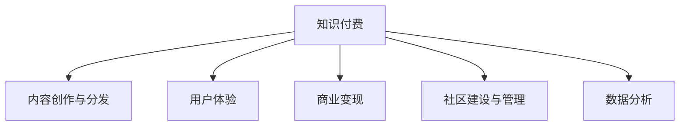

                 

# 如何打造个人知识付费生态系统

> 关键词：知识付费, 个人生态系统, 技术博客, 平台搭建, 商业模式, 用户管理

## 1. 背景介绍

### 1.1 问题由来

在互联网时代，知识的传播方式发生了巨大变化。传统的书籍、论文、讲座等知识获取渠道，已无法满足快速变化的社会需求。在线知识付费应运而生，成为了知识传播的重要形式。

知识付费平台提供高质量、系统化的知识内容，使得用户能够以更高效的方式获取知识，从而提升了个人竞争力。但同时也面临用户付费意愿低、内容质量参差不齐、平台盈利困难等挑战。

如何构建一个可持续发展的知识付费生态系统，同时保障平台和用户的利益，成为当前亟待解决的问题。

### 1.2 问题核心关键点

构建个人知识付费生态系统的核心关键点在于：

1. **内容生产与分发**：高质量内容的产出与有效分发是知识付费生态系统的基础。
2. **用户体验与粘性**：通过优质的用户体验提升用户粘性，增强平台竞争力。
3. **商业变现**：探索多样化的商业变现模式，确保平台可持续运营。
4. **社区建设与管理**：构建健康活跃的社区环境，增强用户粘性。
5. **数据与分析**：通过数据分析优化内容与运营策略，提升平台价值。

### 1.3 问题研究意义

构建个人知识付费生态系统，对于提升知识传播效率、促进终身学习、驱动社会进步具有重要意义：

1. **提升个人能力**：通过持续学习，提升个人专业技能和综合素质，增强职业竞争力。
2. **促进知识共享**：高质量内容可以加速知识传播，提升社会整体知识水平。
3. **推动产业发展**：知识付费平台的发展，带动了内容创作、技术支持、数据服务等产业的兴起。
4. **促进经济增长**：知识付费模式的成功，有助于推动数字经济的发展，带动相关产业链的繁荣。

## 2. 核心概念与联系

### 2.1 核心概念概述

为更好地理解如何构建个人知识付费生态系统，本节将介绍几个密切相关的核心概念：

- **知识付费**：指用户为获取有价值知识而付费的模式。形式包括订阅、单次购买、按需付费等。
- **知识付费平台**：提供知识内容的平台，包括内容创作、分发、用户管理、商业变现等功能模块。
- **内容创作与分发**：知识付费平台的核心功能，涉及内容策划、生产、审核、推送等环节。
- **用户体验**：用户在平台上的使用感受，包括界面友好、操作便捷、内容丰富等方面。
- **商业变现**：知识付费平台的盈利模式，包括广告、会员订阅、付费课程、知识市场等。
- **社区建设与管理**：通过构建社区环境，增强用户粘性，提升用户参与度。
- **数据分析**：通过数据驱动决策，优化内容与运营策略，提升平台价值。

这些核心概念之间的逻辑关系可以通过以下Mermaid流程图来展示：



这个流程图展示了几大核心概念及其之间的关系：

1. **知识付费**：是整个生态系统的核心目标，其他功能模块都围绕此展开。
2. **内容创作与分发**：提供高质量内容，是知识付费的基础。
3. **用户体验**：通过提升用户体验，吸引更多用户，提升平台竞争力。
4. **商业变现**：确保平台可持续运营，实现商业目标。
5. **社区建设与管理**：增强用户粘性，提升平台活跃度。
6. **数据分析**：通过数据优化策略，提升平台价值。

这些概念共同构成了知识付费生态系统的框架，指导平台的设计和运营。

## 3. 核心算法原理 & 具体操作步骤

### 3.1 算法原理概述

构建个人知识付费生态系统，本质上是一个多目标优化问题。其核心思想是：通过高质量内容的产出与有效分发，提升用户体验，实现商业变现，同时通过社区建设与管理及数据分析，不断优化平台策略，实现平台的可持续运营。

形式化地，假设知识付费平台有 $N$ 个内容创作者，$M$ 个用户，目标是最大化平台收益 $R$，即：

$$
\max_{C_i} \sum_{i=1}^N R_i
$$

其中 $R_i$ 为第 $i$ 个内容创作者带来的收益。平台收益由内容销售、广告收入、会员订阅等组成。

内容创作者的目标是最大化其自身收益 $C_i$，即：

$$
\max_{C_i} \sum_{j=1}^J C_{ij}
$$

其中 $C_{ij}$ 为第 $i$ 个内容创作者向第 $j$ 个用户提供的知识内容所带来的收益。

用户的目标是最大化其自身价值 $U_j$，即：

$$
\max_{U_j} \sum_{k=1}^K U_{jk}
$$

其中 $U_{jk}$ 为第 $j$ 个用户从第 $k$ 个知识内容中获得的价值。

在实际操作中，需要平衡各方的利益，通过内容创作与分发、用户体验、商业变现、社区建设与管理、数据分析等模块协同工作，最终实现平台的可持续运营。

### 3.2 算法步骤详解

构建个人知识付费生态系统的具体步骤如下：

**Step 1: 设计平台架构与功能模块**

- **内容创作与分发**：设计内容管理系统，支持内容的上传、审核、分类、推荐等。
- **用户体验**：设计友好的界面，提供便捷的操作方式，增加用户停留时间。
- **商业变现**：设计多样化的商业变现模式，如单次购买、会员订阅、广告等。
- **社区建设与管理**：设计互动功能，如评论、点赞、讨论区等，增强用户粘性。
- **数据分析**：设计数据分析系统，支持用户行为分析、内容效果评估等。

**Step 2: 选择内容创作者与用户**

- **内容创作者**：通过海选、邀请、签约等方式，选择优质创作者。
- **用户**：通过免费试用、优惠活动等方式，吸引优质用户。

**Step 3: 提供优质内容与体验**

- **内容创作**：提供创作工具、平台支持，鼓励内容创作者产出高质量内容。
- **内容分发**：设计个性化推荐算法，将优质内容推送给目标用户。
- **用户体验**：不断优化界面与功能，提升用户使用体验。

**Step 4: 实现商业变现**

- **广告**：在平台内植入广告，通过点击、展示等形式实现收入。
- **会员订阅**：设计会员体系，提供多种订阅套餐，吸引用户订阅。
- **付费课程**：提供单次购买课程，增加收入来源。

**Step 5: 构建社区环境**

- **互动功能**：增加评论、点赞、分享等互动功能，增强用户参与度。
- **用户反馈**：收集用户反馈，不断优化平台策略。

**Step 6: 进行数据分析**

- **用户行为分析**：通过数据分析系统，了解用户行为模式，优化推荐算法。
- **内容效果评估**：通过数据分析，评估内容质量与用户满意度，指导内容创作。

**Step 7: 持续优化**

- **策略调整**：根据数据分析结果，不断调整内容创作、分发策略，提升平台价值。
- **技术升级**：不断优化平台技术架构，提高用户体验。

通过上述步骤，可以逐步构建一个可持续发展的个人知识付费生态系统。

### 3.3 算法优缺点

构建个人知识付费生态系统的算法有以下优点：

1. **系统性**：通过多目标优化，实现了内容创作、用户体验、商业变现、社区建设与数据分析的协同工作。
2. **灵活性**：可以根据平台实际情况，灵活调整策略，优化平台运营效果。
3. **高效性**：通过数据驱动决策，可以迅速发现问题，优化内容与运营策略。
4. **可扩展性**：平台架构设计合理，可以不断扩展功能，适应更多内容与用户需求。

但同时，该算法也存在一些缺点：

1. **数据依赖性**：依赖用户行为数据，需要保证数据质量与完整性。
2. **复杂性**：涉及多个模块，协同工作复杂，需要良好的团队协作。
3. **动态变化性**：内容创作者与用户群体不断变化，需要持续监控与调整策略。

尽管存在这些缺点，但整体而言，构建个人知识付费生态系统的算法仍是一个有效的方法。通过合理设计，可以有效提升平台的运营效率与用户满意度。

### 3.4 算法应用领域

构建个人知识付费生态系统的算法在多个领域都有广泛应用：

- **在线教育**：知识付费平台，如Coursera、Udacity等。
- **职业培训**：知识付费平台，如LinkedIn Learning、技能树等。
- **个人发展**：知识付费平台，如得到、喜马拉雅等。
- **企业内训**：知识付费平台，如腾讯学院、阿里云大学等。

这些平台通过高质量内容的产出与有效分发，提升用户体验，实现商业变现，构建了健康的知识付费生态系统。

## 4. 数学模型和公式 & 详细讲解 & 举例说明

### 4.1 数学模型构建

假设知识付费平台有 $N$ 个内容创作者，$M$ 个用户，目标是最大化平台收益 $R$。内容创作者的目标是最大化其自身收益 $C_i$，用户的目标是最大化其自身价值 $U_j$。

设 $A_i$ 为第 $i$ 个内容创作者的内容质量，$D_{ij}$ 为第 $i$ 个内容创作者向第 $j$ 个用户提供的内容数量，$E_{ij}$ 为第 $i$ 个内容创作者向第 $j$ 个用户提供的内容价值，$P_j$ 为第 $j$ 个用户的支付意愿。

平台收益 $R$ 可以表示为：

$$
R = \sum_{i=1}^N C_i = \sum_{i=1}^N \sum_{j=1}^M C_{ij}
$$

内容创作者收益 $C_i$ 可以表示为：

$$
C_i = \sum_{j=1}^M C_{ij} = \sum_{j=1}^M E_{ij}D_{ij}
$$

用户价值 $U_j$ 可以表示为：

$$
U_j = \sum_{k=1}^K U_{jk} = \sum_{k=1}^K E_{kj}D_{kj}
$$

用户支付意愿 $P_j$ 可以表示为：

$$
P_j = \max_{k=1}^K P_{jk} = \max_{k=1}^K E_{kj}D_{kj}
$$

在实际应用中，需要考虑内容质量、内容数量、用户价值、用户支付意愿等多重因素，通过算法优化实现平台的可持续运营。

### 4.2 公式推导过程

以下我们以单次购买课程为例，推导课程收益的计算公式。

设课程价格为 $p$，用户数为 $n$，课程质量为 $a$，用户支付意愿为 $p_j$。

课程收益 $R$ 可以表示为：

$$
R = p \times n \times a
$$

用户收益 $U_j$ 可以表示为：

$$
U_j = p \times a
$$

用户支付意愿 $P_j$ 可以表示为：

$$
P_j = \max(p, a)
$$

通过上述推导，可以看出课程收益的计算公式为：

$$
R = p \times n \times a
$$

其中 $p$ 表示课程价格，$n$ 表示购买课程的用户数量，$a$ 表示课程质量。

### 4.3 案例分析与讲解

假设某知识付费平台上线了一个热门课程，内容质量为 $a=0.9$，课程价格为 $p=99$，用户支付意愿分布如下：

| 用户 | $P_j$ |
|------|-------|
| 1    | 1     |
| 2    | 0.8   |
| 3    | 0.6   |
| ...  | ...   |

课程收益 $R$ 可以表示为：

$$
R = 99 \times n \times 0.9
$$

其中 $n$ 表示购买课程的用户数量。

## 5. 项目实践：代码实例和详细解释说明

### 5.1 开发环境搭建

在进行知识付费平台开发前，我们需要准备好开发环境。以下是使用Python进行Django开发的环境配置流程：

1. 安装Anaconda：从官网下载并安装Anaconda，用于创建独立的Python环境。

2. 创建并激活虚拟环境：
```bash
conda create -n django-env python=3.8 
conda activate django-env
```

3. 安装Django：从官网获取对应的安装命令。例如：
```bash
pip install django==3.2
```

4. 安装必要的工具包：
```bash
pip install markdown django-templates markdownx
```

5. 安装Git：
```bash
sudo apt-get update
sudo apt-get install git
```

完成上述步骤后，即可在`django-env`环境中开始开发实践。

### 5.2 源代码详细实现

下面我们以Django框架为例，给出一个知识付费平台的开发流程。

首先，创建一个新的Django项目：

```bash
django-admin startproject knowledge_eco
```

进入项目目录，创建应用程序：

```bash
cd knowledge_eco
python manage.py startapp content
python manage.py startapp user
python manage.py startapp course
python manage.py startapp orders
python manage.py startapp analysis
```

在每个应用中，实现相应功能模块：

- **content应用**：实现内容管理系统，包括内容上传、审核、分类、推荐等。
- **user应用**：实现用户管理系统，包括用户注册、登录、订阅、支付等。
- **course应用**：实现课程管理系统，包括课程上传、审核、推荐等。
- **orders应用**：实现订单管理系统，包括订单创建、支付、取消等。
- **analysis应用**：实现数据分析系统，包括用户行为分析、内容效果评估等。

在`settings.py`中添加相应的应用和中间件：

```python
INSTALLED_APPS = [
    'content',
    'user',
    'course',
    'orders',
    'analysis',
    # 其他应用和中间件
]

MIDDLEWARE = [
    # 其他中间件
]
```

在`urls.py`中添加相应的路由：

```python
urlpatterns = [
    # 其他路由
    path('content/', include('content.urls')),
    path('user/', include('user.urls')),
    path('course/', include('course.urls')),
    path('orders/', include('orders.urls')),
    path('analysis/', include('analysis.urls')),
]
```

### 5.3 代码解读与分析

这里我们重点解读`content`应用中的内容管理系统实现。

首先，在`models.py`中定义内容模型：

```python
from django.db import models

class Content(models.Model):
    title = models.CharField(max_length=100)
    description = models.TextField()
    content = models.TextField()
    category = models.CharField(max_length=50)
    created_at = models.DateTimeField(auto_now_add=True)
    updated_at = models.DateTimeField(auto_now=True)

    def __str__(self):
        return self.title
```

然后在`views.py`中实现内容管理系统功能：

```python
from django.shortcuts import render, redirect
from django.http import HttpResponse, Http404
from .models import Content

def content_list(request):
    contents = Content.objects.all()
    return render(request, 'content/list.html', {'contents': contents})

def content_detail(request, pk):
    try:
        content = Content.objects.get(pk=pk)
    except Content.DoesNotExist:
        raise Http404("Content does not exist")
    return render(request, 'content/detail.html', {'content': content})
```

在`urls.py`中定义内容列表和详情路由：

```python
urlpatterns = [
    path('', content_list, name='content_list'),
    path('<int:pk>/', content_detail, name='content_detail'),
]
```

通过上述代码，实现了内容管理系统的主要功能，包括内容列表和详情展示。开发者可以根据实际需求，进一步扩展内容管理系统的功能，如添加、编辑、删除等操作。

## 6. 实际应用场景

### 6.1 智能教育平台

智能教育平台通过知识付费模式，为学生提供高质量的在线课程和辅导服务。平台通过不断优化内容质量、用户体验和商业变现策略，吸引了大量优质用户，实现了平台的可持续发展。

### 6.2 职业培训平台

职业培训平台通过知识付费模式，为企业员工提供职业技能培训课程。平台通过内容创作者和用户的协同工作，不断优化课程内容，提升用户满意度和平台价值。

### 6.3 个人发展平台

个人发展平台通过知识付费模式，为用户提供个人成长所需的各类知识资源。平台通过多样化的商业变现模式，确保平台的可持续运营，同时通过社区建设与管理，增强用户粘性。

### 6.4 企业内训平台

企业内训平台通过知识付费模式，为企业员工提供内部培训课程。平台通过内容创作者和用户的协同工作，不断优化课程内容，提升员工技能和公司竞争力。

### 6.5 健康知识平台

健康知识平台通过知识付费模式，为用户提供健康养生、疾病预防等知识资源。平台通过多样化的商业变现模式，确保平台的可持续运营，同时通过社区建设与管理，增强用户粘性。

## 7. 工具和资源推荐

### 7.1 学习资源推荐

为了帮助开发者系统掌握知识付费生态系统的理论基础和实践技巧，这里推荐一些优质的学习资源：

1. 《知识付费的逻辑》系列博文：由知识付费领域专家撰写，深入浅出地介绍了知识付费的商业模式、用户需求、内容创作与分发等核心话题。

2. 《知识付费平台设计与运营》课程：由知名高校开设的在线课程，涵盖知识付费平台的基础理论与实战案例，助力开发者快速上手。

3. 《知识付费生态系统》书籍：系统介绍了知识付费生态系统的构建、运营与优化策略，帮助开发者全面了解知识付费平台的运作模式。

4. Udemy《知识付费创业指南》课程：由成功创业者撰写，结合自身经验，深入讲解了知识付费创业的关键点与实战技巧。

5. Coursera《知识付费市场分析》课程：由行业专家授课，讲解了知识付费市场的现状、趋势与策略，为开发者提供市场洞察。

通过对这些资源的学习实践，相信你一定能够快速掌握知识付费生态系统的构建与运营技巧，并用于解决实际问题。

### 7.2 开发工具推荐

高效的开发离不开优秀的工具支持。以下是几款用于知识付费平台开发的常用工具：

1. Django：基于Python的开源Web框架，支持快速迭代研究，具有强大的功能扩展能力。

2. Flask：轻量级的Web框架，简单易用，适合快速搭建API接口。

3. React：流行的前端框架，支持高效的UI开发，提升用户体验。

4. Bootstrap：流行的UI库，提供丰富的组件和样式，简化前端开发。

5. AWS：亚马逊云平台，提供丰富的云服务资源，支持快速部署与扩展。

6. Kubernetes：开源容器编排系统，支持容器化应用的高效管理与部署。

合理利用这些工具，可以显著提升知识付费平台的开发效率，加快创新迭代的步伐。

### 7.3 相关论文推荐

知识付费平台的发展源于学界的持续研究。以下是几篇奠基性的相关论文，推荐阅读：

1. 《知识付费平台的商业化探索》：探讨知识付费平台的商业模式、用户需求、内容创作与分发等关键问题，提供了丰富的实践经验。

2. 《知识付费生态系统的构建与运营》：从生态系统视角，分析知识付费平台的内容创作、用户管理、社区建设等模块，提出了优化策略。

3. 《知识付费平台的可持续发展》：结合实际案例，探讨知识付费平台的可持续运营策略，提供了可借鉴的实践路径。

4. 《知识付费平台的用户行为分析》：通过用户行为数据分析，优化知识付费平台的推荐算法，提升平台价值。

5. 《知识付费平台的内容质量提升》：结合内容创作者和用户反馈，优化内容质量，提升用户满意度。

这些论文代表了大语言模型微调技术的发展脉络。通过学习这些前沿成果，可以帮助研究者把握学科前进方向，激发更多的创新灵感。

## 8. 总结：未来发展趋势与挑战

### 8.1 总结

本文对如何构建个人知识付费生态系统进行了全面系统的介绍。首先阐述了知识付费生态系统的研究背景和意义，明确了内容创作、用户体验、商业变现、社区建设与管理、数据分析等关键模块的目标与协同关系。其次，从原理到实践，详细讲解了知识付费生态系统的算法原理与操作步骤，给出了知识付费平台开发的完整代码实例。同时，本文还探讨了知识付费平台在智能教育、职业培训、个人发展、企业内训、健康知识等多个领域的应用前景，展示了知识付费生态系统的广阔应用空间。此外，本文精选了知识付费生态系统的学习资源、开发工具与相关论文，力求为开发者提供全方位的技术指引。

通过本文的系统梳理，可以看到，构建个人知识付费生态系统是一个系统性、多目标优化的过程，涉及到内容创作、用户体验、商业变现、社区建设与管理、数据分析等多个方面。通过合理的策略设计，可以构建一个可持续发展的知识付费生态系统，为用户提供高质量的知识服务，实现平台的商业目标。

### 8.2 未来发展趋势

展望未来，知识付费生态系统的发展趋势如下：

1. **内容多样化**：知识付费平台将提供更加丰富、多样化的内容形式，如视频、音频、图文结合等。

2. **个性化推荐**：通过大数据分析和机器学习技术，实现个性化推荐，提升用户体验。

3. **智能化运营**：通过人工智能技术，实现内容创作、分发、用户管理等环节的智能化，提高运营效率。

4. **多元化变现**：除了传统广告、会员订阅、课程销售外，还将探索内容广告、内容电商等多元化变现模式。

5. **全球化拓展**：知识付费平台将面向全球市场，提供多语言支持，拓展更多用户群体。

6. **技术融合**：知识付费平台将与大数据、区块链、物联网等技术深度融合，实现更高效、安全的知识传播与变现。

以上趋势凸显了知识付费生态系统的广阔前景。这些方向的探索发展，必将进一步提升知识付费平台的运营效率与用户满意度，推动知识传播的普及与深入。

### 8.3 面临的挑战

尽管知识付费平台已经取得了瞩目成就，但在迈向更加智能化、普适化应用的过程中，它仍面临诸多挑战：

1. **内容质量不稳定**：内容创作者水平参差不齐，内容质量难以保证。需要通过内容审核、社区建设等手段，提升内容质量。

2. **用户流失率高**：用户付费意愿低，忠诚度不高。需要通过优质内容、社区互动等手段，增强用户粘性。

3. **平台运营成本高**：平台建设与运营需要大量资源投入，包括内容创作、技术支持、社区管理等。需要通过多元化变现、技术创新等手段，降低运营成本。

4. **知识产权保护**：知识付费平台涉及大量知识产权问题，如何保护创作者权益，避免侵权风险，是一个重要挑战。

5. **合规与法律风险**：知识付费平台需要遵守法律法规，确保平台运营的合法合规，避免法律风险。

6. **数据安全与隐私**：平台需要保护用户数据安全，防止数据泄露和滥用。

面对这些挑战，知识付费平台需要不断优化内容与运营策略，提升技术水平，强化合规管理，确保平台健康稳定运营。

### 8.4 研究展望

面向未来，知识付费平台的研究方向如下：

1. **内容创作与分发的智能化**：通过人工智能技术，优化内容创作与分发策略，提升内容质量与用户体验。

2. **用户行为分析与预测**：通过大数据分析，预测用户需求，优化个性化推荐，提升用户粘性。

3. **平台治理与社区管理**：通过社区建设与管理，增强用户互动，提升平台价值。

4. **知识付费与终身学习的结合**：通过知识付费平台，促进终身学习，提升社会知识水平。

5. **知识付费与传统教育的融合**：通过知识付费平台，补充传统教育，提升教育质量。

6. **知识付费与智慧社会的构建**：通过知识付费平台，构建智慧社会，推动社会进步。

这些研究方向将推动知识付费平台的不断创新与发展，为知识传播与人类进步提供新的动力。

## 9. 附录：常见问题与解答

**Q1：如何选择合适的知识付费平台？**

A: 选择合适的知识付费平台，需要考虑平台的质量、内容丰富度、用户体验、技术支持等多个方面。可以通过平台推荐、用户评价等方式，综合评估平台的优劣。

**Q2：知识付费平台如何实现商业变现？**

A: 知识付费平台的商业变现模式多样，包括广告、会员订阅、课程销售、内容电商等。平台需要根据自身定位和用户需求，选择合适的变现模式。

**Q3：如何提升知识付费平台的运营效率？**

A: 通过优化内容创作与分发、提升用户体验、拓展商业变现渠道、加强社区建设与管理、利用数据分析优化策略，可以提升知识付费平台的运营效率。

**Q4：知识付费平台如何保护用户隐私？**

A: 平台需要遵守法律法规，保护用户隐私。通过数据加密、匿名化处理、访问控制等手段，防止数据泄露和滥用。

**Q5：如何提升知识付费平台的内容质量？**

A: 平台需要通过内容审核、社区建设、用户反馈等手段，提升内容质量。同时鼓励优质内容创作者，提供创作激励机制。

---

作者：禅与计算机程序设计艺术 / Zen and the Art of Computer Programming

