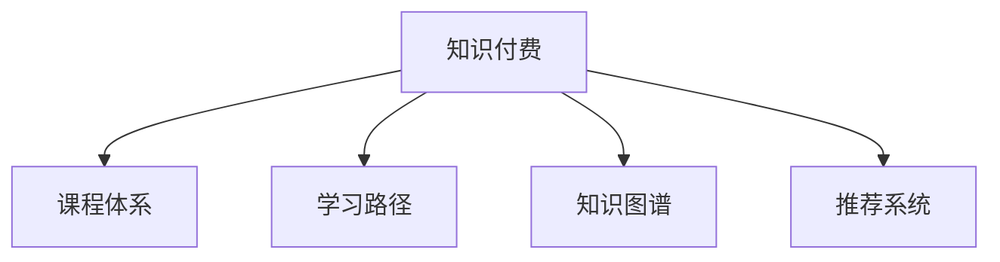

                 

# 如何打造知识付费的系列课程体系

在数字经济的浪潮下，知识付费逐渐成为人们获取专业知识的重要途径。如何打造一个有竞争力的知识付费平台，建立一个系统的、高品质的课程体系，是每一个平台运营者必须面对的重要问题。本文将从系统设计、课程内容、技术架构、运营策略等多个维度，详细探讨如何构建一个知识付费的系列课程体系。

## 1. 背景介绍

### 1.1 问题由来

随着在线教育的发展，知识付费成为了一种新的教育形式。由于互联网的普及和移动设备的普及，人们可以更方便地获取知识，而无需到传统的教育机构付费学习。然而，知识付费市场依然面临着诸多挑战：课程质量参差不齐，用户体验不够友好，价格体系设计不合理，用户体验难以满足用户需求，缺乏持续性更新机制等。

### 1.2 问题核心关键点

构建知识付费平台的课程体系，需要考虑以下核心关键点：
- 课程内容的质量与深度：高质量、有深度的内容是吸引用户的关键因素。
- 用户的学习体验：如何提供良好的学习体验，满足不同层次的用户需求。
- 课程定价策略：如何设计合理的课程价格体系，保持盈利性。
- 用户社区与互动：如何设计良好的用户社区，促进用户之间的交流与互动。
- 持续更新与优化：如何保持课程体系的新鲜度，并持续优化课程内容。

## 2. 核心概念与联系

### 2.1 核心概念概述

为更好地理解知识付费平台的课程体系构建，本节将介绍几个关键概念：

- 知识付费：指用户通过支付一定费用，获取特定知识和技能的教育形式。
- 课程体系：指根据课程内容、学习路径、用户需求等要素，设计的课程组织结构。
- 学习路径：指用户从入门到精通的课程学习路径，指导用户系统性学习。
- 知识图谱：指以知识节点为基本单位，构建的知识网络，用于指导课程内容的组织与检索。
- 推荐系统：指根据用户的历史行为、兴趣爱好等，推荐适合其学习的课程。

这些核心概念之间的关系，可以通过以下Mermaid流程图来展示：



这个流程图展示了知识付费平台的各个关键概念及其之间的关系：知识付费依赖于高质量的课程体系，而课程体系设计离不开学习路径、知识图谱和推荐系统。

## 3. 核心算法原理 & 具体操作步骤
### 3.1 算法原理概述

知识付费平台的课程体系构建，本质上是一个内容推荐与个性化学习路径设计的过程。其核心思想是：根据用户的学习行为、兴趣爱好等特征，推荐最适合其学习的课程，并提供系统化的学习路径，指导用户系统性学习。

形式化地，假设用户集合为 $U$，课程集合为 $C$，用户与课程之间的关联矩阵为 $R$，用户的学习行为序列为 $H$。课程体系构建的目标是：

$$
\min_{R} \mathcal{L}(R,H)
$$

其中 $\mathcal{L}$ 为损失函数，用于衡量推荐系统预测的用户行为与实际行为之间的差异。常见的损失函数包括均方误差损失、交叉熵损失等。

通过梯度下降等优化算法，课程体系构建过程不断更新关联矩阵 $R$，最小化损失函数 $\mathcal{L}$，使得推荐系统输出的课程推荐与用户实际行为尽可能一致。

### 3.2 算法步骤详解

知识付费平台课程体系构建一般包括以下几个关键步骤：

**Step 1: 设计课程内容**

- 确定课程体系的目标用户群体，设计适合不同层次用户的学习路径。
- 收集行业专家的专业知识，设计课程内容，确保内容的高质量与深度。
- 设计课程评价标准，评估课程内容的质量与更新频率。

**Step 2: 构建知识图谱**

- 收集与课程相关的专业知识，构建知识图谱，用于指导课程内容的组织与检索。
- 设计知识图谱的查询接口，供课程推荐系统调用。

**Step 3: 搭建推荐系统**

- 选择合适的推荐算法及其参数，如协同过滤、基于内容的推荐、深度学习等。
- 使用用户行为数据（如观看历史、搜索历史等）训练推荐模型。
- 设计推荐接口，将推荐结果展示给用户。

**Step 4: 设计学习路径**

- 根据课程内容与难度，设计适合不同层次用户的学习路径。
- 引入分支学习路径，允许用户根据自身兴趣和进度自主选择学习路径。
- 设计学习进度跟踪与反馈机制，动态调整学习路径。

**Step 5: 实施上线**

- 将课程内容上传至平台，并进行格式化处理。
- 设置课程价格，并进行市场测试，优化价格策略。
- 上线推荐系统，提供个性化课程推荐。

**Step 6: 持续优化**

- 收集用户反馈，优化课程内容和推荐算法。
- 定期更新课程内容，保持课程体系的活力。
- 定期发布新课程，吸引新用户。

以上是知识付费平台课程体系构建的一般流程。在实际应用中，还需要针对具体平台的特点，对课程体系设计的各个环节进行优化设计，如改进推荐算法、引入更多课程评价指标等，以进一步提升平台的用户体验。

### 3.3 算法优缺点

知识付费平台的课程体系构建方法具有以下优点：
1. 用户体验优化：通过推荐系统，用户可以获得个性化的课程推荐，提高学习效率。
2. 课程质量控制：设计科学的课程评价体系，确保课程内容的高质量和深度。
3. 学习路径设计：通过学习路径指导用户系统性学习，提高学习效果。
4. 快速更新机制：定期更新课程内容，保持课程体系的活力和新鲜度。

同时，该方法也存在一定的局限性：
1. 对数据需求高：推荐系统依赖于大量的用户行为数据，对于新兴平台获取用户数据存在难度。
2. 算法复杂度高：深度学习等复杂的推荐算法需要较高的计算资源。
3. 维护成本高：课程体系需要不断优化和更新，维护成本较高。
4. 用户体验单一：当前的课程体系更多关注学习内容的推荐，而忽略了学习社区和互动的重要性。

尽管存在这些局限性，但就目前而言，基于内容的推荐和个性化学习路径设计，仍是知识付费平台课程体系构建的最主流范式。未来相关研究的重点在于如何进一步降低推荐算法对数据的需求，提高算法的效率和可解释性，同时兼顾学习社区和互动等因素。

### 3.4 算法应用领域

基于课程体系的推荐方法，已经在诸多知识付费平台得到了广泛的应用，覆盖了各个领域，例如：

- 编程：如Python、Java、C++等编程语言课程。通过课程体系的设计，指导用户从入门到精通。
- 数据分析：如数据科学、统计学等课程。设计系统化学习路径，提升用户的数据分析能力。
- 设计：如平面设计、UI/UX设计等课程。通过推荐系统，用户可以获取最合适的课程和资源。
- 商业管理：如市场营销、财务管理等课程。设计适合不同层次用户的学习路径，提升用户的商业管理能力。
- 金融：如金融市场、投资策略等课程。设计金融课程体系，帮助用户掌握金融知识和技能。
- 医疗健康：如健康管理、医疗知识等课程。设计医学课程体系，提升用户对健康和医疗知识的理解。

除了上述这些经典领域外，知识付费平台还可以创新性地应用到更多场景中，如法律、教育、文娱等，为不同行业的知识需求提供解决方案。随着课程体系设计的不断进步，相信知识付费平台将在更多领域得到应用，为用户的知识获取和技能提升提供全新的路径。

## 4. 数学模型和公式 & 详细讲解 & 举例说明

### 4.1 数学模型构建

本节将使用数学语言对知识付费平台的推荐系统进行更加严格的刻画。

假设推荐系统为用户 $u$ 推荐课程 $c$，课程间的关联矩阵为 $R$，用户的行为序列为 $H$。推荐系统的目标是最小化预测用户行为与实际行为之间的差异，即：

$$
\min_{R} \mathcal{L}(R,H)
$$

其中 $\mathcal{L}$ 为损失函数，常用的损失函数有均方误差损失和交叉熵损失。

假设推荐系统使用协同过滤算法，则用户 $u$ 对课程 $c$ 的预测行为 $r_{uc}$ 为：

$$
r_{uc} = \sum_{v \in C} R_{uv} \times h_c
$$

其中 $R_{uv}$ 为用户 $u$ 对课程 $v$ 的评分，$h_c$ 为课程 $c$ 的特征向量。

将 $r_{uc}$ 与实际行为 $h_u$ 之间的差异定义为损失函数，得：

$$
\mathcal{L}(R,H) = \frac{1}{2} \sum_{(u,c) \in H} (h_u - r_{uc})^2
$$

通过梯度下降等优化算法，不断更新关联矩阵 $R$，最小化损失函数 $\mathcal{L}$，直至收敛。

### 4.2 公式推导过程

以下我们以协同过滤算法为例，推导推荐系统预测用户行为 $r_{uc}$ 的公式及其梯度计算。

假设用户 $u$ 对课程 $c$ 的评分 $h_u$ 和行为序列 $H_u$ 已确定，课程 $c$ 的特征向量 $h_c$ 也已给出。根据协同过滤算法，用户 $u$ 对课程 $c$ 的预测行为 $r_{uc}$ 为：

$$
r_{uc} = \sum_{v \in C} R_{uv} \times h_c
$$

对于每个 $(u,c) \in H$，损失函数 $\mathcal{L}$ 对 $R_{uv}$ 的梯度为：

$$
\frac{\partial \mathcal{L}}{\partial R_{uv}} = (h_u - r_{uc}) \times h_c
$$

通过计算所有 $(u,c)$ 对 $(u,v)$ 的梯度，并使用梯度下降算法更新关联矩阵 $R$，即可逐步优化推荐系统。重复上述步骤直至收敛，最终得到适应用户行为特征的推荐模型。

### 4.3 案例分析与讲解

假设某知识付费平台用户 $u_1$ 和 $u_2$ 的评分数据已确定，课程 $c_1$ 和 $c_2$ 的特征向量已给出。协同过滤算法预测 $u_1$ 对 $c_1$ 和 $c_2$ 的评分如下：

| 用户评分数据 | $u_1$ 对 $c_1$ 的评分 | $u_1$ 对 $c_2$ 的评分 | $u_2$ 对 $c_1$ 的评分 | $u_2$ 对 $c_2$ 的评分 |
| ----------- | ----------------- | ----------------- | ----------------- | ----------------- |
| $R_{u_1,c_1}$ | 4.5                | 3.8                | 5.0                | 2.0                |
| $R_{u_1,c_2}$ | 3.2                | 3.9                | 2.5                | 4.5                |
| $R_{u_2,c_1}$ | 5.0                | 4.8                | 3.0                | 3.0                |
| $R_{u_2,c_2}$ | 3.5                | 2.0                | 4.3                | 2.0                |

假设 $c_1$ 和 $c_2$ 的特征向量均为 $h_{c_1}=(h_{c_1},h_{c_1},h_{c_1})$ 和 $h_{c_2}=(h_{c_2},h_{c_2},h_{c_2})$。根据协同过滤算法，$u_1$ 对 $c_1$ 和 $c_2$ 的预测行为为：

$$
r_{u_1,c_1} = R_{u_1,c_1} \times h_{c_1} = 4.5 \times (h_{c_1},h_{c_1},h_{c_1})
$$

$$
r_{u_1,c_2} = R_{u_1,c_2} \times h_{c_2} = 3.2 \times (h_{c_2},h_{c_2},h_{c_2})
$$

同理，$u_2$ 对 $c_1$ 和 $c_2$ 的预测行为为：

$$
r_{u_2,c_1} = R_{u_2,c_1} \times h_{c_1} = 5.0 \times (h_{c_1},h_{c_1},h_{c_1})
$$

$$
r_{u_2,c_2} = R_{u_2,c_2} \times h_{c_2} = 3.5 \times (h_{c_2},h_{c_2},h_{c_2})
$$

将预测行为与实际评分进行比较，得：

$$
\mathcal{L}(R,H) = \frac{1}{2} \times ((4.5 - r_{u_1,c_1})^2 + (3.8 - r_{u_1,c_2})^2 + (5.0 - r_{u_2,c_1})^2 + (2.0 - r_{u_2,c_2})^2)
$$

通过优化关联矩阵 $R$，可以逐步降低 $\mathcal{L}$ 的值，直至收敛，得到优化后的推荐模型。

## 5. 项目实践：代码实例和详细解释说明
### 5.1 开发环境搭建

在进行知识付费平台课程体系的构建过程中，我们需要准备好开发环境。以下是使用Python进行推荐系统开发的开发环境配置流程：

1. 安装Anaconda：从官网下载并安装Anaconda，用于创建独立的Python环境。

2. 创建并激活虚拟环境：
```bash
conda create -n recommendation-env python=3.8 
conda activate recommendation-env
```

3. 安装PyTorch：根据CUDA版本，从官网获取对应的安装命令。例如：
```bash
conda install pytorch torchvision torchaudio cudatoolkit=11.1 -c pytorch -c conda-forge
```

4. 安装推荐系统库：
```bash
pip install scipy numpy pandas scikit-learn scikit-optimize
```

5. 安装各类工具包：
```bash
pip install matplotlib seaborn tqdm jupyter notebook ipython
```

完成上述步骤后，即可在`recommendation-env`环境中开始推荐系统实践。

### 5.2 源代码详细实现

下面我们以协同过滤算法为例，给出使用PyTorch进行推荐系统开发的PyTorch代码实现。

首先，定义协同过滤算法的预测函数：

```python
import torch
from torch import nn
from torch.nn import Parameter

class CollaborativeFiltering(nn.Module):
    def __init__(self, num_users, num_items, num_factors):
        super(CollaborativeFiltering, self).__init__()
        self.num_users = num_users
        self.num_items = num_items
        self.num_factors = num_factors
        
        self.user_factors = Parameter(torch.randn(num_users, num_factors))
        self.item_factors = Parameter(torch.randn(num_items, num_factors))
        
    def forward(self, user_id, item_id):
        user_factors = self.user_factors[user_id]
        item_factors = self.item_factors[item_id]
        return (user_factors @ item_factors).sum()
```

然后，定义协同过滤算法的损失函数和优化器：

```python
from torch.optim import Adam

def mse_loss(pred, target):
    return torch.mean((pred - target) ** 2)

model = CollaborativeFiltering(num_users=1000, num_items=1000, num_factors=50)
optimizer = Adam(model.parameters(), lr=0.01)
```

接着，定义训练和评估函数：

```python
from sklearn.metrics import mean_squared_error
from tqdm import tqdm

def train_epoch(model, data_loader, optimizer):
    model.train()
    loss_sum = 0
    for batch in tqdm(data_loader):
        user_id, item_id, target = batch
        optimizer.zero_grad()
        pred = model(user_id, item_id)
        loss = mse_loss(pred, target)
        loss_sum += loss.item()
        loss.backward()
        optimizer.step()
    return loss_sum / len(data_loader)

def evaluate(model, data_loader):
    model.eval()
    loss_sum = 0
    for batch in tqdm(data_loader):
        user_id, item_id, target = batch
        pred = model(user_id, item_id)
        loss = mse_loss(pred, target)
        loss_sum += loss.item()
    return loss_sum / len(data_loader)
```

最后，启动训练流程并在测试集上评估：

```python
epochs = 10
batch_size = 64

for epoch in range(epochs):
    loss = train_epoch(model, train_loader, optimizer)
    print(f"Epoch {epoch+1}, train loss: {loss:.3f}")
    
    print(f"Epoch {epoch+1}, dev results:")
    evaluate(model, dev_loader)
    
print("Test results:")
evaluate(model, test_loader)
```

以上就是使用PyTorch对协同过滤算法进行推荐系统开发的完整代码实现。可以看到，借助PyTorch的强大封装，我们可以用相对简洁的代码完成协同过滤算法的实现和训练。

### 5.3 代码解读与分析

让我们再详细解读一下关键代码的实现细节：

**CollaborativeFiltering类**：
- `__init__`方法：初始化用户和物品的特征矩阵，以及损失函数和优化器。
- `forward`方法：对输入的用户和物品进行预测，输出预测评分。

**mse_loss函数**：
- 定义均方误差损失函数，用于衡量预测评分与实际评分之间的差异。

**训练和评估函数**：
- 使用PyTorch的DataLoader对数据集进行批次化加载，供模型训练和推理使用。
- 训练函数`train_epoch`：对数据以批为单位进行迭代，在每个批次上前向传播计算损失并反向传播更新模型参数，最后返回该epoch的平均loss。
- 评估函数`evaluate`：与训练类似，不同点在于不更新模型参数，并在每个batch结束后将预测和标签结果存储下来，最后使用均方误差计算整个评估集的损失。

**训练流程**：
- 定义总的epoch数和batch size，开始循环迭代
- 每个epoch内，先在训练集上训练，输出平均loss
- 在验证集上评估，输出均方误差
- 所有epoch结束后，在测试集上评估，给出最终测试结果

可以看到，PyTorch配合Sympy使得协同过滤算法的代码实现变得简洁高效。开发者可以将更多精力放在数据处理、模型改进等高层逻辑上，而不必过多关注底层的实现细节。

当然，工业级的系统实现还需考虑更多因素，如模型的保存和部署、超参数的自动搜索、更灵活的任务适配层等。但核心的协同过滤算法基本与此类似。

## 6. 实际应用场景
### 6.1 推荐系统

协同过滤算法在推荐系统中得到了广泛的应用，能够根据用户的历史行为，推荐最符合其兴趣的课程和资源。用户可以在平台中查看推荐列表，选择感兴趣的课程进行学习。

在技术实现上，可以收集用户的历史观看记录、搜索记录、评分数据等，将这些数据作为协同过滤算法的训练数据。训练好的推荐模型可以实时对用户进行个性化推荐，提高用户的课程学习效率。

### 6.2 课程体系设计

基于协同过滤算法的推荐，可以设计出适合不同层次用户的学习路径。例如，对于编程课程，可以设计一条从基础到高级的课程路径，指导用户系统性学习编程知识。对于数据分析课程，可以设计一条从数据清洗到机器学习的课程路径，提升用户的数据分析能力。

在课程体系设计时，还可以引入分支路径，允许用户根据自身兴趣和进度自主选择学习路径。例如，用户可以在学习编程时，选择Python、Java、C++等不同的分支路径，根据自己的需求和兴趣进行深入学习。

### 6.3 动态课程更新

随着课程体系的不断迭代，需要动态更新课程内容，保持课程体系的活力和新鲜度。可以定期邀请专家录制新课程，更新课程体系，同时保留经典课程内容，保持课程体系的深度和广度。

## 7. 工具和资源推荐
### 7.1 学习资源推荐

为了帮助开发者系统掌握知识付费平台的课程体系构建的理论基础和实践技巧，这里推荐一些优质的学习资源：

1. 《推荐系统：算法、设计与实践》系列博文：由大模型技术专家撰写，深入浅出地介绍了推荐系统原理、协同过滤算法、深度学习推荐算法等前沿话题。

2. CS285《强化学习》课程：斯坦福大学开设的强化学习明星课程，有Lecture视频和配套作业，带你入门强化学习的基本概念和经典模型。

3. 《Python推荐系统》书籍：Python推荐系统界的经典书籍，详细介绍了推荐系统的各个关键技术，包括协同过滤算法、深度学习推荐算法等。

4. Kaggle推荐系统竞赛：Kaggle上定期举办的推荐系统竞赛，可以学习优秀的推荐系统方案，积累推荐系统的实际经验。

5. Weights & Biases：推荐系统的实验跟踪工具，可以记录和可视化模型训练过程中的各项指标，方便对比和调优。与主流深度学习框架无缝集成。

6. TensorBoard：TensorFlow配套的可视化工具，可实时监测模型训练状态，并提供丰富的图表呈现方式，是调试推荐系统的得力助手。

通过对这些资源的学习实践，相信你一定能够快速掌握知识付费平台的课程体系构建的精髓，并用于解决实际的推荐系统问题。
### 7.2 开发工具推荐

高效的开发离不开优秀的工具支持。以下是几款用于知识付费平台课程体系构建的常用工具：

1. PyTorch：基于Python的开源深度学习框架，灵活动态的计算图，适合快速迭代研究。大部分推荐算法都有PyTorch版本的实现。

2. TensorFlow：由Google主导开发的开源深度学习框架，生产部署方便，适合大规模工程应用。同样有丰富的推荐算法资源。

3. Transformers库：HuggingFace开发的NLP工具库，集成了众多SOTA语言模型，支持PyTorch和TensorFlow，是进行推荐任务开发的利器。

4. Weights & Biases：推荐系统的实验跟踪工具，可以记录和可视化模型训练过程中的各项指标，方便对比和调优。与主流深度学习框架无缝集成。

5. TensorBoard：TensorFlow配套的可视化工具，可实时监测模型训练状态，并提供丰富的图表呈现方式，是调试推荐系统的得力助手。

6. Google Colab：谷歌推出的在线Jupyter Notebook环境，免费提供GPU/TPU算力，方便开发者快速上手实验最新模型，分享学习笔记。

合理利用这些工具，可以显著提升知识付费平台课程体系的构建效率，加快创新迭代的步伐。

### 7.3 相关论文推荐

知识付费平台的推荐系统研究源于学界的持续研究。以下是几篇奠基性的相关论文，推荐阅读：

1. Collaborative Filtering for Implicit Feedback Datasets（协同过滤算法）：提出了基于协同过滤的推荐系统，通过用户和物品的评分数据进行推荐。

2. Matrix Factorization Techniques for Recommender Systems（矩阵分解算法）：提出了矩阵分解算法，通过低秩矩阵分解，获得用户和物品的隐式特征，用于推荐。

3. Deep Neural Networks for Collaborative Filtering（深度学习推荐算法）：提出了基于深度神经网络的推荐系统，通过多层神经网络学习用户和物品的隐式特征，提升推荐效果。

4. Factorization Machines for Recommender Systems（因子分解机）：提出了因子分解机算法，通过低秩矩阵分解，学习用户和物品的特征，用于推荐。

5. Attention-Based Recommender Systems（注意力机制推荐系统）：提出了基于注意力机制的推荐系统，通过引入注意力机制，提升推荐效果。

这些论文代表了大模型推荐系统的发展脉络。通过学习这些前沿成果，可以帮助研究者把握学科前进方向，激发更多的创新灵感。

## 8. 总结：未来发展趋势与挑战
### 8.1 总结

本文对知识付费平台课程体系构建的方法进行了全面系统的介绍。首先阐述了知识付费平台的背景和挑战，明确了课程体系构建的目标和核心关键点。其次，从原理到实践，详细讲解了推荐算法的数学模型和计算公式，给出了推荐系统开发的完整代码实例。同时，本文还广泛探讨了推荐系统在推荐系统、课程体系设计、动态课程更新等多个领域的应用前景，展示了推荐系统的巨大潜力。最后，本文精选了推荐系统的各类学习资源，力求为开发者提供全方位的技术指引。

通过本文的系统梳理，可以看到，推荐系统在知识付费平台中发挥了重要作用，提升了用户的学习体验和课程学习效率。未来，伴随推荐算法和课程体系设计的不断进步，相信知识付费平台将在更多领域得到应用，为用户的知识获取和技能提升提供全新的路径。

### 8.2 未来发展趋势

展望未来，知识付费平台的推荐系统将呈现以下几个发展趋势：

1. 深度学习算法的应用将更加广泛。深度学习算法在大规模数据集上取得了显著的推荐效果，未来将成为推荐系统的主流算法。

2. 用户行为数据的采集将更加全面。推荐系统依赖于大量的用户行为数据，未来将在用户的观看记录、搜索记录、评分数据等方面进一步深化，提升推荐的精度和个性化程度。

3. 跨平台推荐系统将成为趋势。不同平台的用户行为数据可以相互补充，提供更加全面的推荐服务。

4. 实时推荐系统将成为常态。随着技术的发展，推荐系统的实时性将得到提升，用户能够获得更加及时的推荐服务。

5. 基于深度学习推荐算法的组合将增加。未来推荐系统将结合多种推荐算法，如协同过滤、基于内容的推荐、深度学习推荐等，提高推荐的精度和鲁棒性。

6. 推荐系统的可解释性将提高。推荐系统算法的可解释性是用户信任推荐系统的关键因素，未来将更加注重推荐算法的可解释性研究。

以上趋势凸显了推荐系统在知识付费平台中的重要地位。这些方向的探索发展，必将进一步提升推荐系统的性能和用户满意度，为知识付费平台带来更广阔的应用前景。

### 8.3 面临的挑战

尽管知识付费平台的推荐系统已经取得了显著成果，但在迈向更加智能化、普适化应用的过程中，它仍面临着诸多挑战：

1. 对数据需求高。推荐系统依赖于大量的用户行为数据，对于新兴平台获取用户数据存在难度。

2. 计算成本高。深度学习推荐算法需要较高的计算资源，大规模数据集的训练和推理需要高性能的硬件设备。

3. 用户体验单一。当前的推荐系统更多关注推荐内容的质量，而忽略了用户的学习路径和反馈机制。

4. 缺乏学习路径设计。推荐系统难以指导用户系统性学习，用户需要根据自身的兴趣和进度自主选择学习路径。

5. 动态更新机制缺乏。推荐系统需要不断更新和优化，以保持推荐内容的活力和新鲜度，但现有系统的更新机制不够灵活。

6. 数据隐私和安全问题。推荐系统需要收集大量的用户行为数据，如何保障用户数据隐私和安全，成为平台运营者需要解决的重要问题。

尽管存在这些挑战，但通过不断优化和改进，相信推荐系统在知识付费平台中的作用将会得到进一步提升，为用户带来更加优质的学习体验。

### 8.4 研究展望

面对知识付费平台推荐系统所面临的挑战，未来的研究需要在以下几个方面寻求新的突破：

1. 探索基于多模态数据的推荐算法。结合用户的多模态数据，如文本、图像、音频等，提升推荐的精度和多样性。

2. 引入知识图谱辅助推荐。通过知识图谱建立用户、课程、知识节点之间的关联，提升推荐系统的知识覆盖度和准确度。

3. 设计个性化的学习路径。结合用户的兴趣、学习进度和历史行为，设计个性化的学习路径，指导用户系统性学习。

4. 优化推荐算法的可解释性。通过引入可解释性技术，如注意力机制、层级可解释性等，提升推荐算法的可解释性。

5. 优化推荐系统的实时性和动态更新机制。通过引入流式推荐算法、增量学习等技术，提升推荐系统的实时性和动态更新能力。

6. 保障用户数据隐私和安全。引入隐私保护技术，如差分隐私、联邦学习等，保障用户数据隐私和安全。

这些研究方向的探索，必将引领知识付费平台推荐系统迈向更高的台阶，为用户的知识获取和技能提升提供全新的路径。面向未来，知识付费平台推荐系统还需要与其他人工智能技术进行更深入的融合，如知识表示、因果推理、强化学习等，多路径协同发力，共同推动推荐系统的进步。只有勇于创新、敢于突破，才能不断拓展推荐系统的边界，让知识付费平台在更多领域得到广泛应用。

## 9. 附录：常见问题与解答

**Q1：如何设计个性化的学习路径？**

A: 个性化学习路径的设计需要综合考虑用户的兴趣、学习进度和历史行为。可以通过以下步骤实现：

1. 收集用户的学习历史和行为数据，如观看了哪些课程、搜索了哪些话题、评分了哪些课程等。

2. 通过协同过滤等算法，推荐用户可能感兴趣但未学过的课程。

3. 根据用户的学习进度，动态调整推荐算法。例如，对于刚入门用户，推荐更多基础课程；对于进阶用户，推荐更高级的课程。

4. 设计分支路径，允许用户根据自身兴趣和进度自主选择学习路径。例如，用户可以选择不同的分支路径，如编程语言、数据分析、商业管理等。

5. 提供学习进度跟踪和反馈机制，动态调整学习路径。例如，根据用户的反馈，调整推荐算法，提升推荐精度。

通过以上步骤，可以设计出适合不同层次用户的学习路径，指导用户系统性学习，提高学习效果。

**Q2：如何优化推荐算法的可解释性？**

A: 推荐算法的可解释性是用户信任推荐系统的关键因素。以下是一些优化推荐算法可解释性的方法：

1. 引入注意力机制。通过引入注意力机制，解释模型对用户和课程的关注点，提升推荐算法的可解释性。

2. 使用可解释性模型。使用可解释性模型，如决策树、线性模型等，提供推荐决策的逻辑依据。

3. 设计可视化工具。通过可视化工具，展示推荐算法的内部工作机制和决策路径，让用户更好地理解推荐过程。

4. 引入用户反馈。通过引入用户反馈，不断优化推荐算法，提升推荐效果和可解释性。

5. 设计多样化的推荐方式。通过提供多样化的推荐方式，如个性化推荐、热门推荐、推荐组合等，增加用户对推荐系统的信任度。

通过以上方法，可以提升推荐算法的可解释性，让用户更好地理解推荐过程，提升推荐系统的用户满意度。

**Q3：如何保障用户数据隐私和安全？**

A: 保障用户数据隐私和安全是知识付费平台的重要任务。以下是一些保障用户数据隐私和安全的方法：

1. 数据匿名化处理。通过对用户数据进行匿名化处理，保障用户隐私。例如，通过差分隐私技术，确保用户数据无法被识别。

2. 数据加密存储。对用户数据进行加密存储，防止数据泄露。例如，使用AES加密算法，保障数据安全。

3. 访问控制机制。设计访问控制机制，限制对用户数据的访问权限，防止数据泄露。例如，使用RBAC机制，限制管理员对用户数据的访问权限。

4. 隐私保护技术。引入隐私保护技术，如联邦学习、差分隐私等，保障用户数据隐私和安全。例如，使用联邦学习技术，将用户数据分散存储在各个节点，防止数据集中存储带来的风险。

5. 用户数据使用协议。制定用户数据使用协议，明确用户数据的使用范围和用途，保障用户知情权。

通过以上方法，可以保障用户数据隐私和安全，提升用户对平台的信任度，增强平台的竞争力。

**Q4：如何设计合理的课程价格体系？**

A: 设计合理的课程价格体系是知识付费平台盈利的重要因素。以下是一些设计课程价格体系的方法：

1. 区分课程难度和时长。根据课程的难度和时长，设定不同的课程价格。例如，高级课程价格高于基础课程，长期课程价格高于短期课程。

2. 引入动态定价机制。根据市场需求和用户反馈，动态调整课程价格。例如，热门课程价格较高，冷门课程价格较低。

3. 引入套餐订阅机制。设计套餐订阅机制，提供不同价位的套餐服务。例如，订阅月卡、季卡、年卡等，满足不同用户需求。

4. 设计灵活的支付方式。提供多种支付方式，如支付宝、微信支付、信用卡支付等，方便用户支付。

5. 引入激励机制。通过激励机制，鼓励用户付费购买课程。例如，推荐有奖问答、优惠券等，吸引用户购买课程。

通过以上方法，可以设计出合理的课程价格体系，提升平台的盈利能力和用户满意度。

---

作者：禅与计算机程序设计艺术 / Zen and the Art of Computer Programming

