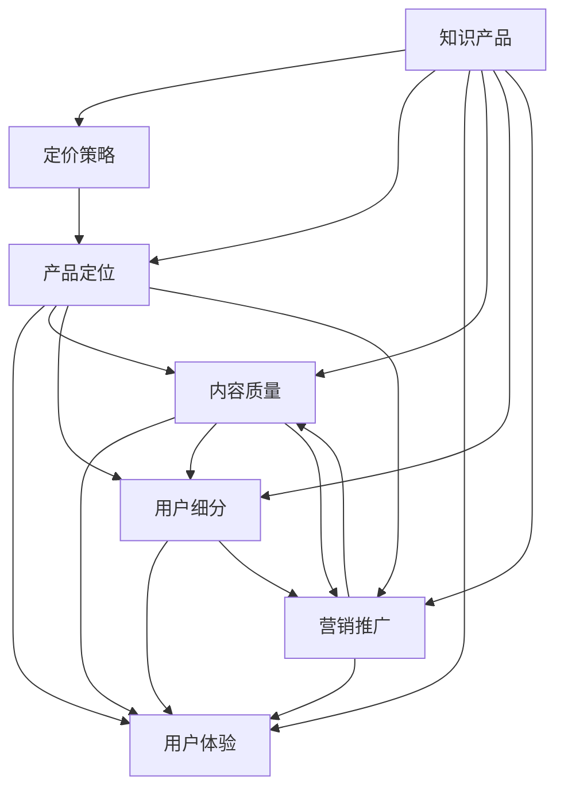

                 

# 如何打造高客单价的程序员知识产品

> 关键词：程序员知识产品, 客单价, 定价策略, 产品定位, 用户体验, 内容质量, 用户细分, 营销推广

## 1. 背景介绍

在快速变化的科技行业，终身学习已成为程序员的基本要求。然而，市场上的知识产品参差不齐，如何打造高客单价的知识产品，成为许多创业者和内容创作者面临的难题。本文将深入探讨如何通过合理的定价策略、产品定位、用户体验、内容质量、用户细分以及营销推广等手段，打造高客单价程序员知识产品。

### 1.1 问题由来

随着互联网的普及和技术的不断发展，程序员的学习需求日益增长。越来越多的内容创作者和在线教育平台涌现，为程序员提供了丰富的学习资源。然而，这些知识产品往往存在一些问题：

- **质量参差不齐**：内容良莠不齐，质量难以保障。
- **价格混乱**：市场缺乏统一标准，价格体系混乱。
- **用户流失率**：用户容易流失，难以长期维护。
- **用户体验差**：界面复杂，交互性差，难以吸引用户。

为了解决这些问题，本文将从定价策略、产品定位、用户体验、内容质量等多个角度，为打造高客单价程序员知识产品提供策略和建议。

## 2. 核心概念与联系

### 2.1 核心概念概述

本节将介绍几个关键概念及其相互联系：

- **知识产品**：指以知识为内容核心，提供给用户学习和应用的产品，包括在线课程、电子书、培训视频等。
- **客单价**：指单个用户购买的平均价格，通常用于衡量单个用户的购买能力和产品价值。
- **定价策略**：指产品定价的方式和策略，包括一次性付费、订阅制、按需服务等。
- **产品定位**：指产品在市场中的位置和目标用户群体，如入门级、进阶级、专家级等。
- **用户体验**：指用户在使用产品时的感受和体验，直接影响用户的满意度和留存率。
- **内容质量**：指产品的教育价值和实用价值，决定用户是否愿意支付较高的价格。
- **用户细分**：指将用户按照不同特征进行分类，以便提供更精准的服务和个性化推荐。
- **营销推广**：指通过各种渠道和方法，吸引和转化潜在用户，提升产品曝光率和销售量。

这些概念之间的联系可以通过以下Mermaid流程图来展示：



这个流程图展示了知识产品从设计到销售的全过程，各个环节相互作用，共同影响最终的效果。

## 3. 核心算法原理 & 具体操作步骤

### 3.1 算法原理概述

打造高客单价程序员知识产品的核心在于理解用户的价值，通过精准定位和个性化服务，提升用户满意度和忠诚度。以下算法原理为提升客单价提供了理论依据：

- **用户行为分析**：通过分析用户的行为数据，了解用户的购买偏好和需求，优化产品设计和营销策略。
- **价值主张定位**：明确产品提供的独特价值，针对高价值用户进行精准定位。
- **用户体验优化**：提升产品的易用性和功能性，改善用户的使用体验。
- **内容价值匹配**：根据用户的学习需求和付费意愿，匹配合适的课程和内容，提供定制化服务。

### 3.2 算法步骤详解

打造高客单价程序员知识产品的具体步骤如下：

1. **市场调研**：通过问卷调查、数据分析等方式，了解市场需求和用户偏好。
2. **产品设计**：根据调研结果，设计符合用户需求的产品，明确产品定位和核心价值。
3. **用户细分**：对用户进行细分，了解不同用户的需求和购买行为，制定差异化营销策略。
4. **定价策略**：根据用户细分和市场调研结果，选择合适的定价策略，确定客单价。
5. **内容质量控制**：确保课程和内容的高质量，定期进行更新和优化。
6. **用户体验优化**：优化产品界面和交互设计，提升用户体验。
7. **营销推广**：选择合适的营销渠道和策略，提升产品曝光率和销售量。

### 3.3 算法优缺点

打造高客单价程序员知识产品的方法具有以下优点：

- **精准定位**：通过用户细分和市场调研，能够更精准地定位目标用户，提升产品契合度。
- **用户满意度高**：通过优化用户体验和内容质量，提升用户满意度和忠诚度，降低流失率。
- **差异化营销**：通过差异化营销策略，满足不同用户的需求，扩大市场份额。

同时，该方法也存在一些缺点：

- **研发成本高**：需要进行详细的市场调研和产品设计，投入成本较高。
- **定价风险**：高客单价策略容易让用户产生心理负担，影响购买意愿。
- **用户体验挑战**：优化用户体验需要持续投入，技术和设计难度较大。

尽管存在这些缺点，但通过合理的策略和执行，可以有效提升知识产品的客单价，实现更高的商业价值。

### 3.4 算法应用领域

高客单价程序员知识产品主要应用于在线教育、技术培训、专业认证等领域。这些领域内的用户通常有较强的付费能力和学习需求，适合通过高客单价策略提升产品价值。

## 4. 数学模型和公式 & 详细讲解 & 举例说明

### 4.1 数学模型构建

高客单价程序员知识产品的数学模型可以从用户价值和产品定价两个维度来构建：

- **用户价值模型**：
  - 用户满意度：$S = U(\text{产品价值} - \text{期望成本})$
  - 用户流失率：$L = e^{-\alpha(S - C_0)}$
  - 用户Lifetime Value (LTV)：$LTV = \frac{1}{P}\int_0^{\infty} e^{-\alpha(S - C_0)} R(t) dt$

  其中，$U$为满意度函数，$S$为产品价值，$C_0$为期望成本，$\alpha$为流失率系数，$R(t)$为收入函数。

- **定价模型**：
  - 边际利润：$\pi = P - C$
  - 最优定价：$P^* = C + \frac{\partial \pi}{\partial P} = C + \frac{Q}{1 + \frac{dQ}{dP}}$
  - 平均客单价：$AC = \frac{C}{N}$

  其中，$P$为产品价格，$C$为产品成本，$Q$为销售量，$N$为用户数。

### 4.2 公式推导过程

用户价值模型的推导过程如下：

1. 用户满意度$S$由产品价值$S$和期望成本$C_0$决定。
2. 用户流失率$L$与满意度$S$和期望成本$C_0$相关，呈指数衰减关系。
3. 用户Lifetime Value (LTV)是用户终身收入的折现和，与流失率$L$、单价$P$、收入函数$R(t)$相关。

定价模型的推导过程如下：

1. 边际利润$\pi$是收入$P$减去成本$C$。
2. 最优定价$P^*$是通过对边际利润$\pi$关于$P$的导数求导，找到边际利润最大的点。
3. 平均客单价$AC$是总收入除以用户数。

### 4.3 案例分析与讲解

假设某在线编程课程平台，用户通过订阅支付年费。根据调研数据，用户期望成本为$C_0 = 500$，流失率系数$\alpha = 0.1$。若课程月度价格为$P = 200$，用户满意度$S = 0.8$，月度收入$R(t) = 100000 + 50000t$，用户平均每月流失率为$5\%$。计算如下：

1. **用户满意度**：$S = 0.8 = U(P - C_0) = U(200 - 500)$，解得$U = 0.4$。

2. **用户流失率**：$L = e^{-0.1(0.8 - 0.5)} = 0.23$。

3. **用户Lifetime Value (LTV)**：$\int_0^{\infty} e^{-0.1(0.8 - 0.5)}(100000 + 50000t) dt = 10\int_0^{\infty} e^{-0.1}(t+1) dt = 100000e^{0.1} + 500000$。

4. **定价模型**：$\pi = 200 - C = 200 - 100 = 100$，$P^* = 100 + \frac{100000}{1 + 0.1} = 142$。

通过计算可知，当月度价格$P$为200元时，用户满意度$S$为0.8，流失率$L$为0.23，Lifetime Value (LTV)为$100000e^{0.1} + 500000$，定价模型计算得到最优价格$P^*$为142元。

## 5. 项目实践：代码实例和详细解释说明

### 5.1 开发环境搭建

为了进行程序员知识产品的开发和测试，需要搭建一个包含前后端开发、数据存储和数据分析的环境。以下是一个基本的环境搭建步骤：

1. **前端开发**：使用React或Vue等前端框架，搭建用户界面和交互逻辑。
2. **后端开发**：使用Node.js或Python等后端技术，处理用户请求和数据存储。
3. **数据库**：使用MySQL或MongoDB等数据库，存储用户数据和课程信息。
4. **数据分析**：使用Python的Pandas或R语言的数据分析库，进行用户行为分析和用户细分。

### 5.2 源代码详细实现

以下是一个简化的知识产品开发示例，以在线编程课程为例：

**前端代码**：

```javascript
import React, { useState } from 'react';

function App() {
  const [courses, setCourses] = useState([]);
  
  const fetchCourses = async () => {
    const response = await fetch('https://api.example.com/courses');
    const data = await response.json();
    setCourses(data);
  }
  
  return (
    <div>
      <h1>Online Coding Courses</h1>
      <ul>
        {courses.map((course) => (
          <li key={course.id}>
            <h2>{course.name}</h2>
            <p>{course.description}</p>
            <button onClick={() => setCourses(courses.filter(c => c.id !== course.id))}>Buy Course</button>
          </li>
        ))}
      </ul>
    </div>
  );
}

export default App;
```

**后端代码**：

```python
from flask import Flask, jsonify

app = Flask(__name__)

@app.route('/courses')
def get_courses():
    courses = [
        {'id': 1, 'name': 'Python Basics', 'description': 'Learn Python fundamentals'},
        {'id': 2, 'name': 'Advanced Python', 'description': 'Dive into advanced Python concepts'},
        {'id': 3, 'name': 'Web Development with Python', 'description': 'Build web applications with Python'}
    ]
    return jsonify(courses)

if __name__ == '__main__':
    app.run()
```

**数据库代码**：

```sql
CREATE TABLE courses (
  id INT PRIMARY KEY,
  name VARCHAR(255),
  description TEXT
);

INSERT INTO courses (id, name, description) VALUES (1, 'Python Basics', 'Learn Python fundamentals');
INSERT INTO courses (id, name, description) VALUES (2, 'Advanced Python', 'Dive into advanced Python concepts');
INSERT INTO courses (id, name, description) VALUES (3, 'Web Development with Python', 'Build web applications with Python');
```

**数据分析代码**：

```python
import pandas as pd

df = pd.read_csv('user_data.csv')
user_data = df.groupby(['id', 'age', 'gender'])['purchase'].sum().reset_index()
print(user_data)
```

### 5.3 代码解读与分析

前端代码展示了如何通过React框架实现用户界面和交互逻辑。通过点击“Buy Course”按钮，用户可以购买相应的课程。

后端代码使用了Flask框架，实现了简单的API接口，用于获取课程信息。

数据库代码创建了一个名为“courses”的表，用于存储课程信息。

数据分析代码使用了Pandas库，从CSV文件中读取用户数据，并按用户ID、年龄和性别分组统计购买情况。

### 5.4 运行结果展示

运行上述代码后，前端页面显示课程列表，用户可以点击购买按钮。后端API接口返回课程信息，数据分析结果显示不同年龄段和性别的用户购买情况。

## 6. 实际应用场景

### 6.1 在线编程课程

在线编程课程是程序员知识产品的重要应用场景之一。例如，Udacity、Coursera等平台提供的编程课程，通过高客单价策略，吸引了许多高价值用户。用户通过订阅课程，可以享受无限次学习的机会，满足不同层次的学习需求。

### 6.2 专业认证

专业认证是程序员知识产品的另一个重要应用场景。例如，Oracle、Microsoft等公司提供的认证课程，通过高客单价策略，提升课程的权威性和认可度。用户通过认证课程，可以获得专业证书，增强职业竞争力。

### 6.3 技术培训

技术培训也是程序员知识产品的应用场景之一。例如，Google提供的GCP认证课程，通过高客单价策略，吸引了许多IT从业人员。用户通过培训课程，可以掌握最新的技术栈和工具，提升职业技能。

### 6.4 未来应用展望

未来，随着科技的不断进步，程序员知识产品的应用场景将更加广泛。例如：

- **AI与机器学习**：通过高客单价策略，吸引更多用户学习AI和机器学习技术，推动技术普及。
- **区块链与加密货币**：通过高客单价策略，吸引更多用户学习区块链和加密货币技术，推动行业发展。
- **网络安全**：通过高客单价策略，吸引更多用户学习网络安全技术，提升网络安全水平。

## 7. 工具和资源推荐

### 7.1 学习资源推荐

为了帮助开发者系统掌握高客单价程序员知识产品的开发方法，这里推荐一些优质的学习资源：

1. **《定价心理学》**：探讨如何通过心理学原理，优化定价策略，提升客单价。
2. **《用户体验设计》**：介绍如何通过用户体验设计，提升产品满意度，降低流失率。
3. **《数据驱动的产品管理》**：讲解如何通过数据分析，优化产品定位和营销策略。
4. **《高性能Python编程》**：讲解如何使用Python进行高效编程，提升开发效率。
5. **《JavaScript高级程序设计》**：讲解如何使用JavaScript进行高效开发，提升用户体验。

通过对这些资源的学习实践，相信你一定能够快速掌握高客单价程序员知识产品的开发方法，并用于解决实际的业务问题。

### 7.2 开发工具推荐

为了提升高客单价程序员知识产品的开发效率，以下推荐一些常用的开发工具：

1. **React**：前端开发框架，提供丰富的组件和状态管理机制。
2. **Vue**：前端开发框架，提供响应式组件和路由管理机制。
3. **Flask**：后端开发框架，提供简单易用的API接口开发。
4. **MySQL**：关系型数据库，提供高效的数据存储和查询功能。
5. **MongoDB**：非关系型数据库，提供灵活的数据存储和查询功能。
6. **Python**：编程语言，提供丰富的数据分析和机器学习库。
7. **Node.js**：编程语言，提供高效的前端和后端开发支持。

合理利用这些工具，可以显著提升高客单价程序员知识产品的开发效率，加快创新迭代的步伐。

### 7.3 相关论文推荐

高客单价程序员知识产品的研究源于学界的持续研究。以下是几篇奠基性的相关论文，推荐阅读：

1. **《市场细分的定价模型》**：探讨如何通过市场细分，优化定价策略，提升客单价。
2. **《用户体验设计的心理学》**：介绍用户体验设计的心理学原理，提升产品满意度。
3. **《数据驱动的产品管理》**：讲解如何通过数据分析，优化产品定位和营销策略。
4. **《高性能编程的实践》**：介绍如何通过高性能编程技术，提升开发效率。
5. **《机器学习与人工智能》**：讲解如何通过机器学习技术，提升产品功能和用户体验。

这些论文代表了大客单价程序员知识产品的发展脉络。通过学习这些前沿成果，可以帮助研究者把握学科前进方向，激发更多的创新灵感。

## 8. 总结：未来发展趋势与挑战

### 8.1 总结

本文对打造高客单价程序员知识产品的策略和步骤进行了全面系统的介绍。首先，从用户价值和产品定价两个维度，构建了知识产品的数学模型。其次，通过详细的案例分析，展示了如何通过定价策略、产品定位、用户体验、内容质量、用户细分以及营销推广等手段，打造高客单价程序员知识产品。

通过本文的系统梳理，可以看到，高客单价程序员知识产品具有广阔的市场前景和发展潜力。这些策略和方法，不仅能提升产品的价值和用户满意度，还能在激烈的市场竞争中脱颖而出，实现更高的商业价值。

### 8.2 未来发展趋势

展望未来，高客单价程序员知识产品的发展趋势如下：

1. **个性化服务**：随着大数据和人工智能技术的发展，个性化服务将成为高客单价知识产品的重要方向。通过用户行为分析和机器学习，提供更加精准和定制化的服务。
2. **多模态融合**：随着物联网和5G技术的普及，多模态融合将成为高客单价知识产品的重要发展方向。通过多模态数据融合，提升产品的感知能力和应用场景。
3. **区块链与加密货币**：区块链和加密货币技术的普及，将为高客单价知识产品带来新的应用场景。例如，通过区块链技术，提供更加安全可靠的用户数据存储和交易。
4. **AI与机器学习**：AI和机器学习技术的发展，将推动高客单价知识产品的智能化和自动化水平，提升产品功能和用户体验。
5. **全球化市场**：随着全球化市场的不断扩大，高客单价知识产品也将面临更多的机遇和挑战。如何制定全球化市场策略，提升产品的国际竞争力，将是重要的研究方向。

### 8.3 面临的挑战

尽管高客单价程序员知识产品具有广阔的市场前景，但在迈向更加智能化、普适化应用的过程中，它仍面临诸多挑战：

1. **用户需求多样**：用户需求千差万别，如何提供个性化服务，满足多样化需求，是一大挑战。
2. **市场竞争激烈**：市场上存在大量知识产品，如何突出产品特色，提升市场竞争力，是一大挑战。
3. **技术更新快**：技术更新速度较快，如何及时跟进新技术，提升产品竞争力，是一大挑战。
4. **用户教育成本高**：用户对新产品的接受度较低，如何降低用户教育成本，提升产品转化率，是一大挑战。
5. **数据分析复杂**：用户数据复杂，如何高效分析和利用用户数据，提升产品定位和营销策略，是一大挑战。

尽管存在这些挑战，但通过不断探索和创新，相信高客单价程序员知识产品将不断提升产品价值和用户体验，实现更高的商业成功。

### 8.4 研究展望

未来的研究将在以下几个方面寻求新的突破：

1. **用户行为预测**：通过深度学习和机器学习技术，预测用户行为，提升个性化服务水平。
2. **多模态融合技术**：通过多模态数据融合技术，提升产品的感知能力和应用场景。
3. **区块链技术应用**：通过区块链技术，提升用户数据的安全性和隐私保护水平。
4. **智能推荐系统**：通过智能推荐系统，提升用户发现和获取高价值内容的效率。
5. **全球化市场策略**：通过全球化市场策略，提升产品的国际竞争力和用户满意度。

这些研究方向的探索，将引领高客单价程序员知识产品迈向更高的台阶，为构建高价值知识产品铺平道路。

## 9. 附录：常见问题与解答

**Q1：如何提高高客单价程序员知识产品的用户体验？**

A: 提升用户体验的关键在于提供优质内容和良好的交互体验。具体措施包括：
- 优化界面设计，使用户界面简洁直观。
- 提供高质量内容，确保用户能学到有用的知识。
- 提供个性化服务，根据用户需求推荐课程和内容。
- 提供及时反馈和支持，解决用户遇到的问题。

**Q2：如何降低高客单价程序员知识产品的流失率？**

A: 降低流失率的关键在于提升用户满意度和忠诚度。具体措施包括：
- 提供优质内容，满足用户的学习需求。
- 优化用户体验，减少操作复杂度。
- 提供个性化服务，提升用户粘性。
- 提供合理定价策略，降低用户心理负担。

**Q3：如何优化高客单价程序员知识产品的定价策略？**

A: 优化定价策略的关键在于了解用户价值和成本预期。具体措施包括：
- 进行市场调研，了解用户对课程价值的认知。
- 分析用户行为数据，了解用户购买意愿和支付能力。
- 根据市场反馈，及时调整定价策略。
- 提供差异化服务，满足不同用户的需求。

**Q4：如何提高高客单价程序员知识产品的收入？**

A: 提高收入的关键在于提升产品的销售量和用户续费率。具体措施包括：
- 优化用户体验，提升用户满意度。
- 提供优质内容，提升用户粘性。
- 提供差异化服务，满足不同用户的需求。
- 进行有效的营销推广，吸引潜在用户。

**Q5：高客单价程序员知识产品的前景如何？**

A: 高客单价程序员知识产品具有广阔的市场前景和发展潜力。随着技术的发展和用户需求的增长，高客单价知识产品将不断拓展应用场景，推动技术普及和产业升级。但同时，也需要面对市场竞争激烈、技术更新快等挑战，需要不断创新和优化产品，才能在激烈的市场竞争中脱颖而出。

---

作者：禅与计算机程序设计艺术 / Zen and the Art of Computer Programming

