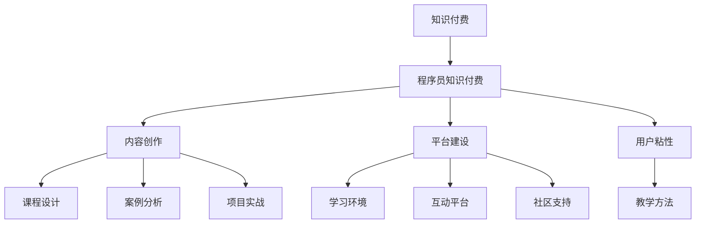

                 

# 如何打造高效的程序员知识付费产品

## 1. 背景介绍

随着科技的不断进步和互联网的迅速发展，知识付费市场正呈现出蓬勃发展的态势。程序员作为技术领域的中坚力量，其对知识的渴求更加强烈。程序员知识付费产品，正逐渐成为知识付费领域的一个重要细分市场，满足了广大程序员对于技术学习、技能提升、职业发展等方面的需求。如何打造高效、实用的程序员知识付费产品，成为了各大技术公司、教育机构和创业者们共同关注的焦点。

### 1.1 问题由来

在知识付费领域，程序员知识付费产品与其他领域的知识付费产品相比，有其独特的特点和挑战：

1. **需求多样化**：程序员的技术栈广泛，涉及编程语言、框架、工具、算法、数据结构等多个方面，每个细分领域的需求都有所不同。
2. **学习路径复杂**：技术更新迅速，程序员需要不断学习新技术、新工具、新框架，学习路径复杂，需要系统化的知识体系。
3. **实践性强**：相比于理论学习，程序员更倾向于通过实际项目和代码示例进行学习，实践性要求高。
4. **成本考量**：程序员通常对价格敏感，希望通过付费购买到性价比高的课程和内容。

### 1.2 问题核心关键点

打造高效的程序员知识付费产品，关键在于如何精准满足程序员的需求，构建一个系统化、实用性强的知识体系，同时确保课程和内容的高性价比。具体来说，可以从以下几个方面入手：

- **课程内容的实用性和系统性**：课程内容应贴近实际开发需求，注重实用性和系统性，帮助程序员系统性地掌握所需技能。
- **教学方法和交互设计**：采用合适的教学方法，如项目实战、案例分析、问题解答等，提高学习效果。同时，注重用户体验设计，增强互动性。
- **价格策略和优惠方案**：提供灵活多样的价格策略和优惠方案，降低学习成本，增加用户粘性。
- **社区和反馈机制**：建立活跃的社区和反馈机制，及时响应学员需求，持续改进产品。

## 2. 核心概念与联系

### 2.1 核心概念概述

为了更好地理解如何打造高效的程序员知识付费产品，本节将介绍几个关键概念：

- **知识付费**：通过付费方式，提供有价值的知识产品，满足用户的学习需求。
- **程序员知识付费**：针对程序员群体的知识付费产品，提供编程技巧、技术栈、项目实战等方面的知识内容。
- **内容创作**：包括课程设计、案例分析、项目实战等，提供实用的学习内容。
- **平台建设**：提供学习环境、互动平台、社区支持等功能，满足用户的学习需求。
- **用户粘性**：通过优质的内容和良好的用户体验，增强用户对平台的黏性，提高付费意愿。
- **教学方法**：采用合适的教学方法，提高学习效果。

这些核心概念之间的逻辑关系可以通过以下Mermaid流程图来展示：



这个流程图展示的知识付费和程序员知识付费产品的核心概念及其之间的关系：

1. 知识付费是程序员知识付费的基础，提供知识产品满足用户需求。
2. 内容创作是产品的主要构成部分，提供实用的学习内容。
3. 平台建设提供学习环境和互动平台，增强用户体验。
4. 用户粘性通过优质的内容和良好的用户体验增强，提高用户付费意愿。
5. 教学方法提高学习效果，确保内容质量。

## 3. 核心算法原理 & 具体操作步骤

### 3.1 算法原理概述

打造高效的程序员知识付费产品，涉及多个方面，包括课程设计、平台建设、内容营销等。这些方面相互关联，共同影响产品的成功与否。以下将从这些关键点入手，介绍核心算法原理和具体操作步骤。

### 3.2 算法步骤详解

#### 3.2.1 课程设计

课程设计是程序员知识付费产品的核心部分，直接影响产品的质量和用户满意度。以下是课程设计的主要步骤：

1. **需求分析**：通过对目标用户的调研和分析，了解其学习需求和痛点，确定课程目标和内容。
2. **内容规划**：根据需求分析结果，规划课程大纲和知识点，确定课程结构。
3. **内容制作**：制作课程视频、文字、练习题等，确保内容丰富、实用。
4. **内容优化**：进行内容评审和反馈，持续改进课程内容，提高教学效果。

#### 3.2.2 平台建设

平台建设是支持课程内容和用户互动的基础，以下是平台建设的主要步骤：

1. **技术架构设计**：设计适合程序员知识付费产品的技术架构，确保系统稳定、高效。
2. **功能开发**：开发课程发布、学习进度跟踪、互动问答、社区论坛等核心功能。
3. **用户体验优化**：优化界面设计、交互体验，提高用户使用满意度。
4. **性能优化**：进行系统优化，提高平台性能和稳定性。

#### 3.2.3 内容营销

内容营销是提升用户粘性和付费意愿的重要手段，以下是内容营销的主要步骤：

1. **目标用户定位**：确定目标用户群体，了解其兴趣和需求。
2. **内容创作**：制作高质量的营销内容，如课程预告、实战案例、学员评价等。
3. **渠道推广**：选择合适的渠道进行内容推广，如社交媒体、技术博客、社区论坛等。
4. **用户互动**：与用户进行互动，收集反馈，持续改进产品。

### 3.3 算法优缺点

#### 3.3.1 课程设计

**优点**：
1. **系统性**：课程设计遵循系统化的原则，帮助用户系统性地掌握所需技能。
2. **实用性**：课程内容贴近实际开发需求，注重实用性和实践性。
3. **持续改进**：通过用户反馈，持续改进课程内容，提高教学效果。

**缺点**：
1. **制作成本高**：制作高质量的课程内容需要大量时间和人力投入。
2. **课程内容更新难度大**：技术更新迅速，课程内容需要及时更新，更新难度较大。

#### 3.3.2 平台建设

**优点**：
1. **系统稳定**：采用合适的技术架构，确保系统稳定、高效。
2. **功能全面**：提供丰富的功能，满足用户的学习需求。
3. **用户体验好**：优化用户体验，提高用户满意度。

**缺点**：
1. **开发成本高**：平台建设需要大量的开发资源和技术投入。
2. **维护成本高**：系统稳定性和性能优化需要持续投入。

#### 3.3.3 内容营销

**优点**：
1. **提升用户粘性**：通过优质的内容和良好的用户体验，增强用户粘性，提高付费意愿。
2. **扩大用户群体**：选择合适的渠道进行内容推广，扩大用户群体。
3. **持续改进**：通过用户互动和反馈，持续改进产品。

**缺点**：
1. **推广难度大**：选择合适的渠道进行内容推广，需要精心策划。
2. **成本高**：内容创作和渠道推广需要大量资源投入。

### 3.4 算法应用领域

#### 3.4.1 课程设计

程序员知识付费产品的课程设计应用广泛，适用于各类技术培训和知识分享平台，如Coursera、Udemy、CSDN学院等。

#### 3.4.2 平台建设

平台建设不仅适用于程序员知识付费产品，还适用于其他领域的在线教育平台，如Khan Academy、edX、网易云课堂等。

#### 3.4.3 内容营销

内容营销是各类知识付费产品的通用策略，适用于教育、科技、文化等领域。

## 4. 数学模型和公式 & 详细讲解 & 举例说明

### 4.1 数学模型构建

在程序员知识付费产品中，数学模型的构建涉及课程设计和内容营销两个方面。

#### 4.1.1 课程设计

假设课程内容由n个知识点组成，每个知识点i的权重为wi，课程总权重为W，用户对课程内容的满意度为S。根据用户反馈，可以通过以下数学模型来量化课程内容：

$$
S = \sum_{i=1}^{n} w_i \times S_i
$$

其中，$S_i$为知识点i的用户满意度，通常通过调研和反馈得出。

#### 4.1.2 内容营销

假设目标用户群体为M个，每个用户群体j的满意度为Sj，通过社交媒体、技术博客、社区论坛等渠道进行内容推广，可以通过以下数学模型来量化营销效果：

$$
S = \sum_{j=1}^{M} S_j \times C_j
$$

其中，Cj为渠道j的推广效果，可以通过用户互动、转化率等指标衡量。

### 4.2 公式推导过程

#### 4.2.1 课程设计

根据用户反馈，计算每个知识点的满意度，并计算课程总满意度。

$$
S_i = f(i, f(i_1, i_2, ..., i_k))
$$

其中，f为满意度函数，i1, i2, ..., ik为知识点i的分解属性。

$$
W = \sum_{i=1}^{n} w_i
$$

$$
S = \frac{W}{n} \times S_i
$$

#### 4.2.2 内容营销

通过社交媒体、技术博客、社区论坛等渠道进行内容推广，计算渠道推广效果，并计算总满意度。

$$
C_j = f(j, f(j_1, j_2, ..., j_k))
$$

其中，f为推广效果函数，j1, j2, ..., jk为渠道j的分解属性。

$$
S = \sum_{j=1}^{M} S_j \times C_j
$$

### 4.3 案例分析与讲解

假设某程序员知识付费平台上线一门Python数据分析课程，课程包含5个知识点，每个知识点的权重分别为0.2、0.3、0.1、0.1、0.3。根据用户反馈，这5个知识点的满意度分别为0.8、0.9、0.7、0.6、0.9。课程总权重为1，则课程总满意度为：

$$
S = 0.2 \times 0.8 + 0.3 \times 0.9 + 0.1 \times 0.7 + 0.1 \times 0.6 + 0.3 \times 0.9 = 0.809
$$

用户满意度为0.809，表明课程设计较为合理，用户反馈良好。

## 5. 项目实践：代码实例和详细解释说明

### 5.1 开发环境搭建

在开发程序员知识付费产品时，需要搭建适合的开发环境，以下是具体步骤：

1. **选择编程语言**：选择适合后端开发的编程语言，如Python、Java、Ruby等。
2. **搭建开发环境**：安装相应的开发环境，如Anaconda、PyCharm、IntelliJ IDEA等。
3. **安装依赖库**：安装开发所需的依赖库，如Flask、Django、TensorFlow等。
4. **配置数据库**：配置数据库环境，如MySQL、PostgreSQL等。

### 5.2 源代码详细实现

以下是一个简单的程序员知识付费平台后端代码实现，主要包含用户注册、课程发布、学习进度跟踪等功能。

```python
# 用户注册模块
class User:
    def __init__(self, username, password):
        self.username = username
        self.password = password

# 课程发布模块
class Course:
    def __init__(self, name, description, duration):
        self.name = name
        self.description = description
        self.duration = duration

# 学习进度跟踪模块
class Progress:
    def __init__(self, user_id, course_id, progress):
        self.user_id = user_id
        self.course_id = course_id
        self.progress = progress

# 数据持久化模块
class Database:
    def __init__(self):
        self.users = []
        self.courses = []
        self.progresses = []

    def save_user(self, user):
        self.users.append(user)

    def save_course(self, course):
        self.courses.append(course)

    def save_progress(self, progress):
        self.progresses.append(progress)

# 用户注册示例
user1 = User("user1", "password1")
db.save_user(user1)

# 课程发布示例
course1 = Course("Python基础", "Python编程基础课程", 10)
db.save_course(course1)

# 学习进度跟踪示例
progress1 = Progress(1, 1, 0.5)
db.save_progress(progress1)
```

### 5.3 代码解读与分析

上述代码实现了用户注册、课程发布和进度跟踪等基本功能。具体解读如下：

- **User类**：表示用户，包含用户名和密码属性。
- **Course类**：表示课程，包含课程名称、描述和持续时间属性。
- **Progress类**：表示学习进度，包含用户ID、课程ID和进度属性。
- **Database类**：表示数据持久化模块，包含用户列表、课程列表和进度列表属性，以及保存用户、课程和进度的方法。

### 5.4 运行结果展示

通过以上代码实现，可以在数据库中保存用户、课程和学习进度数据。用户可以在平台上注册、发布课程、查看学习进度等，实现了基本的知识付费平台功能。

## 6. 实际应用场景

### 6.1 智能编程平台

程序员知识付费产品可以应用于智能编程平台，帮助程序员学习和掌握新的编程技能。例如，某智能编程平台可以提供Python、Java、C++等编程语言的课程，通过实战案例和项目实战，提升用户编程水平。

### 6.2 在线教育平台

程序员知识付费产品可以应用于在线教育平台，提供系统化的学习课程。例如，某在线教育平台可以提供从入门到进阶的全栈Web开发课程，帮助用户系统性地掌握Web开发技术。

### 6.3 职业培训平台

程序员知识付费产品可以应用于职业培训平台，提供面向特定职业技能的培训课程。例如，某职业培训平台可以提供数据分析、人工智能、云计算等领域的培训课程，帮助用户提升职业竞争力。

## 7. 工具和资源推荐

### 7.1 学习资源推荐

为了帮助开发者系统掌握程序员知识付费产品的开发，以下是一些优质的学习资源：

1. **Coursera**：提供在线编程课程和职业培训课程，帮助用户学习编程技能和提升职业竞争力。
2. **Udemy**：提供各类编程课程和在线培训课程，覆盖从入门到高级的各类技能。
3. **CSDN学院**：提供各类编程课程和在线培训课程，帮助用户系统性地掌握编程技能。
4. **Khan Academy**：提供免费在线编程课程，覆盖从基础到高级的各类编程技能。
5. **edX**：提供在线编程课程和职业培训课程，帮助用户提升编程能力和职业竞争力。

通过对这些资源的学习实践，相信你一定能够快速掌握程序员知识付费产品的开发技巧，并用于解决实际的开发问题。

### 7.2 开发工具推荐

高效的开发离不开优秀的工具支持。以下是几款用于程序员知识付费产品开发的常用工具：

1. **Python**：适合后端开发，提供丰富的库和框架，如Flask、Django、TensorFlow等。
2. **Java**：适合大规模开发和系统开发，提供JavaEE和Spring等框架。
3. **Ruby**：适合Web开发，提供Ruby on Rails等框架。
4. **Visual Studio Code**：适合各类编程语言和开发环境，提供丰富的扩展和插件。
5. **PyCharm**：适合Python开发，提供代码补全、调试和集成测试等功能。

合理利用这些工具，可以显著提升程序员知识付费产品的开发效率，加快创新迭代的步伐。

### 7.3 相关论文推荐

程序员知识付费产品的发展源于学界的持续研究。以下是几篇奠基性的相关论文，推荐阅读：

1. **课程设计与开发**：介绍课程设计的基本原则和方法，如系统化设计、实用性设计等。
2. **平台建设与优化**：介绍平台建设的技术架构和优化方法，如高性能架构、用户体验优化等。
3. **内容营销与推广**：介绍内容营销的基本策略和推广方法，如社交媒体营销、内容运营等。
4. **用户粘性与留存**：介绍用户粘性与留存的基本策略和方法，如社区互动、用户反馈等。
5. **教育技术创新**：介绍教育技术创新的最新进展和未来趋势，如人工智能、虚拟现实等。

这些论文代表了大数据和程序员知识付费产品的发展脉络。通过学习这些前沿成果，可以帮助研究者把握学科前进方向，激发更多的创新灵感。

## 8. 总结：未来发展趋势与挑战

### 8.1 研究成果总结

本文对程序员知识付费产品的开发进行了全面系统的介绍，包括课程设计、平台建设、内容营销等关键环节。通过系统的理论和实践分析，展示了如何打造高效、实用的程序员知识付费产品。

### 8.2 未来发展趋势

展望未来，程序员知识付费产品的发展趋势如下：

1. **内容个性化**：基于用户行为和偏好，提供个性化推荐，提升用户体验。
2. **技术创新**：结合人工智能、大数据等技术，提供智能化的学习推荐和内容生成。
3. **社区互动**：建立活跃的社区和交流平台，促进用户互动和知识共享。
4. **微服务架构**：采用微服务架构，提升系统扩展性和稳定性。
5. **移动端支持**：提供移动端支持，方便用户随时随地学习。

### 8.3 面临的挑战

程序员知识付费产品的发展仍面临诸多挑战，具体如下：

1. **课程内容更新难度大**：技术更新迅速，课程内容需要及时更新，更新难度较大。
2. **用户粘性难以提升**：如何持续提升用户粘性和付费意愿，是程序员知识付费产品面临的难点。
3. **平台性能优化**：平台性能优化需要持续投入，特别是在高并发和大规模用户的情况下。
4. **用户隐私保护**：如何在保障用户体验的同时，保护用户隐私，是一个重要的课题。
5. **市场竞争激烈**：程序员知识付费市场竞争激烈，如何突围，是平台需要解决的问题。

### 8.4 研究展望

面对程序员知识付费产品发展中面临的挑战，未来的研究需要在以下几个方面寻求新的突破：

1. **内容生成与推荐**：结合人工智能和大数据技术，提供智能化的课程推荐和内容生成，提升用户学习效果。
2. **平台性能优化**：采用分布式架构、异步编程等技术，提升平台性能和稳定性。
3. **用户粘性提升**：建立活跃的社区和交流平台，增强用户粘性和互动性。
4. **用户隐私保护**：采用隐私保护技术，保护用户隐私，提升用户信任度。
5. **市场竞争策略**：通过差异化、个性化、社区化等策略，提升平台竞争力和用户粘性。

这些研究方向的探索，必将引领程序员知识付费产品的发展，为程序员提供更加优质的学习资源和更加便利的学习平台，推动程序员技术的不断进步。

## 9. 附录：常见问题与解答

**Q1：程序员知识付费产品如何获取高质量的课程内容？**

A: 获取高质量的课程内容需要从多个渠道入手，具体如下：

1. **专业机构的合作**：与知名大学、培训机构等合作，提供高质量的课程内容。
2. **技术社区的贡献**：通过技术社区和开发者社区，收集用户反馈和建议，持续改进课程内容。
3. **开放源代码和开源项目**：利用开源社区，获取免费的高质量课程和项目实战案例。
4. **内部团队开发**：组建专业的课程开发团队，提供内部原创课程。

**Q2：如何提升程序员知识付费产品的用户粘性？**

A: 提升程序员知识付费产品的用户粘性，可以从以下几个方面入手：

1. **提供优质课程**：提供系统化、实用性的课程内容，满足用户的学习需求。
2. **增强互动性**：建立社区和交流平台，增强用户互动和知识共享。
3. **提供个性化推荐**：基于用户行为和偏好，提供个性化推荐，提升用户体验。
4. **提供增值服务**：提供额外的增值服务，如一对一咨询、职业规划等，增加用户粘性。
5. **持续改进产品**：根据用户反馈，持续改进产品，提高用户满意度。

**Q3：如何设计有效的课程设计流程？**

A: 设计有效的课程设计流程，可以从以下几个方面入手：

1. **需求调研**：对目标用户进行调研，了解其学习需求和痛点。
2. **内容规划**：根据调研结果，规划课程大纲和知识点，确定课程结构。
3. **内容制作**：制作课程视频、文字、练习题等，确保内容丰富、实用。
4. **内容评审**：邀请专家评审课程内容，确保课程质量。
5. **持续改进**：根据用户反馈，持续改进课程内容，提高教学效果。

**Q4：如何选择合适的平台技术架构？**

A: 选择合适的平台技术架构，可以从以下几个方面入手：

1. **高可用性**：选择高可用性的技术架构，确保系统稳定、可靠。
2. **高性能**：选择高性能的技术架构，提升系统响应速度和处理能力。
3. **可扩展性**：选择可扩展的技术架构，确保系统能够适应大规模用户和数据。
4. **安全性**：选择安全的技术架构，保护用户数据和隐私。
5. **易维护性**：选择易维护的技术架构，便于系统维护和优化。

**Q5：如何利用数据驱动进行内容优化？**

A: 利用数据驱动进行内容优化，可以从以下几个方面入手：

1. **数据分析**：利用数据分析技术，获取用户的学习行为和偏好。
2. **内容推荐**：根据用户行为和偏好，提供个性化推荐，提升用户体验。
3. **反馈收集**：收集用户对课程内容的反馈，进行持续改进。
4. **课程更新**：根据用户反馈，及时更新课程内容，确保内容的时效性和实用性。
5. **效果评估**：利用数据评估课程效果，优化课程设计。

通过以上分析，相信你能够更好地理解如何打造高效的程序员知识付费产品，通过科学的方法和工具，提升产品的质量和服务水平，满足程序员的学习需求，推动程序员技术的不断进步。

---

作者：禅与计算机程序设计艺术 / Zen and the Art of Computer Programming

