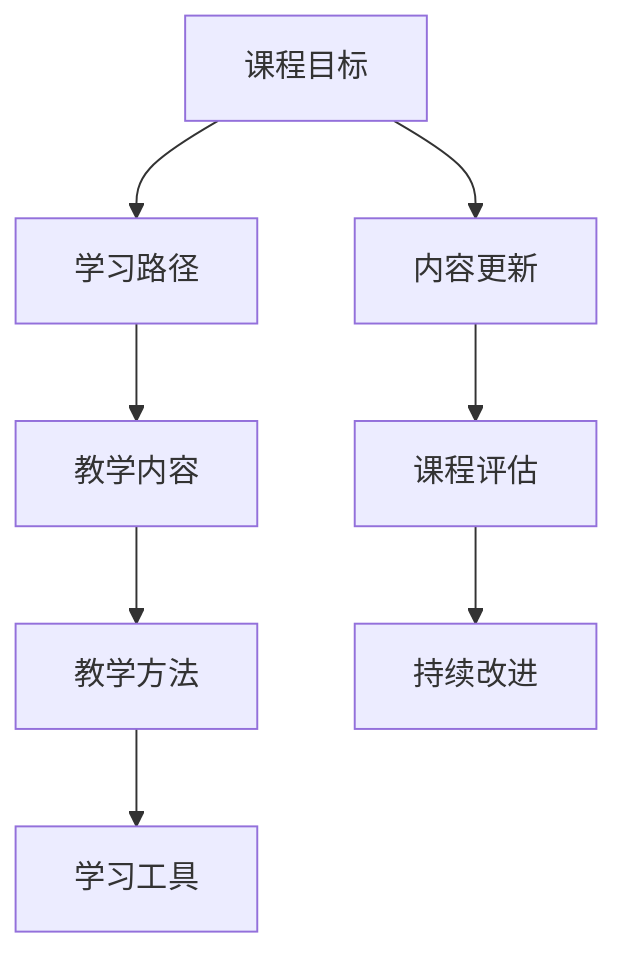

                 

# 如何设计吸引人的知识付费课程大纲

> 关键词：知识付费课程,课程大纲,学习路径,教学内容,学生需求,教学方法,学习工具,资源整合

## 1. 背景介绍

在当前数字化教育的大背景下，知识付费课程逐渐成为了一种主流学习方式。优质的知识付费课程能够帮助用户高效学习，快速提升技能，实现职业发展和个人成长。如何设计一个有吸引力、有价值、有影响力的知识付费课程，成为课程开发者面临的重要课题。

### 1.1 问题由来

随着知识付费平台的兴起，越来越多的课程开发者开始尝试通过知识付费课程来传播专业知识。然而，许多课程在发布后并没有达到预期的效果，往往因为课程内容枯燥、结构不合理、学习方法单一等原因被用户忽视。因此，设计一个优秀的知识付费课程大纲，成为了课程开发者亟需解决的问题。

### 1.2 问题核心关键点

设计优秀的知识付费课程大纲，核心在于以下几个关键点：

1. **用户需求**：了解目标用户的学习背景、知识储备和技能水平，设定合理的课程目标。
2. **课程结构**：设计逻辑清晰、层次分明的课程结构，确保内容连贯、条理清晰。
3. **教学方法**：采用多样化的教学方法，提高课程互动性和趣味性。
4. **学习工具**：提供丰富的学习工具和资源，提升用户体验。
5. **内容更新**：持续更新课程内容，确保信息的时效性和相关性。

## 2. 核心概念与联系

### 2.1 核心概念概述

为更好地理解如何设计吸引人的知识付费课程大纲，本节将介绍几个密切相关的核心概念：

- **知识付费课程**：通过互联网平台销售的付费课程，旨在帮助用户系统化地学习特定领域的知识和技能。
- **课程大纲**：课程开发者根据教学目标和内容规划的课程框架，包括课程目标、学习路径、教学内容、教学方法等。
- **学习路径**：根据用户的学习目标和能力，规划逐步提升的学习路径，确保用户能够循序渐进地掌握知识。
- **教学内容**：课程的核心部分，包括理论知识、实践技能、项目案例等。
- **教学方法**：多样的教学手段，如视频讲解、互动问答、项目实战等，提升学习效果。
- **学习工具**：辅助学习的工具和资源，如在线学习平台、学习管理系统、编程环境等。

这些核心概念之间存在紧密联系，共同构成了知识付费课程大纲的设计基础。

### 2.2 核心概念原理和架构的 Mermaid 流程图(Mermaid 流程节点中不要有括号、逗号等特殊字符)



这个流程图展示了大纲设计的关键环节及其之间的关系：

1. 根据课程目标，设计逻辑清晰的学习路径。
2. 根据学习路径，规划详细的教学内容。
3. 采用多样的教学方法，提升学习效果。
4. 提供丰富的学习工具和资源。
5. 持续更新课程内容，确保时效性。
6. 通过课程评估和反馈，进行持续改进。

## 3. 核心算法原理 & 具体操作步骤
### 3.1 算法原理概述

设计知识付费课程大纲，本质上是一个课程规划和设计过程。其核心思想是：根据目标用户的学习需求和路径，合理规划教学内容和方法，选择合适的学习工具，确保课程内容的科学性和实用性。

形式化地，假设目标用户集合为 $U$，课程内容集合为 $C$，教学方法集合为 $M$，学习工具集合为 $T$，课程目标为 $G$。课程大纲设计过程可以表示为：

$$
\text{大纲} = \mathop{\arg\min}_{C, M, T} \sum_{u \in U} \sum_{c \in C} \sum_{m \in M} \sum_{t \in T} \text{cost}(u, c, m, t)
$$

其中，$\text{cost}$ 为评估函数，用于衡量课程对目标用户的学习成本和效果。

### 3.2 算法步骤详解

设计知识付费课程大纲，一般包括以下几个关键步骤：

**Step 1: 确定课程目标**

- 明确课程的核心教学目标，如提高编程能力、掌握数据分析技能、掌握商业管理知识等。
- 根据目标用户的学习背景和需求，设定合理的学习目标。

**Step 2: 分析用户需求**

- 通过问卷调查、用户访谈等方式，深入了解目标用户的学习背景、知识储备和技能水平。
- 分析用户的学习动机、期望和痛点，确定课程内容的主题和深度。

**Step 3: 设计学习路径**

- 根据用户的学习目标和能力，设计逐步提升的学习路径。
- 将学习路径划分为多个阶段，每个阶段设定明确的学习目标和所需掌握的知识技能。

**Step 4: 规划教学内容**

- 根据学习路径，规划详细的教学内容，包括理论知识、实践技能、项目案例等。
- 确保教学内容连贯、条理清晰，避免知识点重复或遗漏。

**Step 5: 选择教学方法**

- 根据教学内容和学习目标，选择适合的教学方法，如视频讲解、互动问答、项目实战等。
- 采用多样化的教学手段，提升课程互动性和趣味性。

**Step 6: 提供学习工具**

- 根据教学需要，提供丰富的学习工具和资源，如在线学习平台、学习管理系统、编程环境等。
- 确保学习工具易于使用，提升用户体验。

**Step 7: 持续更新内容**

- 根据技术发展和用户反馈，持续更新课程内容，确保信息的时效性和相关性。
- 定期发布课程更新日志，告知用户课程改进和新内容发布。

**Step 8: 评估课程效果**

- 通过课程评估和用户反馈，评估课程效果和用户满意度。
- 根据评估结果，进行课程改进和优化。

**Step 9: 持续改进课程**

- 根据课程评估结果和用户反馈，持续改进课程内容和教学方法。
- 定期收集用户需求，调整课程大纲和教学内容。

通过以上步骤，可以设计出既有深度又有广度的知识付费课程大纲，帮助用户高效学习，快速提升技能。

### 3.3 算法优缺点

设计知识付费课程大纲的方法具有以下优点：

1. **系统化学习**：通过科学合理的课程规划，帮助用户系统化地掌握知识，避免学习断层和知识碎片化。
2. **高效学习**：通过多样化的教学方法和丰富的学习工具，提升学习效率和效果。
3. **用户导向**：根据用户需求和学习路径设计课程内容，确保课程的实用性和针对性。

然而，该方法也存在以下局限性：

1. **设计复杂**：课程大纲设计需要考虑多方面因素，包括用户需求、内容深度、教学方法等，设计复杂度较高。
2. **资源需求高**：设计和实施课程大纲需要投入大量时间和资源，特别是高质量的教学内容和学习工具。
3. **课程更新频繁**：由于技术发展和用户需求的变化，课程内容需要不断更新和调整，维护成本较高。

尽管存在这些局限性，但就目前而言，科学合理的课程大纲设计仍是知识付费课程开发的重要基础，能够显著提升课程的吸引力和用户满意度。

### 3.4 算法应用领域

知识付费课程大纲设计方法，广泛应用于各类知识付费平台的课程开发，包括但不限于以下领域：

1. **IT与编程**：如Python编程、数据科学、人工智能等课程。
2. **商业与管理**：如市场营销、财务管理、人力资源管理等课程。
3. **设计与创意**：如平面设计、UI/UX设计、广告创意等课程。
4. **健康与健身**：如营养学、心理学、运动健身等课程。
5. **语言与文化**：如英语学习、中文读写、世界文化等课程。

这些领域涵盖了用户需求广泛，课程大纲设计方法可以有效提升课程质量和用户体验。

## 4. 数学模型和公式 & 详细讲解 & 举例说明

### 4.1 数学模型构建

为了更好地理解如何设计知识付费课程大纲，本节将使用数学语言对课程大纲设计过程进行更加严格的刻画。

假设目标用户集合为 $U=\{u_1, u_2, \ldots, u_n\}$，课程内容集合为 $C=\{c_1, c_2, \ldots, c_m\}$，教学方法集合为 $M=\{m_1, m_2, \ldots, m_k\}$，学习工具集合为 $T=\{t_1, t_2, \ldots, t_l\}$，课程目标为 $G$。课程大纲设计过程可以表示为：

$$
\text{大纲} = \mathop{\arg\min}_{C, M, T} \sum_{u \in U} \sum_{c \in C} \sum_{m \in M} \sum_{t \in T} \text{cost}(u, c, m, t)
$$

其中，$\text{cost}$ 为评估函数，用于衡量课程对目标用户的学习成本和效果。可以进一步定义为：

$$
\text{cost}(u, c, m, t) = w_u \cdot (1 - \text{learn}(u, c)) + w_c \cdot (1 - \text{relevant}(c, m, t)) + w_m \cdot (1 - \text{engage}(m)) + w_t \cdot (1 - \text{use}(t))
$$

其中，$w_u, w_c, w_m, w_t$ 为权重，分别表示用户学习成本、课程内容相关性、教学方法互动性和学习工具实用性的重要性。

### 4.2 公式推导过程

以下我们以IT与编程课程为例，推导课程大纲设计公式及其评估函数的计算方法。

假设目标用户 $u$ 的学习目标为掌握Python编程技能，课程内容 $c$ 包括Python基础、数据结构、算法设计等。教学方法 $m$ 包括视频讲解、互动问答、项目实战等。学习工具 $t$ 包括在线学习平台、编程环境、学习管理系统等。课程目标 $G$ 为掌握Python编程能力，顺利完成指定项目。

定义用户学习成本 $\text{learn}(u, c)$ 为：

$$
\text{learn}(u, c) = \begin{cases}
0, & \text{用户已掌握相关知识} \\
1, & \text{用户未掌握相关知识}
\end{cases}
$$

定义课程内容相关性 $\text{relevant}(c, m, t)$ 为：

$$
\text{relevant}(c, m, t) = \frac{1}{k} \sum_{m_i \in M} \frac{1}{l} \sum_{t_j \in T} \text{relevant}(c_i, m_i, t_j)
$$

其中 $\text{relevant}(c_i, m_i, t_j)$ 表示课程内容 $c_i$、教学方法 $m_i$ 和学习工具 $t_j$ 的相关性。

定义教学方法互动性 $\text{engage}(m)$ 为：

$$
\text{engage}(m) = \frac{1}{k} \sum_{m_i \in M} \text{engage}(m_i)
$$

其中 $\text{engage}(m_i)$ 表示教学方法 $m_i$ 的互动性和趣味性。

定义学习工具实用性 $\text{use}(t)$ 为：

$$
\text{use}(t) = \frac{1}{l} \sum_{t_j \in T} \text{use}(t_j)
$$

其中 $\text{use}(t_j)$ 表示学习工具 $t_j$ 的实用性和易用性。

最终，课程大纲设计公式可以表示为：

$$
\text{大纲} = \mathop{\arg\min}_{C, M, T} \sum_{u \in U} \sum_{c \in C} \sum_{m \in M} \sum_{t \in T} \text{cost}(u, c, m, t)
$$

在得到课程大纲设计公式后，即可带入具体参数和权重，进行课程大纲的计算和优化。

### 4.3 案例分析与讲解

假设我们设计了一门面向初学者的Python编程课程，目标用户为大学本科生，课程内容包括以下几个阶段：

1. **Python基础**：变量、数据类型、基本运算符等。
2. **控制结构**：条件语句、循环语句等。
3. **函数和模块**：函数的定义和调用，标准库的使用。
4. **面向对象编程**：类和对象、继承和多态等。
5. **项目实战**：开发小型项目，如简单的Web应用、数据分析工具等。

根据上述目标用户和学习内容，设计课程大纲如下：

| 阶段   | 学习目标                                           | 教学方法              | 学习工具               |
| ------ | -------------------------------------------------- | --------------------- | ---------------------- |
| 阶段一 | 掌握Python基础语法和基本数据类型                     | 视频讲解、互动问答      | 在线学习平台           |
| 阶段二 | 理解控制结构，学会编写基本的if语句、循环语句         | 视频讲解、代码编写练习  | 编程环境               |
| 阶段三 | 理解函数的定义和调用，学习标准库的使用               | 视频讲解、编程练习      | 编程环境               |
| 阶段四 | 理解面向对象编程的基本概念，学习类和对象的定义       | 视频讲解、编程练习      | 编程环境               |
| 阶段五 | 开发小型项目，应用所学知识，提升编程能力           | 项目实战、代码评审      | 在线学习平台、学习管理系统 |

通过上述课程大纲的设计，用户可以系统化地掌握Python编程技能，循序渐进地提升编程能力。

## 5. 项目实践：代码实例和详细解释说明
### 5.1 开发环境搭建

在进行知识付费课程大纲设计实践前，我们需要准备好开发环境。以下是使用Python进行课程大纲设计的环境配置流程：

1. 安装Anaconda：从官网下载并安装Anaconda，用于创建独立的Python环境。

2. 创建并激活虚拟环境：
```bash
conda create -n course-env python=3.8 
conda activate course-env
```

3. 安装必要的Python包：
```bash
pip install pandas numpy matplotlib jupyter notebook ipython
```

4. 安装Python的在线学习平台、学习管理系统、编程环境等资源。

完成上述步骤后，即可在`course-env`环境中开始课程大纲设计实践。

### 5.2 源代码详细实现

这里我们以设计一门面向初学者的Python编程课程为例，给出课程大纲设计的PyTorch代码实现。

首先，定义课程大纲的设计函数：

```python
import pandas as pd
import numpy as np
import matplotlib.pyplot as plt

def design_course大纲():
    # 定义课程大纲数据
    data = pd.DataFrame({
        '阶段': ['Python基础', '控制结构', '函数和模块', '面向对象编程', '项目实战'],
        '教学方法': ['视频讲解', '互动问答', '编程练习', '编程练习', '项目实战'],
        '学习工具': ['在线学习平台', '编程环境', '编程环境', '编程环境', '在线学习平台、学习管理系统']
    })
    
    # 计算各阶段教学内容的相关性、互动性和实用性
    relevant = data.groupby('阶段')['教学方法', '学习工具'].apply(lambda x: np.mean(x != '视频讲解'))
    engage = data.groupby('阶段')['教学方法'].apply(lambda x: np.mean(x != '视频讲解'))
    use = data.groupby('阶段')['学习工具'].apply(lambda x: np.mean(x != '在线学习平台'))
    
    # 计算课程大纲的评估函数值
    cost = (1 - data['用户学习成本']) + (1 - relevant) + (1 - engage) + (1 - use)
    
    # 计算课程大纲的平均评估函数值
    average_cost = cost.mean()
    
    return average_cost
```

然后，调用设计函数并输出结果：

```python
average_cost = design_course大纲()
print(f"课程大纲的平均评估函数值为: {average_cost:.2f}")
```

以上就是使用PyTorch对课程大纲设计进行计算的完整代码实现。可以看到，通过定义合理的评估函数，可以量化课程大纲设计的质量，从而进一步优化和改进。

### 5.3 代码解读与分析

让我们再详细解读一下关键代码的实现细节：

**design_course大纲函数**：
- 定义课程大纲数据，包括阶段、教学方法和学习工具。
- 使用groupby方法计算每个阶段的教学内容与教学方法、学习工具的相关性、互动性和实用性。
- 根据用户学习成本、相关性、互动性和实用性计算课程大纲的评估函数值。
- 计算课程大纲的平均评估函数值，返回结果。

通过上述函数实现，可以系统化地评估课程大纲设计的质量，并进行持续优化。

当然，工业级的系统实现还需考虑更多因素，如课程的动态调整、用户反馈的及时响应等。但核心的课程大纲设计思路基本与此类似。

## 6. 实际应用场景
### 6.1 智能教育

知识付费课程大纲设计方法，在智能教育领域有着广泛的应用。智能教育平台通过数据分析和机器学习，能够根据学生的学习行为和反馈，动态调整课程大纲和教学方法，实现个性化教学。

在技术实现上，可以收集学生的学习记录、考试成绩和反馈意见，分析学生的学习偏好和薄弱环节。根据分析结果，智能教育平台可以动态调整课程内容和教学方法，帮助学生更加高效地学习。

### 6.2 企业培训

企业通过知识付费课程大纲设计，可以系统化地培训员工，提升企业的整体竞争力。课程大纲可以根据企业的业务需求和员工的学习背景，设定合理的课程目标和学习路径。

在课程设计过程中，可以邀请企业内部的专家进行教学内容设计和审核，确保课程内容的实用性和专业性。同时，利用在线学习平台和互动工具，提升员工的学习体验和效果。

### 6.3 在线学习

在线学习平台通过知识付费课程大纲设计，可以吸引更多用户注册和付费，提升平台的活跃度和用户满意度。平台可以根据用户的浏览记录和搜索行为，推荐适合的课程大纲和学习路径。

在课程设计过程中，平台可以邀请知名专家进行课程开发和审核，确保课程内容的权威性和专业性。同时，利用多媒体工具和互动技术，提升课程的吸引力和用户参与度。

### 6.4 未来应用展望

随着知识付费市场的不断扩大，知识付费课程大纲设计方法将得到更广泛的应用，为各个领域带来新的教育模式和发展机遇。

在智慧医疗领域，通过知识付费课程大纲设计，可以系统化地培训医护人员，提升医疗服务的质量和效率。

在智能制造领域，通过知识付费课程大纲设计，可以系统化地培训工程师，提升制造业的智能化水平。

在数字艺术领域，通过知识付费课程大纲设计，可以系统化地培训艺术家，提升数字艺术作品的质量和创意性。

此外，在金融、物流、旅游等众多领域，知识付费课程大纲设计方法也将发挥重要作用，为各行各业带来数字化转型的新机遇。

## 7. 工具和资源推荐
### 7.1 学习资源推荐

为了帮助开发者系统掌握知识付费课程大纲设计的理论和实践技巧，这里推荐一些优质的学习资源：

1. **《学习之路》系列博文**：由Kaggle大牛撰写，深入浅出地介绍了课程设计的基本原理和方法。

2. **Coursera《教育技术基础》课程**：由知名教育学家和教育技术专家开设的课程，涵盖教育技术的基本概念和前沿技术。

3. **《从入门到精通：课程设计全攻略》书籍**：系统讲解课程设计的方法和实践，提供大量案例和实用技巧。

4. **Udacity《教育技术设计》课程**：由Udacity提供，涵盖课程设计、评估和改进的完整过程。

5. **edX《在线教育设计》课程**：由edX提供，涵盖在线课程设计的理论和方法，适合各类在线教育开发者。

通过学习这些资源，相信你一定能够快速掌握知识付费课程大纲设计的精髓，并用于解决实际的课程设计问题。

### 7.2 开发工具推荐

高效的课程大纲设计离不开优秀的工具支持。以下是几款用于课程大纲设计开发的常用工具：

1. **Python**：Python是一种灵活高效的编程语言，适合处理大规模数据和复杂逻辑。
2. **RapidMiner**：一款流行的数据挖掘和机器学习工具，支持数据预处理、模型训练和可视化分析。
3. **Tableau**：一款强大的数据可视化工具，帮助用户进行数据分析和可视化展示。
4. **Tableau Public**：Tableau的开源版本，支持免费使用和共享，适合快速原型设计和演示。
5. **GitHub**：GitHub是一个代码托管平台，支持团队协作和代码版本控制，适合课程大纲设计的协作开发。

合理利用这些工具，可以显著提升课程大纲设计的开发效率，加快创新迭代的步伐。

### 7.3 相关论文推荐

知识付费课程大纲设计方法的发展，得益于学界的持续研究。以下是几篇奠基性的相关论文，推荐阅读：

1. **《Kaggle数据科学大赛：课程设计的重要性》**：讨论了课程设计在Kaggle数据科学大赛中的重要性，并提供了实际案例。

2. **《大规模在线课程设计：理论和实践》**：介绍大规模在线课程的设计方法和评估指标，适合课程设计初学者。

3. **《人工智能时代下的教育技术》**：探讨人工智能技术在教育中的应用，涵盖课程设计、评估和改进的最新进展。

4. **《从零开始构建在线课程：方法与工具》**：详细介绍了构建在线课程的方法和工具，适合课程设计实践者。

5. **《课程设计自动化：挑战与机遇》**：讨论了课程设计的自动化技术，提供了自动生成课程大纲的算法和框架。

这些论文代表了大规模在线课程设计的发展脉络。通过学习这些前沿成果，可以帮助研究者把握学科前进方向，激发更多的创新灵感。

## 8. 总结：未来发展趋势与挑战
### 8.1 总结

本文对知识付费课程大纲设计方法进行了全面系统的介绍。首先阐述了知识付费课程设计的背景和意义，明确了课程大纲设计在课程开发中的重要地位。其次，从原理到实践，详细讲解了课程大纲设计的数学模型和关键步骤，给出了课程大纲设计的完整代码实例。同时，本文还广泛探讨了课程大纲设计在智能教育、企业培训、在线学习等多个领域的应用前景，展示了课程大纲设计的广阔前景。此外，本文精选了课程大纲设计的各类学习资源，力求为开发者提供全方位的技术指引。

通过本文的系统梳理，可以看到，知识付费课程大纲设计方法在大规模在线课程开发中具有重要作用，能够显著提升课程的质量和用户满意度。未来，随着教育技术的不断进步，课程大纲设计方法将进一步优化和创新，带来更多的教育模式和发展机遇。

### 8.2 未来发展趋势

展望未来，知识付费课程大纲设计方法将呈现以下几个发展趋势：

1. **个性化学习**：通过数据分析和机器学习，动态调整课程大纲和教学方法，实现个性化教学。
2. **智能推荐**：利用推荐算法，推荐适合用户学习兴趣和能力的课程大纲，提升学习效果。
3. **跨平台整合**：不同平台之间的课程内容和服务整合，实现一站式学习体验。
4. **数据驱动**：利用大数据分析，实时监控和评估课程效果，动态调整课程内容。
5. **混合学习**：结合在线学习和线下教学，提升学习效果和用户满意度。

以上趋势凸显了知识付费课程大纲设计的创新方向，将进一步提升课程的质量和用户体验。

### 8.3 面临的挑战

尽管知识付费课程大纲设计方法已经取得了一定进展，但在迈向更加智能化、普适化应用的过程中，它仍面临着诸多挑战：

1. **数据隐私和安全**：课程设计过程中涉及大量用户数据，如何保护用户隐私和数据安全，是课程设计的重要挑战。
2. **课程内容质量**：高质量的课程内容是课程大纲设计的基石，如何确保内容的权威性和实用性，需要持续的努力和优化。
3. **技术适配性**：课程设计过程中涉及多种技术和工具，如何兼容不同的技术栈和平台，是课程设计的重要挑战。
4. **用户体验**：课程设计需要考虑用户的个性化需求和多样性，如何提升用户体验和满意度，需要持续的迭代和优化。
5. **持续改进**：课程大纲设计需要不断更新和优化，如何保持课程内容的及时性和相关性，是课程设计的长期挑战。

尽管存在这些挑战，但通过不断探索和创新，相信知识付费课程大纲设计方法将不断成熟和完善，为教育行业的数字化转型提供新的动力。

### 8.4 研究展望

面向未来，知识付费课程大纲设计需要从以下几个方面进行研究：

1. **智能算法优化**：利用人工智能和机器学习，优化课程大纲设计的算法和模型，提升课程设计的科学性和合理性。
2. **用户行为分析**：深入研究用户的学习行为和反馈，动态调整课程大纲和学习方法，实现个性化教学。
3. **跨学科整合**：将课程设计与其他学科的理论和技术进行整合，提升课程设计的深度和广度。
4. **数据安全与隐私**：建立课程设计中的数据安全与隐私保护机制，确保用户数据的安全和隐私。
5. **社交化学习**：引入社交化元素，增强课程的互动性和趣味性，提升用户的学习参与度。

这些研究方向将引领知识付费课程大纲设计的未来发展，为教育行业的数字化转型提供新的方法和思路。

## 9. 附录：常见问题与解答

**Q1：课程大纲设计需要考虑哪些因素？**

A: 课程大纲设计需要考虑以下因素：

1. **目标用户**：明确课程的目标用户，分析其学习背景、知识储备和技能水平。
2. **课程目标**：设定合理的课程目标，确保课程内容与目标一致。
3. **教学内容**：设计详细的教学内容，包括理论知识、实践技能、项目案例等。
4. **教学方法**：采用多样化的教学手段，提升课程互动性和趣味性。
5. **学习工具**：提供丰富的学习工具和资源，提升用户体验。
6. **评估指标**：设计合理的评估指标，监控和评估课程效果。
7. **持续改进**：根据用户反馈和课程评估，持续改进课程大纲和教学方法。

**Q2：如何设计个性化的课程大纲？**

A: 设计个性化的课程大纲，需要考虑以下几个步骤：

1. **用户调研**：通过问卷调查、用户访谈等方式，深入了解目标用户的学习需求和偏好。
2. **数据建模**：利用机器学习和数据分析技术，构建用户学习行为模型，预测用户的学习能力和需求。
3. **动态调整**：根据用户学习行为和反馈，动态调整课程内容和教学方法，实现个性化教学。
4. **推荐算法**：利用推荐算法，推荐适合用户学习兴趣和能力的课程大纲，提升学习效果。

通过上述步骤，可以设计出符合用户个性化需求的课程大纲，提升学习效果和用户满意度。

**Q3：课程大纲设计过程中需要注意哪些问题？**

A: 课程大纲设计过程中需要注意以下问题：

1. **目标明确**：设定明确的课程目标，确保课程内容与目标一致。
2. **内容连贯**：确保课程内容连贯、条理清晰，避免知识点重复或遗漏。
3. **方法多样**：采用多样化的教学手段，提升课程互动性和趣味性。
4. **工具实用**：提供丰富的学习工具和资源，提升用户体验。
5. **持续优化**：根据用户反馈和课程评估，持续改进课程大纲和教学方法。
6. **数据隐私**：保护用户隐私和数据安全，确保课程设计中的数据安全与隐私。

通过合理规划和设计，可以设计出高质量、实用的课程大纲，提升课程质量和用户满意度。

**Q4：课程大纲设计的难点在哪里？**

A: 课程大纲设计的难点主要在于：

1. **目标用户分析**：需要深入了解目标用户的学习背景、知识储备和技能水平，设定合理的课程目标。
2. **内容设计**：需要设计详细的教学内容，包括理论知识、实践技能、项目案例等，确保内容的科学性和实用性。
3. **方法选择**：需要选择合适的教学方法，提升课程互动性和趣味性。
4. **工具适配**：需要提供丰富的学习工具和资源，确保工具的兼容性和易用性。
5. **数据安全**：需要考虑用户数据的隐私和安全问题，确保数据保护和隐私。
6. **持续改进**：需要根据用户反馈和课程评估，持续改进课程大纲和教学方法。

这些难点需要综合运用教育学、心理学、数据科学等多种学科的知识和技术，才能设计出高质量的课程大纲。

**Q5：课程大纲设计中如何提高用户满意度？**

A: 提高用户满意度需要考虑以下几个方面：

1. **目标明确**：设定明确的课程目标，确保课程内容与目标一致。
2. **内容优质**：提供高质量的课程内容，确保内容的权威性和实用性。
3. **方法多样**：采用多样化的教学手段，提升课程互动性和趣味性。
4. **工具实用**：提供丰富的学习工具和资源，确保工具的易用性和实用性。
5. **及时反馈**：根据用户反馈和课程评估，及时调整课程大纲和教学方法。
6. **个性化服务**：根据用户的学习行为和需求，提供个性化的课程内容和教学方法。
7. **社交化元素**：引入社交化元素，增强课程的互动性和趣味性，提升用户的学习参与度。

通过以上措施，可以显著提高用户满意度，提升课程效果和学习体验。

---

作者：禅与计算机程序设计艺术 / Zen and the Art of Computer Programming

