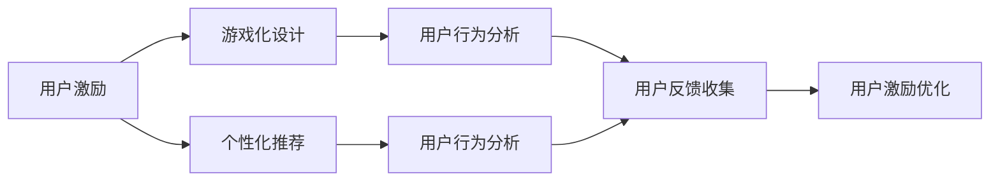

                 

# 如何进行有效的用户激励

> 关键词：用户激励, 游戏化设计, 个性化推荐, 用户行为分析, 用户反馈收集

## 1. 背景介绍

在互联网产品中，用户激励机制（User Engagement Mechanism）是推动用户活跃度、提高用户留存率的关键。通过科学、有效的激励策略，不仅能提升用户的参与度和满意度，还能推动业务的增长。然而，如何设计出既吸引用户又可持续发展的激励机制，是产品经理和技术团队面临的重大挑战。

本文将深入探讨用户激励的核心概念、原理与实践方法，从理论到技术，全面剖析用户激励的各个方面。通过具体的案例分析，我们将展示如何设计、部署以及优化用户激励系统，帮助产品经理和工程师实现业务的突破。

## 2. 核心概念与联系

### 2.1 核心概念概述

- **用户激励**：通过各种奖励和手段，激发用户积极参与、持续使用的行为。常见的用户激励方式包括积分、勋章、虚拟货币、折扣券等。
- **游戏化设计**：将游戏元素融入产品设计中，增加用户体验的趣味性和互动性。常见的游戏化设计元素包括成就系统、排行榜、任务系统等。
- **个性化推荐**：利用用户的历史行为和偏好，精准推荐内容或商品，提升用户满意度和粘性。
- **用户行为分析**：通过数据挖掘和分析，洞察用户行为模式，优化产品设计和用户体验。
- **用户反馈收集**：通过问卷调查、行为数据分析等方法，收集用户意见和建议，不断改进产品功能和服务。

这些概念之间紧密相连，共同构成用户激励系统的基础框架。通过理解这些核心概念，我们可以更好地设计和实现有效的用户激励机制。

### 2.2 核心概念原理和架构的 Mermaid 流程图



此图展示了用户激励系统中的关键环节，包括游戏化设计、个性化推荐、用户行为分析、用户反馈收集，以及最终的激励优化。

## 3. 核心算法原理 & 具体操作步骤

### 3.1 算法原理概述

用户激励系统设计的核心在于平衡激励机制的吸引力和可持续性。其设计过程通常包括以下步骤：

1. **需求分析**：明确产品目标和用户需求，确定激励系统的核心目标和关键指标。
2. **方案设计**：基于用户行为和心理模型，设计出符合用户需求和产品定位的激励方案。
3. **技术实现**：选择适当的技术工具和方法，实现激励方案的设计与部署。
4. **效果评估**：通过A/B测试、用户反馈等方法，评估激励方案的效果，持续优化。

### 3.2 算法步骤详解

#### 3.2.1 需求分析

需求分析是用户激励系统的起点，其目的是明确激励系统的目标和关键指标。常见的需求分析方法包括：

- **用户调研**：通过问卷调查、访谈等方法，直接收集用户需求和期望。
- **数据分析**：利用历史数据挖掘和用户行为分析，发现用户痛点和兴趣点。
- **竞品分析**：研究竞争对手的激励机制，借鉴其成功经验和不足之处。

以社交媒体平台为例，需求分析的关键在于了解用户对于社交互动和内容消费的偏好，以及他们对于虚拟奖励和实际奖励的敏感度。

#### 3.2.2 方案设计

方案设计需要基于需求分析的结果，结合心理学、行为经济学等理论，设计出有效的激励方案。常见的激励方案包括：

- **积分和奖励系统**：通过积分、勋章等虚拟奖励，激励用户持续参与。
- **任务和成就系统**：设置完成任务、达到成就等目标，给予用户奖励。
- **排行榜和比赛**：通过公开的排行榜和比赛，激发用户的竞争和胜出欲望。

#### 3.2.3 技术实现

技术实现是将激励方案转化为实际产品的关键步骤。常见的技术工具和方法包括：

- **数据仓库**：收集和存储用户行为数据，提供数据查询和分析支持。
- **机器学习**：利用个性化推荐算法，提升用户体验和满意度。
- **游戏引擎**：实现游戏化设计元素，增加互动性和趣味性。

#### 3.2.4 效果评估

效果评估是激励系统持续优化的重要环节。常用的评估方法包括：

- **A/B测试**：通过对比测试不同激励方案的效果，选择最优方案。
- **用户反馈**：通过问卷调查、用户访谈等方法，收集用户反馈，不断优化方案。
- **关键指标**：如用户活跃度、留存率、转化率等，通过数据统计评估方案效果。

### 3.3 算法优缺点

#### 3.3.1 优点

- **灵活性高**：可以根据不同的用户群体和产品定位，设计出多样化的激励方案。
- **可扩展性强**：可以结合新技术和方法，持续优化和升级激励系统。
- **提升用户粘性**：通过有效的激励机制，增加用户参与度和满意度，提升留存率。

#### 3.3.2 缺点

- **成本高**：设计和部署激励系统需要大量人力和资源投入。
- **复杂度高**：激励方案的设计和评估涉及多方面的因素，需要跨领域知识和经验。
- **风险性大**：激励方案设计不当，可能导致用户反感或流失。

### 3.4 算法应用领域

用户激励系统广泛应用于各类互联网产品中，如社交媒体、电子商务、在线教育等。通过有效的激励机制，这些产品能够提升用户体验，促进业务的增长。

## 4. 数学模型和公式 & 详细讲解 & 举例说明

### 4.1 数学模型构建

用户激励系统的数学模型通常包括用户行为模型和激励效果模型。

- **用户行为模型**：描述用户行为与激励效果之间的关系，如用户活跃度、留存率等。
- **激励效果模型**：评估激励方案对用户行为的影响，如积分系统对用户参与度的提升效果。

### 4.2 公式推导过程

以积分系统为例，用户积分的变化可以表示为：

$$
\Delta I = \alpha r - \beta I
$$

其中：
- $\Delta I$ 为积分变化量。
- $r$ 为奖励值，如完成任务、达到成就等。
- $\beta$ 为积分消耗系数，即用户消耗积分的速率。
- $\alpha$ 为积分增长系数，即奖励对积分的提升效果。

### 4.3 案例分析与讲解

以电商平台为例，积分系统可以帮助用户积累积分，换取优惠券或折扣。通过对用户行为数据的分析，可以设定合理的积分奖励机制，提升用户购买意愿和满意度。

## 5. 项目实践：代码实例和详细解释说明

### 5.1 开发环境搭建

开发用户激励系统的第一步是搭建开发环境。以Python为例，需要安装必要的库和框架：

1. 安装Python环境，如Anaconda或PyCharm。
2. 安装必要的库，如pandas、numpy、scikit-learn等。
3. 配置数据仓库，如MySQL或Hive。

### 5.2 源代码详细实现

下面是一个简单的用户积分系统的代码实现示例：

```python
from user import User
from order import Order

class RewardsSystem:
    def __init__(self, config):
        self.config = config
        self.users = []
    
    def add_user(self, user):
        self.users.append(user)
    
    def process_order(self, order):
        user = self.find_user(order.user_id)
        if user:
            reward_integral = self.calculate_reward(order.amount)
            user.add_integral(reward_integral)
    
    def find_user(self, user_id):
        for user in self.users:
            if user.id == user_id:
                return user
        return None
    
    def calculate_reward(self, amount):
        if amount >= self.config['min_order_amount']:
            reward = self.config['reward_per_unit']
            return reward * amount
        else:
            return 0
```

### 5.3 代码解读与分析

上述代码实现了用户积分系统的基本功能，包括用户注册、订单处理和积分计算。

**User类**：
- 表示用户对象，包括用户ID、积分等属性。
- 提供积分计算和积分修改方法。

**Order类**：
- 表示订单对象，包括订单ID、金额等属性。
- 提供订单处理方法和积分计算方法。

**RewardsSystem类**：
- 表示奖励系统，包括用户列表、配置参数等属性。
- 提供用户注册、订单处理、积分计算等方法。

### 5.4 运行结果展示

运行上述代码，可以模拟用户积分系统的基本功能。例如，注册用户、创建订单、处理积分等。

## 6. 实际应用场景

### 6.1 社交媒体平台

社交媒体平台通过任务系统、排行榜等激励机制，增加用户活跃度和粘性。例如，抖音通过发布视频、参与挑战等任务，给予用户虚拟奖励，激励用户持续发布和互动。

### 6.2 在线教育平台

在线教育平台通过积分系统、课程奖励等激励机制，提升用户学习效果和满意度。例如，Coursera通过完成课程、获得证书等任务，给予用户积分和优惠券，激励用户完成课程并获得认证。

### 6.3 电子商务平台

电子商务平台通过积分系统、优惠券奖励等激励机制，提升用户购买意愿和满意度。例如，亚马逊通过积分系统、购物满减等奖励，激励用户持续购买和消费。

### 6.4 未来应用展望

随着人工智能和大数据分析技术的发展，用户激励系统将变得更加智能和个性化。未来的发展趋势包括：

- **个性化推荐**：结合用户行为数据和机器学习算法，实现个性化激励方案的推荐。
- **情感分析**：利用自然语言处理技术，分析用户情感和反馈，优化激励方案设计。
- **多模态激励**：结合视频、音频等多模态数据，提供更加丰富和多样化的激励方式。
- **用户共创**：允许用户参与激励方案的设计和优化，增加用户参与感和满意度。

## 7. 工具和资源推荐

### 7.1 学习资源推荐

1. **《用户激励系统设计与优化》系列博文**：详细介绍了用户激励系统的理论基础和实践方法，涵盖游戏化设计、个性化推荐、用户行为分析等关键环节。
2. **《自然语言处理与用户反馈分析》课程**：通过理论和实践相结合的方式，讲解了自然语言处理技术在用户反馈分析中的应用。
3. **《数据科学与用户行为分析》书籍**：提供了用户行为分析的深入讲解，结合案例分析，帮助读者理解用户行为数据的重要性。
4. **Hugging Face官方文档**：提供了自然语言处理工具库的详细文档，包括预训练模型、游戏化设计等应用示例。

### 7.2 开发工具推荐

1. **PyCharm**：Python开发工具，提供了丰富的代码提示、调试工具和项目管理功能。
2. **MySQL**：关系型数据库，适合存储用户行为数据和激励记录。
3. **Hive**：数据仓库，支持大规模数据处理和分析。
4. **Flask**：轻量级Web框架，适合搭建用户激励系统的Web界面。

### 7.3 相关论文推荐

1. **《游戏化设计与用户体验》论文**：研究了游戏化设计在提升用户体验中的作用和效果。
2. **《用户行为分析与推荐系统》论文**：探讨了用户行为分析在个性化推荐中的应用。
3. **《用户激励机制优化》论文**：提出了基于机器学习的多维度用户激励机制优化方法。

## 8. 总结：未来发展趋势与挑战

### 8.1 研究成果总结

本文深入探讨了用户激励的核心概念、原理与实践方法，从需求分析到方案设计，再到技术实现和效果评估，全面分析了用户激励系统的各个环节。通过具体的案例分析，展示了用户激励系统的设计和优化过程，为产品经理和工程师提供了系统的指导和参考。

### 8.2 未来发展趋势

用户激励系统未来的发展趋势包括：

- **智能化**：结合人工智能和大数据分析技术，提升激励方案的个性化和智能化水平。
- **多模态**：结合视频、音频等多模态数据，提供更加丰富和多样化的激励方式。
- **用户共创**：允许用户参与激励方案的设计和优化，增加用户参与感和满意度。

### 8.3 面临的挑战

用户激励系统面临的挑战包括：

- **成本高**：设计和部署激励系统需要大量人力和资源投入。
- **复杂度高**：激励方案的设计和评估涉及多方面的因素，需要跨领域知识和经验。
- **风险性大**：激励方案设计不当，可能导致用户反感或流失。

### 8.4 研究展望

未来的研究应重点关注：

- **智能化的用户激励系统**：结合人工智能技术，提升激励方案的智能化水平。
- **多模态的用户激励方式**：结合视频、音频等多模态数据，提供更加丰富和多样化的激励方式。
- **用户共创的激励机制**：允许用户参与激励方案的设计和优化，增加用户参与感和满意度。

## 9. 附录：常见问题与解答

### 9.1 如何设计有效的用户激励系统？

**回答**：设计有效的用户激励系统需要综合考虑用户需求、产品定位和业务目标。可以通过用户调研、数据分析和竞品分析，明确用户激励的核心目标和关键指标。然后，结合心理学、行为经济学等理论，设计出符合用户需求和产品定位的激励方案。最后，通过A/B测试、用户反馈等方法，不断优化和完善激励方案。

### 9.2 如何评估用户激励系统的效果？

**回答**：评估用户激励系统的效果需要多方面考虑，包括用户活跃度、留存率、转化率等关键指标。可以通过A/B测试、用户反馈等方法，对比不同激励方案的效果，选择最优方案。同时，利用数据分析工具，定期统计和分析关键指标的变化，及时调整和优化激励方案。

### 9.3 用户激励系统的技术实现有哪些关键点？

**回答**：用户激励系统的技术实现需要关注以下几个关键点：

- **数据仓库的搭建**：选择合适的数据库，收集和存储用户行为数据。
- **激励方案的计算**：设计激励方案的计算公式，确保计算的准确性和效率。
- **用户行为的分析**：利用数据分析工具，洞察用户行为模式，优化产品设计和用户体验。

### 9.4 用户激励系统在实际应用中需要注意哪些问题？

**回答**：在实际应用中，用户激励系统需要注意以下几个问题：

- **成本控制**：设计和部署激励系统需要大量资源投入，需要合理控制成本。
- **用户反馈的收集和处理**：及时收集用户反馈，优化激励方案，增加用户满意度。
- **激励方案的合理性**：激励方案需要符合用户需求和产品定位，避免用户反感或流失。

---

作者：禅与计算机程序设计艺术 / Zen and the Art of Computer Programming

