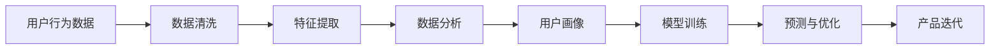

                 

# 如何进行有效的用户行为分析

> 关键词：用户行为分析,行为数据,用户画像,数据分析,机器学习,深度学习

## 1. 背景介绍

在互联网和移动应用中，用户行为数据（User Behavior Data）是企业获取洞察并优化产品体验的重要资产。有效的用户行为分析不仅能够帮助企业了解用户需求和偏好，还能指导产品迭代和市场策略的制定。

用户行为数据通常包括点击、浏览、购买、评分等用户与产品或服务互动的数据。通过分析这些数据，可以揭示用户的兴趣、行为模式和潜在需求，进而指导产品设计、营销策略和用户体验优化。

### 1.1 用户行为分析的重要性

1. **市场洞察**：用户行为分析能够帮助企业深入理解目标市场，把握消费者行为趋势。
2. **产品优化**：基于用户行为的分析结果，可以优化产品功能，提升用户满意度。
3. **个性化推荐**：通过分析用户行为数据，可以构建个性化推荐系统，提升用户体验和转化率。
4. **风险管理**：分析用户行为，能够及早发现并防范潜在风险，如欺诈检测、用户流失预警等。

在现代商业环境中，用户行为分析已成为数据驱动决策的核心环节，帮助企业实现更高的业务价值和竞争优势。

### 1.2 用户行为分析的挑战

1. **数据质量**：数据收集、清洗和存储是用户行为分析的基础，数据质量直接影响分析结果的准确性。
2. **数据隐私**：用户行为数据涉及隐私问题，如何在保障用户隐私的同时进行有效分析，是必须解决的关键挑战。
3. **数据处理**：海量数据的高速存储、实时处理和分析，对计算资源和算法模型提出了高要求。
4. **分析复杂性**：用户行为数据通常涉及多维度、多来源的数据，如何整合分析这些数据，是复杂且技术要求高的问题。

## 2. 核心概念与联系

### 2.1 核心概念概述

为更好地理解用户行为分析的方法和技术，我们首先介绍几个关键概念：

- **用户行为数据**：指用户在产品或服务中产生的所有互动数据，包括但不限于点击、浏览、购买、评论等行为。
- **用户画像**：通过分析用户行为数据，构建用户行为特征和属性的模型，用以描述和理解用户群体的特征。
- **数据分析**：使用统计学、数据挖掘等方法，从数据中提取有用信息和知识的过程。
- **机器学习**：利用算法和统计模型，对数据进行分析和学习，以发现数据中的模式和规律。
- **深度学习**：基于神经网络的算法，通过多层非线性变换，从数据中提取高层次特征。

这些核心概念构成了用户行为分析的基础，通过它们之间的相互作用和联系，可以更全面、深入地理解用户行为和需求。

### 2.2 核心概念原理和架构的 Mermaid 流程图



这个流程图展示了用户行为分析的主要步骤和技术流程。从数据清洗到特征提取，再到数据分析和用户画像的构建，最终通过模型训练实现预测和优化，指导产品迭代。

## 3. 核心算法原理 & 具体操作步骤

### 3.1 算法原理概述

用户行为分析通常采用统计学、数据挖掘和机器学习方法。其核心思想是通过对用户行为数据进行系统性的分析和建模，揭示用户需求和行为规律，进而指导产品优化和营销策略的制定。

#### 3.1.1 统计方法

统计方法在用户行为分析中主要用于描述和探索数据的基本特征和分布规律。常用的统计方法包括均值、方差、协方差等，可以帮助我们理解数据的基本属性和相关性。

#### 3.1.2 数据挖掘方法

数据挖掘方法侧重于从大量数据中发现潜在的模式和关联规则。常用的数据挖掘方法包括聚类、分类、关联规则挖掘等，可用于用户分群、用户行为预测等应用场景。

#### 3.1.3 机器学习方法

机器学习方法通过建立模型，对用户行为数据进行建模和预测。常用的机器学习方法包括回归、决策树、随机森林、支持向量机等，可用于用户行为建模和预测。

#### 3.1.4 深度学习方法

深度学习方法通过多层神经网络，从数据中提取高层次的抽象特征。常用的深度学习方法包括卷积神经网络（CNN）、循环神经网络（RNN）、长短期记忆网络（LSTM）等，可用于用户行为分析和预测。

### 3.2 算法步骤详解

用户行为分析通常包括以下关键步骤：

1. **数据收集**：通过网站、应用、API等渠道，收集用户行为数据。
2. **数据清洗**：对收集到的数据进行去重、缺失值处理、异常值检测等操作，保证数据质量。
3. **特征提取**：从清洗后的数据中提取有意义的特征，如点击次数、浏览时长、购买频率等。
4. **数据分析**：使用统计学、数据挖掘等方法，分析用户行为数据，生成用户画像和行为模式。
5. **模型训练**：基于分析结果，选择合适的算法模型进行训练，构建用户行为预测模型。
6. **预测与优化**：利用训练好的模型进行预测，指导产品迭代和优化。

### 3.3 算法优缺点

用户行为分析方法的优势在于其能够揭示用户行为规律和需求，指导产品优化和市场策略的制定。但同时也存在以下缺点：

1. **依赖数据质量**：数据收集、清洗和存储的完整性和准确性直接影响分析结果。
2. **模型复杂度高**：复杂的数据分析模型需要较大的计算资源和较长的时间训练。
3. **隐私问题**：用户行为数据的隐私保护是一个重要的挑战。
4. **解释性不足**：部分模型如深度学习模型的决策过程缺乏可解释性。

### 3.4 算法应用领域

用户行为分析在多个领域都有广泛应用，包括但不限于：

1. **电商**：分析用户购买行为，进行个性化推荐和用户细分。
2. **广告**：分析用户广告点击和行为，优化广告投放策略和用户群体划分。
3. **内容推荐**：分析用户阅读和观看行为，推荐相关内容和产品。
4. **金融**：分析用户交易和投资行为，进行风险管理和用户分群。
5. **社交媒体**：分析用户互动和内容消费行为，提升用户粘性和平台活跃度。

## 4. 数学模型和公式 & 详细讲解 & 举例说明

### 4.1 数学模型构建

用户行为分析涉及多种数学模型，包括统计模型、数据挖掘模型和机器学习模型。这里以用户行为预测为例，介绍常见的数学模型。

用户行为预测常用的数学模型包括线性回归、逻辑回归、决策树、随机森林等。以线性回归为例，其数学模型可表示为：

$$
y = \beta_0 + \beta_1 x_1 + \beta_2 x_2 + ... + \beta_n x_n + \epsilon
$$

其中，$y$ 为预测值，$\beta_0, \beta_1, ..., \beta_n$ 为模型参数，$x_1, x_2, ..., x_n$ 为输入特征，$\epsilon$ 为误差项。

### 4.2 公式推导过程

线性回归的推导过程如下：

1. 假设数据集为 $(x_1, y_1), (x_2, y_2), ..., (x_n, y_n)$。
2. 线性回归模型可以表示为：
   $$
   y_i = \beta_0 + \beta_1 x_{i1} + \beta_2 x_{i2} + ... + \beta_n x_{in} + \epsilon_i
   $$
3. 最小二乘法求解参数 $\beta_0, \beta_1, ..., \beta_n$，使预测误差最小化：
   $$
   \sum_{i=1}^n (y_i - \hat{y}_i)^2
   $$
   其中，$\hat{y}_i$ 为模型预测值。
4. 求导并解方程组得到参数：
   $$
   \beta_j = \frac{\sum_{i=1}^n x_{ij}(y_i - \bar{y})}{\sum_{i=1}^n x_{ij}^2}, \quad \bar{y} = \frac{\sum_{i=1}^n y_i}{n}
   $$

### 4.3 案例分析与讲解

以电商用户的购买行为预测为例，假设已知用户的基本信息（如年龄、性别）和行为数据（如浏览记录、购买历史），使用线性回归模型预测用户是否会购买某产品。

#### 数据准备
- 用户基本信息：年龄、性别等。
- 用户行为数据：浏览时长、浏览次数、购买记录等。
- 目标变量：是否购买某产品（0或1）。

#### 模型训练
- 对数据进行特征提取和归一化。
- 使用线性回归模型进行训练，得到预测模型。
- 在测试集上评估模型性能，计算准确率、召回率等指标。

## 5. 项目实践：代码实例和详细解释说明

### 5.1 开发环境搭建

用户行为分析的项目开发环境需要具备以下条件：

1. **Python环境**：Python是用户行为分析中常用的编程语言。
2. **数据存储和处理**：需要支持大规模数据存储和处理的工具，如Hadoop、Spark等。
3. **数据分析和机器学习工具**：常用的工具包括Pandas、NumPy、Scikit-learn等。
4. **可视化工具**：用于结果展示和数据可视化，如Matplotlib、Seaborn等。

### 5.2 源代码详细实现

以下是一个简单的用户行为分析示例，使用Python和Scikit-learn进行线性回归模型训练和预测。

```python
import pandas as pd
from sklearn.linear_model import LinearRegression
from sklearn.model_selection import train_test_split
from sklearn.metrics import accuracy_score

# 数据加载
data = pd.read_csv('user_behavior_data.csv')

# 数据预处理
X = data[['age', 'gender', 'browsing_time', 'browsing_count', 'purchase_count']]
y = data['purchase']

# 数据划分
X_train, X_test, y_train, y_test = train_test_split(X, y, test_size=0.2, random_state=42)

# 模型训练
model = LinearRegression()
model.fit(X_train, y_train)

# 模型预测
y_pred = model.predict(X_test)

# 模型评估
accuracy = accuracy_score(y_test, y_pred)
print(f'模型准确率为：{accuracy:.2f}')
```

### 5.3 代码解读与分析

以上代码实现了一个简单的线性回归模型，用于预测用户是否购买某产品。其关键步骤包括数据加载、预处理、模型训练、预测和评估。

1. **数据加载**：使用Pandas加载用户行为数据。
2. **数据预处理**：提取特征变量X和目标变量y。
3. **数据划分**：将数据集划分为训练集和测试集。
4. **模型训练**：使用线性回归模型对训练集进行拟合。
5. **模型预测**：对测试集进行预测。
6. **模型评估**：计算模型预测的准确率。

## 6. 实际应用场景

### 6.1 电商购物行为分析

电商企业通过用户行为分析，可以了解用户购买行为模式，优化商品推荐和广告投放策略。例如，分析用户购买历史和浏览记录，可以发现用户的偏好和需求，从而优化产品推荐算法。

### 6.2 广告点击行为分析

广告平台通过用户行为分析，可以优化广告投放策略和用户群体划分。例如，分析用户点击广告的行为数据，可以发现用户的兴趣和行为特征，从而实现精准投放。

### 6.3 内容推荐系统

内容推荐系统通过用户行为分析，可以提升推荐效果和用户体验。例如，分析用户阅读和观看行为，可以推荐相关内容和产品，提升用户粘性和平台活跃度。

### 6.4 金融风险管理

金融企业通过用户行为分析，可以识别潜在风险，进行风险管理和用户分群。例如，分析用户交易和投资行为，可以预测用户违约风险，优化贷款审批流程。

### 6.5 社交媒体互动分析

社交媒体平台通过用户行为分析，可以提升用户粘性和平台活跃度。例如，分析用户互动和内容消费行为，可以推荐相关内容，增加用户参与度。

## 7. 工具和资源推荐

### 7.1 学习资源推荐

为了帮助开发者系统掌握用户行为分析的理论基础和实践技巧，这里推荐一些优质的学习资源：

1. **《Python数据科学手册》**：详细介绍Python在数据分析和机器学习中的应用，涵盖用户行为分析的各个方面。
2. **《数据科学导论》**：全面介绍数据科学的基本概念和方法，包括用户行为分析的经典案例。
3. **Coursera《用户行为分析》课程**：斯坦福大学的在线课程，深入讲解用户行为分析的理论和方法。
4. **Kaggle数据竞赛**：通过参与实际的数据分析竞赛，提升用户行为分析的实战能力。

通过对这些资源的学习实践，相信你一定能够快速掌握用户行为分析的精髓，并用于解决实际的业务问题。

### 7.2 开发工具推荐

高效的开发离不开优秀的工具支持。以下是几款用于用户行为分析开发的常用工具：

1. **Pandas**：用于数据清洗、处理和分析的Python库，支持大规模数据处理。
2. **NumPy**：用于数值计算和数组操作的Python库，高效处理大规模数据集。
3. **Scikit-learn**：用于机器学习和数据分析的Python库，包含多种经典算法模型。
4. **Matplotlib**：用于数据可视化的Python库，支持多种图表和数据展示。
5. **Jupyter Notebook**：用于数据科学研究和开发的交互式编程环境。

合理利用这些工具，可以显著提升用户行为分析的开发效率，加快创新迭代的步伐。

### 7.3 相关论文推荐

用户行为分析的发展源于学界的持续研究。以下是几篇奠基性的相关论文，推荐阅读：

1. **《用户行为分析与个性化推荐系统》**：介绍用户行为分析和个性化推荐系统的基本概念和方法。
2. **《用户行为数据挖掘与分析》**：研究用户行为数据挖掘和分析的常用技术和算法。
3. **《深度学习在用户行为分析中的应用》**：探讨深度学习在用户行为分析中的应用和效果。

这些论文代表了大数据和机器学习在用户行为分析领域的最新进展，通过学习这些前沿成果，可以帮助研究者把握学科前进方向，激发更多的创新灵感。

## 8. 总结：未来发展趋势与挑战

### 8.1 总结

本文对用户行为分析的方法和技术进行了全面系统的介绍。首先阐述了用户行为分析的重要性，以及其在电商、广告、内容推荐等众多领域的应用。接着从理论到实践，详细讲解了用户行为分析的数学模型和算法步骤，给出了代码实现示例。

通过本文的系统梳理，可以看到，用户行为分析已经成为现代企业数据驱动决策的核心环节，通过分析用户行为数据，可以深入理解用户需求和偏好，指导产品迭代和营销策略的制定。未来，伴随大数据和机器学习技术的不断发展，用户行为分析必将迎来更广阔的应用前景。

### 8.2 未来发展趋势

展望未来，用户行为分析技术将呈现以下几个发展趋势：

1. **多模态数据融合**：将用户行为数据与其他模态的数据（如位置、时间、情感等）进行融合，提升分析效果。
2. **实时分析与预测**：通过实时数据流处理技术，实现用户行为数据的实时分析和预测。
3. **深度学习模型优化**：通过优化深度学习模型结构，提升模型的计算效率和预测准确率。
4. **联邦学习与隐私保护**：通过联邦学习等隐私保护技术，在不泄露用户隐私的前提下，进行用户行为分析。
5. **跨领域应用拓展**：将用户行为分析技术应用于更多领域，如智能家居、智能制造等。

以上趋势凸显了用户行为分析技术的广阔前景，这些方向的探索发展，必将进一步提升分析的准确性和效率，为用户行为分析带来新的突破。

### 8.3 面临的挑战

尽管用户行为分析技术已经取得了显著进展，但在迈向更加智能化、普适化应用的过程中，它仍面临诸多挑战：

1. **数据质量与可用性**：高质量数据是用户行为分析的基础，数据的缺失和噪声会影响分析结果的准确性。
2. **数据隐私与安全**：用户行为数据涉及隐私问题，如何在保障用户隐私的同时进行有效分析，是必须解决的关键挑战。
3. **计算资源与效率**：用户行为数据通常体量庞大，实时分析与预测需要高计算资源和高效算法。
4. **模型复杂性与可解释性**：复杂的数据分析模型需要较大的计算资源和较长的时间训练，且部分模型如深度学习模型的决策过程缺乏可解释性。

这些挑战需要研究者不断探索和创新，才能实现用户行为分析技术的持续进步和广泛应用。

### 8.4 研究展望

面对用户行为分析面临的挑战，未来的研究需要在以下几个方面寻求新的突破：

1. **数据采集与处理技术**：开发高效的数据采集和清洗技术，提升数据质量和可用性。
2. **隐私保护技术**：研究隐私保护技术，如联邦学习、差分隐私等，在不泄露用户隐私的前提下进行数据分析。
3. **实时分析与预测**：研究实时数据流处理技术，实现用户行为数据的实时分析和预测。
4. **深度学习模型优化**：优化深度学习模型结构，提升模型的计算效率和预测准确率。
5. **多模态数据融合**：研究多模态数据融合技术，提升分析效果。
6. **跨领域应用拓展**：将用户行为分析技术应用于更多领域，如智能家居、智能制造等。

这些研究方向的探索，必将引领用户行为分析技术迈向更高的台阶，为构建智能化的决策支持系统和业务优化提供坚实的技术基础。

## 9. 附录：常见问题与解答

**Q1：用户行为数据包含哪些类型？**

A: 用户行为数据通常包括点击、浏览、购买、评分等数据。具体类型可能根据不同的业务场景有所不同，如电商数据可能包含订单信息、浏览历史等，金融数据可能包含交易记录、投资行为等。

**Q2：用户行为数据如何收集？**

A: 用户行为数据可以通过网站、应用、API等渠道进行收集。常见的方法包括使用SDK嵌入代码，监测用户行为数据；使用服务器日志记录用户访问信息等。

**Q3：用户行为数据分析常用的算法有哪些？**

A: 用户行为分析常用的算法包括统计方法、数据挖掘方法、机器学习方法、深度学习方法等。具体选择应根据分析目标和数据特征而定。

**Q4：用户行为分析中的模型选择如何考虑？**

A: 用户行为分析中的模型选择应考虑数据特征、分析目标、计算资源等因素。一般来说，简单数据可以使用统计方法或数据挖掘方法，复杂数据可以使用机器学习或深度学习方法。

**Q5：用户行为分析中的数据可视化有哪些常用工具？**

A: 用户行为分析中的数据可视化常用的工具包括Matplotlib、Seaborn、Tableau等。这些工具支持多种图表和数据展示，帮助分析者更直观地理解数据。

---

作者：禅与计算机程序设计艺术 / Zen and the Art of Computer Programming

