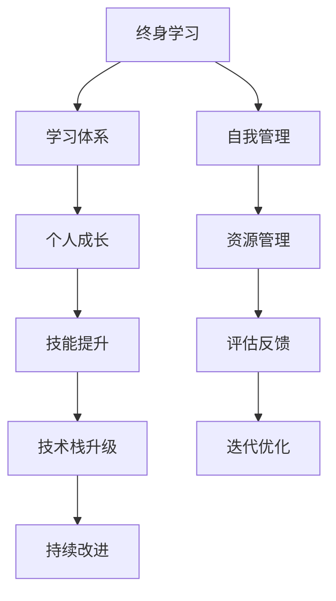

                 

# 学习体系:持续进化的源动力

> 关键词：终身学习,学习体系,个人成长,技能提升,技术栈升级

## 1. 背景介绍

### 1.1 问题由来
在这个快速变化的时代，技术的迭代更新、市场的瞬息万变、社会需求的不断提升，都要求我们不断学习和进步。如何在变化万千的环境中保持竞争力，如何在知识与技能更新迭代中维持自己的学习力，成为当前亟待解决的问题。终身学习理念的提出，不仅是对个人发展的指引，更是一种对社会进步的推动。

### 1.2 问题核心关键点
终身学习并非仅仅是一种口号，而是一种系统化、结构化的学习方式，涵盖了从基础知识到高级技术的全方位覆盖。构建持续进化的学习体系，需要明确目标、优化方法、提高效率，以及维护良好的学习习惯。这不仅关系到个人技能的提升，更影响着职业发展与市场竞争力的形成。

### 1.3 问题研究意义
构建学习体系，不仅有助于个人成长，也是实现技术栈升级的关键。技术栈的持续更新，要求开发者不仅要掌握现有技术，还需要具备快速学习和应用新技能的能力。这对于技术开发人员、IT从业者以及追求个人成长的学习者，都具有重要的指导意义。

## 2. 核心概念与联系

### 2.1 核心概念概述

构建学习体系，涉及多个关键概念，包括但不限于：

- **终身学习(Lifelong Learning)**：持续不断地获取知识、技能和态度，适应新环境和新需求。
- **学习体系(Learning System)**：包括目标设定、学习计划、资源配置、评估反馈、迭代优化等环节，旨在提供系统化的学习路径。
- **个人成长(Personal Growth)**：从认知、情感、技能等多方面提升，促进全面发展。
- **技能提升(Skill Enhancement)**：通过学习，提高专业知识和技术水平。
- **技术栈升级(Technology Stack Upgrade)**：随着新技术的出现，更新和升级自己的技术栈，保持竞争力。

这些概念之间相互联系，共同构成了一个完整、可持续的学习体系框架。

### 2.2 核心概念原理和架构的 Mermaid 流程图



这个流程图展示了终身学习与学习体系之间的联系，并指出了学习体系各环节的功能及其相互作用。

## 3. 核心算法原理 & 具体操作步骤

### 3.1 算法原理概述

构建学习体系的核心理念是持续进化与适应性更新。以下是基于这一理念的算法原理概述：

- **目标设定**：明确学习目标，包括短期目标和长期目标，确保学习具有方向性。
- **资源配置**：根据学习目标，合理配置学习资源，包括时间、金钱、人力等。
- **内容选择**：选择与目标相关的学习内容，确保学习内容具有针对性和实用性。
- **学习方法**：根据内容特性，选择合适的学习方法，如在线课程、书籍阅读、项目实践等。
- **评估反馈**：对学习效果进行评估，获取反馈，进行自我调整。
- **迭代优化**：根据反馈不断优化学习策略，实现持续改进。

### 3.2 算法步骤详解

构建学习体系的步骤，可以概括为以下几步：

**Step 1: 目标设定**
- 根据个人职业发展、技术提升等需求，明确学习目标。例如，学习新编程语言、掌握数据结构算法等。

**Step 2: 资源配置**
- 根据学习目标，评估所需的时间、金钱和资源，并合理规划。如购买相关书籍、报名在线课程、留出每周的学习时间等。

**Step 3: 内容选择**
- 在明确目标的基础上，选择与目标相关的学习内容。如选择关于Python编程的书籍、观看数据科学课程等。

**Step 4: 学习方法选择**
- 根据学习内容，选择合适的学习方法。如通过在线课程进行视频学习，通过书籍阅读进行知识积累，通过项目实践进行技能实践等。

**Step 5: 学习效果评估**
- 定期评估学习效果，如通过测试、项目实践等方式，检查学习目标的达成情况。

**Step 6: 反馈与迭代**
- 根据评估结果，获取反馈，调整学习策略。如发现学习进度慢，则可以增加学习时间或调整学习方法。

### 3.3 算法优缺点

构建学习体系具有以下优点：
- **系统性**：通过明确目标、合理配置资源、选择合适的学习方法，使得学习具有方向性和系统性。
- **针对性**：明确学习目标和内容选择，确保学习具有针对性和实用性。
- **高效性**：通过评估反馈和迭代优化，不断调整学习策略，提高学习效率。

同时，构建学习体系也存在一定的局限性：
- **时间成本**：构建和维护学习体系需要大量时间投入，特别是初期。
- **资源限制**：学习资源的选择和获取可能受到经济、物理条件的限制。
- **效果评估难度**：学习效果的评估和反馈可能存在主观性和片面性。

### 3.4 算法应用领域

构建学习体系的理念和方法，不仅适用于技术开发者，也适用于各个领域的从业者。例如：

- **教育领域**：教师可以根据学生需求，构建个性化的学习体系，提升教学效果。
- **企业培训**：企业可以针对员工职业发展需求，设计系统的培训计划，提高团队竞争力。
- **个人兴趣**：个人可以根据兴趣和需求，构建自学体系，提升全面素质。
- **行业认证**：行业机构可以设计标准化的学习路径，帮助从业者获取认证，提升职业资质。

## 4. 数学模型和公式 & 详细讲解 & 举例说明

### 4.1 数学模型构建

构建学习体系，可以基于数学模型来量化和分析。假设学习目标为 $T$，学习内容为 $C$，学习效果为 $E$，资源配置为 $R$，则学习体系的数学模型可以表示为：

$$
E=f(T, C, R)
$$

其中，$f$ 为函数映射关系，表示学习效果 $E$ 是学习目标 $T$、学习内容 $C$ 和资源配置 $R$ 的函数。

### 4.2 公式推导过程

学习效果 $E$ 可以进一步分解为学习进度 $P$ 和知识掌握程度 $K$ 的乘积：

$$
E=P \times K
$$

学习进度 $P$ 与学习时间 $T$ 成正比，即：

$$
P \propto T
$$

知识掌握程度 $K$ 与学习内容 $C$ 和资源配置 $R$ 有关，可以表示为：

$$
K=g(C, R)
$$

其中 $g$ 为非线性映射函数。

因此，综合考虑，学习效果的公式可以表示为：

$$
E=g(C, R) \times T
$$

### 4.3 案例分析与讲解

假设学习目标是掌握 Python 编程，学习内容为 Python 课程和相关书籍，资源配置为每周 5 小时学习时间和 500 元报名费。则学习效果的评估如下：

- **学习进度 $P$**：每周学习 5 小时，经过 $n$ 周后，学习进度 $P=n \times 5$。
- **知识掌握程度 $K$**：通过课程和书籍学习，知识掌握程度 $K=g(C, R)$。

将 $P$ 和 $K$ 代入公式 $E=g(C, R) \times T$，得：

$$
E=g(C, R) \times n \times 5
$$

通过不断迭代优化 $n$，可以最大化学习效果 $E$。

## 5. 项目实践：代码实例和详细解释说明

### 5.1 开发环境搭建

构建学习体系，可以使用各种工具和平台，如 Trello、Notion、GitHub 等。以下以 GitHub 为例，介绍开发环境的搭建：

1. 创建一个新的 GitHub 仓库，命名为 `learning-system`。
2. 在仓库中创建一个 `README.md` 文件，用于记录学习计划和目标。
3. 创建多个文件夹，如 `python`、`data-structure` 等，用于存放相关学习资料。

### 5.2 源代码详细实现

以下是构建学习体系的基本代码实现：

```python
class LearningSystem:
    def __init__(self, goals, resources):
        self.goals = goals
        self.resources = resources
        self.learning_plan = []
        self.learning_records = []

    def set_goals(self, goals):
        self.goals = goals

    def set_resources(self, resources):
        self.resources = resources

    def create_plan(self):
        # 根据学习目标和资源配置，创建学习计划
        for goal in self.goals:
            for resource in self.resources:
                plan = {
                    "goal": goal,
                    "resource": resource,
                    "progress": 0,
                    "start_date": None,
                    "end_date": None
                }
                self.learning_plan.append(plan)

    def update_plan(self, progress, goal, resource):
        # 更新学习进度
        for plan in self.learning_plan:
            if plan["goal"] == goal and plan["resource"] == resource:
                plan["progress"] += progress

    def record_learning(self, goal, resource):
        # 记录学习记录
        for plan in self.learning_plan:
            if plan["goal"] == goal and plan["resource"] == resource:
                self.learning_records.append(plan)

    def evaluate_effectiveness(self):
        # 评估学习效果
        effective_goals = []
        for record in self.learning_records:
            effective_goals.append(record["goal"])
        return effective_goals
```

### 5.3 代码解读与分析

- **LearningSystem 类**：封装了学习系统的核心功能，包括目标设定、资源配置、学习计划创建、进度更新、学习记录和效果评估等。
- **set_goals 和 set_resources 方法**：用于设定学习目标和资源配置，支持动态调整。
- **create_plan 方法**：根据学习目标和资源配置，生成学习计划。
- **update_plan 方法**：根据学习进度，更新学习计划。
- **record_learning 方法**：记录学习记录，用于评估效果。
- **evaluate_effectiveness 方法**：评估学习效果，返回有效目标列表。

## 6. 实际应用场景

### 6.1 个人成长与技能提升

通过构建学习体系，个人可以系统性地规划自己的成长路径。例如，一个软件工程师可以设定掌握新编程语言、提升数据结构算法等目标，通过选择相关课程和书籍，并定期评估和调整学习策略，快速提升个人技能。

### 6.2 技术栈升级

技术栈升级是开发人员职业生涯中不可或缺的一部分。通过构建学习体系，开发人员可以定期评估自己的技术栈，找出不足之处，学习相关新技术，保持竞争力。例如，一个前端开发者可以设定掌握 React、Vue 等新技术的目标，通过在线课程和项目实践，实现技术栈的全面升级。

### 6.3 企业培训

企业可以通过构建学习体系，提高员工的整体素质和技能水平。例如，一个企业可以设定员工的 Python 编程技能提升目标，选择相关培训课程，并定期评估学习效果，持续优化培训计划，提升团队整体竞争力。

## 7. 工具和资源推荐

### 7.1 学习资源推荐

- **Coursera**：提供大量高质量的在线课程，涵盖计算机科学、数据科学、商业等多个领域。
- **edX**：由麻省理工学院和哈佛大学等名校开设的在线课程，内容权威，质量高。
- **Udacity**：提供实践导向的编程和数据科学课程，强调项目实战。
- **GitHub Learning Lab**：提供免费的编程练习，涵盖 Python、JavaScript 等多种语言。
- **Khan Academy**：提供从基础数学到高级科学的免费在线课程，适合各个年龄段的学习者。

### 7.2 开发工具推荐

- **Trello**：基于卡片的项目管理工具，支持任务分配、进度跟踪和团队协作。
- **Notion**：全能型的笔记和项目管理工具，支持文档、任务、数据库等多样功能。
- **JIRA**：专业的项目管理工具，支持敏捷开发、故障追踪等高级功能。
- **GitHub**：代码托管和版本控制平台，支持团队协作和项目共享。
- **Slack**：实时通讯工具，支持多团队、多频道的消息交流。

### 7.3 相关论文推荐

- **《The Future of Learning》**：Ian Goodfellow 关于未来学习趋势的预测和建议。
- **《 lifelong learning with human-in-the-loop》**：探讨终身学习中人类参与的必要性及其影响。
- **《Personal Learning Analytics: From Data to Insights》**：介绍学习数据分析方法和应用，提升学习效果。
- **《Learning Analytics in Higher Education》**：分析高等教育中学习数据分析的现状和未来发展方向。
- **《The Effectiveness of Online Learning in Higher Education》**：研究在线学习在高等教育中的应用效果和挑战。

## 8. 总结：未来发展趋势与挑战

### 8.1 总结

本文详细介绍了构建学习体系的理论基础和实践方法，从核心概念、算法原理到具体操作步骤，系统地展示了构建学习体系的重要性。通过目标设定、资源配置、内容选择、学习方法、评估反馈、迭代优化等环节，构建了一个完整的学习体系框架。结合实际应用场景和工具资源推荐，为读者提供了全面的学习指引。

### 8.2 未来发展趋势

展望未来，学习体系的构建将呈现以下几个发展趋势：

1. **数据驱动**：学习体系的构建将更加依赖数据分析和机器学习技术，通过智能推荐和学习效果预测，提升学习效果。
2. **智能化**：基于人工智能技术，学习系统将能够提供个性化的学习建议和资源推荐，提高学习效率。
3. **多模态学习**：结合视频、音频、图像等多模态学习资源，提供更丰富、更直观的学习体验。
4. **社会化学习**：通过社交网络和学习社区，促进知识共享和交流，形成社会化学习生态。
5. **跨学科融合**：将学习体系与多学科知识进行融合，提升综合素质和跨领域能力。

### 8.3 面临的挑战

尽管构建学习体系有着诸多优势，但在实际应用中仍面临以下挑战：

1. **资源不足**：资源获取和配置可能受到经济、物理条件的限制，特别是在偏远地区。
2. **时间管理**：学习计划需要与日常工作和生活平衡，确保高效学习。
3. **效果评估**：学习效果的评估可能存在主观性和片面性，需要科学方法和工具支持。
4. **持续改进**：学习体系需要动态调整和优化，保持与时俱进。

### 8.4 研究展望

未来的研究将进一步探索学习体系的优化和升级，主要关注以下几个方向：

1. **智能推荐系统**：基于数据分析和机器学习，提供个性化的学习建议和资源推荐，提高学习效果。
2. **多模态学习**：结合视频、音频、图像等多种学习资源，提升学习体验和效果。
3. **社会化学习平台**：通过社交网络和学习社区，促进知识共享和交流，形成社会化学习生态。
4. **跨学科融合**：将学习体系与多学科知识进行融合，提升综合素质和跨领域能力。
5. **学习效果量化**：通过科学方法和工具，量化评估学习效果，提供数据驱动的优化建议。

## 9. 附录：常见问题与解答

**Q1: 如何构建适合自己的学习体系？**

A: 构建学习体系需要明确目标、配置资源、选择内容和方法。具体步骤如下：
1. 设定明确的学习目标，如掌握新编程语言、提升数据结构算法等。
2. 评估资源，包括时间、金钱和物理条件，合理配置资源。
3. 选择与目标相关的学习内容，如相关书籍、在线课程等。
4. 选择合适的学习方法，如在线课程、书籍阅读、项目实践等。

**Q2: 如何评估学习效果？**

A: 评估学习效果可以通过以下方法：
1. 定期测试和实践，检查目标的达成情况。
2. 通过项目实践，应用所学知识解决实际问题。
3. 与学习计划对比，评估进度和掌握程度。
4. 获取反馈，调整学习策略。

**Q3: 学习体系中如何进行自我管理？**

A: 学习体系的自我管理可以通过以下方法：
1. 设定明确的学习计划，分配时间，避免拖延。
2. 定期回顾和调整学习计划，确保目标和进度一致。
3. 使用项目管理工具，记录和跟踪学习进度。
4. 定期反思和总结，改进学习策略。

**Q4: 如何提高学习效果？**

A: 提高学习效果可以通过以下方法：
1. 选择合适的学习内容和方法，保持兴趣和动力。
2. 多渠道获取资源，利用视频、书籍、实践等多种方式。
3. 多与他人交流，分享和获取反馈。
4. 定期评估和调整学习策略，保持高效学习。

---

作者：禅与计算机程序设计艺术 / Zen and the Art of Computer Programming

