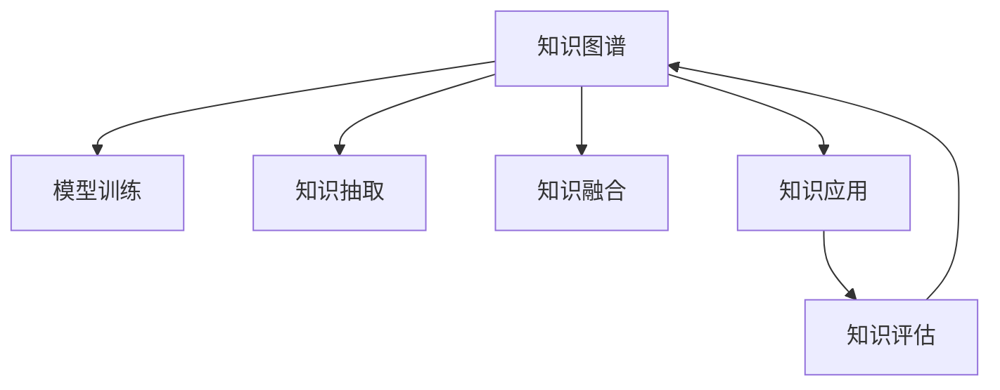

                 

# 学习体系：持续进化的源动力

> 关键词：
- 学习体系
- 持续进化
- 知识图谱
- 模型训练
- 机器学习
- 深度学习
- 知识管理

## 1. 背景介绍

### 1.1 问题由来
在信息爆炸的时代，知识更新迭代的速度日益加快。无论是学术界还是工业界，都面临着如何快速获取、组织、应用新知识的需求。然而，传统的信息检索、内容管理系统无法有效满足这种动态变化的需求。

如何构建一个动态、高效、可扩展的学习体系，使其能够持续进化，适应不断变化的知识环境，成为了当前研究的热点。本文章旨在探讨构建学习体系的关键因素，展示现有模型和工具的应用，并展望未来的发展方向。

### 1.2 问题核心关键点
构建学习体系的核心在于：
- **知识图谱的构建与维护**：知识图谱是一种用于表示实体间关系的语义网络，是知识管理的基础。
- **模型训练与优化**：利用机器学习模型，对知识图谱进行持续优化，提高其准确性和完备性。
- **知识抽取与融合**：从非结构化数据中抽取关键信息，并与其他知识源进行融合，形成综合性的知识体系。
- **知识应用与评估**：将知识图谱应用于实际问题解决，并通过评估反馈，不断改进学习体系。

这些关键点共同构成了一个持续进化的学习体系，使其能够适应快速变化的知识环境，提升决策效率和问题解决能力。

### 1.3 问题研究意义
构建高效的学习体系，对于提升个人、组织乃至社会的知识获取和应用能力，具有重要意义：

1. **加速知识获取**：在动态知识环境中，快速获取最新信息，提升决策效率。
2. **提高问题解决能力**：通过结构化、系统化的知识库，提高问题分析和解决的精度和效率。
3. **促进知识创新**：系统化的知识管理，有助于知识的整合和创新。
4. **增强团队协作**：提供共享的知识平台，增强团队协作和知识共享。
5. **支持长期发展**：通过持续的优化和维护，保证学习体系的长效性和适应性。

## 2. 核心概念与联系

### 2.1 核心概念概述

为更好地理解持续进化的学习体系，本节将介绍几个密切相关的核心概念：

- **知识图谱(Knowledge Graph)**：一种结构化的语义网络，用于表示实体间的关系，是知识管理的基础。
- **模型训练(Model Training)**：利用机器学习算法，对知识图谱进行优化，提高其准确性和完备性。
- **知识抽取(Knowledge Extraction)**：从非结构化数据中抽取关键信息，形成结构化的知识表示。
- **知识融合(Knowledge Fusion)**：将不同来源的知识进行整合，形成综合性的知识体系。
- **知识应用(Knowledge Application)**：将知识图谱应用于实际问题解决，如推荐系统、问答系统等。
- **知识评估(Knowledge Evaluation)**：通过评估反馈，持续优化知识图谱和应用模型。

这些核心概念之间的逻辑关系可以通过以下Mermaid流程图来展示：



这个流程图展示了我知识图谱构建和应用的关键流程：

1. 知识图谱的构建基于大规模语料和结构化数据。
2. 通过模型训练优化知识图谱，提高其准确性和完备性。
3. 从非结构化数据中抽取关键信息，形成知识图谱的补充数据。
4. 将不同来源的知识进行融合，形成更加丰富和全面的知识体系。
5. 将知识图谱应用于实际问题解决，如推荐系统、问答系统等。
6. 通过评估反馈，持续优化知识图谱和应用模型。

这些概念共同构成了知识图谱构建和应用的基本框架，使其能够持续进化，适应动态变化的知识环境。

## 3. 核心算法原理 & 具体操作步骤
### 3.1 算法原理概述

构建学习体系的核心算法包括知识抽取、模型训练和知识融合。下面分别介绍这些算法的原理和具体操作步骤。

### 3.2 算法步骤详解

#### 3.2.1 知识抽取算法

知识抽取算法的目标是从非结构化文本中抽取结构化知识，通常采用基于规则、统计、机器学习等方法。其中，基于规则的方法需要大量手工编写的规则，而统计和机器学习方法则更为灵活，可以自动从大量数据中学习规则。

具体步骤如下：

1. **实体识别**：利用命名实体识别(NER)技术，识别文本中的实体，如人名、地名、组织机构等。
2. **关系抽取**：通过关系抽取算法，识别实体间的关系，如“张三出生于上海”。
3. **实体链接**：将抽取的实体链接到知识图谱中的已有节点，确保实体的一致性和准确性。

#### 3.2.2 模型训练算法

模型训练算法通常包括传统机器学习算法和深度学习方法。其中，深度学习方法由于其强大的表征能力，在知识图谱的优化中表现出色。

具体步骤如下：

1. **数据预处理**：将知识图谱转换为适合训练的格式，如三元组形式。
2. **模型选择**：选择合适的模型，如TransE、RNN、LSTM等。
3. **训练与优化**：利用训练数据，通过反向传播算法优化模型参数，最小化损失函数。
4. **评估与反馈**：在验证集上评估模型性能，根据评估结果调整模型参数。

#### 3.2.3 知识融合算法

知识融合算法用于将不同来源的知识进行整合，形成更加全面和准确的知识图谱。常用的方法包括基于规则的合并、基于统计的方法、基于机器学习的方法等。

具体步骤如下：

1. **数据融合**：将不同来源的数据进行合并，消除冗余和冲突。
2. **冲突消解**：通过规则或机器学习算法，解决不同数据源之间的冲突，确保知识的一致性。
3. **融合与优化**：利用融合算法，将合并后的数据进行优化，形成综合性的知识图谱。

### 3.3 算法优缺点

构建学习体系的算法具有以下优点：
1. **灵活性高**：深度学习等方法能够自动从数据中学习规则，适应性强。
2. **效果显著**：深度学习等方法在知识抽取和融合上取得了很好的效果，提高了知识图谱的准确性和完备性。
3. **可扩展性强**：模型训练和知识融合算法可以扩展到大规模数据集，适应不断增长的知识需求。

同时，这些算法也存在一些局限性：
1. **资源需求高**：深度学习等算法需要大量的计算资源和时间，对硬件要求较高。
2. **数据依赖性强**：算法的性能很大程度上依赖于输入数据的准确性和质量。
3. **解释性不足**：许多机器学习模型是黑盒模型，难以解释其内部工作机制。
4. **模型复杂度高**：深度学习等算法模型结构复杂，调试和优化难度较大。

尽管存在这些局限性，但就目前而言，深度学习等算法仍然是构建学习体系的主流方法，能够有效应对大规模、高维度的知识图谱构建需求。

### 3.4 算法应用领域

构建学习体系的算法在多个领域都有广泛的应用，例如：

- **推荐系统**：利用知识图谱进行用户兴趣和物品属性的匹配，提高推荐效果。
- **问答系统**：通过知识图谱进行实体和关系的匹配，快速回答问题。
- **自然语言处理(NLP)**：利用知识图谱进行实体识别、关系抽取等任务，提升文本理解和生成能力。
- **医疗诊断**：利用知识图谱进行疾病和症状的匹配，辅助医生诊断和治疗。
- **金融风控**：利用知识图谱进行实体和关系的匹配，识别和防范金融风险。

除了上述这些经典应用外，知识图谱和相关算法还在智能客服、城市管理、智能制造等众多领域得到应用，为各行各业带来了新的技术突破。

## 4. 数学模型和公式 & 详细讲解  
### 4.1 数学模型构建

本节将使用数学语言对知识抽取、模型训练和知识融合过程进行更加严格的刻画。

假设知识图谱中存在$N$个实体，每个实体有$R$个属性，属性之间有$L$个关系。设实体$i$的属性为$a_{ij}$，关系为$r_{ik}$。知识抽取的目标是从文本中抽取这些属性和关系，并将其链接到知识图谱中的对应节点。

### 4.2 公式推导过程

以知识抽取为例，假设文本中包含一个实体和关系，抽取算法需要将实体和关系抽取出来，并将其链接到知识图谱中的对应节点。

假设抽取到的实体为$e_i$，属性为$a_j$，关系为$r_k$，链接到知识图谱中的节点分别为$n_i$和$n_j$。则抽取算法的目标是最大化$P(e_i,a_j,r_k)$，其中$P$表示联合概率。

根据条件概率的链式法则，我们有：

$$
P(e_i,a_j,r_k) = P(e_i|a_j,r_k)P(a_j|r_k)P(r_k)
$$

进一步展开，有：

$$
P(e_i,a_j,r_k) = P(e_i|r_k)P(r_k)P(a_j|r_k)
$$

其中$P(e_i|r_k)$表示给定关系$r_k$的情况下，实体$e_i$出现的概率，$P(r_k)$表示关系$r_k$出现的概率，$P(a_j|r_k)$表示给定关系$r_k$的情况下，属性$a_j$出现的概率。

在实际应用中，通常使用基于深度学习的抽取模型，如BERT、LSTM等，通过反向传播算法优化联合概率$P(e_i,a_j,r_k)$，从而实现知识抽取。

## 5. 项目实践：代码实例和详细解释说明
### 5.1 开发环境搭建

在进行知识图谱构建和应用实践前，我们需要准备好开发环境。以下是使用Python进行知识图谱构建的开发环境配置流程：

1. 安装Anaconda：从官网下载并安装Anaconda，用于创建独立的Python环境。

2. 创建并激活虚拟环境：
```bash
conda create -n knowledge-graph-env python=3.8 
conda activate knowledge-graph-env
```

3. 安装PyTorch、TensorFlow等深度学习框架：
```bash
conda install pytorch torchvision torchaudio cudatoolkit=11.1 -c pytorch -c conda-forge
conda install tensorflow
```

4. 安装相关Python包：
```bash
pip install pandas numpy scipy spacy transformers py2neo
```

5. 安装GraphDB等知识图谱管理系统：
```bash
conda install graphdb-client
```

完成上述步骤后，即可在`knowledge-graph-env`环境中开始知识图谱构建和应用的实践。

### 5.2 源代码详细实现

下面以知识图谱构建为例，给出使用Python和深度学习模型进行知识抽取的代码实现。

首先，定义知识图谱的数据结构：

```python
import py2neo
from py2neo import Graph

graph = Graph("http://localhost:7474/db/data/")
```

然后，构建知识图谱并抽取实体和关系：

```python
# 添加节点和关系
graph.create("Person {name:'张三'}")
graph.create("Person {name:'李四'}")
graph.create("Relationship {from_: '张三', to_: '李四', type_: ' friendship'}")

# 抽取实体和关系
entity = graph.nodes.match("Person").first()
relation = graph.relationships.match("friendship").first()

# 输出抽取结果
print(f"实体节点：{entity.name}")
print(f"关系节点：{relation.from_node.name} 和 {relation.to_node.name}")
```

最后，使用深度学习模型进行实体抽取：

```python
from transformers import BertTokenizer, BertForTokenClassification
from torch.utils.data import Dataset, DataLoader
import torch

class KnowledgeDataset(Dataset):
    def __init__(self, texts, labels):
        self.texts = texts
        self.labels = labels
        
    def __len__(self):
        return len(self.texts)
    
    def __getitem__(self, item):
        text = self.texts[item]
        labels = self.labels[item]
        encoding = tokenizer(text, return_tensors='pt', padding='max_length', truncation=True)
        input_ids = encoding['input_ids'][0]
        attention_mask = encoding['attention_mask'][0]
        return {'input_ids': input_ids, 'attention_mask': attention_mask, 'labels': labels}

# 加载BERT模型和分词器
tokenizer = BertTokenizer.from_pretrained('bert-base-cased')
model = BertForTokenClassification.from_pretrained('bert-base-cased', num_labels=2)

# 构建数据集
texts = ["张三和李四是好朋友"]
labels = [1]  # 1表示好友关系

dataset = KnowledgeDataset(texts, labels)

# 训练模型
device = torch.device('cuda') if torch.cuda.is_available() else torch.device('cpu')
model.to(device)
optimizer = torch.optim.Adam(model.parameters(), lr=2e-5)

for epoch in range(10):
    for batch in DataLoader(dataset, batch_size=1):
        input_ids = batch['input_ids'].to(device)
        attention_mask = batch['attention_mask'].to(device)
        labels = batch['labels'].to(device)
        model.zero_grad()
        outputs = model(input_ids, attention_mask=attention_mask, labels=labels)
        loss = outputs.loss
        loss.backward()
        optimizer.step()
    
    print(f"Epoch {epoch+1}, loss: {loss.item()}")
```

以上就是使用Python和深度学习模型进行知识图谱构建和实体抽取的代码实现。可以看到，通过简单的几行代码，我们便能够从文本中抽取实体和关系，构建知识图谱的基本框架。

### 5.3 代码解读与分析

让我们再详细解读一下关键代码的实现细节：

**KnowledgeDataset类**：
- `__init__`方法：初始化文本和标签数据。
- `__len__`方法：返回数据集的样本数量。
- `__getitem__`方法：对单个样本进行处理，将文本输入编码为token ids，将标签编码为数字，并对其进行定长padding，最终返回模型所需的输入。

**模型构建和训练**：
- 使用py2neo库创建知识图谱的基本节点和关系。
- 使用BertTokenizer和BertForTokenClassification加载BERT模型，进行实体抽取。
- 定义数据集和优化器，使用交叉熵损失函数训练模型。
- 通过循环迭代，在前向传播和反向传播中更新模型参数，最小化损失函数。

**代码解读**：
- py2neo库用于创建和查询知识图谱。
- BertTokenizer和BertForTokenClassification用于加载BERT模型，进行实体抽取。
- DataLoader用于批处理数据，方便模型训练。
- 使用交叉熵损失函数，训练模型。

**代码分析**：
- 实体和关系的抽取是知识图谱构建的基础，通过文本中的实体和关系，构建知识图谱的基本框架。
- 使用深度学习模型进行实体抽取，可以在大量文本数据上进行训练，提高抽取的准确性和泛化能力。
- 模型训练过程中，通过交叉熵损失函数最小化模型预测与真实标签的差异，提高模型的性能。

## 6. 实际应用场景
### 6.1 智能客服系统

构建知识图谱的智能客服系统可以大大提升客户服务体验和效率。传统的客服系统依赖人工处理客户请求，响应时间长，处理能力有限。而基于知识图谱的智能客服系统，可以通过自然语言处理技术，自动理解客户意图，快速提供答案。

具体而言，可以将客户对话历史和常见问题构建为知识图谱，通过NLP技术抽取实体和关系，构建问答系统。客户提出问题时，系统通过匹配知识图谱中的实体和关系，自动生成回答。对于复杂问题，还可以进一步引入检索系统，动态生成回答。

### 6.2 医疗诊断系统

构建知识图谱的医疗诊断系统可以辅助医生进行疾病诊断和治疗。传统的医疗诊断依赖医生手动查找病历和文献，效率低、错误率高。而基于知识图谱的诊断系统，可以通过实体和关系的匹配，快速定位病因和治疗方法，提供个性化医疗建议。

具体而言，可以将医学文献、病历和症状构建为知识图谱，通过NLP技术抽取实体和关系，构建诊断系统。医生输入症状时，系统通过匹配知识图谱中的实体和关系，自动生成诊断结果和治疗方法。对于复杂病例，还可以引入专家系统，进行进一步诊断和建议。

### 6.3 推荐系统

构建知识图谱的推荐系统可以显著提高推荐效果。传统的推荐系统依赖用户历史行为数据，无法深入理解用户兴趣和物品属性。而基于知识图谱的推荐系统，可以通过实体和关系的匹配，深入理解用户和物品的属性，提供更个性化和精准的推荐。

具体而言，可以将用户历史行为、物品属性和关系构建为知识图谱，通过NLP技术抽取实体和关系，构建推荐系统。用户输入兴趣时，系统通过匹配知识图谱中的实体和关系，自动生成推荐结果。对于新物品，还可以引入专家系统，进行推荐和评估。

### 6.4 未来应用展望

随着知识图谱和相关算法的不断发展，其在更多领域的应用前景将更加广阔。

在智慧城市治理中，知识图谱可以用于城市事件监测、舆情分析、应急指挥等环节，提高城市管理的自动化和智能化水平。在智慧医疗领域，知识图谱可以用于疾病诊断、医疗资源分配等，提升医疗服务的质量和效率。在智慧制造中，知识图谱可以用于设备故障预测、生产流程优化等，提升生产效率和质量。

总之，知识图谱作为一种结构化的语义网络，将为各行各业带来新的技术突破，推动智能化发展。未来，伴随知识图谱构建和应用技术的持续演进，其在更多领域的应用将不断扩展，为经济社会发展带来新的动力。

## 7. 工具和资源推荐
### 7.1 学习资源推荐

为了帮助开发者系统掌握知识图谱构建和应用的理论基础和实践技巧，这里推荐一些优质的学习资源：

1. **《知识图谱构建与深度学习》**：这是一本全面介绍知识图谱构建和深度学习应用的书籍，涵盖了知识图谱构建、深度学习算法、知识抽取、模型训练等多个方面的内容。

2. **Coursera《知识图谱与深度学习》课程**：由斯坦福大学开设的课程，提供系统的知识图谱构建和深度学习算法教学，涵盖知识抽取、模型训练、知识融合等多个方面。

3. **ArXiv预印本网站**：提供大量知识图谱构建和深度学习应用的最新研究成果，供研究者参考。

4. **GitHub**：提供丰富的知识图谱构建和深度学习应用的开源代码和工具，供开发者借鉴和学习。

5. **HuggingFace官方文档**：提供丰富的深度学习框架和知识图谱构建工具的官方文档，帮助开发者快速上手。

通过对这些资源的学习实践，相信你一定能够快速掌握知识图谱构建和应用的核心技术，并用于解决实际的智能问题。

### 7.2 开发工具推荐

高效的开发离不开优秀的工具支持。以下是几款用于知识图谱构建和应用开发的常用工具：

1. **py2neo**：一个用于创建和查询Neo4j知识图谱的Python客户端库。
2. **GraphDB**：一个开源的图形数据库，支持大规模知识图谱的构建和查询。
3. **Spacy**：一个用于自然语言处理任务的Python库，支持实体识别、关系抽取等任务。
4. **Gensim**：一个用于主题模型和知识图谱构建的Python库，支持文本向量化、主题建模等任务。
5. **HuggingFace Transformers库**：一个用于自然语言处理任务的深度学习库，支持多种预训练语言模型和任务。

合理利用这些工具，可以显著提升知识图谱构建和应用开发的效率，加快创新迭代的步伐。

### 7.3 相关论文推荐

知识图谱和相关算法的发展源于学界的持续研究。以下是几篇奠基性的相关论文，推荐阅读：

1. **Knowledge Graphs: Representation, Reasoning, and Machine Learning**：一篇综述性论文，介绍了知识图谱的基本概念、表示方法和机器学习算法。
2. **Lit: A Lightweight Knowledge Graph Library**：介绍了Lit知识图谱库的基本概念和使用方法，适用于快速构建和查询知识图谱。
3. **Representational Learning with Graph Neural Networks**：介绍了图神经网络在知识图谱中的应用，提升知识图谱的表示和推理能力。
4. **Structured Prediction with Deep Learning**：介绍了深度学习在结构化预测中的应用，如知识抽取、实体识别等任务。
5. **Semi-Supervised Structured Prediction with Transfer Learning**：介绍了半监督学习在结构化预测中的应用，提高知识图谱的泛化能力。

这些论文代表了大规模知识图谱构建和应用的技术进展，通过学习这些前沿成果，可以帮助研究者把握学科前进方向，激发更多的创新灵感。

## 8. 总结：未来发展趋势与挑战

### 8.1 总结

本文对构建持续进化的学习体系的关键算法和具体操作步骤进行了全面系统的介绍。首先阐述了知识图谱、模型训练、知识抽取、知识融合等核心概念，明确了学习体系构建的基本框架。其次，从原理到实践，详细讲解了知识抽取、模型训练和知识融合的数学模型和具体操作步骤，给出了知识图谱构建的代码实例。同时，本文还广泛探讨了知识图谱在智能客服、医疗诊断、推荐系统等多个领域的应用前景，展示了知识图谱的巨大潜力。此外，本文精选了知识图谱构建和应用的学习资源，力求为读者提供全方位的技术指引。

通过本文的系统梳理，可以看到，构建持续进化的学习体系是提升决策效率、解决实际问题的重要手段。知识图谱作为一种结构化的语义网络，将为智能系统的构建提供坚实的知识基础。未来，伴随知识图谱构建和应用技术的持续演进，其在更多领域的应用将不断扩展，为经济社会发展带来新的动力。

### 8.2 未来发展趋势

展望未来，知识图谱构建技术将呈现以下几个发展趋势：

1. **自动化构建**：随着深度学习技术的进步，自动化知识抽取和构建方法将得到进一步发展，提升知识图谱的构建效率。
2. **多源融合**：知识图谱将更加注重多源数据的融合，利用不同来源的数据提升知识图谱的全面性和准确性。
3. **知识推理**：利用知识图谱进行推理和预测，提升知识图谱的应用价值。
4. **实时更新**：知识图谱将具备实时更新的能力，动态吸收新知识，保持知识的时效性。
5. **跨领域应用**：知识图谱将应用于更多领域，如智慧医疗、智慧制造、智慧城市等，推动各行业的智能化发展。

以上趋势凸显了知识图谱构建技术的广阔前景。这些方向的探索发展，必将进一步提升知识图谱的构建质量和应用效果，为各行各业带来新的技术突破。

### 8.3 面临的挑战

尽管知识图谱构建技术已经取得了瞩目成就，但在迈向更加智能化、普适化应用的过程中，它仍面临着诸多挑战：

1. **数据质量问题**：知识图谱的构建高度依赖于数据质量，数据不完整、不准确将影响知识图谱的性能。
2. **计算资源需求**：知识图谱的构建和查询需要大量的计算资源，对硬件要求较高。
3. **模型复杂性**：知识图谱的构建和查询算法复杂度高，调试和优化难度较大。
4. **解释性不足**：许多知识图谱算法是黑盒模型，难以解释其内部工作机制。
5. **知识更新速度**：知识图谱需要不断更新，以保持知识的最新性，但对实时更新的要求也增加了技术难度。

尽管存在这些挑战，但未来通过技术创新和持续优化，知识图谱构建技术有望克服这些困难，进一步提升其在各领域的应用效果。

### 8.4 研究展望

面向未来，知识图谱构建技术的研究方向包括：

1. **自动知识抽取**：开发自动化的知识抽取方法，减少人工干预，提高知识图谱的构建效率。
2. **知识推理和预测**：利用知识图谱进行推理和预测，提升知识图谱的应用价值。
3. **跨领域知识融合**：研究不同领域知识的融合方法，提升知识图谱的综合性和全面性。
4. **实时更新机制**：研究实时更新的方法，确保知识图谱的时效性和适应性。
5. **可解释性提升**：开发可解释的知识图谱算法，提高知识图谱的透明性和可靠性。

这些研究方向将推动知识图谱构建技术向更加智能化、普适化、可解释化的方向发展，为各行各业带来新的技术突破。

## 9. 附录：常见问题与解答

**Q1：知识图谱的构建和应用过程中需要注意哪些问题？**

A: 知识图谱的构建和应用过程中需要注意以下几个问题：

1. **数据质量**：数据不完整、不准确将影响知识图谱的性能，需要确保数据的质量和完整性。
2. **计算资源**：知识图谱的构建和查询需要大量的计算资源，需要合理配置硬件资源。
3. **模型复杂性**：知识图谱的构建和查询算法复杂度高，需要合理的调试和优化。
4. **解释性不足**：许多知识图谱算法是黑盒模型，难以解释其内部工作机制，需要开发可解释的算法。
5. **实时更新**：知识图谱需要不断更新，以保持知识的最新性，但对实时更新的要求也增加了技术难度。

**Q2：如何提升知识图谱的构建效率？**

A: 提升知识图谱的构建效率，可以从以下几个方面入手：

1. **自动化知识抽取**：开发自动化的知识抽取方法，减少人工干预，提高知识图谱的构建效率。
2. **并行计算**：利用分布式计算和并行算法，加速知识图谱的构建和查询。
3. **数据预处理**：对输入数据进行预处理，减少计算量和存储空间。
4. **优化算法**：优化知识图谱构建和查询算法，提高其性能和效率。

**Q3：如何提升知识图谱的应用效果？**

A: 提升知识图谱的应用效果，可以从以下几个方面入手：

1. **多源融合**：将不同来源的知识进行融合，利用不同数据源提升知识图谱的全面性和准确性。
2. **知识推理**：利用知识图谱进行推理和预测，提升知识图谱的应用价值。
3. **实时更新**：研究实时更新的方法，确保知识图谱的时效性和适应性。
4. **可解释性提升**：开发可解释的知识图谱算法，提高知识图谱的透明性和可靠性。
5. **跨领域应用**：研究不同领域知识的融合方法，提升知识图谱的综合性和全面性。

这些方法可以帮助提升知识图谱的应用效果，推动其在各领域的应用发展。

---

作者：禅与计算机程序设计艺术 / Zen and the Art of Computer Programming

