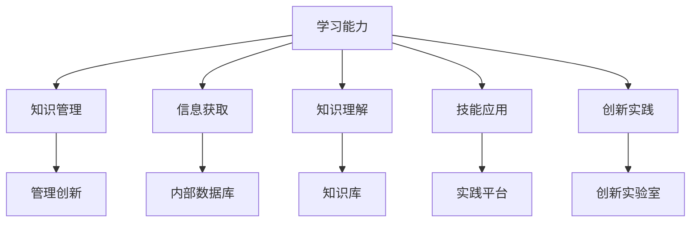

                 

# 学习能力与管理创新的关系

## 1. 背景介绍

在当前快速变化和充满竞争的市场环境中，学习能力与管理创新之间的关系变得愈发紧密。企业面临着不断变化的客户需求、快速发展的技术创新以及激烈的市场竞争，这些因素共同推动着企业不断寻求创新的管理策略和方法，以维持竞争优势。而学习能力则是企业应对这些挑战的核心能力，它不仅影响着个人和团队的知识更新与技能提升，也是推动组织创新和发展的关键驱动力。本文将深入探讨学习能力与管理创新的关系，分析其作用机制，并提出相应的策略建议，旨在帮助组织更好地利用学习能力，实现管理创新的持续提升。

## 2. 核心概念与联系

### 2.1 核心概念概述

**学习能力 (Learning Ability)**：指个人、团队或组织在不断变化的环境中获取、吸收和应用新知识与技能的能力。这包括信息获取、知识理解、技能应用和创新实践等多个方面。

**管理创新 (Management Innovation)**：指通过新的管理理念、方法和技术，改进组织运营效率、提升组织竞争力、促进组织发展的创新活动。管理创新涉及组织结构优化、流程再造、战略规划、文化建设等多个方面。

**知识管理 (Knowledge Management)**：指通过系统的方法，识别、捕获、传播和应用组织内的知识，从而提高组织绩效和创新能力。知识管理是连接学习能力与管理创新的桥梁。

### 2.2 核心概念原理和架构的 Mermaid 流程图(Mermaid 流程节点中不要有括号、逗号等特殊字符)



这个流程图展示了学习能力与管理创新之间的联系：通过信息获取、知识理解、技能应用和创新实践等环节，形成知识管理，进而推动管理创新。

## 3. 核心算法原理 & 具体操作步骤

### 3.1 算法原理概述

学习能力与管理创新之间的关系可以通过如下数学模型来描述：

$$
Innovation(I) = F(Lab, PM, KA, KP, SF, PI)
$$

其中，$I$ 表示管理创新的水平，$Lab$ 表示学习能力，$PM$ 表示激励机制，$KA$ 表示知识获取能力，$KP$ 表示知识传播能力，$SF$ 表示技能应用能力，$PI$ 表示创新实践能力。该模型表明，管理创新不仅受到学习能力的影响，还受到知识获取、激励机制、知识传播、技能应用和创新实践等多方面因素的共同作用。

### 3.2 算法步骤详解

1. **评估学习能力**：
   - 使用问卷调查、绩效评估等方法，评估个人、团队或组织的整体学习能力。
   - 分析学习效率、学习效果和学习倾向等关键指标。

2. **构建知识管理框架**：
   - 设计知识管理系统，包括知识库、内部数据库、实践平台等组件。
   - 实施知识获取、知识存储、知识传播和知识应用等流程。

3. **激发管理创新动机**：
   - 建立激励机制，包括奖励制度、晋升机制、职业发展机会等。
   - 营造创新文化，鼓励员工提出新想法和创新方案。

4. **提升知识获取能力**：
   - 提供培训、研讨会、在线课程等学习资源。
   - 支持学习和知识分享社区，促进知识的交流和共享。

5. **增强知识传播能力**：
   - 使用知识管理系统，将知识有效存储和传播。
   - 定期组织知识分享会、研讨会等活动，促进知识传播。

6. **强化技能应用能力**：
   - 鼓励员工在实际工作中应用新知识和新技能。
   - 实施内部项目和创新竞赛，提供实践平台。

7. **推动创新实践能力**：
   - 设立创新实验室，提供技术支持和发展空间。
   - 建立创新评估和反馈机制，持续改进创新实践。

### 3.3 算法优缺点

**优点**：
- **系统性**：通过系统的方法，全面评估和提升学习能力，从而推动管理创新。
- **可操作性**：具体步骤清晰，易于执行和跟踪。
- **灵活性**：可以根据组织实际情况进行调整和优化。

**缺点**：
- **复杂性**：涉及多个方面的评估和改进，需要全面协调和执行。
- **资源需求**：可能需要投入大量资源进行知识管理系统和激励机制的建设。
- **动态调整**：需要持续监控和评估，及时调整策略。

### 3.4 算法应用领域

学习能力与管理创新之间的关系在多个领域都有广泛应用，包括：

- **教育领域**：学校和企业需要通过提升教师和员工的学习能力，推动教育创新和职业发展。
- **医疗领域**：医护人员需要不断学习新知识和技术，以提高诊疗水平和服务质量。
- **制造业**：企业需要提升员工的技能应用能力，推动生产线优化和产品质量提升。
- **金融行业**：金融从业者需要学习最新的金融工具和技术，以提升服务质量和风险控制能力。

## 4. 数学模型和公式 & 详细讲解

### 4.1 数学模型构建

$$
Lab = \sum_{i=1}^{n} w_i \cdot L_i
$$

其中，$Lab$ 表示学习能力，$L_i$ 表示第 $i$ 项学习能力指标，$w_i$ 表示第 $i$ 项指标的权重。

### 4.2 公式推导过程

学习能力指标包括信息获取、知识理解、技能应用和创新实践等，每个指标的权重反映了其在整体学习能力中的重要性。

$$
Lab = \alpha \cdot Lab_{获取} + \beta \cdot Lab_{理解} + \gamma \cdot Lab_{应用} + \delta \cdot Lab_{实践}
$$

其中，$\alpha$、$\beta$、$\gamma$、$\delta$ 分别表示信息获取、知识理解、技能应用和创新实践的权重。

### 4.3 案例分析与讲解

以一个制造企业为例，其学习能力模型如下：

$$
Lab = 0.4 \cdot Lab_{信息获取} + 0.3 \cdot Lab_{知识理解} + 0.2 \cdot Lab_{技能应用} + 0.1 \cdot Lab_{创新实践}
$$

- **信息获取**：员工通过内部培训、外部培训、在线学习等渠道获取新知识。
- **知识理解**：员工通过读书、研究报告、专家讲座等方式深入理解新知识。
- **技能应用**：员工在实际工作中应用新知识，提升工作效率和质量。
- **创新实践**：员工通过参与创新项目、技术竞赛等方式，推动产品创新和流程优化。

## 5. 项目实践：代码实例和详细解释说明

### 5.1 开发环境搭建

- **软件环境**：
  - Python 3.8
  - R 4.0.3
  - RStudio Desktop
- **依赖库**：
  - `Pandas`：用于数据处理和分析。
  - `NumPy`：用于数值计算和矩阵运算。
  - `Matplotlib`：用于数据可视化。
  - `Scikit-learn`：用于机器学习和数据建模。

### 5.2 源代码详细实现

```python
import pandas as pd
import numpy as np
import matplotlib.pyplot as plt
from sklearn.linear_model import LinearRegression

# 定义学习能力模型
def learning_ability(lab_data):
    alpha = 0.4
    beta = 0.3
    gamma = 0.2
    delta = 0.1
    return alpha * lab_data['Lab获取'] + beta * lab_data['Lab理解'] + gamma * lab_data['Lab应用'] + delta * lab_data['Lab实践']

# 加载数据
lab_data = pd.read_csv('lab_data.csv')

# 分析学习能力模型
lab_score = learning_ability(lab_data)
plt.plot(lab_score)
plt.xlabel('能力指标')
plt.ylabel('学习能力得分')
plt.title('学习能力得分分析')
plt.show()

# 输出学习能力得分
print(f'学习能力得分：{lab_score}')
```

### 5.3 代码解读与分析

**数据加载和处理**：
- 使用 `pd.read_csv()` 函数读取CSV格式的数据文件。
- 定义 `learning_ability()` 函数，根据给定的权重计算学习能力得分。

**可视化分析**：
- 使用 `matplotlib` 库绘制学习能力得分曲线。
- 通过 `plt.show()` 函数展示图表。

**输出结果**：
- 打印出学习能力得分，方便进一步分析。

## 6. 实际应用场景

### 6.1 教育领域

教育领域通过提升教师和学生的能力，推动教学创新和课程改革。例如，通过在线学习平台提供丰富的学习资源，鼓励学生参与项目式学习，培养学生的创新思维和实践能力。

### 6.2 医疗领域

医疗从业者通过持续学习新知识和技术，提升诊疗水平和护理质量。例如，通过定期组织培训和研讨会，鼓励医护人员应用新技术和新方法，推动医疗创新和健康管理。

### 6.3 制造业

制造企业通过提升员工的技能和应用能力，优化生产流程和产品质量。例如，通过实施内部培训项目和技能竞赛，激励员工学习和应用新技能，提升企业竞争力。

### 6.4 金融行业

金融从业者通过学习最新的金融工具和技术，提升服务质量和风险控制能力。例如，通过培训和认证项目，提升员工的市场分析能力和技术应用能力，推动金融创新和数字化转型。

## 7. 工具和资源推荐

### 7.1 学习资源推荐

1. **《学习能力与组织绩效：提升组织创新能力的系统方法》**：
   - 书籍：详细介绍了学习能力与组织创新之间的关系，提供了具体的提升策略和方法。
   - 作者：李晓明（国内知名管理学者）

2. **《创新管理与学习型组织》课程**：
   - 在线课程：由知名大学和机构提供，涵盖创新管理、学习型组织建设等主题。
   - 平台：Coursera、edX、Udacity

### 7.2 开发工具推荐

1. **RStudio Desktop**：
   - 集成开发环境：支持R语言开发，提供数据可视化和数据分析功能。
   - 特点：界面友好，功能强大，支持多种插件和扩展。

2. **Jupyter Notebook**：
   - 交互式开发环境：支持Python、R等多种编程语言，提供代码运行和数据可视化功能。
   - 特点：灵活性强，易于分享和协作。

### 7.3 相关论文推荐

1. **《学习能力与创新绩效的关系研究》**：
   - 期刊文章：研究学习能力与组织创新绩效之间的联系，提供实证数据和理论模型。
   - 期刊：《管理科学》

2. **《组织学习能力与技术创新：理论模型与实证分析》**：
   - 书籍章节：深入探讨组织学习能力对技术创新的影响，提供理论分析和案例研究。
   - 书籍：《创新管理理论与实践》

## 8. 总结：未来发展趋势与挑战

### 8.1 研究成果总结

学习能力与管理创新之间的关系是多维度、多层次的，其作用机制复杂而深刻。通过评估学习能力，构建知识管理框架，激发管理创新动机，提升知识获取、传播和应用能力，推动创新实践，可以有效提升组织的管理创新水平。

### 8.2 未来发展趋势

1. **数据驱动的管理创新**：通过大数据和人工智能技术，实时分析和预测管理创新的趋势和效果，优化创新决策。
2. **多学科融合的创新方法**：借鉴其他学科的理论和方法，推动跨学科的创新研究和管理实践。
3. **虚拟现实与增强现实技术**：利用VR/AR技术，提供沉浸式的学习与创新体验，增强学习效果和创新能力。

### 8.3 面临的挑战

1. **资源投入**：提升学习能力和管理创新需要大量资源投入，包括培训、技术支持、知识库建设等。
2. **组织文化**：组织文化需要不断调整，营造创新和学习的氛围，消除对创新的抵触情绪。
3. **技术变革**：快速的技术变革要求组织持续学习新技术和新方法，提升学习效率和创新速度。

### 8.4 研究展望

未来，学习能力与管理创新的研究将更加注重：

1. **个体与组织层面的协同研究**：深入研究个体与组织间互动的机制，提出协同提升的策略。
2. **跨领域知识整合**：探索跨领域知识整合的方法，推动多学科的交叉创新。
3. **人工智能与学习的结合**：利用AI技术，提供个性化学习推荐和创新支持，提升学习效果和创新效率。

## 9. 附录：常见问题与解答

**Q1: 学习能力与管理创新之间存在哪些互动机制？**

A: 学习能力与管理创新之间的互动机制主要体现在以下几个方面：
- **知识共享**：组织内部的知识共享促进了信息传播和创新想法的扩散。
- **技能提升**：通过不断学习和应用新技能，员工能够更好地理解和实践管理创新。
- **激励机制**：合理的激励机制可以激发员工的学习动机和创新意愿。

**Q2: 如何有效提升学习能力？**

A: 提升学习能力的关键在于系统化地进行知识获取、知识理解、技能应用和创新实践。可以采取以下措施：
- **多样化学习资源**：提供多种学习资源，包括在线课程、培训、研讨会等。
- **学习评估和反馈**：定期评估学习效果，提供及时反馈和改进建议。
- **激励机制**：建立激励机制，鼓励员工持续学习和发展。

**Q3: 如何推动管理创新？**

A: 推动管理创新需要结合组织实际情况，制定明确的目标和策略。可以采取以下措施：
- **创新文化建设**：营造鼓励创新的文化氛围，激发员工的创新热情。
- **激励机制**：通过奖励制度、晋升机制等激励员工提出和实施创新方案。
- **试点项目**：通过试点项目验证创新方案的有效性，逐步推广到全组织。

**Q4: 如何评估学习能力与管理创新之间的关系？**

A: 评估学习能力与管理创新之间的关系需要从多个维度进行综合分析：
- **学习能力评估**：通过问卷调查、绩效评估等方法，评估组织的学习能力。
- **创新绩效评估**：通过创新项目的实施效果、创新产品或服务的效果等指标，评估管理创新的绩效。
- **知识管理评估**：通过知识获取、知识传播和知识应用等指标，评估知识管理的成效。

---

作者：禅与计算机程序设计艺术 / Zen and the Art of Computer Programming

