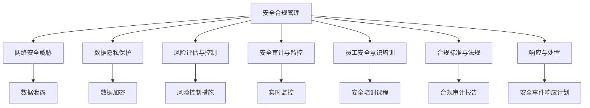

                 

# 安全管理：确保workplace安全和合规

> 关键词：
1. 安全合规管理
2. 网络安全威胁
3. 数据隐私保护
4. 风险评估与控制
5. 安全审计与监控
6. 员工安全意识培训
7. 合规标准与法规

## 1. 背景介绍

随着数字化转型的深入，企业对IT系统的依赖日益增强，安全风险和合规要求也越来越高。如何有效管理这些风险，确保工作场所的安全与合规，成为每个企业都必须面对的重要问题。

### 1.1 问题由来

网络攻击、数据泄露等安全事件频发，给企业带来了巨大的损失。同时，随着数据隐私法规如GDPR、CCPA等在各国陆续实施，企业需应对日益严格的合规要求。安全管理和合规工作往往涉及多部门协作，工作量大且复杂，企业亟需一套系统化、标准化的管理框架。

### 1.2 问题核心关键点

1. **风险评估与控制**：识别和评估安全风险，制定相应的控制措施。
2. **安全审计与监控**：定期进行安全审计，实时监控网络安全状态。
3. **员工安全意识培训**：提高员工安全意识，预防人为疏漏造成的安全事故。
4. **合规标准与法规**：遵守相关法规，确保数据隐私保护。
5. **响应与处置**：在安全事件发生时，能够快速响应和处置，最小化影响。

## 2. 核心概念与联系

### 2.1 核心概念概述

为更好地理解企业安全管理的工作原理和优化方向，本节将介绍几个密切相关的核心概念：

- **安全合规管理**：指通过一系列管理措施，确保企业遵守法律法规，保护数据隐私，避免安全风险的过程。
- **网络安全威胁**：指能够对企业网络系统造成破坏、数据泄露、业务中断等危害的网络攻击、病毒、恶意软件等。
- **数据隐私保护**：指通过技术和管理手段，确保企业数据不被未授权访问和泄露的过程。
- **风险评估与控制**：指识别潜在的安全风险，评估其影响程度，并采取相应措施以降低风险的过程。
- **安全审计与监控**：指定期对企业安全系统进行检查和监控，确保安全策略的实施效果。
- **员工安全意识培训**：指通过培训提高员工对网络安全重要性的认识，教授防范措施，减少人为错误。
- **合规标准与法规**：指企业需要遵守的法律法规和行业标准，如GDPR、CCPA等。
- **响应与处置**：指在安全事件发生后，快速响应和处置，最小化影响。

这些核心概念之间的逻辑关系可以通过以下Mermaid流程图来展示：



这个流程图展示了一系列安全管理流程及其相互关系：

1. 安全合规管理是整个安全管理的核心，涵盖多个方面的工作。
2. 网络安全威胁识别和数据隐私保护是安全管理的重点，通过技术和管理手段进行防护。
3. 风险评估与控制、安全审计与监控、员工安全意识培训、合规标准与法规、响应与处置等环节相互支撑，共同构建安全管理框架。

## 3. 核心算法原理 & 具体操作步骤
### 3.1 算法原理概述

企业安全管理涉及多个环节，包括风险评估、安全审计、合规检查等。这些环节需要借助算法和工具进行高效处理。以下是几个核心算法的原理概述：

- **风险评估算法**：通过评估资产价值、威胁频率和漏洞严重性，计算安全风险得分。
- **安全审计算法**：定期对系统和网络进行扫描和检查，发现并修复漏洞。
- **合规检查算法**：比对企业操作与合规标准，识别违规行为。
- **响应与处置算法**：在安全事件发生时，自动触发响应和处置流程，恢复系统正常运行。

### 3.2 算法步骤详解

以下是几个核心算法的详细步骤：

**3.2.1 风险评估算法**

1. **资产识别**：识别企业内部所有IT资产，包括服务器、网络设备、应用系统等。
2. **威胁识别**：分析各类网络攻击和恶意软件的特征，建立威胁库。
3. **漏洞识别**：通过漏洞扫描工具，发现系统和网络中的已知漏洞。
4. **风险计算**：根据资产价值、威胁频率、漏洞严重性等因素，计算每个资产的风险得分。
5. **风险分析**：将各资产的风险得分进行加权求和，得到企业的整体风险评估结果。

**3.2.2 安全审计算法**

1. **扫描策略制定**：根据企业网络结构和安全需求，制定审计策略。
2. **系统扫描**：使用漏洞扫描工具，对企业网络进行全面扫描。
3. **漏洞分析**：对扫描结果进行分析，确定高危漏洞。
4. **修复建议**：生成修复建议，指导系统管理员进行补丁安装和配置优化。
5. **审计报告生成**：生成审计报告，记录扫描结果、修复情况等。

**3.2.3 合规检查算法**

1. **合规标准获取**：收集和理解企业需要遵守的法律法规和行业标准，如GDPR、CCPA等。
2. **合规评估**：对比企业操作与合规标准，识别违规行为。
3. **违规分析**：分析违规原因，提出改进建议。
4. **合规报告生成**：生成合规报告，记录合规检查结果。

**3.2.4 响应与处置算法**

1. **事件监测**：部署网络监控工具，实时监测网络流量和系统状态。
2. **事件分析**：对监测结果进行分析，确定是否为安全事件。
3. **事件响应**：根据预定义的安全事件响应流程，自动启动相应措施。
4. **事件处置**：执行具体的响应措施，如隔离受影响系统、通知相关人员等。
5. **事件报告**：生成事件报告，记录事件发生时间、原因、处置结果等。

### 3.3 算法优缺点

**3.3.1 风险评估算法的优缺点**

- **优点**：
  - 通过综合考虑资产价值、威胁频率、漏洞严重性，能够更全面地评估安全风险。
  - 提供风险得分，方便进行优先级排序和资源分配。

- **缺点**：
  - 需要持续更新威胁库和漏洞库，工作量较大。
  - 依赖于扫描工具的准确性和全面性。

**3.3.2 安全审计算法的优缺点**

- **优点**：
  - 定期扫描和修复漏洞，保障系统安全性。
  - 生成审计报告，记录扫描结果和修复情况。

- **缺点**：
  - 依赖于工具的扫描能力和技术水平。
  - 需定期执行，工作量大。

**3.3.3 合规检查算法的优缺点**

- **优点**：
  - 确保企业操作符合法律法规和行业标准。
  - 提供合规报告，及时识别并纠正违规行为。

- **缺点**：
  - 需要持续更新合规标准，工作量大。
  - 可能存在遗漏和误报。

**3.3.4 响应与处置算法的优缺点**

- **优点**：
  - 实时监测和响应安全事件，保障系统稳定运行。
  - 自动化执行预定义的响应措施，提升响应效率。

- **缺点**：
  - 依赖于监测工具的准确性和响应策略的合理性。
  - 需定期更新响应策略，工作量大。

### 3.4 算法应用领域

安全管理和合规检查算法已经在多个领域得到了广泛应用，例如：

- **金融行业**：面对高额罚款和声誉损失风险，金融企业需要严格遵守法规，保护客户数据安全。
- **医疗行业**：医疗数据隐私敏感，需通过安全管理和合规检查确保数据不被未授权访问。
- **政府机构**：政府数据涉及公共安全和公民隐私，需要严格的安全管理和合规检查。
- **教育机构**：学生数据和教育信息需要保护，需制定完善的安全管理策略。
- **科技公司**：科技公司需不断创新，同时确保数据安全，遵守相关法规。

除了这些领域，安全管理和合规检查在更多行业都有广泛应用，保障企业数据安全和合规经营。

## 4. 数学模型和公式 & 详细讲解  
### 4.1 数学模型构建

企业安全管理涉及多个数学模型，以下介绍几个核心模型的构建。

**4.1.1 风险评估模型**

- **资产价值**：$V_i$，表示资产对企业的价值。
- **威胁频率**：$T_i$，表示威胁发生的频率。
- **漏洞严重性**：$C_i$，表示漏洞的严重性。
- **风险得分**：$R_i$，表示资产$i$的风险得分。

风险得分计算公式如下：

$$
R_i = V_i \times T_i \times C_i
$$

**4.1.2 安全审计模型**

- **扫描策略**：$S$，表示审计策略。
- **漏洞数量**：$N$，表示扫描发现的漏洞数量。
- **修复建议数量**：$M$，表示生成的修复建议数量。
- **审计报告**：$R$，表示审计报告。

审计报告生成公式如下：

$$
R = S \times N \times M
$$

**4.1.3 合规检查模型**

- **合规标准**：$C$，表示合规标准。
- **违规数量**：$B$，表示违规数量。
- **违规原因**：$O$，表示违规原因。
- **合规报告**：$R$，表示合规报告。

合规报告生成公式如下：

$$
R = C \times B \times O
$$

**4.1.4 响应与处置模型**

- **事件监测**：$E$，表示事件监测工具。
- **事件数量**：$I$，表示监测到的事件数量。
- **响应时间**：$T$，表示事件响应时间。
- **处置结果**：$R$，表示事件处置结果。
- **事件报告**：$R$，表示事件报告。

事件报告生成公式如下：

$$
R = E \times I \times T \times R
$$

### 4.2 公式推导过程

以下对几个核心模型的公式推导过程进行详细讲解：

**4.2.1 风险评估模型推导**

根据风险评估公式，风险得分$R_i$的推导如下：

$$
R_i = V_i \times T_i \times C_i
$$

将风险得分$R_i$代入风险分析公式，得到企业的整体风险评估结果$R$：

$$
R = \sum_{i=1}^n R_i
$$

**4.2.2 安全审计模型推导**

根据安全审计公式，审计报告$R$的推导如下：

$$
R = S \times N \times M
$$

**4.2.3 合规检查模型推导**

根据合规检查公式，合规报告$R$的推导如下：

$$
R = C \times B \times O
$$

**4.2.4 响应与处置模型推导**

根据响应与处置公式，事件报告$R$的推导如下：

$$
R = E \times I \times T \times R
$$

### 4.3 案例分析与讲解

**4.3.1 风险评估案例**

某企业需要对公司的所有IT资产进行风险评估。公司共有100台服务器，5000台计算机，200个网络设备。根据威胁库，威胁频率为0.1次/周，漏洞库中发现了10个高危漏洞。

根据风险评估模型，计算每个资产的风险得分：

$$
R_{\text{服务器}} = 100 \times 0.1 \times 10 = 100
$$

$$
R_{\text{计算机}} = 5000 \times 0.1 \times 10 = 5000
$$

$$
R_{\text{网络设备}} = 200 \times 0.1 \times 10 = 200
$$

将各资产的风险得分进行加权求和，得到企业的整体风险评估结果：

$$
R = 100 \times 0.2 + 5000 \times 0.5 + 200 \times 0.3 = 5000
$$

根据风险评估结果，企业需要重点关注高风险资产，分配更多资源进行防护。

**4.3.2 安全审计案例**

某企业需要对公司的网络系统进行安全审计。审计策略为每年两次，使用漏洞扫描工具扫描发现50个漏洞，生成20个修复建议。

根据安全审计模型，计算审计报告的生成情况：

$$
R = 2 \times 50 \times 20 = 2000
$$

生成审计报告，记录扫描结果和修复情况，供企业管理层审查。

**4.3.3 合规检查案例**

某企业需要对公司的数据处理流程进行合规检查。需遵守GDPR法规，合规标准为：数据必须加密传输，数据存储不得超过5年。发现5个违规行为，分别为：

- 数据未加密传输；
- 数据存储时间超过5年；
- 数据未授权访问；
- 数据未备份；
- 数据未加密存储。

根据合规检查模型，计算合规报告的生成情况：

$$
R = 5 \times 3 \times 3 = 45
$$

生成合规报告，记录违规行为和改进建议，供企业各部门参考。

**4.3.4 响应与处置案例**

某企业的网络系统发生安全事件，部署网络监控工具监测到异常流量。事件发生时间为12点，响应时间为15分钟，处置结果为成功恢复系统正常运行。

根据响应与处置模型，计算事件报告的生成情况：

$$
R = 1 \times 5 \times 15 \times 1 = 75
$$

生成事件报告，记录事件发生时间、原因、响应时间、处置结果，供后续分析和改进。

## 5. 项目实践：代码实例和详细解释说明
### 5.1 开发环境搭建

在进行安全管理项目实践前，我们需要准备好开发环境。以下是使用Python进行企业安全管理系统开发的环境配置流程：

1. 安装Python：确保系统已安装Python，并设置环境变量。
2. 安装Django框架：使用pip安装Django，用于创建Web应用。
3. 安装第三方库：安装企业安全管理所需的各种第三方库，如SQLite、NLTK、Pandas等。

### 5.2 源代码详细实现

这里我们以企业安全管理系统的风险评估模块为例，给出使用Django框架的Python代码实现。

**风险评估模块代码**：

```python
from django.db import models
from django.contrib.auth.models import User

class Asset(models.Model):
    name = models.CharField(max_length=255)
    value = models.DecimalField(max_digits=10, decimal_places=2)
    threat_frequency = models.DecimalField(max_digits=10, decimal_places=2)
    vulnerability_severity = models.CharField(max_length=255)
    
class Risk(models.Model):
    asset = models.ForeignKey(Asset, on_delete=models.CASCADE)
    risk_score = models.DecimalField(max_digits=10, decimal_places=2)

class RiskAssessment(models.Model):
    user = models.ForeignKey(User, on_delete=models.CASCADE)
    assets = models.ManyToManyField(Asset)
    risk_scores = models.ManyToManyField(Risk)

    def calculate_risk_scores(self):
        for asset in self.assets.all():
            risk_score = asset.value * asset.threat_frequency * asset.vulnerability_severity
            asset.risk_score = risk_score
            asset.save()

    def get_total_risk_score(self):
        total_score = 0
        for risk in self.risk_scores.all():
            total_score += risk.risk_score
        return total_score
```

**风险评估模块解释**：

- **Asset模型**：表示资产，包括资产名称、价值、威胁频率和漏洞严重性。
- **Risk模型**：表示风险得分，每个资产有一个风险得分。
- **RiskAssessment模型**：表示风险评估，包括用户、涉及的资产和风险得分。
- **calculate_risk_scores方法**：计算风险评估中每个资产的风险得分，并保存到数据库。
- **get_total_risk_score方法**：计算整个风险评估的总风险得分。

### 5.3 代码解读与分析

让我们再详细解读一下关键代码的实现细节：

**Asset模型**：
- `name`字段：资产名称，用于记录和查询。
- `value`字段：资产价值，用于计算风险得分。
- `threat_frequency`字段：威胁频率，用于计算风险得分。
- `vulnerability_severity`字段：漏洞严重性，用于计算风险得分。

**Risk模型**：
- `asset`字段：与Asset模型关联，表示风险所属的资产。
- `risk_score`字段：风险得分，用于评估资产的风险程度。

**RiskAssessment模型**：
- `user`字段：与User模型关联，表示风险评估的用户。
- `assets`字段：与Asset模型关联，表示涉及的资产。
- `risk_scores`字段：与Risk模型关联，表示风险得分。

**calculate_risk_scores方法**：
- 循环遍历涉及的每个资产，计算其风险得分，并保存到数据库。
- 更新资产的`risk_score`字段，确保其准确反映风险评估结果。

**get_total_risk_score方法**：
- 循环遍历所有风险得分，计算总风险得分，返回结果。
- 用于查询整个风险评估的总风险得分。

以上代码展示了Django框架中企业安全管理系统的一个风险评估模块的实现。可以看到，通过Django模型定义，可以方便地将数据存储在数据库中，并方便地进行数据管理和查询。

当然，在实际项目中，还需要结合前端技术如HTML、CSS、JavaScript等，开发友好的用户界面，方便企业管理者进行风险评估和监控。

## 6. 实际应用场景
### 6.1 智能客服系统

企业安全管理中的智能客服系统，可以通过语音识别和自然语言处理技术，实现自动化客户服务。例如，语音识别模块可以实时转录客户电话对话，通过自然语言处理分析客户情感和需求，快速响应客户问题，减少人工客服的工作量。

智能客服系统需要实时处理大量客户对话数据，进行语音识别和自然语言处理。在安全方面，需要确保客户数据不被未授权访问，同时遵守相关法规。通过风险评估和合规检查，保障智能客服系统的安全性。

### 6.2 金融数据保护

金融行业数据隐私敏感，需严格保护客户信息和交易数据。通过安全管理和合规检查，确保金融数据在传输、存储和处理过程中的安全性和合规性。

企业需对金融数据进行加密传输和存储，定期进行安全审计，发现和修复漏洞。同时，遵守GDPR等法规，确保数据隐私保护，避免客户数据泄露。

### 6.3 企业网络安全

企业网络安全是企业安全管理的重要组成部分。通过部署网络监控和入侵检测系统，实时监测网络流量，及时发现和响应安全事件。

企业网络安全需要定期进行安全审计，发现并修复漏洞，确保网络设备的安全性和合规性。同时，对关键数据进行加密和备份，保障数据安全和业务连续性。

### 6.4 未来应用展望

未来，随着人工智能和大数据分析技术的发展，企业安全管理将更加智能化和自动化。例如，通过机器学习技术，可以预测潜在的安全威胁和攻击方式，提前采取防范措施。同时，通过大数据分析，可以发现异常行为和数据泄露，及时响应和处置。

企业安全管理还将与其他新兴技术结合，如区块链、量子加密等，提升数据安全性和隐私保护水平。通过不断创新，企业安全管理将更加全面、高效和智能，为企业的数字化转型提供坚实保障。

## 7. 工具和资源推荐
### 7.1 学习资源推荐

为帮助开发者系统掌握企业安全管理的理论基础和实践技巧，这里推荐一些优质的学习资源：

1. 《网络安全基础》系列课程：由知名安全专家讲授，涵盖网络安全基础、入侵检测、风险评估等内容。
2. 《数据隐私保护》系列书籍：系统介绍数据隐私保护的原理和实践，包括GDPR、CCPA等法规的解读。
3. 《安全管理与合规》视频课程：由安全管理专家讲授，涵盖安全管理框架、风险评估、合规检查等内容。
4. 《Web应用安全》书籍：全面介绍Web应用安全原理和实践，包括XSS、SQL注入等常见攻击的防御方法。
5. 《网络安全实战》在线课程：结合实战案例，讲解网络安全防护、响应处置等实际应用场景。

通过对这些资源的学习实践，相信你一定能够快速掌握企业安全管理的精髓，并用于解决实际的安全问题。

### 7.2 开发工具推荐

高效的开发离不开优秀的工具支持。以下是几款用于企业安全管理开发的常用工具：

1. Django框架：Python Web开发框架，用于快速构建安全管理Web应用。
2. SQLite数据库：轻量级数据库，适用于企业安全管理系统的小规模数据存储。
3. NLTK库：Python自然语言处理库，用于语音识别和自然语言处理。
4. Elasticsearch：分布式搜索引擎，用于存储和检索大量日志数据。
5. Wireshark：网络协议分析工具，用于实时监测网络流量。

合理利用这些工具，可以显著提升企业安全管理系统的开发效率，加快创新迭代的步伐。

### 7.3 相关论文推荐

企业安全管理领域的研究已经积累了丰富的成果，以下是几篇经典论文，推荐阅读：

1. "A Framework for Enterprise Security Management"：提出企业安全管理的框架，涵盖风险评估、安全审计、合规检查等内容。
2. "Security Auditing and Compliance in the Age of Big Data"：讨论大数据时代的安全审计和合规检查，提出新的方法和工具。
3. "Towards an Automated Security Compliance System"：介绍基于机器学习的安全合规系统，提高合规检查的自动化和智能化水平。
4. "Secure Data Handling in Financial Systems"：讨论金融行业的数据安全保护，提出具体的数据加密、备份和审计方法。
5. "Real-time Threat Detection and Response in Enterprise Networks"：介绍实时威胁检测和响应技术，保障企业网络安全。

这些论文代表了大数据时代企业安全管理的最新进展，通过学习这些前沿成果，可以帮助研究者把握学科前进方向，激发更多的创新灵感。

## 8. 总结：未来发展趋势与挑战
### 8.1 总结

本文对企业安全管理进行了全面系统的介绍。首先阐述了企业安全管理的工作原理和优化方向，明确了风险评估、安全审计、合规检查、响应与处置等环节的关键作用。其次，从原理到实践，详细讲解了企业安全管理各环节的算法和操作步骤，给出了具体的代码实现示例。最后，探讨了企业安全管理在智能客服、金融数据保护、企业网络安全等多个领域的实际应用，展示了其广阔的应用前景。

通过本文的系统梳理，可以看到，企业安全管理是一个系统化、标准化的过程，涉及多个环节和技术的协同工作。只有在数据、技术、管理等多个层面全面优化，才能构建高效、安全、合规的企业安全管理体系。未来，随着人工智能、大数据、区块链等技术的融合发展，企业安全管理将更加智能化、自动化和协同化。

### 8.2 未来发展趋势

展望未来，企业安全管理将呈现以下几个发展趋势：

1. **智能化和自动化**：通过引入人工智能和大数据分析技术，实现自动化安全防护和威胁检测，提高响应效率和准确性。
2. **协同化**：结合多部门、多团队的力量，实现跨领域的安全管理和风险评估。
3. **云计算和边缘计算**：通过云平台和边缘计算技术，提升安全管理的灵活性和实时性。
4. **区块链技术**：利用区块链技术的不可篡改性和分布式特性，提升数据安全和隐私保护水平。
5. **零信任架构**：实现从设备到用户的全方位安全防护，提升整体安全水平。

这些趋势凸显了企业安全管理的未来方向，将为企业提供更加全面、智能和可靠的安全保障。

### 8.3 面临的挑战

尽管企业安全管理取得了一定的进展，但在迈向更加智能化、普适化应用的过程中，仍面临诸多挑战：

1. **技术复杂性**：多领域、多技术的融合，增加了安全管理的复杂性，需要系统化的设计和实施。
2. **数据隐私和安全**：随着数据泄露事件的频发，如何有效保护数据隐私和安全，成为一大难题。
3. **跨部门协作**：安全管理涉及多个部门，需要加强沟通协作，提升整体安全水平。
4. **人才短缺**：安全管理需要具备多种技能的专业人才，企业需投入大量人力进行培训。
5. **法规变化**：法规和标准的快速变化，增加了合规管理的难度，需要及时更新和适应。

正视安全管理面临的这些挑战，积极应对并寻求突破，将是大数据时代企业安全管理的重要方向。

### 8.4 研究展望

面对企业安全管理所面临的挑战，未来的研究需要在以下几个方面寻求新的突破：

1. **技术创新**：引入新兴技术如人工智能、大数据、区块链等，提升安全管理的智能化和自动化水平。
2. **跨领域融合**：结合业务需求和安全管理，实现多领域、多技术的协同工作，提升整体安全防护能力。
3. **数据隐私保护**：引入隐私保护技术如差分隐私、联邦学习等，提升数据安全和隐私保护水平。
4. **自动化管理**：引入自动化工具和流程，减少人为干预，提升安全管理的效率和准确性。
5. **法规合规**：研究如何自动化合规管理，及时更新和适应法规变化，确保企业合规经营。

这些研究方向的探索，必将引领企业安全管理技术的持续演进，为企业的数字化转型提供坚实的安全保障。

## 9. 附录：常见问题与解答

**Q1：企业安全管理的主要工作有哪些？**

A: 企业安全管理的主要工作包括风险评估、安全审计、合规检查、响应与处置等环节。通过这些环节，企业可以全面、系统地保障其信息系统的安全和合规性。

**Q2：如何应对大规模数据的安全管理需求？**

A: 针对大规模数据的安全管理需求，企业可以采用分布式数据库、分布式存储、大数据分析等技术，提升数据管理的效率和安全性。同时，可以引入区块链技术，保障数据的不可篡改性和完整性。

**Q3：企业如何应对数据泄露事件？**

A: 应对数据泄露事件，企业应采取以下措施：
1. 立即断开受影响的系统，防止数据进一步泄露。
2. 确认数据泄露的范围和影响。
3. 立即通知相关监管机构和受影响的用户。
4. 分析泄露原因，采取相应的防范措施。
5. 进行风险评估和合规检查，确保数据保护机制的完善性。

**Q4：企业安全管理中应如何应用区块链技术？**

A: 企业安全管理中应用区块链技术，可以从以下方面入手：
1. 数据加密：利用区块链的不可篡改性，实现数据加密和保护。
2. 身份认证：通过区块链的分布式账本，实现用户身份认证和访问控制。
3. 审计和溯源：记录和查询数据访问日志，实现数据的追溯和审计。
4. 智能合约：结合智能合约技术，实现自动化合规检查和审计。

**Q5：如何提升企业安全管理的自动化水平？**

A: 提升企业安全管理的自动化水平，可以从以下方面入手：
1. 引入自动化安全防护工具，如入侵检测系统、威胁检测系统等。
2. 利用机器学习和大数据分析技术，实现自动化威胁检测和响应。
3. 引入自动化审计和合规工具，实现自动化合规检查和报告生成。
4. 结合人工智能技术，实现自动化风险评估和控制。

通过这些措施，企业可以显著提升安全管理的自动化水平，减少人工干预，提高安全管理的效率和效果。

---

作者：禅与计算机程序设计艺术 / Zen and the Art of Computer Programming

