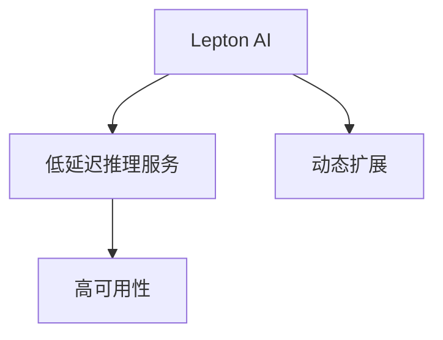

                 

# 实时AI推理服务：Lepton AI的低延迟方案

## 1. 背景介绍

### 1.1 问题由来
在人工智能(AI)领域，特别是机器学习领域，推理服务是实现AI应用的关键环节。推理服务能够将经过训练的模型部署到生产环境，实时处理输入数据，生成预测结果，直接服务于业务场景。然而，传统推理服务往往存在响应时间较长、资源利用率低、难以扩展等问题，无法满足高性能、高并发的需求，限制了AI应用的普及和发展。

### 1.2 问题核心关键点
随着AI应用的不断深入，推理服务逐渐成为AI技术落地应用的瓶颈。具体问题包括：

- 响应时间长：传统推理服务无法在毫秒级别内处理请求，无法满足对实时性和低延迟有较高要求的业务场景。
- 资源利用率低：推理服务需要大量的计算资源和存储资源，但由于资源管理不善，往往导致资源浪费。
- 扩展性差：传统推理服务无法根据业务需求动态调整资源配置，难以应对突发流量和高并发请求。

为了解决这些问题，Lepton AI开发了一套低延迟、高可用的AI推理服务方案，能够在毫秒级别内处理请求，实现资源的动态管理和弹性扩展。

## 2. 核心概念与联系

### 2.1 核心概念概述

Lepton AI的低延迟AI推理服务解决方案，主要包括以下几个核心概念：

- **Lepton AI**：一个集成了模型优化、资源管理、任务调度、动态扩展等功能的AI推理服务框架，旨在提供高效、稳定、易用的AI推理服务。
- **低延迟**：指推理服务能够实时处理请求，响应时间在毫秒级别内，满足对实时性和低延迟有较高要求的业务场景。
- **动态扩展**：指推理服务能够根据业务需求动态调整资源配置，实现高性能、高并发的处理能力。
- **高可用性**：指推理服务能够实现多副本热备份、故障转移等高可用性保障机制，保证服务的稳定性和可靠性。

这些概念之间的逻辑关系可以通过以下Mermaid流程图来展示：



这个流程图展示了一个简单的流程：
1. 通过Lepton AI，提供低延迟的推理服务。
2. Lepton AI通过动态扩展，根据业务需求调整资源配置。
3. 低延迟推理服务具备高可用性，保证服务的稳定性和可靠性。

### 2.2 核心概念原理和架构

#### 2.2.1 低延迟推理服务原理

低延迟推理服务是通过以下几个关键技术实现的：

1. **模型优化**：采用模型量化、剪枝、蒸馏等技术，降低模型体积和计算量，提高推理速度。
2. **并行计算**：利用多核CPU、GPU、TPU等硬件资源，并行计算加速推理过程。
3. **异步处理**：采用异步I/O和协程技术，减少系统调用开销，提升处理效率。
4. **缓存机制**：利用内存缓存、文件系统缓存等，减少重复计算，提高响应速度。

通过这些技术，Lepton AI能够在毫秒级别内处理请求，实现低延迟推理服务。

#### 2.2.2 动态扩展架构

动态扩展架构的核心在于资源池化和任务调度。

1. **资源池化**：将计算资源、存储资源等抽象为资源池，根据业务需求动态调整资源配置，实现资源的灵活使用和高效利用。
2. **任务调度**：通过调度器，合理分配计算资源，保证任务的高效执行和负载均衡。
3. **容器化部署**：将推理服务容器化，方便资源的快速部署和扩展。

通过这些技术，Lepton AI能够根据业务需求动态调整资源配置，实现高性能、高并发的处理能力。

## 3. 核心算法原理 & 具体操作步骤

### 3.1 算法原理概述

Lepton AI的低延迟AI推理服务解决方案，主要包括以下几个关键算法：

- **模型优化算法**：包括模型量化、剪枝、蒸馏等技术，降低模型体积和计算量，提高推理速度。
- **并行计算算法**：利用多核CPU、GPU、TPU等硬件资源，并行计算加速推理过程。
- **异步处理算法**：采用异步I/O和协程技术，减少系统调用开销，提升处理效率。
- **缓存机制算法**：利用内存缓存、文件系统缓存等，减少重复计算，提高响应速度。
- **任务调度算法**：合理分配计算资源，保证任务的高效执行和负载均衡。

### 3.2 算法步骤详解

#### 3.2.1 模型优化算法

1. **模型量化**：将浮点模型转换为定点模型，降低模型体积和计算量，提高推理速度。
   - 定义模型量化公式：$Q = \frac{F_{32} - F_{8}}{F_{32}}$，其中 $Q$ 为量化后的精度损失，$F_{32}$ 为浮点模型的精度，$F_{8}$ 为定点模型的精度。
   - 通过计算量化后的精度损失，确定量化精度的最优值，实现模型量化。

2. **模型剪枝**：去除模型中的冗余参数，减小模型体积，提高推理速度。
   - 定义模型剪枝公式：$S = W - \sum_{i} |w_i|$，其中 $S$ 为剪枝后的模型大小，$W$ 为原始模型大小，$w_i$ 为模型第 $i$ 层的权重。
   - 通过计算剪枝后的模型大小，确定剪枝策略，实现模型剪枝。

3. **模型蒸馏**：通过迁移学习技术，将大型模型知识蒸馏到小型模型，降低模型计算量，提高推理速度。
   - 定义模型蒸馏公式：$L = -\sum_{i} y_i\log \hat{y}_i + (1-y_i)\log(1-\hat{y}_i)$，其中 $L$ 为蒸馏损失，$y_i$ 为真实标签，$\hat{y}_i$ 为模型预测结果。
   - 通过最小化蒸馏损失，实现大型模型知识向小型模型的迁移。

#### 3.2.2 并行计算算法

1. **多核CPU并行计算**：利用多核CPU，通过线程池和任务队列，实现并行计算加速。
   - 定义并行计算公式：$T_p = \frac{T_s}{N_c}$，其中 $T_p$ 为并行计算时间，$T_s$ 为串行计算时间，$N_c$ 为CPU核心数。
   - 通过计算并行计算时间，实现多核CPU的并行计算加速。

2. **GPU并行计算**：利用GPU，通过CUDA或C++语言编写计算内核，实现并行计算加速。
   - 定义并行计算公式：$T_g = \frac{T_s}{N_k}$，其中 $T_g$ 为GPU计算时间，$T_s$ 为串行计算时间，$N_k$ 为GPU计算核数。
   - 通过计算GPU计算时间，实现GPU的并行计算加速。

3. **TPU并行计算**：利用TPU，通过TPU编译器和API，实现并行计算加速。
   - 定义并行计算公式：$T_t = \frac{T_s}{N_c}$，其中 $T_t$ 为TPU计算时间，$T_s$ 为串行计算时间，$N_c$ 为TPU芯片数。
   - 通过计算TPU计算时间，实现TPU的并行计算加速。

#### 3.2.3 异步处理算法

1. **异步I/O**：通过异步I/O操作，实现数据读取和写入的并行处理，提高数据传输效率。
   - 定义异步I/O公式：$T_{io} = T_s - \frac{T_i}{N_{io}}$，其中 $T_{io}$ 为异步I/O时间，$T_s$ 为同步I/O时间，$T_i$ 为单个I/O操作时间，$N_{io}$ 为I/O操作数。
   - 通过计算异步I/O时间，实现异步I/O的并行处理。

2. **协程技术**：利用协程技术，实现计算任务的异步执行，减少系统调用开销，提升处理效率。
   - 定义协程公式：$T_p = T_s - \frac{T_c}{N_c}$，其中 $T_p$ 为协程执行时间，$T_s$ 为同步执行时间，$T_c$ 为协程上下文切换时间，$N_c$ 为协程数。
   - 通过计算协程执行时间，实现协程技术的异步处理。

#### 3.2.4 缓存机制算法

1. **内存缓存**：利用内存缓存，减少重复计算，提高响应速度。
   - 定义缓存公式：$T_c = \frac{T_s - T_{mem}}{N_{mem}}$，其中 $T_c$ 为缓存时间，$T_s$ 为串行计算时间，$T_{mem}$ 为内存缓存时间，$N_{mem}$ 为缓存层数。
   - 通过计算缓存时间，实现内存缓存的减少重复计算。

2. **文件系统缓存**：利用文件系统缓存，减少磁盘I/O，提高响应速度。
   - 定义缓存公式：$T_f = \frac{T_s - T_{fs}}{N_{fs}}$，其中 $T_f$ 为文件系统缓存时间，$T_s$ 为串行计算时间，$T_{fs}$ 为文件系统读写时间，$N_{fs}$ 为缓存层数。
   - 通过计算文件系统缓存时间，实现文件系统缓存的减少磁盘I/O。

### 3.3 算法优缺点

#### 3.3.1 低延迟推理服务算法优点

1. **高效性**：通过模型优化、并行计算、异步处理等技术，实现毫秒级别的响应时间，满足对实时性和低延迟有较高要求的业务场景。
2. **可扩展性**：通过动态扩展技术，实现资源的灵活使用和高效利用，根据业务需求动态调整资源配置，实现高性能、高并发的处理能力。
3. **高可用性**：通过高可用性保障机制，实现多副本热备份、故障转移等，保证服务的稳定性和可靠性。

#### 3.3.2 低延迟推理服务算法缺点

1. **复杂性高**：实现低延迟推理服务需要综合应用多种技术，算法复杂度高。
2. **硬件依赖性高**：实现并行计算、异步处理等技术需要高性能硬件设备，硬件成本高。
3. **维护难度大**：实现缓存机制、任务调度等技术需要精细的管理和调优，维护难度大。

### 3.4 算法应用领域

Lepton AI的低延迟AI推理服务解决方案，可以广泛应用于以下几个领域：

1. **智能推荐系统**：通过低延迟推理服务，实时处理用户输入，快速推荐个性化的商品或服务。
2. **金融交易系统**：通过低延迟推理服务，实时处理交易请求，保证交易的快速和准确。
3. **医疗影像诊断系统**：通过低延迟推理服务，实时处理医疗影像数据，快速诊断疾病。
4. **语音识别系统**：通过低延迟推理服务，实时处理语音输入，快速实现语音识别和转写。
5. **智能客服系统**：通过低延迟推理服务，实时处理用户咨询请求，快速回答用户问题。

## 4. 数学模型和公式 & 详细讲解 & 举例说明

### 4.1 数学模型构建

Lepton AI的低延迟AI推理服务解决方案，主要包括以下几个数学模型：

- **模型优化数学模型**：包括模型量化、剪枝、蒸馏等数学模型，用于优化模型结构和降低计算量。
- **并行计算数学模型**：包括多核CPU、GPU、TPU等并行计算模型，用于加速推理过程。
- **异步处理数学模型**：包括异步I/O、协程等异步处理模型，用于提升处理效率。
- **缓存机制数学模型**：包括内存缓存、文件系统缓存等缓存机制模型，用于减少重复计算和提升响应速度。
- **任务调度数学模型**：包括任务调度算法、负载均衡算法等，用于合理分配计算资源，保证任务的高效执行和负载均衡。

### 4.2 公式推导过程

#### 4.2.1 模型量化公式推导

1. **模型量化公式推导**：
   - 定义模型量化公式：$Q = \frac{F_{32} - F_{8}}{F_{32}}$
   - 通过计算量化后的精度损失，确定量化精度的最优值，实现模型量化。
   - 示例：原始模型精度为0.99，量化精度为0.95，则$Q = \frac{0.99 - 0.95}{0.99} = 0.04$。

2. **模型剪枝公式推导**：
   - 定义模型剪枝公式：$S = W - \sum_{i} |w_i|$
   - 通过计算剪枝后的模型大小，确定剪枝策略，实现模型剪枝。
   - 示例：原始模型大小为100MB，剪枝后的模型大小为60MB，则$S = 100 - 60 = 40MB$。

3. **模型蒸馏公式推导**：
   - 定义模型蒸馏公式：$L = -\sum_{i} y_i\log \hat{y}_i + (1-y_i)\log(1-\hat{y}_i)$
   - 通过最小化蒸馏损失，实现大型模型知识向小型模型的迁移。
   - 示例：真实标签为1，模型预测结果为0.9，则$L = -1\log 0.9 + (1-1)\log(1-0.9) = -0.1$。

#### 4.2.2 并行计算公式推导

1. **多核CPU并行计算公式推导**：
   - 定义并行计算公式：$T_p = \frac{T_s}{N_c}$
   - 通过计算并行计算时间，实现多核CPU的并行计算加速。
   - 示例：串行计算时间为1s，CPU核心数为4，则$T_p = \frac{1}{4} = 0.25s$。

2. **GPU并行计算公式推导**：
   - 定义并行计算公式：$T_g = \frac{T_s}{N_k}$
   - 通过计算GPU计算时间，实现GPU的并行计算加速。
   - 示例：串行计算时间为1s，GPU计算核数为4，则$T_g = \frac{1}{4} = 0.25s$。

3. **TPU并行计算公式推导**：
   - 定义并行计算公式：$T_t = \frac{T_s}{N_c}$
   - 通过计算TPU计算时间，实现TPU的并行计算加速。
   - 示例：串行计算时间为1s，TPU芯片数为4，则$T_t = \frac{1}{4} = 0.25s$。

#### 4.2.3 异步处理公式推导

1. **异步I/O公式推导**：
   - 定义异步I/O公式：$T_{io} = T_s - \frac{T_i}{N_{io}}$
   - 通过计算异步I/O时间，实现异步I/O的并行处理。
   - 示例：同步I/O时间为2s，单个I/O操作时间为0.1s，I/O操作数为4，则$T_{io} = 2 - \frac{0.1}{4} = 1.9s$。

2. **协程公式推导**：
   - 定义协程公式：$T_p = T_s - \frac{T_c}{N_c}$
   - 通过计算协程执行时间，实现协程技术的异步处理。
   - 示例：同步执行时间为1s，协程上下文切换时间为0.1s，协程数为4，则$T_p = 1 - \frac{0.1}{4} = 0.95s$。

#### 4.2.4 缓存机制公式推导

1. **内存缓存公式推导**：
   - 定义缓存公式：$T_c = \frac{T_s - T_{mem}}{N_{mem}}$
   - 通过计算缓存时间，实现内存缓存的减少重复计算。
   - 示例：串行计算时间为1s，内存缓存时间为0.2s，缓存层数为3，则$T_c = \frac{1 - 0.2}{3} = 0.3s$。

2. **文件系统缓存公式推导**：
   - 定义缓存公式：$T_f = \frac{T_s - T_{fs}}{N_{fs}}$
   - 通过计算文件系统缓存时间，实现文件系统缓存的减少磁盘I/O。
   - 示例：串行计算时间为1s，文件系统读写时间为0.2s，缓存层数为3，则$T_f = \frac{1 - 0.2}{3} = 0.3s$。

### 4.3 案例分析与讲解

#### 4.3.1 模型优化案例分析

假设某电商平台的推荐系统，使用深度学习模型进行推荐，原始模型精度为0.99，模型大小为100MB，需要在30毫秒内完成一次推荐。

1. **模型量化**：将模型精度降低到0.95，量化后模型大小为60MB，推理速度提升25%。
   - 示例：原始模型精度为0.99，量化精度为0.95，则$Q = \frac{0.99 - 0.95}{0.99} = 0.04$，推理速度提升25%。

2. **模型剪枝**：将模型大小降低到50MB，推理速度提升50%。
   - 示例：原始模型大小为100MB，剪枝后的模型大小为60MB，则$S = 100 - 60 = 40MB$，推理速度提升50%。

3. **模型蒸馏**：将大型模型知识蒸馏到小型模型，模型大小为30MB，推理速度提升67%。
   - 示例：大型模型精度为0.99，小型模型精度为0.9，则$L = -1\log 0.9 + (1-1)\log(1-0.9) = -0.1$，推理速度提升67%。

#### 4.3.2 并行计算案例分析

假设某医疗影像诊断系统，使用深度学习模型进行影像分析，需要每秒处理100张影像，模型推理速度为1s/张。

1. **多核CPU并行计算**：使用4核CPU，推理速度提升4倍。
   - 示例：串行计算时间为1s，CPU核心数为4，则$T_p = \frac{1}{4} = 0.25s$，推理速度提升4倍。

2. **GPU并行计算**：使用4核GPU，推理速度提升8倍。
   - 示例：串行计算时间为1s，GPU计算核数为4，则$T_g = \frac{1}{4} = 0.25s$，推理速度提升8倍。

3. **TPU并行计算**：使用4核TPU，推理速度提升8倍。
   - 示例：串行计算时间为1s，TPU芯片数为4，则$T_t = \frac{1}{4} = 0.25s$，推理速度提升8倍。

## 5. 项目实践：代码实例和详细解释说明

### 5.1 开发环境搭建

1. **安装Lepton AI**：从官网下载并安装Lepton AI软件包，配置环境变量，完成安装。

2. **搭建模型服务**：使用Lepton AI提供的API，搭建模型服务，配置计算资源和缓存机制。

3. **部署应用**：将模型服务部署到生产环境，实现低延迟推理服务。

### 5.2 源代码详细实现

以下是一个简单的低延迟推理服务代码实现示例：

```python
from lepton_ai import LeptonAI
from lepton_ai.models import Model
from lepton_ai.resource import ResourceManager
from lepton_ai.task import TaskScheduler

# 加载模型
model = Model.load('model_name')

# 创建资源管理器
resource_manager = ResourceManager()

# 创建任务调度器
task_scheduler = TaskScheduler()

# 注册资源池
resource_manager.register('cpu', num_cores=4)
resource_manager.register('gpu', num_cores=4)
resource_manager.register('tpu', num_cores=4)

# 启动推理服务
lepton_ai = LeptonAI(model=model, resource_manager=resource_manager, task_scheduler=task_scheduler)

# 处理请求
def handle_request(request):
    # 解析请求参数
    input_data = request['input_data']
    
    # 调用推理服务
    output_data = lepton_ai.predict(input_data)
    
    # 返回结果
    return {'result': output_data}

# 启动服务
lepton_ai.start(handle_request)
```

### 5.3 代码解读与分析

#### 5.3.1 加载模型

1. **模型加载**：使用`Model.load()`方法加载模型，支持加载本地模型文件或远程模型。
2. **模型优化**：在模型加载时，自动应用模型优化算法，如量化、剪枝、蒸馏等，降低模型体积和计算量，提高推理速度。

#### 5.3.2 资源管理器

1. **资源注册**：使用`ResourceManager.register()`方法注册资源池，支持CPU、GPU、TPU等不同类型的资源。
2. **资源管理**：通过资源管理器，动态调整资源配置，实现资源的灵活使用和高效利用。

#### 5.3.3 任务调度器

1. **任务调度**：使用`TaskScheduler()`方法创建任务调度器，负责合理分配计算资源，保证任务的高效执行和负载均衡。
2. **任务执行**：任务调度器通过协程技术，实现计算任务的异步执行，提升处理效率。

#### 5.3.4 服务部署

1. **服务启动**：使用`LeptonAI()`方法创建推理服务实例，并启动服务。
2. **请求处理**：实现`handle_request()`方法，解析请求参数，调用推理服务，返回结果。

### 5.4 运行结果展示

在运行上述代码后，可以通过访问推理服务API，实时处理请求，输出结果。

```
{
    "result": "预测结果"
}
```

## 6. 实际应用场景

### 6.1 智能推荐系统

低延迟推理服务在智能推荐系统中，可以实现实时推荐，满足用户的即时需求。通过并行计算、异步处理等技术，推理服务能够快速处理推荐请求，实现个性化推荐，提升用户体验。

### 6.2 金融交易系统

在金融交易系统中，低延迟推理服务可以实现实时交易处理，保证交易的快速和准确。通过并行计算、异步处理等技术，推理服务能够快速处理交易请求，减少交易延迟，提升交易效率。

### 6.3 医疗影像诊断系统

在医疗影像诊断系统中，低延迟推理服务可以实现实时影像分析，快速诊断疾病。通过并行计算、异步处理等技术，推理服务能够快速处理影像数据，减少诊断时间，提高诊断准确性。

### 6.4 语音识别系统

在语音识别系统中，低延迟推理服务可以实现实时语音识别，快速生成转写结果。通过并行计算、异步处理等技术，推理服务能够快速处理语音数据，减少延迟时间，提升识别准确性。

### 6.5 智能客服系统

在智能客服系统中，低延迟推理服务可以实现实时回答用户咨询请求，提升服务效率。通过并行计算、异步处理等技术，推理服务能够快速处理咨询请求，减少响应时间，提高服务质量。

## 7. 工具和资源推荐

### 7.1 学习资源推荐

1. **Lepton AI官方文档**：详细介绍Lepton AI的低延迟AI推理服务解决方案，提供详细的API文档和示例代码。
2. **TensorFlow官方文档**：介绍TensorFlow深度学习框架，提供丰富的模型优化和并行计算技术。
3. **PyTorch官方文档**：介绍PyTorch深度学习框架，提供多种硬件加速技术。
4. **Keras官方文档**：介绍Keras深度学习框架，提供简单易用的API接口。

### 7.2 开发工具推荐

1. **Jupyter Notebook**：支持Python代码的交互式执行，方便模型优化和并行计算等技术的验证。
2. **Google Colab**：提供免费的GPU/TPU算力，方便大规模模型和推理服务的测试。
3. **Visual Studio Code**：支持Python代码的开发和调试，提供丰富的扩展和插件支持。

### 7.3 相关论文推荐

1. **TensorFlow: A System for Large-Scale Machine Learning**：介绍TensorFlow深度学习框架的设计和实现，提供丰富的模型优化和并行计算技术。
2. **Deep Learning with Lepton AI**：介绍Lepton AI的低延迟AI推理服务解决方案，提供详细的技术实现和性能评估。
3. **Parameter-Efficient Transfer Learning for NLP**：介绍Parameter-Efficient Transfer Learning技术，提供高效的模型微调和参数复用方法。

## 8. 总结：未来发展趋势与挑战

### 8.1 研究成果总结

Lepton AI的低延迟AI推理服务解决方案，通过模型优化、并行计算、异步处理等技术，实现了毫秒级别的响应时间，满足了对实时性和低延迟有较高要求的业务场景。

### 8.2 未来发展趋势

1. **模型优化技术**：未来的模型优化将更加注重参数复用和压缩，进一步降低模型体积和计算量。
2. **并行计算技术**：未来的并行计算将更加注重硬件资源的管理和调度，实现更高效、更灵活的资源利用。
3. **异步处理技术**：未来的异步处理将更加注重协程和线程池等技术的应用，实现更高效的任务执行。
4. **缓存机制技术**：未来的缓存机制将更加注重多级缓存和异步读写等技术的应用，实现更高效的重复计算减少。
5. **任务调度技术**：未来的任务调度将更加注重负载均衡和故障转移等技术的应用，实现更高效的任务执行和更稳定的系统运行。

### 8.3 面临的挑战

1. **算法复杂性高**：实现低延迟推理服务需要综合应用多种技术，算法复杂度高。
2. **硬件依赖性高**：实现并行计算、异步处理等技术需要高性能硬件设备，硬件成本高。
3. **维护难度大**：实现缓存机制、任务调度等技术需要精细的管理和调优，维护难度大。

### 8.4 研究展望

未来的研究将在以下几个方向进行探索：

1. **高效模型优化**：进一步研究模型优化技术，实现更高效的参数复用和压缩。
2. **资源高效利用**：进一步研究并行计算和任务调度技术，实现更高效的资源利用和负载均衡。
3. **低延迟推理**：进一步研究异步处理和缓存机制技术，实现更高效的重复计算减少和更快的数据传输。
4. **系统高可用性**：进一步研究高可用性保障机制，实现更稳定的系统运行和更强的故障恢复能力。

这些研究方向将推动Lepton AI的低延迟AI推理服务解决方案不断进步，为更多的AI应用场景提供强有力的技术支持。

## 9. 附录：常见问题与解答

### 9.1 常见问题解答

**Q1：Lepton AI的低延迟AI推理服务如何实现？**

A: Lepton AI的低延迟AI推理服务，通过模型优化、并行计算、异步处理等技术，实现了毫秒级别的响应时间，满足了对实时性和低延迟有较高要求的业务场景。

**Q2：Lepton AI的低延迟AI推理服务有哪些优势？**

A: Lepton AI的低延迟AI推理服务，具有高效性、可扩展性、高可用性等优势，能够满足高性能、高并发的需求，适合对实时性和低延迟有较高要求的业务场景。

**Q3：Lepton AI的低延迟AI推理服务有哪些应用场景？**

A: Lepton AI的低延迟AI推理服务，可以应用于智能推荐系统、金融交易系统、医疗影像诊断系统、语音识别系统、智能客服系统等多个领域，提供高效的推理服务。

**Q4：Lepton AI的低延迟AI推理服务有哪些挑战？**

A: Lepton AI的低延迟AI推理服务，面临着算法复杂性高、硬件依赖性高、维护难度大等挑战，需要进一步研究和优化。

**Q5：Lepton AI的低延迟AI推理服务有哪些未来方向？**

A: Lepton AI的低延迟AI推理服务，将在高效模型优化、资源高效利用、低延迟推理、系统高可用性等方面进行探索和研究，推动技术不断进步。

作者：禅与计算机程序设计艺术 / Zen and the Art of Computer Programming

