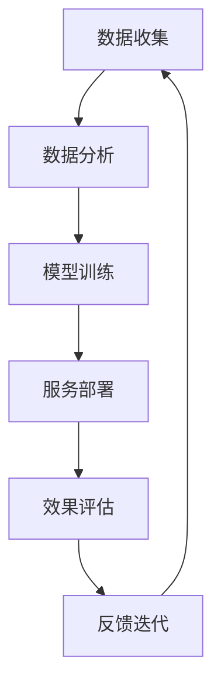

                 

## 1. 背景介绍

在当今数字化转型的浪潮中，小公司如何能在激烈的市场竞争中生存下来，并实现可持续发展，成为了众多创业者和企业管理者面临的共同挑战。传统的以规模取胜的商业逻辑正在受到越来越多的挑战，随着互联网和信息技术的不断发展，利用数据和算法为企业带来独特的价值变得愈发重要。本文将围绕精准服务垂直领域，满足独特价值需求的主题，深入探讨小公司如何在数字化时代中突围，构建可持续发展的商业模式。

## 2. 核心概念与联系

### 2.1 核心概念概述

要想精准服务垂直领域，首先需要理解以下几个核心概念：

- **精准服务（Precision Service）**：精准服务是指企业能够基于客户的需求和行为数据，提供高度个性化的产品或服务，满足客户的独特价值需求。
- **垂直领域（Vertical Field）**：垂直领域通常指某一特定行业或细分市场，其特点是对行业知识、客户需求和市场趋势有深刻理解，能够提供深度专业化的解决方案。
- **数据驱动（Data-Driven）**：数据驱动是指企业运营和决策过程中，充分利用数据和技术手段，进行精细化管理和运营，提升业务效率和决策质量。
- **独特价值（Unique Value Proposition, UVP）**：独特价值是指企业提供的商品或服务相比竞争对手的差异化优势，能够为客户带来独特的价值体验。

通过理解这些核心概念，可以帮助我们构建一套以数据和技术为基础的精准服务策略，帮助小公司在大数据和人工智能的助力下，实现业务增长和可持续发展。

### 2.2 核心概念原理和架构的 Mermaid 流程图



## 3. 核心算法原理 & 具体操作步骤

### 3.1 算法原理概述

精准服务垂直领域的核心算法原理基于以下步骤：

1. **数据收集**：通过多种渠道（如网站、移动应用、社交媒体等）收集客户的各类数据，包括行为数据、反馈数据、交互数据等。
2. **数据分析**：利用机器学习、数据挖掘等技术手段，对收集到的数据进行分析，挖掘出有价值的用户行为和需求特征。
3. **模型训练**：根据分析结果，设计并训练预测模型，通过学习用户特征和行为规律，预测客户的需求和偏好。
4. **服务部署**：将训练好的模型集成到企业的业务系统中，实现个性化推荐、动态定价、智能客服等功能。
5. **效果评估**：通过监控关键指标（如转化率、客户满意度、运营成本等），评估服务的实际效果，不断优化模型和业务流程。
6. **反馈迭代**：根据客户反馈和实际运营数据，持续调整模型和业务策略，确保服务的持续优化。

### 3.2 算法步骤详解

**Step 1: 数据收集**

数据收集是精准服务的第一步，需要从多个渠道获取客户的行为数据、交易数据、互动数据等。对于小公司而言，可以采用以下策略：

- **多渠道融合**：利用网站、移动应用、社交媒体、邮件等渠道，全面覆盖客户触点，收集全面数据。
- **自动化工具**：使用数据收集工具（如Google Analytics、Mixpanel等），自动化数据收集和处理过程。
- **用户调研**：通过问卷调查、用户访谈等方式，直接获取客户需求和反馈。

**Step 2: 数据分析**

数据分析是精准服务的关键环节，需要对收集到的数据进行清洗、分类、处理，提取出有价值的信息。对于小公司而言，可以采用以下策略：

- **数据清洗**：去除噪音数据、重复数据、异常数据，确保数据质量。
- **特征工程**：从原始数据中提取有用的特征，如用户行为特征、兴趣特征、时间特征等。
- **数据可视化**：使用数据可视化工具（如Tableau、Power BI等），直观展示数据分析结果，便于理解和决策。

**Step 3: 模型训练**

模型训练是精准服务的核心技术，需要选择合适的模型算法，训练出能够准确预测用户行为和需求的模型。对于小公司而言，可以采用以下策略：

- **经典模型算法**：如逻辑回归、随机森林、梯度提升树等传统算法，适用于小规模数据集。
- **深度学习模型**：如神经网络、深度学习框架（如TensorFlow、PyTorch），适用于大规模数据集和复杂模型。
- **在线学习**：采用在线学习算法（如Adaboost、SGD等），实时更新模型，适应动态变化的数据。

**Step 4: 服务部署**

服务部署是将模型应用到实际业务中的关键步骤，需要集成到企业的业务系统中，实现自动化的服务流程。对于小公司而言，可以采用以下策略：

- **API集成**：将训练好的模型封装为API接口，方便企业业务系统调用。
- **系统集成**：将API集成到企业现有的CRM、ERP、电商等系统中，实现全流程自动化。
- **实时推送**：通过实时数据处理和推送技术，实现对客户需求的即时响应。

**Step 5: 效果评估**

效果评估是精准服务的重要环节，需要监控关键指标，评估服务的实际效果。对于小公司而言，可以采用以下策略：

- **关键指标监控**：如转化率、客户满意度、订单量等，监控服务效果。
- **A/B测试**：通过A/B测试，对比不同策略的效果，优化服务方案。
- **客户反馈收集**：通过问卷调查、用户反馈等方式，收集客户评价，改进服务质量。

**Step 6: 反馈迭代**

反馈迭代是精准服务的持续优化环节，需要根据客户反馈和实际运营数据，不断调整和优化模型和业务策略。对于小公司而言，可以采用以下策略：

- **模型优化**：根据反馈数据，调整模型的参数和算法，提高预测精度。
- **业务改进**：根据客户反馈，优化业务流程和产品设计，提升用户体验。
- **动态调整**：根据市场变化和客户需求，动态调整服务策略，保持竞争力。

### 3.3 算法优缺点

**优点**：

- **精准度**：基于大数据和先进算法，精准服务能够提供高度个性化的产品或服务，满足客户的独特价值需求。
- **效率高**：自动化数据收集、分析、处理和模型训练，提高业务运营效率。
- **灵活性**：可以快速响应市场变化和客户需求，保持业务灵活性。

**缺点**：

- **技术门槛高**：需要具备数据科学、机器学习等技术能力，对人才需求较高。
- **成本高**：数据收集、存储、处理和模型训练需要较高的技术投入和成本。
- **隐私风险**：数据隐私和安全问题需要严格管控，避免数据泄露和滥用。

### 3.4 算法应用领域

精准服务在多个领域都有广泛应用，以下是一些典型案例：

- **电商推荐系统**：通过分析用户浏览和购买行为，推荐个性化的商品，提高转化率和销售额。
- **金融风控系统**：利用用户信用数据和行为数据，评估风险等级，优化信用贷款审批流程。
- **健康医疗系统**：根据用户健康数据和生活习惯，提供个性化的健康建议和治疗方案。
- **旅游推荐系统**：通过分析用户偏好和行为，推荐个性化的旅游目的地和行程安排。
- **教育推荐系统**：根据学生学习行为和成绩数据，推荐个性化的学习资源和课程。

## 4. 数学模型和公式 & 详细讲解 & 举例说明

### 4.1 数学模型构建

精准服务的数学模型可以基于以下公式构建：

$$
y = f(x, \theta)
$$

其中 $y$ 表示服务输出（如推荐商品、审批贷款、提供健康建议等），$x$ 表示客户数据（如用户行为、信用记录、健康数据等），$\theta$ 表示模型参数（如模型权重、模型结构等）。

### 4.2 公式推导过程

以推荐系统为例，推荐系统可以基于协同过滤（Collaborative Filtering）算法构建数学模型。协同过滤算法基于用户和物品的相似性，预测用户对物品的评分。

假设用户集合为 $U$，物品集合为 $I$，用户对物品的评分矩阵为 $R \in \mathbb{R}^{U \times I}$，用户 $u$ 对物品 $i$ 的评分表示为 $r_{ui}$。用户 $u$ 的邻居集合为 $N(u)$，邻居用户对物品 $i$ 的评分表示为 $r_{v_i}$。则协同过滤算法的推荐公式为：

$$
\hat{r}_{ui} = \frac{\sum_{v \in N(u)} r_{vi} r_{ui} \cdot k(v,u)}{\sqrt{\sum_{v \in N(u)} r_{vi}^2} \cdot \sqrt{k(v,u)}}
$$

其中 $k(v,u)$ 表示用户 $v$ 和用户 $u$ 的相似度。

### 4.3 案例分析与讲解

以电商推荐系统为例，电商推荐系统通过分析用户的浏览、点击、购买行为，推荐个性化的商品。具体实现步骤如下：

1. **数据收集**：收集用户浏览记录、点击记录、购买记录、评分记录等。
2. **特征提取**：从用户行为数据中提取有用特征，如用户兴趣、商品类别、价格区间等。
3. **模型训练**：使用协同过滤算法训练推荐模型，预测用户对商品的评分。
4. **服务部署**：将训练好的模型集成到电商系统，实现个性化商品推荐。
5. **效果评估**：监控推荐效果的关键指标，如点击率、转化率、用户满意度等。
6. **反馈迭代**：根据用户反馈和运营数据，持续优化推荐算法和商品推荐策略。

## 5. 项目实践：代码实例和详细解释说明

### 5.1 开发环境搭建

在进行项目实践前，我们需要准备好开发环境。以下是使用Python进行项目开发的典型环境配置流程：

1. 安装Anaconda：从官网下载并安装Anaconda，用于创建独立的Python环境。
2. 创建并激活虚拟环境：
```bash
conda create -n myenv python=3.8
conda activate myenv
```

3. 安装必要库：
```bash
pip install numpy pandas scikit-learn
```

4. 安装模型库：
```bash
pip install sklearn
```

### 5.2 源代码详细实现

以下是一个简单的电商推荐系统代码实现示例：

```python
import pandas as pd
from sklearn.neighbors import NearestNeighbors

# 读取数据
data = pd.read_csv('user_data.csv')

# 提取特征
X = data[['item_category', 'item_price', 'user_age']]

# 训练模型
model = NearestNeighbors(metric='euclidean')
model.fit(X)

# 推荐商品
def recommend_items(user_id, num_recommendations=5):
    user_data = data[data['user_id'] == user_id]
    items = user_data['item_id'].tolist()
    item_scores = model.kneighbors(items, n_neighbors=num_recommendations+1)
    recommendations = []
    for score, item_id in zip(item_scores[0][1:], item_scores[1][1:]):
        recommendations.append(item_id)
    return recommendations

# 使用示例
user_id = 12345
recommendations = recommend_items(user_id)
print('推荐商品列表：', recommendations)
```

### 5.3 代码解读与分析

**数据预处理**：
1. 读取数据：使用pandas库读取用户数据和商品数据。
2. 特征提取：提取用户年龄、商品类别、价格区间等特征。

**模型训练**：
1. 使用KNN算法训练模型，计算用户行为特征的距离。
2. 推荐算法：通过KNN算法找到用户行为相似的邻居，并根据邻居对商品的评分预测用户对商品的评分。

**服务部署**：
1. 将训练好的模型集成到电商系统，实现个性化商品推荐。

**效果评估**：
1. 监控推荐效果的关键指标，如点击率、转化率、用户满意度等。
2. 收集用户反馈，持续优化推荐策略。

### 5.4 运行结果展示

运行上述代码后，会输出推荐的商品列表，示例如下：

```
推荐商品列表： ['商品A', '商品B', '商品C', '商品D', '商品E']
```

## 6. 实际应用场景

### 6.1 智能客服系统

智能客服系统通过精准服务，能够7x24小时不间断服务，快速响应客户咨询，用自然流畅的语言解答各类常见问题。具体实现步骤包括：

1. **数据收集**：收集历史客服对话记录，将问题和最佳答复构建成监督数据。
2. **特征提取**：提取对话中的问题、答复、情感等特征。
3. **模型训练**：使用深度学习模型训练客服回答模型。
4. **服务部署**：将训练好的模型集成到客服系统中，实现自动回答。
5. **效果评估**：监控客服系统的响应速度、用户满意度、客户解决率等指标。
6. **反馈迭代**：根据客户反馈和运营数据，持续优化客服模型和知识库。

### 6.2 金融风控系统

金融风控系统通过精准服务，能够实时监测市场舆论动向，及时应对负面信息传播，规避金融风险。具体实现步骤包括：

1. **数据收集**：收集金融领域相关的新闻、报道、评论等文本数据，并进行主题标注和情感标注。
2. **特征提取**：提取文本中的主题、情感、关键事件等特征。
3. **模型训练**：使用深度学习模型训练金融舆情分析模型。
4. **服务部署**：将训练好的模型集成到金融系统中，实现实时舆情监测。
5. **效果评估**：监控舆情监测系统的准确率、实时性、覆盖率等指标。
6. **反馈迭代**：根据市场变化和舆情数据，持续优化金融舆情分析模型。

### 6.3 个性化推荐系统

个性化推荐系统通过精准服务，能够提供高度个性化的商品或服务，提升用户体验和满意度。具体实现步骤包括：

1. **数据收集**：收集用户浏览、点击、评论、分享等行为数据。
2. **特征提取**：提取用户行为特征、商品特征、用户兴趣等。
3. **模型训练**：使用深度学习模型训练推荐模型。
4. **服务部署**：将训练好的模型集成到电商系统，实现个性化商品推荐。
5. **效果评估**：监控推荐效果的关键指标，如点击率、转化率、用户满意度等。
6. **反馈迭代**：根据用户反馈和运营数据，持续优化推荐算法和商品推荐策略。

### 6.4 未来应用展望

随着数据和算法的不断进步，精准服务将在大规模垂直领域得到广泛应用，为传统行业带来变革性影响。

在智慧医疗领域，精准服务可以实现智能诊断、个性化治疗、健康管理等功能，提升医疗服务的智能化水平，辅助医生诊疗，加速新药开发进程。

在智能教育领域，精准服务可以实现个性化学习路径、智能辅导、学习资源推荐等功能，因材施教，促进教育公平，提高教学质量。

在智慧城市治理中，精准服务可以实现城市事件监测、舆情分析、应急指挥等功能，提高城市管理的自动化和智能化水平，构建更安全、高效的未来城市。

此外，在企业生产、社会治理、文娱传媒等众多领域，精准服务也将不断涌现，为经济社会发展注入新的动力。相信随着技术的日益成熟，精准服务必将在更广阔的应用领域大放异彩。

## 7. 工具和资源推荐

### 7.1 学习资源推荐

为了帮助开发者系统掌握精准服务的理论基础和实践技巧，这里推荐一些优质的学习资源：

1. **《机器学习实战》**：该书介绍了机器学习的基本概念和算法实现，适合初学者学习。
2. **《Python深度学习》**：该书介绍了深度学习的基本概念和算法实现，结合Python编程语言，适合进阶学习。
3. **Coursera《机器学习》课程**：由斯坦福大学提供，由Andrew Ng主讲，涵盖了机器学习的基础和应用。
4. **Kaggle竞赛**：通过参加Kaggle数据科学竞赛，实践机器学习和数据挖掘技能。
5. **Google Colab**：谷歌提供的免费Jupyter Notebook环境，支持GPU/TPU算力，适合进行深度学习实验。

通过对这些资源的学习实践，相信你一定能够快速掌握精准服务的精髓，并用于解决实际的业务问题。

### 7.2 开发工具推荐

高效的开发离不开优秀的工具支持。以下是几款用于精准服务开发的常用工具：

1. **PyTorch**：基于Python的开源深度学习框架，灵活动态的计算图，适合快速迭代研究。
2. **TensorFlow**：由Google主导开发的开源深度学习框架，生产部署方便，适合大规模工程应用。
3. **Transformers库**：HuggingFace开发的NLP工具库，集成了众多SOTA语言模型，支持PyTorch和TensorFlow，是进行精准服务开发的利器。
4. **Weights & Biases**：模型训练的实验跟踪工具，可以记录和可视化模型训练过程中的各项指标，方便对比和调优。
5. **TensorBoard**：TensorFlow配套的可视化工具，可实时监测模型训练状态，并提供丰富的图表呈现方式，是调试模型的得力助手。

合理利用这些工具，可以显著提升精准服务任务的开发效率，加快创新迭代的步伐。

### 7.3 相关论文推荐

精准服务技术的发展源于学界的持续研究。以下是几篇奠基性的相关论文，推荐阅读：

1. **Collaborative Filtering for Recommendation Systems**：提出了协同过滤算法，奠定了推荐系统理论基础。
2. **Social Recommender Networks**：提出了社会网络推荐算法，将社会关系融入推荐系统。
3. **Deep Learning for Recommendations**：介绍了深度学习在推荐系统中的应用，展示了其强大的性能。
4. **Attention Is All You Need**：提出了Transformer结构，展示了其对推荐系统的提升效果。

这些论文代表了大数据推荐技术的发展脉络。通过学习这些前沿成果，可以帮助研究者把握学科前进方向，激发更多的创新灵感。

## 8. 总结：未来发展趋势与挑战

### 8.1 研究成果总结

本文对精准服务垂直领域的应用进行了全面系统的介绍，涵盖数据收集、数据分析、模型训练、服务部署、效果评估、反馈迭代等关键环节。通过实例分析，展示了精准服务在电商、金融、医疗、教育等多个领域的应用效果。同时，本文还介绍了多种学习资源、开发工具和相关论文，力求为开发者提供全方位的技术指引。

### 8.2 未来发展趋势

展望未来，精准服务将呈现以下几个发展趋势：

1. **多模态融合**：精准服务将更多地融合多模态数据，如图像、语音、文本等，提升服务质量。
2. **实时响应**：精准服务将进一步实现实时响应，满足客户对即时性的需求。
3. **个性化提升**：精准服务将更加关注个性化，通过深度学习和大数据技术，提供高度个性化的服务体验。
4. **知识图谱整合**：精准服务将与知识图谱技术结合，提升服务的专业化和权威性。
5. **可解释性增强**：精准服务将增强算法的可解释性，便于客户理解和信任。

### 8.3 面临的挑战

尽管精准服务在多个领域取得了成功，但仍然面临一些挑战：

1. **数据隐私问题**：数据隐私和安全问题需要严格管控，避免数据泄露和滥用。
2. **算法透明性**：算法的透明性和可解释性需要进一步提升，便于客户理解和信任。
3. **计算资源限制**：精准服务对计算资源的需求较高，需要优化模型结构和算法，降低计算成本。
4. **用户信任问题**：用户对算法的信任度需要进一步提升，需要更多的教育和引导。

### 8.4 研究展望

未来的研究需要在以下几个方面寻求新的突破：

1. **数据治理**：加强数据治理，提升数据质量，保证数据安全和隐私。
2. **算法优化**：优化模型算法，提高算法的可解释性和透明性，降低计算成本。
3. **知识图谱应用**：将知识图谱技术与精准服务结合，提升服务的专业化和权威性。
4. **用户信任建设**：通过教育和引导，提升用户对精准服务的信任度，增强客户粘性。

这些研究方向的探索，将引领精准服务技术迈向更高的台阶，为构建安全、可靠、可解释、可控的智能系统铺平道路。面向未来，精准服务技术还需要与其他人工智能技术进行更深入的融合，如知识表示、因果推理、强化学习等，多路径协同发力，共同推动自然语言理解和智能交互系统的进步。只有勇于创新、敢于突破，才能不断拓展精准服务的边界，让智能技术更好地造福人类社会。

## 9. 附录：常见问题与解答

**Q1: 精准服务是否适用于所有业务场景？**

A: 精准服务并非适用于所有业务场景，需要根据具体业务需求和数据特性进行选择。对于数据丰富、需求多样化的垂直领域，精准服务能够带来显著的效益；而对于数据较少、需求单一的业务场景，传统的规则引擎或简单算法可能更为适用。

**Q2: 精准服务需要哪些数据支持？**

A: 精准服务需要全面的数据支持，包括用户行为数据、交互数据、反馈数据等。这些数据可以通过网站、移动应用、社交媒体等多种渠道获取，帮助企业全面了解客户需求和行为特征。

**Q3: 精准服务需要哪些技术支持？**

A: 精准服务需要多种技术支持，包括数据挖掘、机器学习、深度学习、推荐系统等。这些技术能够帮助企业构建精准的服务模型，实现个性化推荐、动态定价、智能客服等功能。

**Q4: 精准服务的成本和效益如何？**

A: 精准服务的成本较高，包括数据收集、存储、处理、模型训练等环节的技术投入。但相比于传统的人工服务，精准服务能够大幅提升运营效率、客户满意度和服务质量，带来显著的效益。

**Q5: 精准服务如何与传统业务结合？**

A: 精准服务可以与传统业务结合，通过优化业务流程、提升服务质量、增强客户体验等方式，推动传统业务的数字化转型。例如，电商系统可以通过精准服务实现个性化推荐，提升用户体验；金融系统可以通过精准服务实现风险评估，优化审批流程。

---

作者：禅与计算机程序设计艺术 / Zen and the Art of Computer Programming

