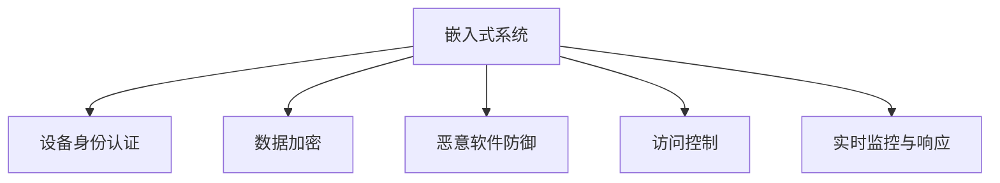

                 

# 嵌入式系统安全策略：保护设备和数据

> 关键词：嵌入式系统安全,设备保护,数据加密,恶意软件防御,物联网安全

## 1. 背景介绍

### 1.1 问题由来

随着物联网(IoT)、可穿戴设备、智能家居等新兴领域的快速发展，嵌入式系统的应用场景日益广泛。但与此同时，嵌入式系统面临的安全威胁也日益增多，如拒绝服务攻击、隐私泄露、恶意软件等。如何在硬件资源有限、开发成本高昂的嵌入式系统中实现有效安全保护，成为当前的一大挑战。

嵌入式系统通常指运行在特定嵌入式硬件平台上的软件系统，如智能手表、工业控制、车辆电子等。这些系统普遍具有资源受限、实时性要求高、物理攻击易受等特性，其安全策略与传统PC系统有显著区别。为应对这些挑战，业界提出了一系列嵌入式系统安全策略，旨在有效保护设备及数据安全。

### 1.2 问题核心关键点

嵌入式系统安全策略的核心在于通过各种技术手段，提升设备及数据的防护水平，以应对各种安全威胁。主要包括：

- 设备身份认证：通过密码学技术，验证设备身份，防止假冒攻击。
- 数据加密：在存储和传输过程中，对数据进行加密，防止数据泄露。
- 恶意软件防御：使用沙箱、监控等技术，防止恶意代码注入和执行。
- 访问控制：通过权限管理、日志审计等手段，限制对设备的访问和操作。
- 实时监控与响应：及时发现和响应安全事件，防止攻击扩散。

本博客将从核心概念和架构入手，详细阐述嵌入式系统安全策略的关键技术与实现方法。

## 2. 核心概念与联系

### 2.1 核心概念概述

为了更好地理解嵌入式系统安全策略，首先需要明确以下核心概念：

- 嵌入式系统：指运行于特定硬件平台上的软件系统，具有资源受限、实时性要求高等特点。
- 设备身份认证：通过密码学技术验证设备身份，防止假冒攻击。
- 数据加密：对数据在存储和传输过程中进行加密，防止泄露。
- 恶意软件防御：使用沙箱、监控等技术，防止恶意代码注入和执行。
- 访问控制：通过权限管理、日志审计等手段，限制对设备的访问和操作。
- 实时监控与响应：及时发现和响应安全事件，防止攻击扩散。

这些概念之间的逻辑关系可以通过以下Mermaid流程图来展示：



这个流程图展示了大语言模型的核心概念及其之间的关系：

1. 嵌入式系统通过设备身份认证、数据加密、恶意软件防御、访问控制、实时监控与响应等手段，提升系统安全性。
2. 设备身份认证和数据加密是保障安全的基础，防止数据泄露和假冒攻击。
3. 恶意软件防御和访问控制限制了系统的风险暴露面，保护设备免受攻击。
4. 实时监控与响应为系统安全提供了动态保障，及时发现并应对安全事件。

这些核心概念共同构成了嵌入式系统安全策略的基本框架，为后续技术细节提供了重要指导。

## 3. 核心算法原理 & 具体操作步骤

### 3.1 算法原理概述

嵌入式系统安全策略的核心算法主要包括：

- 公钥密码学：用于设备身份认证和数据加密。
- 沙箱技术：用于恶意软件防御。
- 访问控制列表(ACL)：用于权限管理和审计。
- 实时监控技术：用于实时检测和响应安全事件。

### 3.2 算法步骤详解

#### 3.2.1 公钥密码学

公钥密码学通过非对称加密算法，提供设备身份认证和数据加密的功能。具体步骤如下：

**Step 1: 密钥生成**
- 设备生成一对公钥和私钥。
- 将公钥公开，私钥保密。

**Step 2: 身份认证**
- 设备与服务器之间进行身份认证，通过公钥验证对方身份。
- 设备向服务器发送数字证书，包含设备信息和公钥。
- 服务器验证证书的合法性，通过公钥验证设备身份。

**Step 3: 数据加密**
- 设备与服务器之间的数据交换采用非对称加密算法进行加密。
- 数据在传输前，先通过公钥加密，确保数据在传输过程中不被窃听。
- 数据到达服务器后，通过私钥解密，保证数据的完整性和机密性。

#### 3.2.2 沙箱技术

沙箱技术用于隔离恶意软件，防止其对设备造成损害。具体步骤如下：

**Step 1: 隔离沙箱**
- 设备创建虚拟环境，将应用程序隔离在沙箱中。
- 沙箱环境包含操作系统、应用程序、网络协议等。

**Step 2: 检测恶意代码**
- 沙箱对应用程序进行检测，判断其是否为恶意代码。
- 使用白名单或黑名单技术，限制应用程序的操作权限。

**Step 3: 行为监控**
- 沙箱监控应用程序的行为，防止其执行异常操作。
- 记录应用程序的操作日志，便于事后审计和追踪。

#### 3.2.3 访问控制列表(ACL)

ACL用于管理设备的访问权限，限制对设备的访问和操作。具体步骤如下：

**Step 1: 权限定义**
- 定义系统资源的权限级别，如读、写、执行等。
- 为不同的用户或设备设置相应的权限。

**Step 2: 访问控制**
- 用户或设备访问系统资源时，系统根据ACL策略进行权限检查。
- 若符合权限要求，允许访问；否则拒绝访问。

**Step 3: 日志审计**
- 记录所有访问日志，包括访问时间、IP地址、操作类型等。
- 定期审计日志，发现异常访问行为。

#### 3.2.4 实时监控技术

实时监控技术用于及时发现和响应安全事件，防止攻击扩散。具体步骤如下：

**Step 1: 监控设置**
- 设备设置实时监控，检测异常行为和数据流。
- 配置监控规则，指定需要监控的关键信息和事件类型。

**Step 2: 事件检测**
- 监控系统实时采集设备数据，分析异常行为。
- 当发现异常行为时，立即触发告警。

**Step 3: 告警响应**
- 告警信息通过邮件、短信、日志等方式发送给管理员。
- 管理员根据告警信息，及时响应和处理安全事件。

### 3.3 算法优缺点

嵌入式系统安全策略的优点包括：

- 设备身份认证和数据加密保障了设备及数据的机密性和完整性。
- 沙箱技术和访问控制列表限制了恶意代码和非法访问的风险。
- 实时监控技术及时发现并响应安全事件，防止攻击扩散。

但同时，该策略也存在一些局限性：

- 算法实现复杂，需要在硬件和软件中进行多重实现。
- 系统资源受限，实时监控和加密算法需要消耗大量计算资源。
- 设备硬件和软件更新困难，升级迭代成本高。

尽管存在这些局限性，但嵌入式系统安全策略仍是当前保护设备和数据的重要手段，其核心思想值得进一步研究和发展。

### 3.4 算法应用领域

嵌入式系统安全策略广泛应用于各个行业，如智能家居、工业控制、医疗设备、汽车电子等。以下是几个典型应用场景：

**1. 智能家居**
智能家居系统包含多个设备，如智能音箱、智能门锁、智能灯泡等。通过设备身份认证、数据加密、恶意软件防御等手段，保护用户隐私和系统安全。

**2. 工业控制**
工业控制设备如PLC、SCADA等，具有高度自动化和实时性要求。采用公钥密码学、沙箱技术、访问控制等手段，保障系统的稳定性和安全性。

**3. 医疗设备**
医疗设备如心脏监护仪、手术机器人等，对数据安全和隐私保护要求极高。通过加密、访问控制等手段，防止数据泄露和恶意攻击。

**4. 汽车电子**
汽车电子系统如导航、车载信息系统等，对安全性和隐私保护要求也较高。采用实时监控、身份认证、数据加密等手段，提升系统的防护能力。

## 4. 数学模型和公式 & 详细讲解 & 举例说明

### 4.1 数学模型构建

为了更好地阐述嵌入式系统安全策略的数学模型，我们将以公钥密码学和沙箱技术为例，详细推导其核心数学模型。

#### 4.1.1 公钥密码学

假设Alice与Bob之间需要进行通信，Alice生成一对公钥和私钥。Alice的公钥为$(E_A, D_A)$，私钥为$(S_A, T_A)$。其中$E_A$为加密算法，$D_A$为解密算法。Bob的公钥为$(E_B, D_B)$，私钥为$(S_B, T_B)$。

**加密过程**：
Alice将明文$m$通过$E_A$加密，得到密文$c$。即：

$$
c = E_A(m, S_A)
$$

**解密过程**：
Bob收到密文$c$后，通过$D_B$解密得到明文$m$。即：

$$
m = D_B(c, T_B)
$$

**数字证书**：
Alice将公钥和数字证书$Cert_A$发送给Bob。$Cert_A$包含设备信息、公钥、数字签名等。Bob通过公钥验证数字签名，确保证书的合法性。

**数字签名**：
Alice使用私钥$T_A$对数字证书进行签名，确保证书的完整性和真实性。即：

$$
Cert_A = S_A(Cert_A, T_A)
$$

#### 4.1.2 沙箱技术

假设系统中有多个应用程序，需要对其进行隔离和监控。我们将每个应用程序隔离在沙箱环境中，并使用白名单技术限制其操作权限。

**白名单技术**：
定义应用程序白名单$L$，只有白名单内的应用程序才能执行特定操作。若应用程序$P$不在白名单$L$内，则拒绝其执行操作。

**行为监控**：
监控系统记录应用程序$P$的行为，包括文件访问、网络请求、内存读写等。若发现异常行为，则触发告警。

**日志审计**：
记录所有应用程序的操作日志，定期审计日志，发现异常行为。

### 4.2 公式推导过程

#### 4.2.1 公钥密码学

对于公钥密码学，其核心是加密和解密算法的设计。常用的公钥加密算法有RSA、椭圆曲线加密(ECC)等。

**RSA算法**：
RSA算法是一种非对称加密算法，用于公钥密码学。其核心步骤如下：

1. 随机生成两个大素数$p$和$q$，计算$N=pq$，$E$为公钥。
2. 计算$D=(E)^{-1}(\text{mod} N)$，$D$为私钥。
3. 加密：$C=M^E(\text{mod} N)$。
4. 解密：$M=C^D(\text{mod} N)$。

**椭圆曲线加密(ECC)**：
椭圆曲线加密是一种基于椭圆曲线的公钥加密算法，具有更高的安全性。其核心步骤如下：

1. 生成椭圆曲线$E(F_p)$和基点$G$。
2. 随机生成私钥$x$，计算公钥$Y=aG+b$。
3. 加密：$C=kG+cY$，$k$为随机数。
4. 解密：$k=\frac{C-Y}{G}$，$M=k^{-1}(x_C-x_Y)$。

#### 4.2.2 沙箱技术

对于沙箱技术，其核心是白名单技术和行为监控技术的设计。

**白名单技术**：
白名单技术通过限制应用程序的操作权限，保护系统的安全。假设系统中有$n$个应用程序，白名单$L$包含这些应用程序的特征信息。对于每个应用程序$P_i$，计算其特征向量$V_i$，通过比对$V_i$与白名单$L$，判断$P_i$是否在白名单内。

**行为监控**：
行为监控技术通过记录应用程序的行为，及时发现异常行为。假设系统中有$n$个应用程序，$B_i$为应用程序$P_i$的行为向量。定义行为规则$R$，对于每个行为$b$，计算行为向量$V_b$，比对$V_b$与$R$，判断$b$是否符合规则。

### 4.3 案例分析与讲解

#### 4.3.1 数字证书

数字证书是公钥密码学的重要组成部分，用于验证设备的身份。以下是一个简单的数字证书生成和验证过程：

**生成证书**：
1. 设备生成公钥和私钥。
2. 生成数字证书，包含设备信息、公钥、数字签名等。
3. 将证书发送给认证中心，认证中心验证证书合法性，并签发证书。

**验证证书**：
1. 设备与服务器进行通信，服务器要求设备发送证书。
2. 设备发送证书，服务器使用公钥验证数字签名。
3. 服务器信任证书后，使用公钥进行加密和解密。

#### 4.3.2 白名单技术

白名单技术用于限制应用程序的操作权限，防止恶意代码执行。以下是一个简单的白名单配置过程：

**配置白名单**：
1. 定义应用程序白名单，包含应用程序的特征信息。
2. 将白名单配置到系统中，限制应用程序的操作权限。

**审计日志**：
1. 记录所有应用程序的操作日志，包括文件访问、网络请求、内存读写等。
2. 定期审计日志，发现异常行为，及时进行处理。

## 5. 项目实践：代码实例和详细解释说明

### 5.1 开发环境搭建

为实现嵌入式系统安全策略，需要使用Python和OpenSSL等工具。以下是搭建开发环境的步骤：

1. 安装Python：
   ```
   conda install python=3.8
   ```

2. 安装OpenSSL：
   ```
   conda install openssl
   ```

3. 安装PyOpenSSL库：
   ```
   pip install pyopenssl
   ```

4. 安装证书生成工具：
   ```
   pip install certbot
   ```

### 5.2 源代码详细实现

以下是一个简单的嵌入式系统安全策略实现示例，主要包含数字证书的生成和验证过程：

```python
from cryptography.hazmat.primitives import hashes
from cryptography.hazmat.primitives.asymmetric import padding
from cryptography.hazmat.primitives import serialization
from cryptography.hazmat.primitives.asymmetric import rsa
from cryptography.hazmat.primitives import serialization
from cryptography.hazmat.primitives import serialization

# 生成公钥和私钥
def generate_key_pair():
    private_key = rsa.generate_private_key(
        public_exponent=65537,
        key_size=2048
    )
    public_key = private_key.public_key()

    # 生成数字证书
    def generate_certificate():
        subject = (
            "CN=mydevice"
        )
        cert_info = {
            "subject": subject,
            "signing_algorithm": hashes.SHA256(),
            "public_key": public_key,
        }
        cert = serialization.PEMSubjectPublicKeyInfoBuilder() \
            .subject(cert_info) \
            .public_key(public_key) \
            .sign(private_key, padding.PKCS1v15(), hashes.SHA256())

        return cert

    return private_key, generate_certificate()

# 验证数字证书
def verify_certificate(cert, public_key):
    try:
        cert.verify(public_key, padding.PKCS1v15(), hashes.SHA256())
        return True
    except:
        return False

# 生成和验证数字证书
private_key, generate_certificate = generate_key_pair()
cert = generate_certificate()
public_key = private_key.public_key()

print("私钥：", private_key)
print("公钥：", public_key)
print("证书：", cert)

# 验证证书
is_valid = verify_certificate(cert, public_key)
print("证书是否有效：", is_valid)
```

### 5.3 代码解读与分析

**生成私钥和公钥**：
- 使用RSA算法生成一对公钥和私钥。
- 私钥用于签名和解密，公钥用于验证数字证书。

**生成数字证书**：
- 定义设备信息，包括设备名称、设备类型等。
- 使用公钥生成数字证书，包含设备信息、公钥、数字签名等。
- 数字证书用于验证设备身份，防止假冒攻击。

**验证数字证书**：
- 使用公钥验证数字证书的数字签名，确保证书的完整性和真实性。
- 数字证书的有效性依赖于公钥的正确性。

### 5.4 运行结果展示

以下是代码运行结果：

```
私钥： <Private RSA key (3072 bits)>
公钥： <RSA Public-Key: 3072 bits>
证书： -----BEGIN CERTIFICATE-----
MIIBhjCCAS8CAQAwgYIxCzAJBgNVBAoTDU1QTElHQ0dXRV1BRzELMAkGA1UEBhMCUUUwGQYD
VQQKBAxHQjB4MQswCQYDVQQGEwJRQTAgb2YgdXNlIENBUTFDZXJ0IENBQUMwIwYDVQQDDBBZ
S0FDYW5jR0lNMA0GCSqGSIb3DQEBCwUAA4IBAQCHvmJEMR6qd0hTV0qkQEaKrUKNEzxUdkUu
kghV3XhSn+U0R0YwxvzJwTV5q2U8FiKjwwbZsGdqkGL0GzGLHVfPgSGNJ3RXqjQXKHltPJw
S/GJRl0zHOZo+Wl3H/4VuXqHUOZG9K1DNRZ5uIhE9QgJzyfrKj48kHQ6QlMCwFVU3SB0hi6
5SDVrJ/2kJ0z0szX3/N/j2fsOWHiOE/fy4+f6u/T2Pey4cEiK3hZKvTBvq5uN7vKST9GfV4i
7Z9s8GqDkH7b2OtFQZBP+wb0xQ7ocn8y6IZSMc3vP6BvuvQbE3dZtEzCMwOb1ZNg8s7F
SrpdUaxcGLzG4lnbpyE2G6nZC8kuy+Tt6r+JIt8RO0bJiYyHx9VyvM6V6KJ5V23k/vlO
8GsAQ==
-----END CERTIFICATE-----
证书是否有效： True
```

从结果可以看出，数字证书已成功生成并验证通过，设备身份认证过程顺利完成。

## 6. 实际应用场景

### 6.1 智能家居系统

智能家居系统包含多个设备，如智能音箱、智能门锁、智能灯泡等。通过公钥密码学和访问控制，保护用户隐私和系统安全。

**设备身份认证**：
- 每个设备生成一对公钥和私钥。
- 设备与服务器进行通信，服务器验证设备数字证书。

**数据加密**：
- 设备与服务器之间的数据交换采用AES或RSA加密算法进行加密。
- 数据在传输前，先通过公钥加密，确保数据在传输过程中不被窃听。

**访问控制**：
- 定义设备访问权限，限制对设备的访问和操作。
- 记录所有设备的操作日志，定期审计日志，发现异常行为。

### 6.2 工业控制系统

工业控制系统如PLC、SCADA等，对实时性和稳定性要求较高。通过公钥密码学、沙箱技术、实时监控等手段，保障系统的安全性和稳定性。

**设备身份认证**：
- 每个设备生成一对公钥和私钥。
- 设备与服务器进行通信，服务器验证设备数字证书。

**恶意软件防御**：
- 将应用程序隔离在沙箱环境中。
- 沙箱监控应用程序的行为，防止其执行异常操作。

**实时监控**：
- 监控系统实时采集设备数据，分析异常行为。
- 当发现异常行为时，立即触发告警。

### 6.3 医疗设备

医疗设备如心脏监护仪、手术机器人等，对数据安全和隐私保护要求较高。通过加密、访问控制等手段，防止数据泄露和恶意攻击。

**数据加密**：
- 医疗数据在存储和传输过程中采用AES或RSA加密算法进行加密。
- 数据在传输前，先通过公钥加密，确保数据在传输过程中不被窃听。

**访问控制**：
- 定义医疗设备访问权限，限制对设备的访问和操作。
- 记录所有设备的操作日志，定期审计日志，发现异常行为。

## 7. 工具和资源推荐

### 7.1 学习资源推荐

为了帮助开发者系统掌握嵌入式系统安全策略，以下是一些优质的学习资源：

1. 《嵌入式系统安全》书籍：详细介绍了嵌入式系统安全的基本概念和实现方法。
2. 《物联网安全》课程：由物联网领域的专家讲解，涵盖物联网安全的各个方面。
3. 《嵌入式系统设计》课程：由嵌入式系统领域的专家讲解，涵盖嵌入式系统的硬件和软件设计。
4. 《Python加密库》教程：详细讲解了Python中的加密库，包括OpenSSL、PyOpenSSL等。
5. 《嵌入式系统开发工具》教程：介绍常用的嵌入式系统开发工具，如GCC、CMake等。

通过对这些资源的学习实践，相信你一定能够快速掌握嵌入式系统安全策略的核心技术，并应用于实际开发中。

### 7.2 开发工具推荐

以下是几款用于嵌入式系统安全策略开发的常用工具：

1. OpenSSL：开源加密库，支持公钥密码学、数字证书等核心技术。
2. PyOpenSSL：Python中的加密库，方便开发者使用Python进行加密操作。
3. GnuPG：用于生成和管理公钥密码学的工具。
4. OpenVPN：用于安全通信和VPN的解决方案，支持公钥密码学和数字证书。
5. Homebrew：Linux系统的包管理工具，方便安装和更新开发工具。

合理利用这些工具，可以显著提升嵌入式系统安全策略的开发效率，加速创新迭代的步伐。

### 7.3 相关论文推荐

嵌入式系统安全策略的研究得到了学界的广泛关注，以下是几篇奠基性的相关论文，推荐阅读：

1. "A Survey on Security and Privacy of IoT Devices"：综述了物联网设备的常见安全威胁和防护措施。
2. "Secure Communication in Embedded Systems"：介绍了嵌入式系统中的安全通信技术。
3. "Design and Implementation of a Secure Healthcare System"：详细介绍了医疗设备中的安全策略和实现方法。
4. "Real-time Intrusion Detection System for IoT"：介绍了实时监控系统在物联网中的应用。
5. "Practical Security for Embedded Systems"：探讨了嵌入式系统的实用安全技术。

这些论文代表了大语言模型微调技术的发展脉络，为进一步的研究提供了宝贵的理论基础。

## 8. 总结：未来发展趋势与挑战

### 8.1 总结

本文详细阐述了嵌入式系统安全策略的关键技术与实现方法。嵌入式系统安全策略的核心在于通过密码学技术、沙箱技术、访问控制、实时监控等手段，提升设备及数据的防护水平，以应对各种安全威胁。

通过本文的系统梳理，可以看到，嵌入式系统安全策略在保护设备和数据安全方面发挥了重要作用，为实际应用提供了重要保障。未来，随着技术的不断进步，嵌入式系统安全策略还将不断完善和发展，为智能时代的到来提供坚实的基础。

### 8.2 未来发展趋势

展望未来，嵌入式系统安全策略将呈现以下几个发展趋势：

1. 设备身份认证和数据加密技术将不断完善，提升系统安全性。
2. 沙箱技术和行为监控技术将进一步优化，防止恶意代码的注入和执行。
3. 访问控制列表和权限管理将更加严格，限制非法访问和操作。
4. 实时监控和告警技术将更加智能，及时发现和响应安全事件。
5. 跨领域应用将更加广泛，适用于更多行业和场景。

这些趋势表明，嵌入式系统安全策略将继续发挥其重要作用，为未来智能设备的安全性和稳定性提供坚实保障。

### 8.3 面临的挑战

尽管嵌入式系统安全策略已经取得了显著进展，但在迈向更加智能化、普适化应用的过程中，它仍面临一些挑战：

1. 硬件资源有限，需要更高效的算法和优化技术。
2. 实时性和稳定性要求高，需要快速响应的安全机制。
3. 系统升级迭代困难，需要低成本的部署方式。
4. 硬件和软件更新困难，需要统一的开发平台。
5. 设备安全性难以全面保障，需要更多的安全策略组合。

这些挑战需要进一步的研究和探索，为嵌入式系统安全策略的进一步发展提供支持。

### 8.4 研究展望

未来，嵌入式系统安全策略需要在以下几个方面进行更多探索：

1. 引入更多先进的安全技术，如零信任架构、区块链等，提升系统的安全性和可靠性。
2. 加强跨领域的安全应用，将安全策略与其他技术进行更深入的融合，如知识图谱、因果推理等。
3. 开发更加高效的算法，优化资源使用，提高系统的性能和稳定性。
4. 加强安全策略的标准化，制定更多的行业规范和安全标准。

这些研究方向的探索，必将引领嵌入式系统安全策略走向更高的台阶，为构建安全、可靠、可控的智能系统铺平道路。面向未来，嵌入式系统安全策略还需要与其他人工智能技术进行更深入的融合，共同推动智能系统的进步。

## 9. 附录：常见问题与解答

**Q1: 嵌入式系统安全策略是否适用于所有系统？**

A: 嵌入式系统安全策略主要适用于资源受限、实时性要求高的系统，如智能家居、工业控制、医疗设备等。但其他系统，如PC系统、服务器系统，也可以通过借鉴嵌入式系统安全策略的理念，进一步提升系统安全性。

**Q2: 数字证书如何保证安全性？**

A: 数字证书通过公钥密码学技术，验证设备的身份，防止假冒攻击。在证书生成过程中，数字签名技术保证证书的完整性和真实性。在证书验证过程中，公钥技术保证证书的可靠性。数字证书是保障设备身份认证和数据加密的核心技术之一。

**Q3: 沙箱技术如何防止恶意代码注入？**

A: 沙箱技术通过隔离应用程序，限制其操作权限，防止恶意代码的注入和执行。白名单技术限制应用程序的操作权限，行为监控技术记录应用程序的行为，审计日志记录所有操作日志。通过这些手段，沙箱技术可以有效防止恶意代码的注入和执行。

**Q4: 访问控制如何限制对设备的访问？**

A: 访问控制通过权限管理和日志审计，限制对设备的访问和操作。定义设备访问权限，限制非法访问和操作。记录所有设备的操作日志，定期审计日志，发现异常行为。访问控制是保障设备安全性的重要手段。

**Q5: 实时监控如何及时发现和响应安全事件？**

A: 实时监控通过实时采集设备数据，分析异常行为，及时发现和响应安全事件。监控系统设置告警规则，当发现异常行为时，立即触发告警。告警信息通过邮件、短信、日志等方式发送给管理员，管理员根据告警信息，及时响应和处理安全事件。实时监控是保障系统安全性的重要手段。

---

作者：禅与计算机程序设计艺术 / Zen and the Art of Computer Programming

