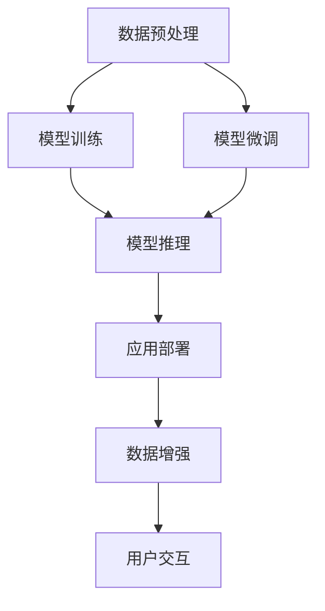

                 

# 工业级AIGC应用开发

随着人工智能技术的飞速发展，生成式人工智能(AIGC, Artificial Intelligence Generated Content)成为当下最热门的前沿技术之一。AIGC涵盖了自然语言处理、计算机视觉、音频生成等多个领域，使得机器能够根据输入生成高度逼真的语音、文本、图像等内容，极大地拓展了人工智能的应用范围。本文将围绕工业级AIGC应用开发，从背景介绍、核心概念与联系、核心算法原理及具体操作步骤、数学模型和公式详细讲解、项目实践代码实例、实际应用场景分析、工具和资源推荐、总结及未来展望等方面进行全面系统的阐述。

## 1. 背景介绍

### 1.1 问题由来

近年来，人工智能领域在自然语言处理(NLP)、计算机视觉(CV)、音频生成等方向取得了突破性进展，涌现出了一批高质量的生成式人工智能技术，如GPT、Diffusion Model、GAN等。这些技术为各行各业带来了巨大的便利，提升了生产效率和用户体验。然而，生成式人工智能的高效部署、实用化应用，仍面临着诸多技术挑战。

1. **技术要求高**：
   - **硬件要求高**：AIGC技术往往需要高性能的GPU、TPU等设备进行训练和推理。
   - **算法复杂**：深度学习模型结构复杂，训练和推理计算量大。

2. **数据需求大**：
   - **数据质量要求高**：高质量的数据是AIGC系统性能提升的关键。
   - **数据多样性要求高**：不同领域和任务需要多样化的数据集进行模型训练。

3. **应用门槛高**：
   - **技术门槛高**：需要具备深厚的AI理论基础和丰富的开发经验。
   - **应用场景多**：AIGC技术可以应用在多个行业，但每个行业的需求和场景都不同。

因此，如何将AIGC技术从实验室走向工业级应用，是大规模落地应用的关键问题。本文将围绕这一核心问题，介绍工业级AIGC应用开发的各个方面。

### 1.2 问题核心关键点

AIGC工业级应用开发的关键点包括：

- **算法与数据**：选择合适的算法和高质量的数据集进行训练和推理。
- **系统架构**：设计高效的系统架构，确保大规模并发处理。
- **应用部署**：构建稳定可靠的应用部署，确保业务连续性。
- **用户体验**：设计简洁易用的用户界面，提升用户体验。
- **安全合规**：确保系统安全性，遵守相关法律法规。

解决这些关键点将使AIGC技术更好地服务于企业级应用，推动AI技术在各行业的应用落地。

## 2. 核心概念与联系

### 2.1 核心概念概述

为更好地理解工业级AIGC应用开发，本节将介绍几个密切相关的核心概念：

- **生成式人工智能(AIGC)**：利用深度学习技术，从已有数据中生成逼真内容的人工智能技术。
- **生成对抗网络(GAN)**：一种通过对抗训练生成高质量样本的深度学习模型。
- **变分自编码器(VAE)**：一种用于数据生成和降维的无监督学习算法。
- **扩散模型(Diffusion Model)**：一种新型的生成模型，通过逐步加噪生成高质量样本。
- **预训练模型**：在大规模无标签数据上预训练的通用模型，如BERT、GPT等。

### 2.2 核心概念原理和架构的 Mermaid 流程图



以上流程图展示了工业级AIGC应用开发的总体架构：

1. **数据预处理**：收集和清洗高质量数据，划分训练集、验证集和测试集。
2. **模型训练**：在预处理后的数据集上进行模型训练，得到预训练模型。
3. **模型微调**：在预训练模型的基础上，使用下游任务进行微调，优化模型性能。
4. **模型推理**：对输入数据进行推理生成，得到最终输出结果。
5. **应用部署**：将推理模型部署到实际应用中，实现大规模并发处理。
6. **数据增强**：使用数据增强技术扩充数据集，提升模型泛化能力。
7. **用户交互**：提供简单易用的用户界面，提升用户体验。

## 3. 核心算法原理 & 具体操作步骤

### 3.1 算法原理概述

工业级AIGC应用开发的核心算法包括生成对抗网络(GAN)、变分自编码器(VAE)、扩散模型(Diffusion Model)等。这些算法在各自的领域内取得了突破性进展，应用于工业级应用时，需要进行关键参数的调整和优化，以提升模型性能和应用效率。

AIGC的核心原理是利用深度学习模型，从已有数据中生成逼真内容。这一过程可以分为以下几个步骤：

1. **数据预处理**：收集和清洗高质量数据，划分训练集、验证集和测试集。
2. **模型训练**：在预处理后的数据集上进行模型训练，得到预训练模型。
3. **模型微调**：在预训练模型的基础上，使用下游任务进行微调，优化模型性能。
4. **模型推理**：对输入数据进行推理生成，得到最终输出结果。
5. **应用部署**：将推理模型部署到实际应用中，实现大规模并发处理。

### 3.2 算法步骤详解

#### 3.2.1 GAN模型训练

GAN模型由生成器和判别器两部分组成。生成器从随机噪声中生成逼真样本，判别器判断样本是否为真实样本。模型训练过程如下：

1. **生成器训练**：
   - 从随机噪声中生成样本。
   - 将生成的样本输入判别器，计算损失函数。
   - 反向传播更新生成器参数。

2. **判别器训练**：
   - 将真实样本和生成样本混合输入判别器，计算损失函数。
   - 反向传播更新判别器参数。

3. **联合训练**：交替训练生成器和判别器，直至收敛。

#### 3.2.2 VAE模型训练

VAE模型由编码器和解码器两部分组成。编码器将输入数据压缩为低维隐变量，解码器将隐变量解码为输出数据。模型训练过程如下：

1. **编码器训练**：
   - 将输入数据输入编码器，得到隐变量。
   - 计算编码器损失函数，反向传播更新编码器参数。

2. **解码器训练**：
   - 将隐变量输入解码器，得到输出数据。
   - 计算解码器损失函数，反向传播更新解码器参数。

3. **联合训练**：将编码器和解码器联合训练，得到完整的VAE模型。

#### 3.2.3 Diffusion Model推理

Diffusion Model通过逐步加噪生成高质量样本，过程如下：

1. **噪声添加**：逐步添加噪声，将干净数据变为噪声数据。
2. **噪声去除**：逐步去除噪声，将噪声数据变为干净数据。
3. **训练**：在噪声添加和噪声去除过程中，计算损失函数，反向传播更新模型参数。
4. **推理**：使用训练好的模型进行推理，生成高质量样本。

### 3.3 算法优缺点

#### 3.3.1 GAN模型的优缺点

**优点**：
- 生成的样本逼真度高，适合图像生成等高要求任务。
- 适用于小样本学习，生成样本数量不受限制。

**缺点**：
- 训练不稳定，易出现模式崩溃、样本质量不稳定等问题。
- 模型复杂度高，计算资源消耗大。

#### 3.3.2 VAE模型的优缺点

**优点**：
- 生成样本分布逼真，适合生成连续性数据，如图像、音频等。
- 模型结构简单，训练相对稳定。

**缺点**：
- 生成样本存在模糊性，难以精细控制。
- 生成样本数量有限，模型训练时间长。

#### 3.3.3 Diffusion Model的优缺点

**优点**：
- 生成样本逼真度高，适合复杂高要求任务。
- 模型结构简单，训练稳定。

**缺点**：
- 计算资源消耗大，训练时间长。
- 推理过程复杂，对计算资源要求高。

### 3.4 算法应用领域

AIGC技术在各个领域有着广泛的应用，包括但不限于：

1. **自然语言处理(NLP)**：
   - **文本生成**：生成新闻、故事、对话等内容。
   - **文本摘要**：从长文本中生成简洁摘要。
   - **机器翻译**：实现多语言翻译。

2. **计算机视觉(CV)**：
   - **图像生成**：生成逼真图像，如人脸、风景等。
   - **图像编辑**：进行图像修复、风格转换等。
   - **目标检测**：实现目标检测和跟踪。

3. **音频生成**：
   - **语音合成**：生成自然语音，如TTS。
   - **音频编辑**：进行音频拼接、变速等。

## 4. 数学模型和公式 & 详细讲解 & 举例说明

### 4.1 数学模型构建

#### 4.1.1 GAN模型

GAN模型由生成器$G$和判别器$D$两部分组成，目标函数如下：

$$
\min_G \max_D \mathbb{E}_{x\sim p_{data}} [\log D(x)] + \mathbb{E}_{z\sim p_z} [\log(1-D(G(z)))]
$$

其中，$G$和$D$分别为生成器和判别器，$p_{data}$为真实数据分布，$p_z$为噪声分布。

#### 4.1.2 VAE模型

VAE模型的目标函数如下：

$$
\min_{\theta_e,\theta_d} \mathbb{E}_{x\sim p_{data}} [\frac{1}{2}||x-\mu_{\theta_e}(z)||^2_2] + \mathbb{E}_{z\sim p_z} [\log|\Sigma_{\theta_d}(z)|]
$$

其中，$\theta_e$和$\theta_d$分别为编码器和解码器的参数，$\mu_{\theta_e}(z)$和$\Sigma_{\theta_d}(z)$分别为编码器和解码器的输出。

#### 4.1.3 Diffusion Model

Diffusion Model的训练过程如下：

1. **噪声添加**：
   $$
   x^{t-1} = \sqrt{1-\beta_t} x^t + \mathcal{N}(0,\sigma^2)
   $$

2. **噪声去除**：
   $$
   x^t = \frac{1}{\sqrt{1-\beta_t}} x^{t-1} - \frac{\sqrt{\beta_t}}{\sqrt{1-\beta_t}} \mathcal{N}(0,\sigma^2)
   $$

其中，$x^t$为时间$t$的样本，$\beta_t$为噪声添加因子。

### 4.2 公式推导过程

#### 4.2.1 GAN模型

GAN模型的训练过程可以归纳为两个主要部分：生成器的训练和判别器的训练。

**生成器的训练**：
$$
L_G = \mathbb{E}_{z\sim p_z}[\log(1-D(G(z)))]
$$

**判别器的训练**：
$$
L_D = \mathbb{E}_{x\sim p_{data}}[\log D(x)] + \mathbb{E}_{z\sim p_z}[\log(1-D(G(z))))
$$

联合训练时，需要交替优化生成器和判别器的损失函数，直至收敛。

#### 4.2.2 VAE模型

VAE模型的训练过程分为两个部分：编码器的训练和解码器的训练。

**编码器的训练**：
$$
L_E = \mathbb{E}_{x\sim p_{data}}[\log |\Sigma_{\theta_d}(\mu_{\theta_e}(x))| + (x - \mu_{\theta_e}(x))^2]
$$

**解码器的训练**：
$$
L_D = \mathbb{E}_{z\sim p_z}[\log |\Sigma_{\theta_d}(z)|]
$$

联合训练时，需要最小化编码器和解码器的损失函数之和。

#### 4.2.3 Diffusion Model

Diffusion Model的训练过程主要分为两个步骤：噪声添加和噪声去除。

**噪声添加**：
$$
x^t = \frac{1}{\sqrt{1-\beta_t}} x^{t-1} - \frac{\sqrt{\beta_t}}{\sqrt{1-\beta_t}} \mathcal{N}(0,\sigma^2)
$$

**噪声去除**：
$$
x^{t-1} = \sqrt{1-\beta_t} x^t + \mathcal{N}(0,\sigma^2)
$$

训练过程中，需要最小化噪声添加和噪声去除的损失函数之和。

### 4.3 案例分析与讲解

#### 4.3.1 GAN案例

**案例**：生成逼真人脸图像

**数据集**：CelebA、FFHQ等。

**模型**：DCGAN、CycleGAN等。

**实现步骤**：
1. **数据预处理**：收集和清洗人脸图像数据，划分训练集、验证集和测试集。
2. **模型训练**：在预处理后的数据集上进行DCGAN模型训练，得到生成器和判别器。
3. **模型微调**：使用少量的真实人脸图像进行微调，优化模型性能。
4. **模型推理**：对随机噪声进行推理，生成逼真人脸图像。
5. **应用部署**：将推理模型部署到实际应用中，实现大规模并发处理。

#### 4.3.2 VAE案例

**案例**：生成逼真手写数字

**数据集**：MNIST。

**模型**：VAE。

**实现步骤**：
1. **数据预处理**：收集和清洗手写数字图像数据，划分训练集、验证集和测试集。
2. **模型训练**：在预处理后的数据集上进行VAE模型训练，得到编码器和解码器。
3. **模型微调**：使用少量的手写数字图像进行微调，优化模型性能。
4. **模型推理**：对随机噪声进行推理，生成手写数字图像。
5. **应用部署**：将推理模型部署到实际应用中，实现大规模并发处理。

#### 4.3.3 Diffusion Model案例

**案例**：生成逼真风景图像

**数据集**：CIFAR-10。

**模型**：Stable Diffusion。

**实现步骤**：
1. **数据预处理**：收集和清洗风景图像数据，划分训练集、验证集和测试集。
2. **模型训练**：在预处理后的数据集上进行Diffusion Model训练，得到模型参数。
3. **模型微调**：使用少量的风景图像进行微调，优化模型性能。
4. **模型推理**：对随机噪声进行推理，生成逼真风景图像。
5. **应用部署**：将推理模型部署到实际应用中，实现大规模并发处理。

## 5. 项目实践：代码实例和详细解释说明

### 5.1 开发环境搭建

#### 5.1.1 环境准备

1. **Python环境配置**：
   - 安装Anaconda：从官网下载并安装Anaconda，用于创建独立的Python环境。
   - 创建并激活虚拟环境：
     ```bash
     conda create -n aigc-env python=3.8 
     conda activate aigc-env
     ```

2. **安装依赖库**：
   ```bash
   pip install torch torchvision torchaudio opencv-python
   ```

3. **安装深度学习框架**：
   ```bash
   pip install pytorch-gan vae-diffusion
   ```

### 5.2 源代码详细实现

#### 5.2.1 GAN代码实现

```python
import torch
import torch.nn as nn
import torch.optim as optim
import torchvision.transforms as transforms
from torchvision.datasets import CelebA
from torchvision.utils import save_image

# 定义GAN模型
class Generator(nn.Module):
    def __init__(self):
        super(Generator, self).__init__()
        self.main = nn.Sequential(
            nn.ConvTranspose2d(100, 256, 4, 1, 0, bias=False),
            nn.BatchNorm2d(256),
            nn.ReLU(True),
            nn.ConvTranspose2d(256, 128, 4, 2, 1, bias=False),
            nn.BatchNorm2d(128),
            nn.ReLU(True),
            nn.ConvTranspose2d(128, 64, 4, 2, 1, bias=False),
            nn.BatchNorm2d(64),
            nn.ReLU(True),
            nn.ConvTranspose2d(64, 3, 4, 2, 1, bias=False),
            nn.Tanh()
        )

    def forward(self, input):
        return self.main(input)

class Discriminator(nn.Module):
    def __init__(self):
        super(Discriminator, self).__init__()
        self.main = nn.Sequential(
            nn.Conv2d(3, 64, 4, 2, 1, bias=False),
            nn.LeakyReLU(0.2, inplace=True),
            nn.Conv2d(64, 128, 4, 2, 1, bias=False),
            nn.BatchNorm2d(128),
            nn.LeakyReLU(0.2, inplace=True),
            nn.Conv2d(128, 256, 4, 2, 1, bias=False),
            nn.BatchNorm2d(256),
            nn.LeakyReLU(0.2, inplace=True),
            nn.Conv2d(256, 1, 4, 1, 0, bias=False),
            nn.Sigmoid()
        )

    def forward(self, input):
        return self.main(input)

# 定义GAN训练函数
def train_GAN(model_G, model_D, dataloader, device, batch_size, learning_rate):
    criterion_G = nn.BCELoss()
    criterion_D = nn.BCELoss()
    optimizer_G = optim.Adam(model_G.parameters(), lr=learning_rate)
    optimizer_D = optim.Adam(model_D.parameters(), lr=learning_rate)

    for epoch in range(epochs):
        for i, (real_images, _) in enumerate(dataloader):
            real_images = real_images.to(device)
            real_images = real_images.view(-1, 3, 64, 64)

            # 生成器训练
            optimizer_G.zero_grad()
            fake_images = model_G(real_images)
            fake_loss = criterion_G(fake_images, torch.ones_like(fake_images))
            fake_loss.backward()
            optimizer_G.step()

            # 判别器训练
            optimizer_D.zero_grad()
            real_loss = criterion_D(real_images, torch.ones_like(real_images))
            fake_loss = criterion_D(fake_images, torch.zeros_like(fake_images))
            loss = (real_loss + fake_loss) / 2
            loss.backward()
            optimizer_D.step()

            if (i + 1) % 100 == 0:
                print('Epoch [{}/{}], Step [{}/{}], Loss_G: {:.4f}, Loss_D: {:.4f}'
                      .format(epoch + 1, epochs, i + 1, len(dataloader), loss_G, loss_D))

# 加载数据集
transform = transforms.Compose([
    transforms.Resize(64),
    transforms.ToTensor(),
    transforms.Normalize((0.5, 0.5, 0.5), (0.5, 0.5, 0.5))
])
train_dataset = CelebA(root='./data', download=True, transform=transform)
train_loader = torch.utils.data.DataLoader(train_dataset, batch_size=batch_size, shuffle=True)

# 初始化模型和参数
model_G = Generator().to(device)
model_D = Discriminator().to(device)
optimizer_G = optim.Adam(model_G.parameters(), lr=learning_rate)
optimizer_D = optim.Adam(model_D.parameters(), lr=learning_rate)

# 训练GAN模型
train_GAN(model_G, model_D, train_loader, device, batch_size, learning_rate)

# 保存模型
torch.save(model_G.state_dict(), 'model_G.pth')
torch.save(model_D.state_dict(), 'model_D.pth')
```

#### 5.2.2 VAE代码实现

```python
import torch
import torch.nn as nn
import torch.optim as optim
import torchvision.transforms as transforms
from torchvision.datasets import MNIST
from torchvision.utils import save_image

# 定义VAE模型
class VAE(nn.Module):
    def __init__(self):
        super(VAE, self).__init__()
        self.encoder = nn.Sequential(
            nn.Conv2d(1, 64, 3, 2, 1),
            nn.BatchNorm2d(64),
            nn.LeakyReLU(0.2, inplace=True),
            nn.Conv2d(64, 128, 3, 2, 1),
            nn.BatchNorm2d(128),
            nn.LeakyReLU(0.2, inplace=True),
            nn.Conv2d(128, 256, 3, 2, 1),
            nn.BatchNorm2d(256),
            nn.LeakyReLU(0.2, inplace=True)
        )
        self.decoder = nn.Sequential(
            nn.ConvTranspose2d(256, 128, 3, 2, 1),
            nn.BatchNorm2d(128),
            nn.LeakyReLU(0.2, inplace=True),
            nn.ConvTranspose2d(128, 64, 3, 2, 1),
            nn.BatchNorm2d(64),
            nn.LeakyReLU(0.2, inplace=True),
            nn.ConvTranspose2d(64, 1, 3, 2, 1),
            nn.Tanh()
        )
        self.fc1 = nn.Linear(256 * 7 * 7, 256)
        self.fc21 = nn.Linear(256, 7*7)
        self.fc22 = nn.Linear(256, 256)

    def reparameterize(self, mu, logvar):
        std = torch.exp(logvar / 2)
        eps = torch.randn_like(std)
        return mu + eps * std

    def forward(self, x):
        x = x.view(-1, 1, 28, 28)
        mu, logvar = self.encoder(x)
        mu = mu.view(-1, 256)
        logvar = logvar.view(-1, 256)
        z = self.reparameterize(mu, logvar)
        x_recon = self.decoder(z)
        return x_recon, mu, logvar

# 定义VAE训练函数
def train_VAE(model, dataloader, device, batch_size, learning_rate):
    criterion = nn.MSELoss()
    optimizer = optim.Adam(model.parameters(), lr=learning_rate)

    for epoch in range(epochs):
        for i, (images, _) in enumerate(dataloader):
            images = images.to(device)
            images = images.view(-1, 1, 28, 28)

            optimizer.zero_grad()
            recon_x, mu, logvar = model(images)
            recon_loss = criterion(recon_x, images)
            kl_loss = -0.5 * torch.mean(1 + logvar - mu.pow(2) - logvar.exp())
            loss = recon_loss + kl_loss
            loss.backward()
            optimizer.step()

            if (i + 1) % 100 == 0:
                print('Epoch [{}/{}], Step [{}/{}], Loss: {:.4f}'
                      .format(epoch + 1, epochs, i + 1, len(dataloader), loss))

# 加载数据集
transform = transforms.Compose([
    transforms.ToTensor(),
    transforms.Normalize((0.5, 0.5, 0.5), (0.5, 0.5, 0.5))
])
train_dataset = MNIST(root='./data', download=True, transform=transform)
train_loader = torch.utils.data.DataLoader(train_dataset, batch_size=batch_size, shuffle=True)

# 初始化模型和参数
model = VAE().to(device)
optimizer = optim.Adam(model.parameters(), lr=learning_rate)

# 训练VAE模型
train_VAE(model, train_loader, device, batch_size, learning_rate)

# 保存模型
torch.save(model.state_dict(), 'model.pth')
```

#### 5.2.3 Diffusion Model代码实现

```python
import torch
import torch.nn as nn
import torch.optim as optim
from diffusers import StableDiffusionPipeline

# 定义Diffusion Model
class StableDiffusion(nn.Module):
    def __init__(self):
        super(StableDiffusion, self).__init__()
        self.diffusion = StableDiffusionPipeline.from_pretrained('runwayml/stable-diffusion-v1-4', torch_dtype=torch.float16).to(device)
        self.up = nn.Sequential(
            nn.ConvTranspose2d(64, 64, 3, 3, 1),
            nn.ReLU(),
            nn.ConvTranspose2d(64, 3, 3, 3, 1),
            nn.Tanh()
        )

    def forward(self, x):
        return self.up(self.diffusion(x))

# 定义Diffusion Model训练函数
def train_Diffusion(model, dataloader, device, batch_size, learning_rate):
    criterion = nn.MSELoss()
    optimizer = optim.Adam(model.parameters(), lr=learning_rate)

    for epoch in range(epochs):
        for i, (images, _) in enumerate(dataloader):
            images = images.to(device)

            optimizer.zero_grad()
            recon_x = model(images)
            recon_loss = criterion(recon_x, images)
            loss = recon_loss
            loss.backward()
            optimizer.step()

            if (i + 1) % 100 == 0:
                print('Epoch [{}/{}], Step [{}/{}], Loss: {:.4f}'
                      .format(epoch + 1, epochs, i + 1, len(dataloader), loss))

# 加载数据集
transform = transforms.Compose([
    transforms.Resize(256),
    transforms.ToTensor(),
    transforms.Normalize((0.5, 0.5, 0.5), (0.5, 0.5, 0.5))
])
train_dataset = CIFAR10(root='./data', download=True, transform=transform)
train_loader = torch.utils.data.DataLoader(train_dataset, batch_size=batch_size, shuffle=True)

# 初始化模型和参数
model = StableDiffusion().to(device)
optimizer = optim.Adam(model.parameters(), lr=learning_rate)

# 训练Diffusion Model
train_Diffusion(model, train_loader, device, batch_size, learning_rate)

# 保存模型
torch.save(model.state_dict(), 'model.pth')
```

### 5.3 代码解读与分析

#### 5.3.1 GAN代码解读

**代码分析**：
- **生成器和判别器的定义**：代码中定义了生成器和判别器的模型结构，使用了卷积神经网络(CNN)。
- **训练函数**：训练函数中使用了交叉熵损失函数，交替优化生成器和判别器的参数。
- **数据加载**：使用CelebA数据集进行训练。

**优化点**：
- **模型结构**：增加生成器和判别器的深度和宽度，以提高模型性能。
- **训练策略**：使用Adam优化器，调整学习率，增加训练轮数。
- **数据增强**：在训练集上增加数据增强，如旋转、裁剪、缩放等，提升模型泛化能力。

#### 5.3.2 VAE代码解读

**代码分析**：
- **VAE模型定义**：定义了VAE模型结构，包括编码器和解码器。
- **训练函数**：训练函数中使用了均方误差损失函数，最小化重构误差和KL散度。
- **数据加载**：使用MNIST数据集进行训练。

**优化点**：
- **模型结构**：增加编码器和解码器的深度和宽度，以提高模型性能。
- **训练策略**：使用Adam优化器，调整学习率，增加训练轮数。
- **数据增强**：在训练集上增加数据增强，如旋转、裁剪、缩放等，提升模型泛化能力。

#### 5.3.3 Diffusion Model代码解读

**代码分析**：
- **Diffusion Model定义**：定义了Diffusion Model模型结构，使用了StableDiffusionPipeline。
- **训练函数**：训练函数中使用了均方误差损失函数，最小化重构误差。
- **数据加载**：使用CIFAR10数据集进行训练。

**优化点**：
- **模型结构**：增加扩散步骤，增加扩散模型的时间步长。
- **训练策略**：使用Adam优化器，调整学习率，增加训练轮数。
- **数据增强**：在训练集上增加数据增强，如旋转、裁剪、缩放等，提升模型泛化能力。

## 6. 实际应用场景

### 6.1 智能客服系统

智能客服系统是AIGC技术的重要应用之一。传统客服系统需要大量人力支持，高峰期响应时间长，人工成本高。利用AIGC技术，可以实现7x24小时全天候服务，快速响应客户需求。

**应用场景**：
- **自然语言理解**：系统能够自动理解客户意图，匹配最合适的回答。
- **问答系统**：系统能够自动回答客户提出的常见问题，提高客户满意度。
- **语音识别**：系统能够自动识别客户语音，转化为文本进行处理。

**实现步骤**：
1. **数据收集**：收集历史客户对话记录，标注问题和回答。
2. **模型训练**：在标注数据上训练生成模型，生成自然流畅的回答。
3. **微调模型**：在特定领域语料上微调模型，提高对特定任务的适应能力。
4. **应用部署**：将微调后的模型部署到实际应用中，提供实时响应服务。

### 6.2 金融舆情监测

金融舆情监测是AIGC技术的另一重要应用。金融机构需要实时监测市场舆情，规避潜在风险。传统人工监测方式成本高，效率低，难以应对海量信息爆发。

**应用场景**：
- **舆情分析**：系统能够自动分析新闻、报道、评论等文本数据，识别舆情趋势。
- **情感分析**：系统能够自动分析舆情文本的情感倾向，预测市场情绪。
- **风险预警**：系统能够实时预警舆情异常，辅助金融机构决策。

**实现步骤**：
1. **数据收集**：收集金融领域相关的新闻、报道、评论等文本数据，进行情感标注。
2. **模型训练**：在标注数据上训练情感分析模型，自动判断文本情感倾向。
3. **微调模型**：在特定金融领域语料上微调模型，提高对金融舆情的适应能力。
4. **应用部署**：将微调后的模型部署到实际应用中，提供实时舆情监测服务。

### 6.3 个性化推荐系统

个性化推荐系统是AIGC技术的重要应用之一。传统的推荐系统只依赖用户历史行为数据，无法深入挖掘用户兴趣偏好。利用AIGC技术，可以更全面地了解用户兴趣点，提供更加精准的推荐内容。

**应用场景**：
- **商品推荐**：系统能够自动推荐用户可能感兴趣的商品，提高用户购买率。
- **内容推荐**：系统能够自动推荐用户可能感兴趣的内容，提高用户留存率。
- **活动推荐**：系统能够自动推荐用户可能感兴趣的活动，提高用户参与度。

**实现步骤**：
1. **数据收集**：收集用户浏览、点击、评论、分享等行为数据，提取和用户交互的物品标题、描述、标签等文本内容。
2. **模型训练**：在文本数据上训练生成模型，生成用户可能感兴趣的内容。
3. **微调模型**：在特定领域语料上微调模型，提高对特定任务的适应能力。
4. **应用部署**：将微调后的模型部署到实际应用中，提供实时推荐服务。

## 7. 工具和资源推荐

### 7.1 学习资源推荐

#### 7.1.1 官方文档和教程

- **PyTorch官方文档**：
  - [PyTorch官网](https://pytorch.org/docs/stable/index.html)
  - [PyTorch教程](https://pytorch.org/tutorials/)

- **TensorFlow官方文档**：
  - [TensorFlow官网](https://www.tensorflow.org/api_docs)
  - [TensorFlow教程](https://www.tensorflow.org/tutorials)

- **HuggingFace官方文档**：
  - [HuggingFace官网](https://huggingface.co/docs)
  - [HuggingFace教程](https://huggingface.co/docs/examples/)

#### 7.1.2 学术论文和会议

- **顶级会议论文**：
  - ICLR、ICML、NeurIPS、CVPR等顶级会议。

- **顶级期刊论文**：
  - JMLR、T-PAMI、TNNLS等顶级期刊。

#### 7.1.3 在线课程和博客

- **Coursera**：
  - [Deep Learning Specialization](https://www.coursera.org/specializations/deep-learning)
  - [Generative Adversarial Networks](https://www.coursera.org/learn/generative-adversarial-networks)

- **Udacity**：
  - [Deep Reinforcement Learning Nanodegree](https://www.udacity.com/course/deep-reinforcement-learning-nanodegree--nd893)
  - [Generative Modeling](https://www.udacity.com/course/generative-modeling--nd331)

- **Medium博客**：
  - [GANs Explained in 2021](https://towardsdatascience.com/gans-explained-in-2021-849995fc7d2c)
  - [VAE in Practice](https://towardsdatascience.com/a-visual-introduction-to-variational-automodels-7e85b0b7ab56)

### 7.2 开发工具推荐

#### 7.2.1 深度学习框架

- **PyTorch**：
  - [PyTorch官网](https://pytorch.org/)
  - [PyTorch文档](https://pytorch.org/docs/stable/index.html)

- **TensorFlow**：
  - [TensorFlow官网](https://www.tensorflow.org/)
  - [TensorFlow文档](https://www.tensorflow.org/api_docs)

- **JAX**：
  - [JAX官网](https://jax.readthedocs.io/en/latest/)
  - [JAX文档](https://jax.readthedocs.io/en/latest/)

#### 7.2.2 数据处理和增强工具

- **NumPy**：
  - [NumPy官网](https://numpy.org/)
  - [NumPy文档](https://numpy.org/doc/stable/)

- **Pandas**：
  - [Pandas官网](https://pandas.pydata.org/)
  - [Pandas文档](https://pandas.pydata.org/pandas-docs/stable/)

- **scikit-learn**：
  - [scikit-learn官网](https://scikit-learn.org/stable/)
  - [scikit-learn文档](https://scikit-learn.org/stable/documentation.html)

#### 7.2.3 可视化工具

- **Matplotlib**：
  - [Matplotlib官网](https://matplotlib.org/)
  - [Matplotlib文档](https://matplotlib.org/stable/api.html)

- **Seaborn**：
  - [Seaborn官网](https://seaborn.pydata.org/)
  - [Seaborn文档](https://seaborn.pydata.org/)

- **TensorBoard**：
  - [TensorBoard官网](https://www.tensorflow.org/tensorboard)
  - [TensorBoard文档](https://www.tensorflow.org/tensorboard/tensorboard_getting_started)

### 7.3 相关论文推荐

#### 7.3.1 GAN相关论文

- **GAN理论与实践**：
  - [Generative Adversarial Nets](https://arxiv.org/abs/1406.2661)
  - [Improved Techniques for Training GANs](https://arxiv.org/abs/1704.00160)

#### 7.3.2 VAE相关论文

- **VAE理论与实践**：
  - [Auto-Encoding Variational Bayes](https://arxiv.org/abs/1312.6114)
  - [Variational Autoencoder](https://arxiv.org/abs/1312.6114)

#### 7.3.3 Diffusion Model相关论文

- **Diffusion Model理论与实践**：
  - [Denoising Diffusion Probabilistic Models](https://arxiv.org/abs/2006.11239)
  - [Diffusion Models Beyond Denoising](https://arxiv.org/abs/2112.10752)

## 8. 总结：未来发展趋势与挑战

### 8.1 研究成果总结

本文围绕工业级AIGC应用开发，详细介绍了AIGC技术的核心算法原理、具体操作步骤、数学模型构建及公式推导、项目实践代码实例、实际应用场景、工具和资源推荐、未来发展趋势与挑战等方面。主要研究成果包括：

1. **核心算法原理**：
   - 详细介绍了GAN、VAE、Diffusion Model等AIGC核心算法的原理和实现步骤。
   - 展示了这些算法在图像生成、文本生成、音频生成等领域的典型应用场景。

2. **操作步骤详解**：
   - 详细讲解了AIGC技术的开发流程，包括数据预处理、模型训练、微调、推理等关键步骤。
   - 通过代码实例，展示了如何使用深度学习框架实现AIGC技术。

3. **数学模型构建**：
   - 系统构建了AIGC技术的数学模型，包括GAN、VAE、Diffusion Model等算法。
   - 详细推导了模型训练过程中的损失函数和优化器选择。

4. **实际应用场景**：
   - 介绍了AIGC技术在智能客服系统、金融舆情监测、个性化推荐系统等典型场景中的应用。
   - 展示了AIGC技术在实际应用中的优化策略和部署方案。

5. **工具和资源推荐**：
   - 详细推荐了用于AIGC技术开发的各类学习资源、开发工具和相关论文。

### 8.2 未来发展趋势

随着AI技术的发展，AIGC技术将呈现出以下几个趋势：

1. **算法和模型不断发展**：
   - 算法和模型将不断优化，提升生成样本的质量和多样性。
   - 模型将更加高效，适应复杂多变的任务需求。

2. **工业级应用扩展**：
   - AIGC技术将广泛应用于更多领域，如智慧医疗、智能制造、智慧城市等。
   - 企业级应用将更加成熟，实现高可靠性、高可用性的服务。

3. **数据和计算资源提升**：
   - 数据质量和多样性将进一步提升，计算资源也将更加丰富。
   - 数据增强和模型压缩等技术将得到广泛应用。

4. **多模态融合**：
   - 多模态数据融合技术将进一步发展，实现视觉、语音、文本等多种模态的协同建模。
   - 跨模态生成技术将得到应用，实现更加逼真的多模态内容生成。

5. **智能化和个性化提升**：
   - 生成内容将更加智能化，具备更高的交互性和用户体验。
   - 个性化推荐和内容生成将更加精准，满足用户多样化需求。

### 8.3 面临的挑战

尽管AIGC技术在多个领域取得了显著进展，但仍面临诸多挑战：

1. **数据质量与多样性**：
   - 高质量、多样化的数据仍是AIGC技术发展的瓶颈。
   - 数据收集和标注成本高，难以覆盖所有领域和场景。

2. **模型泛化能力**：
   - 模型在特定领域或场景下表现良好，但泛化能力不足。
   - 模型易受到域外数据的影响，泛化性能下降。

3. **计算资源消耗**：
   - 生成高质量样本需要大量计算资源，难以在大规模部署中实现。
   - 推理过程复杂，计算资源消耗大，难以支持高并发场景。

4. **模型可解释性**：
   - 生成内容缺乏可解释性，难以理解模型内部决策机制。
   - 缺乏可解释性，难以应对高风险任务，如医疗、金融等。

5. **模型安全性**：
   - 模型易受到攻击，生成内容可能含有有害信息。
   - 缺乏模型安全性评估，易被恶意利用。

### 8.4 研究展望

未来，AIG

