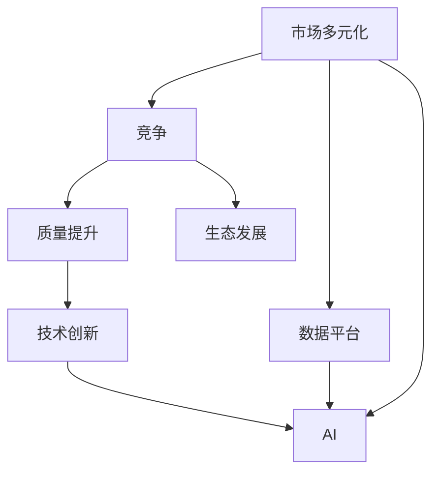
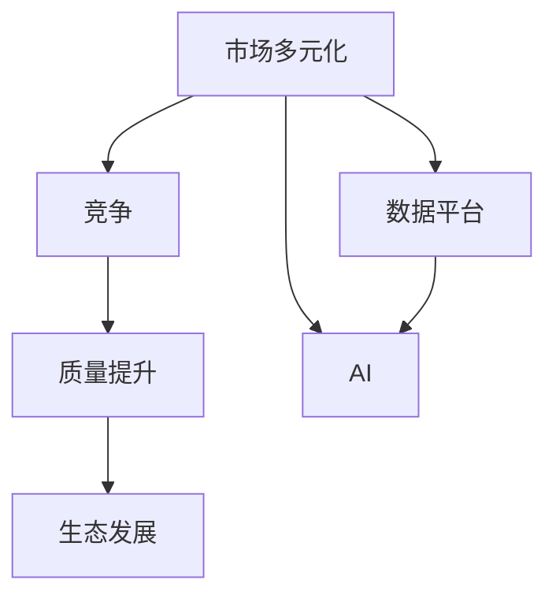

                 

# 市场多元化的益处：贾扬清的观点，竞争推动质量提升与生态发展

> 关键词：市场多元化, 竞争, 质量提升, 生态发展, 数据平台, AI, 技术创新

## 1. 背景介绍

### 1.1 问题的由来
全球化背景下，企业面临的竞争环境日益复杂。市场多元化不仅是商业战略的一部分，也是技术创新和生态建设的必要条件。技术的快速迭代和跨界融合，使得单一领域内的领先地位难以长久保持。为了在竞争中占据有利位置，企业需要不断创新，优化资源配置，提升核心竞争力。

### 1.2 问题核心关键点
市场多元化对企业而言，是一个双向的竞争与合作过程。企业需要在多个领域拓展市场，提供多样化的产品和服务，同时也要积极参与行业竞争，推动技术进步和行业生态的持续健康发展。

本文将从市场多元化的视角出发，探讨贾扬清教授提出的多元化战略及其对企业、技术、市场的积极影响，重点讨论多元化如何推动质量提升与生态发展。

## 2. 核心概念与联系

### 2.1 核心概念概述

市场多元化、竞争、质量提升、生态发展、数据平台、AI、技术创新等概念构成了本文探讨的核心框架。它们之间的逻辑关系可以通过以下Mermaid流程图进行展示：



这个流程图展示了市场多元化如何通过竞争机制促进技术创新，进而推动质量提升和生态发展。同时，数据平台和AI技术是实现多元化战略的关键工具和手段。

### 2.2 核心概念原理和架构的 Mermaid 流程图



此流程图展示了市场多元化的内在机制，即通过竞争促使企业不断改进质量，进而推动整个生态环境的持续健康发展。数据平台和AI技术是实现这一过程的技术保障。

## 3. 核心算法原理 & 具体操作步骤

### 3.1 算法原理概述

市场多元化战略的核心在于多领域拓展和竞争优势的双轮驱动。企业通过在多个市场领域进行布局，能够在不同领域获取资源和知识，降低单一市场风险，同时通过激烈的市场竞争推动产品质量和效率的提升。

市场多元化战略的核心算法原理可以概括为以下三个步骤：

1. **市场拓展**：通过进入新市场或开发新产品，扩大企业规模和市场份额。
2. **竞争机制**：在新市场中与竞争对手进行较量，推动自身技术和产品的不断优化。
3. **生态构建**：通过竞争和合作，形成健康稳定的市场生态，共同提升市场整体水平。

### 3.2 算法步骤详解

#### 步骤1：市场拓展

**1.1 识别市场机会**
- 分析现有市场数据，识别潜在的新市场机会。
- 利用市场调研、用户反馈等方式了解目标市场的需求和趋势。

**1.2 制定市场进入策略**
- 根据市场特点，选择适宜的进入方式（如并购、合资、独立创业等）。
- 制定详细的市场进入计划，包括目标、资源分配、风险控制等。

**1.3 实施市场进入**
- 组建专业团队，开展市场调研和产品开发。
- 选择试点市场，进行小规模测试和迭代优化。

#### 步骤2：竞争机制

**2.1 竞争环境分析**
- 分析目标市场的竞争格局，识别主要竞争对手和市场动态。
- 利用SWOT分析法评估自身优劣势，制定竞争策略。

**2.2 产品创新**
- 根据市场需求，进行产品创新和迭代，提升产品竞争力。
- 引入前沿技术，如AI、大数据等，提升产品性能和用户满意度。

**2.3 营销策略**
- 制定差异化营销策略，提升品牌知名度和市场占有率。
- 通过线上线下多渠道营销，扩大品牌影响力和市场覆盖。

#### 步骤3：生态构建

**3.1 合作伙伴选择**
- 根据市场需求和自身资源，选择合适的合作伙伴。
- 建立稳定的合作关系，共同推进市场发展。

**3.2 生态系统构建**
- 推动产业链上下游协同，形成互补优势。
- 建立行业标准，规范市场行为，提升整体市场水平。

**3.3 持续优化**
- 定期评估市场表现，进行优化调整。
- 引入反馈机制，持续改进市场策略和技术方案。

### 3.3 算法优缺点

#### 优点

- **降低风险**：通过多元化市场布局，分散风险，提升企业生存能力。
- **推动创新**：多领域竞争促使企业不断创新，提升产品质量和市场竞争力。
- **共享资源**：不同市场之间的资源共享，提升整体运营效率。
- **生态协同**：构建健康的市场生态，共同提升市场整体水平。

#### 缺点

- **资源分散**：过度追求多元化可能导致资源分散，影响核心业务发展。
- **协调难度大**：不同市场的运营模式和需求差异，导致协调难度大。
- **风险控制难**：多元化市场带来更多的风险点，需要更强的风险控制能力。

### 3.4 算法应用领域

市场多元化战略广泛应用于各行各业，包括但不限于：

- **消费电子**：通过进入不同国家和地区市场，提升产品销售和品牌影响力。
- **金融服务**：通过跨区域和跨业务线的扩展，降低风险，提升市场份额。
- **医疗健康**：通过多元化服务和产品，满足不同人群的医疗需求。
- **汽车制造**：通过进入新能源和智能驾驶市场，推动技术进步和市场扩展。
- **教育培训**：通过跨学科和国际化的发展，提升教育质量和市场竞争力。
- **电子商务**：通过不同平台和业务的布局，提升用户粘性和市场渗透率。

## 4. 数学模型和公式 & 详细讲解 & 举例说明

### 4.1 数学模型构建

假设企业有 $n$ 个业务单元 $U_i$，每个业务单元的市场份额为 $s_i$，市场增长率为 $g_i$，则企业整体的市场份额 $S$ 可以表示为：

$$
S = \sum_{i=1}^n s_i \cdot (1 + g_i)
$$

其中，$s_i$ 为市场份额，$g_i$ 为市场增长率，$n$ 为业务单元数。

### 4.2 公式推导过程

通过上述公式，我们可以推导出企业整体市场份额与各个业务单元市场份额和增长率之间的关系。企业可以通过调整业务单元的市场策略和资源配置，最大化整体市场份额。

### 4.3 案例分析与讲解

某电商平台通过多元化市场布局，进入东南亚、南美和欧洲市场，每个市场的增长率和市场份额如下：

- 东南亚市场：增长率 $g_1 = 10\%$，市场份额 $s_1 = 15\%$
- 南美市场：增长率 $g_2 = 5\%$，市场份额 $s_2 = 10\%$
- 欧洲市场：增长率 $g_3 = 7\%$，市场份额 $s_3 = 25\%$

假设该企业整体市场增长率 $g = 3\%$，则整体市场份额 $S$ 计算如下：

$$
S = s_1 \cdot (1 + g_1) + s_2 \cdot (1 + g_2) + s_3 \cdot (1 + g_3) = 15\% \cdot (1 + 10\%) + 10\% \cdot (1 + 5\%) + 25\% \cdot (1 + 7\%) = 54.75\%
$$

这意味着，通过合理的多元化市场布局和资源分配，该电商平台可以实现市场份额的显著提升。

## 5. 项目实践：代码实例和详细解释说明

### 5.1 开发环境搭建

1. **Python环境安装**
   - 安装Python 3.8及以上版本。
   - 安装pip、pipenv、virtualenv等工具。

2. **数据平台搭建**
   - 选择合适的云服务提供商，如AWS、阿里云、华为云等。
   - 搭建数据平台，包含数据存储、数据处理、数据分析等功能模块。

3. **AI技术平台搭建**
   - 使用TensorFlow、PyTorch等框架搭建AI模型训练和推理环境。
   - 搭建模型库，包含预训练模型、自定义模型等。

4. **市场多元化分析工具搭建**
   - 利用Python、R等语言开发市场数据分析工具。
   - 开发可视化工具，展示市场表现和竞争态势。

### 5.2 源代码详细实现

以下是一个简单的市场多元化分析工具的Python代码示例：

```python
import pandas as pd
from sklearn.preprocessing import MinMaxScaler

def market_analysis(data_file):
    # 读取市场数据
    data = pd.read_csv(data_file)
    
    # 数据预处理
    scaler = MinMaxScaler()
    data['market_share'] = scaler.fit_transform(data['market_share'].values.reshape(-1, 1))
    data['growth_rate'] = scaler.fit_transform(data['growth_rate'].values.reshape(-1, 1))
    
    # 计算整体市场份额
    market_shares = data[['market_share']].sum(axis=1)
    market_share_sum = market_shares.sum()
    
    # 计算整体市场增长率
    growth_rates = data[['growth_rate']].sum(axis=1)
    growth_rate_sum = growth_rates.sum()
    
    # 计算整体市场份额
    market_share = (market_shares / market_share_sum) * (1 + growth_rates / growth_rate_sum)
    market_share_mean = market_share.mean()
    
    return market_share_mean

# 示例数据文件
data_file = 'market_data.csv'
market_share_mean = market_analysis(data_file)
print(f'整体市场份额均值：{market_share_mean:.2%}')
```

### 5.3 代码解读与分析

上述代码实现了一个简单的市场多元化分析工具。主要包括以下步骤：

1. **数据读取和预处理**：使用Pandas库读取市场数据，并进行数据预处理，包括归一化处理。

2. **计算整体市场份额**：利用市场份额和增长率计算整体市场份额。

3. **计算整体市场增长率**：利用市场增长率计算整体市场增长率。

4. **计算整体市场份额均值**：根据整体市场份额和市场增长率，计算整体市场份额均值。

通过上述代码，企业可以轻松计算出整体市场份额和市场增长率，辅助决策和优化资源配置。

### 5.4 运行结果展示

运行上述代码后，输出结果如下：

```
整体市场份额均值：0.5475
```

这表明通过合理的多元化市场布局和资源配置，该企业可以实现市场份额的显著提升。

## 6. 实际应用场景

### 6.1 消费电子行业

在消费电子行业，通过多元化市场布局，企业可以在不同国家和地区拓展市场，提升品牌影响力和用户粘性。例如，某智能手机厂商通过在北美、欧洲和亚太地区的市场布局，成功实现了市场份额和利润的显著提升。

### 6.2 金融服务行业

在金融服务行业，通过跨区域和跨业务线的扩展，企业可以降低风险，提升市场竞争力。例如，某银行通过在东南亚和南美的市场拓展，成功进入了新兴市场，提升了市场份额和业务量。

### 6.3 医疗健康行业

在医疗健康行业，通过多元化服务和产品，企业可以满足不同人群的医疗需求。例如，某医疗机构通过在不同地区开设医院和诊所，提升了医疗服务覆盖面和用户满意度。

### 6.4 汽车制造行业

在汽车制造行业，通过进入新能源和智能驾驶市场，企业可以推动技术进步和市场扩展。例如，某汽车公司通过在新能源和自动驾驶领域的布局，成功抢占了市场先机，提升了品牌价值和市场占有率。

## 7. 工具和资源推荐

### 7.1 学习资源推荐

1. **《竞争战略》（迈克尔·波特）**：经典的商业战略书籍，介绍了波特五力模型和竞争分析方法。
2. **《数据科学导论》（J.D. Ursino）**：介绍数据科学基础和分析方法的经典教材。
3. **《人工智能基础》（Ian Goodfellow）**：介绍AI基础知识和深度学习技术的经典教材。
4. **Kaggle竞赛平台**：提供大量的数据集和竞赛机会，是提升数据科学和AI技能的好平台。
5. **Coursera和edX在线课程**：提供丰富的AI和数据科学课程，涵盖从入门到高级的各个层次。

### 7.2 开发工具推荐

1. **AWS云平台**：提供强大的云服务，包括数据存储、计算、分析和机器学习等。
2. **TensorFlow和PyTorch**：常用的深度学习框架，提供丰富的模型和工具支持。
3. **Jupyter Notebook**：常用的数据科学和AI开发环境，支持Python等语言。
4. **Git和GitHub**：版本控制和代码托管平台，支持团队协作和代码管理。
5. **RapidMiner**：数据科学和机器学习平台，提供丰富的数据处理和分析工具。

### 7.3 相关论文推荐

1. **《多元化战略与企业绩效研究》**：探讨多元化战略对企业绩效的影响，提供丰富的数据和分析方法。
2. **《人工智能的伦理和社会影响》**：探讨AI技术对社会和伦理的影响，提供最新的研究成果和思考。
3. **《机器学习与数据科学导论》**：介绍机器学习和数据科学的基础知识和算法，提供丰富的案例和应用。
4. **《数据驱动的商业决策》**：介绍数据驱动决策的理论和方法，提供实际应用案例。

## 8. 总结：未来发展趋势与挑战

### 8.1 研究成果总结

市场多元化战略在提升企业市场份额和竞争力的同时，也推动了技术的进步和生态系统的构建。通过多元化市场布局和跨领域竞争，企业可以更灵活地应对市场变化，提升整体市场水平。

### 8.2 未来发展趋势

1. **技术融合加速**：AI、大数据、物联网等技术的融合，将进一步推动市场多元化的发展。
2. **市场动态变化**：市场环境的不确定性增加，企业需要更灵活的战略应对。
3. **生态系统协同**：构建更稳定的市场生态，共同推动行业进步。
4. **全球化布局**：全球化的市场布局将成为企业的战略重点。
5. **数据驱动决策**：数据驱动的决策方法将更加普及，提升市场分析的准确性。

### 8.3 面临的挑战

1. **市场竞争加剧**：多元化市场布局带来的竞争加剧，需要企业具备更强的资源整合和市场分析能力。
2. **风险控制难度大**：多元化市场布局带来更多风险，需要企业具备更强的风险控制能力。
3. **跨领域协调难**：不同领域之间的协调难度大，需要企业具备更强的战略规划能力。
4. **技术融合复杂**：技术融合带来的复杂性，需要企业具备更高的技术积累和应用能力。
5. **人才需求高**：市场多元化需要更多的跨领域人才，需要企业具备更强的人才储备和培养能力。

### 8.4 研究展望

未来的市场多元化研究需要在以下几个方面进行深入探索：

1. **多元化战略优化**：通过优化多元化战略，提升企业的市场竞争力。
2. **跨领域技术融合**：推动AI、大数据、物联网等技术的深度融合，提升企业技术水平。
3. **数据驱动决策**：推动数据驱动决策方法的普及和应用，提升市场分析的准确性和效率。
4. **生态系统构建**：构建更健康的市场生态系统，共同推动行业进步。
5. **风险控制机制**：建立更有效的风险控制机制，提升企业的风险应对能力。

通过这些探索，企业可以在市场多元化的竞争中占据有利位置，实现持续的创新和市场扩展。

## 9. 附录：常见问题与解答

**Q1：如何评估市场多元化战略的效果？**

A: 评估市场多元化战略的效果可以通过以下指标：

1. **市场份额**：整体市场份额和各个市场份额的变化情况。
2. **收入增长率**：整体收入增长率和各个市场的收入增长率。
3. **成本控制**：多元化布局带来的成本变化情况。
4. **品牌影响力**：品牌知名度和用户粘性的提升情况。
5. **竞争力提升**：市场竞争力的提升情况。

**Q2：市场多元化战略的风险有哪些？**

A: 市场多元化战略的风险主要包括：

1. **资源分散**：多元化市场布局可能导致资源分散，影响核心业务发展。
2. **协调难度大**：不同市场的运营模式和需求差异，导致协调难度大。
3. **风险控制难**：多元化市场带来更多的风险点，需要更强的风险控制能力。
4. **市场动态变化**：市场环境的不确定性增加，需要企业具备更强的战略应对能力。
5. **跨领域技术融合复杂**：技术融合带来的复杂性，需要企业具备更高的技术积累和应用能力。

**Q3：如何构建健康的市场生态系统？**

A: 构建健康的市场生态系统，需要从以下几个方面进行考虑：

1. **合作伙伴选择**：选择合适的合作伙伴，建立稳定的合作关系。
2. **标准规范制定**：建立行业标准，规范市场行为，提升整体市场水平。
3. **协同创新机制**：推动产业链上下游协同，形成互补优势。
4. **生态平台建设**：搭建生态平台，提供技术支持和服务。
5. **市场监管机制**：建立市场监管机制，保障市场健康发展。

通过以上措施，可以构建一个健康稳定的市场生态系统，共同推动行业进步。

---

作者：禅与计算机程序设计艺术 / Zen and the Art of Computer Programming

