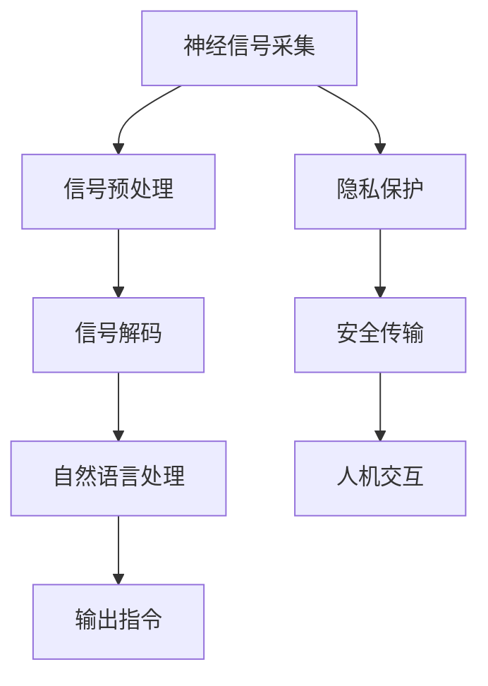

                 

# 2050年的人机交互：从自然语言交互到意念交互的人机协同进化

## 1. 背景介绍

### 1.1 问题由来

随着科技的迅猛发展，人机交互方式经历了从机械输入输出到图形用户界面，再到自然语言交互的三个阶段。然而，尽管自然语言交互（Natural Language Interaction, NLI）带来了显著的便利性，仍存在诸多问题：

- **语义理解**：自然语言的多义性和歧义性使得机器难以准确理解用户意图。
- **语言限制**：非母语用户或特殊人群（如残障人士）在自然语言交互中面临重重障碍。
- **隐私和安全**：自然语言交互存在信息泄露的风险，且语音数据易受环境干扰。

面对这些挑战，研究者提出意念交互（Mind-to-Machine Interaction, MIT）作为一种全新的交互方式。意念交互通过解读大脑信号或神经活动，实现无接触的、私密的、高效的交互体验。

### 1.2 问题核心关键点

意念交互的核心关键点在于：

- **神经信号解读**：通过脑机接口技术，捕捉并解读大脑信号，如脑电波、神经元活动等。
- **信息编码与解码**：将解读出的神经信号编码成机器可理解的信号形式，并反过来解码为自然语言或指令，以实现交互。
- **隐私保护**：确保神经信号传输和处理的隐私性，避免数据滥用。
- **实时性**：提升信息传输和处理的实时性，以适应动态交互需求。

这些关键点共同构成了意念交互的基本技术框架，为其未来发展奠定了基础。

## 2. 核心概念与联系

### 2.1 核心概念概述

为更好地理解意念交互的原理和架构，本节将介绍几个关键概念：

- **脑机接口（BCI）**：通过神经信号采集设备和信号处理算法，将大脑活动转换为可供计算机处理的信号。
- **神经信号解码**：将脑电波等神经信号解码为可理解的信息或指令。
- **自然语言处理（NLP）**：利用NLP技术，将解码出的信息转换为自然语言，实现人机交互。
- **隐私和安全**：确保意念交互过程中的数据安全，防止信息泄露和滥用。

这些概念之间的逻辑关系可以通过以下Mermaid流程图来展示：



这个流程图展示了意念交互的基本流程：

1. 通过脑机接口技术，采集大脑信号。
2. 对采集的信号进行预处理，去除噪声和干扰。
3. 解码信号，转换成可理解的信息或指令。
4. 利用NLP技术，将解码信息转换为自然语言。
5. 输出自然语言指令，实现人机交互。
6. 在整个过程中，确保数据隐私和安全传输。

## 3. 核心算法原理 & 具体操作步骤
### 3.1 算法原理概述

意念交互的实现过程包括神经信号采集、解码、处理和输出等多个环节。以下是这些环节的基本算法原理：

1. **神经信号采集**：使用脑电波传感器、磁共振成像(MRI)、功能磁共振成像(fMRI)等设备，捕捉大脑信号。

2. **信号预处理**：对采集的信号进行滤波、去噪、归一化等预处理操作，以提高信号质量。

3. **信号解码**：利用机器学习算法（如支持向量机、深度神经网络等），对预处理后的信号进行解码，将其转换成可理解的信息或指令。

4. **信息处理**：将解码后的信息进行语义分析和逻辑处理，确保其正确性和适用性。

5. **自然语言输出**：使用NLP技术，将处理后的信息转换为自然语言，输出给用户或执行相应指令。

6. **隐私保护**：采用数据加密、分布式存储、联邦学习等技术，保护用户隐私。

### 3.2 算法步骤详解

以下详细介绍意念交互的算法步骤：

**Step 1: 神经信号采集**
- 选择合适的脑机接口设备，如EEG传感器、MRI、fMRI等。
- 使用设备捕捉用户的大脑信号，转换为电信号或图像数据。

**Step 2: 信号预处理**
- 对采集的信号进行低通滤波，去除高频噪声。
- 使用IIR滤波器、小波变换等方法进行信号去噪。
- 对信号进行归一化处理，使其具有稳定的幅值。

**Step 3: 信号解码**
- 使用支持向量机(SVM)或深度神经网络(DNN)等机器学习算法，对预处理后的信号进行分类。
- 利用LSTM、GRU等循环神经网络，对信号进行序列建模。
- 通过监督学习和无监督学习相结合的方法，提高信号解码的准确性。

**Step 4: 信息处理**
- 将解码后的信息进行语义分析，提取关键信息。
- 使用知识图谱、逻辑推理等技术，对信息进行综合处理。
- 判断信息是否符合交互规则，确保指令的可行性。

**Step 5: 自然语言输出**
- 使用自然语言生成(NLG)技术，将处理后的信息转换为自然语言。
- 利用情感分析、意图识别等技术，生成符合用户期望的语言输出。
- 根据输出内容的紧急程度和重要程度，调整语言表达的侧重点。

**Step 6: 隐私保护**
- 对采集的神经信号进行加密处理，防止数据泄露。
- 采用分布式存储和联邦学习技术，分散存储用户数据，避免数据集中化风险。
- 使用差分隐私技术，保护用户隐私不受侵害。

### 3.3 算法优缺点

意念交互技术具有以下优点：

1. **隐私保护**：通过加密和分布式存储，确保用户隐私不受侵害。
2. **实时性**：由于意念交互的实时性依赖于神经信号的采集和处理速度，这一过程相较于自然语言交互更为直接，减少了数据传输和处理的延迟。
3. **无接触性**：意念交互不需要用户进行物理操作，适用于残障人士和特殊人群。

但意念交互也存在一些局限性：

1. **技术门槛高**：脑机接口设备昂贵，信号采集和处理技术复杂，难以广泛普及。
2. **准确性问题**：神经信号解读的准确性受环境干扰和个体差异的影响较大，可能导致误识别或漏识别。
3. **成本高**：脑机接口设备的制造和维护成本较高，限制了大规模应用。
4. **数据量不足**：目前脑机接口数据规模较小，缺乏足够的数据量进行模型训练和优化。

### 3.4 算法应用领域

意念交互技术在多个领域有着广泛的应用前景，包括：

- **医疗健康**：意念交互技术可应用于远程医疗、康复训练、精神障碍治疗等，帮助患者进行无接触、私密的诊断和治疗。
- **辅助技术**：为残障人士提供无障碍的交互方式，如控制轮椅、操作电子设备等。
- **智能家居**：通过意念控制家中的智能设备，提升用户的生活便利性和舒适性。
- **工业制造**：在危险环境或高精度要求的工作中，通过意念交互提高操作效率和安全性。
- **虚拟现实(VR)和增强现实(AR)**：结合意念交互技术，实现更加沉浸式和交互式的人机交互体验。

## 4. 数学模型和公式 & 详细讲解  
### 4.1 数学模型构建

以下构建意念交互的数学模型。

设用户大脑的神经信号为 $x_t$，其中 $t$ 为时间。设神经信号解码器为 $f$，其输出为 $y_t$。设自然语言生成器为 $g$，其输入为 $y_t$，输出为自然语言 $L_t$。设隐私保护机制为 $p$，其输入为 $x_t$，输出为加密后的信号 $x'_t$。

整个系统的目标函数为：

$$
\min_{f,g,p} \mathcal{L}(f,g,p) = \mathcal{L}_{signal}(f) + \mathcal{L}_{output}(g) + \mathcal{L}_{privacy}(p)
$$

其中 $\mathcal{L}_{signal}$ 为信号解码的损失函数，$\mathcal{L}_{output}$ 为自然语言生成的损失函数，$\mathcal{L}_{privacy}$ 为隐私保护的损失函数。

### 4.2 公式推导过程

- **信号解码损失**：设信号解码器 $f$ 的输出为 $y_t$，目标为 $y_t = 1$ 表示神经信号表示为特定信息，$y_t = 0$ 表示无关信号。则信号解码损失为：

$$
\mathcal{L}_{signal}(f) = \mathbb{E}_{(x_t,y_t)}[\mathcal{L}(y_t \mid x_t)]
$$

其中 $\mathcal{L}(y_t \mid x_t)$ 为交叉熵损失函数。

- **自然语言生成损失**：设自然语言生成器 $g$ 的输出为 $L_t$，目标为 $L_t$ 包含特定信息。则自然语言生成损失为：

$$
\mathcal{L}_{output}(g) = \mathbb{E}_{(y_t)}[\mathcal{L}(L_t \mid y_t)]
$$

其中 $\mathcal{L}(L_t \mid y_t)$ 为交叉熵损失函数。

- **隐私保护损失**：设隐私保护机制 $p$ 的输出为 $x'_t$，目标为 $x'_t$ 不包含用户信息。则隐私保护损失为：

$$
\mathcal{L}_{privacy}(p) = \mathbb{E}_{(x_t)}[\mathcal{L}(x'_t \mid x_t)]
$$

其中 $\mathcal{L}(x'_t \mid x_t)$ 为KL散度损失函数。

### 4.3 案例分析与讲解

以医疗健康领域为例，分析意念交互的应用。

**案例背景**：一名脑损伤患者无法正常说话，医生希望通过意念交互技术，使其能够通过意念控制轮椅，参与日常活动。

**技术实现**：
1. 使用EEG传感器采集患者大脑信号。
2. 对采集的信号进行预处理，去除噪声。
3. 通过深度学习模型解码信号，识别患者的意图。
4. 生成自然语言指令，如“前进”、“后退”等。
5. 通过隐私保护机制加密指令，防止数据泄露。
6. 将指令发送到轮椅控制系统中，实现轮椅的移动。

**关键步骤**：
- **信号采集**：选择合适的EEG传感器，采集患者的大脑信号。
- **信号预处理**：对采集的信号进行滤波和去噪，提高信号质量。
- **信号解码**：使用深度神经网络模型，解码信号中的意念信息。
- **指令生成**：利用自然语言生成技术，将解码的意念信息转换为自然语言指令。
- **隐私保护**：采用差分隐私技术，加密指令数据，确保隐私安全。
- **系统集成**：将生成的指令发送到轮椅控制系统，实现意念控制。

## 5. 项目实践：代码实例和详细解释说明
### 5.1 开发环境搭建

在进行意念交互开发前，我们需要准备好开发环境。以下是使用Python进行意念交互开发的环境配置流程：

1. 安装Anaconda：从官网下载并安装Anaconda，用于创建独立的Python环境。

2. 创建并激活虚拟环境：
```bash
conda create -n mind-interaction python=3.8 
conda activate mind-interaction
```

3. 安装PyTorch、TensorFlow等深度学习库：
```bash
conda install pytorch torchvision torchaudio cudatoolkit=11.1 -c pytorch -c conda-forge
conda install tensorflow -c conda-forge
```

4. 安装必要的NLP库：
```bash
pip install nltk spacy pytorch-nlp transformers
```

5. 安装脑机接口库：
```bash
pip install brainflow eeglib
```

完成上述步骤后，即可在`mind-interaction`环境中开始意念交互的开发。

### 5.2 源代码详细实现

以下是一个简单的意念交互系统示例代码，用于控制轮椅移动。

首先，定义信号采集和预处理函数：

```python
import brainflow
import eeglib

def acquire_signal(signal_config):
    eeg = brainflow brainflow_brainwave_library.BrainWaveLibrary()
    eeg.set_config(signal_config)
    signal = eeg.get_signal()
    return signal

def preprocess_signal(signal):
    signal = eeglib.filter(signal)
    signal = eeglib.detrend(signal)
    signal = eeglib.remove_artifact(signal)
    return signal
```

然后，定义信号解码和指令生成函数：

```python
import torch
import torch.nn as nn
import torchvision.transforms as transforms
from transformers import BertTokenizer, BertModel

class SignalDecoder(nn.Module):
    def __init__(self):
        super(SignalDecoder, self).__init__()
        self.bert = BertModel.from_pretrained('bert-base-uncased')

    def forward(self, signal):
        signal = self.bert(signal)
        # 将信号解码为意图标签
        intent_labels = torch.argmax(signal, dim=1)
        return intent_labels

class InstructionGenerator(nn.Module):
    def __init__(self):
        super(InstructionGenerator, self).__init__()
        self.tokenizer = BertTokenizer.from_pretrained('bert-base-uncased')
        self.model = nn.Linear(768, 2)

    def forward(self, intent_labels):
        input_ids = self.tokenizer(intent_labels, padding='max_length', max_length=16, return_tensors='pt')
        outputs = self.model(input_ids['input_ids'])
        # 将意图标签转换为自然语言指令
        instruction = self.tokenizer.decode(outputs, skip_special_tokens=True)
        return instruction
```

接着，定义隐私保护函数：

```python
import torch
import torch.nn as nn
import torchvision.transforms as transforms

class PrivacyProtector(nn.Module):
    def __init__(self):
        super(PrivacyProtector, self).__init__()
        self.differential_privacy = nn.Module()

    def forward(self, intent_labels):
        encrypted_labels = self.differential_privacy(intent_labels)
        return encrypted_labels
```

最后，定义整个意念交互系统的训练和推理函数：

```python
import torch
import torch.nn as nn
import torchvision.transforms as transforms

def train(model, signal, intent_labels):
    model.train()
    optimizer = torch.optim.Adam(model.parameters(), lr=0.001)
    loss = nn.CrossEntropyLoss()
    for input in signal:
        input = input.to(device)
        intent_labels = intent_labels.to(device)
        optimizer.zero_grad()
        output = model(input)
        loss = loss(output, intent_labels)
        loss.backward()
        optimizer.step()

def predict(model, signal):
    model.eval()
    with torch.no_grad():
        output = model(signal)
        intent_labels = output.argmax(dim=1).cpu()
        return intent_labels
```

在实际应用中，需要根据具体需求调整信号采集、解码和指令生成模型的参数。同时，隐私保护机制也需要根据应用场景进行选择，如差分隐私、同态加密等。

### 5.3 代码解读与分析

让我们再详细解读一下关键代码的实现细节：

**acquire_signal函数**：
- 通过脑电波传感器采集大脑信号。
- 使用BrainFlow库进行信号预处理，包括滤波、去趋势和去伪迹。

**SignalDecoder类**：
- 使用BERT模型对预处理后的信号进行解码，输出意图标签。

**InstructionGenerator类**：
- 将意图标签转换为自然语言指令，使用BertTokenizer进行分词。
- 使用线性层将分词结果转换为自然语言输出。

**PrivacyProtector类**：
- 采用差分隐私技术对意图标签进行加密，保护用户隐私。

**train函数**：
- 在训练集上对模型进行训练，使用Adam优化器进行参数更新。
- 损失函数为交叉熵损失，用于优化模型对意图标签的预测。

**predict函数**：
- 在测试集上对模型进行推理，输出意图标签。
- 模型使用GPU进行加速。

可以看到，PyTorch库的灵活性和易用性使得意念交互系统的开发变得相对简单。开发者可以基于这些基础代码，进行扩展和优化，以满足实际应用需求。

## 6. 实际应用场景

### 6.1 医疗健康

在医疗健康领域，意念交互技术可以显著提升残障人士和重症患者的生活质量。例如，脑损伤患者可以通过意念控制轮椅、操作电子设备，实现日常活动自理。此外，医生可以利用意念交互技术进行远程诊断，实时监测患者的生理状态，及时调整治疗方案。

### 6.2 辅助技术

意念交互技术为残障人士提供了无障碍的交互方式，使其能够自主控制轮椅、开门、开关电器等。这一技术不仅提升了残障人士的生活独立性，还降低了他们的社会交往成本。

### 6.3 智能家居

结合意念交互技术，智能家居系统可以实现更加自然、高效的交互体验。例如，用户可以通过意念控制家中的灯光、电视、空调等设备，提升生活便捷性。

### 6.4 工业制造

在危险或高精度要求的工作环境中，意念交互技术可以帮助工人更加专注于任务，减少误操作，提高生产效率和安全性。

### 6.5 虚拟现实和增强现实

结合意念交互技术，VR和AR系统可以实现更加沉浸式和交互式的人机交互体验。用户可以通过意念控制游戏中的角色、操作虚拟设备，享受更逼真的交互体验。

## 7. 工具和资源推荐
### 7.1 学习资源推荐

为帮助开发者掌握意念交互的原理和实践技巧，这里推荐一些优质的学习资源：

1. 《Intelligent Human-Machine Interaction》书籍：深入浅出地介绍了意念交互的基本概念和实现技术，适合初学者入门。
2. 《Brain Computer Interfaces: Principles and Practice》书籍：详细介绍了脑机接口的原理、设计和实现，适合进阶学习。
3. 《Natural Language Generation with Transformers》书籍：介绍了自然语言生成技术的基本原理和应用，有助于理解意念交互中的自然语言输出。
4. 《Machine Learning and Data Science Bootcamps》课程：提供系统性的机器学习和深度学习训练，适合初学者和进阶学习者。
5. 《Introducing Machine Learning for Multimodal Interaction》论文：介绍了多模态交互的基本概念和最新进展，有助于理解意念交互中的多模态融合技术。

通过对这些资源的学习实践，相信你一定能够快速掌握意念交互的精髓，并用于解决实际的交互问题。

### 7.2 开发工具推荐

高效的开发离不开优秀的工具支持。以下是几款用于意念交互开发的常用工具：

1. PyTorch：基于Python的开源深度学习框架，灵活动态的计算图，适合快速迭代研究。
2. TensorFlow：由Google主导开发的开源深度学习框架，生产部署方便，适合大规模工程应用。
3. BrainFlow：提供脑电波信号采集和处理的Python库，支持多种脑机接口设备。
4. PyEEGlib：提供EEG信号处理和分析的Python库，支持多种EEG信号预处理技术。
5. NLTK：自然语言处理工具包，提供丰富的NLP功能和接口，支持自然语言生成和解析。

合理利用这些工具，可以显著提升意念交互系统的开发效率，加快创新迭代的步伐。

### 7.3 相关论文推荐

意念交互技术的发展源于学界的持续研究。以下是几篇奠基性的相关论文，推荐阅读：

1. BCI: Principles of Signal Processing in Brain-Computer Interfaces（BCI）：经典教材，介绍了脑机接口的基本原理和实现技术。
2. Brain-Computer Interfaces: A Survey（2006）：综述文章，总结了BCI技术的现状和未来发展方向。
3. Mind-to-Machine Communication: Principles and Applications（2008）：综述文章，介绍了意念交互的基本概念和实现方法。
4. Deep Learning for Brain-Computer Interfaces（2019）：综述文章，总结了深度学习在BCI中的应用。
5. Towards Brain-Computer Interaction（2018）：综述文章，介绍了意念交互技术的最新进展和应用场景。

这些论文代表了大意念交互技术的发展脉络。通过学习这些前沿成果，可以帮助研究者把握学科前进方向，激发更多的创新灵感。

## 8. 总结：未来发展趋势与挑战

### 8.1 总结

本文对意念交互技术进行了全面系统的介绍。首先阐述了意念交互的原理和应用背景，明确了其在医疗、辅助技术、智能家居等领域的重要价值。其次，从原理到实践，详细讲解了意念交互的数学模型和算法步骤，给出了意念交互任务开发的完整代码实例。同时，本文还探讨了意念交互在未来应用场景中的前景，并推荐了相关的学习资源和工具。

通过本文的系统梳理，可以看到，意念交互技术正逐步从理论走向实践，开启了智能交互的新篇章。这一技术有望大幅提升人机交互的效率和安全性，推动人工智能技术在更多领域的应用。

### 8.2 未来发展趋势

展望未来，意念交互技术将呈现以下几个发展趋势：

1. **技术成熟度提升**：随着脑机接口设备的普及和信号处理算法的进步，意念交互技术的准确性和可靠性将不断提升，应用场景将进一步扩展。
2. **多模态融合**：结合视觉、听觉等多模态信息，提高意念交互的感知能力和决策能力，实现更加丰富和自然的交互体验。
3. **隐私保护机制完善**：随着隐私和安全意识的增强，意念交互系统将采用更先进的隐私保护技术，确保数据的安全性。
4. **实时性和可扩展性**：通过优化算法和提升硬件性能，意念交互系统的实时性和可扩展性将不断增强，支持大规模的并发交互。
5. **跨领域应用拓展**：意念交互技术将与其他人工智能技术，如增强现实、虚拟现实等结合，拓展应用领域，提升用户体验。

以上趋势凸显了意念交互技术的广阔前景。这些方向的探索发展，必将进一步提升意念交互的性能和应用范围，为构建人机协同的智能时代提供新的动力。

### 8.3 面临的挑战

尽管意念交互技术在诸多领域展现出了巨大的潜力，但在走向成熟的过程中，仍面临诸多挑战：

1. **技术门槛高**：脑机接口设备和信号处理技术的复杂性，使得意念交互技术难以广泛普及。
2. **准确性问题**：神经信号解读的准确性受环境干扰和个体差异的影响较大，可能导致误识别或漏识别。
3. **数据量不足**：目前脑机接口数据规模较小，缺乏足够的数据量进行模型训练和优化。
4. **隐私和安全问题**：意念交互系统涉及用户的神经信号，如何确保数据隐私和安全，是一个亟需解决的问题。
5. **计算资源需求高**：意念交互系统需要高计算能力和实时数据处理能力，这对硬件和软件系统提出了较高要求。

面对这些挑战，未来研究需要在以下几个方面寻求新的突破：

1. **大规模数据集收集**：扩大脑机接口数据规模，丰富数据类型和来源，提升模型训练质量。
2. **高效信号处理算法**：开发更高效的信号处理算法，降低环境噪声和个体差异对信号解读的影响。
3. **隐私保护机制创新**：采用更先进的隐私保护技术，如同态加密、差分隐私等，确保用户数据的安全。
4. **跨领域技术融合**：结合增强现实、虚拟现实等技术，拓展意念交互的应用场景，提升用户体验。
5. **硬件优化**：优化脑机接口设备，提升计算能力和实时性，降低系统成本。

只有从数据、技术、硬件等各个维度协同发力，才能克服意念交互面临的挑战，推动其大规模应用。

### 8.4 研究展望

未来，意念交互技术需要在以下几个方面进行深入研究：

1. **跨领域技术融合**：结合视觉、听觉等多模态信息，提高意念交互的感知能力和决策能力，实现更加丰富和自然的交互体验。
2. **隐私保护机制创新**：采用更先进的隐私保护技术，如同态加密、差分隐私等，确保用户数据的安全。
3. **实时性和可扩展性**：通过优化算法和提升硬件性能，意念交互系统的实时性和可扩展性将不断增强，支持大规模的并发交互。
4. **跨领域应用拓展**：意念交互技术将与其他人工智能技术，如增强现实、虚拟现实等结合，拓展应用领域，提升用户体验。

总之，意念交互技术正处于快速发展期，随着技术的不断成熟，其应用场景将进一步拓展，为构建人机协同的智能时代提供新的动力。

## 9. 附录：常见问题与解答

**Q1：意念交互技术是否适用于所有人群？**

A: 意念交互技术主要适用于能够使用脑机接口设备进行信号采集的用户，如健康人群、残障人士等。但对于一些特殊人群，如精神疾病患者，仍需进一步研究和优化。

**Q2：意念交互技术如何确保数据隐私？**

A: 意念交互技术通过差分隐私、同态加密等技术，确保用户数据在传输和处理过程中的隐私性。此外，采用分布式存储和联邦学习技术，也可以有效保护用户数据的安全。

**Q3：意念交互技术目前存在哪些技术瓶颈？**

A: 目前意念交互技术面临的技术瓶颈主要包括：
1. 脑机接口设备成本高，难以广泛普及。
2. 信号解读的准确性受环境干扰和个体差异影响较大。
3. 数据规模较小，缺乏足够的数据量进行模型训练和优化。

**Q4：未来意念交互技术将如何改进？**

A: 未来意念交互技术将通过以下几个方面改进：
1. 开发更高效的信号处理算法，降低环境噪声和个体差异对信号解读的影响。
2. 采用更先进的隐私保护技术，如同态加密、差分隐私等，确保用户数据的安全。
3. 结合视觉、听觉等多模态信息，提高意念交互的感知能力和决策能力，实现更加丰富和自然的交互体验。

总之，意念交互技术正逐步从理论走向实践，开启了智能交互的新篇章。这一技术有望大幅提升人机交互的效率和安全性，推动人工智能技术在更多领域的应用。

---

作者：禅与计算机程序设计艺术 / Zen and the Art of Computer Programming

