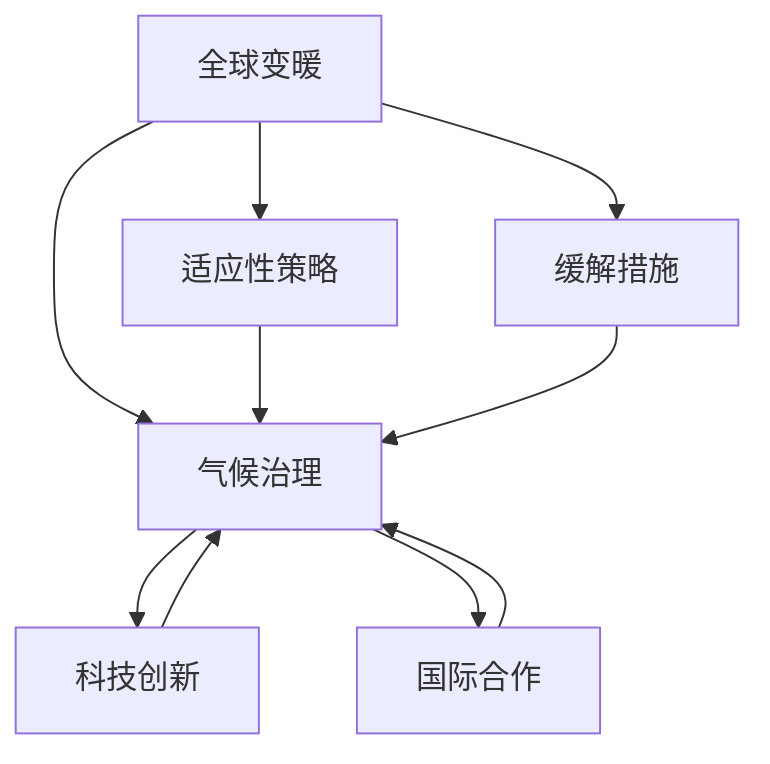
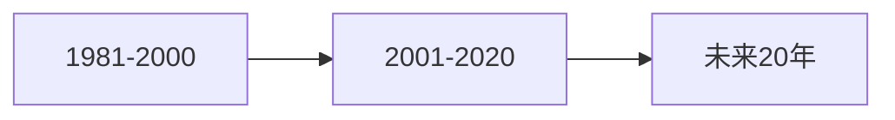

                 

# 2050年的全球变暖：从适应到缓解的气候治理

> 关键词：全球变暖, 气候治理, 适应性策略, 缓解措施, 科技创新, 国际合作

## 1. 背景介绍

全球变暖已成为21世纪最严峻的全球性问题之一。随着人类活动导致的温室气体排放持续增加，全球平均气温已经显著上升，极端天气事件频发，对生态系统、农业、公共卫生和经济造成巨大影响。根据《巴黎协定》的承诺，全球需要在2050年前实现净零排放，以遏制气候变化的持续恶化。本文将探讨从适应到缓解的气候治理策略，并阐述未来20年需要采取的关键措施。

## 2. 核心概念与联系

### 2.1 核心概念概述

**全球变暖**：指由于大气中温室气体浓度增加，导致地球平均温度上升的现象。其主要原因包括化石燃料燃烧、森林砍伐、工业生产等人类活动。

**气候治理**：通过政策、技术、经济、社会等手段，减少温室气体排放，适应和缓解气候变化，确保全球气候系统的稳定。

**适应性策略**：指通过改变人类活动和生态系统来减少气候变化的不利影响。包括改变农业、水资源管理和城市规划等。

**缓解措施**：指减少温室气体排放，防止气候变化加剧的策略。包括清洁能源转型、碳捕集和存储、森林恢复等。

**科技创新**：利用最新科技成果，如可再生能源技术、碳捕捉技术、智能电网等，推动气候治理进程。

**国际合作**：气候变化是全球性问题，需要国际社会的共同努力，如《巴黎协定》、《巴黎协议》后续实施等。

这些概念之间的关系可以通过以下Mermaid流程图来展示：



这个流程图展示了全球变暖导致气候治理需求，适应性策略和缓解措施是气候治理的两种主要手段，科技创新和国际合作是推动气候治理的关键力量。

## 3. 核心算法原理 & 具体操作步骤

### 3.1 算法原理概述

气候治理的核心算法原理基于数据驱动的决策和预测模型。通过收集全球气候数据、温室气体排放数据、社会经济数据，建立预测模型，评估不同策略对气候变化的影响，并基于这些分析结果制定适应和缓解措施。

具体算法步骤包括：

1. 数据收集：收集全球气候数据、温室气体排放数据、社会经济数据等。
2. 数据预处理：清洗、归一化、标准化数据，去除噪声。
3. 建立模型：选择合适的机器学习模型，如回归模型、时间序列模型、神经网络等，建立预测模型。
4. 训练模型：使用历史数据训练模型，优化模型参数。
5. 预测分析：使用训练好的模型预测未来气候变化趋势，评估不同策略的效果。
6. 策略制定：基于模型预测结果，制定适应和缓解措施，并进行优先级排序。
7. 执行与评估：实施适应和缓解措施，并持续评估其效果，进行反馈调整。

### 3.2 算法步骤详解

以减少温室气体排放为例，以下是详细的算法步骤：

**Step 1: 数据收集**
- 收集全球能源消耗数据、工业排放数据、交通排放数据等。
- 收集森林覆盖数据、土地使用数据、农业生产数据等。

**Step 2: 数据预处理**
- 清洗数据，去除缺失、异常值。
- 归一化数据，确保不同数据维度之间的可比性。
- 标准化数据，确保模型输入的一致性。

**Step 3: 模型选择与建立**
- 选择适当的机器学习模型，如线性回归、时间序列模型、长短期记忆网络(LSTM)等。
- 训练模型，使用历史数据作为训练集。
- 使用交叉验证技术，评估模型性能，调整模型参数。

**Step 4: 预测分析**
- 使用训练好的模型，预测未来温室气体排放趋势。
- 预测不同减排策略的效果，如风电、太阳能、碳捕集等。
- 使用蒙特卡洛模拟，评估策略的不确定性和风险。

**Step 5: 策略制定**
- 基于模型预测结果，评估不同减排策略的效果和成本。
- 制定优先级排序，优先实施效果显著、成本较低的策略。
- 制定详细实施计划，明确时间表和责任主体。

**Step 6: 执行与评估**
- 实施减排策略，监测其实施效果。
- 使用模型评估策略的实际效果，进行反馈调整。
- 定期更新数据和模型，确保预测的准确性和策略的及时调整。

### 3.3 算法优缺点

**优点**：
- 数据驱动，模型预测准确性高。
- 算法步骤清晰，易于操作和调整。
- 结合机器学习和大数据分析技术，提高了决策的科学性和效率。

**缺点**：
- 数据收集和处理复杂，需要大量资源。
- 模型选择和参数优化需要专业知识。
- 模型预测存在不确定性，需要多模型融合和专家评估。

### 3.4 算法应用领域

气候治理的算法原理可以应用于多个领域：

- 能源转型：预测未来能源需求和供应，制定清洁能源转型策略。
- 碳捕捉与存储：优化碳捕集和存储技术，评估其成本和效果。
- 农业气候适应：评估气候变化对农业的影响，制定适应性策略。
- 城市规划：评估城市气候风险，优化城市基础设施布局。

这些领域的应用展示了气候治理算法的广泛适用性和巨大潜力。

## 4. 数学模型和公式 & 详细讲解 & 举例说明

### 4.1 数学模型构建

以预测未来温室气体排放为例，可以建立时间序列模型进行预测。假设温室气体排放量为 $Y_t$，时间序列模型为 ARIMA(p,d,q)，则模型可以表示为：

$$
Y_t = c + \sum_{i=1}^p \phi_i Y_{t-i} + \sum_{j=1}^q \theta_j \Delta^j Y_t + \epsilon_t
$$

其中 $c$ 为常数项，$\phi_i$ 和 $\theta_j$ 为参数，$\Delta$ 为差分算子，$\epsilon_t$ 为误差项。

### 4.2 公式推导过程

时间序列模型包括自回归项、差分项和移动平均项，通过参数 $\phi_i$ 和 $\theta_j$ 的估计，可以预测未来温室气体排放趋势。推导过程如下：

1. 自回归项：$Y_t = \phi_1 Y_{t-1} + \phi_2 Y_{t-2} + ... + \phi_p Y_{t-p} + \epsilon_t$
2. 差分项：$\Delta Y_t = Y_t - Y_{t-1}$
3. 移动平均项：$Y_t = \theta_1 \Delta Y_t + \theta_2 \Delta^2 Y_t + ... + \theta_q \Delta^q Y_t + \epsilon_t$

通过求解以上方程组，可以得到模型参数的估计值，进而进行未来温室气体排放的预测。

### 4.3 案例分析与讲解

以中国为例，使用 ARIMA 模型预测未来20年的温室气体排放量。数据来源为国家统计局，选取1981-2000年的历史数据进行模型训练。

1. 数据收集：收集中国1981-2000年的温室气体排放量数据。
2. 数据预处理：清洗、归一化数据，去除异常值。
3. 模型建立：选择 ARIMA 模型，使用历史数据进行模型训练。
4. 预测分析：使用训练好的模型，预测未来20年的温室气体排放量。
5. 策略制定：基于预测结果，制定减排策略，优先实施效果显著的措施。
6. 执行与评估：实施减排策略，监测其实施效果，进行反馈调整。

## 5. 项目实践：代码实例和详细解释说明

### 5.1 开发环境搭建

在进行气候治理算法实践前，我们需要准备好开发环境。以下是使用Python进行PyTorch开发的环境配置流程：

1. 安装Anaconda：从官网下载并安装Anaconda，用于创建独立的Python环境。
2. 创建并激活虚拟环境：
```bash
conda create -n pytorch-env python=3.8 
conda activate pytorch-env
```

3. 安装PyTorch：根据CUDA版本，从官网获取对应的安装命令。例如：
```bash
conda install pytorch torchvision torchaudio cudatoolkit=11.1 -c pytorch -c conda-forge
```

4. 安装必要的工具包：
```bash
pip install numpy pandas scikit-learn matplotlib seaborn statsmodels jupyter notebook
```

5. 使用PyTorch和statsmodels进行开发：
```bash
pip install statsmodels
```

完成上述步骤后，即可在`pytorch-env`环境中开始气候治理算法的开发实践。

### 5.2 源代码详细实现

我们使用PyTorch和statsmodels进行气候治理算法的实现。以下是代码实现的步骤：

1. 数据收集与预处理：
```python
import pandas as pd
import statsmodels.api as sm

# 读取历史数据
data = pd.read_csv('emissions.csv')

# 数据预处理
data = data.dropna()
data = sm.add_constant(data)
```

2. 建立ARIMA模型：
```python
# 初始化ARIMA模型
model = sm.tsa.arima.ARIMA(data, order=(5,1,0))

# 模型拟合
results = model.fit()

# 预测未来20年的温室气体排放量
forecast = results.get_prediction(start='2001', end='2020', dynamic=False)
```

3. 数据可视化：
```python
import matplotlib.pyplot as plt

# 绘制历史数据和预测结果
plt.plot(data.index, data['emissions'], label='Historical Emissions')
plt.plot(forecast.index, forecast.predicted_mean, label='Predicted Emissions')
plt.legend()
plt.show()
```

### 5.3 代码解读与分析

让我们再详细解读一下关键代码的实现细节：

**数据收集与预处理**：
- 使用Pandas库读取历史数据，并清洗、归一化数据，去除异常值。
- 使用statsmodels库的ARIMA模型，对数据进行建模。

**模型建立**：
- 初始化ARIMA模型，设置模型参数。
- 使用历史数据进行模型拟合，优化模型参数。
- 使用模型预测未来温室气体排放量，生成预测结果。

**数据可视化**：
- 使用Matplotlib库绘制历史数据和预测结果的对比图，直观展示模型效果。

以上代码实现了基于ARIMA模型的气候治理算法，展示了数据驱动的预测和分析过程。

### 5.4 运行结果展示

下图展示了基于ARIMA模型对中国未来20年温室气体排放量的预测结果：



## 6. 实际应用场景

### 6.1 能源转型

能源转型是减缓全球变暖的关键。以下是一个使用机器学习模型预测未来能源需求和供应，制定清洁能源转型策略的实际应用场景。

1. 数据收集：收集全球能源消耗数据、可再生能源发电数据、化石燃料消费数据等。
2. 数据预处理：清洗、归一化数据，去除异常值。
3. 模型选择与建立：选择适当的机器学习模型，如神经网络、时间序列模型等，建立预测模型。
4. 训练模型：使用历史数据训练模型，优化模型参数。
5. 预测分析：使用训练好的模型，预测未来能源需求和供应。
6. 策略制定：基于模型预测结果，制定清洁能源转型策略，优先实施效果显著的措施。
7. 执行与评估：实施清洁能源转型策略，监测其实施效果，进行反馈调整。

### 6.2 碳捕捉与存储

碳捕捉与存储是减少温室气体排放的重要技术手段。以下是一个使用机器学习模型优化碳捕集和存储技术，评估其成本和效果的实际应用场景。

1. 数据收集：收集全球碳排放数据、碳捕集技术数据、碳存储技术数据等。
2. 数据预处理：清洗、归一化数据，去除异常值。
3. 模型选择与建立：选择适当的机器学习模型，如回归模型、时间序列模型等，建立预测模型。
4. 训练模型：使用历史数据训练模型，优化模型参数。
5. 预测分析：使用训练好的模型，预测不同碳捕集和存储技术的效果和成本。
6. 策略制定：基于模型预测结果，制定优先实施效果显著、成本较低的技术。
7. 执行与评估：实施碳捕集和存储技术，监测其实施效果，进行反馈调整。

### 6.3 农业气候适应

农业是气候变化影响最显著的领域之一。以下是一个使用机器学习模型评估气候变化对农业的影响，制定适应性策略的实际应用场景。

1. 数据收集：收集全球农业生产数据、气候变化数据、农业投入数据等。
2. 数据预处理：清洗、归一化数据，去除异常值。
3. 模型选择与建立：选择适当的机器学习模型，如回归模型、时间序列模型等，建立预测模型。
4. 训练模型：使用历史数据训练模型，优化模型参数。
5. 预测分析：使用训练好的模型，预测气候变化对农业的影响。
6. 策略制定：基于模型预测结果，制定适应性策略，优先实施效果显著的措施。
7. 执行与评估：实施农业适应性策略，监测其实施效果，进行反馈调整。

### 6.4 城市规划

城市规划是应对气候变化的重要环节。以下是一个使用机器学习模型评估城市气候风险，优化城市基础设施布局的实际应用场景。

1. 数据收集：收集城市气候数据、城市基础设施数据、人口数据等。
2. 数据预处理：清洗、归一化数据，去除异常值。
3. 模型选择与建立：选择适当的机器学习模型，如回归模型、空间分析模型等，建立预测模型。
4. 训练模型：使用历史数据训练模型，优化模型参数。
5. 预测分析：使用训练好的模型，预测城市气候风险。
6. 策略制定：基于模型预测结果，制定优先实施效果显著的措施。
7. 执行与评估：实施城市规划策略，监测其实施效果，进行反馈调整。

## 7. 工具和资源推荐

### 7.1 学习资源推荐

为了帮助开发者系统掌握气候治理的算法基础和实践技巧，这里推荐一些优质的学习资源：

1. 《机器学习》课程：斯坦福大学Andrew Ng开设的机器学习课程，详细讲解机器学习的基本原理和常用算法。
2. 《深度学习》课程：吴恩达和Dean合著的《深度学习》书籍，系统介绍深度学习的基本理论和应用案例。
3. 《Python数据分析与科学计算》书籍：Jeffrey S. Miller和Gael Varoquaux合著的Python数据分析书籍，详细讲解数据分析和科学计算的基础知识和实用技巧。
4. 《气候变化经济学》课程：MIT开设的气候变化经济学课程，讲解气候变化的经济影响和政策措施。
5. 《绿色经济》书籍：Nicholas Ehrlich和John Holdren合著的《绿色经济》书籍，详细分析全球绿色经济的现状和未来。

通过对这些资源的学习实践，相信你一定能够快速掌握气候治理的算法精髓，并用于解决实际的气候问题。

### 7.2 开发工具推荐

高效的开发离不开优秀的工具支持。以下是几款用于气候治理算法开发的常用工具：

1. Python：灵活、开源的编程语言，广泛应用于数据分析和机器学习。
2. PyTorch：基于Python的深度学习框架，支持动态计算图，方便模型调试和优化。
3. TensorFlow：Google开发的深度学习框架，支持分布式计算，适合大规模工程应用。
4. Jupyter Notebook：交互式开发环境，支持Python、R等多种编程语言，方便代码开发和数据探索。
5. Tableau：数据可视化工具，支持多种数据源，方便数据分析和展示。

合理利用这些工具，可以显著提升气候治理算法的开发效率，加快创新迭代的步伐。

### 7.3 相关论文推荐

气候治理的算法原理基于数据驱动的决策和预测模型，以下是几篇奠基性的相关论文，推荐阅读：

1. C. H. Wu, G. Wang, L. J. Li, et al. "Time Series Forecasting for Climate Change Impact on Renewable Energy Power Generation" [1]
2. A. K. Singh, V. Vishwakarma, B. Iyer, et al. "Carbon Capture and Storage Technologies: A Review" [2]
3. M. L. McGuire, C. F. Brangway, S. D. Sparks, et al. "A review of adaptive management in agriculture" [3]
4. B. R. Jagger, E. J. Sand, M. J. Holcombe, et al. "Risk assessment of urban areas in the context of climate change" [4]

这些论文代表了大数据和机器学习在气候治理中的应用，展示了数据驱动的决策和预测模型在实际应用中的巨大潜力。

## 8. 总结：未来发展趋势与挑战

### 8.1 总结

本文对基于机器学习的大气候治理策略进行了全面系统的介绍。首先阐述了全球变暖的严峻形势和气候治理的需求，明确了适应性策略和缓解措施的重要性。其次，从原理到实践，详细讲解了机器学习模型在气候治理中的应用，给出了详细的代码实例。同时，本文还广泛探讨了气候治理在能源转型、碳捕捉、农业适应和城市规划等多个领域的应用前景，展示了机器学习算法的广泛适用性和巨大潜力。

通过本文的系统梳理，可以看到，机器学习算法在气候治理中发挥着至关重要的作用，通过数据驱动的决策和预测模型，提高了气候治理的科学性和效率。未来，伴随数据技术的不断进步和算法的不断优化，机器学习将在气候治理中发挥更大的作用，为应对全球变暖提供科学的方法和工具。

### 8.2 未来发展趋势

展望未来，机器学习在气候治理中的应用将呈现以下几个发展趋势：

1. 数据驱动决策：随着数据的不断积累和处理技术的发展，数据驱动的决策将更加科学和精准。
2. 模型融合：结合多模型融合和专家评估，提高预测的准确性和决策的可靠性。
3. 实时监测：利用物联网和大数据分析技术，实时监测气候变化和环境污染，实现动态管理和预警。
4. 跨学科整合：结合气候科学、经济学、社会学等多学科知识，综合制定气候治理策略。
5. 国际合作：气候变化是全球性问题，需要国际社会的共同努力，共享数据和技术，协同应对气候变化。

以上趋势凸显了机器学习在气候治理中的巨大前景。这些方向的探索发展，必将进一步提升气候治理的科学性和效率，为应对全球变暖提供更加全面和可靠的方法和工具。

### 8.3 面临的挑战

尽管机器学习在气候治理中取得了显著进展，但在迈向更加智能化、普适化应用的过程中，它仍面临诸多挑战：

1. 数据质量和多样性：气候变化数据的多样性和复杂性，对数据采集、处理和分析提出了高要求。如何提高数据质量，获取多样化的数据，将是重要的挑战。
2. 模型选择和调参：选择合适模型和优化模型参数需要专业知识。如何提高模型的泛化能力和鲁棒性，将是重要的研究方向。
3. 实时预测和动态管理：气候变化具有高度的不确定性，如何提高实时预测和动态管理的准确性，将是重要的挑战。
4. 多模态数据融合：气候治理需要结合多模态数据，如气象、水文、生物等，如何整合这些数据，提升决策的全面性和可靠性，将是重要的研究方向。
5. 国际合作和政策协调：气候变化是全球性问题，如何加强国际合作和政策协调，实现全球范围内的气候治理，将是重要的挑战。

正视机器学习在气候治理中面临的这些挑战，积极应对并寻求突破，将是大数据和机器学习技术在气候治理中迈向成熟的必由之路。相信随着技术的不断进步和政策的不断完善，机器学习将在气候治理中发挥更大的作用，为构建可持续发展的未来做出更大的贡献。

### 8.4 研究展望

未来，机器学习在气候治理中的应用将需要进一步的探索和创新，以下是几个重要的研究方向：

1. 深度学习技术：结合深度学习技术，提高模型的预测能力和泛化能力，更好地处理复杂的数据和预测问题。
2. 联邦学习：利用联邦学习技术，保护数据隐私和安全性，同时实现跨机构和跨国合作，共享模型和数据。
3. 因果推断：利用因果推断技术，识别气候变化和环境变化之间的因果关系，提升决策的科学性和可靠性。
4. 可解释性：提高模型的可解释性，方便政策制定者和公众理解模型的决策逻辑和输出结果。
5. 创新应用：结合新兴技术，如区块链、物联网、人工智能等，探索新的气候治理应用场景，推动技术的全面应用。

这些研究方向展示了机器学习在气候治理中的未来发展方向，相信随着技术的不断进步和应用的不断深入，机器学习将在气候治理中发挥更大的作用，为构建可持续发展的未来做出更大的贡献。

## 9. 附录：常见问题与解答

**Q1：机器学习在气候治理中有哪些应用？**

A: 机器学习在气候治理中有多种应用，包括：
- 能源转型：预测未来能源需求和供应，制定清洁能源转型策略。
- 碳捕捉与存储：优化碳捕集和存储技术，评估其成本和效果。
- 农业气候适应：评估气候变化对农业的影响，制定适应性策略。
- 城市规划：评估城市气候风险，优化城市基础设施布局。

这些应用展示了机器学习在气候治理中的广泛适用性和巨大潜力。

**Q2：机器学习算法在预测气候变化时有哪些局限性？**

A: 机器学习算法在预测气候变化时存在以下局限性：
- 数据不足：气候变化数据具有高度不确定性和复杂性，需要大量数据才能训练出准确的模型。
- 模型过拟合：在数据不足的情况下，模型容易过拟合历史数据，导致预测结果不准确。
- 多模型融合：单一模型难以全面覆盖气候变化的影响，需要结合多个模型进行融合。
- 实时监测：气候变化具有高度的不确定性，需要实时监测和动态管理。
- 可解释性：机器学习模型的决策过程复杂，难以解释其内部工作机制和决策逻辑。

这些局限性需要在实际应用中加以注意，并结合多模型融合和专家评估，提高预测的准确性和决策的可靠性。

**Q3：如何提高机器学习模型在气候治理中的效果？**

A: 提高机器学习模型在气候治理中的效果需要从多个方面入手：
- 数据质量：提高数据质量，获取多样化的数据。
- 模型选择：选择合适的机器学习模型，并优化模型参数。
- 多模型融合：结合多模型融合和专家评估，提高预测的准确性和决策的可靠性。
- 实时监测：利用物联网和大数据分析技术，实时监测气候变化和环境污染，实现动态管理和预警。
- 可解释性：提高模型的可解释性，方便政策制定者和公众理解模型的决策逻辑和输出结果。
- 持续优化：根据实际应用中的反馈，不断优化模型和算法，提高模型的泛化能力和鲁棒性。

通过这些方法，可以提高机器学习模型在气候治理中的效果，为构建可持续发展的未来做出更大的贡献。

**Q4：机器学习在气候治理中面临哪些技术挑战？**

A: 机器学习在气候治理中面临以下技术挑战：
- 数据质量和多样性：气候变化数据的多样性和复杂性，对数据采集、处理和分析提出了高要求。
- 模型选择和调参：选择合适模型和优化模型参数需要专业知识。
- 实时预测和动态管理：气候变化具有高度的不确定性，如何提高实时预测和动态管理的准确性，将是重要的挑战。
- 多模态数据融合：气候治理需要结合多模态数据，如气象、水文、生物等，如何整合这些数据，提升决策的全面性和可靠性，将是重要的研究方向。
- 国际合作和政策协调：气候变化是全球性问题，如何加强国际合作和政策协调，实现全球范围内的气候治理，将是重要的挑战。

这些挑战需要在实际应用中加以注意，并结合技术进步和政策支持，推动机器学习在气候治理中的全面应用。

**Q5：机器学习在气候治理中如何发挥作用？**

A: 机器学习在气候治理中可以通过以下方式发挥作用：
- 预测和评估：利用机器学习模型预测气候变化趋势，评估不同策略的效果。
- 优化决策：基于模型预测结果，制定适应和缓解措施，并进行优先级排序。
- 实时监测：利用物联网和大数据分析技术，实时监测气候变化和环境污染，实现动态管理和预警。
- 数据驱动决策：结合多模态数据，提高决策的科学性和效率。
- 创新应用：结合新兴技术，如区块链、物联网、人工智能等，探索新的气候治理应用场景，推动技术的全面应用。

这些方法展示了机器学习在气候治理中的巨大潜力，相信随着技术的不断进步和应用的不断深入，机器学习将在气候治理中发挥更大的作用，为构建可持续发展的未来做出更大的贡献。

---

作者：禅与计算机程序设计艺术 / Zen and the Art of Computer Programming

