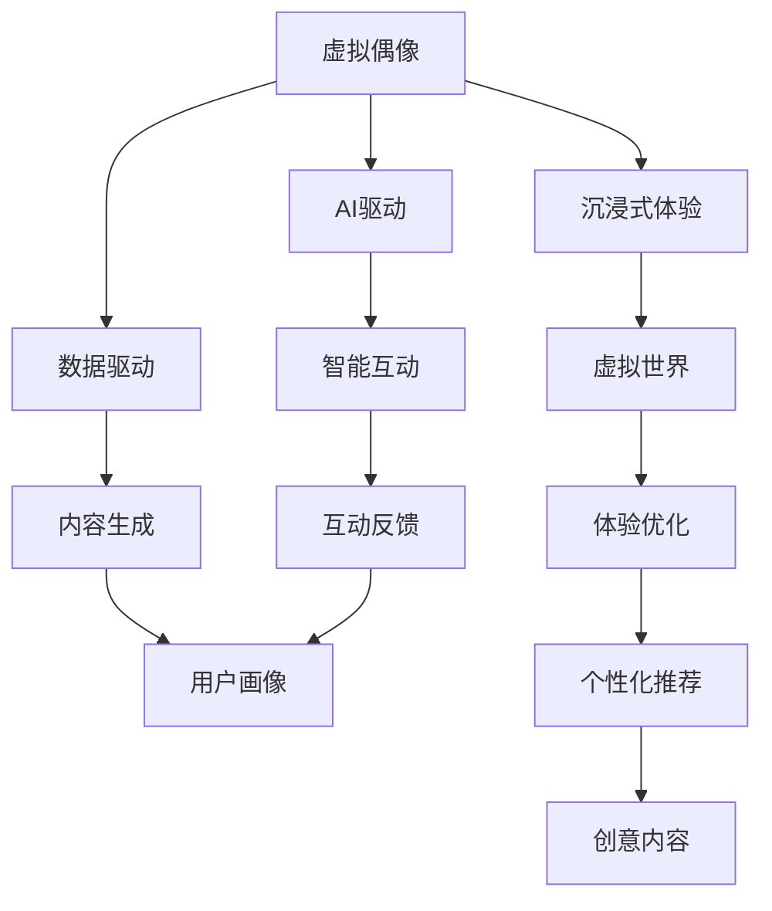

                 

# 2050年的数字创意：从虚拟偶像经济到元宇宙创意产业的数字创意经济

数字创意（Digital Creative Economy），通常指涉及数字化内容创作、生产和消费的产业生态，涵盖音乐、影视、游戏、动画等多个领域。随着技术的发展，数字创意的边界正在被不断拓展，从传统的物理世界跨越到虚拟世界。2050年的数字创意经济，不仅将在现有基础上实现更大的繁荣，还将涌现出诸多前所未有的创新模式和应用场景。

本文将从虚拟偶像经济的兴起，到元宇宙创意产业的发展，全方位探讨2050年的数字创意经济，揭示其背后的技术原理和潜在价值。

## 1. 背景介绍

### 1.1 虚拟偶像经济的兴起

虚拟偶像，是指通过计算机技术创建、训练的拟人角色，以AI驱动、数据驱动为核心特征，可以代替人类进行内容创作和互动。其兴起主要得益于两大驱动力：

- **技术的进步**：随着AI、计算机图形、自然语言处理等技术的突破，虚拟偶像越来越接近真人，不仅外观逼真，还能进行复杂互动，具有超高亲和力。
- **市场需求**：在现实偶像市场趋于饱和的背景下，年轻一代越来越热衷于虚拟世界的沉浸式体验，虚拟偶像以其更自由、更灵活的形式，满足了这一需求。

### 1.2 元宇宙创意产业的崛起

元宇宙（Metaverse），是指一个以互联网为基础、涵盖虚拟现实、增强现实、区块链等技术，能够提供沉浸式体验的虚拟空间。元宇宙的崛起，将进一步推动数字创意产业的进化，通过多维度的融合，创造出全新的创意产业生态。

## 2. 核心概念与联系

### 2.1 核心概念概述

- **虚拟偶像**：通过计算机技术创建、训练的拟人角色，以AI驱动、数据驱动为核心特征，可以进行内容创作和互动。
- **元宇宙**：基于互联网、虚拟现实、增强现实、区块链等技术，提供沉浸式体验的虚拟空间。
- **数字创意经济**：涉及数字化内容创作、生产和消费的产业生态，涵盖音乐、影视、游戏、动画等多个领域。
- **AI驱动**：利用机器学习、深度学习等技术，实现虚拟偶像的智能互动和内容生成。
- **数据驱动**：通过分析用户行为、偏好，优化虚拟偶像的内容创作和互动策略。
- **沉浸式体验**：利用虚拟现实、增强现实等技术，提供高度逼真的虚拟世界体验。

### 2.2 核心概念原理和架构的 Mermaid 流程图



## 3. 核心算法原理 & 具体操作步骤

### 3.1 算法原理概述

虚拟偶像和元宇宙创意产业的核心算法原理主要包括以下几个方面：

- **生成对抗网络（GANs）**：用于生成逼真的虚拟偶像形象，通过两个神经网络互相竞争，生成高质量的虚拟偶像图像。
- **深度强化学习**：用于训练虚拟偶像的智能互动能力，通过奖励机制，优化其对话、表演等表现。
- **自然语言处理（NLP）**：用于优化虚拟偶像的内容生成能力，通过文本分析，生成符合用户偏好的创意内容。
- **虚拟现实和增强现实技术**：用于提供沉浸式体验，通过虚拟现实设备，让用户进入逼真的虚拟世界。
- **区块链技术**：用于保障元宇宙的治理和内容交易，通过分布式账本，确保虚拟创意内容的版权保护。

### 3.2 算法步骤详解

#### 3.2.1 虚拟偶像生成

1. **数据准备**：收集大量的真人偶像图片和视频数据，作为虚拟偶像生成的训练样本。
2. **网络设计**：设计生成对抗网络（GANs）的生成器和判别器网络，设定损失函数，进行模型训练。
3. **优化过程**：不断调整生成器和判别器的参数，优化生成的虚拟偶像图像，直至达到逼真效果。
4. **模型评估**：使用质量评估指标（如PSNR、SSIM），评估虚拟偶像的生成效果，进行迭代优化。

#### 3.2.2 智能互动训练

1. **环境搭建**：搭建虚拟互动环境，模拟真实对话场景。
2. **策略设计**：设计虚拟偶像的对话策略，设定对话框架和上下文逻辑。
3. **深度学习**：使用深度强化学习算法（如Q-Learning、Policy Gradient），训练虚拟偶像的智能互动能力。
4. **用户体验优化**：收集用户反馈，优化对话策略，提升互动体验。

#### 3.2.3 内容生成

1. **数据收集**：收集大量的文本数据，包括用户评论、对话记录、新闻等。
2. **模型训练**：使用NLP模型（如BERT、GPT），训练虚拟偶像的内容生成能力。
3. **内容优化**：根据用户反馈，优化内容生成模型，提升创意内容的贴合度。

#### 3.2.4 虚拟现实体验

1. **设备选择**：选择适合的VR设备，确保用户能够获得高质量的沉浸式体验。
2. **场景设计**：设计逼真的虚拟世界场景，包括环境、物品、角色等。
3. **用户体验测试**：测试VR设备的用户体验，收集反馈，优化虚拟世界设计。

#### 3.2.5 区块链治理

1. **平台搭建**：搭建元宇宙的区块链平台，实现虚拟创意内容的交易和管理。
2. **智能合约设计**：设计虚拟创意内容的智能合约，确保内容的版权保护和公平交易。
3. **安全验证**：采用共识机制和加密技术，确保平台的安全性和透明度。

### 3.3 算法优缺点

#### 3.3.1 优点

1. **高度逼真**：通过先进的AI技术和数据驱动，生成的虚拟偶像形象逼真，能够提供接近真实偶像的互动体验。
2. **高度定制**：根据用户的个性化需求，可以定制虚拟偶像的外观、行为和互动策略，提供高度定制化的服务。
3. **成本低廉**：相比于传统偶像市场，虚拟偶像的创作和运营成本更低，能够快速进入市场。
4. **广泛应用**：虚拟偶像和元宇宙创意产业可以广泛应用于音乐、影视、游戏、教育等多个领域，具有广泛的应用前景。

#### 3.3.2 缺点

1. **技术门槛高**：需要高水平的AI和计算机图形技术，对技术人才的需求较高。
2. **版权问题**：虚拟偶像的内容创作和版权保护存在争议，可能会面临法律风险。
3. **用户体验差异**：尽管虚拟偶像能够提供沉浸式体验，但与真人偶像相比，仍存在一定的用户体验差异。
4. **市场接受度**：部分用户可能对虚拟偶像和元宇宙接受度较低，需要时间推广。

### 3.4 算法应用领域

虚拟偶像和元宇宙创意产业的应用领域非常广泛，涵盖以下几个方面：

- **音乐**：虚拟偶像可以成为歌手，进行音乐创作和表演，提供音乐新体验。
- **影视**：虚拟偶像可以参与影视作品的拍摄和配音，提供全新的叙事视角。
- **游戏**：虚拟偶像可以作为游戏角色，提供个性化的游戏体验。
- **教育**：虚拟偶像可以用于教育培训，提供互动式的学习体验。
- **广告**：虚拟偶像可以用于品牌推广和广告，提升品牌影响力。
- **娱乐**：虚拟偶像可以参与虚拟演唱会、虚拟角色扮演等娱乐活动，提供沉浸式娱乐体验。

## 4. 数学模型和公式 & 详细讲解 & 举例说明

### 4.1 数学模型构建

虚拟偶像和元宇宙创意产业的数学模型构建主要包括以下几个方面：

- **生成对抗网络（GANs）**：
  - 生成器模型：$G(z)$，将随机噪声$z$映射为虚拟偶像图像。
  - 判别器模型：$D(x)$，判断输入图像是否为真实偶像图像。
  - 损失函数：$L(D,G) = \mathbb{E}_{x}[\log D(x)] + \mathbb{E}_{z}[\log (1-D(G(z)))]$。
  
- **深度强化学习**：
  - Q值函数：$Q(s,a)$，评估在状态$s$下执行动作$a$的奖励。
  - 策略函数：$\pi(a|s)$，选择动作$a$的概率。
  - 损失函数：$J(\pi) = \mathbb{E}_{s}[\sum_{a} \pi(a|s)Q(s,a)]$。

- **自然语言处理（NLP）**：
  - 语言模型：$P(x|y)$，预测给定上下文$y$下的文本$x$概率。
  - 生成模型：$P(x)$，生成文本$x$的概率。
  - 损失函数：$L(x,y) = -\log P(x|y)$。

### 4.2 公式推导过程

#### 4.2.1 GANs生成模型推导

生成对抗网络（GANs）的核心思想是通过两个对抗的神经网络，生成高质量的虚拟偶像图像。以下是生成器和判别器模型的推导过程：

- **生成器模型**：
  - $G(z)$：将随机噪声$z$映射为虚拟偶像图像。
  - $G(z) = \mu(z)$，其中$\mu$为生成器参数。
  
- **判别器模型**：
  - $D(x)$：判断输入图像是否为真实偶像图像。
  - $D(x) = \sigma(W(x))$，其中$W$为判别器参数，$\sigma$为激活函数。

- **生成对抗网络**：
  - 生成器损失函数：$L_G = -\mathbb{E}_{z}[\log D(G(z))]$。
  - 判别器损失函数：$L_D = \mathbb{E}_{x}[\log D(x)] - \mathbb{E}_{z}[\log (1-D(G(z)))]$。
  - 整体损失函数：$L(G,D) = \frac{1}{2}L_G + \frac{1}{2}L_D$。

#### 4.2.2 深度强化学习推导

深度强化学习通过Q值函数和策略函数，实现虚拟偶像的智能互动。以下是Q值函数和策略函数的推导过程：

- **Q值函数**：
  - $Q(s,a)$：评估在状态$s$下执行动作$a$的奖励。
  - $Q(s,a) = \mathbb{E}[\sum_{t=0}^{\infty}\gamma^t r_t|s_0,a_0]$，其中$r_t$为即时奖励，$\gamma$为折扣因子。
  
- **策略函数**：
  - $\pi(a|s)$：选择动作$a$的概率。
  - $\pi(a|s) = \frac{e^{Q(s,a)}}{\sum_{a'}e^{Q(s,a')}}$。

### 4.3 案例分析与讲解

#### 4.3.1 GANs生成模型案例

以GANs生成虚拟偶像图像为例，假设我们有一组真实偶像图片数据$X$，生成器和判别器的参数分别为$\theta_G$和$\theta_D$，则生成过程如下：

1. **数据准备**：收集真实偶像图片数据$X$，设定噪声分布$Z$。
2. **网络设计**：构建生成器$G(z)$和判别器$D(x)$。
3. **模型训练**：通过对抗过程，不断调整$G(z)$和$D(x)$的参数，使得生成器能够生成逼真的虚拟偶像图像。
4. **模型评估**：使用PSNR、SSIM等质量评估指标，评估生成的虚拟偶像图像的质量，进行迭代优化。

#### 4.3.2 深度强化学习案例

以虚拟偶像的智能互动训练为例，假设我们有一个虚拟偶像模型$\pi(a|s)$，设定环境状态$s$、动作$a$和即时奖励$r$，则训练过程如下：

1. **环境搭建**：搭建虚拟互动环境，设定状态$s$、动作$a$和奖励$r$。
2. **策略设计**：设计虚拟偶像的对话策略，设定对话框架和上下文逻辑。
3. **深度学习**：使用深度强化学习算法（如Q-Learning、Policy Gradient），训练虚拟偶像的智能互动能力。
4. **用户体验优化**：收集用户反馈，优化对话策略，提升互动体验。

## 5. 项目实践：代码实例和详细解释说明

### 5.1 开发环境搭建

1. **环境准备**：安装Python、PyTorch、TensorFlow等深度学习框架，搭建开发环境。
2. **数据准备**：收集真实偶像图片数据、对话数据等，进行数据预处理。
3. **工具安装**：安装GANs、深度强化学习等算法库，如PyTorch-GAN、TensorFlow-rl等。

### 5.2 源代码详细实现

#### 5.2.1 GANs生成模型实现

```python
import torch
import torch.nn as nn
import torch.optim as optim

class Generator(nn.Module):
    def __init__(self):
        super(Generator, self).__init__()
        self.linear1 = nn.Linear(100, 256)
        self.linear2 = nn.Linear(256, 64*64*3)
        self.tanh = nn.Tanh()
    
    def forward(self, x):
        x = torch.relu(self.linear1(x))
        x = torch.view(x, (x.size(0), 64, 64, 3))
        x = self.tanh(self.linear2(x))
        return x
    
class Discriminator(nn.Module):
    def __init__(self):
        super(Discriminator, self).__init__()
        self.linear1 = nn.Linear(64*64*3, 256)
        self.linear2 = nn.Linear(256, 1)
        self.sigmoid = nn.Sigmoid()
    
    def forward(self, x):
        x = torch.view(x, (x.size(0), -1))
        x = torch.relu(self.linear1(x))
        x = self.sigmoid(self.linear2(x))
        return x

# 训练GANs生成模型
def train_gan(batch_size=64, num_epochs=100, learning_rate=0.0002):
    # 数据准备
    X_train = ...
    z_train = ...
    
    # 网络初始化
    G = Generator()
    D = Discriminator()
    G_optimizer = optim.Adam(G.parameters(), lr=learning_rate)
    D_optimizer = optim.Adam(D.parameters(), lr=learning_rate)
    
    # 模型训练
    for epoch in range(num_epochs):
        # 生成器和判别器的更新
        G_optimizer.zero_grad()
        D_optimizer.zero_grad()
        
        # 生成器更新
        G.eval()
        G.train()
        fake_X = G(z_train)
        real_X = X_train
        real_D_out = D(real_X).view(-1)
        fake_D_out = D(fake_X).view(-1)
        G_loss = torch.mean(torch.neg(fake_D_out))
        G_loss.backward()
        G_optimizer.step()
        
        # 判别器更新
        D.train()
        real_D_out = D(real_X).view(-1)
        fake_D_out = D(fake_X).view(-1)
        D_loss = torch.mean(torch.neg(real_D_out) + torch.neg(fake_D_out))
        D_loss.backward()
        D_optimizer.step()
    
    # 生成器的最终评估
    G.eval()
    z_test = ...
    fake_X = G(z_test)
    fake_D_out = D(fake_X).view(-1)
    fake_D_loss = torch.mean(torch.neg(fake_D_out))
    print("Final GAN loss:", fake_D_loss.item())
```

#### 5.2.2 深度强化学习实现

```python
import numpy as np
import tensorflow as tf
import tensorflow.contrib.research as tf_rl

class Policy(tf.keras.Model):
    def __init__(self):
        super(Policy, self).__init__()
        self.linear1 = tf.keras.layers.Dense(64, activation=tf.nn.relu)
        self.linear2 = tf.keras.layers.Dense(1, activation=None)
    
    def call(self, x, reuse=True):
        x = self.linear1(x)
        x = self.linear2(x)
        return x

class Q_value(tf.keras.Model):
    def __init__(self):
        super(Q_value, self).__init__()
        self.linear1 = tf.keras.layers.Dense(64, activation=tf.nn.relu)
        self.linear2 = tf.keras.layers.Dense(1, activation=None)
    
    def call(self, x, reuse=True):
        x = self.linear1(x)
        x = self.linear2(x)
        return x

# 训练深度强化学习模型
def train_rl():
    # 数据准备
    state = ...
    action = ...
    reward = ...
    
    # 模型初始化
    policy = Policy()
    q_value = Q_value()
    optimizer = tf.keras.optimizers.Adam()
    tf.keras.losses.MeanSquaredError()
    
    # 模型训练
    for epoch in range(num_epochs):
        # 更新政策
        policy_loss = tf.keras.losses.MeanSquaredError()(policy(state), action)
        optimizer.apply_gradients(list(zip(policy.trainable_variables, tf.gradients(policy_loss, policy.trainable_variables)))
        
        # 更新Q值
        q_value_loss = tf.keras.losses.MeanSquaredError()(q_value(state, action), reward)
        optimizer.apply_gradients(list(zip(q_value.trainable_variables, tf.gradients(q_value_loss, q_value.trainable_variables))))
    
    # 生成器的最终评估
    state = ...
    action = policy(state)
    q_value_out = q_value(state, action)
    print("Final Q value:", q_value_out)
```

### 5.3 代码解读与分析

#### 5.3.1 GANs生成模型代码解读

```python
class Generator(nn.Module):
    def __init__(self):
        super(Generator, self).__init__()
        self.linear1 = nn.Linear(100, 256)
        self.linear2 = nn.Linear(256, 64*64*3)
        self.tanh = nn.Tanh()
    
    def forward(self, x):
        x = torch.relu(self.linear1(x))
        x = torch.view(x, (x.size(0), 64, 64, 3))
        x = self.tanh(self.linear2(x))
        return x
    
class Discriminator(nn.Module):
    def __init__(self):
        super(Discriminator, self).__init__()
        self.linear1 = nn.Linear(64*64*3, 256)
        self.linear2 = nn.Linear(256, 1)
        self.sigmoid = nn.Sigmoid()
    
    def forward(self, x):
        x = torch.view(x, (x.size(0), -1))
        x = torch.relu(self.linear1(x))
        x = self.sigmoid(self.linear2(x))
        return x
```

这段代码实现了GANs生成模型的生成器和判别器。其中，生成器通过两个线性层和一个Tanh激活函数，将随机噪声映射为虚拟偶像图像；判别器通过两个线性层和一个Sigmoid激活函数，判断输入图像是否为真实偶像图像。

#### 5.3.2 深度强化学习代码解读

```python
class Policy(tf.keras.Model):
    def __init__(self):
        super(Policy, self).__init__()
        self.linear1 = tf.keras.layers.Dense(64, activation=tf.nn.relu)
        self.linear2 = tf.keras.layers.Dense(1, activation=None)
    
    def call(self, x, reuse=True):
        x = self.linear1(x)
        x = self.linear2(x)
        return x

class Q_value(tf.keras.Model):
    def __init__(self):
        super(Q_value, self).__init__()
        self.linear1 = tf.keras.layers.Dense(64, activation=tf.nn.relu)
        self.linear2 = tf.keras.layers.Dense(1, activation=None)
    
    def call(self, x, reuse=True):
        x = self.linear1(x)
        x = self.linear2(x)
        return x
```

这段代码实现了深度强化学习的策略函数和Q值函数。其中，策略函数通过两个线性层和一个输出层，选择动作的概率；Q值函数通过两个线性层和一个输出层，评估在状态下执行动作的奖励。

## 6. 实际应用场景

### 6.1 音乐

虚拟偶像可以成为虚拟歌手，进行音乐创作和表演。以下是几个实际应用场景：

1. **虚拟演唱会**：虚拟偶像在虚拟演唱会中进行表演，提供沉浸式的音乐体验。观众可以通过VR设备进入虚拟世界，享受逼真的音乐会体验。
2. **音乐制作**：虚拟偶像参与音乐制作，提供个性化的音乐创作服务，满足用户的个性化需求。
3. **音乐推广**：虚拟偶像可以参与品牌推广，提升音乐作品的曝光度，扩大音乐市场影响力。

### 6.2 影视

虚拟偶像可以参与影视作品的拍摄和配音，以下是几个实际应用场景：

1. **虚拟电影**：虚拟偶像参与虚拟电影的拍摄，提供高质量的演员替代方案。通过AI驱动的虚拟偶像，实现高效的特效和动作捕捉。
2. **虚拟配音**：虚拟偶像参与虚拟配音，提供高精度的语音合成和情感表达，提升影视作品的体验效果。
3. **虚拟角色**：虚拟偶像可以作为虚拟角色，参与影视作品的叙事，提供多视角的叙事方式，丰富观众的观影体验。

### 6.3 游戏

虚拟偶像可以成为游戏角色，提供个性化的游戏体验。以下是几个实际应用场景：

1. **虚拟游戏**：虚拟偶像参与虚拟游戏的开发，提供高互动性的游戏体验。玩家可以通过虚拟偶像进行游戏互动，提升游戏的沉浸感和趣味性。
2. **游戏任务**：虚拟偶像可以作为游戏任务，引导玩家进行游戏探索和任务完成，提供个性化的游戏剧情。
3. **游戏教学**：虚拟偶像可以作为游戏教学工具，帮助玩家进行游戏教学，提升游戏水平。

### 6.4 教育

虚拟偶像可以用于教育培训，提供互动式的学习体验。以下是几个实际应用场景：

1. **虚拟课堂**：虚拟偶像作为虚拟教师，参与虚拟课堂的教学，提供互动式的教学体验。学生可以通过虚拟偶像进行互动学习，提升学习效果。
2. **虚拟导师**：虚拟偶像作为虚拟导师，帮助学生进行个性化学习，提供针对性的学习指导。
3. **虚拟实验**：虚拟偶像参与虚拟实验的教学，提供高互动性的实验体验，帮助学生进行实验操作和实验分析。

## 7. 工具和资源推荐

### 7.1 学习资源推荐

1. **《Deep Learning for AI and Computer Science》课程**：斯坦福大学开设的深度学习课程，全面介绍深度学习的基本概念和算法。
2. **《Natural Language Processing with Transformers》书籍**：Transformer库的作者所著，详细介绍如何使用Transformer进行NLP任务开发。
3. **《Practical Reinforcement Learning with Python》书籍**：介绍如何使用Python进行深度强化学习的实践，提供丰富的代码示例。
4. **《Programming PyTorch》书籍**：详细讲解PyTorch的使用方法和实践技巧。
5. **《Deep Learning in Natural Language Processing》书籍**：介绍深度学习在自然语言处理中的应用，涵盖生成对抗网络、深度强化学习等内容。

### 7.2 开发工具推荐

1. **PyTorch**：基于Python的深度学习框架，灵活动态的计算图，适合快速迭代研究。
2. **TensorFlow**：由Google主导开发的深度学习框架，生产部署方便，适合大规模工程应用。
3. **PyTorch-GAN**：用于生成对抗网络的Python库，提供丰富的GANs实现。
4. **TensorFlow-rl**：用于深度强化学习的Python库，提供丰富的强化学习算法实现。
5. **Weights & Biases**：模型训练的实验跟踪工具，记录和可视化模型训练过程中的各项指标，方便对比和调优。
6. **TensorBoard**：TensorFlow配套的可视化工具，实时监测模型训练状态，并提供丰富的图表呈现方式。

### 7.3 相关论文推荐

1. **《Generative Adversarial Networks》论文**：介绍生成对抗网络的基本思想和实现方法。
2. **《Playing Atari with Deep Reinforcement Learning》论文**：介绍使用深度强化学习算法玩Atari游戏的案例。
3. **《Attention Is All You Need》论文**：介绍Transformer模型的基本思想和实现方法。
4. **《Towards Data-Efficient Learning via Transferable Adaptive Layer》论文**：介绍参数高效微调（PEFT）的基本思想和实现方法。
5. **《Exploring the Limits of Transfer Learning with a Unified Text-to-Text Transformer》论文**：介绍使用统一的语言模型进行多任务微调的方法。

## 8. 总结：未来发展趋势与挑战

### 8.1 研究成果总结

2050年的数字创意经济，基于虚拟偶像和元宇宙创意产业的发展，正在逐步走向成熟。通过AI技术和大数据的应用，虚拟偶像和元宇宙创意产业将提供更加逼真、个性化的服务，拓展数字创意经济的边界。

### 8.2 未来发展趋势

1. **技术进步**：AI技术和大数据的进一步发展，将推动虚拟偶像和元宇宙创意产业的技术突破，实现更加逼真、个性化的服务。
2. **市场拓展**：虚拟偶像和元宇宙创意产业将进一步拓展到音乐、影视、游戏、教育等多个领域，推动数字创意经济的全面繁荣。
3. **产业融合**：虚拟偶像和元宇宙创意产业将与其他产业进行深度融合，提供跨领域的创新应用，推动产业升级和创新。

### 8.3 面临的挑战

1. **技术瓶颈**：虚拟偶像和元宇宙创意产业的发展面临AI技术和大数据处理的挑战，需要不断突破技术瓶颈，提升系统的性能。
2. **用户体验**：虚拟偶像和元宇宙创意产业需要提升用户体验，解决虚拟偶像与真人偶像的差异，提升系统的亲和力和使用感。
3. **版权保护**：虚拟偶像和元宇宙创意产业需要加强版权保护，防止侵权和盗版，保障内容创作者的权益。
4. **伦理问题**：虚拟偶像和元宇宙创意产业需要解决伦理问题，确保内容的安全性和合法性。
5. **市场接受度**：虚拟偶像和元宇宙创意产业需要提高市场接受度，逐步推广，适应市场的需求和变化。

### 8.4 研究展望

1. **多模态融合**：虚拟偶像和元宇宙创意产业将融合多模态数据，提升系统的智能水平，提供更加全面的服务。
2. **自适应学习**：虚拟偶像和元宇宙创意产业将实现自适应学习，通过持续学习提升系统的智能水平，适应市场的变化。
3. **个性化服务**：虚拟偶像和元宇宙创意产业将实现高度个性化的服务，根据用户的需求进行定制化设计，提升用户的满意度。
4. **跨领域应用**：虚拟偶像和元宇宙创意产业将拓展到更多领域，推动跨领域创新，提供新的应用场景。

## 9. 附录：常见问题与解答

**Q1：虚拟偶像和元宇宙创意产业的优势是什么？**

A: 虚拟偶像和元宇宙创意产业的优势主要体现在以下几个方面：

1. **高度逼真**：通过AI技术和数据驱动，生成的虚拟偶像形象逼真，能够提供接近真人偶像的互动体验。
2. **高度定制**：根据用户的个性化需求，可以定制虚拟偶像的外观、行为和互动策略，提供高度定制化的服务。
3. **成本低廉**：相比于传统偶像市场，虚拟偶像的创作和运营成本更低，能够快速进入市场。
4. **广泛应用**：虚拟偶像和元宇宙创意产业可以广泛应用于音乐、影视、游戏、教育等多个领域，具有广泛的应用前景。

**Q2：虚拟偶像和元宇宙创意产业面临的主要挑战是什么？**

A: 虚拟偶像和元宇宙创意产业面临的主要挑战包括：

1. **技术瓶颈**：虚拟偶像和元宇宙创意产业的发展面临AI技术和大数据处理的挑战，需要不断突破技术瓶颈，提升系统的性能。
2. **用户体验**：虚拟偶像和元宇宙创意产业需要提升用户体验，解决虚拟偶像与真人偶像的差异，提升系统的亲和力和使用感。
3. **版权保护**：虚拟偶像和元宇宙创意产业需要加强版权保护，防止侵权和盗版，保障内容创作者的权益。
4. **伦理问题**：虚拟偶像和元宇宙创意产业需要解决伦理问题，确保内容的安全性和合法性。
5. **市场接受度**：虚拟偶像和元宇宙创意产业需要提高市场接受度，逐步推广，适应市场的需求和变化。

**Q3：虚拟偶像和元宇宙创意产业的应用场景有哪些？**

A: 虚拟偶像和元宇宙创意产业的应用场景非常广泛，涵盖以下几个方面：

1. **音乐**：虚拟偶像可以成为虚拟歌手，进行音乐创作和表演，提供沉浸式的音乐体验。
2. **影视**：虚拟偶像可以参与影视作品的拍摄和配音，提供高质量的演员替代方案和虚拟角色。
3. **游戏**：虚拟偶像可以成为游戏角色，提供个性化的游戏体验。
4. **教育**：虚拟偶像可以用于教育培训，提供互动式的学习体验。
5. **广告**：虚拟偶像可以参与品牌推广，提升品牌影响力。
6. **娱乐**：虚拟偶像可以参与虚拟演唱会、虚拟角色扮演等娱乐活动，提供沉浸式娱乐体验。

**Q4：虚拟偶像和元宇宙创意产业的未来发展方向是什么？**

A: 虚拟偶像和元宇宙创意产业的未来发展方向包括：

1. **技术进步**：AI技术和大数据的进一步发展，将推动虚拟偶像和元宇宙创意产业的技术突破，实现更加逼真、个性化的服务。
2. **市场拓展**：虚拟偶像和元宇宙创意产业将进一步拓展到音乐、影视、游戏、教育等多个领域，推动数字创意经济的全面繁荣。
3. **产业融合**：虚拟偶像和元宇宙创意产业将与其他产业进行深度融合，提供跨领域的创新应用，推动产业升级和创新。

**Q5：虚拟偶像和元宇宙创意产业的商业模式是什么？**

A: 虚拟偶像和元宇宙创意产业的商业模式主要包括以下几种：

1. **虚拟演唱会**：通过虚拟演唱会门票、虚拟礼物等方式进行盈利。
2. **虚拟角色定制**：提供虚拟角色的定制化服务，按需求收费。
3. **虚拟产品销售**：销售虚拟偶像的产品，如虚拟偶像音乐、虚拟偶像周边等。
4. **虚拟广告**：通过虚拟偶像进行品牌推广和广告，获得广告收入。
5. **虚拟教学**：提供虚拟课程和教学服务，按课程收费。

**Q6：虚拟偶像和元宇宙创意产业的伦理问题有哪些？**

A: 虚拟偶像和元宇宙创意产业的伦理问题主要包括：

1. **版权保护**：虚拟偶像和元宇宙创意产业的内容创作和版权保护存在争议，可能会面临法律风险。
2. **伦理导向**：虚拟偶像和元宇宙创意产业需要纳入伦理导向的评估指标，过滤和惩罚有偏见、有害的输出倾向。
3. **用户隐私**：虚拟偶像和元宇宙创意产业需要保护用户隐私，避免数据泄露和滥用。
4. **内容健康**：虚拟偶像和元宇宙创意产业需要确保内容健康，避免有害信息和不良影响。

---

作者：禅与计算机程序设计艺术 / Zen and the Art of Computer Programming

