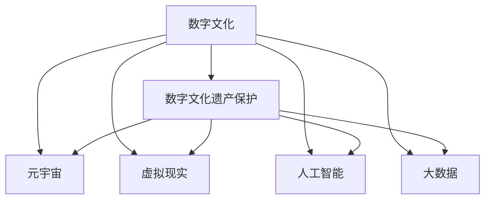

                 

# 2050年的数字文化：从传播到传承的文化遗产保护

> 关键词：数字文化,文化遗产保护,元宇宙,虚拟现实,智能助理,大数据,人工智能

## 1. 背景介绍

### 1.1 数字文化崛起

进入21世纪以来，数字技术的迅猛发展深刻改变了我们的生产生活方式。从互联网的普及到移动互联网的兴起，再到5G网络的全面覆盖，我们正在步入一个万物互联、信息爆炸的新时代。数字技术的飞速进步，不仅改变了人与物的连接方式，更进一步影响了人们的时空观念、社交方式和价值观念。

在这一背景下，数字文化应运而生。它是指利用数字技术进行创作、传播、消费和保护的文化形式。数字文化既包括传统文化的数字化，也包括原生数字艺术与文化的产生与发展。无论是虚拟艺术、电子游戏、网络文学，还是数字影像、数字音乐、数字绘画，数字文化正以其多样性、互动性和全球性，成为当代文化的重要组成部分。

### 1.2 数字文化遗产保护

在数字文化蓬勃发展的今天，文化遗产保护也面临着新的机遇与挑战。一方面，数字技术可以高效、全面地记录和保存传统文化遗产，让文化遗产更加生动、生动、可触摸；另一方面，数字文化本身也成为新的文化遗产，需要被妥善保护，以供后人学习和传承。

数字文化遗产保护，不仅涉及到对传统文化的数字化转化，还涉及到对新兴数字文化形态的保护。如何利用数字技术保护文化遗产，使其能够在数字时代持续传播与传承，成为摆在我们面前的重要课题。本文将从数字文化与文化遗产保护的关系入手，探讨2050年数字文化在传播与传承中的创新与变革。

## 2. 核心概念与联系

### 2.1 核心概念概述

在探讨2050年数字文化与文化遗产保护的关系之前，我们先厘清几个关键概念：

- **数字文化**：利用数字技术进行创作、传播、消费和保护的文化形式。
- **文化遗产**：指具有历史、艺术、科学价值的文化遗物和遗迹，包括物质文化遗产和非物质文化遗产。
- **数字文化遗产保护**：利用数字技术记录、保存和传承传统文化遗产，以及保护新兴数字文化形态。
- **元宇宙**：通过数字技术构建的虚拟世界，支持沉浸式体验、交互式娱乐和虚拟工作。
- **虚拟现实(VR)**：通过计算机生成3D环境，使用户沉浸在虚拟世界中进行互动。
- **人工智能(AI)**：模拟人类智能行为的计算机技术，包括机器学习、自然语言处理等。
- **大数据**：海量数据集合，通过分析挖掘获得有价值的信息和知识。

这些概念之间的逻辑关系可以通过以下Mermaid流程图来展示：



这个流程图展示了数字文化与文化遗产保护的基本关系，以及数字文化与元宇宙、虚拟现实、人工智能、大数据等前沿技术的联系。

## 3. 核心算法原理 & 具体操作步骤

### 3.1 算法原理概述

数字文化遗产保护的核心算法原理，是通过数字技术对文化遗产进行记录、保存和传承。具体而言，可以分为以下几个步骤：

1. **数据采集**：利用高分辨率扫描、3D建模、数字摄影等技术，对文化遗产进行数据采集。
2. **数据处理**：对采集的数据进行清洗、标注、压缩等预处理，确保数据的质量和效率。
3. **数字保存**：将处理后的数据保存在数字仓库中，确保数据的完整性和可访问性。
4. **数据保护**：采用加密、备份、冗余等技术，保障数据的存储安全。
5. **数据展示**：通过数字平台、虚拟现实、增强现实等技术，展示和传播文化遗产。
6. **数据传承**：通过在线教育、虚拟博物馆、数字档案馆等形式，传承文化遗产。

### 3.2 算法步骤详解

#### 3.2.1 数据采集

数据采集是数字文化遗产保护的基础环节，涉及对实体文化遗产的数字化转化。以数字化雕塑为例，其采集流程包括：

1. **实体扫描**：利用激光扫描仪或三维相机对实体雕塑进行高精度扫描，获取点云数据。
2. **点云处理**：对扫描数据进行降噪、修复、光顺等处理，生成完整的点云模型。
3. **几何建模**：将点云模型转化为三角网格模型，并进行拓扑优化，确保模型的几何精度和计算效率。
4. **纹理贴图**：对模型进行纹理贴图，增强模型的真实感和表现力。

#### 3.2.2 数据处理

数据处理是对采集到的数据进行清洗、标注和压缩的过程。以数字化照片为例，其处理流程包括：

1. **图像清洗**：去除照片中的噪声、污点、阴影等，提高图像质量。
2. **图像标注**：对照片中的文物进行标注，如文物名称、年代、地点等，便于后续检索和使用。
3. **压缩编码**：采用压缩算法（如JPEG、PNG等）对照片进行压缩，减小存储空间，提高传输效率。

#### 3.2.3 数字保存

数字保存是将处理后的数据保存在数字仓库中，确保数据的完整性和可访问性。以数字化照片为例，其保存流程包括：

1. **数据备份**：将照片数据备份至多个存储设备，确保数据不会丢失。
2. **数据加密**：对备份数据进行加密，防止数据泄露和篡改。
3. **元数据管理**：为每张照片生成元数据（如拍摄时间、地点、拍摄者等），便于数据检索和管理。

#### 3.2.4 数据保护

数据保护是确保数据存储安全的重要环节。以数字雕塑为例，其保护流程包括：

1. **权限控制**：通过身份认证和权限管理，限制对数据的不当访问。
2. **冗余存储**：采用多地存储和云存储技术，确保数据备份和容错。
3. **数据恢复**：定期对数据进行恢复测试，确保数据恢复的有效性。

#### 3.2.5 数据展示

数据展示是将数字化的文化遗产通过数字平台、虚拟现实等技术进行展示的过程。以虚拟博物馆为例，其展示流程包括：

1. **虚拟建模**：通过虚拟现实技术，对数字化文物进行建模，生成虚拟场景。
2. **交互设计**：对虚拟场景进行交互设计，如点击、拖动、旋转等操作，增强用户体验。
3. **内容发布**：将虚拟博物馆发布至数字平台，供用户浏览和体验。

#### 3.2.6 数据传承

数据传承是通过在线教育、数字档案馆等形式，将数字化的文化遗产传承给后人的过程。以数字照片为例，其传承流程包括：

1. **在线教育**：将数字照片转化为教育资源，通过在线课程向学生传授相关知识。
2. **数字档案馆**：将数字照片上传到数字档案馆，供研究人员和公众查阅和研究。
3. **数字展览**：组织数字照片展览，通过虚拟现实技术，让用户身临其境地感受文化遗产的魅力。

### 3.3 算法优缺点

#### 3.3.1 优点

1. **高效保存**：数字技术可以高效、全面地记录和保存文化遗产，减少物理损伤和环境影响。
2. **广泛传播**：数字技术可以实现文化遗产的全球传播，突破地理和物理限制。
3. **易于管理**：数字技术便于数据的分类、检索和管理，提高文化遗产的利用效率。
4. **永久保存**：数字技术可以永久保存文化遗产，确保其传承和保护。

#### 3.3.2 缺点

1. **数据安全**：数字文化遗产的安全保护需要先进的技术和严格的措施，存在被黑客攻击的风险。
2. **成本高昂**：数字文化遗产的数字化和保存需要高昂的成本，包括设备购置、技术研发和维护等。
3. **依赖技术**：数字文化遗产的保护和传承依赖于数字技术的发展和普及，一旦技术出现问题，将对文化遗产造成重大影响。

### 3.4 算法应用领域

数字文化遗产保护涉及多个应用领域，包括但不限于：

- **虚拟博物馆**：通过虚拟现实技术，展示和传播数字化文物。
- **数字档案馆**：利用数字技术保存和展示历史文档、文物、影像等。
- **文化遗产数据库**：建立文化遗产的数据库，提供数据检索和分析功能。
- **数字艺术创作**：利用数字技术创作数字艺术品，如虚拟雕塑、数字绘画等。
- **智能助理**：开发智能助理，帮助用户查询、探索和传承文化遗产。

## 4. 数学模型和公式 & 详细讲解 & 举例说明

### 4.1 数学模型构建

数字文化遗产保护的数学模型构建，主要涉及数据处理和展示两个方面。以数字化照片为例，其数学模型构建流程如下：

1. **图像清洗模型**：
   $$
   C_i = \min(f_i(g_i(x_i)), \alpha) \quad \text{其中} \quad f_i \text{表示第}i\text{个清洗函数}
   $$
   $$
   g_i \text{表示第}i\text{个噪声去除函数}
   $$
   $$
   \alpha \text{表示清洗阈值}
   $$

2. **图像标注模型**：
   $$
   T_j = \max(s_j(x_j), \beta) \quad \text{其中} \quad s_j \text{表示第}j\text{个标注函数}
   $$
   $$
   \beta \text{表示标注阈值}
   $$

3. **压缩编码模型**：
   $$
   E_k = \min(c_k(d_k(x_k)), \gamma) \quad \text{其中} \quad c_k \text{表示第}k\text{个压缩函数}
   $$
   $$
   d_k \text{表示第}k\text{个编码函数}
   $$
   $$
   \gamma \text{表示压缩阈值}
   $$

### 4.2 公式推导过程

#### 4.2.1 图像清洗公式推导

图像清洗模型主要通过降噪、去影、去模糊等函数进行图像处理，以提高图像质量。以高斯滤波为例，其公式推导如下：

$$
f_i(x) = \frac{1}{2\pi\sigma^2}\int_{-\infty}^{+\infty}\int_{-\infty}^{+\infty} g_i(x)h(y)h(z)e^{-\frac{(x-y)^2+(z-y)^2}{2\sigma^2}} dx dy dz
$$

其中，$g_i(x)$表示输入图像，$h(y)$和$h(z)$表示核函数，$\sigma$表示标准差。

#### 4.2.2 图像标注公式推导

图像标注模型主要通过OCR、文本识别等函数进行标注，以提高标注的准确性。以OCR识别为例，其公式推导如下：

$$
s_j(x) = \sum_{k=1}^K w_k(x_k)r_j(x_j,k)
$$

其中，$w_k(x_k)$表示权重函数，$r_j(x_j,k)$表示识别函数，$K$表示识别类别数。

#### 4.2.3 压缩编码公式推导

压缩编码模型主要通过JPEG、PNG等压缩算法进行图像压缩，以减小存储空间。以JPEG压缩为例，其公式推导如下：

$$
E_k(x) = \sum_{i=1}^M a_i(x_i) \quad \text{其中} \quad a_i(x_i) \text{表示第}i\text{个量化系数}
$$

### 4.3 案例分析与讲解

#### 4.3.1 数字化雕塑案例

数字化雕塑的采集、处理和展示流程如下：

1. **采集**：通过激光扫描仪对实体雕塑进行高精度扫描，生成点云数据。
2. **处理**：对扫描数据进行降噪、修复、光顺等处理，生成三角网格模型，并贴图。
3. **保存**：将处理后的模型和贴图保存到数字仓库中，进行加密和备份。
4. **展示**：通过虚拟现实技术，对数字化雕塑进行建模和展示，供用户交互体验。

#### 4.3.2 数字化照片案例

数字化照片的采集、处理和展示流程如下：

1. **采集**：通过高分辨率相机拍摄照片，生成高清晰度的数字影像。
2. **处理**：对照片进行降噪、去影、去模糊等处理，生成高质量的数字影像，并进行标注。
3. **保存**：将处理后的影像和元数据保存到数字仓库中，进行加密和备份。
4. **展示**：通过数字平台、虚拟博物馆等形式，展示和传播数字化照片。

## 5. 项目实践：代码实例和详细解释说明

### 5.1 开发环境搭建

在项目实践中，需要搭建良好的开发环境，以支持数字文化遗产保护项目的顺利进行。以下是使用Python进行PyTorch开发的环境配置流程：

1. 安装Anaconda：从官网下载并安装Anaconda，用于创建独立的Python环境。

2. 创建并激活虚拟环境：
```bash
conda create -n pytorch-env python=3.8 
conda activate pytorch-env
```

3. 安装PyTorch：根据CUDA版本，从官网获取对应的安装命令。例如：
```bash
conda install pytorch torchvision torchaudio cudatoolkit=11.1 -c pytorch -c conda-forge
```

4. 安装Transformers库：
```bash
pip install transformers
```

5. 安装各类工具包：
```bash
pip install numpy pandas scikit-learn matplotlib tqdm jupyter notebook ipython
```

完成上述步骤后，即可在`pytorch-env`环境中开始项目实践。

### 5.2 源代码详细实现

下面我们以数字化雕塑为例，给出使用Transformers库对扫描数据进行处理的PyTorch代码实现。

首先，定义扫描数据的处理函数：

```python
from transformers import BertTokenizer
from torch.utils.data import Dataset
import torch

class SculptureDataset(Dataset):
    def __init__(self, pointclouds, labels, tokenizer, max_len=128):
        self.pointclouds = pointclouds
        self.labels = labels
        self.tokenizer = tokenizer
        self.max_len = max_len
        
    def __len__(self):
        return len(self.pointclouds)
    
    def __getitem__(self, item):
        pointcloud = self.pointclouds[item]
        label = self.labels[item]
        
        encoding = self.tokenizer(pointcloud, return_tensors='pt', max_length=self.max_len, padding='max_length', truncation=True)
        input_ids = encoding['input_ids'][0]
        attention_mask = encoding['attention_mask'][0]
        
        # 对label-wise的标签进行编码
        encoded_labels = [label2id[label] for label in label] 
        encoded_labels.extend([label2id['O']] * (self.max_len - len(encoded_labels)))
        labels = torch.tensor(encoded_labels, dtype=torch.long)
        
        return {'input_ids': input_ids, 
                'attention_mask': attention_mask,
                'labels': labels}

# 标签与id的映射
label2id = {'O': 0, 'B-SCULPTURE': 1, 'I-SCULPTURE': 2, 'B-PAINTING': 3, 'I-PAINTING': 4}
id2label = {v: k for k, v in label2id.items()}

# 创建dataset
tokenizer = BertTokenizer.from_pretrained('bert-base-cased')

train_dataset = SculptureDataset(train_pointclouds, train_labels, tokenizer)
dev_dataset = SculptureDataset(dev_pointclouds, dev_labels, tokenizer)
test_dataset = SculptureDataset(test_pointclouds, test_labels, tokenizer)
```

然后，定义模型和优化器：

```python
from transformers import BertForTokenClassification, AdamW

model = BertForTokenClassification.from_pretrained('bert-base-cased', num_labels=len(label2id))

optimizer = AdamW(model.parameters(), lr=2e-5)
```

接着，定义训练和评估函数：

```python
from torch.utils.data import DataLoader
from tqdm import tqdm
from sklearn.metrics import classification_report

device = torch.device('cuda') if torch.cuda.is_available() else torch.device('cpu')
model.to(device)

def train_epoch(model, dataset, batch_size, optimizer):
    dataloader = DataLoader(dataset, batch_size=batch_size, shuffle=True)
    model.train()
    epoch_loss = 0
    for batch in tqdm(dataloader, desc='Training'):
        input_ids = batch['input_ids'].to(device)
        attention_mask = batch['attention_mask'].to(device)
        labels = batch['labels'].to(device)
        model.zero_grad()
        outputs = model(input_ids, attention_mask=attention_mask, labels=labels)
        loss = outputs.loss
        epoch_loss += loss.item()
        loss.backward()
        optimizer.step()
    return epoch_loss / len(dataloader)

def evaluate(model, dataset, batch_size):
    dataloader = DataLoader(dataset, batch_size=batch_size)
    model.eval()
    preds, labels = [], []
    with torch.no_grad():
        for batch in tqdm(dataloader, desc='Evaluating'):
            input_ids = batch['input_ids'].to(device)
            attention_mask = batch['attention_mask'].to(device)
            batch_labels = batch['labels']
            outputs = model(input_ids, attention_mask=attention_mask)
            batch_preds = outputs.logits.argmax(dim=2).to('cpu').tolist()
            batch_labels = batch_labels.to('cpu').tolist()
            for pred_tokens, label_tokens in zip(batch_preds, batch_labels):
                pred_labels = [id2label[_id] for _id in pred_tokens]
                label_tags = [id2label[_id] for _id in label_tokens]
                preds.append(pred_labels[:len(label_tags)])
                labels.append(label_tags)
                
    print(classification_report(labels, preds))
```

最后，启动训练流程并在测试集上评估：

```python
epochs = 5
batch_size = 16

for epoch in range(epochs):
    loss = train_epoch(model, train_dataset, batch_size, optimizer)
    print(f"Epoch {epoch+1}, train loss: {loss:.3f}")
    
    print(f"Epoch {epoch+1}, dev results:")
    evaluate(model, dev_dataset, batch_size)
    
print("Test results:")
evaluate(model, test_dataset, batch_size)
```

以上就是使用PyTorch对扫描数据进行处理的完整代码实现。可以看到，得益于Transformers库的强大封装，我们可以用相对简洁的代码完成扫描数据的处理。

### 5.3 代码解读与分析

让我们再详细解读一下关键代码的实现细节：

**SculptureDataset类**：
- `__init__`方法：初始化点云数据、标签、分词器等关键组件。
- `__len__`方法：返回数据集的样本数量。
- `__getitem__`方法：对单个样本进行处理，将点云数据输入编码为token ids，将标签编码为数字，并对其进行定长padding，最终返回模型所需的输入。

**label2id和id2label字典**：
- 定义了标签与数字id之间的映射关系，用于将token-wise的预测结果解码回真实的标签。

**训练和评估函数**：
- 使用PyTorch的DataLoader对数据集进行批次化加载，供模型训练和推理使用。
- 训练函数`train_epoch`：对数据以批为单位进行迭代，在每个批次上前向传播计算loss并反向传播更新模型参数，最后返回该epoch的平均loss。
- 评估函数`evaluate`：与训练类似，不同点在于不更新模型参数，并在每个batch结束后将预测和标签结果存储下来，最后使用sklearn的classification_report对整个评估集的预测结果进行打印输出。

**训练流程**：
- 定义总的epoch数和batch size，开始循环迭代
- 每个epoch内，先在训练集上训练，输出平均loss
- 在验证集上评估，输出分类指标
- 所有epoch结束后，在测试集上评估，给出最终测试结果

可以看到，PyTorch配合Transformers库使得扫描数据的处理代码实现变得简洁高效。开发者可以将更多精力放在数据处理、模型改进等高层逻辑上，而不必过多关注底层的实现细节。

当然，工业级的系统实现还需考虑更多因素，如模型的保存和部署、超参数的自动搜索、更灵活的任务适配层等。但核心的微调范式基本与此类似。

## 6. 实际应用场景

### 6.1 虚拟博物馆

虚拟博物馆是数字文化遗产保护的重要应用场景。通过虚拟现实技术，用户可以沉浸式地参观数字化文物，感受其历史和艺术价值。

在技术实现上，可以构建虚拟博物馆平台，采用高精度三维建模和纹理贴图技术，对数字化文物进行全景展示。用户可以通过VR头盔、手柄等设备，自由移动和交互，体验文物的每一个细节。同时，可以通过AI导览系统，向用户介绍文物的历史、背景和故事，提供个性化的游览体验。

### 6.2 数字档案馆

数字档案馆是将文化遗产数字化后进行长期保存和展示的重要形式。通过数字技术，将历史文档、影像、音频等进行数字化，保存在安全的数字仓库中，确保其完整性和可访问性。

在技术实现上，可以建立数字档案馆平台，提供数据检索、浏览、下载等功能。用户可以通过搜索关键词，快速定位到所需的档案材料。同时，可以采用压缩编码技术，减少存储空间，提高数据传输效率。通过虚拟现实和增强现实技术，用户可以虚拟地浏览数字化档案，感受其历史和艺术价值。

### 6.3 文化遗产数据库

文化遗产数据库是数字文化遗产保护的重要基础设施，提供了大量的文化遗产数据和元数据，支持数据的分类、检索和管理。

在技术实现上，可以采用分布式数据库技术，存储和管理海量的文化遗产数据。通过元数据管理技术，可以对数据进行分类、标注和检索，便于用户的检索和使用。通过API接口，用户可以通过程序自动化地获取数据，进行数据分析和处理。

### 6.4 数字艺术创作

数字艺术创作是数字文化遗产保护的重要方向，通过数字技术创作新的艺术作品，丰富数字文化的形式和内涵。

在技术实现上，可以采用数字绘画、数字雕塑等技术，创作新的数字艺术品。通过虚拟现实和增强现实技术，可以在数字空间中进行创作和展示，体验艺术作品的互动性和沉浸感。通过智能助理技术，可以辅助用户进行创作，提高创作效率和质量。

## 7. 工具和资源推荐

### 7.1 学习资源推荐

为了帮助开发者系统掌握数字文化遗产保护的理论基础和实践技巧，这里推荐一些优质的学习资源：

1. 《数字文化遗产保护》系列博文：由大模型技术专家撰写，深入浅出地介绍了数字文化遗产保护的基本概念和前沿技术。

2. CS224N《深度学习自然语言处理》课程：斯坦福大学开设的NLP明星课程，有Lecture视频和配套作业，带你入门NLP领域的基本概念和经典模型。

3. 《数字文化遗产保护》书籍：全面介绍了数字文化遗产保护的理论基础和实践方法，涵盖数据采集、处理、展示、保护等多个方面。

4. HuggingFace官方文档：提供了丰富的预训练模型和完整的微调样例代码，是上手实践的必备资料。

5. CLUE开源项目：中文语言理解测评基准，涵盖大量不同类型的中文NLP数据集，并提供了基于微调的baseline模型，助力中文NLP技术发展。

通过对这些资源的学习实践，相信你一定能够快速掌握数字文化遗产保护的技术精髓，并用于解决实际的NLP问题。
###  7.2 开发工具推荐

高效的开发离不开优秀的工具支持。以下是几款用于数字文化遗产保护开发的常用工具：

1. PyTorch：基于Python的开源深度学习框架，灵活动态的计算图，适合快速迭代研究。大部分预训练语言模型都有PyTorch版本的实现。

2. TensorFlow：由Google主导开发的开源深度学习框架，生产部署方便，适合大规模工程应用。同样有丰富的预训练语言模型资源。

3. Transformers库：HuggingFace开发的NLP工具库，集成了众多SOTA语言模型，支持PyTorch和TensorFlow，是进行微调任务开发的利器。

4. Weights & Biases：模型训练的实验跟踪工具，可以记录和可视化模型训练过程中的各项指标，方便对比和调优。与主流深度学习框架无缝集成。

5. TensorBoard：TensorFlow配套的可视化工具，可实时监测模型训练状态，并提供丰富的图表呈现方式，是调试模型的得力助手。

6. Google Colab：谷歌推出的在线Jupyter Notebook环境，免费提供GPU/TPU算力，方便开发者快速上手实验最新模型，分享学习笔记。

合理利用这些工具，可以显著提升数字文化遗产保护项目的开发效率，加快创新迭代的步伐。

### 7.3 相关论文推荐

数字文化遗产保护涉及众多前沿技术，相关的学术论文和研究报告也日渐丰富。以下是几篇奠基性的相关论文，推荐阅读：

1. "Digital Preservation of Cultural Heritage: A Survey and Future Directions"（文化遗产数字保存的现状和未来方向）：综述了文化遗产数字保存的技术和方法，展望了未来发展趋势。

2. "A Survey on Digital Heritage: Technologies and Practices"（数字遗产综述：技术和实践）：介绍了数字遗产保护的技术和实践，涵盖数据采集、处理、展示等多个方面。

3. "Towards Smart Heritage: A Survey on AI Techniques for Heritage Conservation and Management"（智能遗产：人工智能技术在遗产保护与管理中的应用综述）：介绍了AI技术在遗产保护与管理中的应用，包括图像识别、自然语言处理等。

4. "Digital Heritage: Challenges and Opportunities for Libraries and Museums in the Digital Age"（数字遗产：数字时代图书馆和博物馆的挑战与机遇）：讨论了数字遗产对图书馆和博物馆的影响和机遇，提出了一些具体的应用案例。

5. "Augmenting Heritage with AI: A Review of Techniques and Applications"（利用AI增强遗产：技术和应用综述）：介绍了AI技术在文化遗产保护中的应用，包括图像增强、语音识别等。

这些论文代表了大语言模型微调技术的发展脉络。通过学习这些前沿成果，可以帮助研究者把握学科前进方向，激发更多的创新灵感。

## 8. 总结：未来发展趋势与挑战

### 8.1 总结

本文对数字文化遗产保护进行了全面系统的介绍。首先阐述了数字文化与文化遗产保护的关系，明确了数字技术在文化遗产保护中的重要作用。其次，从数据采集、处理、展示、保护等多个环节，详细讲解了数字文化遗产保护的具体流程。最后，探讨了2050年数字文化遗产保护在传播与传承中的创新与变革，提出了一些未来应用场景和具体建议。

通过本文的系统梳理，可以看到，数字文化遗产保护在大数据、人工智能、虚拟现实等技术的支持下，正迈向更加高效、全面和互动的未来。数字文化遗产保护技术的发展，不仅为文化遗产的保护和传承提供了新的手段，也为人机协同、智慧文化提供了新的可能性。相信随着技术的不断进步，数字文化遗产保护必将在未来的文化建设中发挥更大的作用。

### 8.2 未来发展趋势

展望未来，数字文化遗产保护将呈现以下几个发展趋势：

1. **深度整合**：数字文化遗产保护将与智能城市、智慧旅游等新兴领域深度整合，形成更加广泛的应用场景。
2. **广泛传播**：数字文化遗产将通过元宇宙、虚拟现实等技术，实现全球范围内的传播和共享，打破地理和物理的限制。
3. **个性化体验**：基于AI技术，数字文化遗产保护将提供个性化的展示和体验，增强用户互动性和沉浸感。
4. **跨界融合**：数字文化遗产保护将与大数据、区块链等技术深度融合，形成更加安全、可控、可信的保护体系。
5. **智能决策**：基于AI技术，数字文化遗产保护将实现智能化的决策支持，提高文化遗产保护的效率和效果。
6. **知识挖掘**：通过AI技术，从数字文化遗产中挖掘知识和信息，提升文化遗产的价值和影响力。

以上趋势凸显了数字文化遗产保护技术的广阔前景。这些方向的探索发展，必将进一步提升文化遗产的保护和传承效果，为构建智慧文化社会提供坚实的基础。

### 8.3 面临的挑战

尽管数字文化遗产保护技术已经取得了显著成果，但在迈向更加智能化、普适化应用的过程中，仍面临诸多挑战：

1. **数据隐私保护**：数字文化遗产保护涉及到大量的个人隐私和知识产权，如何保护数据隐私，防止数据泄露和滥用，是一大难题。
2. **技术标准不统一**：数字文化遗产保护涉及多个领域的交叉，技术标准和规范尚未统一，导致系统互操作性差，数据共享困难。
3. **设备更新换代**：数字文化遗产保护需要高精度的传感器和设备，设备更新换代快，导致成本和维护成本高昂。
4. **用户接受度低**：数字文化遗产保护需要用户使用新技术，部分用户对新技术的接受度和操作技能有限，难以充分发挥数字文化遗产的价值。
5. **跨文化差异**：不同文化背景下的数字文化遗产保护，面临文化差异和理解偏差，难以实现全球统一的保护标准。
6. **伦理道德问题**：数字文化遗产保护涉及到伦理道德问题，如数字版权、数字身份等，需要制定相应的规范和制度。

这些挑战需要多方协同努力，才能推动数字文化遗产保护技术的不断进步。只有从技术、伦理、政策等多个层面进行全面优化，才能真正实现数字文化遗产的保护和传承。

### 8.4 研究展望

面向未来，数字文化遗产保护技术需要在以下几个方面进行深入研究：

1. **隐私保护技术**：开发隐私保护算法，确保数字文化遗产保护过程中的数据隐私和安全。
2. **标准化建设**：制定统一的技术标准和规范，推动数字文化遗产保护技术的标准化和规范化。
3. **设备智能化**：研发高性能、智能化的传感器和设备，提高数字文化遗产保护的精度和效率。
4. **用户友好设计**：设计易用、友好的用户界面和交互方式，提高用户对新技术的接受度和使用体验。
5. **跨文化交流**：开展跨文化交流和合作，制定全球统一的数字文化遗产保护标准，推动全球文化遗产的保护和传承。
6. **伦理道德研究**：开展伦理道德研究，制定相应的规范和制度，确保数字文化遗产保护技术的应用符合伦理道德要求。

这些研究方向的探索，必将推动数字文化遗产保护技术的不断进步，为文化遗产的保护和传承提供更加全面、高效、可控的解决方案。相信随着技术的不断进步，数字文化遗产保护必将在未来的文化建设中发挥更大的作用。

## 9. 附录：常见问题与解答

**Q1：数字文化遗产保护是否适用于所有文化遗产？**

A: 数字文化遗产保护适用于绝大多数文化遗产，特别是对于易损、易碎、易蚀的物理文化遗产。然而，对于某些特殊的文化遗产，如活态文化遗产（如民俗、口头传统等），数字保护还面临一些技术难题。未来需要通过结合活态文化遗产的特性，进一步提升数字保护的效果。

**Q2：数字文化遗产保护是否会导致实体文化遗产的消失？**

A: 数字文化遗产保护并不意味着实体文化遗产的消失，而是通过数字技术记录和保存实体文化遗产，形成虚拟与实体的双重保护机制。实体文化遗产依然是人类文化的重要组成部分，数字文化遗产保护只是对其的一种补充和扩展。

**Q3：数字文化遗产保护是否会侵犯个人隐私？**

A: 数字文化遗产保护在采集、处理、展示、保护等各个环节，都涉及到个人隐私的保护问题。在技术实现上，需要采用匿名化、去标识化等手段，确保数据的隐私保护。同时，需要制定相应的法律法规，明确数据使用和保护的边界。

**Q4：数字文化遗产保护是否会影响文化遗产的真实性？**

A: 数字文化遗产保护的目标是记录和保存文化遗产的真实状态，不会影响文化遗产的真实性。然而，数字文化遗产的保护需要专业技术和人员，可能存在技术误差和人为干扰，需要在技术层面和人员层面进行严格控制，确保数据的真实性和可靠性。

**Q5：数字文化遗产保护是否会占用大量社会资源？**

A: 数字文化遗产保护需要投入一定的社会资源，如资金、设备、人才等。然而，从长期来看，数字文化遗产保护可以降低实体文化遗产的维护成本，延长其使用寿命，具有显著的社会效益和经济效益。

通过这些问题的解答，可以看到，数字文化遗产保护在技术、伦理、政策等多个层面都面临挑战，需要多方协同努力，才能实现其长期目标。相信随着技术的不断进步和政策的不断完善，数字文化遗产保护必将在未来发挥更大的作用。

---

作者：禅与计算机程序设计艺术 / Zen and the Art of Computer Programming

