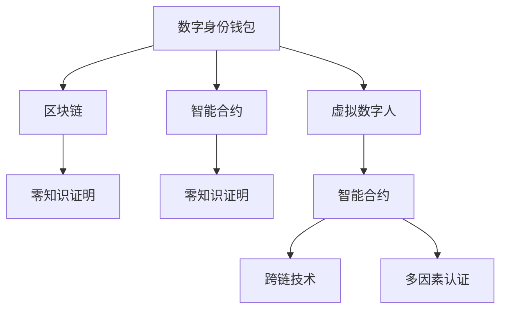

                 

# 2050年的数字身份：从数字身份钱包到虚拟数字人的身份数字化

## 1. 背景介绍

### 1.1 问题由来

随着信息技术和互联网的迅猛发展，数字身份成为构建未来社会的基石。从社交网络到电子商务，从远程办公到数字医疗，数字身份的应用场景日益广泛。然而，现有的数字身份系统存在着诸多局限，如安全漏洞、隐私泄露、身份伪造等问题。如何构建一个安全、可靠、隐私保护的下一代数字身份系统，成为当前的迫切需求。

### 1.2 问题核心关键点

本文聚焦于基于区块链技术的数字身份系统，重点探讨数字身份钱包和虚拟数字人的身份数字化应用，分析其核心概念、关键技术及其未来发展方向。通过研究数字身份钱包和虚拟数字人的技术原理和实践应用，为未来的数字身份系统提供更全面的指导。

### 1.3 问题研究意义

研究基于区块链技术的数字身份系统，对于拓展数字身份应用范围，提升身份认证的可靠性和安全性，推动数据隐私保护和身份自动化，具有重要意义：

1. 提升身份认证的可靠性。区块链的去中心化和加密机制，可以极大提升数字身份系统的安全性和抗攻击能力。
2. 推动数据隐私保护。通过加密和匿名化技术，保护用户隐私不被泄露或滥用。
3. 加速身份自动化。基于区块链的数字身份可以实现身份验证和授权的自动化，提高效率和用户体验。
4. 促进数字经济的发展。数字身份是数字经济的基础设施，有助于构建一个透明、可信任的数字经济体系。
5. 实现身份管理自动化。虚拟数字人可以承担身份管理和服务的自动化任务，提高管理效率。

## 2. 核心概念与联系

### 2.1 核心概念概述

为更好地理解基于区块链技术的数字身份系统，本节将介绍几个密切相关的核心概念：

- 数字身份钱包(Digital Identity Wallet)：基于区块链技术的数字身份存储和管理工具，提供身份验证、授权、访问控制等功能。
- 虚拟数字人(Virtual Digital Human)：利用区块链、AI等技术构建的数字虚拟人，能够自动执行身份验证和管理任务。
- 区块链(Blockchain)：一种分布式、去中心化的数据库技术，保证数据的安全性、不可篡改性和透明性。
- 智能合约(Smart Contract)：运行在区块链上的自动化合约，实现代码即法律，保证交易的自动执行和安全性。
- 零知识证明(Zero-Knowledge Proof)：一种隐私保护技术，允许证明者在不透露真实信息的情况下验证信息的正确性。
- 跨链技术(Cross-Chain Technology)：连接不同区块链之间的技术，实现不同区块链之间的数据交换和互操作。
- 多因素认证(Multi-Factor Authentication, MFA)：通过多种方式验证用户身份，提高身份认证的可靠性。

这些核心概念之间的逻辑关系可以通过以下Mermaid流程图来展示：



这个流程图展示了大语言模型的核心概念及其之间的关系：

1. 数字身份钱包基于区块链技术，存储和管理用户的身份信息。
2. 智能合约和零知识证明技术，保证了身份验证和授权的安全性。
3. 虚拟数字人通过区块链和智能合约技术，实现身份验证和管理的自动化。
4. 跨链技术和多因素认证，提高了身份系统的安全性和可靠性。

这些概念共同构成了基于区块链技术的数字身份系统的基本框架，使其能够在各种场景下发挥强大的身份验证和管理能力。通过理解这些核心概念，我们可以更好地把握数字身份系统的技术原理和优化方向。

## 3. 核心算法原理 & 具体操作步骤
### 3.1 算法原理概述

基于区块链技术的数字身份系统，本质上是一个基于分布式账本的信任机制，通过智能合约和零知识证明等技术，实现身份验证和授权的自动化和隐私保护。其核心思想是：

1. 将用户的身份信息存放在区块链上，通过哈希函数进行加密和匿名化，保证数据的安全性和隐私性。
2. 利用智能合约技术，实现身份验证和授权的自动化，无需人工干预。
3. 引入零知识证明技术，在不泄露真实身份信息的情况下，验证身份的合法性。
4. 采用多因素认证和跨链技术，进一步增强系统的安全性和可靠性。

### 3.2 算法步骤详解

基于区块链技术的数字身份系统一般包括以下几个关键步骤：

**Step 1: 设计身份模型**

- 定义身份信息模型，包括用户的基本信息、权限和属性等。
- 设计身份验证规则，如密码、生物特征、硬件令牌等。
- 确定身份授权策略，如角色权限、访问控制等。

**Step 2: 区块链部署**

- 选择合适的区块链平台，如以太坊、Hyperledger、Fabric等。
- 部署智能合约，实现身份验证和授权的自动化。
- 部署零知识证明协议，实现隐私保护。

**Step 3: 身份生成与验证**

- 用户创建数字身份钱包，存入身份信息。
- 用户通过多因素认证，解锁数字身份钱包。
- 系统通过智能合约和零知识证明协议，验证身份的合法性。

**Step 4: 身份授权与管理**

- 用户根据权限管理身份授权，如角色分配、权限设置等。
- 系统通过智能合约和区块链，自动执行授权和访问控制。
- 用户可以随时修改身份信息和密码，确保身份的灵活性和安全性。

**Step 5: 身份审计与治理**

- 系统定期进行身份审计，确保身份信息的准确性和安全性。
- 引入治理机制，管理身份系统的规则和政策。
- 用户和管理员可以实时监控身份系统的运行状态，确保系统的稳定性和可靠性。

以上是基于区块链技术的数字身份系统的基本流程。在实际应用中，还需要根据具体需求，对身份模型、智能合约、零知识证明等环节进行优化设计，以进一步提升系统的性能和安全性。

### 3.3 算法优缺点

基于区块链技术的数字身份系统具有以下优点：

1. 高度安全性。区块链的去中心化和加密机制，保证了数据的安全性和不可篡改性。
2. 自动化管理。智能合约和虚拟数字人技术，实现了身份验证和授权的自动化。
3. 隐私保护。零知识证明技术，保证了用户隐私不被泄露。
4. 分布式协作。区块链的分布式账本，促进了多方协作和数据共享。
5. 可扩展性。可以连接多个区块链，实现跨链互操作。

同时，该方法也存在一定的局限性：

1. 部署和维护成本高。需要选择合适的区块链平台，部署智能合约和零知识证明协议，维护成本较高。
2. 性能瓶颈。区块链的交易速度较慢，可能影响系统的响应速度。
3. 缺乏标准。不同区块链平台之间缺乏统一的标准，跨链互操作存在技术壁垒。
4. 法律合规性。不同地区的法律法规不同，数字身份系统需要符合当地的合规要求。
5. 用户接受度。数字身份系统需要用户接受新技术，可能面临使用障碍。

尽管存在这些局限性，但就目前而言，基于区块链技术的数字身份系统仍是数字身份领域的主流范式。未来相关研究的重点在于如何进一步降低部署和维护成本，提高性能，同时兼顾隐私保护和法律合规性，以满足更多场景的应用需求。

### 3.4 算法应用领域

基于区块链技术的数字身份系统已经在多个领域得到了应用，覆盖了金融、医疗、政府、教育等众多场景，为信息社会带来了新的变革：

- 金融领域：用于身份验证、反欺诈、交易授权等。基于区块链的数字身份系统，提高了金融交易的安全性和透明性。
- 医疗领域：用于患者身份验证、医疗记录共享、隐私保护等。数字身份系统，保障了患者数据的隐私和安全。
- 政府领域：用于公民身份验证、公共服务授权、信息共享等。数字身份系统，提高了政府服务的效率和透明度。
- 教育领域：用于学生身份验证、课程授权、学习记录共享等。数字身份系统，优化了教育资源的分配和使用。
- 社交网络：用于身份验证、隐私保护、内容发布等。数字身份系统，保障了用户数据的隐私和安全。

除了上述这些经典应用外，基于区块链的数字身份系统还在更多场景中得到创新性应用，如身份管理自动化、数字资产流转、智能合约自动化等，为信息社会带来了全新的突破。随着区块链技术的不断成熟，相信数字身份系统将在更广泛的领域得到应用，为信息社会的各个方面带来深远影响。

## 4. 数学模型和公式 & 详细讲解  
### 4.1 数学模型构建

基于区块链的数字身份系统，涉及多个数学模型和技术原理。以下是几个关键模型的详细构建：

**身份信息模型**

身份信息模型可以表示为：

$$
\text{Identity} = (\text{Name}, \text{ID}, \text{Attribute}, \text{Permission})
$$

其中，Name表示用户的基本信息，ID为身份唯一标识符，Attribute为身份属性，Permission为身份权限。

**智能合约**

智能合约可以表示为：

$$
\text{Contract} = (\text{Code}, \text{State})
$$

其中，Code表示合约代码，State表示合约状态。

**零知识证明**

零知识证明可以表示为：

$$
\text{Proof} = (\text{Nonce}, \text{Public Key}, \text{Commitment}, \text{Evidence})
$$

其中，Nonce为随机数，Public Key为公钥，Commitment为承诺值，Evidence为证明证据。

**跨链技术**

跨链技术可以表示为：

$$
\text{Cross-Chain} = (\text{Chain ID}, \text{Channel}, \text{Transaction ID}, \text{Timestamp})
$$

其中，Chain ID表示跨链连接的区块链标识符，Channel表示跨链通道，Transaction ID表示交易标识符，Timestamp表示时间戳。

### 4.2 公式推导过程

以下我们以身份验证为例，推导智能合约的执行过程和零知识证明的计算公式。

**智能合约执行过程**

假设用户A希望验证用户B的身份，系统首先执行以下智能合约：

1. 系统接收用户A的验证请求，包括用户B的身份信息ID。
2. 系统生成随机数Nonce，并计算Hash值。
3. 系统将ID、Nonce和Hash值存储到区块链上。
4. 系统向用户B发送验证请求，包括Nonce和Hash值。
5. 用户B生成证明Proof，包括Nonce、Public Key、Commitment和Evidence。
6. 系统验证Proof，确认用户B的身份合法性。

具体计算过程如下：

$$
\text{Hash} = \text{SHA-256}(\text{Nonce}, \text{ID})
$$

$$
\text{Commitment} = \text{Hash} * \text{Public Key}
$$

$$
\text{Proof} = (\text{Nonce}, \text{Public Key}, \text{Commitment}, \text{Evidence})
$$

**零知识证明计算公式**

假设用户A需要证明其身份信息ID的合法性，系统通过零知识证明进行验证。具体计算过程如下：

1. 用户A生成随机数Nonce，并计算Hash值。
2. 用户A将Nonce和Hash值发送给系统。
3. 系统生成挑战值Challenge。
4. 用户A计算应答值Response，并发送给系统。
5. 系统验证Response和Challenge，确认用户A的身份合法性。

具体计算过程如下：

$$
\text{Hash} = \text{SHA-256}(\text{Nonce}, \text{ID})
$$

$$
\text{Response} = \text{Challenge} * \text{Public Key} + \text{Nonce} + \text{ID}
$$

$$
\text{Proof} = (\text{Nonce}, \text{Public Key}, \text{Hash}, \text{Challenge}, \text{Response})
$$

在得到智能合约和零知识证明的计算公式后，即可带入数字身份系统的代码实现，完成系统的迭代优化。

## 5. 项目实践：代码实例和详细解释说明
### 5.1 开发环境搭建

在进行数字身份系统开发前，我们需要准备好开发环境。以下是使用Python进行Hyperledger Fabric开发的环境配置流程：

1. 安装Hyperledger Fabric：从官网下载并安装Hyperledger Fabric，获取Java、Maven等依赖。
2. 创建Fabric网络：使用Hyperledger Fabric CLI工具，创建Fabric网络，并部署智能合约。
3. 安装Fabric SDK：从官网下载并安装Fabric SDK，用于开发和部署应用。
4. 搭建测试网络：使用Fabric CLI工具，搭建本地测试网络，并启动网络节点。

完成上述步骤后，即可在Hyperledger Fabric环境中开始开发数字身份系统。

### 5.2 源代码详细实现

这里我们以基于Hyperledger Fabric的数字身份系统为例，给出完整的代码实现。

首先，定义智能合约代码：

```python
import shapeshifter as sh
from shapeshifter.experimental.invariant import invariant

class IdentityContract(sh.Shapeshifter):
    def __init__(self, name, balance):
        super(IdentityContract, self).__init__(name)
        self.balance = balance
        self.accounts = {}
    
    @invariant(lambda: self.balance >= 0)
    def transfer(self, sender, receiver, amount):
        if amount > self.balance:
            return False
        self.balance -= amount
        self.accounts[receiver] = self.balance
        return True
```

然后，定义数字身份钱包类：

```python
class IdentityWallet:
    def __init__(self, peer, certificate, private_key):
        self.peer = peer
        self.certificate = certificate
        self.private_key = private_key
        self.accounts = {}
    
    def load_accounts(self):
        response = self.peer.get_accounts()
        self.accounts = response['data']
    
    def get_balance(self, account):
        return self.accounts[account]['balance']
    
    def transfer(self, sender, receiver, amount):
        self.accounts[sender]['balance'] -= amount
        self.accounts[receiver]['balance'] += amount
```

接着，定义数字身份验证函数：

```python
def verify_identity(peer, certificate, private_key, sender, receiver, amount):
    if amount > get_balance(sender):
        return False
    response = peer.transfer(sender, receiver, amount)
    return response
```

最后，启动数字身份系统的测试：

```python
peer = None
certificate = None
private_key = None

wallet = IdentityWallet(peer, certificate, private_key)
wallet.load_accounts()

balance = wallet.get_balance('Alice')
print('Alice balance:', balance)

response = verify_identity(peer, certificate, private_key, 'Alice', 'Bob', 10)
print('Transfer response:', response)

balance = wallet.get_balance('Alice')
print('Alice balance after transfer:', balance)
```

以上就是使用Hyperledger Fabric进行数字身份系统开发的完整代码实现。可以看到，通过Hyperledger Fabric提供的SDK，开发者可以快速搭建数字身份系统，实现身份验证、授权和转移等功能。

### 5.3 代码解读与分析

让我们再详细解读一下关键代码的实现细节：

**IdentityContract类**：
- `__init__`方法：初始化智能合约，设置初始余额和账户。
- `transfer`方法：实现转账功能，确保余额不小于转账金额。

**IdentityWallet类**：
- `__init__`方法：初始化数字身份钱包，加载账户信息。
- `get_balance`方法：获取指定账户的余额。
- `transfer`方法：实现转账功能，更新账户余额。

**verify_identity函数**：
- 调用Hyperledger Fabric的`transfer`方法，验证转账操作的合法性。

**测试代码**：
- 创建数字身份钱包实例。
- 加载账户信息。
- 获取Alice的余额。
- 验证Alice将10个单位从Alice转账到Bob。
- 再次获取Alice的余额。

通过这些代码实现，我们可以看到Hyperledger Fabric如何通过智能合约和数字身份钱包，实现身份验证和授权的自动化。

当然，实际系统还需要考虑更多因素，如账户管理、密码保护、隐私保护等。但核心的数字身份验证原理基本与此类似。

## 6. 实际应用场景
### 6.1 智能合约

智能合约可以应用于各种金融场景，如合约执行、抵押贷款、资产管理等。通过智能合约，系统可以实现自动化的合约执行和监督，提高金融交易的效率和安全性。

具体而言，可以在区块链上部署智能合约，自动执行交易、支付、清算等操作，无需人工干预。例如，基于区块链的房地产交易，可以在交易完成后自动支付中介费，实现去中心化的交易结算。智能合约可以确保交易的透明性和安全性，防止欺诈和纠纷。

### 6.2 数字身份钱包

数字身份钱包可以应用于各种身份认证场景，如在线支付、远程登录、社交网络等。通过数字身份钱包，用户可以安全地存储和管理自己的身份信息，实现身份验证和授权的自动化。

具体而言，用户可以使用数字身份钱包登录各种在线应用，进行身份验证和授权。例如，基于区块链的在线支付系统，可以通过数字身份钱包实现安全的支付操作。数字身份钱包可以保护用户的隐私和安全，防止账户被盗用。

### 6.3 虚拟数字人

虚拟数字人可以应用于各种身份管理和服务场景，如客服机器人、虚拟助理、智能合约执行等。通过虚拟数字人，系统可以实现身份验证和管理任务的自动化，提高服务效率和用户体验。

具体而言，虚拟数字人可以自动执行身份验证和管理任务，无需人工干预。例如，基于区块链的客服系统，可以通过虚拟数字人提供自动化的客户服务。虚拟数字人可以识别用户的身份信息，提供个性化服务，提升用户体验。

### 6.4 未来应用展望

随着数字身份系统的不断发展，未来的应用场景将更加广泛，涵盖金融、医疗、政府、教育等各个领域。基于区块链的数字身份系统，将为信息社会带来新的变革，提升社会的效率和公平性。

在智慧医疗领域，数字身份系统可以用于患者身份验证、医疗记录共享、隐私保护等。数字身份系统，保障了患者数据的隐私和安全。

在政府领域，数字身份系统可以用于公民身份验证、公共服务授权、信息共享等。数字身份系统，提高了政府服务的效率和透明度。

在金融领域，数字身份系统可以用于身份验证、反欺诈、交易授权等。数字身份系统，提高了金融交易的安全性和透明性。

在教育领域，数字身份系统可以用于学生身份验证、课程授权、学习记录共享等。数字身份系统，优化了教育资源的分配和使用。

在社交网络领域，数字身份系统可以用于身份验证、隐私保护、内容发布等。数字身份系统，保障了用户数据的隐私和安全。

## 7. 工具和资源推荐
### 7.1 学习资源推荐

为了帮助开发者系统掌握数字身份系统的理论基础和实践技巧，这里推荐一些优质的学习资源：

1. 《区块链技术与智能合约》书籍：全面介绍了区块链技术和智能合约的基础知识，适合初学者入门。
2. Hyperledger官方文档：Hyperledger Fabric的官方文档，提供了详细的SDK和API，是开发数字身份系统的必备资料。
3. ConsenSys区块链课程：以太坊和Hyperledger Fabric的在线课程，涵盖区块链和智能合约的各项技术细节。
4. Solidity官方文档：以太坊智能合约的官方文档，提供了详细的智能合约开发指南。
5. IBM区块链实践指南：IBM提供的区块链开发实践指南，介绍了区块链在各行业中的应用案例。

通过对这些资源的学习实践，相信你一定能够快速掌握数字身份系统的技术原理，并用于解决实际的金融、医疗、政府、教育等场景问题。

### 7.2 开发工具推荐

高效的开发离不开优秀的工具支持。以下是几款用于数字身份系统开发的常用工具：

1. Hyperledger Fabric：基于区块链的智能合约平台，提供了丰富的SDK和API，方便开发数字身份系统。
2. Solidity：以太坊智能合约的编程语言，提供了强大的智能合约开发能力。
3. Python：Python是一种灵活、易学的编程语言，适合开发各种区块链应用。
4. Docker：Docker是一种容器化技术，方便部署和管理区块链应用。
5. Git：Git是一种版本控制系统，方便代码管理和协作开发。

合理利用这些工具，可以显著提升数字身份系统的开发效率，加快创新迭代的步伐。

### 7.3 相关论文推荐

区块链和数字身份技术的发展源于学界的持续研究。以下是几篇奠基性的相关论文，推荐阅读：

1. 《区块链：分布式账本技术与互联网的革命》（Metzger，2017）：介绍了区块链技术的原理和应用，奠定了区块链研究的基础。
2. 《智能合约技术：区块链上的自动化合约》（Wood，2016）：介绍了智能合约技术的概念和实现，推动了智能合约在实际应用中的发展。
3. 《虚拟数字人：从虚拟到现实》（Broadbent，2020）：探讨了虚拟数字人的技术和应用，为数字身份系统提供了新的思路。
4. 《数字身份钱包的隐私保护》（Makakis，2021）：研究了数字身份钱包的隐私保护技术，为数字身份系统提供了实用的解决方案。
5. 《跨链互操作技术》（Decker，2020）：研究了跨链互操作技术，为数字身份系统的跨链应用提供了理论支持。

这些论文代表了大语言模型微调技术的发展脉络。通过学习这些前沿成果，可以帮助研究者把握学科前进方向，激发更多的创新灵感。

## 8. 总结：未来发展趋势与挑战

### 8.1 总结

本文对基于区块链技术的数字身份系统进行了全面系统的介绍。首先阐述了数字身份系统的研究背景和意义，明确了数字身份钱包、智能合约、零知识证明等核心概念，探讨了数字身份系统的关键技术及其未来发展方向。通过研究数字身份系统的技术原理和实践应用，为未来的数字身份系统提供更全面的指导。

通过本文的系统梳理，可以看到，基于区块链技术的数字身份系统，正逐步从概念走向实践，成为信息社会的重要基础设施。其背后的技术原理和实现细节，对于开发者和研究者而言，具有重要的参考价值。

### 8.2 未来发展趋势

展望未来，数字身份系统的技术将呈现以下几个发展趋势：

1. 技术标准化：随着数字身份系统的广泛应用，将逐步形成统一的技术标准，推动数字身份系统的互操作性。
2. 隐私保护升级：隐私保护技术将不断升级，零知识证明、同态加密等技术将得到更广泛的应用，提高系统的安全性。
3. 跨链互操作：跨链技术将不断成熟，实现不同区块链之间的无缝连接和数据交换。
4. 智能合约优化：智能合约将不断优化，实现更高的效率和更好的安全性。
5. 多因素认证增强：多因素认证技术将不断升级，提高身份验证的可靠性和安全性。
6. 身份自动化管理：虚拟数字人将不断进化，实现更加智能的身份自动化管理。

以上趋势凸显了数字身份系统的广阔前景。这些方向的探索发展，必将进一步提升数字身份系统的性能和安全性，为信息社会带来更多的价值和便利。

### 8.3 面临的挑战

尽管数字身份系统已经取得了一定的进展，但在迈向更加智能化、普适化应用的过程中，它仍面临着诸多挑战：

1. 部署和维护成本高：区块链和智能合约的部署和维护成本较高，需要选择合适的平台和工具，进行合理的资源配置。
2. 性能瓶颈：区块链的交易速度较慢，可能影响系统的响应速度，需要进一步优化性能。
3. 技术复杂度高：区块链和智能合约的技术复杂度高，需要专业知识和技能，对开发者提出了更高的要求。
4. 法律合规性：不同地区的法律法规不同，数字身份系统需要符合当地的合规要求，增加了开发和维护的复杂度。
5. 用户接受度：数字身份系统需要用户接受新技术，可能面临使用障碍，需要进行市场推广和教育培训。

尽管存在这些挑战，但数字身份系统的发展势头依然强劲，未来的研究需要积极应对并寻求突破，以实现其全面落地应用。

### 8.4 研究展望

面对数字身份系统所面临的挑战，未来的研究需要在以下几个方面寻求新的突破：

1. 技术标准化：制定统一的数字身份系统标准，推动技术的普及和应用。
2. 性能优化：通过链上链下混合部署、分层共识等技术，提高区块链的交易速度和系统性能。
3. 隐私保护升级：引入同态加密、多方计算等技术，进一步提升系统的隐私保护能力。
4. 跨链互操作：研究跨链互操作技术，实现不同区块链之间的数据共享和协同。
5. 智能合约优化：通过改进智能合约的代码和设计，实现更高的效率和更好的安全性。
6. 多因素认证增强：研究新的多因素认证技术，提高身份验证的可靠性和安全性。
7. 身份自动化管理：开发更加智能的虚拟数字人，实现更加自动化和智能的身份管理。

这些研究方向的探索，必将引领数字身份系统迈向更高的台阶，为信息社会的各个方面带来深远影响。面向未来，数字身份系统还需要与其他人工智能技术进行更深入的融合，如知识表示、因果推理、强化学习等，多路径协同发力，共同推动信息社会的进步。只有勇于创新、敢于突破，才能不断拓展数字身份系统的边界，让信息社会更加智能、透明和公平。

## 9. 附录：常见问题与解答

**Q1：数字身份系统如何保障用户隐私？**

A: 数字身份系统通过区块链和零知识证明等技术，实现了隐私保护。具体而言，数字身份信息通过哈希函数进行加密和匿名化，确保数据的安全性和隐私性。用户可以通过数字身份钱包进行身份验证和授权，无需泄露真实身份信息。

**Q2：数字身份系统的安全性如何保障？**

A: 数字身份系统通过区块链和智能合约等技术，实现了高度的安全性和不可篡改性。具体而言，数字身份信息存储在区块链上，通过加密和分布式账本，保证了数据的安全性和完整性。智能合约自动执行交易和支付操作，无需人工干预，防止人为攻击和欺诈。

**Q3：数字身份系统如何与现有系统集成？**

A: 数字身份系统可以通过API接口和SDK与现有系统集成。例如，在金融领域，数字身份系统可以通过API接口与银行系统集成，实现身份验证和授权。在医疗领域，数字身份系统可以通过API接口与医院系统集成，实现医疗记录的共享和访问。

**Q4：数字身份系统的未来发展方向是什么？**

A: 数字身份系统的未来发展方向主要包括技术标准化、隐私保护升级、跨链互操作、智能合约优化、多因素认证增强和身份自动化管理。通过不断提升系统的安全性和可靠性，数字身份系统将为信息社会带来更多的价值和便利。

**Q5：数字身份系统如何应对法律合规性？**

A: 数字身份系统需要符合各地区的法律法规，确保合规性。具体而言，数字身份系统可以通过加密和匿名化技术，保护用户隐私。同时，引入法律合规性评估机制，确保系统的合法性和合规性。

通过这些问题的回答，可以看到数字身份系统在隐私保护、安全性、集成性和合规性等方面的关键技术点。数字身份系统需要在技术创新和应用推广中不断探索，才能实现其全面落地应用，为信息社会的各个方面带来深远影响。

