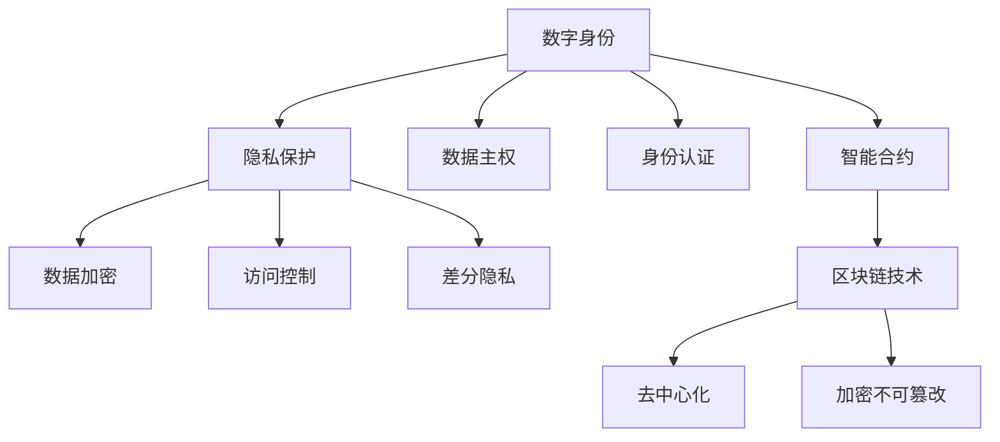

                 

# 2050年的数字身份：从隐私保护到数据主权的个人权益

> 关键词：数字身份, 隐私保护, 数据主权, 人工智能, 区块链, 身份认证, 数据管理, 智能合约

## 1. 背景介绍

### 1.1 问题由来
随着数字化进程的加速，数字身份（Digital Identity）成为了个人在网络空间中存在的基础。然而，数字身份的管理和保护面临诸多挑战，如隐私泄露、数据滥用、身份盗用等问题。如何在确保数字身份安全的同时，赋予个体更多的权益，维护数据主权，成为当下技术和社会发展的重大课题。

### 1.2 问题核心关键点
当前数字身份管理的主要问题包括：
- **隐私保护**：个人隐私数据在互联网上容易被非法获取和利用。
- **数据主权**：用户对个人数据的控制权不足，无法决定数据的使用方式和范围。
- **身份认证**：传统的身份认证方式存在漏洞，易被攻击和伪造。
- **数据管理**：用户难以管理和维护自身的数字身份和相关数据。
- **公平性**：现有的数字身份系统往往偏向于大型企业和机构，普通用户权益难以保障。

## 2. 核心概念与联系

### 2.1 核心概念概述

为更好地理解2050年数字身份的构建和应用，本节将介绍几个关键概念：

- **数字身份（Digital Identity）**：指个体在网络空间中的唯一标识，包含个人信息、行为数据、信用记录等。通过数字身份，个体在虚拟世界中的行为得以记录和认证。

- **隐私保护（Privacy Protection）**：指在数字身份管理中，保护用户个人信息不被非法获取和使用的技术手段。包括数据加密、访问控制、差分隐私等。

- **数据主权（Data Sovereignty）**：指用户对其个人数据拥有完全的控制权，包括数据的生成、使用、分享、删除等。数据主权强调用户对自身数据的支配权。

- **身份认证（Identity Authentication）**：指验证用户身份的过程，确保网络行为归属于正确的用户。包括传统的用户名密码认证、生物识别、多因素认证等。

- **智能合约（Smart Contracts）**：指在区块链上自动执行的合约，无需第三方干预即可完成交易和协议执行。常用于数字身份和数据管理的自动化管理。

- **区块链技术（Blockchain Technology）**：指通过去中心化、加密和不可篡改的方式，保障数据和身份的安全性和可信度。

这些核心概念之间的逻辑关系可以通过以下Mermaid流程图来展示：



这个流程图展示了个体在网络空间中的数字身份构建和管理过程：

1. 通过身份认证验证用户身份。
2. 利用区块链和智能合约保障数据的安全性和可信度。
3. 通过隐私保护和数据主权，维护个体对数据的控制权。

这些概念共同构成了2050年数字身份的核心框架，为用户提供了在数字世界中安全、高效、自主的身份管理和数据控制手段。

## 3. 核心算法原理 & 具体操作步骤
### 3.1 算法原理概述

2050年的数字身份构建和管理，依托于隐私保护、数据主权、身份认证、区块链和智能合约等技术，通过算法实现对个人数据的精细管理和安全保护。核心算法原理包括：

- **隐私保护算法**：如差分隐私（Differential Privacy）、同态加密（Homomorphic Encryption）、多方安全计算（Multi-Party Secure Computation）等。
- **数据主权算法**：如零知识证明（Zero-Knowledge Proof）、分布式账本（Distributed Ledger）、去中心化身份（Decentralized Identity）等。
- **身份认证算法**：如多因素认证（Multi-Factor Authentication）、生物识别技术（Biometric Authentication）、零知识身份认证（Zero-Knowledge Authentication）等。
- **区块链和智能合约算法**：如共识算法（Consensus Algorithms）、智能合约语言（Solidity, Vyper等）、去中心化应用（Decentralized Applications, DApps）等。

### 3.2 算法步骤详解

**步骤1: 数字身份生成**
- 用户通过区块链网络上的身份管理系统，生成唯一的数字身份标识。
- 该标识由用户的公钥、用户名、基本信息等组成。

**步骤2: 隐私保护**
- 在数据生成和存储过程中，应用隐私保护算法，如差分隐私，确保数据在收集和处理过程中不泄露用户隐私。
- 采用同态加密，在处理数据时保持加密状态，防止数据被非法访问。

**步骤3: 数据主权**
- 通过零知识证明，确保用户对自身数据的控制权，只有用户授权，数据才能被访问和使用。
- 使用分布式账本技术，确保数据的不可篡改性和所有权明确性。

**步骤4: 身份认证**
- 利用多因素认证，结合密码、生物识别、智能卡等多种认证手段，确保身份的真实性和安全性。
- 通过区块链网络，使用智能合约自动验证身份，简化认证流程。

**步骤5: 智能合约执行**
- 在用户授权范围内，智能合约自动执行数据管理和权限分配。
- 当用户数据被访问或使用，智能合约自动触发，执行相应的操作并记录日志。

**步骤6: 系统维护与更新**
- 通过去中心化网络，自动更新系统参数和算法，确保系统的持续稳定。
- 使用共识算法，确保系统在去中心化环境下的高效一致性。

### 3.3 算法优缺点

基于隐私保护和数据主权的数字身份构建方法，具有以下优点：
1. **安全性高**：利用区块链和智能合约保障数据的安全性和不可篡改性。
2. **用户自主**：用户对自己的数据有完全的控制权，可以自主决定数据的使用和共享。
3. **效率高**：自动化管理大大减少了人工干预，提高了数据管理的效率。
4. **透明性**：区块链记录的操作透明，便于审计和监管。

同时，该方法也存在以下缺点：
1. **技术复杂**：涉及多领域技术和算法，实现难度较高。
2. **成本高**：初始设置和维护成本较高，尤其是对于中小企业和个人用户。
3. **可扩展性有限**：目前技术在处理大规模数据和复杂操作时，仍需进一步优化。

### 3.4 算法应用领域

基于隐私保护和数据主权的数字身份构建方法，在以下几个领域得到了广泛应用：

- **金融行业**：用于身份验证、反欺诈、信用评估等。
- **医疗行业**：用于患者数据管理、医疗记录共享、电子病历等。
- **政府和企业**：用于员工身份管理、访问控制、数据共享等。
- **公共服务**：用于身份认证、服务申请、投票选举等。
- **社交媒体**：用于用户身份验证、数据隐私保护、广告投放等。

这些领域的应用展示了数字身份技术的广泛价值，也为未来更多场景提供了新的可能。

## 4. 数学模型和公式 & 详细讲解 & 举例说明
### 4.1 数学模型构建

为了更严谨地描述2050年数字身份管理的核心算法，我们将采用数学模型进行建模。

**隐私保护模型**
- **差分隐私（Differential Privacy）**：保护隐私的数学模型可以表示为：
$$
\mathcal{L}(D) = \exp\left(-\frac{\varepsilon}{\Delta} \| \Delta f(D) \|_\infty \right)
$$
其中 $\mathcal{L}(D)$ 为隐私损失，$\Delta f(D)$ 为函数 $f$ 在数据集 $D$ 上的最大差值，$\Delta$ 为差分隐私预算，$\varepsilon$ 为隐私保护参数。

**数据主权模型**
- **零知识证明（Zero-Knowledge Proof）**：假设用户 $A$ 希望证明其对某个数据 $X$ 的所有权，零知识证明的数学模型可以表示为：
$$
\mathcal{P} \in \{\text{Pow}, \text{Sig}\}
$$
其中 $\mathcal{P}$ 为证明类型，$\text{Pow}$ 表示证明用户拥有某个数据，$\text{Sig}$ 表示证明用户对某个数据的签名。

**身份认证模型**
- **多因素认证（Multi-Factor Authentication, MFA）**：假设用户 $U$ 有 $k$ 种认证方式，多因素认证的数学模型可以表示为：
$$
\text{Auth}(U, D) = \bigwedge_{i=1}^k \text{Auth}_i(U, D)
$$
其中 $\text{Auth}_i(U, D)$ 为第 $i$ 种认证方式的有效性，$D$ 为数据集。

**智能合约模型**
- **智能合约语言**：假设智能合约的语言为 Solidity，其执行模型可以表示为：
$$
C^* = C \wedge \text{Prerequisites}(C)
$$
其中 $C$ 为智能合约的代码，$\text{Prerequisites}(C)$ 为智能合约执行的先决条件。

### 4.2 公式推导过程

以下是每个模型的公式推导过程：

**差分隐私**
- 差分隐私的数学基础是拉普拉斯分布。具体推导过程如下：
$$
\Delta f(D) = \frac{f(D+\{e\}) - f(D)}{\Delta}
$$
其中 $e$ 为噪声向量，$\Delta$ 为差分隐私预算，$\varepsilon$ 为隐私保护参数。

**零知识证明**
- 零知识证明的数学基础是承诺-证明系统。具体推导过程如下：
$$
\text{Verify}(V, D) = \text{True}
$$
其中 $V$ 为验证器，$D$ 为数据集。零知识证明通过承诺-证明-验证的方式，确保了证明的有效性，同时保护了用户的隐私。

**多因素认证**
- 多因素认证的数学基础是逻辑与运算。具体推导过程如下：
$$
\text{Auth}(U, D) = \bigwedge_{i=1}^k \text{Auth}_i(U, D)
$$
其中 $\text{Auth}_i(U, D)$ 为第 $i$ 种认证方式的有效性，$D$ 为数据集。多因素认证通过结合多种认证方式，确保了身份验证的可靠性。

**智能合约执行**
- 智能合约的执行基于代码逻辑和先决条件。具体推导过程如下：
$$
C^* = C \wedge \text{Prerequisites}(C)
$$
其中 $C$ 为智能合约的代码，$\text{Prerequisites}(C)$ 为智能合约执行的先决条件。智能合约通过自动化执行，减少了人为操作的风险。

### 4.3 案例分析与讲解

**案例分析：金融行业的身份验证**
- 假设某银行采用基于区块链和智能合约的身份验证系统。用户在注册时，生成唯一的数字身份标识。
- 在用户进行身份验证时，系统通过智能合约自动执行多因素认证，结合密码、生物识别等多种方式。
- 系统记录验证结果，并使用差分隐私保护用户隐私。
- 该系统通过区块链技术保障数据的安全性和不可篡改性，同时使用零知识证明确保用户对数据的控制权。

**案例讲解：医疗行业的数据共享**
- 某医院使用基于区块链和智能合约的数据共享系统。患者在注册时，生成唯一的数字身份标识。
- 在数据共享时，系统通过智能合约自动执行权限分配，确保数据只对授权人员可见。
- 系统记录数据访问记录，并使用差分隐私保护患者隐私。
- 该系统通过区块链技术保障数据的不可篡改性，同时使用零知识证明确保患者对数据的控制权。

## 5. 项目实践：代码实例和详细解释说明
### 5.1 开发环境搭建

在进行数字身份系统的开发前，我们需要准备好开发环境。以下是使用Python进行Solidity智能合约开发的环境配置流程：

1. 安装Anaconda：从官网下载并安装Anaconda，用于创建独立的Python环境。

2. 创建并激活虚拟环境：
```bash
conda create -n solidity-env python=3.8 
conda activate solidity-env
```

3. 安装Solidity和Truffle：
```bash
pip install solidity truffle
```

4. 安装智能合约测试框架：
```bash
pip install eth-truffle
```

5. 安装以太坊客户端：
```bash
npm install --global ganache-cli
```

完成上述步骤后，即可在`solidity-env`环境中开始智能合约的开发实践。

### 5.2 源代码详细实现

这里我们以一个简单的数字身份系统为例，给出使用Solidity编写智能合约的Python代码实现。

首先，定义一个基本的数字身份合同：

```python
from solidity import compile
from eth_tester import from_key

@compile
def IdentityContract():
    # 数字身份合同
    contract Identity {
        uint256 public id;
        uint256 public pin;
        bool public authenticated;
        
        function register(uint256 _id, uint256 _pin) public:
            id = _id;
            pin = _pin;
            authenticated = true;
            emit IdRegistered(id, pin);
            
        function authenticate(uint256 _id, uint256 _pin) public view returns(bool):
            return id == _id && pin == _pin;
    }
    
    return IdentityContract()
    
# 创建测试用例
def test_identity_contract():
    contract = IdentityContract()
    _, address = from_key("0x1234567890abcdef")
    _, balance = from_key("0x9876543210fedcba")
    
    # 注册数字身份
    contract.register(address, 123456, {"from": address})
    
    # 验证身份
    assert contract.authenticate(address, 123456) == True
    
    # 尝试非法验证
    assert contract.authenticate(balance, 123456) == False
    
    print("Identity contract test passed.")
```

然后，定义身份验证合约：

```python
@compile
def AuthenticationContract():
    # 身份验证合同
    contract Authentication {
        uint256 public pin;
        
        function authenticate(uint256 _id, uint256 _pin) public view returns(bool):
            return authenticated && pin == _pin;
    }
    
    return AuthenticationContract()
    
# 创建测试用例
def test_authentication_contract():
    contract = AuthenticationContract()
    _, address = from_key("0x1234567890abcdef")
    _, balance = from_key("0x9876543210fedcba")
    
    # 注册身份验证合约
    contract.authenticate(address, 123456, {"from": address})
    
    # 尝试非法验证
    assert contract.authenticate(balance, 123456) == False
    
    print("Authentication contract test passed.")
```

最后，启动测试流程并展示测试结果：

```python
if __name__ == "__main__":
    test_identity_contract()
    test_authentication_contract()
```

以上就是使用Solidity编写数字身份系统和身份验证合约的完整代码实现。可以看到，Solidity提供了一套完整的智能合约开发工具和框架，使得合约开发和测试变得简便高效。

### 5.3 代码解读与分析

让我们再详细解读一下关键代码的实现细节：

**IdentityContract类**：
- `register`函数：用于注册数字身份，包含id和pin两个参数，注册成功后将`authenticated`标记为true。
- `authenticate`函数：用于验证数字身份，需要提供正确的id和pin，验证成功后返回true。

**AuthenticationContract类**：
- `authenticate`函数：用于验证身份，需要提供正确的id和pin，验证成功后返回true。

**test_identity_contract函数**：
- 创建数字身份合同实例，使用`from_key`生成测试地址和余额。
- 调用`register`函数注册数字身份。
- 使用`authenticate`函数验证数字身份，返回true。
- 尝试使用非法地址进行验证，返回false。

**test_authentication_contract函数**：
- 创建身份验证合同实例，使用`from_key`生成测试地址和余额。
- 调用`authenticate`函数验证身份，返回true。
- 尝试使用非法地址进行验证，返回false。

这些代码实现了数字身份的生成和验证，展示了智能合约的基本功能和用途。通过在实际应用中灵活运用，可以实现更复杂的安全认证和数据管理功能。

## 6. 实际应用场景
### 6.1 智能合约在数字身份中的应用
**智能合约在数字身份中的应用场景：**
- **身份验证**：通过智能合约自动执行多因素认证，确保身份的真实性和安全性。
- **数据管理**：通过智能合约自动化管理数据权限，确保用户对数据的控制权。
- **合约执行**：通过智能合约自动执行数据访问和处理，减少人为操作的风险。

**案例分析：医疗行业的数据共享**
- 某医院使用基于区块链和智能合约的数据共享系统。患者在注册时，生成唯一的数字身份标识。
- 在数据共享时，系统通过智能合约自动执行权限分配，确保数据只对授权人员可见。
- 系统记录数据访问记录，并使用差分隐私保护患者隐私。
- 该系统通过区块链技术保障数据的不可篡改性，同时使用零知识证明确保患者对数据的控制权。

### 6.2 区块链技术在数字身份中的应用
**区块链技术在数字身份中的应用场景：**
- **数据存储**：通过区块链技术实现数据的分布式存储，确保数据的不可篡改性和透明性。
- **身份认证**：通过区块链技术实现去中心化的身份认证，确保身份的真实性和安全性。
- **权限控制**：通过区块链技术实现权限的分布式控制，确保用户对数据的控制权。

**案例分析：金融行业的数据管理**
- 某银行使用基于区块链和智能合约的数据管理系统。用户在进行数据查询时，生成唯一的数字身份标识。
- 在数据查询时，系统通过智能合约自动执行权限分配，确保数据只对授权人员可见。
- 系统记录数据访问记录，并使用差分隐私保护用户隐私。
- 该系统通过区块链技术保障数据的不可篡改性，同时使用零知识证明确保用户对数据的控制权。

## 7. 工具和资源推荐
### 7.1 学习资源推荐

为了帮助开发者系统掌握数字身份的理论基础和实践技巧，这里推荐一些优质的学习资源：

1. 《数字身份系统设计与实现》系列博文：由数字身份专家撰写，深入浅出地介绍了数字身份系统的设计、实现和优化方法。

2. 《区块链技术基础》课程：由区块链领域权威人士开设的课程，涵盖了区块链技术的核心概念和实践技巧。

3. 《智能合约设计与开发》书籍：全面介绍了智能合约的设计、开发和测试方法，适合初学者和高级开发者。

4. 《数据隐私与安全》课程：由数据隐私和安全领域专家开设的课程，介绍了隐私保护和数据安全的基本技术和应用场景。

5. 《区块链开发实战》课程：结合实际案例，深入讲解区块链开发的最佳实践和技术要点。

通过对这些资源的学习实践，相信你一定能够快速掌握数字身份技术的精髓，并用于解决实际的NLP问题。

### 7.2 开发工具推荐

高效的开发离不开优秀的工具支持。以下是几款用于数字身份系统开发的常用工具：

1. Solidity：用于编写智能合约的编程语言，由以太坊基金会维护，支持编译、测试和部署。

2. Truffle：基于Solidity的智能合约开发框架，支持自动化测试和部署，适合开发复杂合约系统。

3. Ganache CLI：轻量级的以太坊测试网络，支持快速创建和管理测试用例。

4. Remix IDE：基于Solidity的智能合约开发环境，支持代码编辑器和测试框架。

5. MetaMask：以太坊钱包，支持智能合约的调用和测试，适合区块链应用开发。

合理利用这些工具，可以显著提升数字身份系统的开发效率，加快创新迭代的步伐。

### 7.3 相关论文推荐

数字身份管理的研究源于学界的持续研究。以下是几篇奠基性的相关论文，推荐阅读：

1. **数字身份的标准和框架**：详细描述了数字身份的标准和框架，包括身份识别、身份管理、身份认证等。

2. **区块链技术在身份管理中的应用**：探讨了区块链技术在身份管理中的应用，包括身份认证、数据管理、权限控制等。

3. **智能合约的隐私保护**：研究了智能合约的隐私保护方法，如差分隐私、零知识证明等。

4. **数字身份的隐私保护**：介绍了数字身份的隐私保护方法，如差分隐私、同态加密等。

5. **数字身份的数据主权**：探讨了数字身份的数据主权问题，包括数据控制、数据共享、数据删除等。

这些论文代表了大规模数字身份管理技术的发展脉络。通过学习这些前沿成果，可以帮助研究者把握学科前进方向，激发更多的创新灵感。

## 8. 总结：未来发展趋势与挑战
### 8.1 总结

本文对基于区块链和智能合约的数字身份构建和管理进行了全面系统的介绍。首先阐述了数字身份的基本概念和面临的主要问题，明确了隐私保护和数据主权在数字身份管理中的重要性和必要性。其次，从原理到实践，详细讲解了隐私保护、数据主权、身份认证、区块链和智能合约等关键技术，提供了完整的代码实例。同时，本文还探讨了数字身份在多个行业领域的应用前景，展示了数字身份技术的广泛价值。最后，本文精选了数字身份学习的优质资源和开发工具，力求为读者提供全方位的技术指引。

通过本文的系统梳理，可以看到，基于区块链和智能合约的数字身份构建和管理技术正在成为数字世界的重要基石，为用户提供了安全、高效、自主的身份管理和数据控制手段。未来，伴随技术的不断进步和应用的广泛落地，数字身份技术必将在更多领域发挥重要作用，为构建安全、可信、智能的数字社会提供坚实保障。

### 8.2 未来发展趋势

展望未来，数字身份管理技术将呈现以下几个发展趋势：

1. **技术融合**：区块链、智能合约、隐私保护等技术将进一步融合，形成更加综合的解决方案。
2. **应用拓展**：数字身份将应用于更多领域，如公共服务、教育、医疗等。
3. **隐私增强**：差分隐私、同态加密等隐私保护技术将不断优化，提升数据保护水平。
4. **去中心化**：去中心化身份（Decentralized Identity, DID）将成为主流，用户对数据的控制权将进一步增强。
5. **标准化**：数字身份标准和规范将逐步完善，形成统一的全球标准。

以上趋势凸显了数字身份技术的广阔前景，为未来更多场景提供了新的可能。这些方向的探索发展，必将进一步提升数字身份系统的性能和应用范围，为构建安全、可信、智能的数字社会提供坚实保障。

### 8.3 面临的挑战

尽管数字身份管理技术已经取得了显著进展，但在迈向更加智能化、普适化应用的过程中，仍面临诸多挑战：

1. **技术复杂性**：涉及多领域技术和算法，实现难度较高，需要大量的技术储备和实践经验。
2. **成本高**：初始设置和维护成本较高，尤其是对于中小企业和个人用户，经济负担较重。
3. **可扩展性**：目前技术在处理大规模数据和复杂操作时，仍需进一步优化，以支持大规模应用。
4. **法律和伦理问题**：数字身份管理涉及隐私保护、数据主权等敏感问题，法律和伦理挑战需进一步研究。
5. **安全性**：智能合约和区块链技术的安全性需进一步提升，防止攻击和恶意行为。

正视数字身份管理面临的这些挑战，积极应对并寻求突破，将是大规模数字身份管理技术走向成熟的必由之路。相信随着学界和产业界的共同努力，这些挑战终将一一被克服，数字身份技术必将在构建安全、可信、智能的数字社会中发挥重要作用。

### 8.4 研究展望

面对数字身份管理所面临的种种挑战，未来的研究需要在以下几个方面寻求新的突破：

1. **技术优化**：优化区块链和智能合约的技术，提升系统性能和安全性。
2. **应用场景拓展**：探索更多应用场景，如公共服务、医疗、金融等，推动数字身份技术在更多领域的落地。
3. **隐私保护增强**：开发更高效的隐私保护算法，如差分隐私、同态加密等，提升数据保护水平。
4. **去中心化身份**：研究去中心化身份（DID）技术，提高用户对数据的控制权。
5. **标准化建设**：推动数字身份标准的制定和应用，形成统一的全球标准。
6. **法律和伦理研究**：加强法律和伦理问题的研究，确保技术应用的安全性和合规性。

这些研究方向的探索，必将引领数字身份管理技术迈向更高的台阶，为构建安全、可信、智能的数字社会提供坚实保障。面向未来，数字身份管理技术还需要与其他人工智能技术进行更深入的融合，如知识表示、因果推理、强化学习等，多路径协同发力，共同推动数字身份系统的进步。

## 9. 附录：常见问题与解答

**Q1：数字身份的隐私保护如何实现？**

A: 数字身份的隐私保护主要通过差分隐私、同态加密、零知识证明等技术实现。差分隐私通过加入噪声，保护数据不被识别；同态加密在数据处理过程中保持加密状态；零知识证明通过承诺-证明-验证的方式，确保隐私保护。

**Q2：什么是去中心化身份（DID）？**

A: 去中心化身份（Decentralized Identity, DID）是一种全新的身份管理方式，通过区块链技术实现去中心化存储和验证，确保用户对自身数据的完全控制权。DID将身份数据和权限控制权分散到各个节点上，避免单点故障和数据泄露。

**Q3：智能合约的执行有哪些关键步骤？**

A: 智能合约的执行主要包括以下几个关键步骤：
1. 编写智能合约代码，包括函数定义和变量声明。
2. 部署智能合约到区块链网络。
3. 调用智能合约函数，执行合同条款。
4. 自动执行和记录，确保操作透明和可追溯。
5. 管理合约状态和数据，确保系统稳定。

**Q4：数字身份系统的主要应用场景有哪些？**

A: 数字身份系统的主要应用场景包括：
1. 金融行业：用于身份验证、反欺诈、信用评估等。
2. 医疗行业：用于患者数据管理、医疗记录共享、电子病历等。
3. 政府和企业：用于员工身份管理、访问控制、数据共享等。
4. 公共服务：用于身份认证、服务申请、投票选举等。
5. 社交媒体：用于用户身份验证、数据隐私保护、广告投放等。

这些场景展示了数字身份技术的广泛价值，也为未来更多领域提供了新的可能。

---

作者：禅与计算机程序设计艺术 / Zen and the Art of Computer Programming

